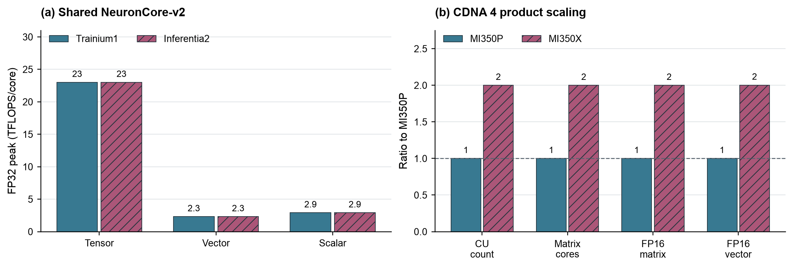
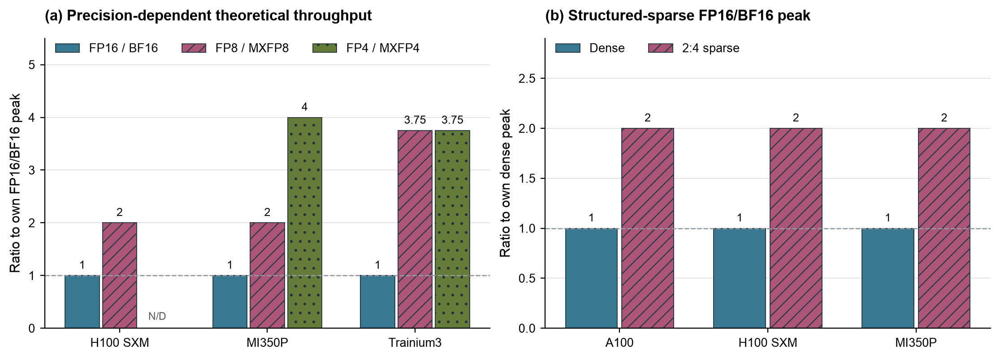
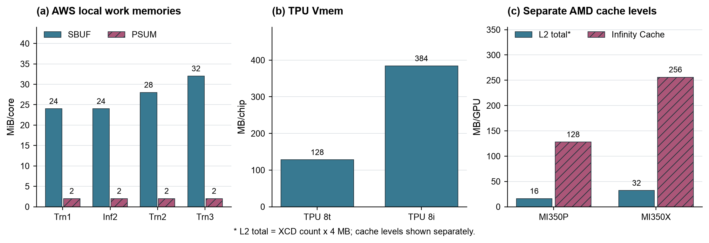
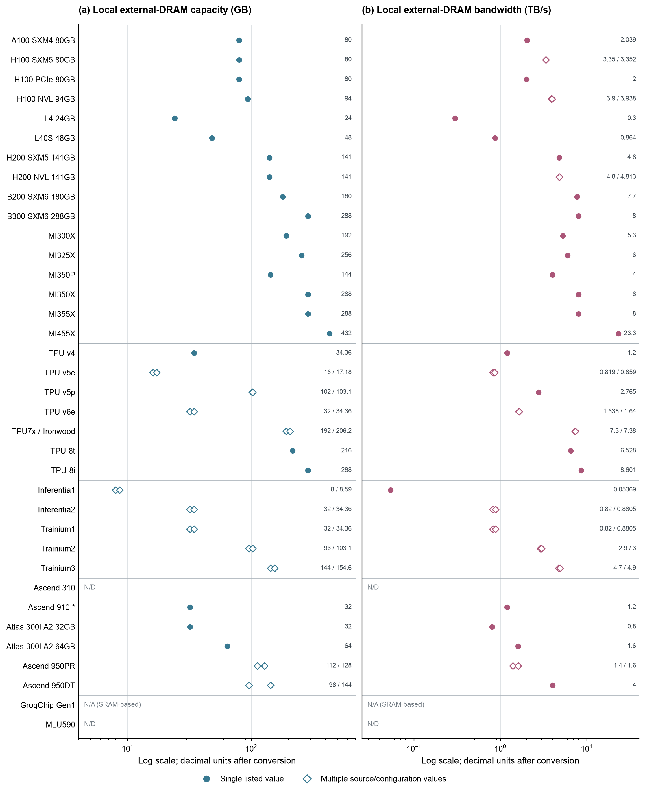
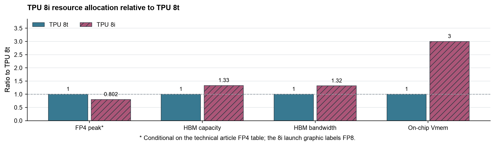
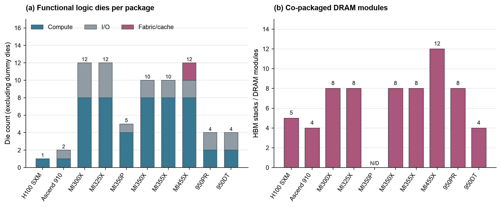
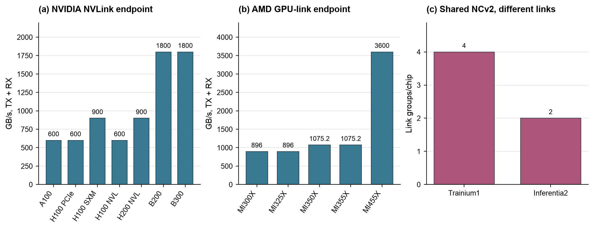
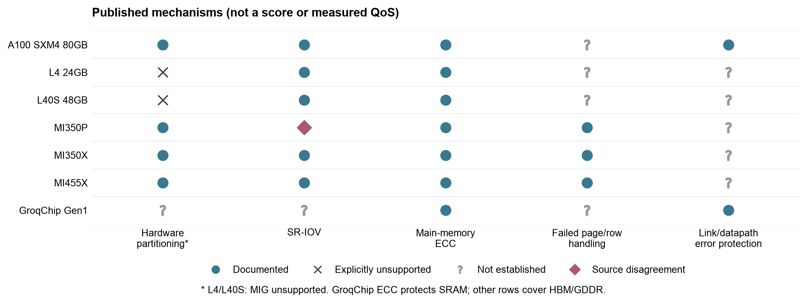
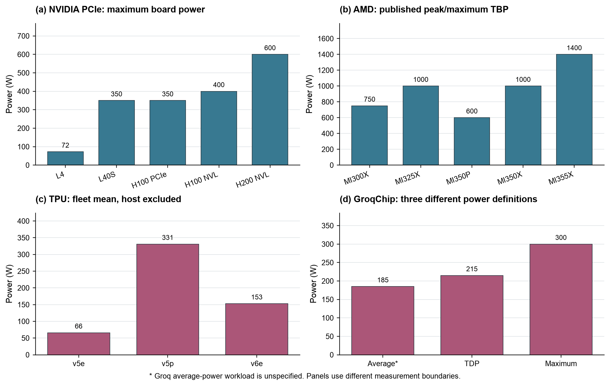

# 训练与推理芯片的架构比较

36 个产品 · 8 个维度 · 2026 年 9 月 17 日

本报告沿用预调研的负载视角与正式调研的产品范围，用现有产品详解中的证据重新比较。训练、prefill（处理输入并建立状态）和 decode（逐步生成 token）对资源的需求不同；“训练芯片”和“推理芯片”的产品名称，不能直接解释每项架构差异。

图中展示官方规格、文档明确的机制，以及注明基准的规格比值，没有新增性能实测。外部内存图列全 36 个产品，其余维度选择证据充分的同族产品或代表性样本。N/D 表示现有资料未确定，空缺不按零处理；跨代、跨厂商图用于展示设计范围，不用于归因或排名。

## 1. 计算组织：先区分核心变化与规模变化

图 1a：Trainium1 与 Inferentia2 使用相同的 NeuronCore-v2，三个引擎的单核 FP32 峰值一致。图 1b：MI350X 相对 MI350P 的计算单元、矩阵核心及两条 FP16 路径均约为 2 倍。CU 是 AMD 的计算单元；TFLOPS 表示每秒万亿次浮点运算。两个子图各自归一或计量，不横向比较绝对性能。

这两组产品分别说明：训练与推理可以共用计算核心；同一代产品的规格差距也可能主要来自资源数量。继续判断架构差异时，需要追踪引擎组成、数据路径和执行方式，不能把更多计算单元直接当成另一种架构。

图 1 数据与来源

[Trainium1](../产品详解/AWS/AWS_Trainium1_one_chip_产品详解.md)、[Inferentia2](../产品详解/AWS/AWS_Inferentia2_one_chip_产品详解.md)：各篇参考资料 [2]，NKI engine table / Tensor Engine，单位为 TFLOPS/core。[MI350P](../产品详解/AMD/MI350P.md)、[MI350X](../产品详解/AMD/MI350X.md)：各篇 [1]，GPU Specifications；以 MI350P 为 1，使用产品页公布的圆整数值计算，FP16 vector 比值为 144.2/72，图中约为 2。

## 2. 数值格式：低精度能力与稀疏能力分开比较

图 2a：各产品以自身 FP16/BF16 峰值为 1。FP8、FP4 分别采用 8 位和 4 位表示；MX 格式还包含分组共享缩放信息，各列不代表相同数值误差。图 2b：同一精度下，2:4 结构化稀疏要求每组四个位置满足两个非零的规定模式，图示稀疏峰值均为对应 dense（稠密）峰值的约 2 倍。

低精度路径同时出现在训练与推理产品中。Trainium3 公布的 MXFP4 与 MXFP8 峰值相同，也说明位数减半不必然令硬件吞吐再翻倍。稀疏图描述硬件的条件峰值；模型能否满足稀疏模式、格式转换和其他算子的开销，决定了端到端收益。

图 2 数据与来源

[H100 SXM](../产品详解/NVIDIA/NVIDIA_H100_SXM5_80GB.md)：[1]，Hopper 白皮书 pp.39-40；FP16/BF16 dense 989.4 TFLOPS、FP8 dense 1,978.9 TFLOPS，FP4 未在所用来源中确定。[MI350P](../产品详解/AMD/MI350P.md)：[1]，GPU Specifications；FP16、FP8、MXFP4 分别为 1,150、2,300、4,600 TFLOPS。[Trainium3](../产品详解/AWS/AWS_Trainium3_one_chip_产品详解.md)：[1] Compute、[3] Tensor Engine；BF16、MXFP8、MXFP4 分别为 671、2,517、2,517 TFLOPS。只在产品内部归一，不把不同厂商的 FP4/MXFP4 视为相同运算格式。

[A100](../产品详解/NVIDIA/NVIDIA_A100_SXM4_80GB.md)：[1] p.1，FP16/BF16 dense/sparse 为 312/624 TFLOPS。H100 SXM 为 989.4/1,978.9；MI350P 为 1,150/2,300。MI350P 的稀疏约束另见 [7] ISA 中的 2:4 A-matrix 条件。

## 3. 片上存储：容量必须对应到具体层级

图 3a：AWS 的 SBUF 保存工作数据，PSUM 保存部分和，按每核 MiB 分列。图 3b：TPU Vmem 按整颗芯片 MB 比较。图 3c：AMD 的 L2 与 Infinity Cache 分列；L2 总量由 XCD（计算裸片）数量乘每片 4 MB 得到。MiB 与 MB 的单位、每核与整芯片的范围均保留原文，不跨子图相加。

Trainium1 与 Inferentia2 的这两类单核工作存储相同；TPU 8i 的 Vmem 则是 8t 的 3 倍。后者是同代产品针对不同工作阶段调整资源的直接证据，但 Vmem 的具体管理语义仍未充分公开，不能将其改称 L2 cache。容量相同也不意味着访问带宽、共享范围和数据搬运方式相同。

图 3 数据与来源

[Trainium1](../产品详解/AWS/AWS_Trainium1_one_chip_产品详解.md)、[Inferentia2](../产品详解/AWS/AWS_Inferentia2_one_chip_产品详解.md)、[Trainium2](../产品详解/AWS/AWS_Trainium2_one_chip_产品详解.md)、[Trainium3](../产品详解/AWS/AWS_Trainium3_one_chip_产品详解.md)：各篇 [2]，NKI memory hierarchy / compute updates；SBUF 为 24、24、28、32 MiB/core，PSUM 均为 2 MiB/core。[TPU 8t](../产品详解/Google-TPU/Google_TPU_8t_one_chip_产品详解.md)、[TPU 8i](../产品详解/Google-TPU/Google_TPU_8i_one_chip_产品详解.md)：各篇 [1]，On-Chip SRAM (Vmem)，128/384 MB/chip。[MI350P](../产品详解/AMD/MI350P.md)：[2] p.2、[4] pp.9-10；[MI350X](../产品详解/AMD/MI350X.md)：[3] pp.9-10，分别按 4/8 XCD 计算 L2 总量。Infinity Cache 为 128/256 MB。

## 4. 外部内存：容量、带宽与计算供给分别看

图 4a：按厂商排列全部 36 个产品，左右分别为本地外部 DRAM 容量和带宽，采用对数横轴。GB、TB/s 均换算为十进制单位，原文使用 GiB 的数值按二进制换算。单值用实心圆点，多值统一用空心菱形，表示不同资料或配置的离散候选值，不是误差条；左右两侧的候选值也不能任意组合为一个配置。

B200 采用本清单的 180 GB 配置；B300 采用 288 GB 产品页及其“最高 8 TB/s”，未拼入 270 GB 表格中的其他规格。Ascend 910 的星号表示 32 GB 来自官方运行环境资料，证据层级不同于数据手册。GroqChip 为片上 SRAM 路线，外部 DRAM 项不适用；MLU590 等未确定项保留 N/D。

图 4b：以 TPU 8t 为 1，同一技术文章中的 TPU 8i FP4 峰值约为 0.80，HBM 容量约为 1.33，HBM 带宽约为 1.32，Vmem 为 3。HBM 是高带宽堆叠 DRAM。FP4 星号表示此处有条件地采用技术文章的精度标签；8i 发布规格图另标 FP8，且峰值的稠密/稀疏及累加条件尚不完整。

这组比例显示 8i 相对增加了存储供给，而矩阵峰值没有同向增加，符合官方对 decoding 资源需求的解释。它不能换算成“推理快多少”。计算峰值 P 除以带宽 B 只能在精度和计数条件一致时构成理论 Roofline 模型的转折点；实际瓶颈仍取决于负载每搬运一个字节要执行多少计算，以及数据复用情况。本报告不根据含糊的精度标签给出统一 P/B 排名。

图 4 数据、选值与来源

[36 产品逐项数据与引用](memory36.json)记录原始候选值、换算值、选值说明及对应产品详解。绘图数值仅为显示而舍入，数据文件保留计算精度。H100 PCIe 采用后期 2.0 TB/s，不并列早期 preliminary 2.039 TB/s；MI455X 采用型号专用资料与白皮书的 23.3 TB/s；Helios 托盘页另列 19.6 TB/s，保留来源冲突但不用于本图。950PR/DT 按产品族保留多档资源，Atlas 300I A2 两个容量版本仍沿用详解中“部分原文待重新取得”的限制。

[TPU 8t](../产品详解/Google-TPU/Google_TPU_8t_one_chip_产品详解.md)、[TPU 8i](../产品详解/Google-TPU/Google_TPU_8i_one_chip_产品详解.md)：[1]，TPU 8t and TPU 8i at a glance。图 4b 原始数值分别为 FP4 12.6/10.1 PFLOPS、HBM 216/288 GB、带宽 6,528/8,601 GB/s、Vmem 128/384 MB；同源相除。8i 精度标签冲突见其 [4] 发布规格图。

## 5. 裸片与封装：计算资源怎样拼成一个产品

图 5a：功能逻辑裸片按计算、I/O、fabric/cache 分类堆叠；I/O 指输入输出接口，fabric 指连接内部资源的互连结构。图 5b：同封装 DRAM stack 或模块另计。HBM 中多层存储裸片不算成多个 stack，机械填充裸片也不计入功能逻辑总数；MI350P 未确认的 stack 数量留空。

MI350P 与 MI350X 通过不同数量的计算、I/O 和存储资源形成不同规格；950PR 与 950DT 的主要逻辑裸片数量相同，周边存储配置却不同。因此，chiplet（小裸片）数量需要和资源归属一起读。数量本身不能代表训练或推理能力，也不能直接推算面积、良率和成本。

图 5 数据与来源

[H100 SXM](../产品详解/NVIDIA/NVIDIA_H100_SXM5_80GB.md)：[1] p.18；[Ascend 910](../产品详解/华为昇腾/华为_Ascend910.md)：[1] pp.25,37；[MI300X](../产品详解/AMD/MI300X.md)、[MI325X](../产品详解/AMD/MI325X.md)：CDNA 3 白皮书 Figure 2；[MI350P](../产品详解/AMD/MI350P.md)：[2] p.2；[MI350X](../产品详解/AMD/MI350X.md)、[MI355X](../产品详解/AMD/MI355X.md)：CDNA 4 白皮书 Figures 1,2；[MI455X](../产品详解/AMD/MI455X.md)：[4] Figures 3,8；[950PR](../产品详解/华为昇腾/华为_Ascend950PR.md)、[950DT](../产品详解/华为昇腾/华为_Ascend950DT.md)：[1] PDF p.12，Figure 3-1。各类裸片和 DRAM 数量完整列于 [绘图数据](chart_data.json)。

## 6. 设备互联：同一个核心也可以连接成不同系统

图 6a、6b：单位均为单设备端点收发合计 GB/s，即 TX + RX。AMD 前四款按七条对外 GPU 链路合计；MI455X 使用不同的 UALoE 协议路径，仅对照接口供给。图 6c：Trainium1 与 Inferentia2 分别有四组和两组 NeuronLink-v2，单位是组数，不能与前两图的带宽直接比较。

结合图 1，相同计算核心可以配不同互联资源。分析训练的梯度同步、MoE（混合专家模型）的 token 分发或分布式推理时，还需看拓扑、消息大小和集合通信实现。端点峰值无法说明整个通信组的持续吞吐和同步延迟。

图 6 数据与来源

[A100](../产品详解/NVIDIA/NVIDIA_A100_SXM4_80GB.md)：[1] p.1；[H100 PCIe](../产品详解/NVIDIA/NVIDIA_H100_PCIe_80GB.md)：[2] Table 6，采用 bridge 章节的 600 GB/s，保留产品简介 900 GB/s 的冲突；[H100 SXM](../产品详解/NVIDIA/NVIDIA_H100_SXM5_80GB.md)：[2] p.2；[H100 NVL](../产品详解/NVIDIA/NVIDIA_H100_NVL_94GB.md)：[1] Table 6；[H200 NVL](../产品详解/NVIDIA/NVIDIA_H200_NVL_141GB.md)：[1] Table 4-1；[B200](../产品详解/NVIDIA/NVIDIA_B200_SXM6_180GB.md)：[2] p.8；[B300](../产品详解/NVIDIA/NVIDIA_B300_SXM6_288GB.md)：[3] Table 2。

[MI300X](../产品详解/AMD/MI300X.md)：[8] pp.1-2；[MI325X](../产品详解/AMD/MI325X.md)：[3] Specifications；[MI350X](../产品详解/AMD/MI350X.md)、[MI355X](../产品详解/AMD/MI355X.md)：[3] p.13；[MI455X](../产品详解/AMD/MI455X.md)：[4] p.14。CDNA 3/4 按 7 × 128 / 7 × 153.6 GB/s 得到 896 / 1,075.2 GB/s，已经含双向。[Trainium1](../产品详解/AWS/AWS_Trainium1_one_chip_产品详解.md)、[Inferentia2](../产品详解/AWS/AWS_Inferentia2_one_chip_产品详解.md)：[2] device overview，NeuronLink-v2 组数。

## 7. 隔离与可靠性：比较明确机制，不给未知项打低分

图 7：圆点表示文档明确，叉号表示明确不支持，问号表示未确定，菱形表示来源版本存在分歧。硬件分区、SR-IOV（将设备接口提供为多个虚拟功能）、ECC（纠错编码）、故障页/行处理以及链路错误保护分别编码，不能累加为一个可靠性总分。

L4、L40S 的叉号特指官方明确不支持 MIG（NVIDIA 的硬件多实例分区），不能外推为没有任何资源管理方式。MI350P 的 SR-IOV 在产品页和手册中分别标为支持、未来支持。GroqChip 的 ECC 保护对象是 SRAM，不能与 HBM 的覆盖范围视为完全相同。现有证据足以比较已公开机制，尚不足以比较租户干扰、调度延迟或长期故障率。

图 7 数据与来源

[逐单元证据与原文位置](control.json)保留每个标记的来源。[A100](../产品详解/NVIDIA/NVIDIA_A100_SXM4_80GB.md)、[L4](../产品详解/NVIDIA/NVIDIA_L4_24GB.md)、[L40S](../产品详解/NVIDIA/NVIDIA_L40S_48GB.md)主要使用数据手册、架构白皮书与产品简介；[MI350P](../产品详解/AMD/MI350P.md)、[MI350X](../产品详解/AMD/MI350X.md)、[MI455X](../产品详解/AMD/MI455X.md)使用产品页及各代白皮书；[GroqChip](../产品详解/Groq/Groq_GroqChip_Processor_第一代.md)使用 Processor Datasheet。A100 的远程 page fault 与故障物理页处置不是同一机制，后者在本矩阵中保留未确定。此图没有将软件调度行为补写成硬件能力。

## 8. 功耗与部署：先对齐功率的定义

图 8a：NVIDIA PCIe 板卡最高功率；图 8b：AMD 公布的最高或峰值 TBP（整板功率）；图 8c：同一 TPU 生命周期研究报告的机群平均功率，不含主机；图 8d：GroqChip 的平均功率、TDP（热设计功耗）和最高功率。四个子图保留各自统计边界，不并成能效排行榜。

功率上限约束供电与散热配置，平均功率描述实际运行状态，两者回答的问题不同。TPU 图未控制为同一负载，Groq 的平均值也未公开完整测试条件，因此不能据此认定某款芯片更节能。要比较训练能耗或推理每 token 能量，还需要同模型、同质量目标下的完成时间或吞吐，并把主机与互联的功耗边界对齐。

图 8 数据与来源

[L4](../产品详解/NVIDIA/NVIDIA_L4_24GB.md)、[L40S](../产品详解/NVIDIA/NVIDIA_L40S_48GB.md)、[H100 PCIe](../产品详解/NVIDIA/NVIDIA_H100_PCIe_80GB.md)、[H100 NVL](../产品详解/NVIDIA/NVIDIA_H100_NVL_94GB.md)、[H200 NVL](../产品详解/NVIDIA/NVIDIA_H200_NVL_141GB.md)：各篇产品简介 Board Specifications / power 章节，取相应供电线缆及 sense 配置允许的最高功率。AMD 各篇 [1] Board Specifications；MI350P 取最高 600 W，其可配置的 450 W 不与最高值混用。

[TPU v5e](../产品详解/Google-TPU/Google_Cloud_TPU_v5e_one_chip_产品详解.md) [6]、[TPU v5p](../产品详解/Google-TPU/Google_Cloud_TPU_v5p_one_chip_产品详解.md) [7]、[TPU v6e](../产品详解/Google-TPU/Google_Cloud_TPU_v6e_one_chip_产品详解.md) [8]：Life Cycle 论文 Table 1，66/331/153 W。[GroqChip](../产品详解/Groq/Groq_GroqChip_Processor_第一代.md)：[2] v1.7 p.2，185/215/300 W，三项是不同定义，不构成误差范围。

## 这些比较能够支持什么判断

现有样本中，共用计算核心与针对工作阶段调整资源两种情况并存。AWS 的对照突出互联配置差异，TPU 8t/8i 的对照突出片上存储及内存供给的重新分配，AMD 同代型号展示了通过裸片和资源数量形成规格档位的方式。它们支持对具体产品对进行解释，尚不能证明所有训练芯片与推理芯片之间都存在一条统一的架构分界。

若继续验证性能差异，应固定模型和数值质量，将训练 step、prefill 与 decode 分开测量。训练看 step time 与扩展效率，prefill 看输入处理吞吐和首 token 延迟，decode 看给定并发下的每 token 延迟及吞吐；再用计算、访存与通信的实际占比解释上述资源差异。当前图中的规格比值不替代这些实验。

本报告保留了[预调研报告](../../前置调研/训练芯片与推理芯片架构差异总结报告.md)的负载分析视角，并以更新后的产品详解替代[正式调研第一版](../../99_归档/02_主线旧流程/历史比较分析/训练与推理芯片架构差异分析-第一版.md)中的旧规格比较。每张图提供 SVG、PDF、PNG；[绘图数据](chart_data.json)、[36 产品内存数据](memory36.json)与[机制矩阵证据](control.json)随报告保存。
