# 基于 36 个产品的训练与推理芯片架构差异分析（第一版）

> 资料截止日：2026 年 8 月 25 日  
> 比较对象：36 个具体 SKU 或厂商官方 per-chip 配置  
> 分析层级：Core、die/chiplet、package、外部 DRAM、功耗、设备互联与系统扩展  
> 证据范围：已完成的 36 张资料卡及其原始来源；不含测试条件统一的 benchmark 和芯片实测能耗

[36 个产品的逐项数据附录](训练与推理芯片架构差异分析-全量数据附录.md) · [可机器读取的 CSV](图表/36款芯片全量比较数据.csv)

## 技术摘要

现有 36 个产品没有呈现出两套彼此分离的训练和推理芯片架构。样本中有 6 个训练主定位产品、12 个推理主定位产品，另外 18 个由厂商同时用于训练和推理，或者没有排他的用途标签。Core 身份、执行模型、计算资源组织、低精度、结构化稀疏、计算 die 数量、外存容量与带宽、铭牌存算比、功耗和设备互联端点，都没有达到本文对“稳定差异”的要求。

Core 层的反证最直接。GH100/Hopper、NeuronCore-v2 和 Ascend 950 有相同 die 或相同 Core 实现跨用途使用的证据；Ada SM 与 CDNA 4 CU 也跨用途进入不同产品。Trainium1 与 Inferentia2 采用相同的两颗 NeuronCore-v2、片上存储、计算峰值和 HBM 配置。片上数据管理也没有沿用途分裂：硬件 cache 加显式 local/shared memory、编译器管理 local store 加显式搬运都跨训练、推理和共用产品出现，分类首先对应厂商架构路线。现有产品的训推分化更常发生在 Core 使能数量、HBM、功耗档、板卡形态和系统工作域，较少表现为重新设计一套训练 Core 或推理 Core。

单一家族仍能看到明确的 workload 专用化。TPU 8i 相比 TPU 8t 将 Vmem 从 128 MB 增至 384 MB，HBM 容量提高 33%，带宽提高约 32%，FP4 峰值降低约 20%，并用 CAE 处理片内归约和同步。这是目前最完整的推理侧专用化实例。AWS NeuronCore-v2 和 NVIDIA H200 的相反证据说明，该做法还没有跨厂商复现为稳定规律。

scale-up 工作域是唯一在严格训推配对中重复出现同一方向的指标。TPU 8t/8i 为 9,600/1,024，Trainium1/Inferentia2 为 16/12。只统计公开数值工作域并排除 roadmap target 后，训练组中位数为 4,096，推理组为 8，混合对象上的描述性 Cliff's delta 为 0.63。不过训练高位主要来自 Google Pod 路线，bridge、服务器、Pod 和 rack 又属于不同系统边界。这个效应量不能当作架构效应，本文只把它归为有方向但仍受厂商和系统形态混杂的差异。

按下面的证据规则，当前没有一个 Core、die 或单设备资源指标满足“稳定差异”。报告能较有把握地说明哪些常见说法没有得到数据支持，也能指出 TPU 8 系列和 scale-up 工作域这两个值得继续验证的方向。

## 样本和比较方法

用途分层保留厂商原始表述，再归入训练主定位、推理主定位、训推共用或非排他三组。第三组不能删去：它包含大量直接跨用途使用的 GPU、TPU 和云内芯片，正是检验训推架构是否分裂的证据。颜色只帮助阅读，不把三组预设成自然形成的硬件类别。

分析先看同厂商、相近年代、共享 Core 或共享 die 的产品，再检查同一方向能否在独立厂商中复现。跨厂商分布用于显示重叠、反例和异常值，不用于证明用途标签造成了硬件差异。

| 报告用语 | 使用条件 |
|---|---|
| 稳定差异 | 至少两个独立厂商或架构家族在对象和条件可比时方向一致，并且没有同等证据的反例 |
| 混杂差异 | 全样本看似分离，家族内对照显示厂商、年代、性能档位、部署环境或产品形态更能解释结果 |
| 未见稳定差异 | 可比产品出现重合、相同或方向相反；结论只限于当前样本 |
| 证据不足 | 少于两个独立家族可比，或者公开对象、单位、精度、功耗和互联口径无法统一 |

芯片、裸片、package、加速卡、服务器和 Pod 始终分层处理。GroqChip 的 80 TB/s 属于片上 SRAM，不进入外部 DRAM 图；系统聚合带宽不下放到单芯片；roadmap target 使用空心点。公开缺失记录为未公开或未找到，不以相邻型号补值。

### 先确定应汇总的指标

指标范围不能由当前 CSV 已有的列反推。本报告由四类本地资料共同定义指标范围：[资料卡模板](../../../芯片调研/资料卡/模板.md)规定芯片事实和对象层级；[前置分析模板](../../../前置调研/芯片训练推理差异分析模板.md)和[前置总结](../../../前置调研/训练芯片与推理芯片架构差异总结报告.md)定义 workload、状态和架构后果；[早期 AI Core 主题调研](../../../../调研-训练推理芯片调研/调研v4/主题分析/03_AI_core内部差异.md)、memory、互联和可靠性专题补足设计问题；[Codex v3 指标定义](../../../../调研-训练推理芯片调研-codex-v3/methodology/metric-definitions.md)和[比较规则](../../../../调研-训练推理芯片调研-codex-v3/methodology/comparison-rules.md)提供派生指标及可比性口径。Codex v3 只用它的定义和 schema，不沿用当时未完成样本的比较结论。

按这四类资料，报告需要汇总下面这套原始指标和派生指标。少数宣传规格不足以支撑这个课题。

| 层级 | 必须汇总的原始指标 | 可做的比较或派生指标 |
|---|---|---|
| 对象与 workload | SKU/版本/日期、对象层级、厂商定位、目标 workload、吞吐/时延/容量/能效/扩展目标 | 厂商、年代、部署、性能档位和可比家族分层 |
| Core 执行与资源 | Core/IP 共享关系、执行模型、调度、矩阵单元数/阵列形状、向量/SIMD、标量/控制、实际使能资源和时钟 | 物理 M:V:S 比；同 SKU、同精度、同 dense 条件的矩阵/非矩阵吞吐比 |
| 数值与非矩阵路径 | 输入/权重/乘积/累加/输出格式、scale、舍入/饱和、dense/sparse、SFU、归约、Top-K、transpose、embedding 和搬运引擎 | 格式支持和累加语义分布；专用单元类型与家族对照 |
| 片上存储与数据流 | register/accumulator、local SRAM/scratchpad、shared SRAM/cache/LLC、管理语义、数据驻留、DMA/预取/压缩、重算/分页 | 同物理层级容量对照；片上容量/矩阵单元或峰值 |
| Die/chiplet/package | 计算与 I/O die 数、满配资源、工艺/面积/晶体管、NoC、controller/PHY、HBM/interposer/基板、D2D 拓扑/链路/方向/带宽、package RAS | 计算 die 组织；按物理对象去重的 PPA；D2D 带宽/峰值 |
| 外部存储 | 介质、容量、带宽、stack/bus/controller、方向、一致性/远程访问/显式搬运语义 | P/B、B/P、C/P；同家族容量和带宽方向；结合 workload 后的状态适配比 |
| 主机和设备互联 | PCIe/CXL、设备直连端点、每设备注入带宽、方向/payload/持续值、collective offload | 端点注入/计算峰值；按 endpoint/bridge/raw-pin 对象分层 |
| Scale-up 与 scale-out | 工作域、拓扑、交换结构、度数/跳数/二分带宽/延迟/集合通信/故障域；集成 NIC/DCN 端点 | bridge/server/Pod/rack 分层后比较；小消息、all-to-all 和扩展效率需实测 |
| 功耗、散热、部署和 RAS | TDP/TBP/典型/上限/fleet average、功耗档、冷却和形态；ECC/SDC、重放/隔离/降级、分区/虚拟化、故障域 | 部署分层后的功耗分布；同口径性能/W；长作业和尾延迟需外部验证 |
| Workload 与系统验证 | 训练前向/反向/更新、prefill、decode、MoE 的状态、shape、batch、序列、并行和软件版本 | MFU/HFU/MBU、TTFT/TPOT/ITL、goodput、可持续带宽、实际流量、扩展效率和单位工作能耗 |

最后一行属于架构推断的外部验证层，不属于芯片事实卡。服务器 benchmark 不能倒灌为芯片属性。更细的原子指标、派生公式和当前 36 张卡的处理状态见[全量数据附录“应汇总的指标与当前处理”](训练与推理芯片架构差异分析-全量数据附录.md#应汇总的指标与当前处理)。

### 当前已经形成的汇总

按上述范围核对后，下表说明当前已经形成哪些统计，以及哪些只能保留原文或证据边界。这张表是覆盖状态，不是指标范围本身。

| 层级 | 已汇总的资料卡字段 | 可用于比较的样本 | 正文证据形式 |
|---|---|---:|---|
| Core | Core 身份、执行模型、矩阵/向量/标量资源、时钟、实际使能资源和分精度峰值 | Core 身份 36；执行组织 33；时钟字段 32、其中数值时钟 19；分精度峰值 32；物理 M:V:S 9；完整同精度三路吞吐 4；宽口径矩阵/非矩阵吞吐 13 | Core 家族图、执行模型图、物理 M:V:S 表、完整三路与宽口径吞吐配比图；时钟分口径，全部峰值原文进入附录 |
| Core 数值路径 | 输入格式、累加/输出语义、结构化稀疏、稀疏/embedding、归约、搬运、特殊数学和媒体单元 | 精度路径 35；累加/输出语义 22 有程序员可见证据；结构化稀疏 18 确认、1 明确不采用 | 36 产品精度矩阵、累加证据栏、专用机制矩阵 |
| 片上存储与数据流 | register/local store、scratchpad、PSUM、L1/L2、Vmem、SBUF、Infinity Cache、整片 SRAM、DMA/MTE/TMA 和管理语义 | 27 个产品至少有一个层级的容量数字；34 个有局部存储或搬运原文；36 个均保留管理与搬运分类或缺口；4 个有数字 DMA headline | 同物理层级家族对照、全量数据管理模型图、搬运机制与 DMA 数值表；不同层级不求跨产品总量 |
| die/package | 计算 die 数、工艺、面积、晶体管、package 组成、NoC、controller/PHY、D2D、RAS | 11 单逻辑计算 die、2 一颗计算 die + 辅助 die、10 多计算 die、13 物理组织不足；工艺 21；2 个 chip-to-chip 绝对值、1 个 package bisection 绝对值、2 个相对量；RAS 36 项分层 | 四类 die 组织图、工艺/年份图、RAS 证据图；NoC 按 SKU 与去重实现分开，controller/PHY 与 D2D 逐产品列原文和证据层级 |
| SKU 存储与计算 | 主存介质、容量、带宽、分精度峰值、P/B、B/P、C/P、内存访问语义 | 主存介质 36；外部 DRAM 容量与带宽 33；同精度派生比值 22、其中严格 dense/base 15；访问语义 23 项有专门记录 | 介质分类统计、DRAM 散点、P/B 峰值图、P/B-C/P 资源配比图、访问语义分类表；B/P 作为 P/B 倒数只保留数据 |
| 功耗与部署 | 部署类别、产品形态、散热、功耗值和口径 | 部署/形态 36；功耗 24；散热方式 17 项明确、5 项只知形态或由系统决定 | 按部署分组的功耗图，另列 12 个缺失和六类功耗口径 |
| 互联 | host 接口、设备端点、名义端点带宽、collective 层级、scale-up 拓扑/工作域、scale-out 上下文 | 设备端点 35；正数名义带宽 20；scale-up 数值域 28；scale-out 严格 package/SKU 端点 1 项，另有 1 项 per-NPU 服务器配置未确认 NIC 位置 | 端点全量分类与带宽图、scale-up 工作域图、scale-out 证据层级表 |

面积、晶体管、NoC、memory controller/PHY、D2D 持续带宽和 RAS 不能因为样本少就从正文消失；但这些字段也不能为了“有图”而把不同物理对象强行放到同一数值轴上。正文在相应章节给出公开数量、具体对象和不能比较的原因，精确原文保留在全量附录。

## Core 架构跨用途使用，没有形成训练核和推理核两条路线

第一张图只回答 Core 问题。36 个产品按 Core 实现或公开架构家族排列，训练、推理和训推共用放在三列。左侧证据分为相同 die 与 Core、相同 Core 与芯片资源组织、同一公开 Core 架构，以及没有跨定位对照四种情况。

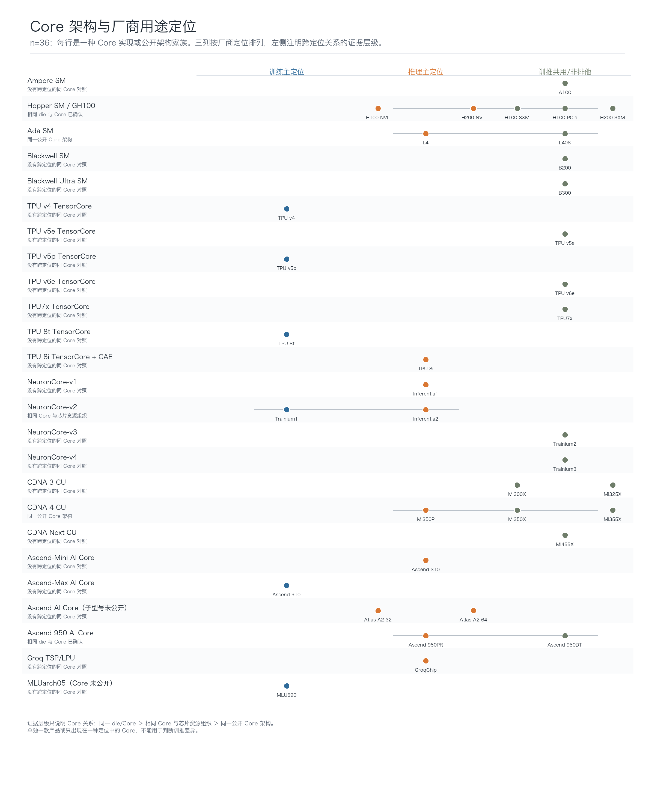

五个家族直接跨越了用途定位。H100/H200 的五个 SKU 使用 GH100/Hopper SM；推理主定位的 H100 NVL、H200 NVL 与训推共用的 SXM、PCIe 产品共享 die。Trainium1 与 Inferentia2 共享 NeuronCore-v2 以及芯片级 DMA、CC-Core 和片上存储组织。Ascend 950PR 与 950DT 共享 Ascend 950 die 和 AI Core。MI350P、MI350X、MI355X 采用 CDNA 4 CU 的公开架构，L4 与 L40S 则采用 Ada SM 家族；后二者只能证明公开 Core 架构相同，不能推出物理版图相同。

执行模型另行统计，避免把它埋在 Core 名称里。33 个可分类产品中，GPU SIMT/wavefront 为 16 个，systolic + vector/scalar 为 12 个，Cube + vector/scalar 和 SPMD + SIMD/SIMT 各 2 个，静态空间调度 1 个；Atlas A2 两个 SKU 和 MLU590 没有足够的执行模型资料。

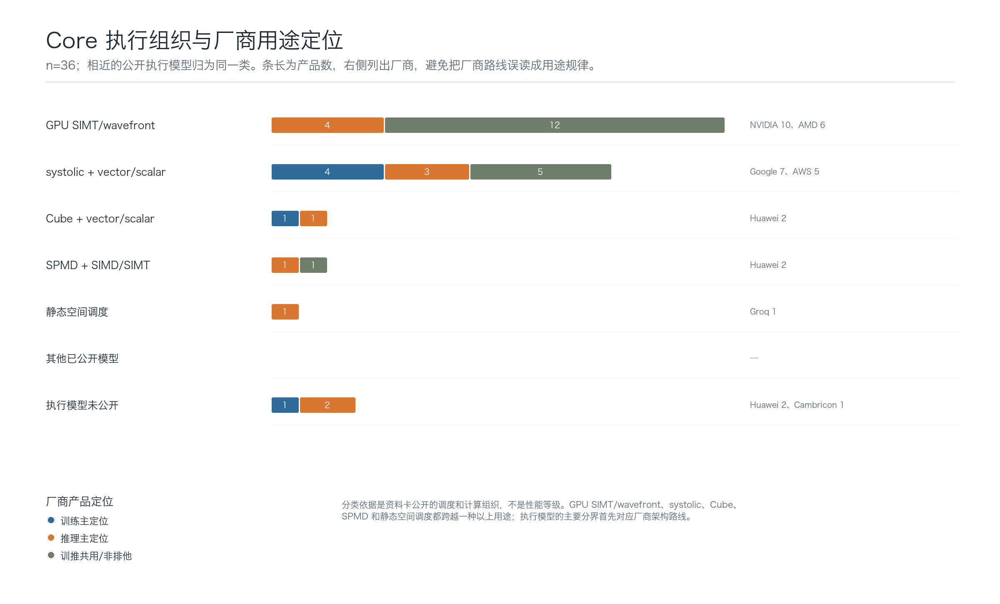

NVIDIA 和 AMD 的 16 个 GPU 式产品覆盖推理和训推共用，Google/AWS 的 12 个 systolic 产品覆盖训练、推理和共用。Cube 路线只来自华为，静态空间调度只来自 Groq，都是厂商与用途完全或高度共线的单一路线，不能据此归因。执行模型的全量分布支持“厂商路线强于用途分界”，结论属于未见稳定差异。

### Core 数量随产品档位和形态变化

不同厂商的 SM、MXU、NeuronCore、CU 和 AI Core 不是同一种计数，不能横向求均值。28 个产品公开了相对完整的主要计算资源，7 个只有部分信息，MLU590 未公开。可用证据适合家族内比较：

| 可比产品 | Core 与计算资源 | 同时变化的条件 | 结论 |
|---|---|---|---|
| [Trainium1](../../../芯片调研/资料卡/AWS/产品/AWS_Trainium1_one_chip_资料卡.md) / [Inferentia2](../../../芯片调研/资料卡/AWS/产品/AWS_Inferentia2_one_chip_资料卡.md) | 都是 2 个 NeuronCore-v2、32 个 DMA、6 个 CC-Core | 训练与推理定位改变 | Core 数量和组织相同 |
| [TPU v5p](../../../芯片调研/资料卡/Google-TPU/产品/Google_Cloud_TPU_v5p_one_chip_资料卡.md) / [TPU v5e](../../../芯片调研/资料卡/Google-TPU/产品/Google_Cloud_TPU_v5e_one_chip_资料卡.md) | v5p 有 2 个 TensorCore、8 个 MXU；v5e 有 1 个 TensorCore、4 个 MXU | 产品档位、HBM、功耗和系统规模一同变化 | 训练侧更多资源，无法从产品档位中剥离 |
| [MI350P](../../../芯片调研/资料卡/AMD/产品/AMD_Instinct_MI350P_PCIe_卡资料卡.md) / [MI350X](../../../芯片调研/资料卡/AMD/产品/AMD_Instinct_MI350X_288GB_资料卡.md) | 4/8 XCD，128/256 CU，512/1,024 Matrix Core | PCIe/OAM、600/1,000 W、HBM 容量和带宽一同变化 | 表面方向与档位、形态混杂 |
| H100/H200 SXM、PCIe、NVL | 共享 GH100；部分 SKU 的实际使能数未公开 | 板卡形态、功耗和互联域变化 | 不能把使能差异归因于用途 |

现有对照同时出现相同、训练侧更多和无法确认三种结果。“训练产品 Core 更多”属于混杂差异。

### 时钟不能按一个“GHz”字段横向比较

36 张资料卡中有 32 张单列了时钟字段，但只有 19 个产品公开数值。19 个数值又不是同一物理量：5 个给 base + boost，2 个只给 boost 或峰值计算时钟，2 个给 per-chip/product operating point，4 个 Neuron 产品分别给 Tensor、Vector、Scalar 和 GpSimd engine 时钟，6 个 AMD 产品给 peak engine clock。另有 13 个明确写明数值未公开，4 个资料卡没有单列。把“有时钟字段”写成“32 个时钟样本”会高估可比性，本版已在 CSV 和附录中拆开。

家族内能做的对照很有限。Trainium1 与 Inferentia2 的 Tensor、Vector、Scalar 和 GpSimd engine 时钟分别同为 2.8、1.12、1.4 和 1.4 GHz，训练与推理没有变化；CDNA 4 的 MI350P 与 MI350X 都是 2.2 GHz peak engine clock，MI355X 提高到 2.4 GHz 时用途仍为共用。NVIDIA 的 base/boost、Tensor 峰值计算条件和实际持续频率不能互换；Google TPU 除 v4 的 1.05 GHz per-chip clock 外，多数产品未公开数值。当前证据只能支持“同 Core 家族可以跨用途保持相同时钟”，不能推出训练或推理侧普遍更高，结论是证据不足。

### 矩阵、向量和标量配比没有沿用途分开

矩阵、向量和标量的配比要拆成两种口径。物理单元数 M:V:S 只在定义一致的家族内比；吞吐比只在同一 SKU、同一精度、dense、理论峰值和同一产品范围都一致时计算。物理资源数和吞吐能力不混成一个比值。

物理计数有 9 个安全样本。TPU v4、v5e 和 v5p 的 MXU:VPU/vector:scalar 都是 4:1:1，v6e 为 2:1:1；但 v6e 的 MXU 是 256×256，前三者为 128×128，所以单元数比不是算力比。AWS 的 Inferentia1/2 和 Trainium1/2/3 每个 NeuronCore 都各有一套 Tensor、Vector 和 Scalar Engine，物理比为 1:1:1；NCv2 以后的 GpSIMD 是额外路径，不并入 Vector 数。TPU 与 NeuronCore 的 4:1:1 和 1:1:1 也不能跨厂商解释为面积、吞吐或利用率差异。TPU 8t/8i 虽公开了 MXU、VPU+Vmem、XLU 和 TCS，8t 的全芯片使能范围与部分单元职责仍不完整，因此不强行生成数字比。

完整的同精度 Matrix:Vector:Scalar 吞吐更少，只有 4 个 AWS 产品可以在每 Core FP32 理论峰值上对齐。Inferentia2 与 Trainium1 都是 23:2.3:2.9 TFLOPS，即归一到 Vector 后为 10:1:1.26；Trainium2 为 20:1:1.2，Trainium3 为 16.67:1:1。Inferentia1 的 Vector:Scalar 只能得到每周期 256:512，Tensor 路径缺少同一时钟口径，不能拼成完整三路比值。

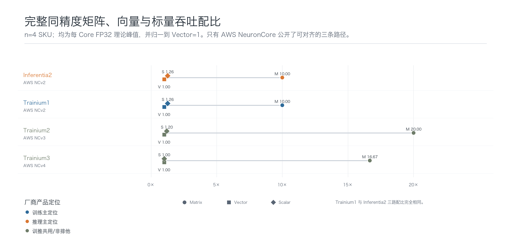

Trainium1 与 Inferentia2 的用途标签相反，三路吞吐、各 engine 时钟、SBUF/PSUM 和 DMA 配置却相同。这是对“训练与推理会形成不同 M:V:S 配比”的直接反例。Trainium2/3 的变化又发生在后续代际和共用定位中，无法归因于训练或推理。

把标量路径拿掉后，可得到一个更宽的 13 产品矩阵/非矩阵同精度样本。其中 10 个有厂商直接标注的 Vector 路径，3 个 NVIDIA 产品只能使用官方 non-Tensor 峰值作为非矩阵代理值，图中以空心点区分。这个样本混有 FP16、BF16 和 FP32，只用于各产品内配比和家族方向，不做跨厂商均值。其余 23 个或缺少向量吞吐，或精度和路径口径无法对齐，不会因为需要“全量图”就伪造数值。

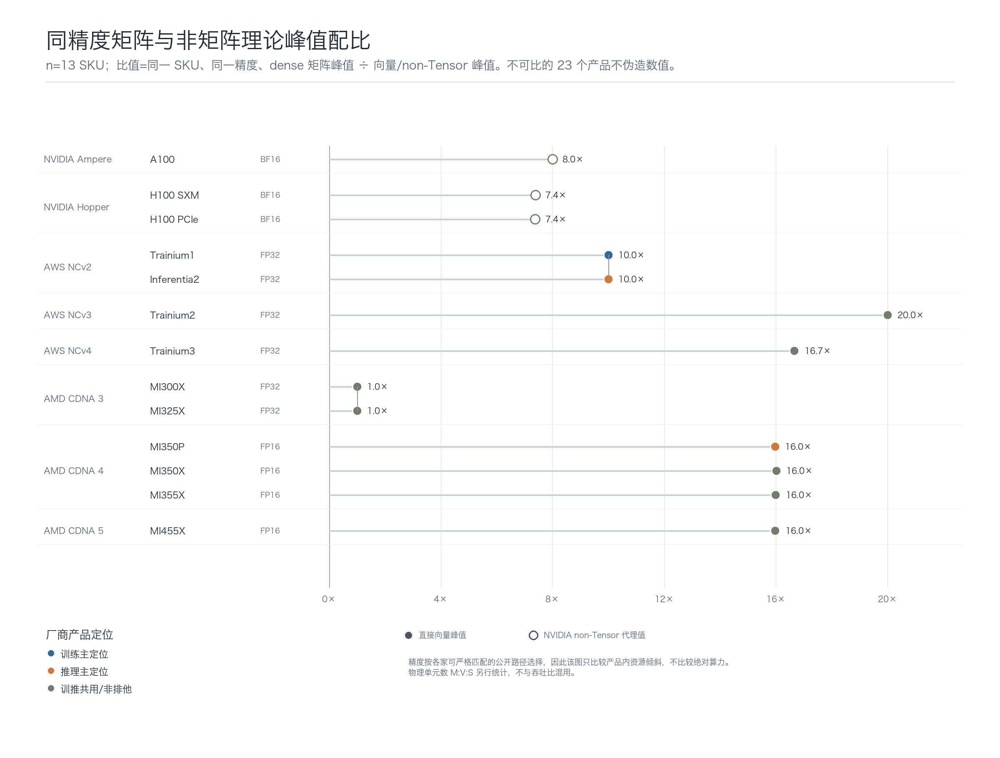

家族内的证据不支持“训练芯片矩阵/向量比更高”或反方向规律。Trainium1 与 Inferentia2 都采用 NeuronCore-v2，每核 FP32 Tensor/Vector 为 23/2.3 TFLOPS，比值都是 10×。AWS 后续共用产品在代际上变为 20× 和 16.7×。AMD CDNA 3 的 FP32 Matrix/Vector 为 1×，CDNA 4 的同精度 FP16 比值约为 16×，而 CDNA 4 同时覆盖推理主定位的 MI350P 和训推共用的 MI350X/MI355X。NVIDIA A100 与 H100 的 BF16 Tensor/non-Tensor 约为 8× 和 7.4×，这两代均是训推共用产品。数值对厂商、代际和精度路径很敏感，对用途标签不敏感，当前结论是“未见稳定差异”。9 个物理资源比、4 个完整三路吞吐比、13 个宽口径矩阵/非矩阵比，以及 36 个产品的原始 Core 行、时钟和分精度峰值都已进入附录。

### 片上存储有专用化实例，跨产品统计仍不成立

36 个产品中，24 个至少有一个片上层级的完整容量数字，3 个有部分层级数字但其他关键层级未公开，7 个只公开了存储对象或层级，2 个连可稳定分类的片上存储证据也不足。这里不能把 register、PSUM、L1/L2、Vmem、SBUF、Infinity Cache 和整片 SRAM 相加，因此图只保留四组物理层级与作用域一致的家族对照。

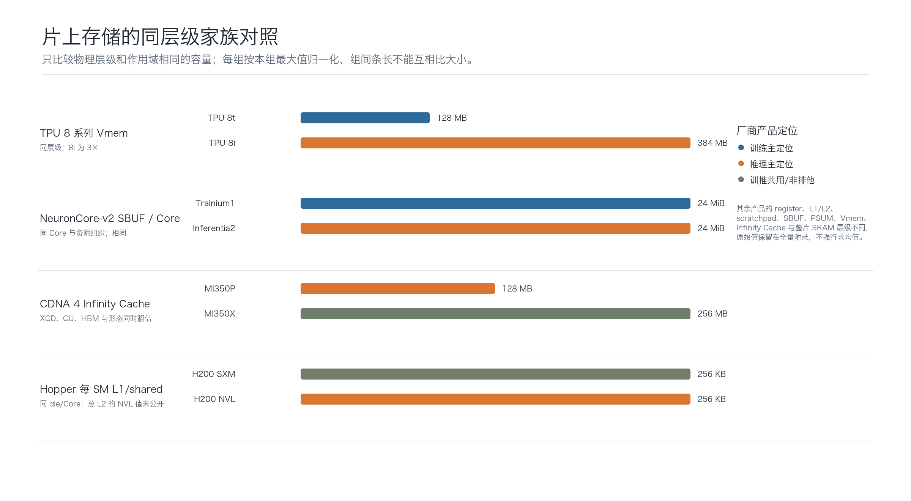

TPU 8i 的 384 MB Vmem 是最强的推理侧片上状态证据，为 TPU 8t 的 3 倍；其 CAE 还处理两个 TensorCore 之间的 reduction 和 synchronization。GroqChip 另有 230 MB 全局共享片上 SRAM 和 80 TB/s 片上带宽，但它没有同家族训练产品，不能与 TPU Vmem 或 GPU cache 直接比较。

反例来自同样清楚的家族对照。Trainium1 与 Inferentia2 每个 NeuronCore-v2 都有 24 MiB SBUF、2 MiB PSUM 和相同 GpSimd local RAM；H200 SXM 与 NVL 共享每 SM 256 KB L1/shared-memory 组织。MI350P/X 的 Infinity Cache 从 128 MB 增至 256 MB，但 XCD、CU、HBM 和板卡形态也同时翻倍。当前数据只支持“增加片上状态是 decode 专用化的一种实现”，对推理芯片是否普遍拥有更多片上存储仍属证据不足。

容量之外，36 个产品还按 cache/local store 的管理语义和数据搬运方式归类。20 个产品采用硬件 cache 加显式管理的 local/shared memory，9 个采用编译器或软件管理的 local store 加显式搬运，3 个确认 local store 存在但管理语义未公开，GroqChip 是单独的静态编译路由共享 SRAM/stream；Atlas A2 两个 SKU 和 MLU590 的证据不足。分类使用了 34 个产品的局部存储或搬运原文，其余产品保留缺失，不由存储名称猜测管理方式。

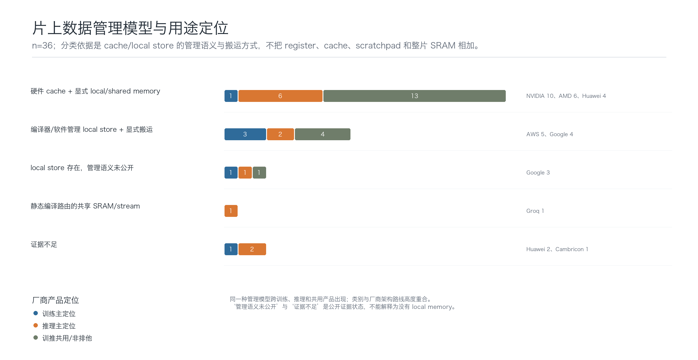

前两类都跨训练、推理和共用产品出现。硬件 cache 加显式 local/shared memory 的 20 个样本由 NVIDIA、AMD 和 Huawei 构成；编译器管理 local store 的 9 个样本全部来自 Google 与 AWS。图中的主要分界因此是 GPU/Ascend 与 TPU/Neuron 的厂商架构路线，不是训练与推理。TPU 8t/8i 的 Memory and DMA Interconnect 已公开，Vmem 的 cache/scratchpad 管理语义却仍未公开，不能为了完成分类而补写。片上数据管理模型属于混杂差异。

数据搬运另按机制统计，不能把专用机制图中的“7 个特定搬运单元”误读成只有 7 个产品有 DMA。Hopper TMA 覆盖 5 个产品；TPU v4/v5p/7x 与 Inferentia2、Trainium1/2/3 共 7 个产品采用软件或编译器控制的 HBM-local DMA；Ascend 310/910/950PR/950DT 采用 MTE 或显式 local path；TPU 8t/8i 公开 Memory and DMA Interconnect 但未公开管理和带宽；Groq 使用静态 streaming，MI455X 公开 TDM。另有 15 个产品能确认 load/store/cache 路径，却没有足够的具名搬运或吞吐证据，MLU590 证据不足。

严格数值只剩 AWS 四款的 chip-level DMA headline：Inferentia2 与 Trainium1 都为 1 TB/s，Trainium2 为 3.5 TB/s，Trainium3 为 4.9 TB/s；方向、payload 和持续值仍不完整。训练与推理的 NCv2 再次相同，后续变化又与代际、Core 数和 HBM 同时发生。数据搬运没有表现出稳定用途差异。

### 精度支持、累加路径和结构化稀疏都没有沿用途分界

精度矩阵覆盖全部 36 个产品。明确记录 FP64 的有 14 个，FP32/TF32 输入或计算路径 22 个，BF16 和 FP16 各 26 个，8-bit float family 24 个，FP6 family 6 个，FP4 family 11 个，INT8 27 个，INT4 3 个。FP32 只作为累加或输出类型出现时，不计入 FP32 输入/计算支持；空白只表示资料卡未见公开支持，不能解释成硬件不支持。

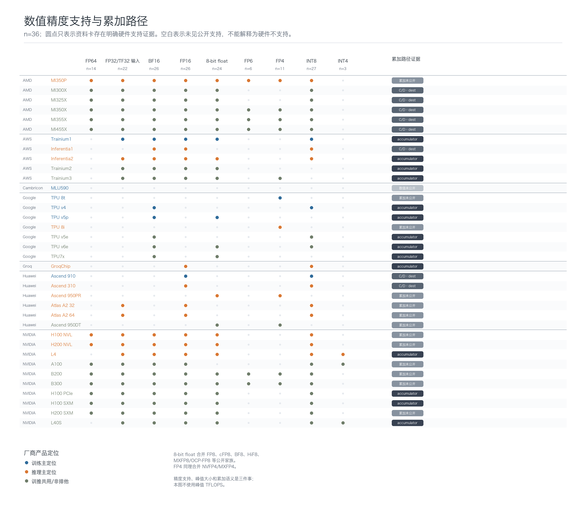

精度支持与峰值条件分开统计。32 个产品有 per-product 理论峰值，4 个没有。9 个产品同时给出多精度 dense/sparse 和同精度非矩阵直接值或代理值，5 个给出明确 dense/sparse 但没有同精度非矩阵路径，4 个只有 sparse/with-sparsity headline，14 个虽然有峰值，dense/sparse、FMA、累加或计数条件却不完整。FP4、INT8、BF16/FP16 的单位和数据通路也不同，因此不生成“最高算力”总榜。全部 32 个产品的分精度原文、dense/sparse 与累加条件保留在附录。

低精度没有形成“推理独有”的集合。11 个明确 FP4 产品中，训练 1 个、推理 3 个、训推共用 7 个；24 个 8-bit float 产品中，训练 2 个、推理 6 个、共用 16 个。TPU 8t/8i 都支持 FP4，Trainium1/Inferentia2 具有同一组 cFP8、FP16、BF16、TF32、FP32 和 INT8 路径，Blackwell 与 CDNA 4 的 FP4/FP6/FP8 family 进入训推共用产品。格式支持与用途高度重叠，属于未见稳定差异。

累加证据按资料卡显式映射，不再从“累加”关键词猜测。14 个产品明确给出 accumulator 类型，8 个只公开 C/D 或 destination 类型；另有 13 个累加语义未公开，MLU590 连硬件数值链也未公开。22 个有程序员可见证据的样本中，训练、推理和共用产品分别为 4、5、13 个。C/D 或 destination 类型不等于物理 accumulator 位宽，TPU 8t/8i 的文本也明确写的是累加细节未公开。现有样本不支持把 FP32/INT32 累加当作训练专属特征。

结构化稀疏必须与 SparseCore、CAE、CC-Core、TMA、媒体编解码等机制分开统计。18 个产品明确支持矩阵结构化稀疏，1 个 GroqChip 明确不采用 pruning/sparsity，17 个未找到或未公开；18 个确认样本由 14 个共用和 4 个推理产品组成，没有训练主定位产品，但 A100、Hopper、Blackwell 和 AMD 产品本身又用于训练。这个分布反映产品标签与公开口径，不构成“训练不需要稀疏”的证据。

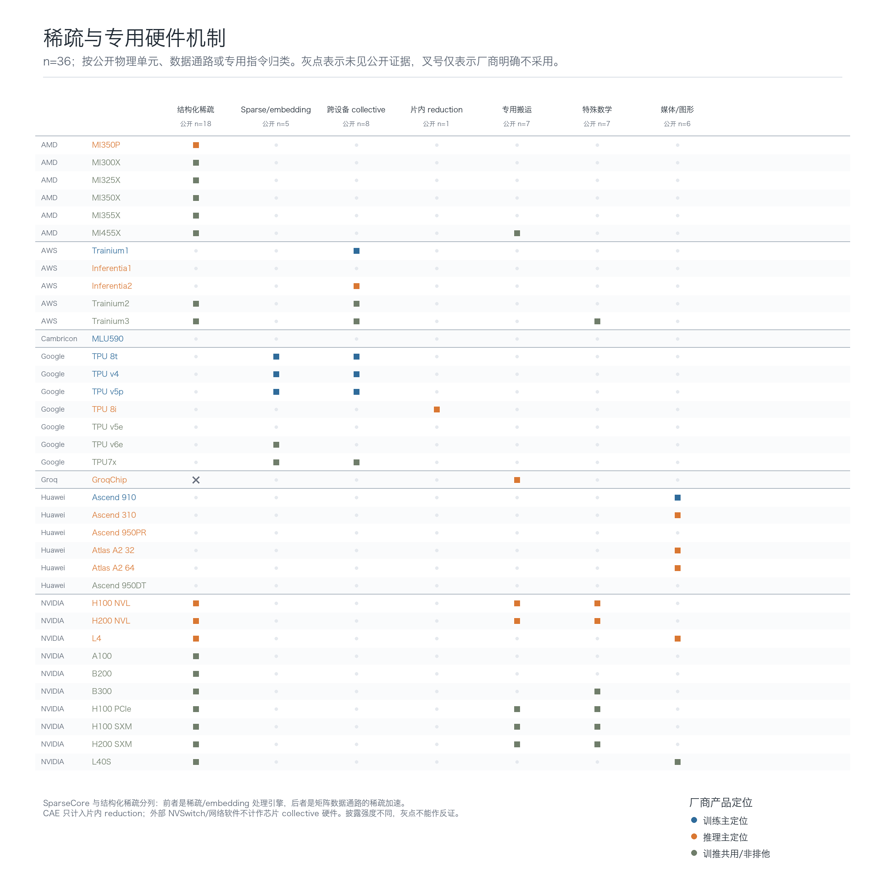

SparseCore/embedding、跨设备 collective、片内 reduction、专用搬运、特殊数学和媒体/图形单元在图中分别成列。TPU 8i 的 CAE 只算片内 reduction，NVSwitch 上的 SHARP 不算芯片内 collective。各列都存在用途重合或明显的厂商披露偏差，因此“推理芯片专用单元更多”没有可重复的统计支持；TPU 8t/8i 的 SparseCore/CAE 替换仍是当前最清楚的家族内专用化证据。

## 计算 die 和 chiplet 的表面分布受年代与厂商路线影响

计算 die 分类只统计承担主要 AI 计算的 die 或 chiplet，但不能因此把含 I/O/SerDes 辅助 die 的 package 写成“单 die”。本版分成四类：11 个单逻辑计算 die，TPU 8t 与 Ascend 910 两个“一颗计算 die + 辅助 die”，10 个多计算 die/chiplet，13 个物理组织不足。HBM stack 和 dummy die 不计作计算 die。

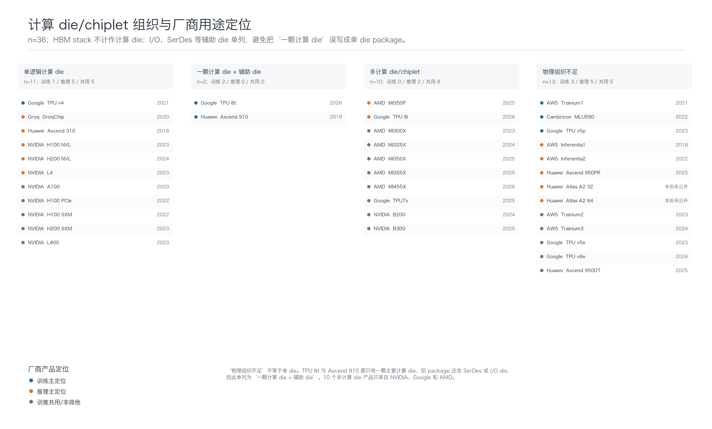

多计算 die 类包含 8 个训推共用产品和 2 个推理产品，没有训练主定位产品。这个表面结果不能直接解释为训练不适合 chiplet。10 个多计算 die 产品全部来自 NVIDIA、Google 和 AMD，发布时间集中在 2023 至 2026 年；6 个训练主定位样本中，TPU v4 为单逻辑计算 die，TPU 8t 和 Ascend 910 是一颗计算 die 加辅助 die，TPU v5p、Trainium1 和 MLU590 的物理实现不足。用途、年代、厂商和公开程度没有被独立控制。

同一物理路线也跨用途出现。Blackwell 双计算 die、AMD XCD/IOD、TPU7x 双 compute chiplet 和 TPU 8i 双 on-core die 覆盖推理与训推共用；TPU 8t 则采用一颗 logic chiplet 加独立 ICI/SerDes chiplet。chiplet 更直接地响应 reticle、良率、HBM/IO 数量、封装带宽和产品规模。当前分布属于混杂差异。

工艺节点在 21 个产品中明确。图按首次公开年份逐项列出，节点在横轴上按类别等距排列，不能把 foundry 的“4 nm”和“3 nm”当成可线性相减的物理量。

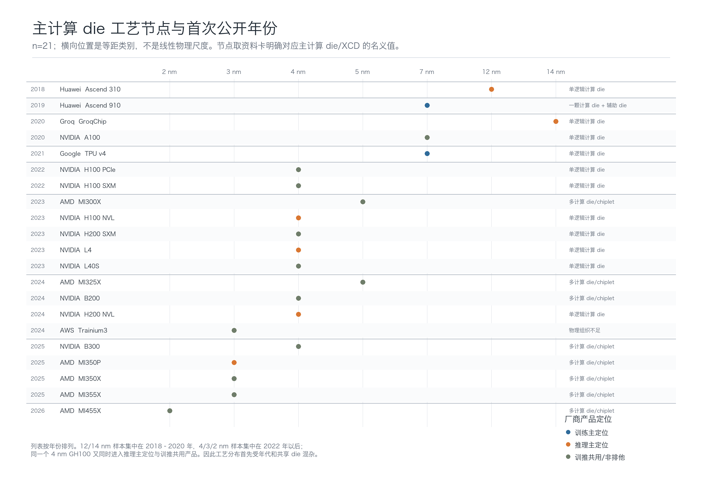

12/14 nm 样本集中在 2018 至 2020 年，4/3/2 nm 样本集中在 2022 年以后。GH100 的 TSMC 4N 同时用于训推共用和推理 NVL 产品；CDNA 4 的 3 nm/6 nm 组合同时用于 MI350P、MI350X 和 MI355X。Ascend 310 的 12 nm 与 GroqChip 的 14 nm 又和早期年份、边缘或独立 ASIC 部署重合。工艺差异属于年代和共享 die 混杂。

面积与晶体管不能照抄 10 或 17 个 SKU 行做分布。GH100 的 814 mm²/80B 被五个 SKU 重复引用，B200/B300 的 208B 是双 die GPU，MI455X 的 320B 是整个多 chiplet 产品，TPU v4 的面积还是小于 600 mm² 的上界。去除重复实现并按物理主语分层后，独立面积对象只有约 6 个，不足以检验训推差异；原值仍逐项保留在附录。

D2D 先按适用性拆开：11 个单逻辑 die 产品的“逻辑 die 间 D2D”不适用，14 个产品可确认存在逻辑 die 间连接，另外 11 个因 package 组织不足而未知。在确认存在的产品中，B200/B300 公开 NV-HBI 10 TB/s，MI355X 公开 5.5 TB/s advanced-package bisection；TPU7x 和 MI350X 只有相对量。TPU 8t/8i、多款 AMD 产品、Ascend 910 与 Ascend 950PR/DT 只公开连接、协议或 physical channel。chip-to-chip、package bisection 和相对代际值不是同一对象，无法画成统一带宽排名。

NoC 和 memory controller/PHY 也已逐项统计，但原来的“定量或数量事实”分类过宽。NoC 有公开结构的 12 个 SKU 只对应 8 个独立实现：Ascend 910 与 Groq 有拓扑或带宽数值，Ascend 310 只有 512-bit 宽度，其余 9 个 SKU 只是层次或连接事实，其中 GH100 又被五个 SKU 复用。GH100 的 GPC/SM-to-SM network、TPU 8t/8i 的 Memory and DMA Interconnect、Ascend 910 的 4×6 mesh 和 Groq stream-register 通路都进入附录，但不能作为 12 个独立数值样本。

memory controller/PHY 的原始行混合了 stack 数、controller 数、bus width、stack height 和 SerDes 标签。有 25 张卡至少提供一种物理数量事实，但这些计数的分母不同，不是 25 个同类数值样本。附录因此将原文保留到逐产品表，并把 stack、实际 controller、bus width、stack height 与 SerDes 分列统计；最终 HBM 带宽也不用于反推未公开的 controller 或 PHY。这个维度仍属证据不足。

RAS 资料按具体机制重新列出：18 个产品公开了至少一种芯片或 package 机制，B200 只公开 RAS Engine 名称而没有功能语义，11 个明确未公开核心 RAS，3 个只有管理、安全或系统层线索，3 个资料卡没有单列。具体机制中，ECC 有 17 个产品，row/page repair、remap 或 logic repair 有 9 个，link detection/replay 有 3 个，明确 BIST/SDC mitigation 的只有 TPU7x。保护对象又分为 HBM/GDDR、cache/register、full-chip、片上 SRAM 和设备链路，不能求一个“RAS 总分”。secure boot、root of trust、Confidential Computing、gBMC、Pod 绕障和服务器 PSU 冗余均不计作芯片 RAS 机制。

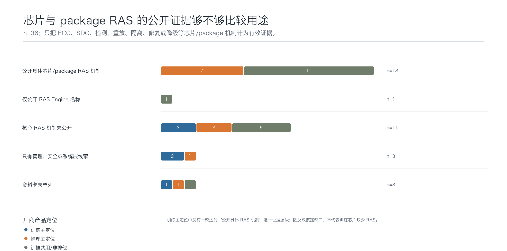

18 个具体机制样本由 7 个推理和 11 个共用产品组成，训练主定位为 0；6 个训练产品中，3 个明确未公开核心机制，2 个只有管理或系统层线索，1 个没有单列。这个分布首先说明披露不对称，不能反过来证明训练芯片缺少 RAS。17 个 ECC SKU 也只对应约 10 个架构家族实现，GH100、CDNA 和 Atlas A2 的多个 SKU 不能重复当作独立证据。长时间训练的 silent data corruption、checkpoint/restart 和降级运行，与在线推理的故障隔离和尾延迟影响，还需要统一 workload 与系统实测才能验证。当前 RAS 结论仍是证据不足。

## 外部 DRAM 容量和带宽没有分开训练与推理产品

36 个产品的主存介质先单独统计：30 个使用 HBM family，2 个使用 GDDR，2 个使用 DDR/LPDDR，GroqChip 使用片上 SRAM，MLU590 未公开。HBM 的 30 个样本包括 5 个训练、8 个推理和 17 个共用产品，没有形成用途分界。GDDR、DDR/LPDDR 和片上 SRAM 看似偏向推理，但它们分别与低功耗/图形卡、早期云芯片/edge SoC 和 Groq 静态架构重合，属于部署、年代和厂商路线混杂。

33 个产品同时公开了外部 DRAM 容量和带宽。图中每个点对应一款 SKU 或 per-chip 配置，颜色表示用途定位，形状表示内存类型，灰线连接预先定义的同厂商可比家族。

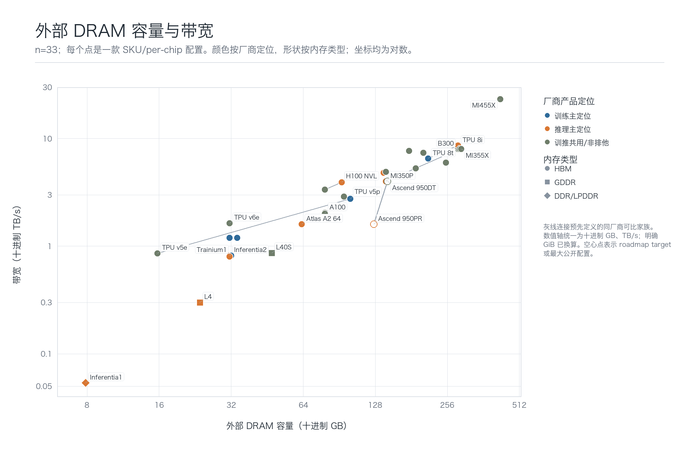

排除 roadmap target 后，训练主定位的 5 个样本容量中位数为 34.36 GB、带宽中位数为 1.2 TB/s；推理主定位的 10 个样本分别为 79 GB 和 1.6 TB/s；17 个训推共用或非排他产品则达到 144 GB 和 4.9 TB/s。训练与推理的 Cliff's delta 在容量上为 0.00、带宽上为 0.06，分布几乎没有整体分离。共用组最高，主要因为最新高端 GPU、TPU 和 Trainium 都进入该组。

家族内方向并不一致：

| 可比产品 | 外部 DRAM | 与用途同时变化的条件 | 数据支持的解释 |
|---|---|---|---|
| [TPU 8t](../../../芯片调研/资料卡/Google-TPU/产品/Google_TPU_8t_one_chip_资料卡.md) / [TPU 8i](../../../芯片调研/资料卡/Google-TPU/产品/Google_TPU_8i_one_chip_资料卡.md) | 216/288 GB，6.528/8.601 TB/s | TensorCore 数、Vmem、CAE、FP4 峰值和系统域 | serving 侧容量与带宽更高，是强专用化实例 |
| [Trainium1](../../../芯片调研/资料卡/AWS/产品/AWS_Trainium1_one_chip_资料卡.md) / [Inferentia2](../../../芯片调研/资料卡/AWS/产品/AWS_Inferentia2_one_chip_资料卡.md) | 32/32 GiB，820/820 GiB/s | Core 和片上资源也相同 | 没有存储差异 |
| H200 SXM / H200 NVL | 141/141 GB，4.800/4.813 TB/s | SXM 与 PCIe/NVL 形态、功耗和工作域 | 推理定位没有带来外存变化 |
| MI350P / MI350X | 144/288 GB，4/8 TB/s | XCD、CU、功耗和 PCIe/OAM 档位 | 资源翻倍与产品档位混杂 |
| Ascend 950PR / 950DT | 最大 128/144 GB，1.6/4 TB/s | 950DT 同时覆盖 decode 和 training | 不能归为单纯推理方向 |

同用途内部也能产生同等幅度的变化。MI300X 到 MI325X 在用途和 CU 数不变时，HBM 从 192 GB 增至 256 GB、带宽从 5.3 增至 6 TB/s；Atlas A2 的 32/64 GB 两个推理 SKU，容量和带宽都相差 2 倍。外存容量和带宽属于“未见稳定差异”。

内存访问语义不能由容量和带宽替代。36 个产品中，9 个记录了跨设备寻址或远程访问语义，6 个采用显式搬运或软件管理，2 个明确为 package 内 coherent GPU，2 个记录跨设备 coherence，4 个公开其他访问语义；7 个明确未公开，6 个资料卡没有单列。可见机制包括 GPU peer/common address space、Blackwell package 内 coherent GPU、TPU 的 globally addressable 或独立 chiplet HBM、Neuron 的显式 DMA/SBUF/PSUM 与 memory pooling、Ascend SHMEM，以及 Groq 的 compiler-managed partitioned global address space。它们分别处理 coherence、显式搬运、远程寻址和软件管理，现阶段只能做机制分类和家族对照，不能压成一个“统一内存能力”分数。全量原文见附录的计算峰值与外部内存表。

### 铭牌存算比的严格样本不足以做训推组间比较

22 个产品同时具有外部 DRAM 带宽和公开 BF16/FP16 矩阵峰值。15 个明确为 dense/base，7 个没有完整说明 dense/sparse 或计数规则。H100 NVL、H200 SXM/NVL 只有 with-sparsity headline，TPU v4 的标签为“BF16 或 INT8”，因此没有进入这张图。

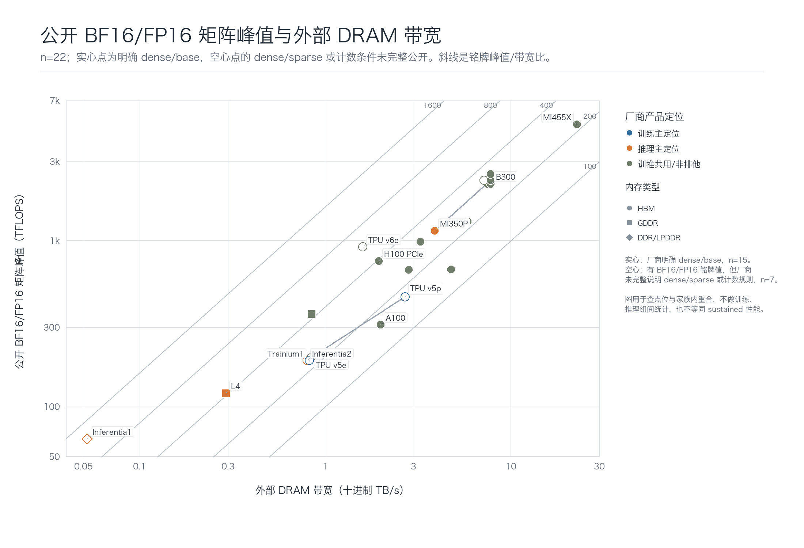

15 个严格点中没有训练主定位产品，不能计算训练和推理组的中位数或效应量。家族对照给出三个方向：TPU v5p/v5e 约为 166/229 TFLOPS/(TB/s)，训练强调侧更低；TPU 8t/8i 在相同 FP4 标签下约为 1.93/1.17 PFLOPS/(TB/s)，训练侧更高；Trainium1/Inferentia2 都约为 232。该比值属于铭牌峰值除以峰值带宽，不代表 workload operational intensity、持续性能或 roofline 拐点。现有证据归入证据不足。

P/B 只回答峰值算力相对外存带宽的配置，不能代替容量配比。本版同时计算 B/P 和 C/P：B/P 是 P/B 的倒数，只写入 CSV 和附录，不作为第二个独立证据；C/P 是外存容量除以同精度铭牌峰值。下图把 22 个可计算 BF16/FP16 产品放在 P/B-C/P 平面，15 个严格 dense/base 点用实心表示，7 个条件不完整点用空心表示。

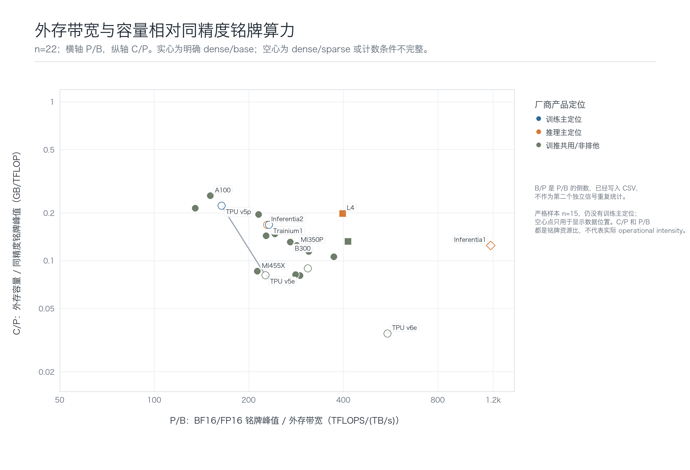

严格样本仍没有训练主定位，不能形成训推组间结论。家族内结果再次显示配比不由用途单独决定：Trainium1 与 Inferentia2 的 P/B 都是 231.7、C/P 都是 0.168 GB/TFLOP；MI350P 与 MI350X 的 P/B 约为 287.5/288.7、C/P 约为 0.125/0.125，尽管产品形态、Core 数、HBM 和用途标签不同；TPU v5p/v5e 的 P/B 与 C/P 同时变化，但它们的档位、Core 数和系统规模也一同变化。C/P 只描述铭牌资源配置，不能用来推断模型是否装得下、KV cache 容量或训练状态占用；这些判断还需要模型、batch、序列长度、优化器和并行方式。结论仍是证据不足。

## 功耗的主要分界是部署和产品档位

24 个产品有数字化功耗，另外 12 个保持未公开。24 个数值中，TDP 3 个，TBP/board power 8 个，maximum/configurable limit 8 个，Google fleet/production average 4 个，Ascend 310 只有产品功耗 headline 1 个。图按部署类别分组，避免把 8 W edge SoC、标准 PCIe 卡、云内芯片和 1,400 W 高密度模组放在同一个用途均值中解释；这些口径也不合并成峰值/W 能效排名。

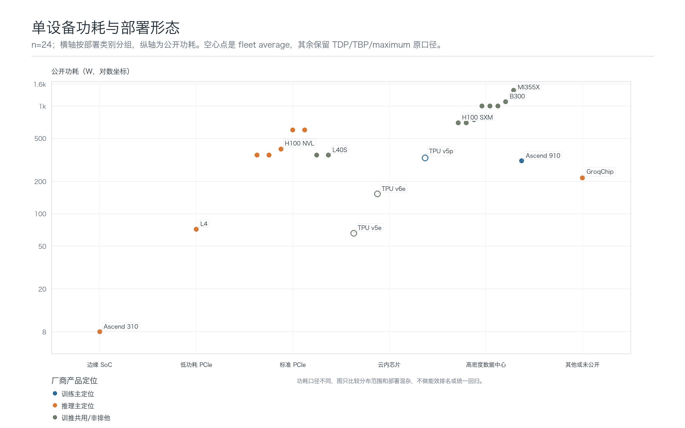

按用途分组，训练主定位只有 3 个功耗样本，范围为 170 至 331 W，中位数 310 W；8 个推理样本跨越 8 至 600 W，中位数 350 W；13 个训推共用样本为 66 至 1,400 W，中位数 700 W。共用组高位由最新高端 SXM/OAM 模组贡献，推理组同时包含 Ascend 310、L4、Atlas A2、H200 NVL 和 MI350P，内部跨度达到两个数量级。

部署分组更容易解释这些数值。边缘 SoC 为 8 W，低功耗 PCIe 为 72 W，标准 PCIe 的 7 个样本中位数为 350 W，4 个云内芯片的公开值都是 fleet average，中位数为 161.5 W；高密度数据中心的 10 个样本中位数为 875 W，GroqChip 的 TDP 为 215 W。H100 SXM/NVL 为 700/400 W，H200 SXM/NVL 为 700/600 W；MI350P/X 为 600/1,000 W，MI350X/MI355X 在 Core、HBM 和用途相同的情况下仍有 1,000/1,400 W 两个功耗档。

散热方式与产品形态分开统计：17 个产品明确给出液冷/冷板、被动散热或主动/风冷，5 个只说明模组形态或由系统决定，14 个未公开。B200/B300 的 HGX/OEM 系统配置不下放为模组固定散热方式；MI350P 和两款 Atlas A2 的卡级被动/风冷则保留。液冷和高功耗主要随高密度板与 rack 部署出现，被动散热主要随 PCIe 卡出现。它与功耗和形态形成一条部署约束链，不能作为独立的训练/推理标志。功耗差异属于混杂差异。

同精度铭牌峰值除以功耗也已逐产品计算并保留在附录，但不做统一能效排名。只有 12 个产品同时具备明确 dense/base 的 BF16/FP16 峰值和数字功耗，而且其中没有训练主定位；功耗分母又混有 TDP、TBP 和 maximum/configurable limit。H100 SXM/PCIe 的 700 W maximum 与 350 W TBP、B200 的 maximum 与 B300 的 TDP 都不能视为同一实验条件。这个派生值能核对厂商同口径 SKU，不能替代实测单位工作能耗，当前属于证据不足。

## 设备端点未见稳定差异，scale-up 工作域保留方向性信号

host 接口、设备端点、芯片内 collective、外部交换、scale-up 和 scale-out 分层记录。30 个产品能确认物理接口，其中 PCIe Gen3/4/5/6 分别为 2/5/16/1 个，MI455X 为其他 CPU-GPU 接口，另有 5 个只确认 PCIe、代际或通道不完整；6 个未公开或未单列。接口代际与年份、板卡和云部署共同变化，没有形成用途分界。

35 个产品有设备端点描述或明确无专用端点：NVLink 8 个、ICI 7 个、NeuronLink 5 个、Infinity Fabric/UALoE 5 个、华为设备互联 2 个、RealScale C2C 1 个、其他端点 1 个、明确无专用端点或只有 PCIe 6 个，MLU590 未公开。20 个产品有正数名义值，17 个能从资料卡确认双向或 per-direction 口径；MI300X、MI325X 和 MI350X 的聚合值没有在对应行明确方向。剩余不可比因素是端点对象和数值主语：其中 3 个是外接 bridge 配置，1 个是 raw pin aggregate，1 个是 per-EAM aggregate，其余为设备集成端点；payload 与持续带宽仍未统一。另有 9 个只能确认端点存在而不能安全归一。

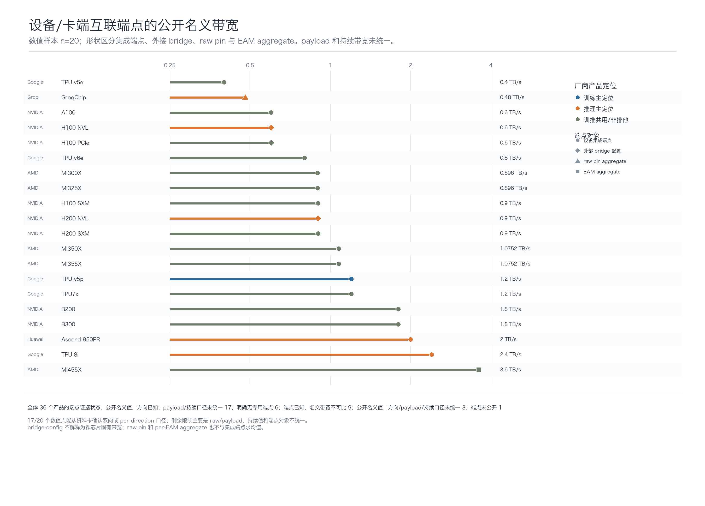

这张图显示公开量级，不做跨厂商均值或排序。H200 SXM 的约 0.9 TB/s 是集成端点，H200 NVL 的约 0.9 TB/s 依赖 bridge 配置，两者不会因数值相同就视为同一物理对象。推理主定位的 TPU 8i 有 2.4 TB/s 双向 ICI，训推共用的 MI455X 有 3.6 TB/s per-EAM scale-up aggregate；高带宽端点跨用途出现。6 个“无专用端点/仅 PCIe”产品实际是 Ascend 310、L4、L40S、MI350P 和两款 Atlas A2，其中 5 个为推理主定位、1 个为共用产品，主要对应低功耗或标准 PCIe 形态，因此仍是部署混杂。

设备端点注入相对计算的派生比值也已核对。严格条件要求产品集成端点、方向已知、换成 per-direction 带宽，并使用明确 dense/base 的同 SKU 峰值；bridge、raw-pin、EAM aggregate 和方向不明值全部排除。36 个产品中只有 A100、H100 SXM、B200、B300 和 MI355X 共 5 个满足，全部是训推共用产品。它们的单向端点带宽/同精度峰值分别约为 0.962、0.455、0.409、0.409 和 0.214 GB/s/TFLOP。这个子集只能描述 NVIDIA/AMD 的产品路线，不能比较训练与推理，因此不另画主图，逐产品数值和证据条件保留在附录。

collective 也按物理层级统计。8 个产品有芯片/Core 内的跨设备 collective offload：TPU v4/v5p/7x/8t 的 SparseCore，以及 Inferentia2、Trainium1/2/3 的 CC-Core。TPU 8i 的 CAE 只负责片内两个 TensorCore 的 reduction/synchronization；H100/H200/B200/B300 的 SHARP 或 NVSwitch 位于外部交换系统。把这三类合并会错误地制造“collective 单元数量”指标。当前 8 个芯片内 offload 样本覆盖 4 个训练、1 个推理和 3 个共用产品，没有形成推理侧优势。

scale-up 图将 28 个公开数值工作域与 5 个明确无专用 scale-up、3 个工作域未公开的产品分开。Ascend 310 只有“无公开 scale-up”证据，归入未公开，没有继续当作数值 1。Ascend 950DT 的 16-NPU 域属于 roadmap target，以空心点表示。

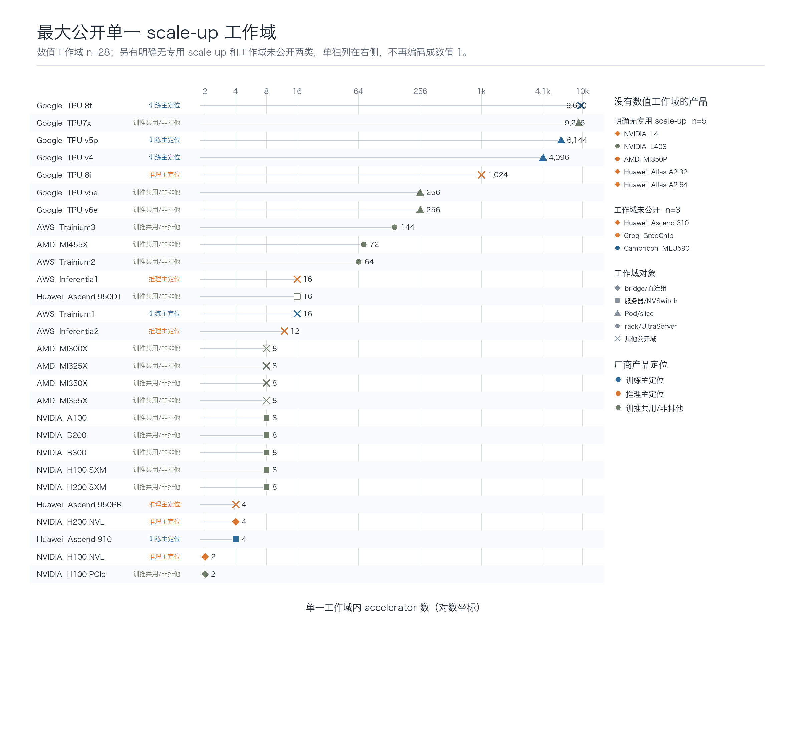

排除 roadmap target 后，训练主定位 5 个数值样本的中位数为 4,096，推理主定位 6 个为 8，训推共用或非排他 16 个也为 8。训练与推理的 Cliff's delta 为 0.63，但这个数把 bridge、服务器、Pod 和 rack 混在同一有序变量上，只能作为样本描述，不能解释成架构效应。严格训推配对中，TPU 8t/8i 为 9,600/1,024，Trainium1/Inferentia2 为 16/12，方向相同；Google 两款训练 TPU 又占据 4,096 和 6,144 的高位。

效应幅度主要由 Google Pod 路线贡献。拓扑分类进一步显示，8 个 mesh/torus 样本中有 4 个训练、4 个共用；8 个交换/分层 fabric 样本中有 7 个共用、1 个推理；5 个全连接样本全部为共用；3 个 bridge/点到点样本中有 2 个推理。用途分布随厂商系统路线和工作域对象改变。bridge、服务器/NVSwitch、Pod/slice 和 rack 的 accelerator 数只表示最大单一公开域，不代表拓扑性能。当前证据支持“训练主定位与更大 scale-up 域相关”，同时保留明显的厂商和系统形态混杂。

scale-out 的证据比 scale-up 更弱，不能用系统网卡数字填芯片表。严格 package/SKU 端点只有 MI455X 一项：单 EAM 600 GB/s bidirectional UALink。Ascend 950DT 另有 per-NPU 400 Gbps unidirectional UBoE/RoCE 服务器配置，但 NIC 是否位于 package 内没有确认，不能与 MI455X 合并为两个芯片端点样本。另有 15 个只有 EFA、DCN、InfiniBand/Ethernet、RoCE 或 rack/cluster 系统上下文，H100 SXM 1 个属于发布期 roadmap network target，9 个明确未记录独立端点，8 个资料卡未单列，MLU590 只有软件多机 API。严格样本为 1，无法比较用途，结论是证据不足。

## Workload 和 benchmark 只能验证架构推断

36 张资料卡没有标准化 benchmark 行，这是有意保留的对象边界。训练 step、prefill、decode 和 MoE 的实际表现属于模型、shape、batch/concurrency、并行方式、设备数、拓扑、软件版本和功耗模式共同决定的系统结果，不能除以设备数后回填成芯片属性。厂商定位和系统案例也不能替代这些条件。

静态 P/B 只有和同一次 workload 的执行量与 HBM 实际流量结合后，才能判断计算或带宽约束：workload operational intensity 应使用实际执行 FLOP 除以实际 HBM byte，而不是铭牌峰值相除。端点同理，需要分别记录 TX/RX 实际流量和持续单向带宽，不能用 TX+RX 除以双向 headline。功耗则必须与同一次运行绑定，推理可计算 token/J、TTFT、TPOT、ITL 和 goodput，训练可计算每 step 能耗、MFU/HFU 和收敛或质量约束下的有效吞吐。

当前结构化数据中，满足同 workload、同 scope、同软件和同功耗条件的标准化记录为 0。这个结果不说明这些芯片没有实测成绩，只说明现有 36 张事实卡不足以用 benchmark 裁决训练与推理的因果差异。报告因此把 workload/benchmark 保留为下一阶段验证层，不用系统成绩修补 Core、die、存储或互联的公开缺口。

## 资源聚类更接近厂商和部署路线

聚类只使用 27 个同时具有外部 DRAM 容量、带宽和公开数值 scale-up 工作域的当前产品。容量、带宽和工作域取 log10 后标准化；用途标签不进入特征，明确无专用 scale-up 也不再编码成数值。K=2 至 5 的 silhouette 分别为 0.43、0.43、0.43、0.40，K=3 的分数为 0.43，没有出现明显优于相邻 K 的自然分类。

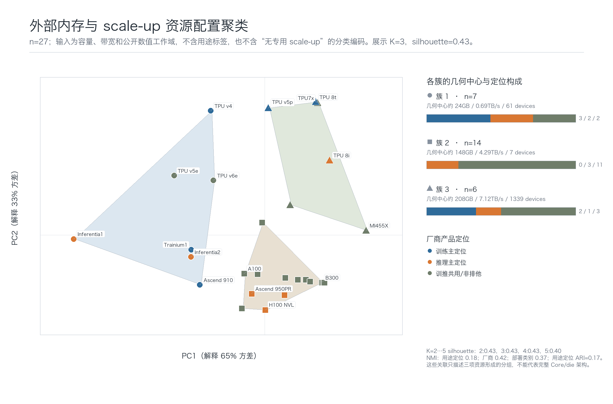

K=3 与用途定位的 ARI 为 0.17、NMI 为 0.18；与厂商的 NMI 为 0.42，与部署类别的 NMI 为 0.37。三项资源形成的簇与厂商和部署路线更接近。该结果只覆盖外存和工作域，不能代表 Core、die、数值路径或专用单元的整体架构聚类，也不能证明 workload 对架构没有作用。

## 各层级的数据目前支持到哪里

| 资料卡维度 | 当前样本呈现的结果 | 结论类别 |
|---|---|---|
| Core 身份与执行模型 | 五个 Core/die 或公开 Core 家族跨用途使用；执行模型主要沿厂商路线分布 | 未见稳定差异 |
| Core 数量与矩阵资源 | NCv2 相同，TPU v5p/v5e 和 MI350P/X 与产品档位、形态一起变化 | 混杂差异 |
| 时钟 | 19 个数值分属五种物理口径；NCv2 训推相同，CDNA 4 的跨用途产品也可保持同一 peak engine clock | 证据不足；未见家族内用途差异 |
| 矩阵/向量/标量配比 | 9 个物理 M:V:S、4 个完整同精度三路吞吐和 13 个宽口径矩阵/非矩阵比都显示 NCv2 训推相同；厂商、代际和精度路径差异更大 | 未见稳定差异 |
| 片上存储 | TPU 8i 和 Groq 是强推理实例；NCv2 相同，跨产品物理层级不统一 | 证据不足 |
| 片上数据管理与搬运 | cache+local、编译器管理 local store 两类都跨用途，分类与 NVIDIA/AMD/Huawei 和 Google/AWS 路线高度重合 | 混杂差异 |
| 低精度、累加与结构化稀疏 | FP8/FP4、FP32/INT32 累加和结构化稀疏均跨训练、推理和共用产品出现 | 未见稳定差异 |
| 工艺、die 面积与晶体管 | 同一 GH100 和 CDNA 4 路线跨用途；公开覆盖受年代和厂商影响 | 混杂差异；面积和晶体管证据不足 |
| 计算 die 与辅助 die 组织 | 11 单逻辑计算 die、2 一颗计算 die + 辅助 die、10 多计算 die、13 物理组织不足；多计算 die 集中在新一代 NVIDIA、Google、AMD | 混杂差异 |
| 片内互联/NoC | 12 个 SKU 有结构，只对应 8 个去重实现；仅 Ascend 910 与 Groq 有拓扑/带宽数值，另 1 个只有宽度 | 证据不足 |
| 内存控制器与 PHY | 25 张卡至少有一种数量事实，但 stack、实际 controller、bus width、height 和 SerDes 的有效样本分别为 17/7/14/5/3 | 证据不足 |
| D2D 性能和 package 代价 | 2 个 chip-to-chip 绝对值、1 个 package bisection 绝对值、2 个相对量，其余为机制或连接 | 证据不足 |
| RAS | 18 项公开具体芯片/package 机制、1 项只有 RAS Engine 名称；训练侧具体机制样本为 0，SKU 又重复同一架构实现 | 证据不足 |
| 外存容量与带宽 | 33 个样本高度重叠；训练/推理效应量接近 0；家族方向不一致 | 未见稳定差异 |
| 主存介质 | 30 个 HBM 产品横跨三种定位；少数 GDDR/DDR/SRAM 与部署、年代和厂商共线 | 混杂差异 |
| 内存访问语义 | 23 项有专门记录，但显式 DMA、peer address、coherence 和 pooling 不是同一能力 | 证据不足 |
| BF16/FP16 铭牌存算比 | 严格样本中没有训练主定位；三个家族对照分别为正向、反向和相同 | 证据不足 |
| 功耗与产品形态 | 推理从 8 W edge 到 600 W 数据中心卡；部署类别的解释更直接 | 混杂差异 |
| 主机接口 | PCIe Gen3 至 Gen6 跨用途出现，代际主要随年份、形态和云/板卡边界变化 | 混杂差异 |
| 每设备互联端点与 collective | 高带宽端点和 collective 跨用途出现，端点对象、payload 与持续值口径不统一 | 未见稳定差异；定量结论证据不足 |
| 最大 scale-up 工作域 | 两个严格训推家族方向一致，全样本训练侧更大；效应由 Google Pod 放大 | 有方向的混杂差异，尚未达到稳定架构规律 |
| Scale-up 拓扑 | mesh/torus、全连接、交换 fabric 和 bridge 的用途分布随厂商及工作域对象变化 | 混杂差异 |
| Scale-out | 严格 package/SKU 端点只有 MI455X 1 项；Ascend 950DT 只有 NIC 位置未确认的 per-NPU 服务器配置 | 证据不足 |
| 有效利用率与能耗 | 披露率和测试条件不足 | 证据不足 |

按本文的稳定差异条件，当前没有一个 Core、die 或单设备资源指标通过。这个结果不等于训练与推理 workload 对架构没有影响。它说明市场产品往往先复用 Core 和 die，再把专用化放到资源配比、package、板卡和系统层；同一层级的选择又受到厂商路线、年代、档位和部署环境约束。

## 还需要哪些数据才能提高结论强度

TPU 8i 的 Vmem、HBM 和 CAE 已经给出清楚的专用化机制，下一步需要在独立厂商中寻找同层级、同方向的实现。scale-up 则需要把 bridge、服务器、Pod 和 rack 转换为可比较的拓扑指标，包括每设备度数、双向持续带宽、collective 延迟、消息粒度和故障域，单纯比较 accelerator 数仍会保留系统边界混杂。

片上存储、D2D 和实际存算平衡需要测试条件一致的数据：各层存储容量及面积占比，matrix/vector/scalar 利用率，HBM 实际流量，训练 step、prefill 和 decode 的通信量，以及统一功耗口径下的能耗。取得这些数据后，才能进一步区分厂商选择、产品档位和 workload 约束。当前报告不从峰值宣传或上层系统成绩反推这些未公开的芯片属性。
