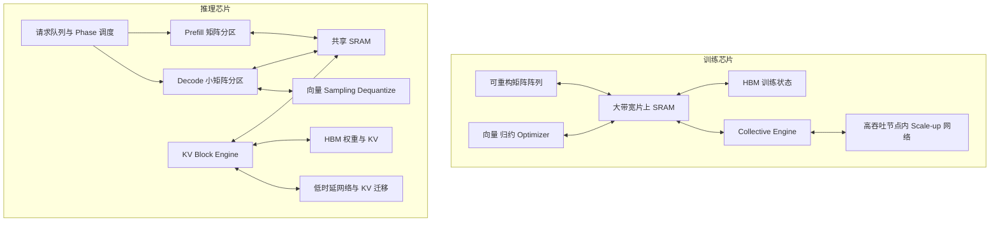

# 从大语言模型（LLM）负载推导训练芯片与推理芯片的架构设计

> 报告范围：数据中心中的稠密或混合专家（Mixture of Experts，MoE）Transformer LLM，重点讨论预训练、持续训练、预填充（prefill）和自回归逐 token 解码（decode）。  
> 分析方法：从计算图、张量生命周期、算术强度、通信和服务目标推导硬件需求。市售芯片的现有实现不作为论证起点，也不做产品横向比较。  
> 版本日期：2026-08-25。

## 摘要

训练和推理都在执行 Transformer，二者也都会使用矩阵乘、向量运算、片上静态随机存取存储器（SRAM）、高带宽内存（High Bandwidth Memory，HBM）和多芯片互联。架构差异来自这些资源的配比、数据通路语义和控制方式。

训练每一步包含 forward、backward 和 optimizer update。forward 产生的 activation 要留到 backward 使用，参数之外还存在 gradient、optimizer state、可能的高精度 master weight 和通信缓冲。大批量训练让主要线性层形成较大的通用矩阵乘（General Matrix Multiplication，GEMM），计算复用较好；模型扩展到多芯片后，collective communication，也就是多个设备共同参与的广播、归约或交换，又进入关键路径。训练芯片由此更需要持续的大矩阵吞吐、支持反向传播的数据流、较宽的累加与归约通路、训练状态带宽，以及面向大消息 collective 的高吞吐互联。

LLM 推理应分成 prefill 和 decode。prefill 一次处理多个输入 token，计算形态接近只执行 forward 的训练阶段；decode 每个请求每轮只增加一个 token，低 batch 下难以充分复用权重，还要反复读取随上下文增长的键值缓存（Key-Value cache，KV cache）。在线服务又用首 token 延迟、相邻 token 间隔和尾延迟约束调度。推理芯片因此更看重可分割的小矩阵执行资源、低比特权重与激活通路、单位计算量可用的内存容量和带宽、KV cache 寻址与搬运，以及细粒度抢占、隔离和低时延通信。

训练芯片优先提高长时间、规则、同步任务的有效计算进度；推理芯片优先在动态请求和延迟约束下，以尽量少的数据移动持续生成 token。prefill 与高 batch 离线推理会向训练侧靠近，低 batch 长上下文 decode 会向存储和服务控制侧移动，因此不存在脱离 batch、序列长度、精度和服务目标的固定训练或推理配比。

## 1. 先把三个阶段分开

### 1.1 训练是一条带状态更新的闭环

一次标准训练迭代至少包含三段工作：forward 计算 loss，backward 根据链式法则计算 activation gradient 和 weight gradient，optimizer 再更新参数。backward 会读取 forward 的中间 activation；内存不够时，可以用 activation checkpointing 在 backward 期间重算一部分 forward。训练还需要在多设备之间同步或分片参数、gradient、optimizer state 和 activation。[2, pp. 77-119][4, Sec. 3-4][5, Sec. 3-4]

这条执行链直接改变硬件。矩阵单元既要高效执行 `Y=XW`，也要处理 `dX=dY W^T` 和 `dW=X^T dY`；后两者改变了操作数方向、归约维和写回方式。梯度归约、归一化、loss scaling、有限值检测和 optimizer update 又给向量、归约和标量控制路径带来持续负载。只按 forward GEMM 设计的阵列即使峰值很高，也可能在 backward 或 update 阶段出现利用率和带宽缺口。

### 1.2 Prefill 是一次宽 forward

prefill 接收整段 prompt，并行计算这些 token 的表示，同时为后续生成建立 KV cache。令 prompt 长度为 $T$，多数线性层可把 token 维折叠进 GEMM 的 $M$ 维，形成 $M=B\times T$ 的矩阵计算。这里的 $B$ 是并发序列数。只要 $B\times T$ 足够大，权重在一次 kernel 中可被许多 token 复用，矩阵阵列容易获得较高占用率。长序列 attention 的计算和中间数据量仍可能很大，input/output-aware tiling（I/O-aware tiling）可把中间结果留在片上存储，减少 HBM 往返。[6, Sec. 3-4][8, p. 2][10, Sec. 1]

Prefill 和训练 forward 的相似性主要在计算形状。prefill 不计算 gradient，不保留供 backward 使用的完整 activation，也不更新 optimizer state；在线服务还要受 time to first token，也就是 TTFT 的约束。这些差异使 prefill 引擎可以保留很强的矩阵吞吐，却省掉一部分训练专用的数值、状态和同步能力。

### 1.3 Decode 是逐 token 的有状态循环

自回归 decode 每轮为每个活动请求生成一个 token。当前 token 的 attention query 要读取此前 token 的 key 和 value，随后把本轮的新 key、value 写回 KV cache。单个请求在 token 维没有并行空间，系统只能通过同时服务多个请求、投机生成多个候选 token，或修改模型结构来提高并行度。[8, pp. 2, 4-5][9, Sec. 2-3]

低 batch decode 的线性层更接近窄矩阵乘或通用矩阵向量乘（General Matrix-Vector Multiplication，GEMV）。权重仍然很大，但同一份权重只服务少量 token，权重复用下降；上下文越长，attention 每轮读取的 KV cache 越多。decode 因而更容易落在 Roofline 的带宽受限区域。增加 batch 可以提高权重复用，却会扩大 KV cache 占用和单轮执行时间，还可能让新请求排队。Sarathi-Serve 和 DistServe 分别用 chunked prefill、分相放置来缓解这种冲突，说明调度会改变芯片看到的负载形状。[10, Sec. 1-4][11, Sec. 2-4]

在线服务通常用 time to first token（TTFT）描述从请求到首 token 的时间，用 time per output token（TPOT）描述后续 token 的平均生成间隔，并用 P99 表示 99% 请求不超过的尾延迟。服务等级目标（Service Level Objective，SLO）会同时约束这些指标和吞吐。

| 属性 | 训练 | Prefill | Decode |
| --- | --- | --- | --- |
| token 维并行度 | 通常较高，由 micro-batch 和 sequence 共同提供 | 通常较高，由 prompt token 提供 | 单请求每轮为 1，依赖跨请求 batch |
| 主要计算 | forward、backward、weight gradient、optimizer | forward、attention、KV 建立 | 逐 token forward、KV 读取与追加、sampling |
| 长生命周期状态 | 参数、gradient、optimizer state、部分 activation | 权重和刚生成的 KV | 权重、所有活动请求的 KV、prefix cache |
| 常见关键路径 | GEMM、activation/gradient 流量、collective | GEMM 和长序列 attention | 权重流取、KV 流取、小矩阵、低时延通信 |
| 目标 | 到达目标质量所需时间和有效吞吐 | TTFT 和 prompt tokens/s | TPOT、P99、持续 output tokens/s |

## 2. 用计算量和数据量解释瓶颈

### 2.1 一个简化 Transformer 层的计算形状

设 batch 为 $B$，序列长度为 $T$，hidden size 为 $d$，多层感知机（Multi-Layer Perceptron，MLP）中间维度为 $rd$。以下估算采用标准 multi-head attention、两个线性层的 MLP，并把一次 multiply-add 记为 2 次浮点操作（Floating-point Operation，FLOP）；忽略 bias、normalization、activation function 和 embedding。gated MLP 会改变常数，但不会改变推导方向。

一个 forward 的线性层计算量约为：

$$
F_{\text{linear,fwd}} \approx (8+4r)BTd^2.
$$

其中 Q、K、V projection 和 attention output projection 合计约 $8BTd^2$，两层 MLP 合计约 $4rBTd^2$。attention 的两个主要矩阵乘约为：

$$
F_{\text{attn,fwd}} \approx 4BT^2d.
$$

这里按完整的 $T\times T$ attention 计算；causal mask、稀疏 attention 和具体 kernel 会改变常数或有效计算量，$T^2$ 的形状关系仍可用于解释长序列 prefill 的压力。

训练 backward 对每个线性层还要计算 input gradient 和 weight gradient。因此，在只看 GEMM 的粗略模型里，forward 加 backward 接近 forward 线性计算量的 3 倍，随后还有 optimizer update、normalization 和 collective。这个倍数是容量规划和机器平衡的起点，不是所有模型的固定性能预测。[2, pp. 77-89]

prefill 只走 forward，$BT$ 往往较大；decode 把当前 query 长度降到 1，线性层计算量变成近似 $(8+4r)Bd^2$，attention 变成与当前上下文长度 $L$ 线性相关的约 $4BLd$。这解释了两个现象：prefill 的大 GEMM 能较好摊薄权重读取；decode 每增加一个 token，都要重新经过全模型线性层，并扫描该请求所需的 KV。

### 2.2 训练内存要按状态拆开

令模型参数量为 $N_p$，每个参数在某类状态中的字节数为 $b_i$。训练设备内存可写成：

$$
M_{\text{train}} = N_p(b_w+b_g+b_{master}+\sum b_{opt})
 + M_{act}+M_{temp}+M_{comm}.
$$

$b_w$ 对应计算权重，$b_g$ 对应 gradient，$b_{master}$ 对应可选的高精度主权重，$b_{opt}$ 对应 optimizer state。$M_{act}$ 受 micro-batch、序列长度、层数、hidden size、并行方式和 checkpointing 策略影响。ZeRO 或 fully sharded data parallel 可以把一部分模型状态分片到多设备，但状态总量和相关通信仍然存在。[3, Sec. 3][4, Sec. 3-4]

一个常见的教学假设是：bfloat16（BF16）weight 2 byte，BF16 gradient 2 byte，32-bit floating point（FP32）master weight 4 byte，Adam 的两个 FP32 moment 共 8 byte，合计 16 byte/parameter。70B 参数在未分片、未计 activation 前就需要约 1.12 TB，按二进制容量换算约为 1.02 TiB。这个数字只说明状态量级；不用 master weight、采用低比特 optimizer、offload 或分片时，单设备容量会改变。

训练芯片因此需要同时回答容量和带宽问题。状态能装下，只代表作业可以启动；如果 optimizer update、gradient 写回或 activation 重读耗尽 HBM 带宽，矩阵峰值仍然无法持续。

### 2.3 推理内存由权重和 KV cache 共同决定

设模型有 $N_L$ 层，每层有 $H_{kv}$ 个 KV head，每个 head 的维度为 $d_h$，KV 元素占 $b_{kv}$ byte。单个 token 的 KV cache 为：

$$
m_{KV/token}=2N_LH_{kv}d_hb_{kv},
$$

其中系数 2 对应 key 和 value。batch 为 $B$、当前缓存长度为 $L$ 时：

$$
M_{KV}=2B N_L L H_{kv}d_hb_{kv}.
$$

Grouped-query attention，也就是 GQA，通过让多个 query head 共享较少的 KV head 来降低 $H_{kv}$，直接减少 KV 容量和 decode 流量；它同时带来模型质量和训练方式上的取舍。[12, Abstract and Sec. 2]

仍用一个纯教学例子：$N_L=80$、$H_{kv}=8$、$d_h=128$、BF16 KV 时，每 token KV 为 327,680 byte，约 0.3125 MiB。单条 128K token（按 131,072 token 计）的序列约占 40 GiB，还没有计入权重、临时空间、prefix cache 和内存碎片。并发请求数再把这部分线性放大。PagedAttention 的工作表明，KV 块的动态增长、回收、碎片和跨请求共享会影响可用 batch，因此推理芯片需要支持高效的块级寻址和生命周期管理。[9, Sec. 2-4]

### 2.4 Roofline 给出算力和带宽的配比方法

Roofline 用 operational intensity，也就是每搬运 1 byte 数据完成多少 FLOP，连接工作负载与硬件：[1]

$$
P_{attainable}\leq \min(P_{peak},\ BW\times OI).
$$

训练和 prefill 的 $BT$ 较大，权重被许多 token 复用，主要 GEMM 的 $OI$ 往往较高。decode 在低 batch 时，每次迭代都要流取大量权重和 KV。在权重无法长期驻留片上、每轮至少从所分析的存储层读取一次的简化条件下，若模型权重总字节数为 $W$，同一轮有 $B$ 个请求共享这次权重读取，每输出 token 的外存流量可粗略写为：

$$
D_{decode/token}\gtrsim \frac{W}{B}+D_{KV}(L)+D_{activation}.
$$

由此得到一个只用于上界分析的关系：

$$
TPS_{decode}\lesssim
\frac{BW_{effective}}
{W/B+D_{KV}(L)+D_{activation}}.
$$

这个式子揭示了 batch、权重量化和 KV 优化为何都能提高 decode 吞吐，也揭示了它们的代价。增大 $B$ 会增加排队和 KV 容量；降低 $W$ 的位宽需要量化、scale 解码和精度验证；降低 $D_{KV}$ 可能依赖 GQA、KV 量化、稀疏 attention 或上下文淘汰。实际系统还受到缓存命中、kernel launch、片上带宽、网络和调度影响，不能把这个上界当成实测值。

## 3. 训练芯片应该怎样设计

### 3.1 计算阵列要覆盖 forward 和两类 backward GEMM

训练的主要面积仍应投入矩阵计算，但阵列不能只对一个固定方向的 forward 友好。`dX=dY W^T` 需要高效读取转置权重，`dW=X^T dY` 的归约长度通常很大，并可能跨 tile 或跨芯片累加。阵列、片上网络和数据搬运通路至少应支持灵活的 operand layout、转置或等价的数据重排、宽 partial sum、跨 tile reduction，以及在 forward、activation backward、weight backward 之间切换数据流。

大 micro-batch 和长序列通常能填满较宽阵列，因此训练芯片适合追求高峰值和高持续占用率。阵列过大仍有风险：embedding、normalization、softmax、activation、dropout、loss 和 optimizer 都不是大 GEMM。合理的训练计算簇应包含高吞吐矩阵单元、足够的单指令多数据（Single Instruction Multiple Data，SIMD）向量通路、归约网络，以及能在较少 HBM 往返下融合 pointwise operator 的本地存储。

optimizer update 常常是低算术强度的向量负载。训练芯片若只增加矩阵 FLOP/s，update 会在每一步形成带宽尾巴。可行设计包括较强的向量单元、专用的 scale、clip、finite-check 和 fused optimizer 指令，以及允许矩阵计算与 update 或通信并行的多 stream 执行。

### 3.2 数值通路要保护累积误差和动态范围

低精度训练已经可以使用 BF16、16-bit floating point（FP16）或 8-bit floating point（FP8）完成主要矩阵乘，但低位输入并不意味着所有环节都能用相同位宽。gradient 的动态范围、长归约的累积误差、参数的微小更新和 loss scaling 都要求分层数值设计。混合精度训练的经典做法把低精度计算副本与较高精度累加或 master weight 组合；现代实现可以改变具体格式，硬件需求仍是相同的：乘法输入、乘积、累加、输出、gradient、optimizer state 和参数更新格式必须分别定义。[3, Sec. 3][2, pp. 147-172]

训练芯片应优先提供较宽累加器、快速格式转换、per-tensor 或 per-block scale、随机舍入或等价的误差控制、非数或无穷（NaN/Inf）检测，以及高效的全局 norm 和 clipping。纠错码、链路重试和数值异常遥测也更重要，因为训练作业持续时间长，静默错误可能在很多步之后才表现为收敛异常。

### 3.3 存储系统围绕状态流和重计算组织

训练片上 SRAM 的首要任务是让 GEMM tile、partial sum 和融合算子中间量留在片上，并为 attention 的 I/O-aware tiling 提供足够空间。它通常无法保存完整 activation 或 optimizer state，因此 HBM 容量和带宽仍是主资源。设计时要分别核算 forward 写 activation、backward 读 activation、gradient 写回、optimizer 读改写和通信缓冲，不能只用权重带宽代表训练流量。

checkpointing 用额外计算换 activation 容量。硬件若能快速重放 forward、保持确定的随机数状态，并让重计算与通信重叠，就能减少 HBM 容量压力。直接存储器访问（Direct Memory Access，DMA）和内存控制器还应支持多队列、异步预取、直接送入 collective engine，以及对大块连续张量的高有效带宽。训练的数据形状相对稳定，复杂的请求级分页和抢占优先级较低。

### 3.4 互联要按 collective 和长作业扩展设计

数据并行需要 all-reduce 或 reduce-scatter/all-gather，tensor parallel 在层内交换 activation 或 partial result，pipeline parallel 在 stage 之间传 activation，MoE 还会引入 all-to-all。大规模 LLM 训练通常组合这些并行方式，网络拓扑和映射会改变每类消息的路径、带宽与等待时间。[4, Sec. 3-4][5, Sec. 3-4]

训练互联更看重持续双向带宽、全局二分带宽、collective 效率和计算通信重叠。链路时延也重要，但训练中的大 tensor 通常给带宽摊销留下更多空间。适合的硬件能力包括 topology-aware collective offload、reduce-scatter/all-gather 原语、多个并发通信域、网络直达 HBM 或 SRAM，以及可观测拥塞和 straggler 的遥测。

长作业还要求故障隔离和恢复。训练芯片及系统要能快速发现链路、内存和计算错误，保存检查点所需的高吞吐 I/O，并允许部分资源降级或重启。这里的目标是 goodput，也就是总运行时间中真正推进有效训练的比例；只测无故障短基准会高估实际训练效率。

### 3.5 控制路径偏静态，换取低开销和可预测性

训练图在许多 step 内保持不变，shape 和并行方案也相对稳定。编译器可以提前完成 fusion、tiling、buffer planning 和 collective scheduling，硬件适合用较长 kernel、较深流水和显式 scratchpad 获得效率。请求级抢占、毫秒级上下文切换和多租户服务质量控制不在训练主路径上。

静态并不等于固定功能。LLM 结构、并行策略和精度还会变化，训练芯片仍需可编程的矩阵 shape、向量指令、collective 和内存布局。设计重点是让可编程性服务于算子与并行映射，不必为高频请求切换付出过多面积和功耗。

## 4. 推理芯片应该怎样设计

### 4.1 计算阵列应当可分割，并分别照顾 prefill 和 decode

prefill 需要接近训练 forward 的大矩阵吞吐，但不需要 backward 和 optimizer。decode 的 $M$ 维很小，超宽阵列可能只有少数行有效。推理芯片更适合把矩阵资源设计成多个可独立调度的子阵列，或允许一个大阵列按 workload 分区。prefill 可以合并子阵列执行大 GEMM，decode 可以让多个请求或多个层并行占用不同分区，减少 padding 和空转。

decode 还需要更多非矩阵能力。旋转位置编码（Rotary Position Embedding，RoPE）、normalization、softmax、KV gather、sampling、top-k/top-p 和各种 scale/dequantize 会占据每 token 路径。向量与标量单元应能低延迟启动，支持小 tensor，并与矩阵、DMA 并行。硬件队列需要处理可变 batch 和可变序列长度，避免每生成一个 token 都回到 host 调度。

### 4.2 低比特数据通路要靠近存储入口

推理没有 gradient 和 optimizer 的数值稳定性约束，weight-only 8-bit/4-bit integer（INT8/INT4）、8-bit weight 与 8-bit activation（W8A8）、FP8/4-bit floating point（FP4）等格式更容易使用。低比特的直接收益是减少权重容量和带宽；如果矩阵单元也原生支持该格式，还能增加计算密度。SmoothQuant 也说明 activation outlier 会限制简单的全路径低比特量化，量化仍需 scale 变换和模型质量验证。[7, Sec. 3]

推理芯片不应把低比特只做成一个孤立的 MAC 模式。压缩权重从 HBM 读入后，需要高吞吐 unpack、per-group scale、zero-point 或 exponent 处理；离群通道可能走较高精度旁路；accumulator 通常比乘法输入更宽。把解码和 scale 单元放在内存入口或矩阵阵列旁边，可以避免解压后的宽数据长距离移动。KV cache 的位宽和权重位宽也应分开，因为 KV 在运行时生成，对精度、写带宽和格式转换的约束不同。

### 4.3 内存系统要直接支持 KV cache 生命周期

推理芯片的 HBM 预算至少分为 weight、KV cache、prefix cache、temporary buffer 和 allocator reserve。对于低 batch decode，单纯增加计算阵列很难绕过权重和 KV 的外存流量；更有价值的面积可能是更宽的内存接口、更大的可用容量、更高带宽片上 SRAM，或面向只读权重的分层存储。

KV cache 具有变长、按请求分配、逐 token 追加和可共享 prefix 等语义。合适的硬件或固件支持包括：固定大小 block 的分配与回收、虚拟连续而物理离散的映射、gather/scatter、引用计数、prefix 共享、异步迁移、压缩和淘汰。PagedAttention 证明分页能减少碎片与重复，但它是一种系统实现，不要求芯片照搬某个软件页表；芯片需要暴露低开销的块级寻址、地址转换和批量描述符，使运行时能够实现不同的 KV 策略。[9, Sec. 3-4]

attention 数据流也要分阶段。prefill 适合对 $QK^T$ 和 $PV$ 做较大的块式计算；decode 的 query 长度为 1，更像沿 context 维扫描或 gather KV。让同一阵列固定使用一种 stationary dataflow，会在另一阶段浪费带宽或计算。可切换的数据流、独立 KV DMA 和靠近 SRAM 的 online softmax 能减少这种损失。

### 4.4 互联更重小消息时延、放置和 KV 迁移

模型跨芯片分片后，decode 每层都可能触发 tensor-parallel collective。每轮 token 的消息比训练梯度小得多，却更频繁，单次启动、hop 数和同步抖动会直接进入 TPOT。推理互联除了带宽，还要优化小消息时延、快速 barrier、低开销 multicast/reduce，以及在多个请求间维持公平性的 virtual channel。

prefill 和 decode 分相部署时，系统需要传递 KV cache。分相可以让两类资源独立配比，也会增加 KV 传输和请求放置约束；DistServe 的设计把网络带宽纳入 phase placement，正好说明这项成本不能省略。[11, Sec. 3-4] 推理芯片若面向分相系统，应支持设备间直接 KV 搬运、远端写入目标 block、传输完成通知和低开销的状态接管。

MoE 推理还会产生 token dispatch 和 expert output collect。请求 batch 小、路由不均时，单个 expert 的工作量和消息尺寸波动更明显。互联与片上网络（Network-on-Chip，NoC）需要低时延 all-to-all、拥塞隔离和路由遥测；矩阵阵列则需要避免少数热门 expert 造成局部空转。

### 4.5 调度和服务质量要进入硬件接口

在线推理面对随机到达、输入输出长度不一、请求优先级不同的负载。更大的 batch 能改善 decode 的权重复用，却可能恶化 TTFT、TPOT 和 P99。prefill 还可能长时间占用计算阵列，使同批 decode 请求出现 generation stall。服务质量（Quality of Service，QoS）控制必须处理这些相互影响。[10, Sec. 1-4][11, Sec. 2-3]

推理芯片应提供细粒度工作描述符、快速队列切换、可中断的长 kernel、优先级和配额、每请求或每租户的资源计数，以及矩阵、内存和网络三类利用率遥测。硬件不必直接实现完整服务调度器，但必须让 runtime 以很低的代价完成 continuous batching、chunked prefill、抢占、迁移和 admission control。缺少这些接口时，芯片只能在离线大 batch 中接近峰值，在线负载会被排队和尾延迟限制。

## 5. 两类芯片的架构分工

下面的对照描述设计优先级。每一行都依赖具体 workload contract，不能当作无条件产品分类器。

| 子系统 | 训练芯片的设计重心 | 推理芯片的设计重心 | 负载原因 |
| --- | --- | --- | --- |
| 计算目标 | 大 GEMM 的持续吞吐和集群 scaling efficiency | SLO 内的 prompt/output token 吞吐 | 训练任务长且规则；推理受动态请求和延迟限制 |
| 矩阵阵列 | 较宽阵列，高利用率执行 forward、dX、dW | 可分割阵列，兼顾大 prefill 和小 decode | decode 的 $M$ 维小，固定宽阵列容易空转 |
| 向量与归约 | gradient、norm、optimizer、collective reduction | RoPE、softmax、KV gather、sampling、dequantize | 两侧非 GEMM 算子不同 |
| 数值格式 | BF16/FP16/FP8 计算，较宽累加和更新路径，多级 scale | 更积极的 INT8/INT4/FP8/FP4，权重与 KV 独立量化 | 训练误差跨 step 累积；推理主要受单次输出质量约束 |
| 片上存储 | GEMM tile、partial sum、fusion、attention tile | 额外照顾 KV block、decode 小工作集和 prefix metadata | 推理状态按请求动态变化 |
| HBM 配比 | 高算力配高带宽，容量承载训练状态和 activation | 每 FLOP 配置更多容量与带宽，承载权重和并发 KV | 低 batch decode 的 operational intensity 较低 |
| 内存语义 | 大块连续 tensor、异步 prefetch、checkpoint/recompute | block allocation、gather/scatter、共享、迁移和淘汰 | KV 生命周期与训练 tensor 不同 |
| 互联 | 大消息 collective、全局带宽、计算通信重叠 | 小消息低时延、phase placement、KV transfer、QoS | 训练同步以吞吐为主；decode 每 token 暴露时延 |
| 控制 | 静态图、长 kernel、稳定 shape、低调度开销 | continuous batching、抢占、优先级、快速上下文切换 | 在线请求到达和长度不可预知 |
| 可靠性 | 长作业纠错、故障诊断、checkpoint 和降级运行 | 服务可用性、尾延迟隔离、请求迁移 | 训练关心数小时至数月 goodput；推理关心持续 SLO |
| 面积功耗取舍 | 更多面积投向矩阵计算、数值稳定和 scale-up 网络 | 更多面积投向内存接口、KV 支持、阵列分割和控制 | 两类负载的瓶颈与利用率来源不同 |

一个概念化的数据通路如下。它表达资源重心，不对应任何现有产品。

## 6. 几类负载会移动架构边界

### 6.1 高 batch 离线推理

离线推理允许把很多 token 组成大 batch，不受严格的单请求延迟约束。权重被更多 token 复用，线性层重新变成大 GEMM。这样的推理芯片会向 prefill 或训练 forward 的计算配比靠近，宽矩阵阵列的利用率提高，KV 分页、抢占和硬 QoS 的优先级下降。它仍不需要 backward、optimizer 和训练精度通路。

### 6.2 长上下文和高并发服务

上下文长度和活动请求数直接放大 $M_{KV}$。此时容量可能先于带宽成为约束，KV address translation、prefix sharing、压缩和分层存储的价值上升。attention 每 token 的 KV 读取也随 $L$ 增长，内存带宽和能效压力继续增加。设计者应提高 memory capacity/FLOP、memory bandwidth/FLOP，并避免为了增加峰值算力而压缩 HBM 接口和可用容量。

### 6.3 MoE 训练与推理

MoE 让总参数量和每 token 激活参数量分离。训练仍要保存和更新所有 expert 的参数与 optimizer state，expert parallel 还会产生 all-to-all；推理虽然每 token 只调用少数 expert，完整权重容量、路由不均和小 batch 通信仍然突出。两类芯片都需要 all-to-all 支持，训练侧更重总带宽和更新状态，推理侧更重小消息时延、负载均衡和 expert placement。

### 6.4 投机解码和多 token 生成

投机解码把一部分串行 decode 转成候选生成与批量验证，提高验证阶段的矩阵宽度。接受率足够高时，推理负载会向计算侧移动；接受率低时，额外候选计算和 KV 管理可能抵消收益。推理阵列的可分割性和多 shape 支持比固定的小型 GEMV 引擎更安全，因为算法会改变每轮 token 数。

### 6.5 Fine-tuning、RLHF 与在线学习

参数高效 fine-tuning 可能只更新少量 adapter，但 backward、gradient 和 optimizer 仍然存在；full fine-tuning 更接近预训练。基于人类反馈的强化学习（Reinforcement Learning from Human Feedback，RLHF）会让 rollout 生成和训练更新在同一系统交替出现。面向这类混合负载的芯片可以采用统一矩阵核心，同时保留训练数值与 collective 通路，并增加推理调度和 KV 支持。若只按“是否生成 token”给芯片分类，会漏掉这一类运行方式。

## 7. 从 workload contract 到芯片配比

设计开始前需要固定 workload contract。训练侧至少要给出模型结构、参数量、sequence length、global/micro batch、optimizer、精度、activation checkpointing 和数据/张量/流水/expert parallel；推理侧至少要给出输入输出长度分布、并发、batch policy、TTFT、TPOT、P99、权重与 KV 精度、prefix 命中率和 phase placement。缺少这些条件时，任何“算力和带宽应该是多少”的回答都不可靠。

随后按同一条计算链核算：

1. 逐 phase 计算 FLOP 和矩阵 shape，不能只给模型总 FLOP。
2. 列出每类状态的容量、生命周期、读写次数和可分片方式。
3. 计算 HBM、片上 SRAM 和网络的 byte volume，再估算 operational intensity。
4. 用有效算力、有效带宽和通信模型估算关键路径，而不是用所有理论峰值相加。
5. 把面积和功耗投到最限制目标指标的资源，完成后再用真实 kernel 和端到端 workload 校正。

训练 step 的一阶下界可以写成：

$$
T_{step}\gtrsim
\max\left(
\frac{F_{train}}{P_{effective}},
\frac{D_{HBM,train}}{BW_{HBM,effective}},
T_{collective},
T_{input}
\right)+T_{unhidden}.
$$

$T_{unhidden}$ 是未能被计算覆盖的同步、调度和故障恢复开销。训练芯片的架构优化目标，是在目标质量和规模下持续压低这个 step 时间，并避免 batch 或数值策略破坏收敛。MLPerf Training 用达到指定质量目标的墙钟时间评价系统，也说明单步吞吐不能单独代表训练完成速度。[13, Scenarios and Metrics]

在线推理应分别建模：

$$
TTFT \approx T_{queue}+T_{prefill}+T_{first\ decode},
$$

$$
TPOT \approx T_{schedule}+T_{decode\ compute}+T_{decode\ memory}+T_{communication}.
$$

这两个式子不是简单相加模型。计算、内存和通信可以重叠，continuous batching 也会让请求彼此干扰。设计验收应在固定 TTFT、TPOT 和 P99 条件下测最大持续吞吐，并同时报告输入输出长度、并发、精度和质量门槛。[10, Sec. 1-4][11, Sec. 2-4]

## 8. 专用芯片与统一芯片如何选择

当训练集群长期运行大规模预训练，且 workload 稳定时，把面积集中到矩阵吞吐、训练数值、HBM 和 collective 网络通常更有效。在线推理若长期由低 batch、长上下文和严格 SLO 主导，把面积集中到内存、KV、阵列分割和调度也更合理。两种专用设计都用牺牲另一类能力换取目标负载上的有效利用率。

统一芯片适合负载比例经常变化、部署规模不足以分摊两套硬件，或算法尚未稳定的情况。它至少需要可分割矩阵阵列、完整的向量与归约资源、灵活数值格式、较强 HBM、collective 和低时延消息两类网络能力，以及既支持静态训练图又支持动态推理队列的控制面。这样的通用性会消耗面积、功耗和验证成本。

系统级异构是中间方案。prefill、decode、optimizer 或 collective 可以放在不同 chiplet、不同 die 或不同节点，但需要把 KV、activation 和 gradient 的迁移成本计入。phase specialization 只有在节省的计算或内存资源大于迁移、排队和碎片成本时才成立。[11, Sec. 3-4]

## 9. 设计结论

训练负载把芯片推向计算和同步：大而规则的矩阵、forward 与 backward 的多方向数据流、较宽累加、训练状态带宽、collective 互联和长作业可靠性。训练芯片的首要资源是可持续利用的矩阵计算簇，HBM 和网络围绕它配平。

推理负载把芯片推向阶段化和服务化：prefill 需要高矩阵吞吐，decode 需要在小矩阵、权重流取、KV cache 和低时延通信之间取得平衡。推理芯片应把可分割计算、较高 memory capacity/FLOP 与 bandwidth/FLOP、KV block 语义、低比特数据通路和 SLO-aware runtime 接口作为一个资源组合来设计；单独一项峰值无法代表在线推理能力。

设计评审时可以用一个问题检查方向是否正确：在给定模型、batch、序列长度、精度、并行方式和延迟目标下，下一单位面积应该增加乘累加（Multiply-Accumulate，MAC）阵列、HBM 接口、SRAM、网络还是调度能力？训练和推理的答案经常不同；prefill、decode、MoE 和投机解码又会继续改变答案。架构差异应从这项边际收益分析中得出。

## 参考资料

[1] S. Williams, A. Waterman, D. Patterson, “Roofline: An Insightful Visual Performance Model for Multicore Architectures,” *Communications of the ACM*, 2009. [DOI](https://doi.org/10.1145/1498765.1498785)。

[2] A. Pedram, K. Olukotun, “Hardware Accelerators for Training Deep Neural Networks,” ISCA 2019 Tutorial. [教程主页](https://web.stanford.edu/~perdavan/DNNTrain/)；[本地固定讲义](原文/PDF/S05_dnntrain_printable.pdf)。

[3] P. Micikevicius et al., “Mixed Precision Training,” ICLR 2018. [arXiv:1710.03740](https://arxiv.org/abs/1710.03740)。

[4] S. Rajbhandari et al., “ZeRO: Memory Optimizations Toward Training Trillion Parameter Models,” SC 2020. [arXiv:1910.02054](https://arxiv.org/abs/1910.02054)。

[5] D. Narayanan et al., “Efficient Large-Scale Language Model Training on GPU Clusters Using Megatron-LM,” SC 2021. [arXiv:2104.04473](https://arxiv.org/abs/2104.04473)。

[6] T. Dao et al., “FlashAttention: Fast and Memory-Efficient Exact Attention with IO-Awareness,” NeurIPS 2022. [arXiv:2205.14135](https://arxiv.org/abs/2205.14135)。

[7] G. Xiao et al., “SmoothQuant: Accurate and Efficient Post-Training Quantization for Large Language Models,” ICML 2023. [arXiv:2211.10438](https://arxiv.org/abs/2211.10438)。

[8] X. Ma, D. Patterson, “Challenges and Research Directions for Large Language Model Inference Hardware,” *IEEE Computer*, accepted manuscript, 2026. [arXiv:2601.05047v3](https://arxiv.org/abs/2601.05047)；[本地固定 PDF](原文/PDF/S11_llm_inference_hardware_v3.pdf)。

[9] W. Kwon et al., “Efficient Memory Management for Large Language Model Serving with PagedAttention,” SOSP 2023. [arXiv:2309.06180](https://arxiv.org/abs/2309.06180)。

[10] A. Agrawal et al., “Taming Throughput-Latency Tradeoff in LLM Inference with Sarathi-Serve,” OSDI 2024, pp. 117-134. [USENIX 论文页](https://www.usenix.org/conference/osdi24/presentation/agrawal)。

[11] Y. Zhong et al., “DistServe: Disaggregating Prefill and Decoding for Goodput-optimized Large Language Model Serving,” OSDI 2024, pp. 193-210. [USENIX 论文页](https://www.usenix.org/conference/osdi24/presentation/zhong-yinmin)。

[12] J. Ainslie et al., “GQA: Training Generalized Multi-Query Transformer Models from Multi-Head Checkpoints,” EMNLP 2023. [arXiv:2305.13245](https://arxiv.org/abs/2305.13245)。

[13] MLCommons, “MLPerf Training Benchmark.” [官方说明](https://mlcommons.org/benchmarks/training/)。
