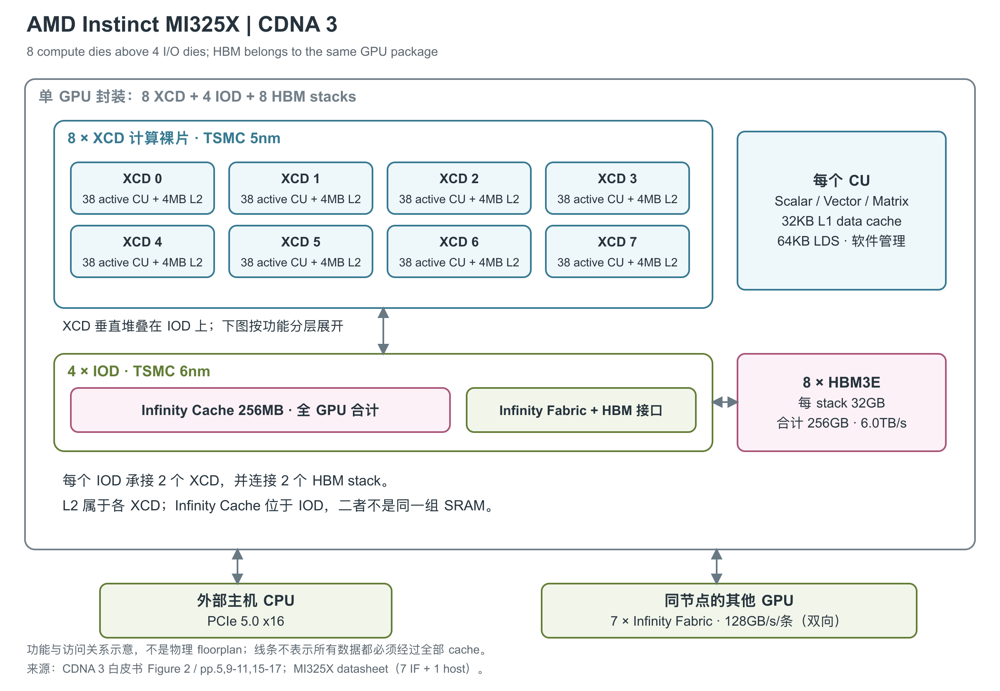

# AMD Instinct MI325X 256GB

MI325X 沿用 CDNA 3 的多裸片计算架构，把产品重点放在更大的 HBM3E 内存及更高内存带宽上。它覆盖 AI training、inference 和高性能计算，形态仍是插在服务器底板上的 OAM（加速器模组）。[1, Product Basics / Board Specifications] [3, p.1]

图中一颗逻辑 GPU 由 8 个 XCD（计算裸片）、4 个 IOD（I/O 裸片）和 8 个 HBM3E（高带宽堆叠内存）stack 组成。XCD 实际垂直堆叠在 IOD 上，示意图将两层展开，以便看到计算、cache 与内存接口的归属。图依据 CDNA 3 白皮书 Figure 2、pp.5、9-11 和 MI325X datasheet 的互联规格；不代表物理版图。[2, Figure 2, pp.5,9-11] [3, Specifications]

## 计算结构延续，变化发生在内存侧

每个 XCD 使用 TSMC 5nm 工艺，设计 40 个 CU（Compute Unit，计算单元）、实际启用 38 个。8 个 XCD 共提供 304 个 CU、19,456 个 Stream Processor 和 1,216 个 Matrix Core，最高引擎频率为 2.1GHz，产品页列出的总晶体管数为 1,530 亿。这些计算资源与 MI300X 相同，MI325X 的容量提升来自 HBM3E 的改变。[2, pp.4-5, Table 2] [1, GPU Specifications]

每个 XCD 还有 4 个 ACE（Asynchronous Compute Engine，异步计算引擎），将 workgroup 分发给 CU，并共享硬件调度器；Figure 3 为每个 ACE 标出 HQD0 至 HQD7 共 8 个硬件队列入口。这些队列用于组织多个任务，不代表可以无资源冲突地同时运行同样数量的 kernel。[2, Figure 3, p.5]

## 从寄存器到 HBM：容量、组织与带宽

程序实际使用的存储并不只有 HBM。VGPR（向量通用寄存器）保存每个线程自己的操作数，AccVGPR 保存矩阵累加结果；SGPR（标量通用寄存器）供整个 wavefront 共享。CDNA 3 的 wavefront 包含 64 个线程，矩阵指令由这些线程共同持有一块矩阵。ISA（指令集架构）允许每线程最多 256 个普通 VGPR 加 256 个 AccVGPR，二者合计最多 512 个 32-bit 寄存器；这里的 512 是每个线程的寄存器索引总上限。整条 wave 包含 64 份线程数据，实际物理容量不能用该索引上限乘全部常驻线程数推定。[5, §§1.1,2.1,3.6.4, pp.4-5,12-13]

SGPR 的分配范围是每 wave 16 至 102 个，以 16 个 32-bit 寄存器为分配单位，VCC 条件码和 trap handler 还占用特定寄存器。VGPR/AccVGPR 以 8 个 DWORD 为 ISA 分配单位，LDS 则以对齐的 512B 块分配给 workgroup。ROCm 的 Triton 优化文档另用每 EU 512 VGPR、16 个一组的编译分配口径说明 occupancy；它与 ISA 的分配字段不是同一层面的描述。寄存器占用和 LDS 占用都会限制同时驻留的工作量。[5, §§3.6.2-3.6.5, pp.12-13] [8, Auto-tunable kernel configurations / Compute the occupancy of a kernel]

| 存储位置 | 容量、作用域与组织 | 已公开的吞吐或接口 | 来源 |
|---|---|---|---|
| Instruction cache | 每两个 CU 共享 64KB，8-way | 未给出绝对读取带宽与命中延迟 | [2, p.6] |
| L1 vector data cache | 每 CU 32KB，cache line 为 128B | 向 CU 的请求总线及 L2 fill 路径均随 cache line 加宽；白皮书未给绝对 B/cycle | [2, p.9] |
| LDS（Local Data Share，软件管理的片上暂存区） | 每 CU 64KB；32 banks，每 bank 为 512×4B；含 32 个整数 atomic 单元 | 每 bank 可读、写一个 32-bit 值；全 LDS 读带宽为 128B/clock | [5, §2.2.1, p.6] [9, p.9 对 CDNA 3 的说明] |
| XCD 内 L2 | 每 XCD 4MB，8 份合计 32MB，但不构成单一共享 cache；16-way，16 个 256KB channel，cache line 128B | 每 channel 每周期读 128B、写 64B；每 XCD 读 2KB/clock，全 GPU 原文给最高 34.4TB/s 聚合读带宽 | [2, pp.9-10] |
| L2 到 IOD 接口 | 每 XCD 16 个 channel，各宽 64B | 每 XCD 接口总宽 1KB；这是接口宽度，原文此处没有另给传输频率 | [2, p.10] |
| Infinity Cache | 全 GPU 256MB，16-way；128 个 channel，每个对应 2MB 分 bank 数据阵列 | channel 宽 64B，阵列支持同时读写；峰值 17.2TB/s | [2, pp.10-11] |
| HBM | 8×32GB HBM3E，合计256GB；总接口 8,192-bit | 6.0Gbps 数据率，6.0TB/s 产品峰值 | [2, p.11] [3, p.1] |

表中容量沿用原文 KB/MB 标法；B/clock 对应所述模块的时钟域，不能统一乘 GPU boost 频率来生成全芯片持续带宽。尤其 L2 白皮书正文明确给出的是 34.4TB/s 聚合读带宽，而 Figure 6 另标 51.6TB/s aggregate、未注明读写方向；两者应连同口径保留，不能把后一个数当作纯读取实测。已查白皮书和 ISA 未给出这一 SKU 各级 cache/HBM 的可复现实测命中延迟。[2, Figure 6, pp.9-10]

L2 采用 writeback/write-allocate，在 XCD 内维持硬件一致性；L1 的强一致性与顺序保证需要显式同步。Infinity Cache 是 memory-side cache，缓存内存内容，数据阵列不接收下层 L2 的脏数据淘汰；配套 snoop filter 负责跨 XCD 的一致性查询，使多数查询不必打扰其他 XCD。每个 6nm IOD 垂直承接两个 XCD，并向外连接两个 HBM stack。[2, pp.9-11]

LDS 的 bank 组织影响程序能否接近峰值：并发线程如果争用同一个 bank，就不能只按容量和总带宽判断速度。数据也可从 L1 直接进入 LDS，减少经 VGPR 中转；MI350 在同一路径上支持更大的向量化搬运，并不是到下一代才首次出现直接装入。HBM 支持 Full-chip ECC，具体应用带宽仍取决于访问合并、缓存命中与数据复用。[8, Auto-tunable kernel configurations / Global-memory loads and LDS staging] [3, p.1]

## 同一矩阵引擎在不同精度下的吞吐

下面采用 MI325X datasheet 的精确理论峰值。PFLOPS 为每秒千万亿次浮点运算，POPS 为同数量级的整数操作；每项都对应特定执行路径。[3, AI / HPC Peak Theoretical Performance]

| 运算路径 | Dense 理论峰值 | 结构化稀疏理论峰值 | Dense 每 CU 每周期操作数 |
|---|---:|---:|---:|
| FP8 Matrix | 2.6149PFLOPS | 5.2298PFLOPS | 4096 |
| INT8 Matrix | 2.6149POPS | 5.2298POPS | 4096 |
| FP16 / BF16 Matrix | 各 1.3074PFLOPS | 各 2.6149PFLOPS | 各 2048 |
| TF32 Matrix | 653.7TFLOPS | 1.3074PFLOPS | 1024 |
| FP32 Matrix | 163.4TFLOPS | 未列 | 256 |
| FP64 Matrix | 163.4TFLOPS | 未列 | 256 |
| FP16 Vector | 163.4TFLOPS | 不适用 | 256 |
| FP32 Vector | 163.4TFLOPS | 不适用 | 256 |
| FP64 Vector | 81.7TFLOPS | 不适用 | 128 |

每 CU 每周期值来自 CDNA 3 白皮书 Table 1；FP16 Vector 采用 CDNA 4 白皮书对 MI300X 的架构对照值。MI325X 与其使用相同 CDNA 3 CU、CU 数和引擎频率，因此该行作为同架构条件下的理论值列出。乘加按两次操作计数。[2, Table 1, p.7; Table 2, pp.23-24] [9, Table 1, p.8]

Structured sparsity 要求每 4 个输入至少 2 个为零，将非零数据压紧并附上位置 metadata 后进入矩阵流水线；表中两倍峰值不能当作任意模型的加速比。FP8 使用 E4M3/E5M2 的 FNUZ 变体，编码语义不同于 CDNA 4 的 OCP FP8。FP8/BF8、FP16/BF16 的选定 MFMA 矩阵指令写入 FP32 C/D，INT8 写入 INT32 C/D；这是指令可见的累加格式。[2, p.8] [5, §7.4, pp.52-53; §12.10, pp.267-272,277-279] [8, Data type support / FP8 variant change]

Vector 与 Matrix 峰值各自代表不同路径，不相加成一个整芯片算力。TF32 还存在官方内部差异：datasheet 和 CDNA 3 白皮书 Table 2 给 653.7TFLOPS，白皮书 Table 1 为 490.3TFLOPS。本文按该 SKU 的 datasheet 展示，未替厂商解释冲突原因。[3, AI Peak Theoretical Performance] [2, Tables 1-2]

### 矩阵块、指令周期与累加格式

MFMA（Matrix Fused Multiply-Add）把 A×B+C 的矩阵块分布在 wavefront 的寄存器中。下表选择每次处理一个矩阵块的指令，尺寸写为 M×N×K；C/D 的尺寸为 M×N。周期是 ISA 表的 `Cycles` 字段，不能当作包含 HBM 装载、同步和结果写回的 kernel 延迟。[5, §7.1.2, Table 28, p.42]

| 指令输入路径 | 单指令矩阵块 | C/D 格式 | ISA 周期 |
|---|---|---|---:|
| FP32 MFMA | 16×16×4；32×32×2 | FP32 | 32；64 |
| FP16 / BF16 MFMA | 16×16×16；32×32×8 | FP32 | 16；32 |
| XF32 MFMA | 16×16×8；32×32×4 | FP32 | 16；32 |
| FP8/BF8 MFMA，可组合两种输入 | 16×16×32；32×32×16 | FP32 | 16；32 |
| INT8 MFMA | 16×16×32；32×32×16 | INT32 | 16；32 |
| FP64 MFMA | 16×16×4 | FP64 | 32 |

XF32 指令接收 FP32 输入，再将尾数舍入到 10 bits 用于乘法；不能把 TensorFloat-32 理解成完整 FP32 乘法。稀疏 SMFMAC 只压缩 A，B 保持 dense；每组四个 A 值用两个 2-bit index 指明非零位置，非零值本体按 2:1 压缩，index 另占寄存器。对应 FP16/BF16 的 16×16×32 稀疏指令仍为 16 cycles，说明扩大的逻辑 K 维来自跳过规定位置的零值，而非任意数据都具有更高吞吐。[5, pp.43,52-53, Tables 28,32]

Scalar ALU 对整个 wave 操作一个共享值，负责整数运算、分支和地址控制；vector ALU 对各线程的数据运算。当前来源未给出可作为该 SKU 规格使用的 scalar TOPS 或完整特殊函数吞吐表，故不拿 FP32 Vector 峰值替代这两类能力。[5, §§1.1,5, pp.4,24]

## 计算分区与内存分区分别改变什么

SPX、DPX、QPX、CPX 分别把 GPU 划成 1、2、4、8 个逻辑计算分区，每分区包含 8、4、2、1 个 XCD。ROCm 7.2.4 的型号表给出 MI325X 对应的每分区容量为 256、128、64、32GB。NPS（NUMA Per Socket，内存分区模式）另行配置 HBM：该表列出 QPX 可配 NPS1 或 NPS4，其余模式列 NPS1；白皮书正文也说明 NPS4 可与四个或八个计算分区搭配。它们描述不同资料中的支持范围，不能合并成不受驱动版本约束的部署承诺。[2, pp.12-14] [8, Partitioning]

分区改变任务能直接使用的资源范围，整颗模组的物理 CU 与 HBM 总量保持不变。SR-IOV（单根 I/O 虚拟化）用于隔离虚拟功能的状态和访问，并不让每个虚拟功能都拥有整颗 GPU 的算力。白皮书 p.14 虽然同时标出 MI300X 与 MI325X，图中容量却全部为 MI300X 的 192GB 配置；MI325X 的每分区容量应按型号表读取。[2, pp.12-14] [8, Partitioning]

## 容量升级对应的模组与系统条件

MI325X 的 maximum TBP（总板级功耗）为 1000W，使用 54V UBB 供电和被动散热 OAM，需要系统提供足够的冷却能力。产品页没有给出可长期维持峰值的温度、风量或液流条件。单 GPU 还包含 4 组视频解码资源及总计 32 个 JPEG/MJPEG core，并提供 Full-chip ECC、失效页处理和 SR-IOV 虚拟化；最多 8 个计算分区不意味着物理资源数量增加。[1, Requirements / Board Specifications / Additional Features] [3, Specifications / Decoders and Virtualization]

主机连接为 PCIe Gen5 x16，datasheet 列带宽 128GB/s。GPU 间有 7 条双向 Infinity Fabric link，每条 128GB/s，七条合计 896GB/s，可在八 GPU 底板上分别直连其他七块模组。产品页另写 8 条 Infinity Fabric，本文保留这一来源差异，图中按 datasheet 的 7 条 GPU link 加独立主机接口绘制。平台资料列八模组共 2.048TB HBM（正文约称 2TB）；按每 GPU 的 6TB/s 峰值求和为 48TB/s，这是八 GPU 的理论带宽合计。[3, Specifications] [1, Board Specifications] [4, High-Speed GPU Interconnects / specifications]

MI325X 在 2024 年 6 月预告时曾写 288GB HBM3E；2024 年 10 月 10 日正式发布后采用 256GB，并计划在该年第四季度生产出货、2025 年第一季度起由 OEM 广泛提供系统。早期 288GB 不能与正式 SKU 混用。当前资料公开了 8 XCD、4 IOD 和 8 HBM stack 的组成，但没有确认具体键合工艺、封装尺寸和逐 stack 堆叠高度。[7, roadmap announcement] [6, MI325X availability paragraph] [2, pp.2-4,11]

## 参考资料

[1] AMD，*AMD Instinct MI325X Accelerators*。<https://www.amd.com/en/products/accelerators/instinct/mi300/mi325x.html> [本地原文](../../原始资料/网页快照/AMD/产品详解补充/2026-09-17/MI325X-1-mi325x.html)

[2] AMD，*Introducing AMD CDNA 3 Architecture*。[本地PDF](../../原始资料/论文/AMD_Instinct/01_厂商直接架构论文/2025_AMD_CDNA_3_Architecture_White_Paper.pdf)

[3] AMD，*AMD Instinct MI325X Accelerator Data Sheet*。<https://www.amd.com/content/dam/amd/en/documents/instinct-tech-docs/product-briefs/instinct-mi325x-datasheet.pdf> [本地原文](../../原始资料/论文/AMD_Instinct/90_官方白皮书与技术资料/instinct-mi325x-datasheet.pdf)

[4] AMD，*AMD Instinct MI325X Platform Data Sheet*。<https://www.amd.com/content/dam/amd/en/documents/instinct-tech-docs/product-briefs/instinct-mi325x-platform-datasheet.pdf> [本地原文](../../原始资料/论文/AMD_Instinct/90_官方白皮书与技术资料/instinct-mi325x-platform-datasheet.pdf)

[5] AMD，*AMD Instinct MI300 Instruction Set Architecture*。正文引用本手册的印刷页码。<https://www.amd.com/content/dam/amd/en/documents/instinct-tech-docs/instruction-set-architectures/amd-instinct-mi300-cdna3-instruction-set-architecture.pdf> [本地原文](../../原始资料/论文/AMD_Instinct/90_官方白皮书与技术资料/amd-instinct-mi300-cdna3-instruction-set-architecture.pdf)

[6] AMD，*AMD Delivers Leadership AI Performance with AMD Instinct MI325X Accelerators*，2024-10-10。<https://www.amd.com/en/newsroom/press-releases/2024-10-10-amd-delivers-leadership-ai-performance-with-amd-in.html> [本地原文](../../原始资料/网页快照/AMD/产品详解补充/2026-09-17/MI325X-6-2024-10-10-amd-delivers-leadership-ai-performance-with-amd-in.html)

[7] AMD，*AMD Accelerates Pace of Data Center AI Innovation*，2024-06-02。<https://www.amd.com/en/newsroom/press-releases/2024-6-2-amd-accelerates-pace-of-data-center-ai-innovation-.html> [本地原文](../../原始资料/网页快照/AMD/产品详解补充/2026-09-17/MI325X-7-2024-6-2-amd-accelerates-pace-of-data-center-ai-innovation-.html)

[8] AMD ROCm，*AMD Instinct MI300 Series / MI350 Series workload optimization*，7.2.4。<https://rocm.docs.amd.com/en/docs-7.2.4/how-to/rocm-for-ai/inference-optimization/workload.html> [本地原文](../../原始资料/网页快照/AMD/产品详解补充/2026-09-17/MI300X-9-workload.html)

[9] AMD，*Introducing AMD CDNA 4 Architecture*。此处使用其对 CDNA 3 CU 的回溯说明。[本地 PDF](../../原始资料/论文/AMD_Instinct/01_厂商直接架构论文/2025_AMD_CDNA_4_Architecture_White_Paper.pdf)
