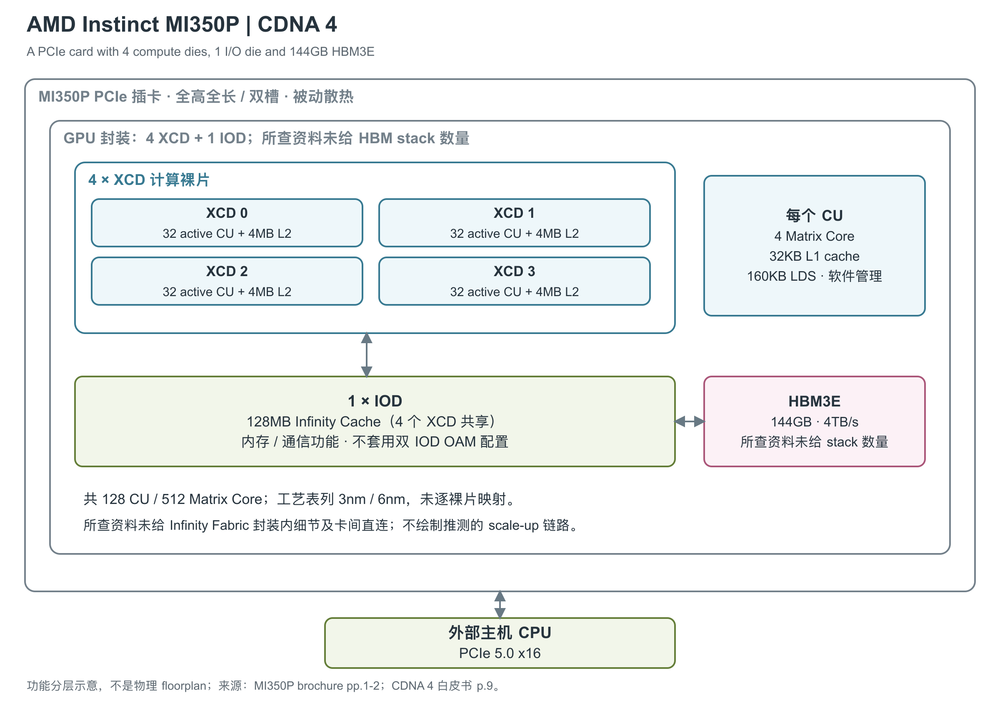

# AMD Instinct MI350P 144GB PCIe

MI350P 把 CDNA 4 计算架构做成标准 PCIe 插卡，面向现有企业机架中的 AI inference、agentic AI 和检索增强生成应用。与同代 OAM 模组相比，它缩小了计算封装与 HBM 配置，并采用双槽被动散热卡形态。[1, opening / Dimensions] [2, pp.1-2] [3, Performance That Drops into Your Existing Racks]

图中 GPU 封装位于整张 PCIe 卡内，由 4 个 XCD（计算裸片）、1 个 IOD（I/O 裸片）和 HBM3E（高带宽堆叠内存）组成。资料只确认 HBM 总容量，所查资料未给出 stack 数量，因此图中保留一个聚合内存框。结构依据 MI350P brochure pp.1-2，CU 的 LDS 说明依据 CDNA 4 白皮书 p.9；连线表示功能关系，不代表物理版图。[2, pp.1-2] [4, p.9]

## 四个计算裸片共享一个内存侧组织

每个 XCD 启用 32 个 CU（Compute Unit，计算单元），合计 128 个 CU、8,192 个 Stream Processor 和 512 个 Matrix Core。最高引擎频率为 2.2GHz。产品页列出 730 亿晶体管和 TSMC 3nm/6nm 工艺，但未逐一说明 MI350P 的 XCD 与 IOD 各采用哪个节点；图中因而不沿用其他 OAM 型号的工艺映射。[1, GPU Specifications] [2, pp.1-2]

CDNA 4 XCD 的任务分发保留 4 个 ACE（Asynchronous Compute Engine，异步计算引擎）及硬件调度器；Figure 2 为各 ACE 标出 HQD0 至 HQD7 的硬件队列入口。队列并行解决任务组织，实际可重叠的执行量仍由 CU、寄存器、LDS 和内存系统决定。[4, Figure 2, p.5]

## CU 内的执行路径与片上存储

CDNA 4 延续 Wave64：一条 wave 包含 64 个线程，vector 指令为每个线程执行算术或逻辑操作；scalar 指令对整个 wave 的共享值执行控制和地址运算。MFMA（Matrix Fused Multiply-Add）则把矩阵块的输入与结果分布在这些线程的寄存器中。产品列出的 Matrix Core 总数与 CU 数之比为 4，整颗 GPU 的 CU 数决定可并行铺开的计算规模，但持续吞吐还受寄存器、LDS（Local Data Share，工作组显式管理的片上暂存区）和数据供给约束。[7, §§1.1,2.1,7.1, pp.4-5,41-43] [1, GPU Specifications]

寄存器在程序中分成普通 VGPR（向量通用寄存器）、AccVGPR（矩阵累加寄存器）和 SGPR（wave 共享的标量寄存器）。每线程可使用最多 256 个普通 VGPR 与 256 个 AccVGPR，合计最多 512 个 32-bit 寄存器，分配粒度为 8 个 DWORD；低于合计上限时，两种寄存器的数量不必相同。每 wave 的 SGPR 按 16 个一组分配，允许 16 至 102 个，另有条件码与异常处理的特定占用。这些是 ISA（指令集架构）可见的分配与寻址限制，不能直接解释成每线程都独占这么多物理 SRAM（静态随机存取存储器）。[7, §§3.6.2-3.6.4, pp.12-13]

| 层级 | 容量和访问组织 | 带宽、访问能力与限制 | 来源 |
|---|---|---|---|
| Instruction cache | 每两个相邻 CU 共享 64KB，8-way | 原文未给绝对读取带宽与命中延迟 | [4, p.6] |
| LDS | 每 CU 160KB；64 banks，每 bank 为 640×4B；含 32 个整数 atomic 单元 | 读 256B/clock；支持冲突检测、调度、swizzle 与 L1 直接装入，绝对写带宽未给出 | [7, §2.2.1, p.6] [4, p.9] |
| L1 vector data cache | 每 CU 32KB；64-way；cache line 128B | 未给出绝对带宽及命中延迟；可直接供给 LDS，减少 VGPR 中转 | [4, p.9] |
| L2 cache | 每 XCD 4MB，16-way；16 个 channel | 每 channel 每周期读 128B、写 64B；按通道求和为每 XCD 读 2,048B/cycle、写 1,024B/cycle，这是理论通道合计 | [4, p.9] |
| Infinity Cache | 全 GPU 128MB，由四个 XCD 共享 | MI350P 资料未给通道、实例数和绝对带宽 | [2, p.2] |
| HBM3E | 144GB，4,096-bit总接口 | 4TB/s峰值；Full-chip ECC | [1, GPU Memory] [2, p.1] |

LDS 是 workgroup 显式使用的临时空间，按 1,280B 的连续块分配，并按 1,280B 对齐。较大的 tile 可以增加复用，也会占用更多 LDS 和寄存器，降低可并行驻留的工作量。bank 冲突会使实际读带宽低于表中上限；直接从 L1 装入 LDS 可省去部分寄存器搬运，但矩阵指令的操作数仍须按 ISA 要求放入相应寄存器。[7, §3.6.5, p.13; §7.1, pp.41-43] [4, p.9]

L2 采用 writeback/write-allocate，并在 XCD 内维护硬件一致性。CDNA 4 还允许 L2 缓存来自 DRAM 的 non-coherent 数据，以及将脏数据写回后仍保留 cache line；这有助于减少后续重复读取，但不等于所有地址空间都具备统一的硬件一致性。当前原文没有给出该型号的 L1、L2、LDS 或 HBM 命中/访问延迟实测值，也没有给齐 register-file 端口带宽，不用邻近型号补填。[4, p.9] [7, §§2.3,3.6,7.1]

## HBM 与 PCIe 卡边界

144GB HBM3E 通过合计 4,096-bit 的接口提供 4TB/s 峰值理论带宽，支持 Full-chip ECC 内存纠错。这个容量、带宽属于整张单 GPU 卡；当前资料不足以确定逐 stack 容量、层数和数量。图中也没有画出卡间 Infinity Fabric 直连，因为入选来源只公开 PCIe 外部端点，没有给出该卡的 scale-up 链路规格。[1, GPU Memory / Board Specifications] [2, p.1 Specifications]

## 低精度格式与单卡理论峰值

MI350P 原生支持 BF16/FP16、OCP-FP8、INT8 及 microscaling 格式 MXFP8、MXFP6、MXFP4。OCP（Open Compute Project）FP8 包含 E4M3/E5M2，MXFP6 包含 E3M2/E2M3，MXFP4 为 E2M1；MX 格式通常由 32 个元素共享 scale。更低位宽需要相应的量化与算子支持，不能只替换性能表中的精度名称。[2, p.2] [4, pp.7-8]

| 运算路径 | Dense / 基础理论峰值 | Structured sparsity 峰值 |
|---|---:|---:|
| MXFP4 / MXFP6 | 各 4.6PFLOPS | 未列 |
| MXFP8 | 2.3PFLOPS | 未列 |
| OCP-FP8 Matrix | 2.3PFLOPS | 4.6PFLOPS |
| INT8 Matrix | 2.3POPS | 4.6POPS |
| FP16 / BF16 Matrix | 各 1.15PFLOPS | 各 2.3PFLOPS |
| FP16 Vector | 72TFLOPS | 不适用 |
| FP32 Vector | 72TFLOPS | 不适用 |
| FP32 Matrix | 72TFLOPS | 未列 |
| FP64 Vector | 36TFLOPS | 不适用 |
| FP64 Matrix | 36TFLOPS | 未列 |

数据采用产品页；2026 年 5 月 brochure 将同组数字标为 estimated。PFLOPS 是每秒千万亿次浮点运算，POPS 用于整数操作，表中各执行路径不能相加，也不代表持续应用吞吐。[1, GPU Specifications] [2, p.1 performance tables]

稀疏列需要 A 矩阵沿 K 轴每 4 个元素有 2 个零，并通过额外输入提供 sparse index，才能在适用路径上获得两倍理论吞吐。已有 ISA（指令集架构）规定了数据与 index 的组织，但所查章节没有给出位置索引带宽、选择电路及功耗开销。MXFP 格式没有单独列出的稀疏峰值，不自行翻倍。选定低精度 MFMA 矩阵指令使用 FP32 C/D 累加，INT8 使用 INT32；这是程序员可见的格式，不代表物理 accumulator 位宽。[7, §7.5, pp.60-64; §12.10, pp.278-283,286-288]

### 每 CU 的吞吐与矩阵指令形状

CDNA 4 白皮书按每 CU 每周期给出的 dense 能力为：FP16/FP32 Vector 各 256 FLOP，FP64 Vector 为 128 FLOP；FP32 Matrix 为 256 FLOP，FP64 Matrix 为 128 FLOP；FP16/BF16 Matrix 各 4096 FLOP，OCP-FP8 Matrix 为 8192 FLOP，INT8 Matrix 为 8192 次整数操作。全芯片峰值由使能 CU 数、相应每周期操作数和计算频率共同决定，乘加按两次操作计数。[4, Table 1, p.8]

同一张原表把 MXFP4/MXFP6 写成 16834 FLOP/CU/clock。这个值与其列出的整芯片峰值不能直接相符，因而保留为原文不一致，不在这里自行改成另一个“官方”值。矩阵尺寸和指令周期则可以直接读 ISA，选定路径如下，所有行均处理一个矩阵块；尺寸采用 M×N×K。[4, Table 1, p.8] [7, Table 28, p.43; §7.1.5, pp.50-51]

| 输入/指令路径 | 矩阵块 M×N×K | C/D 格式 | ISA `Cycles` |
|---|---|---|---:|
| FP32 MFMA | 16×16×4；32×32×2 | FP32 | 32；64 |
| FP16/BF16 MFMA，较大 K 变体 | 16×16×32；32×32×16 | FP32 | 16；32 |
| INT8 MFMA，较大 K 变体 | 16×16×64；32×32×32 | INT32 | 16；32 |
| FP64 MFMA | 16×16×4 | FP64 | 64 |
| F8F6F4 MFMA，A/B 均为 FP4 或 FP6 | 16×16×128；32×32×64 | FP32 | 16；32 |
| F8F6F4 MFMA，A/B 任一为 FP8 | 同上 | FP32 | 32；64 |

F8F6F4 允许独立选择 A、B 的 FP8、FP6 或 FP4 格式；只要其中一侧用 FP8，就采用表内较长周期，不能仅看另一侧 FP4 就套最快一行。scaled MFMA 使用 E8M0 共享 scale。ISA 周期属于指令执行口径，完整 kernel 还包含搬运、同步与格式转换；旧的较小 K 指令也仍可执行，软件需要选用合适变体才能利用新路径。[7, Table 28, p.43; §§7.1.5,7.1.5.1, pp.50-51]

Vector 中的 transcendental（超越函数）路径用于 exp、激活等计算，CDNA 4 白皮书给出相对 CDNA 3 两倍的执行速率，但没有逐函数的绝对 ops/cycle 表，也没有独立的 scalar TOPS 规格。该相对提升不能套用到普通 FP32 或所有 vector 指令。TF32 由 BF16 软件模拟，因此不列为独立原生矩阵硬件峰值。[4, pp.8-9]

## 标准插卡形态带来的系统边界

MI350P 为全高、全长、双槽 PCIe CEM 卡，长 267mm，使用 12V-2x6 辅助供电。Maximum TBP（总板级功耗）为 600W，可配置到 450W；资料没有说明性能表对应哪个功耗点。被动散热指卡本身的散热器形态，部署环境仍需标准风冷服务器提供气流。[1, Requirements / Dimensions / Board Specifications] [2, p.1] [3, Performance That Drops into Your Existing Racks]

卡对主机提供 PCIe Gen5 x16，brochure 写 128GB/s，但未说明方向、有效载荷或持续传输口径。AMD 提到服务器最多可装 8 张 MI350P，只说明部署规模，未因此建立卡间全互联拓扑。单卡还包含 2 组视频 decoder 与合计 20 个 JPEG/MJPEG core，数量按 brochure p.1 规格表；p.2 将 codec 数放在每组叙述中，措辞有歧义。[2, pp.1-2] [3, Performance That Drops into Your Existing Racks]

物理分区最多 4 个，每份 36GB；内存分区表列 1。当前产品页写支持 SR-IOV 虚拟化，而 2026 年 5 月 brochure 仍写 Future SR-IOV support，需保留版本差异。产品在 2026 年 5 月 7 日公开介绍、7 月 23 日发布，系列页尚残留 Preview 标题；现有来源未给出单卡首次出货或正式可用日期。[2, pp.1-2] [1, Additional Features] [3, title] [5, What's New] [6, Delivering the Highest Performance Data Center CPUs and GPUs]

## 参考资料

[1] AMD，*AMD Instinct MI350P PCIe Cards*。<https://www.amd.com/en/products/accelerators/instinct/mi350/mi350p.html> [本地原文](../../原始资料/网页快照/AMD/产品详解补充/2026-09-17/MI350P-1-mi350p.html)

[2] AMD，*AMD Instinct MI350P PCIe Card*，LE-93401-00，05/26。[本地 PDF](../../原始资料/论文/AMD_Instinct/02_厂商产品资料/2026_AMD_Instinct_MI350P_PCIe_Card_Brochure.pdf)

[3] AMD，*AMD Instinct MI350P PCIe GPUs: Run Enterprise AI on Your Existing Infrastructure*，2026-05-07。<https://www.amd.com/en/blogs/2026/amd-instinct-mi350p-pcie-gpus-run-enterprise-ai-on-your.html> [本地原文](../../原始资料/网页快照/AMD/产品详解补充/2026-09-17/MI350P-3-amd-instinct-mi350p-pcie-gpus-run-enterprise-ai-on-your.html)

[4] AMD，*Introducing AMD CDNA 4 Architecture*。[本地 PDF](../../原始资料/论文/AMD_Instinct/01_厂商直接架构论文/2025_AMD_CDNA_4_Architecture_White_Paper.pdf)

[5] AMD，*AMD Instinct MI350 Series GPUs*。<https://www.amd.com/en/products/accelerators/instinct/mi350.html> [本地原文](../../原始资料/网页快照/AMD/产品详解补充/2026-09-17/MI350P-5-mi350.html)

[6] AMD，*AAI 2026: AMD Delivers Full-Stack Compute for the Agentic AI Era*，2026-07-23。<https://ir.amd.com/news-events/press-releases/detail/1294/aai-2026-amd-delivers-full-stack-compute-for-the-agentic-ai-era> [本地原文](../../原始资料/网页快照/AMD/产品详解补充/2026-09-17/MI350P-6-aai-2026-amd-delivers-full-stack-compute-for-the-agentic-ai-era.html)

[7] AMD，*CDNA4 Instruction Set Architecture: Reference Guide*，2025-08-05。正文引用本手册的印刷页码。<https://www.amd.com/content/dam/amd/en/documents/instinct-tech-docs/instruction-set-architectures/amd-instinct-cdna4-instruction-set-architecture.pdf> [本地原文](../../原始资料/论文/AMD_Instinct/90_官方白皮书与技术资料/amd-instinct-cdna4-instruction-set-architecture.pdf)
