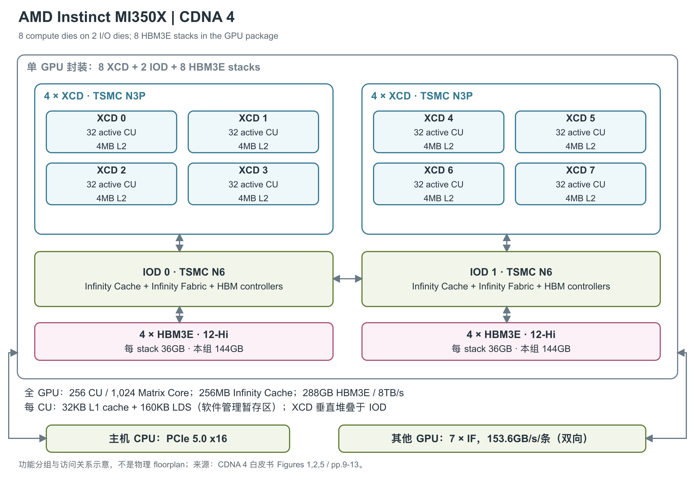

# AMD Instinct MI350X 288GB

MI350X 是 CDNA 4 家族面向 AI training、inference 与高性能计算的 OAM（OCP Accelerator Module，加速器模组）。它在延续多裸片组织的基础上增强低精度矩阵计算，并把计算下方的 I/O 裸片从上一代的四块重组为两块。[2, p.1] [3, pp.3-4]

图将封装按两组展开：每组包含 4 个 XCD（计算裸片）、下方的 1 个 IOD（I/O 裸片）及相连的 4 个 HBM3E（高带宽堆叠内存）stack。实际 XCD 垂直堆叠在 IOD 上；图中连线表示访问与互联关系，不代表真实版图位置或所有 cache 的强制访问顺序。依据 CDNA 4 白皮书 Figures 1、2、5 及 pp.9-13 绘制。[3, Figures 1,2,5, pp.9-13]

## 计算与通信分布在什么位置

MI350X 有 8 个 TSMC N3P XCD。每个 XCD 设计 36 个 CU（Compute Unit，计算单元），实际启用 32 个，整颗 GPU 合计 256 个 CU、16,384 个 Stream Processor 和 1,024 个 Matrix Core，最高引擎频率 2.2GHz。产品页列出的总晶体管数为 1,850 亿。CU 数量不直接代表跨代算力：CDNA 4 的每个 CU 增强了矩阵运算和低精度格式支持，不能只按 CU 数比较上一代与这一代。[3, pp.4-8] [1, GPU Specifications]

CDNA 4 XCD 的任务分发保留 4 个 ACE（Asynchronous Compute Engine，异步计算引擎）及硬件调度器；Figure 2 为各 ACE 标出 HQD0 至 HQD7 的硬件队列入口。队列并行解决任务组织，实际可重叠的执行量仍由 CU、寄存器、LDS 和内存系统决定。[3, Figure 2, p.5]

## CU 内的执行路径与片上存储

CDNA 4 延续 Wave64：一条 wave 包含 64 个线程，vector 指令为每个线程执行算术或逻辑操作；scalar 指令对整个 wave 的共享值执行控制和地址运算。MFMA（Matrix Fused Multiply-Add）则把矩阵块的输入与结果分布在这些线程的寄存器中。产品列出的 Matrix Core 总数与 CU 数之比为 4，整颗 GPU 的 CU 数决定可并行铺开的计算规模，但持续吞吐还受寄存器、LDS（Local Data Share，工作组显式管理的片上暂存区）和数据供给约束。[6, §§1.1,2.1,7.1, pp.4-5,41-43] [1, GPU Specifications]

寄存器在程序中分成普通 VGPR（向量通用寄存器）、AccVGPR（矩阵累加寄存器）和 SGPR（wave 共享的标量寄存器）。每线程可使用最多 256 个普通 VGPR 与 256 个 AccVGPR，合计最多 512 个 32-bit 寄存器，分配粒度为 8 个 DWORD；低于合计上限时，两种寄存器的数量不必相同。每 wave 的 SGPR 按 16 个一组分配，允许 16 至 102 个，另有条件码与异常处理的特定占用。这些是 ISA（指令集架构）可见的分配与寻址限制，不能直接解释成每线程都独占这么多物理 SRAM（静态随机存取存储器）。[6, §§3.6.2-3.6.4, pp.12-13]

| 层级 | 容量和访问组织 | 带宽、访问能力与限制 | 来源 |
|---|---|---|---|
| Instruction cache | 每两个相邻 CU 共享 64KB，8-way | 原文未给绝对读取带宽与命中延迟 | [3, p.6] |
| LDS | 每 CU 160KB；64 banks，每 bank 为 640×4B；含 32 个整数 atomic 单元 | 读 256B/clock；支持冲突检测、调度、swizzle 与 L1 直接装入，绝对写带宽未给出 | [6, §2.2.1, p.6] [3, p.9] |
| L1 vector data cache | 每 CU 32KB；64-way；cache line 128B | 未给出绝对带宽及命中延迟；可直接供给 LDS，减少 VGPR 中转 | [3, p.9] |
| L2 cache | 每 XCD 4MB，16-way；16 个 channel | 每 channel 每周期读 128B、写 64B；按通道求和为每 XCD 读 2,048B/cycle、写 1,024B/cycle，这是理论通道合计 | [3, p.9] |
| Infinity Cache | 全 GPU 256MB，16-way；每 HBM stack 对应 16 个 64B 宽 channel，每 channel 连接 2MB 的分 bank 阵列 | 支持内存侧缓存；此版白皮书未给绝对吞吐，不沿用 CDNA 3 的 17.2TB/s | [3, p.11] |
| HBM3E | 8个36GB、12-Hi stack；合计288GB，8,192-bit总接口 | 8Gbps接口数据率，8TB/s产品峰值；Full-chip ECC | [1, GPU Memory] [2, p.1] [3, pp.2,11] |

LDS 是 workgroup 显式使用的临时空间，按 1,280B 的连续块分配，并按 1,280B 对齐。较大的 tile 可以增加复用，也会占用更多 LDS 和寄存器，降低可并行驻留的工作量。bank 冲突会使实际读带宽低于表中上限；直接从 L1 装入 LDS 可省去部分寄存器搬运，但矩阵指令的操作数仍须按 ISA 要求放入相应寄存器。[6, §3.6.5, p.13; §7.1, pp.41-43] [3, p.9]

L2 采用 writeback/write-allocate，并在 XCD 内维护硬件一致性。CDNA 4 还允许 L2 缓存来自 DRAM 的 non-coherent 数据，以及将脏数据写回后仍保留 cache line；这有助于减少后续重复读取，但不等于所有地址空间都具备统一的硬件一致性。当前原文没有给出该型号的 L1、L2、LDS 或 HBM 命中/访问延迟实测值，也没有给齐 register-file 端口带宽，不用邻近型号补填。[3, p.9] [6, §§2.3,3.6,7.1]

## 封装内互联与 HBM

图中两个 IOD 使用 TSMC N6 工艺，承接 Infinity Cache、HBM controller 和系统接口，彼此通过 Infinity Fabric 直接通信。合计 256MB 的 Infinity Cache 是 memory-side cache，位于内存侧，与 XCD 内的 L2 分属不同裸片和层次。两个 IOD 之间的直连减少跨 IOD 通信经过的中间路径，白皮书正文称连接约快 14%，脚注 MI350-051 将比较对象限定为 MI355X 与 MI300X 的 IOD 剖分连接峰值理论带宽（AMD Performance Labs，2025 年 6 月）。该比例不是访问延迟下降幅度，也不是应用加速比。[3, pp.10-11; p.21, MI350-051]

白皮书 Figure 5 还给出封装内 Infinity Fabric Advanced Package 的 5.5TB/s bisection bandwidth，即跨封装两侧的剖分带宽。它描述 IOD 之间的内部通信能力，不能与 8TB/s HBM 带宽或模组之间的 Infinity Fabric 链路带宽互换。图中直接连接降低了跨 IOD 请求的中间跳数。[3, Figure 5, pp.10-11]

两个 IOD 各连接 4 个 HBM3E stack，合计 8 个。每个 stack 为 12-Hi、36GB，整颗 GPU 因而有 288GB HBM3E、8,192-bit 接口与 8TB/s 峰值理论内存带宽，并支持 Full-chip ECC。12-Hi 表示 DRAM 堆叠层数，8 个则是封装内 stack 的数量，两者不能混为同一种裸片计数。[3, pp.2,10-11] [1, GPU Memory]

HBM 中的模型数据经内存系统供给计算，重复使用的数据可由 L2、Infinity Cache 或程序安排的 LDS 复用。计算分区可以沿 XCD 划为 1、2、4、8 份；内存访问则有 NPS1 与 NPS2 两种 NUMA（非均匀内存访问）模式，分别跨两 IOD 交织或形成两个 144GB 内存池。产品 brochure 的 Memory Partitions 另写“1 or 4”，与白皮书的 NPS1/NPS2 不一致，因此不能直接把该字段解释为 NPS4。[3, pp.11-13, Figure 6] [2, p.1] Figure 6 进一步给出 SPX+NPS1 的 288GB 单实例，以及 DPX/QPX/CPX 配合 NPS2 时每实例 144/72/36GB 的配置。后者仍只有两个 IOD 内存池：计算实例数与 NUMA 域数量不同。白皮书说明，采用本地 NPS2 分区可使访问留在对应 IOD 与 XCD 组内，减少跨 IOD 流量；没有给出每种工作负载的固定加速比。[3, Figure 6, pp.12-13]

## 低精度峰值与使用条件

CDNA 4 引入 OCP（Open Compute Project）标准的 microscaling 数值格式 MXFP8、MXFP6、MXFP4，通常每 32 个元素共享一个 scale。OCP-FP8 支持 E4M3/E5M2，MXFP6 支持 E2M3/E3M2，MXFP4 为 E2M1。不同格式需要模型和算子选择相应的数据表示；CDNA 4 已移除 TF32 物理路径，相关功能由 BF16 软件模拟。[3, pp.7-8]

| 运算路径 | Dense / 基础理论峰值 | Structured sparsity 峰值 |
|---|---:|---:|
| MXFP4 / MXFP6 | 各 9.2275PFLOPS | 未列 |
| MXFP8 | 4.614PFLOPS | 未列 |
| OCP-FP8 Matrix | 4.614PFLOPS | 9.2274PFLOPS |
| INT8 Matrix | 4.614POPS | 9.2274POPS |
| FP16 / BF16 Matrix | 各 2.3PFLOPS | 各 4.6PFLOPS |
| FP16 Vector | 144.2TFLOPS | 不适用 |
| FP32 Vector | 144.2TFLOPS | 不适用 |
| FP32 Matrix | 144.2TFLOPS | 未列 |
| FP64 Vector | 72.1TFLOPS | 不适用 |
| FP64 Matrix | 72.1TFLOPS | 未列 |

FP16/BF16 采用产品页的 2.3/4.6PFLOPS 舍入值。Brochure 写 2.3096/4.6192PFLOPS，而按白皮书的 256 CU×2.2GHz×4096 FLOP/CU/cycle 复算得到 2.3068672PFLOPS dense；这是一处原始资料的算术不一致，复算值不作为厂商勘误。其余行保留 brochure 的精确显示值。表中 PFLOPS 为每秒千万亿次浮点运算，POPS 用于整数操作，Vector 与 Matrix 路径不相加。[1, GPU Specifications] [2, p.1 AI / HPC Peak Theoretical Performance] [3, Tables 1-2]

OCP-FP8、FP16、BF16、INT8 的稀疏峰值要求 A 矩阵沿 K 轴每 4 个元素有 2 个零，并提供位置 index；MXFP 行未列稀疏倍增值，不自行乘二。ISA（指令集架构）中选定低精度 MFMA 矩阵指令使用 FP32 C/D 累加，INT8 使用 INT32。峰值不包含整段程序的数据搬运、格式转换和其他运算时间。[6, §7.5, pp.60-64; §12.10, pp.278-283,286-288]

### 每 CU 的吞吐与矩阵指令形状

CDNA 4 白皮书按每 CU 每周期给出的 dense 能力为：FP16/FP32 Vector 各 256 FLOP，FP64 Vector 为 128 FLOP；FP32 Matrix 为 256 FLOP，FP64 Matrix 为 128 FLOP；FP16/BF16 Matrix 各 4096 FLOP，OCP-FP8 Matrix 为 8192 FLOP，INT8 Matrix 为 8192 次整数操作。全芯片峰值由使能 CU 数、相应每周期操作数和计算频率共同决定，乘加按两次操作计数。[3, Table 1, p.8]

同一张原表把 MXFP4/MXFP6 写成 16834 FLOP/CU/clock。这个值与其列出的整芯片峰值不能直接相符，因而保留为原文不一致，不在这里自行改成另一个“官方”值。矩阵尺寸和指令周期则可以直接读 ISA，选定路径如下，所有行均处理一个矩阵块；尺寸采用 M×N×K。[3, Table 1, p.8] [6, Table 28, p.43; §7.1.5, pp.50-51]

| 输入/指令路径 | 矩阵块 M×N×K | C/D 格式 | ISA `Cycles` |
|---|---|---|---:|
| FP32 MFMA | 16×16×4；32×32×2 | FP32 | 32；64 |
| FP16/BF16 MFMA，较大 K 变体 | 16×16×32；32×32×16 | FP32 | 16；32 |
| INT8 MFMA，较大 K 变体 | 16×16×64；32×32×32 | INT32 | 16；32 |
| FP64 MFMA | 16×16×4 | FP64 | 64 |
| F8F6F4 MFMA，A/B 均为 FP4 或 FP6 | 16×16×128；32×32×64 | FP32 | 16；32 |
| F8F6F4 MFMA，A/B 任一为 FP8 | 同上 | FP32 | 32；64 |

F8F6F4 允许独立选择 A、B 的 FP8、FP6 或 FP4 格式；只要其中一侧用 FP8，就采用表内较长周期，不能仅看另一侧 FP4 就套最快一行。scaled MFMA 使用 E8M0 共享 scale。ISA 周期属于指令执行口径，完整 kernel 还包含搬运、同步与格式转换；旧的较小 K 指令也仍可执行，软件需要选用合适变体才能利用新路径。[6, Table 28, p.43; §§7.1.5,7.1.5.1, pp.50-51]

Vector 中的 transcendental（超越函数）路径用于 exp、激活等计算，CDNA 4 白皮书给出相对 CDNA 3 两倍的执行速率，但没有逐函数的绝对 ops/cycle 表，也没有独立的 scalar TOPS 规格。该相对提升不能套用到普通 FP32 或所有 vector 指令。TF32 由 BF16 软件模拟，因此不列为独立原生矩阵硬件峰值。[3, pp.8-9]

## 连接主机及其他 GPU

每个 OAM（加速器模组）通过 PCIe Gen5 x16 连接主机，brochure 标注 128GB/s，但未说明其方向与有效载荷口径。其余 7 条 Infinity Fabric link 用于 GPU 间直连，每条峰值双向合计 153.6GB/s，七条合计 1,075.2GB/s。在八 GPU 底板上，每块 GPU 可直连另外七块；平台的约 2.3TB HBM 和 64TB/s 内存带宽属于八块模组的汇总。[2, p.1 Specifications] [3, p.13] [5, AMD Instinct MI350 Series Platforms]

MI350X 的 maximum TBP（总板级功耗）为 1000W，采用 54V UBB 供电和被动散热 OAM。白皮书将其放在风冷系统与既有 UBB 2.0 平台兼容的路线中；兼容平台并不保证无需调整服务器的供电、散热或固件。典型功耗、环境温度和可长期维持峰值的条件没有公开。[1, Requirements / Board Specifications] [2, p.1] [3, p.3; Table 2, p.19]

安全功能包括 device secure boot、secure update/recovery、基于 DICE 的设备身份与 attestation，以及 GPU 间 Infinity Fabric link security；这些分别对应可信固件、设备身份和通信保护。SR-IOV 提供多虚拟机资源划分，不能据此假设每个安全功能在所有系统配置下默认启用。[2, p.2 Built-in Security for AI & HPC Deployments]

产品于 2025 年 6 月 12 日发布，并提供 SR-IOV 虚拟化、失效页处理、4 组视频解码资源和合计 40 个 JPEG/MJPEG core；p.2 媒体说明措辞含混时，数量按 p.1 规格表读取。[1, Product Basics / Additional Features] [4, opening] [2, pp.1-2]

互联还有需保留的资料差异：产品页单链路取整为 153GB/s，brochure p.2 的 coherent shared memory 段另写 160GB/s，本文采用规格表和白皮书的 153.6GB/s。该段的 hybrid hardware/software memory coherency 也不能解读为八 GPU 全部内存都由硬件透明维持一致性。产品页的 scale-out 项与 PCIe 项不应重复计成第九个物理端点；所查产品页、brochure 和白皮书未给出具体封装尺寸、die 面积和键合 pitch。[1, Board Specifications] [2, p.2 Coherent Shared Memory] [3, pp.10,13]

## 参考资料

[1] AMD，*AMD Instinct MI350X GPUs*。<https://www.amd.com/en/products/accelerators/instinct/mi350/mi350x.html> [本地原文](../../原始资料/网页快照/AMD/产品详解补充/2026-09-17/MI350X-1-mi350x.html)

[2] AMD，*AMD Instinct MI350X GPU*，LE-92701-00 C，09/25。<https://www.amd.com/content/dam/amd/en/documents/instinct-tech-docs/product-briefs/amd-instinct-mi350x-gpu-brochure.pdf> [本地原文](../../原始资料/论文/AMD_Instinct/90_官方白皮书与技术资料/amd-instinct-mi350x-gpu-brochure.pdf)

[3] AMD，*Introducing AMD CDNA 4 Architecture*。[本地 PDF](../../原始资料/论文/AMD_Instinct/01_厂商直接架构论文/2025_AMD_CDNA_4_Architecture_White_Paper.pdf)

[4] AMD，*AMD Unveils Vision for an Open AI Ecosystem, Detailing New Silicon, Software and Systems at Advancing AI 2025*，2025-06-12。<https://ir.amd.com/news-events/press-releases/detail/1255/amd-unveils-vision-for-an-open-ai-ecosystem-detailing-new-silicon-software-and-systems-at-advancing-ai-2025> [本地原文](../../原始资料/网页快照/AMD/产品详解补充/2026-09-17/MI350X-4-amd-unveils-vision-for-an-open-ai-ecosystem-detailing-new-silicon-software-and-systems-at-advancing-ai-2025.html)

[5] AMD，*AMD Instinct MI350 Series GPUs*。<https://www.amd.com/en/products/accelerators/instinct/mi350.html> [本地原文](../../原始资料/网页快照/AMD/产品详解补充/2026-09-17/MI350P-5-mi350.html)

[6] AMD，*CDNA4 Instruction Set Architecture: Reference Guide*，2025-08-05。正文引用本手册的印刷页码。<https://www.amd.com/content/dam/amd/en/documents/instinct-tech-docs/instruction-set-architectures/amd-instinct-cdna4-instruction-set-architecture.pdf> [本地原文](../../原始资料/论文/AMD_Instinct/90_官方白皮书与技术资料/amd-instinct-cdna4-instruction-set-architecture.pdf)
