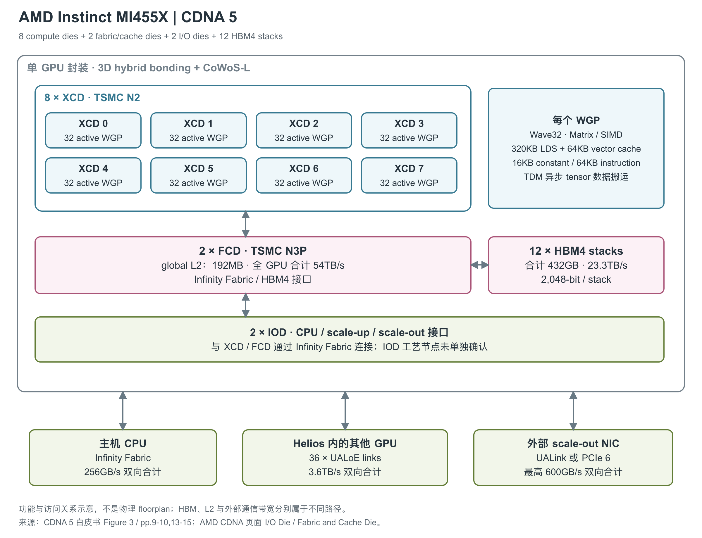

# AMD Instinct MI455X 432GB EAM

MI455X 是采用 CDNA 5 架构、面向 Helios 机架级系统的 GPU，加速 AI training、inference 和 fine-tuning。它采用 EAM（Enhanced Accelerator Module，增强型加速器模组）形态；本文按产品页与 CDNA 页面中的单 GPU/EAM 规格介绍，四 GPU 计算托盘和 72 GPU 机架是其上层系统。Brochure p.2 对“四颗 GPU 装在 EAM 上”的叙述有歧义，因此封装内部资源与性能均以单 GPU 数据为准。[1, opening / Board Specifications] [2, pp.1-2] [3, Unified Fabric and I/O]

图中计算、cache 与外部通信分布在三类逻辑裸片上，封装内另有 12 个 HBM4（高带宽堆叠内存）stack。与前代最明显的区别是 L2 现在放在 FCD（Fabric and Cache Die，互联与缓存裸片）上。示意依据 CDNA 5 白皮书 Figure 3、pp.9-10、13-15 和 MI455X brochure p.1，FCD 的 HBM 接口与 IOD 的外部接口归属另据 CDNA 官方页面；按功能分层展开，不代表物理版图或逐事务的必经路径。[4, Figure 3, pp.9-10,13-15] [2, p.1] [3, I/O Die / Fabric and Cache Die / Advanced Packaging]

## 从 CU 转向 WGP 的计算组织

MI455X 有 8 个 XCD（计算裸片），每个 XCD 启用 32 个 WGP（Work Group Processor，工作组处理器），分为两个各含 16 WGP 的 Shader Engine，整颗 GPU 合计 256 个 WGP，最高引擎频率为 2.4GHz。WGP 采用 Wave32，即一组指令以 32 个线程为执行单位，内部含 4 个 32-thread SIMD（单指令多数据）单元和 4 个 scalar 单元。它不能直接按传统 CDNA 3/4 的 CU 个数来判断跨代资源是否相同。[4, p.6] [1, GPU Specifications]

产品 brochure 仍把 256 写成 Compute Units，当前产品页与白皮书使用 WGP，本文沿用后者。矩阵路径通过 WMMA 和稀疏 SWMMAC 指令暴露；现有来源没有给出可以与前代直接一一对应的 Matrix Core 总数，因此图中不补画推测数量。[2, p.1 Specifications] [4, p.6] [9, §15.10, pp.454-464]

## 寄存器、局部存储与数据搬运

Wave32 改变了程序分配线程和寄存器的粒度。每个 WGP 最多驻留 64 条 wave，单条 wave 的每线程 VGPR（向量通用寄存器）索引空间扩大到 1,024 个 32-bit 寄存器；这不表示 64 条 wave 可以同时各自占满上限。线程的索引范围与实际寄存器容量需要分别看：Figure 7 给出的物理容量是每 SIMD 128KB、每 WGP 四份。[4, pp.10-11, Figure 7]

| 局部资源 | 容量或数量 | 用途与使用条件 | 来源 |
|---|---|---|---|
| SIMD 内 vector register file | 每 SIMD 128KB；每 WGP 4 个 SIMD | 每线程最多 1,024 个 VGPR；Wave32 按 16 个寄存器一组分配，即每 wave 一组占 512 DWORD | [4, Figure 7, p.11] [9, §3.3.2, p.16] |
| Scalar register file | 每 SIMD 8KB，每 WGP 32KB；白皮书按每 wave 128 个 32-bit 槽位计 | ISA（指令集架构）将其区分为 106 个普通 SGPR、2 个 VCC、16 个 trap 临时寄存器及特殊地址；不能把128都当用户变量寄存器 | [4, p.10] [9, §3.3.1, pp.14-15] |
| LDS（Local Data Share，工作组暂存区）/ vector cache 共享的本地 SRAM | 每 WGP 合计384KB，公开配置为320KB LDS＋64KB vector cache；全 GPU 合计96MB | LDS用于程序安排的工作组数据，vector cache用于访问复用，cache另有tag存储；不是384KB都可当LDS | [4, p.10] |
| Constant cache | 每 WGP 16KB | 向标量执行提供常量 | [4, pp.6,10] [9, §1.2.3, p.8] |
| Instruction cache | 每 WGP 64KB | 向各SIMD提供指令 | [4, p.10] [9, §1.2.3, p.8] |
| TDM（Tensor Data Mover）数据搬运单元 | 白皮书按每 WGP 一份描述 | 支持最多5维tensor tile、异步搬运和multicast | [4, p.10] |

ISA 说明 LDS/vector cache 的本地空间可以在两种用途之间配置，但没有在这些来源中给出 MI455X 可选容量组合的完整表。其数据阵列按 32-bit bank 组织，相邻地址落到不同 bank，并支持 LDS atomic read-modify-write。白皮书只说局部 SRAM 读写带宽有所增加，没有给出绝对 B/cycle；因此这里不从前代吞吐倍数推定 MI455X 的 LDS 或寄存器带宽。[9, §1.2.2, pp.7-8] [4, p.10]

TDM 读取 SGPR 中的搬运描述符，对边界进行检查，并与 kernel 的计算异步推进。数据可直接在 DRAM 与 LDS 之间传输，multicast 又可把一次读取的数据送给多个 WGP。它减少寄存器中转及重复读取，但 multicast 带来的有效数据供给量取决于复用者数量，不能当作物理 HBM 引脚带宽变大。[4, p.10]

## 全局 L2 与十二个 HBM4 stack

MI455X 将全 GPU 的 L2 放在两个 FCD 上，由它们服务计算侧的访存。前代把 L2 分散在各 XCD、再在 IOD 上设置 Infinity Cache；CDNA 5 改为 global L2，容量与带宽应按新的归属读取。[4, p.10]

CDNA 官方页面还列出两个 FCD 合计提供 192-channel HBM4 接口；这里的 channel 是内存接口分组，不能与 L2 的 1MB block 数混为一项参数。[3, Fabric and Cache Die]

封装内的 HBM4 通过 FCD 的内存接口供给数据，支持 Full-chip ECC。下表区分 cache 与 DRAM 两侧的容量和带宽；所查来源未给出逐 stack 堆叠高度、内存时钟与持续工作负载带宽。[4, pp.9-10] [1, GPU Memory] [2, p.1]

| 共享存储或通路 | 容量/接口 | 带宽口径 | 来源 |
|---|---|---|---|
| 单 FCD 的 L2 | 96×1MB，共96MB | 27TB/s，原文未拆开读与写 | [4, p.10, Figure 7] |
| 全 GPU 的 L2 | 两个FCD合计192MB | 54TB/s聚合 | [4, p.10] |
| HBM4 | 12个stack，共432GB；每stack 2,048-bit | 23.3TB/s全GPU峰值 | [4, pp.9-10] [2, p.1] |
| FCD/XCD/IOD 的封装内互联 | Infinity Fabric AP | 已公开所连接的裸片关系，但未给独立的封装bisection或逐连接带宽数值 | [4, Figure 8, pp.14-15] |

Figure 7 将 L2 带宽标在 L2 与计算侧之间。一次请求能否以这一级速度满足，要看缓存命中、并发请求和访问局部性；同时经过 L2 与 HBM 的请求不能把两项带宽相加。当前白皮书和 ISA 没有给出 MI455X 各级 cache/HBM 的可复现实测访问延迟。[4, Figure 7, p.11] [9, §1.2.2, pp.7-8]

物理实现包含 8 XCD、2 FCD 和 2 IOD（I/O 裸片），共 12 个逻辑裸片，总晶体管数为 3,200 亿，另有 12 个 HBM stack；HBM 内部 DRAM 层不计入上述逻辑裸片数。XCD 使用 TSMC N2，FCD 使用 N3P，采用 3D hybrid bonding 与 CoWoS-L 封装。白皮书节点说明另用 MID 一词，未明确将其与图中 IOD 对应，因此 IOD 节点仍保留为未单独确认。[4, pp.14-15, Figure 8] [3, Advanced Packaging] [5, Advanced GPU Packaging Enables Next-Gen AI Scaling]

## 不同精度下的理论计算能力

下表来自 MI455X brochure，全部为单 GPU 理论峰值。PFLOPS 表示每秒千万亿次浮点运算，POPS 用于整数操作；Vector 与 Matrix 为不同执行路径，不相加。[2, p.1 AI Peak Theoretical Performance]

| 运算路径 | Dense / 基础理论峰值 | Structured sparsity 峰值 |
|---|---:|---:|
| OCP MXFP4 | 40.265PFLOPS | 未列 |
| OCP MXFP6 / MXFP8 | 各 20.133PFLOPS | 未列 |
| OCP FP8 | 20.133PFLOPS | 未列 |
| FP16 / BF16 Matrix | 各 5.033PFLOPS | 各 10.066PFLOPS |
| INT8 Matrix | 5.033POPS | 10.066POPS |
| FP16 Vector | 315TFLOPS | 不适用 |
| FP32 Vector | 315TFLOPS | 不适用 |
| FP32 Matrix | 315TFLOPS | 未列 |
| FP64 Vector | 5TFLOPS | 不适用 |
| FP64 Matrix | 5TFLOPS | 未列 |

OCP 是 Open Compute Project；MX 为共享 scale 的 microscaling 格式。稀疏 SWMMAC 要求 A 矩阵沿 K 轴每 4 个元素有 2 个零，并由 index 标识位置。官方峰值表只在 FP16、BF16、INT8 行列出稀疏值，因此不替 MXFP 或 FP8 行乘二。ISA（指令集架构）中的 FP4 WMMA 使用 FP32 C/D，FP8 WMMA 可用 FP32 或 FP16 C/D，INT8 使用 signed INT32；它们是程序员可见的累加格式，并未揭示内部 accumulator 位宽。[4, p.7] [9, Table 43, pp.95-96; §7.12.3, p.101; §15.10, pp.454-464]

### WMMA 的矩阵块与数值格式

WMMA（Wave Matrix Multiply-Accumulate）以一条 Wave32 协作完成矩阵块，A/B/C/D 分散保存在各 lane 的 VGPR 中。下面列出 ISA 的主要组合；M×N×K 决定 A 为 M×K、B 为 K×N、输出为 M×N。表内数值描述指令形状和格式，不是物理矩阵阵列的行列数。[9, §7.12, Table 43, pp.94-96; §7.12.2, pp.99-101]

| 输入路径 | WMMA矩阵块 M×N×K | 允许的C与输出D格式 | 来源 |
|---|---|---|---|
| FP32 | 16×16×4 | C/D均FP32 | [9, Table 43, p.95] |
| FP16 | 16×16×32 | C/D均FP32，或均FP16 | [9, Table 43, p.95] |
| BF16 | 16×16×32 | C/D均FP32、均BF16，或C为FP32而D为BF16 | [9, Table 43, p.95] |
| FP8/BF8，可混用两种输入格式 | 16×16×64，或16×16×128 | C/D均FP32，或均FP16 | [9, Table 43, p.95] |
| INT8/UINT8 | 16×16×64 | C/D为signed INT32；A/B可独立选择有符号/无符号 | [9, Table 43, pp.95-96] |
| 带scale的FP8/FP6/FP4 | 16×16×128 | C/D均FP32 | [9, Table 43, p.96] |
| 带scale的FP4专用较宽块 | 32×16×128 | C/D均FP32 | [9, Table 43, p.96] |

这代 microscaling 可按 K 维连续 16 或 32 个元素共用 scale。FP8/FP6/FP4 可使用 E8M0 scale，FP4 还允许 E4M3 或 E5M3 的 fractional scale，但 A/B 组合须符合 ISA 表格。例如双方同为 FP4 时，fractional scale 需同用 E4M3 或同用 E5M3，不能任意混搭。这些 block-scale WMMA 指令不支持结构化稀疏。更细分组会改变 scale 的数量和搬运成本，不能只按数据本体的四位宽度计算全部存储量。[4, p.7] [9, §7.12.6, pp.103-105]

稀疏 SWMMAC 仅压缩 A：沿 K 维每四个元素中保留两个非零值，并用两个2-bit index 指明位置，且 index0＜index1；B 保持 dense。比如 FP16 的 dense 块为16×16×32，而相应 sparse 块的逻辑大小为16×16×64。ISA 还定义了 FP8/BF8 稀疏指令，但产品峰值表没有给该行的稀疏性能，指令存在与厂商公开吞吐是两件事。[9, Table 43, pp.95-96; §7.12.3, p.101] [2, p.1]

普通向量路径新增原生 BF16，特殊函数路径新增 tanh；白皮书给出现有超越函数相对 MI355X 两倍的吞吐说明，但没有逐函数绝对速率，也没有 BF16 Vector 的独立产品峰值。每个 SIMD 每周期可以开始一组32线程操作，不代表所有指令均在一周期完成；这些信息不用于补造缺失的scalar、BF16 Vector或tanh峰值。[4, pp.6-7]

## 三类外部通信分别连接什么

CPU-GPU Infinity Fabric 让主机访问 GPU 内存，并提供硬件缓存一致性；UALoE（Ultra Accelerator Link over Ethernet）则服务同一 Helios 域内的 GPU 协作。[4, pp.4,12,14]

Scale-out 连接外部 NIC（网络接口卡），再通过网络扩展到更大的集群。PCIe 和 UALink 是两种 NIC 连接方式；表中的 scale-out 上限包含外部网卡配置条件，GPU 本身不因此多出独立以太网卡。[4, p.13]

| 外部通路 | 单GPU端点配置 | 单向/双向口径 | 来源 |
|---|---|---|---|
| CPU-GPU Infinity Fabric | 16 lanes | 256GB/s双向合计；CPU可硬件一致地缓存访问GPU内存 | [4, p.14] |
| UALoE scale-up | 36 links；每link含2条200Gbit/s Ethernet lane | 每link每方向400Gbit/s；单GPU双向合计3.6TB/s | [4, pp.4,12] |
| PCIe形式的scale-out连接 | 2×PCIe Gen6 x16，每pin 64Gb/s，连接两个外部NIC | 每NIC最高800Gbit/s单向、200GB/s双向 | [4, p.13] |
| UALink形式的scale-out连接 | 最多3组x8，每pin 128Gb/s，连接三个外部NIC | 三NIC配置最高600GB/s双向合计 | [4, p.13] |

Scale-up 引入 split DMA：软件请求先交给前端，拆分后分派给各 UALoE 后端传输单元，由后端选择链路完成 GPU 间搬运；另有后端服务单 GPU 内存系统。这样通信库不必显式处理所有链路拓扑。UALoE 面向短距离 GPU 内存事务，控制和缓冲组织区别于通用 Ethernet NIC；跨 pod 的 scale-out 则使用 RDMA/消息传递。[4, pp.12-13]

## 分区、安全与部署条件

白皮书的空间分区在启动时配置。下列容量是每个计算分区所分得的 HBM，不能理解为增加了物理内存；分区共享同一颗 GPU 的供电和外部接口。[4, Figure 5, p.8]

| 计算模式 | 分区数量 | 每分区XCD | 每分区HBM | 图中内存模式 |
|---|---:|---:|---:|---|
| SPX | 1 | 8 | 432GB | NPS1 |
| DPX | 2 | 4 | 216GB | NPS2 |
| QPX | 4 | 2 | 108GB | NPS2 |
| CPX | 8 | 1 | 54GB | NPS2 |

安全机制包括芯片信任根、SPDM设备认证、TEE（可信执行环境）与Trusted I/O。UALoE可选择使用AES-256-GCM加密链路流量，并支持安全域延伸到多GPU；不能据此假设默认启用了加密，或加密下的持续吞吐与未加密峰值相同。媒体资源还包括4个HEVC/H.265、AVC/H.264、VP9、AV1解码引擎，以及40个JPEG/MJPEG core。[4, pp.9,12-13] [2, p.1]

EAM 采用直接液冷；所查来源未给出单模组 TBP/TDP、供电、尺寸以及液流工况。产品于 2026 年 7 月 23 日正式发布，Helios 进入生产且计划在下半年规模部署，但单 EAM 的独立首次供货日期未给出。产品支持 SR-IOV 虚拟化与失效页处理。[1, Product Basics / Board Specifications] [2, pp.1-2] [7, opening] [5, FAQ]

仍需保留两处来源差异：brochure 的 Memory Partitions 写 4，白皮书 Figure 5 给出 NPS1/NPS2 及 1/2/4/8 个计算分区，不能把“4”直接解释成 NPS4；Helios 页的托盘段落保留 19.6TB/s per GPU，而 MI455X 专用资料和白皮书为 23.3TB/s，本文采用后者。72 GPU 机架的容量、通信和算力不下放到单个 EAM。[2, p.1] [4, pp.8-9] [8, Compute Tray / Rackscale Highlights]

## 参考资料

[1] AMD，*AMD Instinct MI455X GPUs*。<https://www.amd.com/en/products/accelerators/instinct/mi400/mi455x.html> [本地原文](../../原始资料/网页快照/AMD/产品详解补充/2026-09-17/MI455X-1-mi455x.html)

[2] AMD，*AMD Instinct MI455X GPU*，LE-93204-00，07/26。[本地 PDF](../../原始资料/论文/AMD_Instinct/02_厂商产品资料/2026_AMD_Instinct_MI455X_GPU_Brochure.pdf)

[3] AMD，*AMD CDNA Architecture*。<https://www.amd.com/en/technologies/cdna.html> [本地原文](../../原始资料/网页快照/AMD/产品详解补充/2026-09-17/MI455X-3-cdna.html)

[4] AMD，*Introducing AMD CDNA 5 Architecture*。[本地 PDF](../../原始资料/论文/AMD_Instinct/01_厂商直接架构论文/2026_AMD_CDNA_5_Architecture_White_Paper.pdf)

[5] AMD，*AMD Instinct MI400 Series GPUs*。<https://www.amd.com/en/products/accelerators/instinct/mi400.html> [本地原文](../../原始资料/网页快照/AMD/产品详解补充/2026-09-17/MI455X-5-mi400.html)

[7] AMD，*AAI 2026: AMD Delivers Full-Stack Compute for the Agentic AI Era*，2026-07-23。<https://ir.amd.com/news-events/press-releases/detail/1294/aai-2026-amd-delivers-full-stack-compute-for-the-agentic-ai-era> [本地原文](../../原始资料/网页快照/AMD/产品详解补充/2026-09-17/MI350P-6-aai-2026-amd-delivers-full-stack-compute-for-the-agentic-ai-era.html)

[8] AMD，*AMD Helios Rackscale Solutions*。<https://www.amd.com/en/products/rackscale-solutions/helios.html> [本地原文](../../原始资料/网页快照/AMD/产品详解补充/2026-09-17/MI455X-8-helios.html)

[9] AMD，*CDNA5 Instruction Set Architecture: Reference Guide*。正文引用本手册的印刷页码。<https://www.amd.com/content/dam/amd/en/documents/instinct-tech-docs/instruction-set-architectures/amd-instinct-cdna5-instruction-set-architecture.pdf> [本地原文](../../原始资料/论文/AMD_Instinct/90_官方白皮书与技术资料/amd-instinct-cdna5-instruction-set-architecture.pdf)
