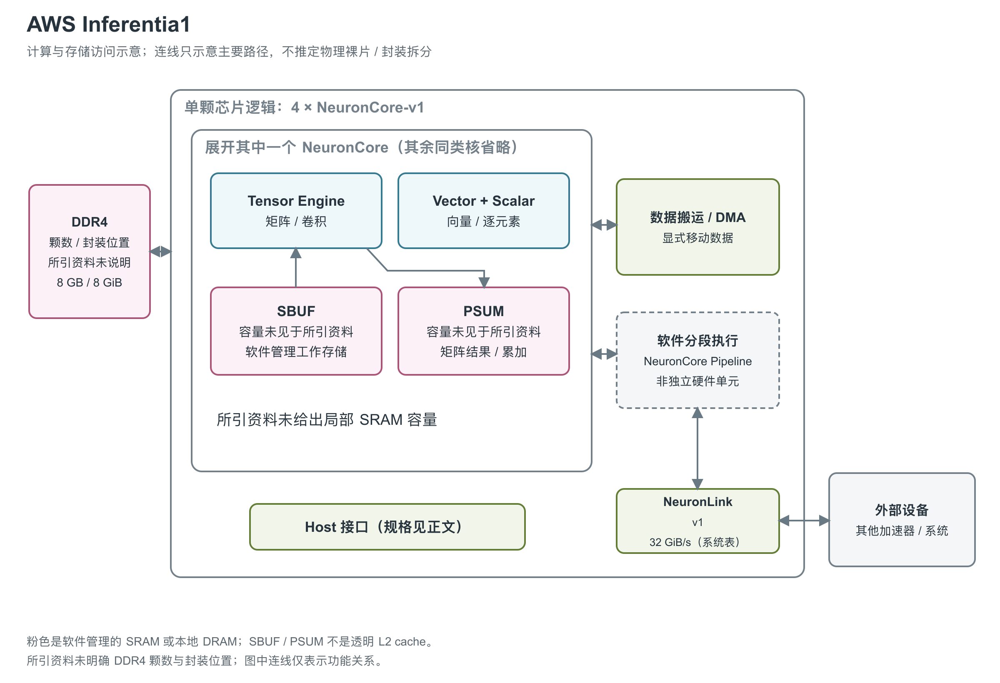

# AWS Inferentia1：四个 NeuronCore 与 DDR4 的推理加速器

图：依据 Inferentia 与 NeuronCore-v1 官方架构说明绘制。每颗芯片含四个 NeuronCore-v1；图中只展开一核的计算和局部存储。外部 DRAM 为 DDR4，所引资料未明确其颗数和与芯片的封装关系，因此不画成 HBM stack，也不虚构周边 DRAM 位置。[1, Compute and Device Memory] [2, Optimized for high throughput and low latency] [4, opening] [7, Inf1 Architecture table] [8, architecture diagram] [9, State Buffer and Partial Sum Buffer] [10, NeuronCore Pipeline]

第一代 Inferentia 是 AWS 为云端机器学习推理设计的芯片，通过 EC2 Inf1 实例提供。它把矩阵、向量和逐元素运算分配到不同引擎，并用软件管理的片上 SRAM 提高数据复用。[1, Inferentia Architecture] [4, NeuronCore-v1 Architecture]

## 四个核心各有三类引擎

NeuronCore 是 AWS 的神经网络计算核心。每个 NeuronCore-v1 内含 TensorEngine、VectorEngine 和 ScalarEngine：TensorEngine 采用节能取向的 systolic array，主要执行矩阵乘法、卷积以及相关 reshape、transpose；VectorEngine 处理输出依赖多个输入的向量操作，如 Layer Normalization 和 pooling；ScalarEngine 处理 GELU、sigmoid、exp 等逐元素函数。[4, TensorEngine, VectorEngine and ScalarEngine]

ScalarEngine 的名称容易令人联想到串行 CPU 标量执行，但这里并不表示单 lane：官方给出其每周期可执行 512 次浮点操作，VectorEngine 则为每周期 256 次。两者支持 FP16、BF16、FP32 以及多种整数格式。所引资料没有给出时钟和具体向量宽度，不能只用“每周期操作数”推出一条带有确定 GHz 条件的全芯片峰值。[4, VectorEngine and ScalarEngine]

TensorEngine 接受 FP16、BF16、INT8 输入，输出为 FP32 或 INT32。每核 FP16/BF16 峰值为 16 TFLOPS，四核芯片公开值为 64 TFLOPS；INT8 则是 128 TOPS。TFLOPS 表示每秒万亿次浮点运算，TOPS 表示每秒万亿次运算，后者在这里对应整数路径。所引资料没有充分说明物理累加器位宽、舍入、饱和及结构化稀疏条件，因此不能给这些峰值增加额外的稀疏倍数。[1, Compute] [4, TensorEngine]

## SRAM 负责局部复用，DDR4 保存更大的状态

每核具有由编译器与软件管理的片上 SRAM，用于提高数据局部性与预取。Neuron 术语文档把主工作存储称为 SBUF（State Buffer），把矩阵结果附近的累加存储称为 PSUM（Partial Sum Buffer）。所引资料没有给出 v1 的容量、bank 数与共享方式；图中的两个框说明功能差别，没有暗示它们与后续 NeuronCore 具有相同容量。[4, opening] [9, State Buffer and Partial Sum Buffer]

SBUF/PSUM 与 L2 cache 的关键区别是数据管理方式。程序和编译器显式组织片上数据，不能依赖硬件透明缓存自动容纳模型。模型参数与中间状态还需要放在 device DRAM 中。AWS 产品页将这一存储写为每芯片 8 GB DDR4，Neuron 架构页则写 8 GiB device DRAM、50 GiB/s；GB 与 GiB 是不同容量单位，本介绍保留原文差异。[1, Device Memory] [2, Optimized for high throughput and low latency]

| 图中资源 | 单芯片规格 | 对程序的含义 |
|---|---|---|
| TensorEngine 路径 | 4 个 NCv1；64 TFLOPS FP16/BF16；128 TOPS INT8 | 矩阵路径的理论上限，不代表每个算子都能达到 [1, Compute] [4, TensorEngine] |
| 外部 DDR4 / DRAM | 8 GB（产品页）或 8 GiB（架构页）；50 GiB/s | 保存模型参数与中间状态 [1, Device Memory] [2, Optimized for high throughput and low latency] |
| 片上 SBUF / PSUM | 存在，所引资料未给出容量 | 软件控制的数据复用空间，不能标作已知容量 L2 [4, opening] [9, State Buffer and Partial Sum Buffer] |

## 每核吞吐与数据通路的公开边界

| 每个 NCv1 的部件 | 可确认的数据格式与吞吐 | 原文没有给出的细节 |
|---|---|---|
| TensorEngine | 输入 FP16/BF16/INT8，输出 FP32/INT32；每核 16 TFLOPS FP16/BF16 | systolic array 行列数、每周期输入/输出元素数、物理累加器和内部寄存器容量 [4, TensorEngine] |
| VectorEngine | 每周期 256 次浮点操作；支持 FP16/BF16/FP32/INT8/INT16/INT32 | lane 数、时钟、各类指令的启动间隔、load/store 带宽 [4, VectorEngine] |
| ScalarEngine | 每周期 512 次浮点操作；支持与 VectorEngine 相同的六类格式 | lane 数、时钟、不同非线性函数的具体吞吐 [4, ScalarEngine] |
| SBUF / PSUM | 软件管理工作数据与矩阵结果，PSUM 支持 TensorEngine 输出的近存累加 | 容量、bank、端口、每周期读写字节数和访问延迟 [9, State Buffer and Partial Sum Buffer] |
| DMA / Host PCIe | 固定版本官方芯片图画出 DMA 和 Host PCIe Gen4 | DMA 数量、单引擎或聚合带宽、PCIe lane 数均未标明 [8, Inferentia architecture diagram] |

256/512 operations per cycle 是算术吞吐，不能直接解释为 256/512 个 SRAM 读数，更不能当成 256/512-bit 的总线宽度。四个核心的 Vector 与 Scalar 若同步满载，按资源数量可分别合计 1,024 与 2,048 operations per cycle；这只是四倍单核值，缺少频率时仍不能转换为确定的每秒算力。当前原文没有提供可用于补全第一代寄存器、SBUF 或 PSUM 字节带宽的数据，后续 NCv2 的数值不适用于这里。[1, Compute] [4, VectorEngine and ScalarEngine；本段资源加总计算]

## 模型怎样跨芯片拆分

NeuronCore Pipeline 允许把模型切分到多个核心或芯片，使不同阶段依次处理数据。NeuronLink-v1 为相应通信提供连接，Inf1 多芯片实例架构表按 chip 列出 32 GiB/s chip-to-chip bandwidth。方向、端口数、拓扑和有效负载条件均未完整公开，因此这个值不应被翻倍成一个自行构造的“双向总带宽”。[1, NeuronLink] [7, Inf1 Architecture table]

NeuronCore Pipeline 的关键是让模型参数留在各个核心的片上 SRAM，再把推理请求逐级传下去。官方说明最多可跨 16 颗 Inferentia、64 个 NeuronCore；要尽量避免外部 DRAM 读取，需要选择足以容纳整个模型参数的核心数量。这里所谓 locally cached data 是软件安排的驻留数据，并没有改变 SBUF 的软件管理性质。图中用虚线框标出 NeuronCore Pipeline 软件功能，它不是一个独立的 collective core。[10, NeuronCore Pipeline] [4, opening]

Pipeline 文档给出一个初步选择核心数的经验式：`4 × round(模型权重个数 / (2 × 10^7))`，以完整芯片为分配单位，并明确要求通过不同核心数的编译结果判断模型能否放下。这不是硬件 SRAM 容量公式，因为权重格式、激活和运行时占用没有在公式中展开，不能由它反推出每核精确 MB 数。它说明的是第一代针对小 batch 推理的映射取向：用更多核心提供参数驻留空间，以减轻 DDR4 流量；实际吞吐还取决于分段平衡和阶段间传输。[10, NeuronCore Pipeline, core-count selection formula and compilation guidance]

官方术语页也用 NeuronLink-v1 描述 device 内 NeuronCore 的连接，而系统页强调 device-to-device 互联。现有资料不足以把两种表述统一成一幅精确片内网络，本图仅画可确认的通信关系，不用外部 32 GiB/s 代替片内带宽。旧版 Neuron 文档的 Inferentia 图标出 Host PCIe Gen4，但没有 lane 数与有效带宽。[9, NeuronLink-v1] [7, Inf1 Architecture] [8, Inferentia architecture diagram]

Inf1 有一芯片、四芯片和十六芯片配置。一芯片实例的芯片间互联栏为 N/A，不能因为芯片家族支持 NeuronLink 就认定一芯片部署也存在模型跨设备通信。实例中的主机内存、CPU、Nitro 和网络位于加速器之外；所引资料未给出芯片工艺、面积、频率、封装结构、散热以及绝对功耗。它们不能由实例价格或系统级相对性能反算出来。[3, Product details] [7, Inf1 Architecture table]

## 参考资料

[1] AWS Neuron，*Inferentia Architecture*。<https://awsdocs-neuron.readthedocs-hosted.com/en/latest/about-neuron/arch/neuron-hardware/inferentia.html>

[2] AWS，*AWS Inferentia*。<https://aws.amazon.com/ai/machine-learning/inferentia/> [本地原文](../../原始资料/网页快照/AWS/产品详解补充/2026-09-17/inferentia-product.html)

[3] AWS，*Amazon EC2 Inf1 Instances*。<https://aws.amazon.com/ec2/instance-types/inf1/> [本地原文](../../原始资料/网页快照/AWS/产品详解补充/2026-09-17/inf1-product.html)

[4] AWS Neuron，*NeuronCore-v1 Architecture*。<https://awsdocs-neuron.readthedocs-hosted.com/en/latest/about-neuron/arch/neuron-hardware/neuron-core-v1.html> [本地原文](../../原始资料/网页快照/AWS/产品详解补充/2026-09-17/neuron-v1-latest.html)

[7] AWS Neuron，*Amazon EC2 Inf1 Architecture*。<https://awsdocs-neuron.readthedocs-hosted.com/en/latest/about-neuron/arch/neuron-hardware/inf1-arch.html> [本地原文](../../原始资料/网页快照/AWS/产品详解补充/2026-09-17/inf1-system.html)

[8] AWS Neuron，*Inferentia architecture diagram*，v2.3.0 官方文档原图。<https://awsdocs-neuron.readthedocs-hosted.com/en/v2.3.0/_images/inferentia-neurondevice.png> [本地原文](../../原始资料/网页快照/AWS/产品详解补充/2026-09-17/v1-arch-2.3.png)

[9] AWS Neuron，*Neuron Glossary*。<https://awsdocs-neuron.readthedocs-hosted.com/en/latest/about-neuron/arch/glossary.html> [本地原文](../../原始资料/网页快照/AWS/产品详解补充/2026-09-17/glossary.html)

[10] AWS Neuron，*NeuronCore Pipeline*。<https://awsdocs-neuron.readthedocs-hosted.com/en/latest/about-neuron/arch/neuron-features/neuroncore-pipeline.html> [本地原文](../../原始资料/网页快照/AWS/产品详解补充/2026-09-17/v1-pipeline.html)
