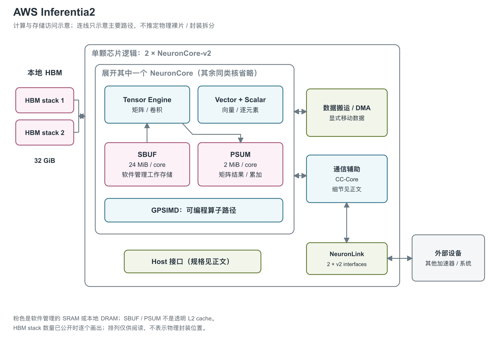

# AWS Inferentia2：HBM 与异步多引擎的推理芯片

图：依据 Trainium/Inferentia2 NKI 架构指南重绘，展开其中一个 NeuronCore-v2。两组 HBM stack、32 个 DMA、六个 CC-Core 与两组 NeuronLink-v2 属于完整芯片资源。已有文档没有说明裸片与封装拆分，图中的边框只表示逻辑归属。[2, device overview and NeuronCore-v2 diagram]

Inferentia2 是 AWS 面向生成式 AI 等推理负载的加速器，通过 EC2 Inf2 实例提供。单颗芯片以两个 NeuronCore-v2 为计算主体，外围配置 HBM、数据搬运引擎与集合通信单元。[1, chip table] [5, opening]

文中的 HBM 是高带宽外部存储，SBUF（State Buffer）是核心内的软件管理工作存储，PSUM（Partial Sum Buffer）保存矩阵部分和；DMA 负责直接搬运数据，CC-Core 负责集合通信。NKI（Neuron Kernel Interface）提供直接编写这些硬件计算与搬运操作的接口。[2, device overview, NeuronCore-v2 Compute Engines and Data Movement]

## 四类引擎异步协作

每个 NeuronCore-v2 包含 Tensor、Vector、Scalar、GpSimd 四类计算引擎，各有独立 sequencer 和指令流，可以异步执行。Sync Engine 触发 DMA，硬件 semaphore 与编译器共同处理依赖。这样，搬运下一块输入、计算当前矩阵块和执行其他引擎上的操作可以重叠；具体能否重叠仍取决于数据依赖与资源冲突。[2, NeuronCore-v2 Compute Engines]

TensorEngine 是 128×128 PE systolic array，PE 为处理单元，2.8 GHz 的引擎频率对应矩阵计算路径。VectorEngine 有 128 个并行 lane，适合 reduction、LayerNorm、pooling 等操作；ScalarEngine 执行逐元素与非线性函数。GpSimd 则含八个可编程 512-bit 向量处理器，可运行 C custom operator，每个处理器另有 64 KB local RAM。这八个处理器属于一个核心内部的引擎，不能另计成八个 NeuronCore。[2, Tensor Engine, Vector Engine, GpSimd Engine and engine width/frequency table] [3, GPSIMD]

TensorEngine 支持 cFP8、FP16、BF16、TF32、FP32 与 INT8 等输入，输出为 FP32/INT32；文档中的矩阵浮点累加路径使用 FP32 PSUM。支持 round-to-nearest-even 和 stochastic rounding；所引核心概览与 NKI 指南没有完整展开 cFP8 编码、INT8 饱和与部分输出规则。[3, TensorEngine and rounding] [2, Near-memory accumulation in PSUM]

## HBM、SBUF、PSUM 是三种不同资源

两个 HBM stack 提供 32 GiB device memory，保存模型状态。每个 NeuronCore-v2 内有 24 MiB SBUF 和 2 MiB PSUM，均分成 128 个 partition，PSUM 每 partition 有八个 bank。SBUF 是软件管理的数据暂存区，PSUM 用来保存矩阵结果和累加；两核各有一套，不能把两者相加成一块统一共享 L2 cache。[2, device overview and memory hierarchy]

DMA 在 HBM 与 SBUF 之间搬运数据，TensorEngine 计算的结果进入 PSUM，其他指令再安排结果使用与转移。每核有 16 个 DMA，全芯片共 32 个；官方芯片页给出额定 DMA 带宽 1 TB/s，并支持 inline compression/decompression。这个数值对应数据搬运路径，HBM 带宽对应外部存储接口，两者不能相加成为“总访存带宽”。[1, Data Movement] [2, DMA section and memory hierarchy]

| 所在位置 | 单颗 Inferentia2 的规格 | 条件 |
|---|---|---|
| Tensor 计算路径 | 190 TFLOPS（每秒万亿次浮点运算） FP16/BF16/cFP8/TF32；47.5 TFLOPS FP32；380 TOPS（每秒万亿次运算） INT8 | 官方 per-chip 峰值，未声明结构化稀疏倍增 [1, Compute] |
| HBM | 2 stack；技术页 32 GiB、产品页 32 GB | 所引资料未给出 HBM 代际与 stack 高度 [1, Device Memory] [2, device overview] [5, high-bandwidth accelerator memory] |
| HBM 带宽 | 技术页 820 GiB/s；NKI 指南 820 GB/s | 官方单位冲突，不能静默统一 [1, Device Memory] [2, device overview] |
| 每核局部 SRAM | SBUF 24 MiB + PSUM 2 MiB | 两核独立局部空间，软件管理 [2, memory hierarchy] |

## 矩阵分块与非矩阵指令的吞吐条件

NKI 矩阵指令把两个输入分别称为 stationary 和 moving：先用 LoadStationary 把 stationary 缓存在 TensorEngine 内，再用 MultiplyMoving 流入 moving，结果写入 PSUM。以 `stationary[K,M]` 和 `moving[K,N]` 为例，计算的是 `stationary.T @ moving`。收缩维 K 必须放在 SBUF 的 partition 维；M、K 最大均为 128，N 最大为 512，后者受单个 PSUM bank 容量限制。K 更大时，程序按 K 分块并累加到同一个 PSUM 位置。[2, Tensor Engine: Layout and Tile Size]

| 每个 NCv2 的执行路径 | 数据通路与频率 | 官方计算吞吐 |
|---|---|---|
| TensorEngine | 输入 2×128、输出 128 elements/cycle；2.8 GHz | BF16/FP16/TF32/cFP8 为 92 TFLOPS，FP32 为 23 TFLOPS [2, engine width/frequency table and Tensor Engine: Data Types] |
| VectorEngine | 输入/输出各 128 elements/cycle；1.12 GHz | 2.3 TFLOPS FP32 [2, engine width/frequency table] [3, VectorEngine] |
| ScalarEngine | 输入/输出各 128 elements/cycle；1.4 GHz | 2.9 TFLOPS FP32 [2, engine width/frequency table] [3, ScalarEngine] |
| GpSimd | 输入/输出各 128 elements/cycle；1.4 GHz；8 个 512-bit processor | 每 processor 支持 16 路 FP32/INT32/UINT32、32 路 FP16/INT16/UINT16，或 64 路 INT8/UINT8；没有可直接比较的统一 FLOPS [2, engine width/frequency table and GpSimd Engine: Data Types] |

通路的 elements/cycle 表示搬入、搬出的元素数，TFLOPS 表示执行算术的操作数，不能相互替代。两个核心的 Vector 与 Scalar 峰值若仅做资源加总，分别是 4.6 与 5.8 TFLOPS FP32；这是按每核值乘核心数的计算，不是独立公布的芯片实测。矩阵每核值乘核心数也不能精确复现芯片页的 190/47.5 TFLOPS，因此全文分别保留 core 和 chip 两种官方口径。[1, Compute] [2, Tensor Engine: Data Types] [3, VectorEngine and ScalarEngine；本段资源加总计算]

矩阵流水线的启动间隔也有明确约束：在复用已经加载的 stationary、连续发送 BF16/FP16/TF32/cFP8 MultiplyMoving 的条件下，指南给出的近似间隔为 `max(N, 64)` 个 TensorEngine 周期，FP32 成本约为其四倍。这里的 64 周期是启动间隔模型中的下限，并非整个矩阵操作的完成延迟。background LoadStationary 可将下一块权重的载入与当前计算重叠。[2, Tensor Engine: Performance Consideration]

VectorEngine 的 128 lane 分成四组，每组有 32 路 reshape/compute 通路，支持组内 32×32 transpose 和 32-partition shuffle。一般在 free 维长度 N>128 时，单输入指令约需 N 个引擎周期，双输入指令约需 2N 个；连续短指令或前后紧密依赖时，还需考虑约 100 周期的固定开销。这是指南的成本估计，实际 kernel 仍需设备 trace 验证。[2, Vector Engine: Cross-partition Data Movement and Performance Consideration]

ScalarEngine 同样有 128 lane，内部算术使用 FP32。它可把 scale 乘法、bias 加法与非线性函数合入一条 activation，启用乘加不会增加该指令成本。`activation_reduce` 还可在逐元素计算时累加结果，但最终要用 ActReadAccumulator 取回，每次约需 64 个 ScalarEngine 周期。控制流另由各 sequencer 私有的 32-bit scalar register 完成，所引指南没有给出寄存器数量和总容量；不能把这些控制寄存器与 ScalarEngine 的 tensor lane 混为一谈。[2, Scalar Engine: Layout & Tile Size and Performance Consideration; NeuronCore-v2 Compute Engines]

## SRAM 接口、bank 与局部 RAM

SBUF 与 PSUM 都按 128 个 partition 组织：SBUF 每 partition 为 192 KiB，PSUM 每 partition 为 16 KiB。PSUM 再分八个 bank，每 bank 容纳 512 个 32-bit 元素。TensorEngine 可控制逐元素 read-accumulate-write，Vector/Scalar 则把 PSUM 当普通 SRAM 读写；八个 bank 允许最多八组尚未完成后处理的 matmul accumulation group 共存，从而让下一组矩阵计算与前一组结果处理重叠。[2, NeuronCore-v2 Compute Engines and Near-memory accumulation in PSUM]

| 存储或接口 | 原始带宽、延迟或粒度 | 使用条件 |
|---|---|---|
| SBUF/PSUM 单条 tensor 读或写接口 | 128 elements/cycle，接口频率 1.4 GHz；启动访问约有 60 周期固定开销 | fastest free 维 stride 小于 16 B 时可达此峰值；大于 16 B 时接口吞吐减半；原文未单列恰好 16 B 的边界 [2, Accessing SBUF/PSUM tensors using compute engines: Performance Consideration] |
| 同一 SRAM 接口的字节率换算 | FP32 为 716.8 GB/s，FP16/BF16 为 358.4 GB/s，8-bit 为 179.2 GB/s | `128 × 每元素字节数 × 1.4 GHz`，单接口单方向理论值；不等于整个 SRAM 的聚合带宽，也不表示较慢计算引擎可持续消费全部数据 [2, Accessing SBUF/PSUM tensors using compute engines: Performance Consideration；本行计算] |
| GpSimd 每 processor 的 TCM | 64 KB；512-bit 数据宽度；3-cycle 访问延迟 | 紧耦合局部 RAM，保存 custom operator 的中间状态；原文未给并发读写端口数 [2, GpSimd Engine: Memory Hierarchy] |
| GpSimd 每 processor 与 SBUF 的接口 | 每周期最多读 512 bit，并可通过写接口写 512 bit；连接固定 16 个 partition | 读侧每 partition 最多 32 bit；八个 processor 覆盖全部 128 partition [2, GpSimd Engine: Memory Hierarchy and Fig. 54] |
| 单个 DMA | 27 GiB/s 峰值；每核 16 个，全芯片 32 个 | 每 DMA 同时处理一个 transfer，各 DMA 可并行；独立于芯片页 1 TB/s 口径 [2, Data movement between HBM and SBUF using DMAs] [1, Data Movement] |

这些接口存在真实的共享限制。Vector 与 GpSimd 不能同时访问 SBUF；Vector 与 Scalar 不能同时访问 PSUM，编译器会将冲突指令串行化。其他允许的组合，例如 Tensor+Vector+Scalar 访问 SBUF、Tensor+Vector 访问 PSUM，可以让各自接口同时保持峰值。因此“有独立指令流”不代表任意引擎组合都能无争用运行。[2, Data Movement and Accessing SBUF/PSUM tensors using compute engines: Concurrent accesses]

DMA 使用 scatter-gather：一个 transfer 从源 buffer 列表收集数据，再写入目的 buffer 列表，每个 buffer 内地址连续。指南以加载 `128×512 FP32` tile 为例，分成 16 个 transfer，每个搬运八个 partition buffer。为摊薄 buffer/transfer 开销，建议每 partition 连续搬运至少 4 KiB，并尽量使用全部 128 个 partition；这是一条吞吐优化经验，不是所有合法 DMA 的最小传输尺寸。[2, Data movement between HBM and SBUF using DMAs]

SRAM 的并行维也受布局约束。超过 64 个 partition 的 tensor 必须从 partition 0 开始；占 33 至 64 个时可从 0 或 64 开始；最多 32 个时可从 0、32、64、96 开始。free 维支持最多四维带 stride 的寻址，各活跃 partition 使用同一 free 维访问模式。该结构决定了数据布局会同时影响算力利用率和 SRAM 带宽，而容量足够本身并不能保证高吞吐。[2, Accessing SBUF/PSUM tensors using compute engines and Cross-Partition Connectivity]

## 两条 NeuronLink 与六个通信核心

芯片配有两组 NeuronLink-v2 接口与六个 CC-Core，后者参与 AllReduce、AllGather 等集合通信，使模型分片的数据交换可以绕过 host CPU。Inf2 多芯片实例表给出 192 GiB/s/chip 的互联带宽，产品页则写 Inf2 实例支持 192 GB/s NeuronLink。两处的单位和对象标签不同，原文没有解释对应关系，也未明确方向、单端口速率与有效负载条件；本文保留两种来源记录，不把它们与 HBM 的 820 GiB/s 混成同一存储层级。[2, device overview] [4, Inf2 Architecture] [5, NeuronLink interconnect]

Inf2 有一、六、十二芯片配置，一芯片实例没有形成芯片间互联。主机通过 PCIe 与芯片交互，但所引资料未给出接口代际与 lane 数；HBM、各核 SRAM 的显式搬运也不证明存在透明远端内存或 cache coherence。本文采用的一手资料未给出工艺、die 面积、芯片绝对功耗和散热规格，实例级能效宣传无法补齐这些数值。[2, device diagram and memory hierarchy] [5, Product details and Meet your sustainability goals]

## 参考资料

[1] AWS Neuron，*Inferentia2 Architecture*。<https://awsdocs-neuron.readthedocs-hosted.com/en/v2.31.1/about-neuron/arch/neuron-hardware/inferentia2.html> [本地原文](../../原始资料/网页快照/AWS/产品详解补充/2026-09-17/inf2-chip.html)

[2] AWS Neuron，*Trainium/Inferentia2 Architecture Guide for NKI*。<https://awsdocs-neuron.readthedocs-hosted.com/en/v2.29.1/nki/guides/architecture/trainium_inferentia2_arch.html>

[3] AWS Neuron，*NeuronCore-v2 Architecture*。<https://awsdocs-neuron.readthedocs-hosted.com/en/v2.27.0/about-neuron/arch/neuron-hardware/neuron-core-v2.html> [本地原文](../../原始资料/网页快照/AWS/产品详解补充/2026-09-17/neuron-v2.html)

[4] AWS Neuron，*Amazon EC2 Inf2 Architecture*。<https://awsdocs-neuron.readthedocs-hosted.com/en/v2.27.0/about-neuron/arch/neuron-hardware/inf2-arch.html> [本地原文](../../原始资料/网页快照/AWS/产品详解补充/2026-09-17/inf2-system.html)

[5] AWS，*Amazon EC2 Inf2 Instances*。<https://aws.amazon.com/ec2/instance-types/inf2/> [本地原文](../../原始资料/网页快照/AWS/产品详解补充/2026-09-17/inf2-product.html)
