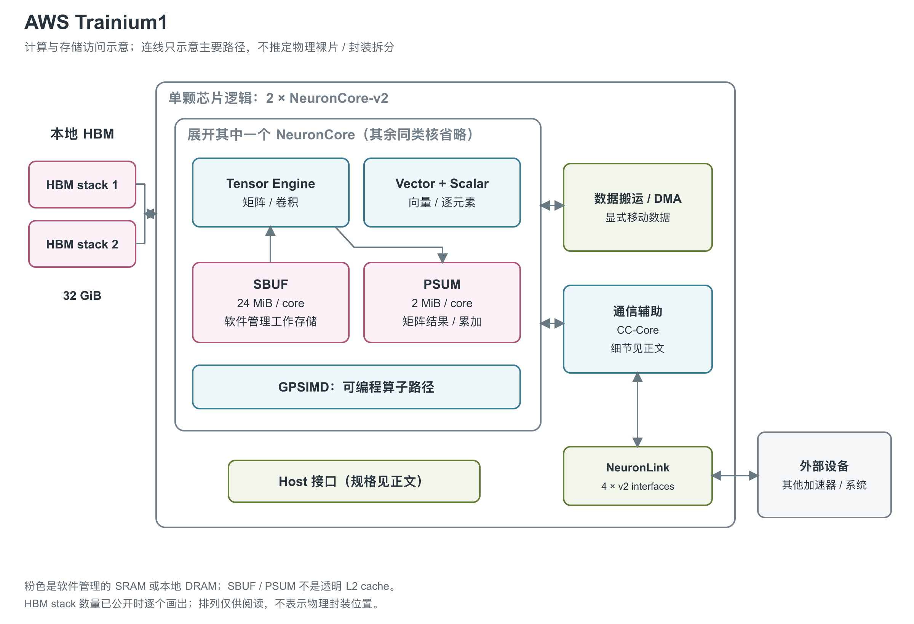

# AWS Trainium1：双 NeuronCore 的训练数据通路

图：依据 NKI 指南重绘，一个芯片有两个 NeuronCore-v2、两个 HBM stack、32 个 DMA、六个 CC-Core 和四组 NeuronLink-v2。只展开一个核心内部的数据工作区，不推断实际 die/chiplet 或 HBM 封装位置。[2, device overview and NeuronCore-v2 diagram]

Trainium1 是 AWS 首代面向训练的专用加速器，通过 Trn1/Trn1n 实例使用。它与 Inferentia2 共享 NeuronCore-v2 核心架构，芯片间端点配置与系统组织则有所不同。[1, chip table] [2, device overview] [4, Trn1/Trn1n Architecture]

文中的 HBM 是高带宽外部存储，SBUF（State Buffer）是核心内的软件管理工作存储，PSUM（Partial Sum Buffer）保存矩阵部分和；DMA 负责直接搬运数据，CC-Core 负责集合通信。NKI（Neuron Kernel Interface）提供直接编写这些硬件计算与搬运操作的接口。[2, device overview, NeuronCore-v2 Compute Engines and Data Movement]

## 一个训练算子会经过哪些硬件

NeuronCore-v2 内部有 Tensor、Vector、Scalar、GpSimd 四类引擎。矩阵乘法交给 128×128 systolic TensorEngine，向量归约、LayerNorm 等交给 VectorEngine，逐元素和非线性函数使用 ScalarEngine，GpSimd 则运行可编程 custom operator。它们具有独立指令流与 sequencer，由 Sync Engine、硬件 semaphore 和编译器协调依赖，因此计算、搬运与部分非矩阵操作可以重叠。[2, NeuronCore-v2 Compute Engines] [3, TensorEngine, VectorEngine, ScalarEngine and GPSIMD]

Tensor 路径支持 cFP8、FP16、BF16、TF32、FP32、INT8 输入，输出为 FP32/INT32；浮点矩阵累加进入 FP32 PSUM。VectorEngine 的算术内部使用 FP32，并在需要时转换数据格式。GpSimd 内含八个 512-bit 处理器，各有 64 KB local TCM，即紧耦合局部存储，方便自定义算子执行控制与局部数据访问。[2, Tensor Engine, Near-memory accumulation in PSUM and GpSimd memory hierarchy] [3, VectorEngine]

## 本地数据在三个层级之间移动

两个 HBM stack 合计 32 GiB，保存模型参数与中间状态。每核另有 24 MiB SBUF 和 2 MiB PSUM；SBUF/PSUM 都是软件与编译器管理的 scratchpad，不是硬件透明 cache。图中把它们放在核心内，是因为两个核心各有局部空间，单纯相加容量会掩盖数据必须放在哪一核的问题。[1, Device Memory] [2, memory hierarchy]

DMA 在 HBM 和 SBUF 之间异步搬运；矩阵结果累加在 PSUM，随后由计算指令安排移动或后续处理。每核 16 个 DMA、全芯片 32 个，芯片页给出 1 TB/s DMA 带宽并支持搬运中的压缩与解压。NKI 另列每 DMA 局部峰值 27 GiB/s，两份资料的统计条件并不充分一致，因此不把单引擎值乘 32 来“纠正”芯片规格。[1, Data Movement] [2, DMA section]

| 资源位置 | 单颗 Trainium1 规格 | 说明 |
|---|---|---|
| 官方芯片宣传峰值 | 190 TFLOPS FP16/BF16/cFP8/TF32；47.5 TFLOPS FP32；380 TOPS（每秒万亿次运算）INT8 | 芯片表的 per-chip 指标，未解释各执行路径的计数构成；未声明结构化稀疏倍增 [1, Compute] |
| 纯 Tensor 派生峰值 | 184 TFLOPS BF16/FP16/TF32/cFP8；46 TFLOPS FP32 | 两个 NCv2×每核 92／23；普通矩阵路径资源加总，保留原报取整条件，不以此纠正上一行 [2, device overview and Tensor Engine: Data Types；本行计算] |
| 本地 HBM | 2 stack，32 GiB；产品页写 32 GB | 所引资料未给出 HBM 代际、stack 高度 [1, Device Memory] [2, device overview] [5, Product details] |
| HBM 带宽 | 芯片页 820 GiB/s；NKI 页 820 GB/s | 保留官方单位差异 [1, Device Memory] [2, device overview] |
| 每核 SRAM | 24 MiB SBUF + 2 MiB PSUM | 显式搬运、局部累加 [2, memory hierarchy] |

## 矩阵分块与非矩阵指令的吞吐条件

NKI 矩阵指令把两个输入分别称为 stationary 和 moving：先用 LoadStationary 把 stationary 缓存在 TensorEngine 内，再用 MultiplyMoving 流入 moving，结果写入 PSUM。以 `stationary[K,M]` 和 `moving[K,N]` 为例，计算的是 `stationary.T @ moving`。收缩维 K 必须放在 SBUF 的 partition 维；M、K 最大均为 128，N 最大为 512，后者受单个 PSUM bank 容量限制。K 更大时，程序按 K 分块并累加到同一个 PSUM 位置。[2, Tensor Engine: Layout and Tile Size]

| 每个 NCv2 的执行路径 | 数据通路与频率 | 官方计算吞吐 |
|---|---|---|
| TensorEngine | 输入 2×128、输出 128 elements/cycle；2.8 GHz | BF16/FP16/TF32/cFP8 为 92 TFLOPS，FP32 为 23 TFLOPS [2, engine width/frequency table and Tensor Engine: Data Types] |
| VectorEngine | 输入/输出各 128 elements/cycle；1.12 GHz | 2.3 TFLOPS FP32 [2, engine width/frequency table] [3, VectorEngine] |
| ScalarEngine | 输入/输出各 128 elements/cycle；1.4 GHz | 2.9 TFLOPS FP32 [2, engine width/frequency table] [3, ScalarEngine] |
| GpSimd | 输入/输出各 128 elements/cycle；1.4 GHz；8 个 512-bit processor | 每 processor 支持 16 路 FP32/INT32/UINT32、32 路 FP16/INT16/UINT16，或 64 路 INT8/UINT8；没有可直接比较的统一 FLOPS [2, engine width/frequency table and GpSimd Engine: Data Types] |

通路的 elements/cycle 表示搬入、搬出的元素数，TFLOPS 表示执行算术的操作数，不能相互替代。两个核心的 Vector 与 Scalar 峰值若仅做资源加总，分别是 4.6 与 5.8 TFLOPS FP32；这是按每核值乘核心数的计算，不是独立公布的芯片实测。两个核心的纯 Tensor 资源加总为 184 TFLOPS BF16/FP16/TF32/cFP8、46 TFLOPS FP32；该派生值采用 NKI 的每核取整数，供同路径矩阵比较。它不能精确复现芯片页的 190/47.5 TFLOPS，官方没有解释计数差别，因此两类数值分别保留。[1, Compute] [2, Tensor Engine: Data Types] [3, VectorEngine and ScalarEngine；本段资源加总计算]

矩阵流水线的启动间隔也有明确约束：在复用已经加载的 stationary、连续发送 BF16/FP16/TF32/cFP8 MultiplyMoving 的条件下，指南给出的近似间隔为 `max(N, 64)` 个 TensorEngine 周期，FP32 成本约为其四倍。这里的 64 周期是启动间隔模型中的下限，并非整个矩阵操作的完成延迟。background LoadStationary 可将下一块权重的载入与当前计算重叠。[2, Tensor Engine: Performance Consideration]

VectorEngine 的 128 lane 分成四组，每组有 32 路 reshape/compute 通路，支持组内 32×32 transpose 和 32-partition shuffle。一般在 free 维长度 N>128 时，单输入指令约需 N 个引擎周期，双输入指令约需 2N 个；连续短指令或前后紧密依赖时，还需考虑约 100 周期的固定开销。这是指南的成本估计，实际 kernel 仍需设备 trace 验证。[2, Vector Engine: Cross-partition Data Movement and Performance Consideration]

ScalarEngine 同样有 128 lane，内部算术使用 FP32。它可把 scale 乘法、bias 加法与非线性函数合入一条 activation，启用乘加不会增加该指令成本。`activation_reduce` 还可在逐元素计算时累加结果，但最终要用 ActReadAccumulator 取回，每次约需 64 个 ScalarEngine 周期。控制流另由各 sequencer 私有的 32-bit scalar register 完成，所引指南没有给出寄存器数量和总容量；不能把这些控制寄存器与 ScalarEngine 的 tensor lane 混为一谈。[2, Scalar Engine: Layout & Tile Size and Performance Consideration; NeuronCore-v2 Compute Engines]

## SRAM 接口、bank 与局部 RAM

SBUF 与 PSUM 都按 128 个 partition 组织：SBUF 每 partition 为 192 KiB，PSUM 每 partition 为 16 KiB。PSUM 再分八个 bank，每 bank 容纳 512 个 32-bit 元素。TensorEngine 可控制逐元素 read-accumulate-write，Vector/Scalar 则把 PSUM 当普通 SRAM 读写；八个 bank 允许最多八组尚未完成后处理的 matmul accumulation group 共存，从而让下一组矩阵计算与前一组结果处理重叠。[2, NeuronCore-v2 Compute Engines and Near-memory accumulation in PSUM]

| 存储或接口 | 原始带宽、延迟或粒度 | 使用条件 |
|---|---|---|
| SBUF/PSUM 单条 tensor 读或写接口 | 128 elements/cycle，接口频率 1.4 GHz；启动访问约有 60 周期固定开销 | fastest free 维 stride 小于 16 B 时可达此峰值；大于 16 B 时接口吞吐减半；原文未单列恰好 16 B 的边界 [2, Accessing SBUF/PSUM tensors using compute engines: Performance Consideration] |
| 同一 SRAM 接口的字节率换算 | FP32 为 716.8 GB/s，FP16/BF16 为 358.4 GB/s，8-bit 为 179.2 GB/s | `128 × 每元素字节数 × 1.4 GHz`，单接口单方向理论值；不等于整个 SRAM 的聚合带宽，也不表示较慢计算引擎可持续消费全部数据 [2, Accessing SBUF/PSUM tensors using compute engines: Performance Consideration；本行计算] |
| GpSimd 每 processor 的 TCM | 64 KB；512-bit 数据宽度；3-cycle 访问延迟 | 紧耦合局部 RAM，保存 custom operator 的中间状态；原文未给并发读写端口数 [2, GpSimd Engine: Memory Hierarchy] |
| GpSimd 每 processor 与 SBUF 的接口 | 每周期最多读 512 bit，并可通过写接口写 512 bit；连接固定 16 个 partition | 读侧每 partition 最多 32 bit；八个 processor 覆盖全部 128 partition [2, GpSimd Engine: Memory Hierarchy and Fig. 54] |
| 单个 DMA | 27 GiB/s 峰值；每核 16 个，全芯片 32 个 | 每 DMA 同时处理一个 transfer，各 DMA 可并行；独立于芯片页 1 TB/s 口径 [2, Data movement between HBM and SBUF using DMAs] [1, Data Movement] |

这些接口存在真实的共享限制。Vector 与 GpSimd 不能同时访问 SBUF；Vector 与 Scalar 不能同时访问 PSUM，编译器会将冲突指令串行化。其他允许的组合，例如 Tensor+Vector+Scalar 访问 SBUF、Tensor+Vector 访问 PSUM，可以让各自接口同时保持峰值。因此“有独立指令流”不代表任意引擎组合都能无争用运行。[2, Data Movement and Accessing SBUF/PSUM tensors using compute engines: Concurrent accesses]

DMA 使用 scatter-gather：一个 transfer 从源 buffer 列表收集数据，再写入目的 buffer 列表，每个 buffer 内地址连续。指南以加载 `128×512 FP32` tile 为例，分成 16 个 transfer，每个搬运八个 partition buffer。为摊薄 buffer/transfer 开销，建议每 partition 连续搬运至少 4 KiB，并尽量使用全部 128 个 partition；这是一条吞吐优化经验，不是所有合法 DMA 的最小传输尺寸。[2, Data movement between HBM and SBUF using DMAs]

SRAM 的并行维也受布局约束。超过 64 个 partition 的 tensor 必须从 partition 0 开始；占 33 至 64 个时可从 0 或 64 开始；最多 32 个时可从 0、32、64、96 开始。free 维支持最多四维带 stride 的寻址，各活跃 partition 使用同一 free 维访问模式。该结构决定了数据布局会同时影响算力利用率和 SRAM 带宽，而容量足够本身并不能保证高吞吐。[2, Accessing SBUF/PSUM tensors using compute engines and Cross-Partition Connectivity]

## 四个互联接口服务于多芯片训练

Trainium1 有四组 NeuronLink-v2，与六个 CC-Core 配合执行跨设备 collective。十六芯片 Trn1/Trn1n 实例使用 2D torus，并支持经 NeuronLink 直接寻址的 device memory pooling。远端池的存在依赖这一多芯片实例，单颗芯片仍只拥有自己的 HBM 与局部 SRAM。[2, device overview] [4, Trn1/Trn1n Architecture]

Trainium2 架构页的跨代比较表为 Trainium1 直接列出 384 GB/s/chip inter-chip interconnect；Trn1 产品页另称实例支持最高 768 GB/s NeuronLink。两者的方向和计数关系没有解释，不能把后者自动认作前者的双向值，也不能拆算单端口速率。[8, Interconnect comparison table] `trn1.2xlarge` 是实际的一芯片配置，其 NeuronLink 栏为 N/A。[7, instance specifications table] 更大的实例再通过 EFA（Elastic Fabric Adapter，AWS 集群通信网络适配器）连接其他实例。EFA、主机 CPU 与 DRAM 位于芯片之外。[5, NeuronLink interconnect, Product details and High-performance networking]

现有资料确认主机 PCIe 路径，但没有给出代际、lane 数和单芯片带宽；这些资料也未给出芯片工艺、die 面积、封装组成、功耗和散热。已有证据能解释它的显式数据流与训练互联，不能据此推断硬件缓存一致性或物理 chiplet 组织。[1, chip architecture] [2, device diagram]

## 参考资料

[1] AWS Neuron，*Trainium Architecture*。<https://awsdocs-neuron.readthedocs-hosted.com/en/v2.28.0/about-neuron/arch/neuron-hardware/trainium.html> [本地原文](../../原始资料/网页快照/AWS/产品详解补充/2026-09-17/trn1-chip.html)

[2] AWS Neuron，*Trainium/Inferentia2 Architecture Guide for NKI*。<https://awsdocs-neuron.readthedocs-hosted.com/en/v2.29.1/nki/guides/architecture/trainium_inferentia2_arch.html>

[3] AWS Neuron，*NeuronCore-v2 Architecture*。<https://awsdocs-neuron.readthedocs-hosted.com/en/v2.27.0/about-neuron/arch/neuron-hardware/neuron-core-v2.html> [本地原文](../../原始资料/网页快照/AWS/产品详解补充/2026-09-17/neuron-v2.html)

[4] AWS Neuron，*Amazon EC2 Trn1/Trn1n Architecture*。<https://awsdocs-neuron.readthedocs-hosted.com/en/v2.32.0/about-neuron/arch/neuron-hardware/trn1-arch.html> [本地原文](../../原始资料/网页快照/AWS/产品详解补充/2026-09-17/trn1-system.html)

[5] AWS，*Amazon EC2 Trn1 Instances*。<https://aws.amazon.com/ec2/instance-types/trn1/> [本地原文](../../原始资料/网页快照/AWS/产品详解补充/2026-09-17/trn1-product.html)

[7] AWS，*Amazon EC2 Trn1 Instances for High-Performance Model Training are Now Available*，2022-10-10。<https://aws.amazon.com/blogs/aws/amazon-ec2-trn1-instances-for-high-performance-model-training-are-now-available/> [本地原文](../../原始资料/网页快照/AWS/产品详解补充/2026-09-17/trn1-launch.html)

[8] AWS Neuron，*Trainium2 Architecture*，Interconnect comparison table。<https://awsdocs-neuron.readthedocs-hosted.com/en/v2.29.1/about-neuron/arch/neuron-hardware/trainium2.html>
