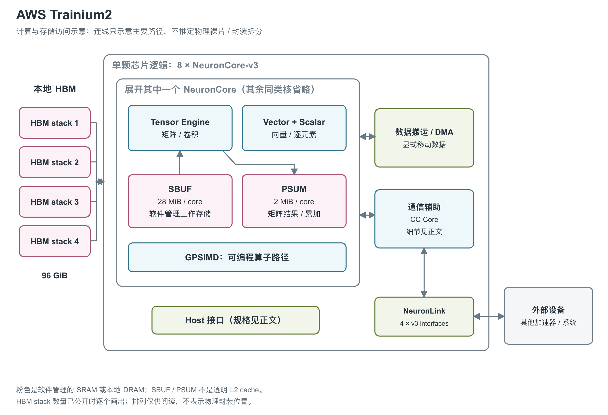

# AWS Trainium2：八个核心与结构化稀疏矩阵执行

图：依据芯片与 NKI 架构文档重绘，完整芯片有八个 NCv3、四个 HBM stack、128 个主 DMA 与四组 NeuronLink-v3。图中只展开一核；CC-Core 的数量在两份官方资料中分别为 16 与 20，故不在图中选取单一数字。[1, Trainium2 chip components] [2, Trainium2 Device Diagram and NeuronCore-v3 Compute Engine Updates]

Trainium2 将 AWS 的训练加速器扩展为八个 NeuronCore-v3，并支持推理负载。除核心数量增加外，FP8 执行模式、结构化稀疏、局部工作存储和数据搬运路径也有更新。[1, Trainium2 chip components and Compute] [2, NeuronCore-v3 Compute Engine Updates]

文中的 HBM 是高带宽外部存储，SBUF（State Buffer）是核心内的软件管理工作存储，PSUM（Partial Sum Buffer）保存矩阵部分和；DMA 负责直接搬运数据，CC-Core 负责集合通信。NKI（Neuron Kernel Interface）提供直接编写这些硬件计算与搬运操作的接口。[2, Trainium2 Device Diagram, NeuronCore-v3 Compute Engine Updates and Data Movement Updates]

## 矩阵阵列与四类执行引擎

每个 NCv3 包含 Tensor、Vector、Scalar 和 GPSIMD 引擎，各有独立 sequencer；计算、DMA 与通信可以并行。TensorEngine 的物理阵列仍是 128×128 PE systolic array，PE 指乘加处理单元。FP8 double-row 模式在软件视图中呈现 256×128 的计算范围，但没有把物理阵列扩建成 256×128；应把它理解为更低精度下每周期完成更多操作的执行方式。[2, NeuronCore-v3 Compute Engines and Tensor Engine] [8, Performance mode and tile size]

FP8 格式和执行模式需要一起看。E4/E5 支持 double FP8，E3 与 FP16/BF16 吞吐相同，而且 double FP8 不能与 sparse matmul 合用。TensorEngine 支持 4:16、4:12、4:8、2:8、2:4、1:4、1:2 结构化稀疏：M:N 表示每 N 个连续元素中只有 M 个非零元素。不同模式的稀疏比例和执行约束不同，不能把最高稀疏峰值理解为所有模式都获得同样加速。[2, Double FP8 Matmul Performance] [3, Tensor Engine]

NCv3 支持动态 shape、control flow 和可编程 RNE/stochastic rounding，cFP8 还支持调整 exponent bias，即指数偏置。[3, Tensor Engine] 矩阵路径支持 E4M3/E5M2、BF16、FP16、TF32、FP32 等输入，内部累加及 NCv3 PSUM 目标为 FP32。VectorEngine 内部算术也是 FP32，ScalarEngine 处理逐元素与非线性函数；GPSIMD 含八个可编程 512-bit 处理器，用于 custom operator。它们分别承担矩阵之外的工作，不能把所有算子都按 Tensor 峰值估时。[8, Data types] [2, Vector Engine, Scalar Engine and Gpsimd Engine]

## 每核的数据通路宽度与执行模式

| NCv3 引擎 | 数据通路宽度，elements/cycle | 引擎频率 | 每核官方峰值 |
|---|---|---|---|
| TensorEngine | 稠密 E4/E5 FP8 输入 4×128；BF16/FP16 输入 2×128；稀疏输入 5×128；输出 128 | 2.4 GHz | 稠密 FP8 158、BF16/FP16/TF32 79、FP32 20 TFLOPS；稀疏 FP8/BF16/FP16/TF32 316 TFLOPS [2, Table 11 and Tensor Engine] |
| VectorEngine | BF16/FP16 输入/输出各 512；其他格式各 256 | 0.96 GHz | 1.0 TFLOPS FP32 [2, Table 11 and Vector Engine] |
| ScalarEngine | 输入/输出各 128 | 1.2 GHz | 1.2 TFLOPS FP32 [2, Table 11] [3, Scalar engine] |
| GpSimd | 8 个 512-bit processor；Table 11 未填写该行 elements/cycle | 1.2 GHz | 所引资料未列统一 FLOPS [2, Table 11 and Gpsimd Engine] [3, GPSIMD engine] |

这些数据是单核通路规格，不应把 elements/cycle 当作 FLOPs/cycle。八核 Vector 和 Scalar 的资源加总分别为 8.0、9.6 TFLOPS FP32，这是按每核值计算的名义总量，不是另一次芯片级实测。每核 Tensor 峰值乘八与芯片 advertised peak 有差异，两种原始口径均保留。[1, Compute] [2, Tensor Engine and Vector Engine] [3, Scalar engine；本段资源加总计算]

double FP8 的收缩维 K 最大为 256，但 SBUF 仍只有 128 个 partition；程序把 K 拆成 partition 维 128 和最外层 free 维 2。最大 stationary/moving tile 分别写作 `[128,2,128]` 与 `[128,2,512]`，每个 PE 同时接收两对 FP8 数并执行乘加。该模式和 BF16/FP16 的对应指令耗时相同，通过每次完成更多 FLOPs 提高吞吐；除 sparse 外，它还不能与 column tiling 或 transpose mode 同用。[2, Double FP8 Matmul Performance, including footnote 1 and mode restrictions]

常规 `nc_matmul` 的输入仍在 SBUF、输出在 FP32 PSUM；stationary free 维最多 128，moving free 维最多 512，后者对应每个 PSUM bank 的 512 个 FP32 元素。若一个输入是 TF32/FP32，另一个也必须属于 TF32/FP32，不能把“分别支持多种格式”理解为任意输入组合都合法。硬件还增加 bit-accurate transpose，正确处理 NaN/Inf；FP32 transpose 启用此模式可提高两倍吞吐，FP16/BF16 transpose 则可直接写相同低精度到 PSUM。[8, Data types, Memory types and Tile size] [2, Built-in Transpose Support]

VectorEngine 的高吞吐模式有操作与布局条件。BF16/FP16 的 `tensor_copy`、`tensor_scalar` 在输入输出都位于 SBUF，且最内层 free 维物理连续时，可获得指南所称相对 NCv2 的四倍指令吞吐；相同精度但不连续，或连续而一端在 PSUM 时，部分指令只能用两倍模式。`tensor_tensor` 需两个输入都在 SBUF、全部输入输出为 BF16/FP16，才有两倍模式。硬件自动识别这些条件，内部算术仍是 FP32；这种特定指令吞吐提升不等于所有向量算术峰值翻倍。[2, Vector Engine Performance Mode]

## 每核 SRAM 与全芯片 HBM

每个 NCv3 有 28 MiB SBUF 和 2 MiB PSUM。SBUF 分为 128 个、每个 224 KiB 的 partition，存放正在执行的分块数据；PSUM 保存矩阵结果与累加。八个核心的 SBUF 合计 224 MiB，但它们是八套软件管理的局部 SRAM，不能当作一块由所有核心透明访问的共享 L2。[2, NeuronCore-v3 Compute Engine Updates and Data Movement Updates]

四个 HBM stack 合计 96 GiB，LNC 文档另写四个 24 GB HBM bank。芯片页给出 2.9 TB/s HBM 带宽，NKI 页写 3 TB/s；Trn2 产品页在实例层明确称为 HBM3，但单芯片页未展开 HBM 代际、stack 高度及物理封装关系。[5, Benefits: Maximize training and inference performance for Generative AI models] [10, Logical NeuronCore configurations] DMA 在 HBM 与 SBUF 之间搬运，PSUM 与 SBUF 之间则由计算引擎指令转移数据，图中的存储框因此不能任意互换位置。[1, Memory] [2, Trainium2 Device Diagram and Data Movement Updates]

| 架构位置 | 单颗 Trainium2 规格 | 限定条件 |
|---|---|---|
| 稠密矩阵峰值 | FP8 1,299 TFLOPS（每秒万亿次浮点运算）；BF16/FP16/TF32 667 TFLOPS；FP32 181 TFLOPS | 官方完整芯片 advertised peak [1, Compute] |
| 结构化稀疏峰值 | 最高 2,563 TFLOPS，标注 FP8/FP16/BF16/TF32 | 非所有模式的统一值；double FP8 与 sparse 不合用 [1, Compute] [2, Double FP8 Matmul Performance] |
| 本地 HBM | 4 stack，96 GiB；2.9 TB/s（NKI 写 3 TB/s） | HBM3 由 Trn2 实例产品页说明，单芯片页只称 HBM [1, Memory] [2, Trainium2 Device Diagram] [5, Benefits: Maximize training and inference performance for Generative AI models] |
| 每核 SRAM | 28 MiB SBUF + 2 MiB PSUM | 八组局部空间，不是共享 cache [2, NeuronCore-v3 Compute Engine Updates] |

## SRAM 带宽与逻辑核心的内存边界

下表把计算引擎端口能消费的数据率与外部 HBM 分开。字节率使用表列通路宽度、所选精度字节数和对应引擎频率计算，代表理想连续流条件下的单引擎接口上界，不是 SRAM 所有端口求和后的实测带宽。[2, Table 11]

| 单核接口/存储层 | 带宽或组织 | 限定 |
|---|---|---|
| VectorEngine 的 SBUF 输入或输出 | BF16/FP16：512×2 B×0.96 GHz = 983.04 GB/s；FP32：256×4 B×0.96 GHz = 983.04 GB/s | 分别是单方向计算值，BF16/FP16 最大值要满足 performance mode 条件 [2, Table 11 and Vector Engine Performance Mode；本行计算] |
| ScalarEngine 输入或输出 | FP32：128×4 B×1.2 GHz = 614.4 GB/s | 单方向计算值；不能套用 Vector 的高吞吐模式 [2, Table 11；本行计算] |
| TensorEngine 数据输入 / PSUM 输出 | BF16 输入：2×128×2 B×2.4 GHz = 1.2288 TB/s；FP32 输出：128×4 B×2.4 GHz = 1.2288 TB/s | 前者是合计输入数据宽度的换算，后者是输出宽度换算；稀疏输入的 metadata/数据组成未充分展开，不另换算 [2, Table 11；本行计算] |
| SBUF | 28 MiB = 128×224 KiB | 每核局部工作存储 [2, NeuronCore-v3 Compute Engine Updates] |
| PSUM | 2 MiB；单 bank 容纳 512 FP32 元素/partition | 保存矩阵结果与累加；容量不因逻辑核心合并变成透明 cache [2, NeuronCore-v3 Compute Engine Updates] [8, Tile size] |
| GpSimd 集成 DMA | 每个 processor 一个，共八个；合计 307 GB/s，原文分方向写读 153、写 153 GB/s | 属于一个 NCv3 内的八个 GpSimd processor，不能误写成全芯片八个 DMA [2, Gpsimd Engine] |

NKI 的概略存储金字塔还把 SBUF/PSUM 标作约 10 TB/s，但同图的 SBUF 约 25 MB、device HBM 约 50 GB 与该页明确的 28 MiB/96 GiB 不一致，也未说明这些带宽合计了哪些端口、读写方向与精度。因此这个图只能说明层级间的量级差，不能据此给 Trainium2 填一个经过核实的 10 TB/s SRAM 聚合规格。寄存器容量、NCv3 专属 SRAM 访问延迟，以及 GpSimd TCM 的代际专属容量/端口数，在已读本代原文中也没有单列，本文不借用 NCv2 数值补齐。[2, Data Movement Updates, first memory-hierarchy figure and Table 11]

NCv3 放宽了两类端口冲突：Vector 与 GpSimd 可以同时访问 SBUF，但 Vector performance mode 会使用两者共享的总线，硬件仍需仲裁；Vector 与 Scalar 可以同时以完整接口带宽访问 PSUM，前提是访问不碰撞在同一 PSUM bank。这些条件比“所有引擎完全并行”更能解释实际调度限制。[2, Data Movement Updates]

LNC（Logical NeuronCore，逻辑核心配置）改变软件看到的计算与内存作用域。Trainium2 有八个物理 NCv3，默认 LNC=2 时两两组合为四个逻辑核心；LNC=1 则显示八个独立逻辑核心。官方说明四个 24 GB HBM bank 各由两个物理核心共享；LNC=2 时同组核心处于同一地址空间，可直接访问 tensor 并进行本地 collective；LNC=1 时两核也都能访问该 24 GB HBM bank。这里的共享是指定核心组和 HBM 地址范围，不应延伸成八核所有局部 SRAM 的硬件缓存一致性。[10, Logical NeuronCores and Logical NeuronCore configurations]

## DMA 与通信如何支撑八个核心

全芯片有 128 个主 DMA，额定带宽 3.5 TB/s，支持搬运时压缩/解压。每核通常配 16 个主 DMA 与两个 DGE（Descriptor Generation Engine，描述符生成引擎），DGE 按需产生搬运描述。DMA 还可在 HBM→SBUF 或 SBUF→SBUF 过程中完成 transpose，减少单独组织转置所需的处理。[1, Data movement] [2, DMA Transpose and Descriptor Generation Engine]

主 DMA 的 transpose 支持 2-byte 与 4-byte 数据，既可 HBM→SBUF，也可 SBUF→SBUF。HBM→SBUF transpose 要让最内层维成为 partition 维，16 个主 DMA 协作写入；输出 partition 维为 128 的倍数、连续最内层 free 维为 16 的倍数时更利于带宽利用。指南给出 HBM→SBUF transpose 最高约 90% 的 DMA 吞吐利用率，普通 copy 最高为 100%；SBUF→SBUF transpose 最高约 50%。这些是布局友好条件下的指南上限，不是本次实测，也不能直接当作所有形状的固定折扣。[2, DMA Transpose and Performance Consideration]

每核两个 DGE 可以由 Sync 或 Scalar sequencer 发命令，按需产生 copy/transpose 描述符。所引指南估计每条 DGE-based DMA 指令约耗时 600 ns，并注明该版本硬件 DGE 不支持 indirect DMA gather/scatter；600 ns 是指令执行成本，不能当作任意长度数据搬运的完成延迟。它们替代了把全部静态描述符放在 HBM，或占用 GpSimd 与 SBUF 动态生成描述符的路径；两者释放的是不同资源。GpSimd 的集成 DMA 则可与 GpSimd 计算和主 DMA 同时工作，访问同一 Trn2 实例内本地或其他芯片的 SBUF/HBM，不能把其每核 307 GB/s 再加到主 DMA 的 3.5 TB/s 上作为可保证的端到端带宽。[2, Descriptor Generation Engine and Gpsimd Engine] [1, Data Movement]

四组 NeuronLink-v3 的芯片级聚合带宽为 1.28 TB/s，方向、每端口速率与有效载荷未完整披露。CC-Core 负责集合通信，但数量在芯片页与 NKI 指南中分别为 16 和 20；两种值按出处保留。主机 PCIe 路径存在，所引资料未给出具体代际和 lane 数。[1, Interconnect and Collective communication] [2, Trainium2 Device Diagram]

系统架构表进一步把 NeuronLink-v3 分成实例内 1,024 GB/s/chip 和 UltraServer 跨实例 256 GB/s/chip 两个层级；该表没有明确方向，不能自行标成单向或双向。十六芯片实例内部是 4×4 的 2D torus；四个实例组成六十四芯片 UltraServer 时，同坐标芯片又通过 ring 连接。这解释了芯片页 1.28 TB/s 与两级链路资源的关系，但可用端到端带宽仍受通信路径与流量模式约束。[4, trn2.48xlarge / trn2u.48xlarge, Trn2 UltraServer and Trn2 instance specifications]

EC2 规格表将 `trn2.3xlarge` 列为一颗 Trainium2；十六芯片实例与六十四芯片 UltraServer 则见 Trn2 系统架构页。[11, Hardware specifications, trn2.3xlarge] 多芯片部署可通过 NeuronLink 与通信核心协作，并支持 HBM pooling。远端内存池不改变每核 SBUF/PSUM 的局部性质。工艺、die/chiplet 组成、绝对功耗与散热规格未在现有资料中公开，也不能从实例能效或成本比较反算成固定芯片功耗。[4, Trn2 Architecture] [5, Product details]

## 参考资料

[1] AWS Neuron，*Trainium2 Architecture*。<https://awsdocs-neuron.readthedocs-hosted.com/en/v2.29.1/about-neuron/arch/neuron-hardware/trainium2.html>

[2] AWS Neuron，*Trainium2 Architecture Guide for NKI*。<https://awsdocs-neuron.readthedocs-hosted.com/en/v2.29.1/nki/guides/architecture/trainium2_arch.html>

[3] AWS Neuron，*NeuronCore-v3 Architecture*。<https://awsdocs-neuron.readthedocs-hosted.com/en/v2.29.1/about-neuron/arch/neuron-hardware/neuron-core-v3.html>

[4] AWS Neuron，*Amazon EC2 Trn2 Architecture*。<https://awsdocs-neuron.readthedocs-hosted.com/en/v2.29.1/about-neuron/arch/neuron-hardware/trn2-arch.html>

[5] AWS，*Amazon EC2 Trn2 instances and UltraServers*。<https://aws.amazon.com/ec2/instance-types/trn2/>

[8] AWS Neuron，*nki.isa.nc_matmul*。<https://awsdocs-neuron.readthedocs-hosted.com/en/v2.29.1/nki/api/generated/nki.isa.nc_matmul.html>

[10] AWS Neuron，*Logical NeuronCore configuration*。<https://awsdocs-neuron.readthedocs-hosted.com/en/v2.29.1/about-neuron/arch/neuron-features/logical-neuroncore-config.html>

[11] AWS，*Accelerated computing instances*，Hardware specifications。<https://docs.aws.amazon.com/ec2/latest/instancetypes/ac.html>
