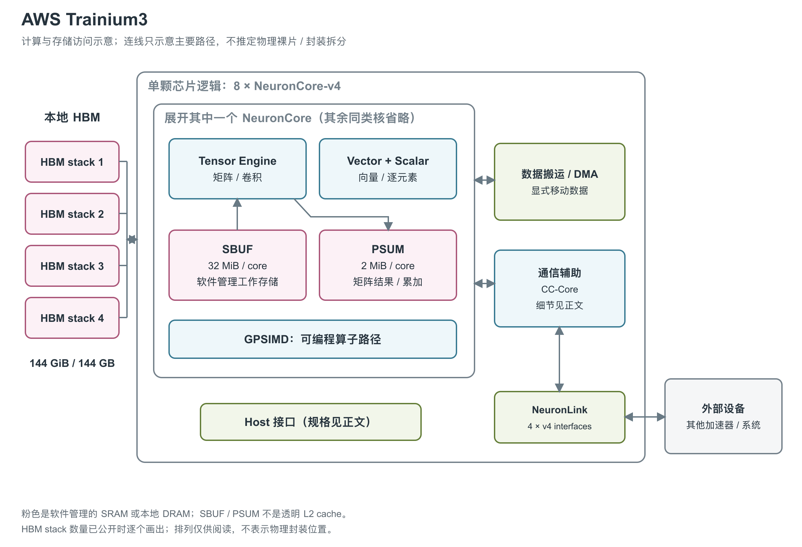

# AWS Trainium3：MX 低精度与更大的局部数据通路

图：依据 Trainium3 芯片与 NKI 架构指南重绘。四个 HBM stack、八个 NCv4、128 个 DMA 和四组 NeuronLink-v4 为全芯片资源。公开文档没有确认 die/chiplet 拆分，本图不把八个核心画成八个物理裸片。[1, NeuronCore-v4 table] [2, device overview and NeuronCore-v4 Compute Engine Updates] [6, each-chip paragraph]

Trainium3 由八个 NeuronCore-v4 构成，官方 GA 公告和当前产品页共同强调训练与 serving，本文按训推兼顾记录。它保留多引擎与软件管理 SRAM 的基本组织，新增 MX 低精度路径，并扩大 HBM 与互联资源。[6, opening and training and serving paragraph] [5, Why Amazon EC2 Trn3 UltraServers?] [1, Compute and Memory] [2, device overview]

文中的 HBM 是高带宽外部存储，SBUF（State Buffer）是核心内的软件管理工作存储，PSUM（Partial Sum Buffer）保存矩阵部分和；DMA 负责直接搬运数据，CC-Core 负责集合通信。NKI（Neuron Kernel Interface）提供直接编写这些硬件计算与搬运操作的接口。[2, device overview, NeuronCore-v4 Compute Engine Updates and Data Movement and DMA updates]

## MXFP4 输入怎样进入矩阵计算

NCv4 的 TensorEngine 物理组织是 128×128 PE（processing element，处理单元）systolic array。MX 模式向软件呈现有效 512×128 contraction 范围，每个 PE 每周期执行更多低精度乘法与累加；这不表示阵列物理边长变成 512。MX 是把一组低精度元素与缩放因子配合表示的格式，NCv4 使用 32 元素一组，支持 MXFP8、MXFP4 及两者混合输入。[2, Tensor Engine and Quad-MXFP8/MXFP4 Matmul Performance]

对 MXFP4 必须再区分一步：NeuronCore-v4 文档明确写出，MXFP4 在进入 TensorEngine 计算逻辑前通过可编程映射转换为 MXFP8。因此，支持 MXFP4 输入不等于公开证实了独立的原生 FP4 乘法阵列，也不意味着吞吐自动是 MXFP8 的两倍。数据和 scale 都由 SBUF 提供，matmul 指令结合缩放完成计算。[3, Tensor Engine] [2, Quad-MXFP8/MXFP4 Matmul Performance]

MX 与 BF16/FP16/TF32 矩阵运算内部使用 FP32 accumulation，结果可直接降为 BF16 写入 PSUM，并可选择 round-to-nearest-even 或 stochastic rounding。VectorEngine 新增 MX 量化和快速 exponential 路径，ScalarEngine 继续执行逐元素、非线性等操作，GPSIMD 承担可编程算子。它们与 Tensor 引擎有独立 sequencer，并由同步机制协调。[2, NeuronCore-v4 Compute Engine Updates, BF16 Matmul Results in PSUM and Vector Engine] [3, Tensor Engine]

## 每核通路宽度与矩阵 tile

| NCv4 引擎 | 每周期输入/输出元素数 | 频率 | 每核官方计算峰值 |
|---|---|---|---|
| TensorEngine | MXFP8 稠密输入 8×128；非 MXFP8 稠密输入 2×128；稀疏输入 5×128；输出 128 | 2.4 GHz | MXFP8/MXFP4 为 315、BF16/FP16/TF32 为 79、FP32 为 20 TFLOPS；FP16/BF16/TF32 稀疏最高 315 TFLOPS [2, Table 11 and Tensor Engine] [3, Tensor Engine] |
| VectorEngine | BF16/FP16/FP8 输入/输出各 512；其他格式各 256 | 1.2 GHz | 1.2 TFLOPS FP32 [2, Table 11 and Vector Engine] |
| ScalarEngine | BF16/FP16/FP8 输入/输出各 256；其他格式各 128 | 1.2 GHz | 1.2 TFLOPS FP32 [2, Table 11 and Scalar Engine] |
| GpSimd | 所有格式输入/输出各 128；8 个 512-bit processor | 1.2 GHz | 所引资料未列统一 FLOPS；运行通用 C/C++ custom operator [2, Table 11] [3, GPSIMD Engine] |

八核 Vector 或 Scalar 的名义资源总量各为 9.6 TFLOPS FP32，是按每核 1.2 TFLOPS 相乘得到；不与 Tensor 峰值直接合成某种可普遍达到的算子吞吐。引擎宽度也依赖精度及指令模式，支持 FP8 输入不意味着所有函数都有相同的低精度倍增。[1, Compute] [2, Vector Engine, Scalar Engine and Table 11；本段资源加总计算]

MX matmul 的数学最大示例为 `[128,512] @ [512,512]`。为了把 K=512 放进 128 个 SBUF partition，同一 partition 沿最内层 free 维相邻存放四个元素，使用 x4 packed datatype；stationary 最大表示为 `[128,128]` 个 x4 元素，moving 最大为 `[128,512]` 个 x4 元素。它与 NCv3 double FP8 把额外 K 维放在最外层 free 维的布局不同，不能只更换数据类型而不改变排布。[2, Quad-MXFP8/MXFP4 Matmul Performance]

每 32 个 K 维元素共用一个 8-bit scale。一个 scaling group 分布于八个 partition，每 partition 四个元素；每个 SBUF quadrant 中用四个 partition 存 scale，其余 28 个位置可再打包其他 scale tensor。矩阵指令同时接收 stationary data、stationary scale、moving data、moving scale 四份输入，因此算低精度流量时也必须计入 scale；若仅计算理想紧密编码、不计 padding，MXFP8 每 32 个数需 33 B，MXFP4 需 17 B。这是按数据位宽与 scale 组织得到的编码下限，实际 SBUF 布局和 DMA 流量仍由分块与对齐决定。[2, Quad-MXFP8/MXFP4 Matmul Performance, scale-layout figures；本段编码容量计算]

普通 `nc_matmul` 的 NCv4 PSUM 目标扩大为最多 4,096 个 FP32 或 8,192 个 BF16 元素/partition，对应八个 PSUM bank 的总空间；这一限制来自普通矩阵 API，不能拿它替换 MX 指南中 `nc_matmul_mx` 的 tile 限制。BF16 PSUM 的近存累加会先把旧 BF16 值升成 FP32，与 TensorEngine 的 FP32 结果相加，再按所选舍入方式降为 BF16；所以长 K 分块时的多次 BF16 写回，与一直保留 FP32 部分和的数值路径不同。[7, Tile size and Data types] [2, BF16 Matmul Results in PSUM]

## 向量、非线性与随机数通路

VectorEngine 的 QuantizeMX 能把 SBUF 中 BF16/FP16 数据量化为 MXFP8 的 data 与 scale，直接形成 TensorEngine 所需布局；源和目标都在 SBUF，源布局必须已经与目标一致。该指令每 partition 每周期处理四个元素，对应指南的四倍 Vector performance mode，量化不会自动替程序解决任意布局变换。[2, MX data-type Quantization]

快速 `exponential` 在 VectorEngine 上提供 Scalar `activation(exp)` 四倍的吞吐，并可融合 exp 前减去行最大值、exp 后求和，适合 softmax 的数据路径。这个比较针对两条指定指令，不能扩展成整个 attention 或模型四倍加速。ScalarEngine 也新增 `tensor_scalar`、`tensor_copy`，对 BF16/FP16 可用两倍模式，使程序能在 Vector 与 Scalar 之间分配相应操作。[2, Fast Exponential Evaluation and Scalar Engine: Performance mode]

NCv4 的随机数生成改用 XORWOW：每 compute lane 每引擎周期可产生四个 32-bit 伪随机值，128 个 lane 均可把随机状态保存到 SBUF/PSUM，再恢复执行。每 lane 跟踪四个状态，每个状态含六个 uint32；保存和恢复这些状态可用于重现训练中的随机序列。它是 VectorEngine 的执行能力，不是另外一组神经网络核心。[2, XORWOW-based PRNG]

Activation2 还支持 bias 减法、关闭 scale/bias，以及 add、max、min、absmax、absmin reduction；但本次采用的 v2.31.0 指南明确写明，当时尚无对应 `nki.isa` API。下面的 SRAM 间接访问、SBUF Read-Add-Write 和 DMA Traffic Shaping 也带有同样的 API 缺失说明，硬件文档中的功能不应全部写成该版本 kernel 已可直接调用的能力。[2, More flexible nisa.activation; SBUF/PSUM indirect access; SBUF Read-Add-Write; DMA Traffic Shaping, each Note]

## SRAM 扩大，管理方式仍是显式搬运

每核 SBUF 增至 32 MiB，PSUM 保持 2 MiB，八核 SBUF 总计 256 MiB。SBUF 放输入与工作数据，PSUM 放矩阵结果或累加值；两者都由软件管理，不是自动填充的 L2 cache。NCv4 支持 SBUF/PSUM 间接访问、SBUF read-add-write，以及能够和 matmul 重叠的 background transpose。这些是通用存储与执行机制，不应直接画成一个只服务 attention 或 MoE 的专用单元。[2, NeuronCore-v4 Compute Engine Updates, Data Movement and DMA updates, SBUF near-memory accumulation and Background Transpose]

芯片连接四个 HBM stack，架构页写 144 GiB，GA/产品页写 144 GB HBM3e。容量标签之外，带宽也存在差异：高层芯片架构页与 GA 公告为 4.9 TB/s，NKI 实现页为 4.7 TB/s。已有资料没有解释这一差别，不能擅自把两个值分别命名为峰值和有效带宽。[1, Device memory] [2, device overview] [6, each-chip paragraph]

| 架构位置 | 单颗 Trainium3 规格 | 阅读条件 |
|---|---|---|
| MX advertised peak | 2,517 TFLOPS（每秒万亿次浮点运算） MXFP8/MXFP4 | 官方芯片页值；每核315×8得到2,520 TFLOPS的纯Tensor名义合计，原报每核已取整。两种输入列同一峰值，MXFP4不再翻倍 [1, Compute] [2, Tensor Engine] [3, Tensor Engine] |
| 其他稠密精度 | 671 TFLOPS BF16/FP16/TF32；183 TFLOPS FP32 | 官方全芯片advertised peak；与各核Tensor相加的计数差别未完整解释。纯Tensor名义合计为BF16/FP16 632、FP32 160 TFLOPS [1, Compute] [2, Tensor Engine；按八核计算] |
| 结构化稀疏 | 2,517 TFLOPS FP16/BF16/TF32 sparse | 与稠密值分开；模式包括 4:16、4:12、4:8、2:8、2:4、1:4、1:2 [1, Compute] [3, Tensor Engine] |
| HBM3e | 4 stack；144 GiB/144 GB；4.9/4.7 TB/s | 单位与带宽差异按上述来源保留 [1, Device memory] [2, device overview] [6, each-chip paragraph] |
| 每核 SRAM | 32 MiB SBUF + 2 MiB PSUM | 八套局部存储 [2, NeuronCore-v4 Compute Engine Updates] |

## 片上数据率、间接访问与 DMA 累加

| NCv4 本地通路 | 原始宽度或按公开参数的字节率计算 | 对应条件 |
|---|---|---|
| VectorEngine 读或写 | BF16/FP16：512×2 B×1.2 GHz = 1.2288 TB/s；FP32：256×4 B×1.2 GHz = 1.2288 TB/s；FP8：614.4 GB/s | 每核、单方向、表列最大通路宽度，实际取决于指令模式 [2, Table 11；本行计算] |
| ScalarEngine 读或写 | BF16/FP16：256×2 B×1.2 GHz = 614.4 GB/s；FP32：128×4 B×1.2 GHz = 614.4 GB/s；FP8：307.2 GB/s | 每核、单方向；BF16/FP16 的加速条件见 performance mode [2, Table 11 and Scalar Engine: Performance mode；本行计算] |
| GpSimd 读或写 | FP32：128×4 B×1.2 GHz = 614.4 GB/s | 输入/输出各自的理论换算；本代未单列 TCM 的容量、延迟与 SRAM 总端口带宽 [2, Table 11] [3, GPSIMD Engine；本行计算] |
| TensorEngine 输入 | MXFP8 data：8×128×1 B×2.4 GHz = 2.4576 TB/s；BF16 data：2×128×2 B×2.4 GHz = 1.2288 TB/s | 表列合计输入元素宽度的换算；MX 数值不含 scale，不能当作完整 MX 搬运带宽 [2, Table 11；本行计算] |
| TensorEngine→PSUM | 表列输出为 128 elements/cycle、2.4 GHz；按 FP32 算为 1.2288 TB/s | 仅输出数据通路的计算值，该表未给出整个 PSUM 多端口聚合字节率 [2, Table 11；本行计算] |
| SBUF / PSUM | 每核 32 MiB / 2 MiB，软件管理 | 寄存器总容量、SRAM 综合读写端口数与本代访问延迟没有单列 [2, NeuronCore-v4 Compute Engine Updates and Data Movement and DMA updates] |

上表计算的是接口在指定格式下的理想数据率。它既不等于 SRAM 全部端口的聚合带宽，也不能与 HBM 或 DMA 带宽相加；同一份数据可能先后经过这些路径。对于缩小位宽的格式，每周期元素数增大与每元素字节数减小还会同时发生，所以 FP8 的元素吞吐倍增未必对应字节带宽倍增。[2, Table 11 and Quad-MXFP8/MXFP4 Matmul Performance；基于表列参数的解释]

间接寻址用单独的 offset tensor 指定 free 维上的不规则 gather/scatter，适用于 Tensor、Vector、Scalar 和 GpSimd；它解决的是既有规则 stride 不能在一次指令中表达的地址选择。SBUF Read-Add-Write 则在 DMA 到达 SBUF 附近时执行 `B += A`：B 在 SBUF，A 可来自可寻址 HBM/SBUF，单次 transfer 内两者都必须同为 BF16 或同为 FP32。指南称其吞吐与普通 DMA copy 到 SBUF 相同，而此前经 DMA collective compute engine 累加的吞吐约为普通 copy 的 50%；这是该数据流的相对吞吐条件，不是给所有算子增加一倍计算能力。[2, SBUF/PSUM indirect access and SBUF Read-Add-Write]

DMA Traffic Shaping 提供四类服务等级，用于对不同数据搬运操作分配带宽，尤其在跨核通信与计算重叠时控制争用。它改变搬运调度优先级，并不增加 HBM 的物理带宽。这些新增机制在所引 v2.31.0 文档中的 API 可用性限制同前。[2, DMA Traffic Shaping and Note]

## 芯片端点与 UltraServer fabric

全芯片有 128 个 DMA，芯片页给出 4.9 TB/s 数据搬运带宽并支持 inline computation。四组 NeuronLink-v4 端点的芯片页聚合值为 2.56 TB/s/device，UltraServer 表另写 2,048 GiB/s/device，产品营销页又用约 2 TB/s/chip。方向、编码与部署条件不完整，不能将这些记录静默换算成一个统一数值。[1, Data movement and NeuronLink] [2, device overview] [4, Trn3 Gen1/Gen2 UltraServer specifications] [5, Why Amazon EC2 Trn3 UltraServers?]

CC-Core 负责 collective，但高层页写 16 个、NKI 指南写 20 个；数量冲突保留。外部 NeuronSwitch 与 NeuronLink 构成 UltraServer 的 all-to-all fabric，系统再经 EFA 扩展。公开的 64 芯片和 144 芯片配置分别属于两种 UltraServer 组织，不能画到单颗 Trainium3 内部。系统文档中的 PCIe Gen6 交换连接也不足以证明单颗芯片到 host CPU 的完整 PCIe 规格。[1, Collective communication] [2, device overview] [4, Trn3 UltraServer Connectivity and Networking]

系统文档还提供了交换互联的分层端点规格，描述的均为 chip-to-chip 路径：

| 所在通信层 | 每芯片连接 | 原文双向带宽 |
|---|---|---|
| 同一 server/sled | 4×PCIe Gen6 x8 接 intra-server switch | 256 GB/s [4, Intra-server connectivity] |
| 同一 rack 的不同 server | 5×PCIe Gen6 x8 接 inter-server switch | 320 GB/s [4, Inter-server connectivity] |
| 跨 rack | 2×PCIe Gen6 x8 直接连接对应位置的芯片 | 128 GB/s [4, Inter-rack connectivity] |

该段系统文档按每 sled 四颗芯片描述连接，与 Gen2 组织对应；同页 Gen1 则按每 server 十六颗描述。上述三个通信层的数字不应相加后拿去“校正”另一张表的 2,048 GiB/s/device，也不足以推导 host CPU 接口的完整规格。交换机根据 PCIe 地址中编码的 rack/server/chip 身份与 BAR 地址匹配转发；跨芯片写 HBM 后的 semaphore 写入与数据走同一物理路径，用于维持完成通知的顺序。[4, Trn3 Gen1 UltraServer, Trn3 Gen2 UltraServer, Routing and address-based switching and Semaphore-based synchronization]

AWS 宣布 Trainium3 采用 3 nm 工艺，但没有在这些资料中公开 foundry、die 面积、晶体管数、物理 chiplet 组成和绝对功耗。单颗芯片规格用于理解组成，不代表已有可独立申请的一芯片 Trn3 实例；现有交付说明主要围绕 UltraServer。[6, opening] [4, opening] [5, opening]

## 参考资料

[1] AWS Neuron，*Trainium3 Architecture*。<https://awsdocs-neuron.readthedocs-hosted.com/en/v2.28.1/about-neuron/arch/neuron-hardware/trainium3.html>

[2] AWS Neuron，*Trainium3 Architecture Guide for NKI*。<https://awsdocs-neuron.readthedocs-hosted.com/en/v2.31.0/nki/guides/architecture/trainium3_arch.html>

[3] AWS Neuron，*NeuronCore-v4 Architecture*。<https://awsdocs-neuron.readthedocs-hosted.com/en/v2.30.0/about-neuron/arch/neuron-hardware/neuron-core-v4.html>

[4] AWS Neuron，*Amazon EC2 Trn3 Architecture*。<https://awsdocs-neuron.readthedocs-hosted.com/en/v2.30.0/about-neuron/arch/neuron-hardware/trn3-arch.html> [本地原文](../../原始资料/网页快照/AWS/产品详解补充/2026-09-17/trn3-system.html)

[5] AWS，*Amazon EC2 Trn3 UltraServers*。<https://aws.amazon.com/ec2/instance-types/trn3/> [本地原文](../../原始资料/网页快照/AWS/产品详解补充/2026-09-17/trn3-product.html)

[6] AWS，*Announcing Amazon EC2 Trn3 UltraServers for faster, lower-cost generative AI training*，2025-12-02。<https://aws.amazon.com/about-aws/whats-new/2025/12/amazon-ec2-trn3-ultraservers/>

[7] AWS Neuron，*nki.isa.nc_matmul*，NCv4-specific output types and tile-size limits。<https://awsdocs-neuron.readthedocs-hosted.com/en/v2.29.1/nki/api/generated/nki.isa.nc_matmul.html>
