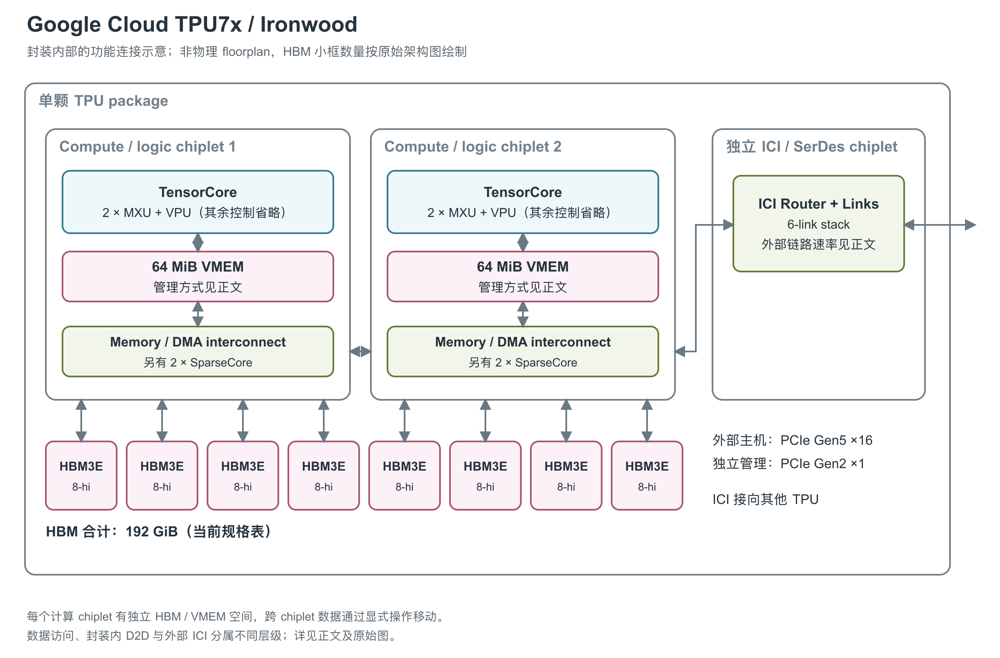

# Google Cloud TPU7x（Ironwood）：双计算 chiplet 的训练与推理加速器

Ironwood 在 Google Cloud 中称为 TPU7x。它面向推理模型的训练与 serving，单颗产品已经是由多个 die 组成的封装；理解规格时，首先要区分一个物理 chip 和软件看到的两个 device。[1, Dual-chiplet architecture and Programming model] [4, p. 2]

图：依据 Hot Chips 架构图重绘，封装含两个 compute chiplet、一个独立 SerDes（高速串并转换收发电路）chiplet 和八个 HBM3E（高带宽堆叠内存）stack。chiplet 指一个封装中承担部分功能的独立裸片；下方 HBM 位置仅为示意。两个计算 chiplet 各有自己的存储空间，图中的连线不表示自动一致的共享 cache。[4, pp. 14-15] [1, Dual-chiplet architecture]

## 一个封装，两套计算与存储空间

每个 compute chiplet 含一个 TensorCore（TPU 的矩阵、向量与标量计算核心）、两个 MXU（矩阵乘法单元）和两个 SparseCore（稀疏访问计算核心），完整封装合计两个 TensorCore、四个物理 MXU、四个 SparseCore。每个 TensorCore 还包含 VPU（向量处理单元）/VMEM（向量暂存存储器）及控制、辅助单元。四个 MXU 在 BF16（16-bit Brain Float）模式描述为 256×256 阵列，在 FP8（8-bit 浮点）模式描述为 512×512 阵列；这是同一组硬件的不同精度模式，不能加起来计成八个 MXU。[4, pp. 14-15] [5, pp. 2, 6]

MXU 执行大规模矩阵乘法，BF16 乘法采用 FP32（32-bit 浮点）累加。VPU 处理矩阵之外的向量操作，每个 vector lane 有四个通用 ALU（算术逻辑单元），向量寄存器组织为 16×256。第四代 SparseCore 则负责 embedding、排序、过滤等不规则任务，也可卸载 pretraining 和强化学习微调中的部分 collective（多设备协作的集合操作）。每个 SparseCore 由控制单元与 16 个 tile 组成。[5, pp. 3-6] [4, p. 11]

### 分精度算力、累加缓冲与向量布局

| 资源 | 原始公开数值 | 计数对象与解释 |
|---|---|---|
| BF16 矩阵峰值 | 2,307 TFLOPS/芯片 | 两个 TensorCore 的完整封装值 [1, System architecture] [5, Table 1] |
| FP8 矩阵峰值 | 4,614 TFLOPS/芯片 | 峰值约为 BF16 两倍；不能把 FP8 模式 512×512 的表示直接按面积四倍外推 FLOPs [1, System architecture] [5, pp. 2, 6] |
| JAX（数值计算框架）算力模型 | BF16 1,155、FP8 2,300 TFLOPS/TensorCore | 两核心的算术合计为 2,310 / 4,600 TFLOPS，与前两行有小幅差异；保持开发模型与产品表各自数值 [21, TPU_7 / TPU_7X branch] |
| 向量数据路径 | 物理架构介绍：向量寄存器 16×256、每 lane 四个通用 ALU | 这是向量并行组织；原文未给可独立引用的全芯片 VPU FP32 TFLOPS、工作时钟或指数/除法吞吐 [5, p. 6, VPU] |
| MXU 累加缓冲 | JAX 每 MXU 描述 128 组、每组 8×256 个 32-bit 元素 | 对应 1 MiB/MXU 的逻辑数据量；是软件可见缓冲描述，不据此认定物理 SRAM bank/端口 [21, TpuInfo.num_accumulators definition and TPU_7X branch；按字节数计算] |

FP8 的格式也有具体限制。JAX 对 Ironwood 支持 E4M3FN、E5M2 两种 FP8 输入，可使用 FP8×FP8，也允许 FP32/BF16 左操作数配 FP8 右操作数；软件类型检查并不允许由此任意组合所有整数或 FP8 变体。Pallas 内核编程文档中的 FP32 输入精度选择仍需单独设置，不能把输入数组的 FP32 类型等同于完整 FP32 乘法吞吐。[21, is_matmul_supported / TPU_7X branch] [22, Precision control]

物理架构论文的 16×256 向量寄存器组织，与当前 JAX 描述中的 `128 lane×8 sublane` 程序布局处于不同描述层面。本介绍保留两者原名，不把后者当成物理 ALU 数量去改写架构图。模型还列每核心两个 MXU、MXU column size 256；它用于内核分块与累加缓冲安排，并不完整暴露 BF16/FP8 的电路实现。[5, p. 6] [21, TPU_7X branch]

## 八个 HBM stack 并非一块自动共享的内存

每个计算 chiplet 连接四个 HBM3E stack，完整封装共八个、每个标为 8-hi，表示堆叠高度为八层。当前规格表给出全芯片 192 GiB HBM；页面叙述也出现 192 GB 和每 chiplet 96 GB 的写法，容量单位存在不一致。架构上两个 chiplet 分别拥有自己的 HBM 空间，框架把它们暴露为两个 device，跨 chiplet 数据移动由 collective 管理，不能视为一个统一 MegaCore 内存空间。[4, p. 15] [1, System architecture, Dual-chiplet architecture and Programming model]

每个软件可见 TensorCore 有 64 MiB VMEM，完整 chip 总计 128 MiB。VMEM 是编译器管理的局部存储，HBM 与 VMEM 之间通过异步 DMA（直接存储器访问）搬运。它适合存放正在计算的分块数据；容量足够并不意味着两个 chiplet 可以不经显式移动就使用彼此的数据。因此，图中把 VMEM 放在各自计算 chiplet 内，也没有画一块横跨封装的 L2 cache。[3, Scoped VMEM tuning] [5, pp. 2-4]

| 架构位置 | 完整单颗 chip 的公开规格 | 需要保留的条件 |
|---|---|---|
| 矩阵计算 | BF16 2,307 TFLOPS（每秒万亿次浮点运算）；FP8 4,614 TFLOPS | 理论峰值，未说明结构化稀疏条件 [1, System architecture] [5, Table 1] |
| HBM3E | 8 stack，192 GiB | 当前规格表；叙述段另用 GB [1, System architecture] [4, p. 15] |
| HBM 带宽 | 当前 Cloud 7,380 GB/s；固定论文 7,300 GB/s | 官方未解释差异，不能自动当作有效/峰值之别 [1, System architecture] [5, Table 1] |
| 片上 VMEM | 2×64 MiB | 两套局部空间，总量 128 MiB [3, Scoped VMEM tuning] [5, Table 1] |

### VMEM、SMEM 和 SparseCore 局部存储

| 层级或通路 | 数值和组织 | 已知限制 |
|---|---|---|
| TensorCore VMEM | 64 MiB/TensorCore，128 MiB/芯片 | 独立局部工作集，需显式 DMA；未找到本代寄存器读写端口的绝对 TB/s 或访问周期 [3, Scoped VMEM tuning] [21, TPU_7X branch] |
| TensorCore SMEM（标量存储器） | 1 MiB/TensorCore | 控制与动态索引，单指令读写 32-bit；未给本代 bank/端口细节 [21, TPU_7X branch] [22, Placing operands in SMEM] |
| SparseCore vector tile | 每 SC 16 tile，每 tile 512 KiB 局部 VMEM | 每 SC 分散局部空间的算术合计为 8 MiB；另有共享 SPMEM，容量不能与 tile 局部值混加为同一层 [21, TPU_7X branch] [23, Hardware overview] |
| SparseCore SIMD | 每 tile 16 个 F32 或 32 个 BF16 元素 | 指令并行宽度，不是 FLOPs/秒；Hot Chips 另报告相对第三代 SparseCore 2.4 倍 FLOPs，未提供绝对值 [23, Hardware overview] [4, p. 11] |
| SparseCore DMA 粒度 | 源码字段 32 B；同版编程指南示例打印为 64 B | 两个开发来源存在差异，不能选一个当作无条件硬件粒度 [21, TPU_7X branch] [23, Hardware overview / get_tpu_info example] |
| HBM 数据路径 | 产品 7,380 GB/s；论文 7,300 GB/s；JAX 模型 7,400 GB/s | JAX 按每 TensorCore 分配 3,700 GB/s、103×10⁹ B HBM，属于其两设备描述；不替换 Cloud 的 192 GiB 封装规格 [1, System architecture] [5, Table 1] [21, TPU_7X branch] |

SparseCore 的软件调度视图与物理数量也要分开：Pallas 表中 Ironwood 写“2（4 physical cores）”，硬件图则明确为两个 compute chiplet 各两个 SparseCore。因此软件中某个 kernel 可调度的 SC 数量不能直接覆盖整个封装的物理计数。tile 有各自的 VMEM/SMEM，另有共享 VMEM（也称 SPMEM）以及 scalar subcore 的 SMEM；这些局部空间与 TensorCore 的 64 MiB VMEM 是不同的资源。[4, p. 15] [23, Hardware overview]

SparseCore gather/scatter 的原生 DMA 搬运类型为 32-bit；BF16/FP16 需要打包和拆分。它支持不规则访问、排序、去重、histogram 与 ragged 操作，并能够和 TensorCore 并行运行。Hot Chips 明确说明其 Pod 级共享内存是 non-coherent，即不会自动维持硬件缓存一致性；细粒度请求与多线程是隐藏远程访问等待的重要手段。[23, Operations and workloads, Overlapping TensorCore and SparseCore, Gathering and scattering 16-bit dtypes] [4, p. 11]

## 封装内连接和外部 ICI

两个计算 chiplet 的 Memory/DMA interconnect 通过 D2D（die-to-die，裸片间连接）相连，右侧再连接独立 SerDes chiplet。Google 只给出 D2D 带宽是一条 1D ICI（芯片间互联）link 的六倍，缺少完整方向与计数说明，不能从外部聚合带宽反推 D2D 绝对数值。[1, Dual-chiplet architecture] [4, p. 15]

独立 SerDes（高速串并转换收发电路）chiplet 集成 ICI router、六组 link stack 与高速收发器。芯片向外有六条 ICI link，每条每方向 100 GB/s，双向聚合 1,200 GB/s；主机数据接口是 PCIe Gen5 x16，另有 PCIe Gen2 x1 管理路径。管理接口连接板级管理系统，不能当作第二条同等级主机数据通道。[4, pp. 15, 22] [5, Table 1 and p. 7 footnote 4]

作为性能估算补充，scaling book 对 Ironwood ICI 采用每条每方向约 90 GB/s，低于物理规格的 100 GB/s，并说明 collective 操作会影响可用带宽。文中 DCN（数据中心网络）egress 约 12.5 GB/s/TPU 是经 host 网络分摊的外部通信能力，不能和 1,200 GB/s ICI 双向聚合相加。独立 SerDes chiplet 在 Hot Chips 图中还标有六组 112G SerDes octals 与 PCS（物理编码子层）；这些是物理收发/编码构件，缺少完整计数口径时不另算一个新的 ICI 总带宽。[20, TPU Networking and TPU specs] [4, p. 15]

外部芯片按 3D mesh/torus 连接，Pod 最大 9,216 chips，Cloud 最小配置为四芯片 VM。芯片级可靠性与安全机制包括 functional BIST（功能内建自检）、逻辑修复、silent data corruption mitigation（静默数据损坏缓解）、安全启动及测试调试保护；Pod 再利用 OCS（光路交换机）与 ICI resiliency 处理网络层故障。前者位于芯片/package，后者依赖外部系统，不能合并为一个模糊的“高可靠互联”方框。[1, Supported configurations] [4, pp. 14, 21] [6, Cloud TPU ICI resiliency]

TPU7x 使用 cold-plate 液冷，四颗 TPU 组成一块 tray。工艺、die 面积、绝对功耗、TDP（散热设计功耗）与工作频率未在现有一手资料中公开；支持动态电压频率调节并不提供一个固定频率值。官方相对能效改善也不能据此换算为单芯片瓦数。[4, pp. 2, 14, 22] [5, Table 1]

## 参考资料

[1] Google Cloud，*TPU7x (Ironwood)*。<https://docs.cloud.google.com/tpu/docs/tpu7x>

[3] Google Cloud，*TPU7x (Ironwood) performance optimizations*。<https://docs.cloud.google.com/tpu/docs/ironwood-performance>

[4] Norman P. Jouppi、Sridhar Lakshmanamurthy，*Ironwood: Delivering Best-in-Class Perf, Perf/TCO, and Perf/Watt for Reasoning Model Training and Serving*，Hot Chips 37，2025。[本地PDF](../../原始资料/论文/Google_TPU/01_厂商直接架构论文/2025_Ironwood_HotChips37.pdf)

[5] Norman P. Jouppi等（Google），*Google's Training Supercomputers from TPU v2 to Ironwood*，2026。[本地PDF](../../原始资料/论文/Google_TPU/01_厂商直接架构论文/2026_TPUv2_to_Ironwood_Five_Generations.pdf)

[6] Google Cloud，*TPU architecture*。[官方网页](https://docs.cloud.google.com/tpu/docs/system-architecture-tpu-vm)；[本地快照](../../原始资料/网页快照/Google/TPU/2026-08-13/google-cloud-tpu-architecture-2026-08-13.html)

[20] Jacob Austin等，*How to Think About TPUs*，JAX scaling book，获取于 2026-09-17。[原文](https://jax-ml.github.io/scaling-book/tpus/)；[官方仓库原文](https://github.com/jax-ml/scaling-book/blob/main/tpus.md)。本文中的约数时钟与带宽用于架构性能估算，不是产品保证值。 [本地原文快照](../../原始资料/网页快照/Google/JAX/2026-09-17/scaling-book-tpus.md)

[21] The JAX Authors，*TPU hardware information*，`jax/_src/tpu_info.py`，获取于 2026-09-17。[官方源码](https://github.com/jax-ml/jax/blob/main/jax/_src/tpu_info.py)；[TPU Hardware Reference](https://docs.jax.dev/en/latest/pallas/tpu/hardware.html)。数值引用对应产品分支；该表是开发工具的硬件描述，`0 / Not Available` 不作为物理资源不存在的证据。 [本地原文快照](../../原始资料/网页快照/Google/JAX/2026-09-17/jax-info-source.py)

[22] The JAX Authors，*Pallas: TPU Details*，获取于 2026-09-17。[官方文档](https://docs.jax.dev/en/latest/pallas/tpu/details.html)；[官方仓库原文](https://github.com/jax-ml/jax/blob/main/docs/pallas/tpu/details.rst)。 [本地原文快照](../../原始资料/网页快照/Google/JAX/2026-09-17/jax-details.rst)

[23] The JAX Authors，*SparseCore Kernel Writing*，获取于 2026-09-17。[官方文档](https://docs.jax.dev/en/latest/pallas/tpu/sparsecore.html)；[官方仓库原文](https://github.com/jax-ml/jax/blob/main/docs/pallas/tpu/sparsecore.md)。 [本地原文快照](../../原始资料/网页快照/Google/JAX/2026-09-17/jax-sparsecore.md)
