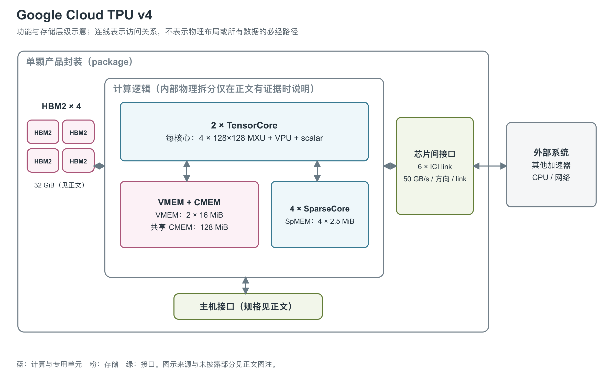

# Google Cloud TPU v4：矩阵计算与 embedding 分工的训练芯片

TPU v4 是 Google 面向大规模机器学习训练设计的加速器，既处理 Transformer 等模型的矩阵运算，也为推荐模型中不规则的 embedding 访问安排了专用硬件。理解它的起点是两类计算单元和几种职责不同的存储。[1, pp. 2, 5-7]

图：依据论文的芯片组成、封装照片与 SparseCore 结构重绘。一个封装含中央 ASIC 和四个 HBM stack；图中将四个 stack 放在一组展示，不还原照片中的位置。片上 CMEM（共享暂存存储器）、VMEM（向量暂存存储器）与 SpMEM（稀疏向量存储器）都不能当作 GPU 的 L2 cache。[1, pp. 2-3, Figure 2; pp. 5-7, Figure 7 and Table 4]

## 从矩阵到 embedding：两条计算路径

芯片中有两个 TensorCore。这里的 TensorCore 是包含矩阵、向量和标量路径的 TPU 计算核心，并非 NVIDIA GPU 中的同名单元。每个核心含四个 128×128 MXU（Matrix Multiply Unit，矩阵乘法单元）、一个 VPU（Vector Processing Unit，向量处理单元）和标量单元。两个核心合计八个 MXU。MXU 采用 systolic array：乘法和累加沿阵列推进，数据在相邻处理单元之间复用，适合神经网络中规模较大的矩阵乘法。[1, p. 2] [6, TPU chip]

矩阵乘法之外，activation、softmax 等计算由向量路径承担；标量路径处理控制流、地址计算和维护工作。每个 VPU 有 128 个 lane（并行通道），每 lane 16 个 ALU（算术逻辑单元），因此不能用 MXU 的峰值直接描述这些非矩阵算子。BF16（16-bit Brain Float）矩阵乘法使用 FP32（32-bit 浮点）累加，较低位宽的输入减少存储与搬运量，累加结果仍保留较高精度。[1, p. 2] [6, TPU chip]

另有四个 SparseCore 专门面对 embedding：按照索引从大表中取出向量，再执行聚合或更新。这类任务的难点常在地址不连续、访问与通信不规则，难以一直填满矩阵阵列。每个 SparseCore 有 16 个 compute tile（计算分块），配有排序、稀疏归约、分流和拼接等跨通道单元，以及 2.5 MiB SpMEM（稀疏向量存储器）；取数和写回路径支持 gather/scatter（按索引读取或写入）。它可通过 HBM 与芯片间互联处理分布式 embedding 表，并与 TensorCore 的计算重叠。[1, pp. 5-6, Figure 7]

## 矩阵、向量与标量的计算规模

八个 MXU 的 BF16 阵列共有 131,072 个乘加位置。按每个位置每周期一次乘加、一次乘加计两次浮点操作，以论文的 1.05 GHz 计算，得到 `8×128×128×2×1.05 GHz = 275.2512 TFLOPS`，与论文的 275 TFLOPS 取整值相符。单 TensorCore 的对应值约为 137.6 TFLOPS；论文把处理器描述为 single instruction / 2D data，每核心只有一个硬件线程。这里是在阵列填满且流水线持续执行下计算的理论值，包含阵列启动、尾部填充或尺寸不合适的短矩阵会达不到它。[1, p. 2 and Table 4] [7, p. 4, MXU]

向量路径另有每核 2,048 个 ALU、全芯片 4,096 个 ALU，这是 `128 lane×16 ALU/lane` 与两个核心的直接加总。若仅作“每个 ALU 每周期一次操作”的理想估算，1.05 GHz 下全芯片为约 4.30 万亿次操作/秒；论文没有把这个估算定义为适用于所有 FP32 指令的额定峰值，也没有给出 FMA、除法、指数等各类指令的统一吞吐。因此该数量只用来认识非矩阵路径的规模，不能拿 275 TFLOPS 给 softmax 或归约计时。[1, p. 2 and Table 4；按所列 ALU 数与时钟计算]

每核有 32 个向量寄存器，每个寄存器包含 `8×128` 个 32-bit 元素，即 4 KiB；每核寄存器数据容量为 128 KiB，两核合计 256 KiB，与原论文的 0.25 MiB register file 相符。寄存器保存当前指令的操作数，VMEM 则保存更大的分块工作集，二者是不同层级。[20, Appendix A / VREGs] [1, Table 4]

JAX 数值计算框架的 v4 硬件描述还给出每核 1 MiB SMEM。SMEM 是 scalar memory，服务于索引、循环界限等控制数据；Pallas 内核编程文档说明其单指令访问 32-bit 值并支持随机访问，向量数据则通过 VMEM 与向量寄存器交换。标量控制与向量、矩阵执行由同一条显式调度的数据流配合，SMEM 容量不应并入 VMEM 或 CMEM。[21, TPU_V4 branch] [22, Placing operands in SMEM and Computation placement]

## 存储为什么要分成几层

封装内四个 HBM2 stack 提供总计 32 GiB 的容量和 1,200 GB/s 带宽。HBM（High Bandwidth Memory，高带宽堆叠 DRAM）保存较大的模型与数据；这 32 GiB 是两个 TensorCore 共享的统一 HBM 地址空间。与之相邻的片上存储容量小得多，却承担计算中的数据复用。[1, p. 7, Table 4] [2, Other memory system differences]

每个 TensorCore 有 16 MiB VMEM，两个核心还共享 128 MiB CMEM。VMEM 是编译器管理的局部 scratchpad，也就是由软件安排数据放入和移出的暂存区；CMEM 采用 load/store 访问。这些工作存储由程序安排访问，不采用透明 cache 的自动命中与替换语义。四个 SparseCore 各自的 SpMEM 又服务于另一条计算路径。因此，把 32 MiB VMEM、128 MiB CMEM 和 10 MiB SpMEM 加起来标成“L2 容量”，会掩盖真正影响程序的数据放置限制。[1, pp. 2, 5-7] [2, TensorCores]

DMA（Direct Memory Access，直接存储器访问）负责安排搬运，v4 支持 512 B 粒度的高性能 stride 访问。HBM 带宽和 MXU 算力是否能同时发挥，取决于搬运能否与计算重叠、数据是否在片上充分复用，以及工作量如何分配给两种核心。[2, Other memory system differences] [1, pp. 5-6]

| 图中位置 | 单颗 TPU v4 的公开数据 | 应如何理解 |
|---|---|---|
| TensorCore / MXU | 2 个核心、8 个 128×128 MXU；1,050 MHz；275 TFLOPS（每秒万亿次浮点运算）（官方标 BF16 或 INT8） | 厂商理论峰值；INT8 完整数值语义及计数规则未公开 [1, Table 4] [2, System architecture] |
| HBM2 | 4 stack，32 GiB，1,200 GB/s | 单封装本地 DRAM，不含主机内存 [1, Figure 2 and Table 4] |
| 片上工作存储 | VMEM 2×16 MiB；共享 CMEM 128 MiB；SpMEM 4×2.5 MiB | 分属不同计算路径，不能合并成一块共享 cache [1, pp. 2, 5-7] |

### 各层带宽与访问粒度

| 数据路径 | 已公开的带宽或粒度 | 对应范围 |
|---|---|---|
| 标量单元 ↔ SMEM | 单指令读写 32-bit 标量；绝对 GB/s 与周期延迟未给出 | 控制数据的随机访问 [22, Placing operands in SMEM] |
| 向量寄存器 ↔ VMEM | 32-bit 数据的基本向量块为 8×128，即 4 KiB；v4 专属每周期读写端口数未在已查原文中给出 | 块访问；寄存器溢出也会占用 VMEM [20, Appendix A / VREGs] [22, Array Layouts and Accessing memory] |
| TensorCore ↔ CMEM | 128 MiB 共享片上存储，load/store 模式；未找到可定位的绝对持续带宽与访问延迟 | 不能将“比 HBM 快”补成一个无来源的 TB/s 数字 [1, p. 8] [2, TensorCores] |
| DMA ↔ HBM | 1,200 GB/s；高性能 stride 粒度 512 B | 产品/论文规格；JAX 估算表另记约 1,230 GB/s 全芯片值 [1, Table 4] [2, Other memory system differences] [21, TPU_V4 branch] |
| TPU ↔ host | 每方向约 16 GB/s | scaling book 明确以 v4 为例；不是 HBM 带宽的一部分 [20, PCIe bandwidth is limited] |
| TPU ↔ 邻居 TPU | 每条每方向 50 GB/s 物理规格；开发者性能估算取约 45 GB/s | 后一数值随 collective 操作不同，原文未将它定义为统一实测值 [7, Table 1 and footnote 4] [20, TPU specs / ICI table] |

资料中的独立研究《SCALE-Sim TPU》实测了 v4 的 GEMM 和 BF16 elementwise 运算。其 GEMM 计时明确排除了 HBM 到核心的数据传输；BF16 addition 的一维扫描为长度 32 至 8,192、步长 32，二维扫描为每维 64 至 1,024、步长 64。观察结果是同样元素数也会因形状产生延迟差异。这可作为分块与向量化影响的实测补充，但论文没有报告能够直接填入上表的 VMEM、CMEM 或 HBM 独立带宽/延迟，不能把模拟器的 cycle-to-time 拟合系数当作芯片频率。[24, pp. 3-5, Sections 4.1-4.2 and Figure 3]

上述研究的 Figure 3 还给出了 BF16 addition 的实测拟合，`N` 是元素总数、时间单位为 μs：一维形状的拟合为 `0.8924 + 1.97×10⁻⁵×N`，二维形状为 `0.9796 + 1.78×10⁻⁵×N`。这能说明短算子的固定开销与随数据量增加的部分，但它是特定 kernel 测量的经验拟合；原文没有给齐每层数据驻留、软件版本及所有硬件执行条件，不能把常数项解释成单条 VPU 指令延迟，也不能把斜率反算成 VMEM 物理带宽。[24, p. 5, Figure 3]

## 一颗芯片怎样接入训练系统

主机通过 PCIe Gen3 x16 连接 TPU；芯片之间使用 ICI（Inter-Core Interconnect，TPU 芯片间互联）。每颗 v4 有六条 ICI link，每条每方向 50 GB/s。这里的“每方向”很关键，不能把双向相加后的数字当作单方向可发送的数据量，也不能把物理链路速率当作应用持续有效带宽。[2, Other] [7, Table 1 and p. 7 footnote 4]

四个液冷封装安装在一块 PCB 上，多个板卡再组成 3D mesh/torus。系统可利用 OCS（Optical Circuit Switch，光路交换机）重构 cube 之间的连接，最大 TPU v4 Pod 包含 4,096 颗芯片。OCS 位于外部系统；它不是单颗 TPU 内的交换单元。SparseCore 的全局可寻址 embedding 空间同样依赖多芯片互联与软件，不能理解为一颗芯片凭空拥有整个 Pod 的 HBM。[1, pp. 2-6]

v4 采用 7 nm 工艺，die 面积小于 600 mm²、晶体管数为 220 亿。论文没有公布 TDP（散热设计功耗）；它报告的 idle 功耗是 90 W，生产应用最小、平均、最大实测值为 121 / 170 / 192 W。当前产品页把 90 / 170 / 192 W 简写为 measured min/mean/max，阅读时应保留论文对 idle 与生产负载的区分。192 W 不能直接作为散热设计功耗使用。[1, p. 7, Table 4] [2, System architecture]

## 参考资料

[1] Norman P. Jouppi等，*TPU v4: An Optically Reconfigurable Supercomputer for Machine Learning with Hardware Support for Embeddings*，ISCA 2023。[本地PDF](../../原始资料/论文/Google_TPU/01_厂商直接架构论文/2023_TPUv4_Optically_Reconfigurable_Supercomputer.pdf)

[2] Google Cloud，*TPU v4*。<https://docs.cloud.google.com/tpu/docs/v4>

[6] Google Cloud，*TPU architecture*。<https://docs.cloud.google.com/tpu/docs/system-architecture-tpu-vm>

[7] Norman P. Jouppi等（Google），*Google's Training Supercomputers from TPU v2 to Ironwood*，2026。[本地PDF](../../原始资料/论文/Google_TPU/01_厂商直接架构论文/2026_TPUv2_to_Ironwood_Five_Generations.pdf)

[20] Jacob Austin等，*How to Think About TPUs*，JAX scaling book，获取于 2026-09-17。[原文](https://jax-ml.github.io/scaling-book/tpus/)；[官方仓库原文](https://github.com/jax-ml/scaling-book/blob/main/tpus.md)。本文中的约数时钟与带宽用于架构性能估算，不是产品保证值。 [本地原文快照](../../原始资料/网页快照/Google/JAX/2026-09-17/scaling-book-tpus.md)

[21] The JAX Authors，*TPU hardware information*，`jax/_src/tpu_info.py`，获取于 2026-09-17。[官方源码](https://github.com/jax-ml/jax/blob/main/jax/_src/tpu_info.py)；[TPU Hardware Reference](https://docs.jax.dev/en/latest/pallas/tpu/hardware.html)。数值引用对应产品分支；该表是开发工具的硬件描述，`0 / Not Available` 不作为物理资源不存在的证据。 [本地原文快照](../../原始资料/网页快照/Google/JAX/2026-09-17/jax-info-source.py)

[22] The JAX Authors，*Pallas: TPU Details*，获取于 2026-09-17。[官方文档](https://docs.jax.dev/en/latest/pallas/tpu/details.html)；[官方仓库原文](https://github.com/jax-ml/jax/blob/main/docs/pallas/tpu/details.rst)。 [本地原文快照](../../原始资料/网页快照/Google/JAX/2026-09-17/jax-details.rst)

[24] Jingtian Dang等，*SCALE-Sim TPU: Validating and Extending SCALE-Sim for TPUs*，2026。[本地PDF](../../原始资料/论文/Google_TPU/02_独立逆向与微基准/2026_SCALE_Sim_TPUv4_Validation.pdf)。
