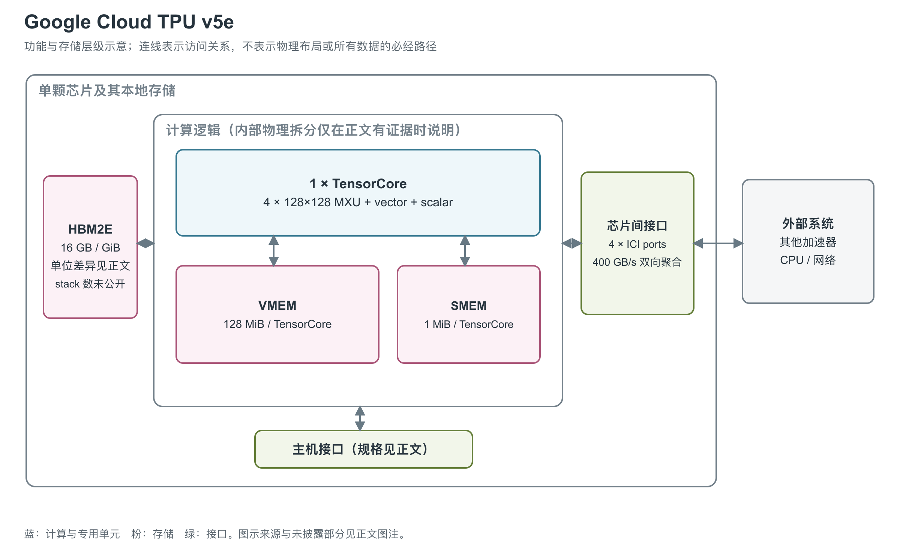

# Google Cloud TPU v5e：以单个 TensorCore 组织训练与推理

TPU v5e 面向训练和推理，Google 强调的是成本与性能的配合。它的计算结构比双 TensorCore 的训练 TPU 更紧凑：一个核心连接本地 HBM（高带宽堆叠内存），再通过 ICI（芯片间互联）端口接入多芯片系统。[1, System architecture] [4, opening]

图：依据 v5e 专页和 TPU 通用架构说明重绘。图中 HBM 为容量集合，stack 数量没有公开，不能按框的个数理解为物理颗数；VMEM（向量暂存存储器）与 SMEM（标量存储器）按 JAX 数值计算框架的 v5e 配置补入，分别服务向量数据和标量控制，不添加没有来源的 L2 cache。[1, System architecture] [2, TPU chip] [21, TPU_V5E branch]

## 一个核心内部怎样分工

每颗 v5e 有一个 TensorCore（TPU 的矩阵、向量与标量计算核心），内含四个 128×128 MXU（矩阵乘法单元）、一个 vector unit 和一个 scalar unit。MXU 是矩阵乘法阵列，vector unit 负责 activation、softmax 等通用计算，scalar unit 负责控制流与地址运算。这里的“一个核心”并不等于一次只能算一个值：四个矩阵阵列与向量路径本身都具有大量并行计算资源。[1, System architecture] [2, TPU chip]

MXU 采用 systolic array。矩阵块进入阵列后，操作数和部分和沿阵列传递，让同一批数据参与多次乘加。一个 128×128 MXU 每周期可执行约 16K 次 multiply-accumulate；在官方明确说明的 BF16 路径中，输入为 BF16（16-bit Brain Float），累加为 FP32（32-bit 浮点）。芯片还公布了 INT8（8-bit 整数）峰值，但没有同样完整地说明 INT8 的累加与输出格式，因此两种精度不能只按位数比值理解。[2, How a TPU works and TPU chip] [1, System architecture]

JAX 的 v5e 分支没有暴露 SparseCore 配置；该接口因此没有给出可单独调度的 SparseCore（稀疏访问计算核心），不能据此证明物理实现绝对没有相关逻辑。本图画出可确认的 TensorCore、VMEM 与 SMEM，也不把软件支持的稀疏算子直接转换成专用硬件方框。[2, SparseCore] [21, TPU_V5E branch]

### 分精度算力和向量执行

| 计算路径 | 公开值或明确计算 | 条件与来源 |
|---|---|---|
| BF16 MXU | 197 TFLOPS；每周期 131,072 FLOPs 的阵列规模 | 4×128×128 个乘加位置，每次乘加按两次操作；按开发者文档约 1.5 GHz 得 196.608 TFLOPS [1, System architecture] [20, What Is a TPU?] |
| INT8 MXU | Cloud 393 TOPS；JAX/开发者估算 394 TOPS | 来源中的近似值不同，不将差额解释为额外硬件 [1, System architecture] [20, TPU specs] [21, TPU_V5E branch] |
| INT4 MXU | 788 TOPS | JAX 硬件描述的 v5e 配置值，原文未给矩阵形状和持续执行测试 [21, TPU_V5E branch] |
| 向量路径 | 128 lane×8 sublane 的程序数据布局 | 对 32-bit 数据，一条完整向量有 1,024 个元素；原文没有给 v5e 独立的 FP32 向量峰值和指令延迟表 [21, TPU_V5E branch] [22, Array Layouts] |

INT4 是 4-bit 整数路径，与 FP4 不是同一种格式。JAX 的原生 matmul 类型检查允许有符号/无符号 INT8 同类整数输入，也允许有符号/无符号 INT4 输入；浮点组包含 FP32、BF16 和特定的 FP8 E5M2、E4M3B11FNUZ。代码能确认这些输入组合被该版本识别，不能仅凭支持列表给每一种浮点格式套上相同峰值。尤其是 FP32 输入并不保证所有乘法均按 IEEE FP32 完整精度执行，Pallas 默认矩阵精度会把 FP32 操作数舍入为 BF16，必须显式选择更高精度策略。[21, is_matmul_supported / TPU_V5E branch] [22, Precision control]

## HBM 容量与带宽对应什么

图左侧 HBM 保存模型参数与计算数据。v5e 的规格规模适合先从单芯片理解，再考虑模型能否切分到多芯片。JAX 的 v5e 分支明确给出本核 128 MiB VMEM 与 1 MiB SMEM，scaling book 也以 v5e 的 128 MiB VMEM 为例说明片上工作集。VMEM 由程序/编译器控制，数据先从 HBM 搬入 VMEM，再进入向量寄存器和计算单元，最终反向写回。这样能够把搬运和计算重叠，并复用已在片上的数据。[20, What Is a TPU?] [21, TPU_V5E branch]

| 资源位置 | 单芯片规格 | 说明 |
|---|---|---|
| MXU 计算路径 | BF16 197 TFLOPS（每秒万亿次浮点运算）；INT8 393 TOPS（每秒万亿次运算） | 厂商峰值；未明确稠密/稀疏条件和 FMA 计数规则 [1, System architecture] |
| 本地 HBM | Cloud 页：16 GB；Google 论文：16 GiB HBM2E | 两份一手资料的容量单位不同 [1, System architecture] [6, p. 2, Table 1] |
| HBM 访问带宽 | Cloud 页：800 GiB/s；论文：819 GB/s | 两个数字不能简单当成同一带宽的等价写法 [1, System architecture] [6, p. 2, Table 1] |
| ICI 端点 | 4 个端口，400 GB/s 双向聚合 | 是芯片间通信，区别于 HBM 访问 [1, System architecture] |

HBM 容量决定能够留在单颗设备内的数据规模，HBM 带宽约束这些数据送往计算路径的速度，MXU 峰值则描述矩阵运算资源的理论上限。实际执行还要考虑数据复用、矩阵形状以及向量算子所占时间。表中两个 HBM 带宽来源使用不同单位且数值关系并不完全相合，官方没有解释原因，本介绍保留两种原始记录。[1, System architecture] [6, p. 2, Table 1]

### 从寄存器、VMEM 到外部接口

| 层级或通路 | 容量、访问组织或带宽 | 说明 |
|---|---|---|
| 向量寄存器 | 基本 32-bit tile 为 8×128，4 KiB | 寄存器总数未找到 v5e 专属公开值，不能沿用 v5p 的 64 个 [21, TPU_V5E branch] [22, Array Layouts] |
| VMEM | 128 MiB；编译器管理的局部 scratchpad | 溢出的向量寄存器也占 VMEM；已查原文没有明确的 v5e 每周期读写口数与绝对带宽 [20, What Is a TPU?] [22, BlockSpecs and grid iteration; Array Layouts] |
| SMEM | 1 MiB；单指令读写 32-bit 标量，支持随机访问 | 保存动态索引和控制数据；未给绝对带宽、bank 数和周期延迟 [21, TPU_V5E branch] [22, Placing operands in SMEM] |
| HBM ↔ VMEM | Cloud 800 GiB/s、论文 819 GB/s、JAX 820 GB/s | 记录原始单位与来源；JAX 还以 17.2×10⁹ B 描述 HBM 容量，属其硬件模型中的近似容量 [1, System architecture] [6, Table 1] [21, TPU_V5E branch] |
| ICI | 每条每方向约 45 GB/s | scaling book 的性能估算值；芯片物理规格为四端口双向合计 400 GB/s [20, TPU specs / ICI table] [1, System architecture] |
| 经 host 的外部数据路径 | PCIe（主机外设互联）约 16 GB/s/TPU；分摊 DCN（数据中心网络）egress 约 3.125 GB/s/TPU | 开发者教程用于性能估算，DCN 是 host 网络份额，不能当作 TPU 自带网口规格 [20, TPU specs] |

这几个量的作用不同：小向量算子可能受寄存器布局和指令启动影响；已在 VMEM 的数据可以重复使用；首次进入芯片的数据仍受 HBM 或 host 路径限制。当前资料能够补上 VMEM/SMEM 的结构与整数路径，仍不足以给出 v5e 每层 SRAM 的实测带宽。

## 从单芯片到二维互联

四个 ICI 端口服务于芯片间连接，v5e 系统采用 2D torus，即两个方向都首尾相连的二维网格。一个 Pod 最多有 256 颗芯片；用户也可以使用更小的 slice，slice 是同一 Pod 内共同执行任务的一组互联芯片。400 GB/s 是单颗芯片端点的双向聚合值，Pod 的 all-reduce 带宽则属于整套网络，二者对应图中的不同层级。[1, System architecture and Configurations]

v5e 提供一芯片 VM，也有多芯片配置。完整 host 中的 CPU、主机 DRAM 和 NIC 都在 TPU 外部；即便某个云实例页面把这些资源与 TPU 并列，它们也不属于图中 TensorCore 或本地 HBM。多个 slice 通过数据中心网络连接时，还会引入另一层通信路径。[1, VM types] [2, Multislice versus single slice]

Google 的硬件生命周期论文给出生产 fleet 平均 66 W/TPU，且不含 host。这是部署中测得的平均值，没有被定义为 TDP（散热设计功耗）或功耗上限；论文同时指出 v5e tray 使用散热器和主动强制风冷。scaling book 使用约 1.5 GHz 的架构估算时钟，[20, What Is a TPU?] 产品页未给保证频率范围；主机物理接口细节、die 工艺与面积仍未公开，也没有给出可重画其真实封装布局的 stack 数量。图中的简化程度由这些证据限制决定。[6, p. 2, Table 1; p. 12, Appendix B.1-B.2]

## 参考资料

[1] Google Cloud，*TPU v5e*。<https://docs.cloud.google.com/tpu/docs/v5e>

[2] Google Cloud，*TPU architecture*。<https://docs.cloud.google.com/tpu/docs/system-architecture-tpu-vm>

[4] Google Cloud，*Announcing Cloud TPU v5e GA for cost-efficient AI model training and inference*，2023-11-08。<https://cloud.google.com/blog/products/compute/announcing-cloud-tpu-v5e-in-ga>

[6] Ian Schneider等（Google），*Life-Cycle Emissions of AI Hardware: A Cradle-To-Grave Approach and Generational Trends*，2025。[本地PDF](../../原始资料/论文/Google_TPU/03_系统与性能补充/2025_Life_Cycle_Emissions_AI_Hardware.pdf)

[20] Jacob Austin等，*How to Think About TPUs*，JAX scaling book，获取于 2026-09-17。[原文](https://jax-ml.github.io/scaling-book/tpus/)；[官方仓库原文](https://github.com/jax-ml/scaling-book/blob/main/tpus.md)。本文中的约数时钟与带宽用于架构性能估算，不是产品保证值。 [本地原文快照](../../原始资料/网页快照/Google/JAX/2026-09-17/scaling-book-tpus.md)

[21] The JAX Authors，*TPU hardware information*，`jax/_src/tpu_info.py`，获取于 2026-09-17。[官方源码](https://github.com/jax-ml/jax/blob/main/jax/_src/tpu_info.py)；[TPU Hardware Reference](https://docs.jax.dev/en/latest/pallas/tpu/hardware.html)。数值引用对应产品分支；该表是开发工具的硬件描述，`0 / Not Available` 不作为物理资源不存在的证据。 [本地原文快照](../../原始资料/网页快照/Google/JAX/2026-09-17/jax-info-source.py)

[22] The JAX Authors，*Pallas: TPU Details*，获取于 2026-09-17。[官方文档](https://docs.jax.dev/en/latest/pallas/tpu/details.html)；[官方仓库原文](https://github.com/jax-ml/jax/blob/main/docs/pallas/tpu/details.rst)。 [本地原文快照](../../原始资料/网页快照/Google/JAX/2026-09-17/jax-details.rst)
