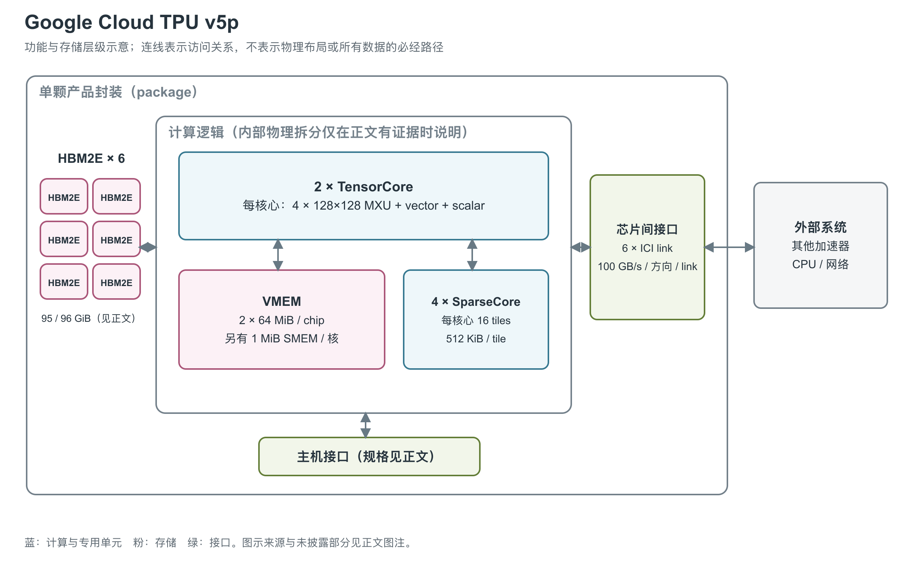

# Google Cloud TPU v5p：更大的本地存储与三维训练互联

TPU v5p 是 Google 面向大规模模型训练的 TPU 配置，也支持 serving。它保留矩阵计算与 SparseCore 的分工，以较大的 HBM（高带宽堆叠内存）、片上工作存储和三维芯片互联支撑多芯片协作。[1, System architecture] [4, Inside Cloud TPU v5p; Leveraging Google’s deep experience to help power the future of AI]

图：依据跨代 TPU 论文的 Table 1、基本数据通路及封装照片重绘。图中逐个画出六个 HBM2E stack；VMEM（向量暂存存储器）是编译器管理的工作存储，每核 64 MiB 与 SparseCore 每 tile 512 KiB 来自 JAX 数值计算框架的 v5p 专属配置；图中没有将其改称 L2 cache。[2, pp. 2, 4-6, Figures 2-3] [21, TPU_V5P branch]

## 两个 TensorCore 和四个 SparseCore

v5p 含两个 TensorCore（TPU 的矩阵、向量与标量计算核心），每个核心有四个 128×128 MXU（矩阵乘法单元），以及向量和标量单元。八个 MXU 负责矩阵乘法；BF16（16-bit Brain Float）输入使用 FP32（32-bit 浮点）累加。标量单元取得 VLIW（超长指令字）bundle，也就是将多个操作组织在一起的宽指令，再把相应操作交给向量和矩阵路径。后两者相对标量路径解耦，DMA（直接存储器访问）也可以异步搬运数据，减少各条路径相互等待的时间。[1, System architecture] [2, pp. 3-4, Figure 2]

另外四个 SparseCore 面向 embedding 查表、scatter/gather 等不规则访问。每个 SparseCore 有 16 个 compute tile，每个 tile 含取数、8-wide SIMD（单指令多数据）向量处理与写回单元；JAX 的 v5p 专属配置列出每个 tile 有 512 KiB 局部 VMEM，另有 SparseCore 共享 SPMEM；二者不能混为一层。跨代论文介绍通用 SparseCore 时使用的 2.5 MiB SpMEM 数字，没有足够说明可用来覆盖 v5p 这一专属配置。[21, TPU_V5P branch] [23, Hardware overview] SparseCore 还可参与部分集合通信、Top-K 和小稀疏张量操作，但已有资料没有为每种任务提供 v5p 独立吞吐上限。[2, p. 5, SparseCore]

这种分工使矩阵计算不必承担所有地址整理与通信工作。它也提醒读者：看到“稀疏”不能立刻把矩阵峰值翻倍，SparseCore 主要针对另一类数据访问与执行模式，官方 v5p 峰值表没有给出结构化稀疏矩阵算力倍增条件。[1, System architecture] [2, p. 5]

## 矩阵峰值之外，还有多少向量算力

| 执行路径 | 完整芯片公开值 | 单核心或每周期说明 |
|---|---|---|
| BF16 矩阵 | 459 TFLOPS | 4 个 128×128 MXU/核；按约 1.75 GHz、乘加计两次操作计算为每核 229.376、全芯片 458.752 TFLOPS，与产品值取整一致 [1, System architecture] [20, Appendix A and TPU specs] |
| FP8/BF8 矩阵 | 459 TFLOPS | Cloud 与论文分别使用 FP8 与 BF8 标签；Google Ironwood 发布文图注将 v5p 的 FP8 标为 emulated，保留模拟执行条件 [24, Figure 2 caption] [1, System architecture] [2, Table 1] [21, TPU_V5P branch] |
| INT8 矩阵 | 918 TOPS | JAX 与 scaling book 的全芯片值；每核心硬件模型为 459 TOPS [20, TPU specs] [21, TPU_V5P branch] |
| INT4 矩阵 | 1,840 TOPS | JAX 每核心列 920 TOPS，两核加总；没有给相同条件下的实测持续利用率 [21, TPU_V5P branch] |
| FP32 普通向量操作 | 约 14.336 TFLOPS，两核合计的条件推导 | 每核 8×128×4 = 4,096 个单操作 ALU（算术逻辑单元）槽位/周期，按约 1.75 GHz 得 7.168 TFLOPS；这是 add 等一次计一个操作的路径，不能按 FMA（融合乘加）再乘二 [20, Appendix A / VPU] |

向量单元的 `8×128` 布局由 128 个 lane 和每 lane 的 8 个 sublane 构成；每个位置有四个独立浮点 ALU。典型 vadd 的启动吞吐是每 ALU 每周期一条，结果延迟约两个周期；不同 ALU 可以在同一周期执行不同操作，而 lane/sublane 之间仍执行相同指令。资料没有把除法、指数、归约等复杂操作统一定义为上述加法峰值。[20, Appendix A / VPU]

同一 lane 内沿 8 个 sublane 做 shuffle，约一个周期可完成一次滚动重排；跨 lane 归约需利用 XLU（Cross-Lane Unit，跨通道单元），代价不同。每核标量控制单元调度一个 VPU、四个 MXU、两个 XLU 和 DMA，最多每周期创建一个 DMA 请求。这个描述符产生速率反映控制路径，不等于每周期只传一个字节，也不等于只有一个 DMA 数据引擎。[20, Appendix A / Reductions and Scalar Core]

## 六个 HBM stack 与编译器控制的 VMEM

封装照片显示六个 HBM stack，跨代论文注明为 HBM2E，总容量 96 GiB；Cloud 产品规格表写 95 GiB。官方没有解释这 1 GiB 差额，不能擅自归因于保留空间、纠错或系统占用。两份资料均给出 2,765 GB/s HBM 带宽，因而带宽的跨来源一致性好于容量标签。[1, System architecture] [2, Table 1 and Figure 3]

JAX 支持把 v5p 的两个物理 TensorCore 呈现为一个逻辑 device（Megacore），或以 split 模式每个逻辑 device 使用一个核心。Pallas 要利用两核，需要把一个 grid 轴并行映射；这种逻辑分组不改变每核的局部存储边界。[21, ChipVersion.supports_megacore; get_tpu_info_for_chip] [22, Multicore TPU configurations]

片上 VMEM 总计 128 MiB，由编译器控制数据放置。向量寄存器访问对应的 VMEM 切片，异步 DMA 在 VMEM 与 HBM 之间搬运数据。JAX 的 v5p 分支进一步给出每核 64 MiB，两个核心合计 128 MiB；图中据此标明两套局部空间。[21, TPU_V5P branch] 读者可把它理解为计算所需的局部工作集空间，但不能套用 CPU/GPU 的透明缓存命中模型。[2, pp. 2, 4, Table 1 and Figure 2]

| 架构位置 | 单颗 v5p 规格 | 来源与条件 |
|---|---|---|
| TensorCore / MXU | 2 核、8 个 128×128 MXU；459 TFLOPS（每秒万亿次浮点运算） BF16 | 厂商理论峰值 [1, System architecture] [2, Table 1] |
| 低精度计算 | 459 TFLOPS，Cloud 标 FP8、论文标 BF8 | 官方 Ironwood 发布文将旧代 FP8 标为模拟实现，不推定原生支持所有 FP8 格式；完整累加与输出语义未公开 [24, Figure 2 caption] [1, System architecture] [2, Table 1] |
| HBM2E | 6 stack；95 GiB（Cloud）/96 GiB（论文）；2,765 GB/s | 两种容量记录保留原单位 [1, System architecture] [2, Figure 3 and Table 1] |
| VMEM | 128 MiB/TPU | 软件管理，非统一硬件 cache [2, Table 1 and Figure 2] |

### VMEM 带宽可以直接对应到向量寄存器

每核有 64 个 VREG（向量寄存器），每个 VREG 存 8×128 个 32-bit 元素，共 4 KiB；每核寄存器容量为 256 KiB，两核合计 512 KiB。scaling book 明确给出每核每周期可从 VMEM 读取三个完整寄存器、向 VMEM 写回一个。以其约 1.75 GHz 时钟换算，得到下表中的局部带宽；这是对端口数与时钟的条件计算，没有经过本调研的微基准测量。[20, Appendix A / VREGs and VPU]

| 层级或路径 | 公开组织/容量 | 带宽、粒度与条件 |
|---|---|---|
| VMEM → VREG | 3×4 KiB/周期/核 | 12,288 B/周期，约 21.504 TB/s/核；两核各自满载时算术合计 43.008 TB/s [20, Appendix A；按约 1.75 GHz 计算] |
| VREG → VMEM | 1×4 KiB/周期/核 | 4,096 B/周期，约 7.168 TB/s/核；两核算术合计 14.336 TB/s，不能当作单个核心可用的一条共享总线 [20, Appendix A；同上条件] |
| 每核 VMEM | 64 MiB | 编译器控制；VREG 溢出占用该空间 [21, TPU_V5P branch] [22, Array Layouts] |
| 每核 SMEM（标量存储器） | 1 MiB | 单指令读写 32-bit 控制数据，可随机寻址；没有可引用的绝对带宽/周期延迟 [21, TPU_V5P branch] [22, Placing operands in SMEM] |
| SparseCore tile 局部存储 | 每 tile 512 KiB，16 tile/SC | 每 SC 的 tile 局部空间算术合计 8 MiB，分散在各 tile；不包含容量未明确的共享 SPMEM [21, TPU_V5P branch] [23, Hardware overview] |
| SparseCore DMA | 最小传输粒度 32 B | 来自 v5p 开发配置；不是每请求延迟或每秒带宽 [21, TPU_V5P branch] |
| HBM | 产品/论文 2,765 GB/s | JAX 性能模型另记 2,460 GB/s/芯片，未说明差异原因，本文不将两者分别指定为理论/实测 [1, System architecture] [2, Table 1] [21, TPU_V5P branch] |

公开带宽按“读三、写一”分别表示，读带宽不能无条件用于写回。向量加法、激活和矩阵乘法对这些端口的读写需求不同，因此即使都在 VMEM 内执行，也可能先遇到不同的端口限制。JAX 以 103×10⁹ B 全芯片/两核均分的方式描述 HBM 容量，这与论文的 96 GiB 量级接近，但不能用近似模型替换 Cloud 的 95 GiB 产品规格。[20, Appendix A / VREGs] [21, TPU_V5P branch]

Pallas 的 SparseCore 编程说明还区分 tile 局部 VMEM/SMEM、SC 共享 VMEM 和 scalar subcore 的 SMEM。SparseCore gather/scatter 的原生 DMA 数据类型是 32-bit，读取 BF16/FP16 时需打包后搬运再拆分；这给出了实际使用稀疏读取路径时的访问约束，而非矩阵计算中的结构化稀疏倍增。[23, Hardware overview and Gathering and scattering 16-bit dtypes]

## ICI 把多个本地存储组织起来

每颗 v5p 有六条 ICI（芯片间互联）link，每条每方向 100 GB/s，单芯片双向聚合为 1,200 GB/s。4×4×4 及更大的 slice 采用 3D torus；更小的 slice 仍为三维连接，但没有 wrap-around 回环。六条 link 对应三维互联的相邻连接。官方还允许部分 slice 使用 twisted torus（改变回环连接的拓扑）：4×4×8 的理论二分带宽比同形状普通 torus 高约 70%，4×8×8 高约 40%；每芯片 1,200 GB/s 端点规格保持不变。实际收益取决于模型并行策略，不能将拓扑差异当成单芯片带宽升级。[1, Twisted torus topologies]ICI DMA 与访问本地 HBM 的 DMA 具有相似编程方式，但远程路径只支持 push/write，需要软件协调同步。SparseCore 可借助 HBM 和 ICI 形成系统级全局可寻址空间，这不等于自动保持 cache coherence 的共享内存。[1, System architecture] [2, pp. 4-5, 7, footnote 4]

scaling book 用每条每方向约 90 GB/s 估算 v5p 的 ICI 操作，而产品物理规格为 100 GB/s；作者明确说明不同 collective 操作会出现不同带宽。主机路径在同一估算模型中约为 PCIe 16 GB/s/TPU，DCN（数据中心网络）egress 为 6.25 GB/s/TPU，后者是 host 网络按 TPU 分摊后的量，不能画成 TPU die 自带的 NIC。[20, TPU Networking and TPU specs]

v5p 的一个 host 连接四颗 TPU，Pod 包含 8,960 颗，单个可调度 slice 最大 6,144 颗。CPU 经 PCIe 接入，但已有资料未公布单芯片接口代际与 lane 数；数据中心网络和主机 RAM 也不属于 TPU 的本地资源。cube 及以上 slice 的 ICI resiliency 可绕过部分光链路或 OCS 故障，这种容错依赖外部网络，不能画到单颗 die 内部。[1, Configurations and Cloud TPU ICI resiliency] [2, p. 5]

v5p 使用液冷封装。Google 生命周期论文测得 fleet 平均 331 W/TPU，不含 host；TDP（散热设计功耗）、峰值功耗、die 工艺与面积仍未公开；本文使用的约 1.75 GHz 来自开发者架构说明，未被定义为产品保证频率。331 W 适合描述该论文所统计的生产运行情况，不适合作为所有模型或所有频率下的固定功耗。[2, pp. 2, 6] [7, p. 2, Table 1] [20, Appendix A / VPU]

## 参考资料

[1] Google Cloud，*TPU v5p*。<https://docs.cloud.google.com/tpu/docs/v5p>

[2] Norman P. Jouppi等（Google），*Google's Training Supercomputers from TPU v2 to Ironwood: Architectural Stability, Scale, Resilience, Power Efficiency, and Sustainability Across Five Generations*，2026。[本地PDF](../../原始资料/论文/Google_TPU/01_厂商直接架构论文/2026_TPUv2_to_Ironwood_Five_Generations.pdf)

[4] Google Cloud，*Enabling next-generation AI workloads: Announcing TPU v5p and AI Hypercomputer*，2023-12-06（官方页面当前显示日期）。<https://cloud.google.com/blog/products/ai-machine-learning/introducing-cloud-tpu-v5p-and-ai-hypercomputer>

[7] Ian Schneider等（Google），*Life-Cycle Emissions of AI Hardware: A Cradle-To-Grave Approach and Generational Trends*，2025。[本地PDF](../../原始资料/论文/Google_TPU/03_系统与性能补充/2025_Life_Cycle_Emissions_AI_Hardware.pdf)

[20] Jacob Austin等，*How to Think About TPUs*，JAX scaling book，获取于 2026-09-17。[原文](https://jax-ml.github.io/scaling-book/tpus/)；[官方仓库原文](https://github.com/jax-ml/scaling-book/blob/main/tpus.md)。本文中的约数时钟与带宽用于架构性能估算，不是产品保证值。 [本地原文快照](../../原始资料/网页快照/Google/JAX/2026-09-17/scaling-book-tpus.md)

[21] The JAX Authors，*TPU hardware information*，`jax/_src/tpu_info.py`，获取于 2026-09-17。[官方源码](https://github.com/jax-ml/jax/blob/main/jax/_src/tpu_info.py)；[TPU Hardware Reference](https://docs.jax.dev/en/latest/pallas/tpu/hardware.html)。数值引用对应产品分支；该表是开发工具的硬件描述，`0 / Not Available` 不作为物理资源不存在的证据。 [本地原文快照](../../原始资料/网页快照/Google/JAX/2026-09-17/jax-info-source.py)

[22] The JAX Authors，*Pallas: TPU Details*，获取于 2026-09-17。[官方文档](https://docs.jax.dev/en/latest/pallas/tpu/details.html)；[官方仓库原文](https://github.com/jax-ml/jax/blob/main/docs/pallas/tpu/details.rst)。 [本地原文快照](../../原始资料/网页快照/Google/JAX/2026-09-17/jax-details.rst)

[23] The JAX Authors，*SparseCore Kernel Writing*，获取于 2026-09-17。[官方文档](https://docs.jax.dev/en/latest/pallas/tpu/sparsecore.html)；[官方仓库原文](https://github.com/jax-ml/jax/blob/main/docs/pallas/tpu/sparsecore.md)。 [本地原文快照](../../原始资料/网页快照/Google/JAX/2026-09-17/jax-sparsecore.md)

[24] Amin Vahdat，*Ironwood: The first Google TPU for the age of inference*，Google，2025-04-09，2025-04-23 更新。[官方原文](https://blog.google/innovation-and-ai/infrastructure-and-cloud/google-cloud/ironwood-tpu-age-of-inference/)。Figure 2 图注明确 v4/v5p 的 FP8 为 emulated。
