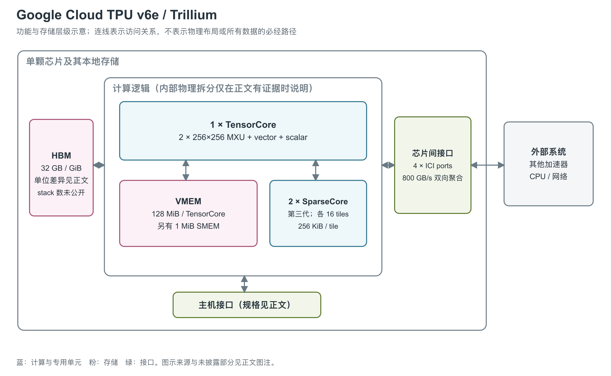

# Google Cloud TPU v6e（Trillium）：更大的矩阵阵列与独立稀疏路径

Trillium 是 Google 的第六代 TPU，在 Cloud 产品中称为 v6e，面向训练与推理。Google 设计团队的跨代论文将其设计侧重概括为 inference；这一侧重与 Cloud 覆盖的两类用途分别记录。[24, p.1, footnote 2] 它仍以一个 TensorCore（TPU 的矩阵、向量与标量计算核心）为计算主体，但矩阵阵列扩大，并搭配第三代 SparseCore 处理不规则数据。[1, System architecture] [5, opening]

图：依据 v6e 官方规格、TPU 通用架构与 OpenXLA SparseCore 文档重绘。HBM（高带宽堆叠内存）的代际与 stack 数量未在所查资料中公开，图中按一个容量集合表示；VMEM（向量暂存存储器）与 SPMEM（SparseCore 暂存存储器）属于不同计算路径的局部存储，不能合并标为 L2 cache。[1, System architecture] [3, TPU chip] [4, Memory hierarchy] [21, TPU_V6E branch]

## 阵列变大后，计算分工仍然存在

v6e 的一个 TensorCore 内有两个 256×256 MXU（矩阵乘法单元），加上一个 VPU（vector processing unit，向量处理单元）和一个 scalar unit。MXU 是 systolic array，由大量相邻乘加单元构成，承担矩阵乘法。两个阵列的数量看上去少于早期四个阵列配置，但每个阵列的边长更大；不能只凭 MXU 个数比较两款 TPU 的计算规模。[1, System architecture] [3, TPU chip]

向量单元处理 activation、softmax 等通用运算，标量单元处理控制与地址计算。官方 BF16（16-bit Brain Float）路径采用 FP32（32-bit 浮点）累加；产品规格另列 FP8（8-bit 浮点）和 INT8（8-bit 整数）峰值，但已有资料没有完整披露这两条路径的乘积、累加、舍入和输出语义。因此，低精度峰值只能在其标注格式内解释，不能据此推定模型无需数值验证即可取得相同速度。[3, TPU chip] [1, System architecture] [2, TPU architecture specifications]

两个第三代 SparseCore 为 embedding 等不规则访问提供独立执行资源。每个 SparseCore 有 16 个 compute tile，SIMD（单指令多数据）宽度为 F32（32-bit 浮点）的 8 个元素或 BF16 的 16 个元素，并支持动态执行以及排序、过滤、prefix-sum 等跨 lane 操作。embedding 查表需要按输入索引取数，矩阵阵列难以单独解决这类数据准备工作；SparseCore 将它与规则矩阵计算分开处理。[3, SparseCore] [4, Specifications at a glance and Introduction]

### MXU、VPU 与 SparseCore 的独立尺度

两个 256×256 MXU 合计 131,072 个乘加位置；在每位置每周期执行一次乘加、乘加计两次操作的阵列模型下，对应 262,144 FLOPs/周期。这个值用于描述阵列规模，资料没有给出可用于换算成保证频率的完整时钟定义，不能据 918 TFLOPS 反推一个已证实的芯片时钟。[3, TPU chip] [20, Appendix B]

| 路径 | Cloud 产品规格 | JAX 开发配置中的单芯片值 |
|---|---|---|
| BF16 矩阵 | 918 TFLOPS | 920 TFLOPS [1, System architecture] [21, TPU_V6E branch] |
| FP8 矩阵 | 918 TFLOPS | 920 TFLOPS [2, TPU architecture specifications] [21, TPU_V6E branch] |
| INT8 矩阵 | 1,836 TOPS | 1,840 TOPS [1, System architecture] [21, TPU_V6E branch] |
| INT4 矩阵 | 已查产品表未列 | 3,680 TOPS；4-bit 整数，不是 FP4 [21, TPU_V6E branch] |
| 普通向量计算 | 独立 FP32 峰值未给出 | 编程视图为 128 lane×8 sublane；不据矩阵算力给 VPU 填一个倍数 [21, TPU_V6E branch] [22, Array Layouts] |
| SparseCore SIMD | 2 个 SC×16 tile；每 tile 8 个 F32 或 16 个 BF16 元素 | 每条 tile 向量指令的全芯片并行元素数算术合计为 F32 256/BF16 512；原文没有给出每秒 FLOPs [4, Specifications at a glance] [23, Hardware overview] |

JAX 数值计算框架的类型检查支持特定 FP8 E5M2/E4M3B11FNUZ 浮点输入，以及 INT8/UINT8、INT4/UINT4 整数组合；FP32/BF16 也在支持范围。输入格式支持与运算精度不同，Pallas 内核编程文档提示 FP32 输入在默认精度设置下仍可能舍入为 BF16。开发者需要同时选择输入格式、累加/输出要求与矩阵精度策略，不能只比较表中的 bit 数。[21, is_matmul_supported / TPU_V6E branch] [22, Matrix multiplication and Precision control]

## 大容量数据在 HBM，活跃数据留在片上

HBM 保存 embedding table 和其他大数据集，TensorCore、SparseCore 与 host 系统都可访问。TensorCore 使用 VMEM，SparseCore 使用 SPMEM，把当前活跃的数据暂存在片上。OpenXLA 将这两者描述为局部 scratchpad：软件参与数据管理，作用不同于自动填充和替换的 cache。[4, High bandwidth memory, Memory hierarchy and Overall memory management strategy]

JAX 的 v6e 配置给出 TensorCore 的 128 MiB VMEM 与 1 MiB SMEM（标量存储器），每个 SparseCore tile 有 256 KiB 局部 VMEM；共享 SPMEM 的容量、bank 数、绝对带宽与完整搬运拓扑仍未明确。[21, TPU_V6E branch] 图中保留它们的位置，是为了说明“HBM 容量”与“计算附近的工作存储”分属不同层级，而非暗示片上容量可以由相邻代际补齐。HBM stack 数量与物理封装同样没有可靠原文支持。[1, System architecture] [4, Memory hierarchy] [8, p. 2, Table 1]

| 架构位置 | 单芯片规格 | 阅读条件 |
|---|---|---|
| 矩阵路径 | BF16 918 TFLOPS（每秒万亿次浮点运算）；FP8 918 TFLOPS；INT8 1,836 TOPS（每秒万亿次运算） | 官方峰值，未给出稠密/稀疏及完整计数条件 [1, System architecture] [2, TPU architecture specifications] |
| HBM 容量 | v6e 专页 32 GB；机器规格与论文 32 GiB | HBM 代际未公开，保留单位差异 [1, System architecture] [2, TPU architecture specifications] [8, Table 1] |
| HBM 带宽 | Cloud 1,638 GB/s；论文 1,640 GB/s | 来源存在小幅数值差，非实测持续吞吐 [1, System architecture] [8, Table 1] |
| ICI 接口 | 4 个端口；800 GB/s 双向聚合 | 不等于单端口或单方向带宽 [1, System architecture] |

918 TFLOPS 对应矩阵计算资源，1,638 GB/s 对应 HBM 访问，两者共同约束模型执行。对于复用充分的大矩阵，MXU 更可能成为主要限制；对于反复读取大数据集的阶段，HBM 访问会更突出。这里是由架构资源关系作出的解释，实际瓶颈仍随模型形状、精度与软件调度变化，不能从规格表直接得到统一加速比。

### 不止 HBM：各层的容量与搬运限制

| 数据层级 | 公开数值或组织 | 对算子的影响 |
|---|---|---|
| TensorCore VREG（向量寄存器） | 程序基本 tile 为 8×128 个 32-bit 元素，即 4 KiB | 总寄存器数及 v6e 每周期 VMEM 端口数未明确 [21, TPU_V6E branch] [22, Array Layouts] |
| TensorCore VMEM | 128 MiB/核，也即本芯片总量 | 编译器分块、搬入和搬出，寄存器溢出也占该空间 [21, TPU_V6E branch] [22, BlockSpecs and grid iteration; Array Layouts] |
| TensorCore SMEM | 1 MiB/核 | 单指令读写 32-bit 随机控制数据；周期延迟、bank 数和绝对带宽未公开 [21, TPU_V6E branch] [22, Placing operands in SMEM] |
| SparseCore tile VMEM | 256 KiB/tile；每 SC 16 tile | 分散局部空间合计 4 MiB/SC、全芯片 8 MiB；不包含共享 SPMEM [21, TPU_V6E branch] [23, Hardware overview] |
| SparseCore DMA（直接存储器访问） | 32 B 传输粒度 | v6e 配置值；不等同于 SRAM 字宽或单请求延迟 [21, TPU_V6E branch] |
| HBM 访问 | Cloud 1,638 GB/s；论文/JAX 约 1,640 GB/s | JAX 容量模型使用 34.4×10⁹ B；Cloud/论文的 GB/GiB 标签保留于前表 [1, System architecture] [8, Table 1] [21, TPU_V6E branch] |
| ICI | 每条每方向约 90 GB/s | scaling book 用于 collective 估算的值；产品端点仍是四端口双向聚合 800 GB/s [20, TPU specs] [1, System architecture] |
| host 与外部 DCN（数据中心网络） | PCIe 约 32 GB/s/TPU；DCN egress 约 12.5 GB/s/TPU | 开发者估算，DCN 是分摊的主机网络份额；不是 TPU 内存带宽 [20, TPU specs] |

SparseCore 的 tile 局部 VMEM/SMEM 与共享 VMEM/SPMEM 分开管理；它能够把 gather/scatter、排序、去重及 ragged 操作与 TensorCore 计算重叠。DMA 原生以 32-bit 数据进行 gather/scatter，BF16/FP16 数据需打包成 32-bit 后传输再拆开。这一约束直接影响小粒度 embedding 数据的组织。[23, Hardware overview, Operations and workloads, Overlapping TensorCore and SparseCore, Gathering and scattering 16-bit dtypes]

## 四个通信端口之外是完整系统

ICI（芯片间互联）把 v6e 芯片连成多芯片 slice，即共同执行任务的互联芯片组。完整 Pod 为 256 颗芯片、2D torus（二维环面）拓扑。Cloud 同时提供一芯片测试配置以及多芯片 VM；VM 中的 vCPU、主机 RAM 和 NUMA 关系描述的是主机部署，不足以证明 TPU 的 PCIe 代际、lane 数或芯片内互联。规格页里的 Pod all-reduce 带宽也属于整个系统，不能放到图中的某个片上通信单元旁边。[1, Supported configurations, VM types and System architecture]

Google 发布文章提到提高时钟，但没有公布明确频率。生命周期论文将工艺与 die 面积列为未披露，并报告不含 host 的 fleet 平均功耗为 153 W/TPU；该值不是 TDP（散热设计功耗）或峰值。现有资料足以说明 v6e 的计算与存储分工，还不足以复原其物理版图、散热方案或完整 cache/一致性结构。[5, 4.7X increase in compute performance per Trillium chip] [8, p. 2, Table 1]

## 参考资料

[1] Google Cloud，*TPU v6e*。<https://docs.cloud.google.com/tpu/docs/v6e>

[2] Google Cloud，*TPU machines in accelerator-optimized machine family*。<https://docs.cloud.google.com/compute/docs/tpus/tpu-machines>

[3] Google Cloud，*TPU architecture*。<https://docs.cloud.google.com/tpu/docs/system-architecture-tpu-vm>

[4] OpenXLA，*A deep dive into SparseCore for Large Embedding Models (LEM)*。<https://openxla.org/xla/sparsecore>

[5] Google Cloud，*Announcing Trillium, the sixth generation of Google Cloud TPU*，2024-05-14。<https://cloud.google.com/blog/products/compute/introducing-trillium-6th-gen-tpus>

[8] Ian Schneider等（Google），*Life-Cycle Emissions of AI Hardware: A Cradle-To-Grave Approach and Generational Trends*，2025。[本地PDF](../../原始资料/论文/Google_TPU/03_系统与性能补充/2025_Life_Cycle_Emissions_AI_Hardware.pdf)

[20] Jacob Austin等，*How to Think About TPUs*，JAX scaling book，获取于 2026-09-17。[原文](https://jax-ml.github.io/scaling-book/tpus/)；[官方仓库原文](https://github.com/jax-ml/scaling-book/blob/main/tpus.md)。本文中的约数时钟与带宽用于架构性能估算，不是产品保证值。 [本地原文快照](../../原始资料/网页快照/Google/JAX/2026-09-17/scaling-book-tpus.md)

[21] The JAX Authors，*TPU hardware information*，`jax/_src/tpu_info.py`，获取于 2026-09-17。[官方源码](https://github.com/jax-ml/jax/blob/main/jax/_src/tpu_info.py)；[TPU Hardware Reference](https://docs.jax.dev/en/latest/pallas/tpu/hardware.html)。数值引用对应产品分支；该表是开发工具的硬件描述，`0 / Not Available` 不作为物理资源不存在的证据。 [本地原文快照](../../原始资料/网页快照/Google/JAX/2026-09-17/jax-info-source.py)

[22] The JAX Authors，*Pallas: TPU Details*，获取于 2026-09-17。[官方文档](https://docs.jax.dev/en/latest/pallas/tpu/details.html)；[官方仓库原文](https://github.com/jax-ml/jax/blob/main/docs/pallas/tpu/details.rst)。 [本地原文快照](../../原始资料/网页快照/Google/JAX/2026-09-17/jax-details.rst)

[23] The JAX Authors，*SparseCore Kernel Writing*，获取于 2026-09-17。[官方文档](https://docs.jax.dev/en/latest/pallas/tpu/sparsecore.html)；[官方仓库原文](https://github.com/jax-ml/jax/blob/main/docs/pallas/tpu/sparsecore.md)。 [本地原文快照](../../原始资料/网页快照/Google/JAX/2026-09-17/jax-sparsecore.md)

[24] Norman P. Jouppi 等，*Google's Training Supercomputers from TPU v2 to Ironwood*，2026。p.1 注 2 说明 Trillium 的设计取向。[本地PDF](../../原始资料/论文/Google_TPU/01_厂商直接架构论文/2026_TPUv2_to_Ironwood_Five_Generations.pdf)
