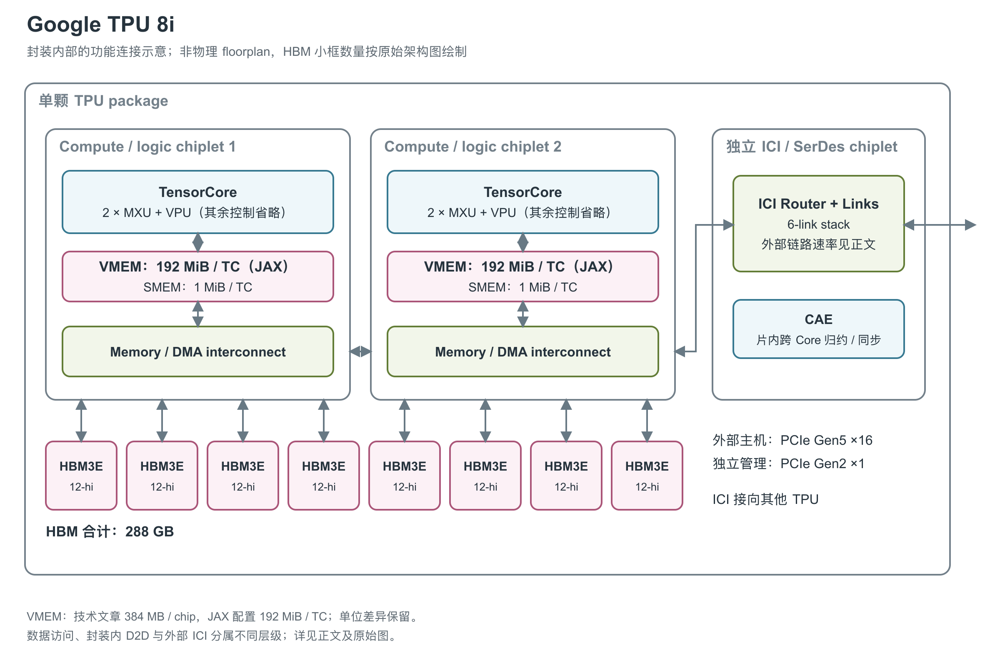

# Google TPU 8i：为 decoding 配置更大片上存储与归约引擎

TPU 8i 是 Google 第八代 TPU 中面向 post-training 与高并发 reasoning 的产品。它保留两套 TensorCore（TPU 的矩阵、向量与标量计算核心）计算逻辑，并把片上存储和跨核心归约作为独立的设计重点。[1, TPU 8i: The sampling and serving specialist; The Collectives Acceleration Engine]

图：依据官方 Figure 4 重绘，两个 logic/on-core die 各带一个 TensorCore，另一个 chiplet 集成 ICI（芯片间互联）/SerDes（高速串并转换收发电路）与 CAE（集合操作加速引擎），八个 12-hi HBM3E stack 分别连接两侧逻辑。图中同时保留技术文章的整芯片 384 MB Vmem（向量暂存存储器）与 JAX 专属配置的每 TensorCore 192 MiB；后者有独立来源，单位差异不静默换算。[1, Figure 4; On-Chip SRAM (Vmem)] [21, TPU_8I branch]

## decoding 为什么需要矩阵之外的资源

autoregressive decoding 指模型根据已有 token 逐步生成后续 token。每一步除了矩阵运算，还涉及对中间结果的归约、同步与下一步数据准备。8i 的每个 TensorCore 在原图中包含两个 MXU（矩阵乘法单元）、两个 XLU、一个 TCS 以及中央 VPU（向量处理单元）/Vmem；两个核心分别位于两个 on-core die。XLU 与 TCS 是原图未展开职责的辅助和控制方框。技术文章没有给出完整阵列尺寸、时钟或这些辅助单元的具体职责；JAX 后续描述提供每核心两个 MXU 和 MXU column size 256。图保留计算与存储的主要层次，不把编程视图进一步外推成 FP4 电路布局。[1, Figure 4 and The Collectives Acceleration Engine] [21, TPU_8I branch]

与前代 Ironwood 的四个 SparseCore（稀疏访问计算核心）不同，8i 在独立 chiplet die 上配置一个 CAE（Collectives Acceleration Engine，集合操作加速引擎）。官方说明它聚合跨核心结果，加速 decoding 与 chain-of-thought 处理中的 reduction 和 synchronization。这里首先是芯片内两个 TensorCore 之间的工作；不能因为名称包含 collectives，就直接把它写成已证实的跨设备 all-reduce 硬件。[1, The Collectives Acceleration Engine]

将 CAE 放在图中的独立 chiplet 内，有助于区分“矩阵计算有多快”和“一步推理何时能完成”。如果阶段间必须等待归约，单纯增加 MXU 峰值并不会按同样比例降低每步延迟。官方描述的是为这类等待配置专门资源，但没有公开 CAE 内部单元、消息粒度、可持续吞吐与详细调度规则。[1, The Collectives Acceleration Engine]

### 计算资源与 CAE 的独立能力

| 执行路径 | 已公开值 | 条件与对象 |
|---|---|---|
| FP4（4-bit 浮点）峰值 | 10.1 PFLOPS/芯片 | 技术文章的 FP4 表头；与发布规格图 FP8 标签的冲突保留在后文 [1, Peak FP4 PFLOPs] |
| BF16（16-bit Brain Float）矩阵开发参数 | 550.5 TFLOPS/TensorCore；两核合计 1,101 TFLOPS | JAX 静态硬件描述，未给频率及与发布规格相同的测试条件 [21, TPU_8I branch] |
| FP8（8-bit 浮点）矩阵开发参数 | 4,404 TFLOPS/TensorCore；两核合计 8,808 TFLOPS | 与产品文章的 FP4 数字不混并，也不据此解释发布图的精度冲突 [21, TPU_8I branch] |
| VPU 程序布局 | 每核心 128 lane×8 sublane | 32-bit 向量数据量 4 KiB；独立向量 FLOPs、标量峰值和复杂函数吞吐未给出 [21, TPU_8I branch] |
| MXU 累加工作区 | 每 MXU 256 组、每组 8×256 个 32-bit 元素 | 按软件描述计算为 2 MiB/MXU 的逻辑累加数据量；不推定实际 SRAM bank、端口或能否全部同时驻留 [21, TpuInfo.num_accumulators definition and TPU_8I branch] |
| CAE | 每芯片 1 个；官方称片上 collective 延迟降低 5 倍 | 未给绝对 ns、消息大小、baseline 配置和吞吐条件，不能写成“零延迟”或通用五倍模型加速 [1, The Collectives Acceleration Engine] |

JAX 数值计算框架的 8i 原生类型检查支持 FP32/BF16 左操作数配 FP32/BF16/FP8 E4M3FN/FP8 E5M2 右操作数，以及 FP8 与 FP8 的组合；部分 INT4/UINT4 右操作数也被列为可接受。这里描述的是软件识别的输入组合，不能把整数输入能力改称原生 FP4，也没有足够资料为这些混合模式分别填一个峰值。[21, is_matmul_supported / TPU_8I branch]

8i 的 JAX 设备配置还列出 SparseCore 编程接口，其中 `num_cores=1`，含四个 vector subcore、每 subcore 16 lane；官方物理图将独立 chiplet 标为 CAE，并明确说它替代前代的 SparseCore。两份资料没有说明软件 SparseCore 接口是否由 CAE 承载，因此不能把它额外画成封装中另一颗已证实的 SparseCore。本介绍把接口与物理模块分别说明，保留这项映射未知。[21, TPU_8I branch] [1, Figure 4 and The Collectives Acceleration Engine]

## 更大的 Vmem 与八个 HBM stack

8i 的 Vmem 总量为 384 MB，是 TPU 8t 规格值的三倍。Google 将较大的片上 SRAM 与长上下文 decoding 中保留更多 KV Cache 联系起来。KV Cache 是 attention 为已处理 token 保存的 key/value 状态，容量随模型、上下文和 batch 变化；384 MB 并不表示任意模型的全部 KV Cache 都能常驻片上。[1, Large on-chip SRAM; TPU 8t and TPU 8i at a glance]

八个 HBM3E stack 共提供 288 GB，官方单芯片带宽为 8,601 GB/s。每个 logic die 在图中连接四个 HBM 控制器与四个 stack，控制器标签写 HBM3，stack 标签写 HBM3E；原图没有解释命名差异。两个逻辑侧各有 Memory and DMA（直接存储器访问）Interconnect，相互之间有连接，右侧再连到 ICI/CAE chiplet。[1, Figure 4; HBM Capacity and HBM Bandwidth]

Vmem 的容量是直接公开值，管理语义却没有同等程度的说明。Pallas 的显式 VMEM 编程模型与 JAX 的 8i 专属容量配置，使得每核局部工作存储的作用更清楚；但 cache 命中/替换、物理 bank、跨核心共享与页迁移细节仍未公开。本介绍不把 Vmem 改称 L2 cache，也不保证某一核心能够使用另一核心的全部 SRAM。[1, Figure 4 and On-Chip SRAM (Vmem)] [21, TPU_8I branch] [22, BlockSpecs and grid iteration]

| 架构位置 | 官方单芯片数值 | 适用范围 |
|---|---|---|
| 低精度计算 | 10.1 PFLOPS FP4 | 技术文章表头；PFLOPS 为每秒千万亿次浮点运算 [1, Peak FP4 PFLOPs] |
| 片上 Vmem | 技术文章 384 MB；JAX 每核 192 MiB | 两个局部工作区，单位差异保留 [1, On-Chip SRAM (Vmem)] [21, TPU_8I branch] |
| HBM3E | 8 stack，288 GB，8,601 GB/s | 原图标 12-hi；带宽未给有效负载条件 [1, Figure 4; HBM Capacity and HBM Bandwidth] |
| ICI scale-up | 19.2 Tb/s，双向、每芯片 | Tb/s 为万亿 bit/s，与 GB/s 的字节单位不同 [2, TPU 8i 规格图] |

技术文章的单芯片峰值表明确写 FP4，但官方发布规格图把 1,152-chip Pod 的 11.6 EFLOPS 标作 FP8。二者的精度标签冲突尚无解释，不能用 Pod 总量反推一条无歧义的 FP8 单芯片规格，也不能把同一个峰值同时记到两种精度上。[1, Peak FP4 PFLOPs] [4, TPU 8i 发布规格图]

### 从寄存器到 HBM 的工作区

| 层级 | 容量或粒度 | 可确认的含义 |
|---|---|---|
| TensorCore 程序向量 | 8×128×32 bit = 4 KiB | JAX 程序布局，未公开物理寄存器总数及每周期 VMEM 读写口数 [21, TPU_8I branch] |
| TensorCore VMEM | 192 MiB/核；两核局部空间合计 384 MiB | JAX 专属配置，技术文章另用 384 MB；不能当作一个硬件一致共享 cache [21, TPU_8I branch] [1, On-Chip SRAM (Vmem)] |
| TensorCore SMEM（标量存储器） | 1 MiB/核 | 标量索引与控制工作区；未给绝对带宽/访问延迟 [21, TPU_8I branch] [22, Placing operands in SMEM] |
| 软件 SparseCore 接口的 subcore VMEM | 512 KiB/subcore，四个 subcore 算术合计 2 MiB | 与 CAE 的物理对应未知，不与 TensorCore VMEM 合计为一个 SRAM 数 [21, TPU_8I branch] |
| 该软件接口 DMA | 64 B 粒度 | 不是已证实的 CAE 消息粒度或 CAE 吞吐 [21, TPU_8I branch] |
| HBM ↔ 计算逻辑 | 产品 8,601 GB/s；JAX 4,300 GB/s/TensorCore，合计 8,600 GB/s | JAX 容量用全芯片 309×10⁹ B/两核均分，产品为 288 GB；不能静默换成同一个精确容量 [1, HBM Capacity and HBM Bandwidth] [21, TPU_8I branch] |

目前能够把容量落实到每核 VMEM、SMEM 和软件工作区，但原始资料没有给出这些 SRAM 的可持续读带宽、写带宽、bank 冲突或纳秒延迟。CAE 的五倍延迟改善也只是一项带条件缺口的相对声明，不能用它推算 SRAM 或 D2D 的访问周期。[1, The Collectives Acceleration Engine] [21, TPU_8I branch]

## 封装之外的 Boardfly

主机数据接口是 PCIe Gen5 x16，管理通道是 PCIe Gen2 x1。ICI chiplet 还包含六组 link stack 与 6×200G SerDes octals + PCS（物理编码子层），原文没有给出足够的编码和方向说明供读者自行重算带宽；上表采用的是官方规格图直接给出的每芯片双向值。D2D 连接速率和外部 ICI 带宽不能互相替代。[1, Figure 4] [2, TPU 8i 规格图]

8i 的外部 scale-up 系统采用 Boardfly，以板与组形成分层连接，目标是减少通信跳数及 all-to-all 延迟。文章同时出现最多 1,152 chips 的规模和 1,024 active chips 的 Pod 描述，且 building block 的文字描述与图注对 ring/fully-connected 的表述并不完全一致。因此这里保留分层连接这一已明确机制，不把有歧义的系统拓扑画成芯片内部细节。工艺、die 面积、工作频率、功耗与散热规格也未在已有资料中充分公开。[1, Boardfly ICI topology and Figure 5]

官方给出了 Boardfly 设计的网络直径比较：作为参照的 8×8×16 torus 为 1,024 个节点，最长路径 16 hop；8i 的 Boardfly 描述为最多 7 hop。按 `(16−7)/16` 计算，hop 数减少约 56%，这不是链路传播延迟或端到端请求时间必然减少 56%。同文另称通信密集型负载延迟最多改善 50%，没有给完整测试设置，因此它只能作为有条件的系统结果，不能作为单芯片的固定性能值。前述 1,152 chips 与 1,024 active chips、四芯片 ring 与 fully-connected 的文字冲突仍限制了拓扑的精确重建。[1, Boardfly ICI topology, Deep dive: The Boardfly vs. torus math, Figures 5-6]

## 参考资料

[1] Diwakar Gupta、Sabastian Mugazambi，*TPU 8t and TPU 8i technical deep dive* / 正文标题 *Inside the eighth-generation TPU: An architecture deep dive*，Google Cloud，页面显示日期为 2026-04-23（网页元数据为 4 月 22 日）。[官方网页](https://cloud.google.com/blog/products/compute/tpu-8t-and-tpu-8i-technical-deep-dive)；[本地快照](../../../前置调研/原文/网页快照/S14_tpu8t_tpu8i.html)

[2] Amin Vahdat，*Our eighth generation TPUs: two chips for the agentic era*，Google，2026-04-22。[官方文章](https://blog.google/innovation-and-ai/infrastructure-and-cloud/google-cloud/eighth-generation-tpu-agentic-era/)；[官方规格图](https://storage.googleapis.com/gweb-uniblog-publish-prod/images/TPU_8_Cloud_inline_2.width-1200.format-webp.webp)

[4] Google，*TPU 8i 发布规格图*。<https://storage.googleapis.com/gweb-uniblog-publish-prod/images/TPU_8_Cloud_inline_2.width-1200.format-webp.webp>

[21] The JAX Authors，*TPU hardware information*，`jax/_src/tpu_info.py`，获取于 2026-09-17。[官方源码](https://github.com/jax-ml/jax/blob/main/jax/_src/tpu_info.py)；[TPU Hardware Reference](https://docs.jax.dev/en/latest/pallas/tpu/hardware.html)。数值引用对应产品分支；该表是开发工具的硬件描述，`0 / Not Available` 不作为物理资源不存在的证据。 [本地原文快照](../../原始资料/网页快照/Google/JAX/2026-09-17/jax-info-source.py)

[22] The JAX Authors，*Pallas: TPU Details*，获取于 2026-09-17。[官方文档](https://docs.jax.dev/en/latest/pallas/tpu/details.html)；[官方仓库原文](https://github.com/jax-ml/jax/blob/main/docs/pallas/tpu/details.rst)。 [本地原文快照](../../原始资料/网页快照/Google/JAX/2026-09-17/jax-details.rst)
