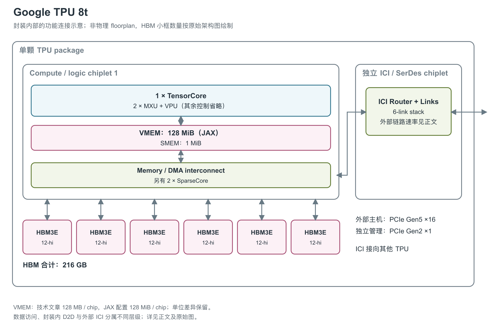

# Google TPU 8t：围绕训练的数据供给与矩阵计算

TPU 8t 是 Google 第八代 TPU 中面向 pretraining 的产品。它把矩阵计算、向量处理、embedding 访问和跨芯片通信安排在不同路径上，官方介绍特别强调低精度计算与数据供给之间的配合。[1, TPU 8t: The pre-training powerhouse]

图：依据官方 Figure 1 重绘。图示 logic chiplet 连接独立 ICI（芯片间互联）/SerDes（高速串并转换收发电路）chiplet，并连接六个 12-hi HBM3E stack。这里保留的是原图展示的 TensorCore（TPU 的矩阵、向量与标量计算核心）结构块与两个 SparseCore（稀疏访问计算核心）；JAX 数值计算框架的 8t 配置进一步列出一个物理 TensorCore、每核心两个 MXU（矩阵乘法单元），因此图中计数有图示和开发配置两种依据；矩阵电路的全部使能细节仍未展开。[1, Figure 1] [21, ChipVersion.num_physical_tensor_cores_per_chip and TPU_8T branch]

## 从 TensorCore 到 SparseCore

官方 TensorCore 结构块中，两个 MXU 分列在 VPU（向量处理单元）/Vmem（向量暂存存储器）两侧，并配有 TCS、XLU 等控制或辅助方框。MXU 执行矩阵运算，VPU 对应向量处理；原文没有完整展开 TCS 与 XLU 的职责，本图将它们收在计算核心内部，避免形成无法解释的缩写清单。[1, Figure 1 and The SparseCore advantage]

Google 强调 VPU 与 MXU 的配比能够使 quantization、softmax、layer normalization 等向量工作与矩阵乘法重叠。在训练中，即使 MXU 很快，数据量化、归一化和其他非矩阵操作仍会消耗时间，因此单看矩阵峰值不足以理解这一设计。官方同时介绍原生 FP4（4-bit 浮点）路径，称其使 MXU 吞吐翻倍，并通过减少每个参数的位数降低搬运量。该描述尚未公开 FP4 缩放、累加和舍入的完整语义。[1, VPU/MXU overlap and balanced scaling; Native FP4]

两个图示 SparseCore 负责 embedding lookup 等不规则访问，并能卸载 data-dependent all-gather。embedding 需要按运行时索引取数，all-gather 则把不同参与者的数据汇集起来，二者都可能干扰矩阵计算的数据供给。将它们交给专用路径，可以让 TensorCore 与部分数据准备、通信工作并行。规格表另列 LLM Decoder Engine（大语言模型 decoder 引擎），但没有说明位置、数量、算子集合与吞吐，所以本图不自行添加一个带有推测接口的 decoder 模块。[1, The SparseCore advantage; Specialized Chip Features]

### 产品峰值与开发工具里的精度路径

| 路径 | 完整单芯片的公开数据 | 出处与解释 |
|---|---|---|
| FP4 矩阵 | 12.6 PFLOPS | 技术文章直接公布；原生 FP4 使 MXU 吞吐翻倍，但未给全部累加/缩放语义 [1, Native FP4 and Peak FP4 PFLOPs] |
| BF16（16-bit Brain Float）矩阵 | 996.1 TFLOPS | JAX 8t 硬件描述的性能参数；没有与技术文章相同条件的完整对照表 [21, TPU_8T branch] |
| FP8（8-bit 浮点）矩阵 | 5,976.9 TFLOPS | JAX 开发模型，不能由它替技术文章中的 FP4 值重新定标 [21, TPU_8T branch] |
| INT8 / INT4 矩阵 | 996.1 / 11,953.8 TOPS | 来自 JAX 对应字段；整数 INT4 与浮点 FP4 分列 [21, TPU_8T branch] |
| 普通向量路径 | 程序布局为 128 lane×16 sublane | 每个 32-bit 程序向量含 2,048 个元素；绝对 VPU FLOPs、标量峰值及复杂函数吞吐未公开 [21, TPU_8T branch] |

这些 JAX 数字是该版本的静态硬件描述，未附工作频率、输入形状或测量条件，不能视为对 12.6 PFLOPS FP4 宣传值的实测验证。源码的原生类型检查列出 FP32/BF16 与部分 FP8 E4M3FN/E5M2 的组合，也允许部分低精度整数右操作数，同时明确留有“继续补充类型”的注释。这说明当前支持列表尚不完整，不能以某格式未列入该函数来否定官方公布的原生 FP4。[21, is_matmul_supported / TPU_8T branch]

JAX 还列每核心两个 MXU、MXU column size 为 256；它没有给出可用来重画完整 FP4 物理阵列的全部细节。其累加缓冲数量字段标为 256，并带有“Need to confirm”注释，因此本介绍将这一项保留为开发代码中的待确认描述，不写进架构图或确定规格表。[21, TPU_8T branch]

## 六个 HBM3E stack 供给计算逻辑

图中的六个 HBM3E stack 对应六个控制器，原图标为 12-hi；芯片总 HBM 容量为 216 GB，带宽为 6,528 GB/s。大规模模型参数和中间数据存放于 HBM，Memory and DMA Interconnect 连接 HBM 控制器、TensorCore、SparseCore 以及外部接口。DMA 是直接存储器访问机制，它承担搬运工作，而非矩阵算力本身。[1, Figure 1; TPU 8t and TPU 8i at a glance]

Vmem 总量是 128 MB/芯片，原图将其与 VPU 放在同一个模块中。JAX 的 8t 专属分支使用 128 MiB/TensorCore，Pallas 的 VMEM 编程模型由程序/编译器安排分块与搬运；这比仅称“片上 SRAM”更具体，但仍未公开 bank 划分和绝对访问带宽。技术文章的 MB 与开发配置的 MiB 不能静默互换，也没有证据可将其称为 L2 cache。[1, Figure 1; On-Chip SRAM (Vmem)] [21, TPU_8T branch] [22, BlockSpecs and grid iteration]

| 图中资源 | 官方单芯片数值 | 解释 |
|---|---|---|
| MXU 低精度路径 | 12.6 PFLOPS FP4 | PFLOPS 为每秒千万亿次浮点运算；稠密/稀疏、累加与计数条件未完整公开 [1, Peak FP4 PFLOPs] |
| 片上 Vmem | 128 MB | 芯片总量，不能据图自行分配到 bank 或单个单元 [1, On-Chip SRAM (Vmem)] |
| HBM3E | 6 stack，216 GB，6,528 GB/s | HBM 带宽没有给持续有效负载条件 [1, Figure 1; HBM Capacity and HBM Bandwidth] |

### 片上工作存储和 SparseCore 的访问粒度

| 存储或计算近端资源 | 已公开容量/组织 | 数据路径说明 |
|---|---|---|
| TensorCore VMEM | 开发配置 128 MiB；技术文章 128 MB | 单 TensorCore/整颗芯片；软件管理，物理 bank 与绝对带宽未给出 [21, TPU_8T branch] [1, On-Chip SRAM (Vmem)] |
| TensorCore SMEM（标量存储器） | 1 MiB | 标量索引与控制数据，区别于主向量工作区 [21, TPU_8T branch] [22, Placing operands in SMEM] |
| TensorCore 程序向量 | 16×128 个 32-bit 元素，数据量 8 KiB | 按 JAX 数据布局计算；不把它当作已证实的所有指令/所有精度的物理端口宽度 [21, TPU_8T branch] |
| SparseCore | 2 SC，每 SC 16 vector subcore，每 subcore 16 lane | 软件配置与原图两个 SparseCore 对应；没有给出绝对 FLOPs/秒 [21, TPU_8T branch] [1, Figure 1] |
| SparseCore tile VMEM | 256 KiB/subcore | 每 SC 分散局部空间合计 4 MiB，两个 SC 合计 8 MiB；不能视为统一 TensorCore VMEM [21, TPU_8T branch] |
| SparseCore DMA | 64 B 传输粒度 | 对应 JAX 8t 分支；不是 bank 宽度或请求延迟 [21, TPU_8T branch] |
| HBM 路径 | 技术文章 6,528 GB/s；JAX 模型 6,400 GB/s | JAX 的容量字段为 231×10⁹ B，技术文章为 216 GB；两者口径/单位差异未解释 [1, HBM Capacity and HBM Bandwidth] [21, TPU_8T branch] |

8t 对 SRAM、HBM 与通信的重叠安排，有助于理解其强调的“VPU 与 MXU 配比”：quantization、softmax 与 layernorm 会占用向量执行路径和工作存储，矩阵峰值提高后，这些阶段仍必须及时供数。现有开发资料能够补出各工作区和 SparseCore 数据粒度，但仍不足以列出每层 SRAM 的持续读写带宽或访问延迟。[1, VPU/MXU overlap and balanced scaling] [21, TPU_8T branch]

## ICI、主机与存储访问各走什么路径

封装中有独立 ICI/SerDes chiplet，包含 router、六组 link stack 和原图标注的 6×224G SerDes octals。SerDes 是高速串并转换收发电路；由于原图没有解释 lane、octal、编码与方向的完整关系，不能简单相乘得到一个确定的芯片注入带宽。技术文章给出 ICI scale-up 带宽相对上一代为两倍；发布规格图另直接列出每芯片双向 19.2 Tb/s（2,400 GB/s），这里采用官方整芯片值，不由 SerDes 标签反推。[2, TPU 8t 规格图] 封装内逻辑 die 与 ICI die 之间的连接也没有公布协议及绝对速率。[1, Figure 1; TPU 8t: The pre-training powerhouse]

主机接口为 PCIe Gen5 x16，另有连接 gBMC（板级管理控制器）的 PCIe Gen2 x1 管理通道。TPUDirect RDMA（远程直接存储器访问）可在 TPU HBM（高带宽堆叠内存）与 NIC（网络接口卡）之间传输数据，绕过 host CPU 与 DRAM；TPUDirect Storage 则提供绕过 host 的存储访问路径。这些机制描述数据如何直达设备，不代表主机、TPU、NIC 之间形成了自动一致的统一内存。[1, Figure 1; Faster storage access; Figure 3]

系统内部采用 3D torus，一个 Superpod 可含 9,600 颗 TPU 8t。更大的部署依靠外部 Virgo 网络，其扁平两层、多 plane 架构属于 scale-out fabric；NIC、交换机、Axion host 和存储都在单颗 TPU 之外。已有技术资料未公开芯片工艺、面积、频率、绝对功耗、散热规格及 Vmem 的物理 bank、端口与带宽细节，因此现阶段可以解释功能组织，不能据此建立完整的物理实现或功耗模型。[1, TPU 8t: The pre-training powerhouse; Virgo Network topology; Figures 1-3]

## 参考资料

[1] Diwakar Gupta、Sabastian Mugazambi，*TPU 8t and TPU 8i technical deep dive* / 正文标题 *Inside the eighth-generation TPU: An architecture deep dive*，Google Cloud，页面显示日期为 2026-04-23（网页元数据为 4 月 22 日）。[官方网页](https://cloud.google.com/blog/products/compute/tpu-8t-and-tpu-8i-technical-deep-dive)；[本地快照](../../../前置调研/原文/网页快照/S14_tpu8t_tpu8i.html)

[2] Amin Vahdat，*Our eighth generation TPUs: two chips for the agentic era*，Google，2026-04-22。[官方文章](https://blog.google/innovation-and-ai/infrastructure-and-cloud/google-cloud/eighth-generation-tpu-agentic-era/)；[TPU 8t 官方规格图](https://storage.googleapis.com/gweb-uniblog-publish-prod/images/TPU_8_Cloud_inline_1.width-1200.format-webp.webp)

[21] The JAX Authors，*TPU hardware information*，`jax/_src/tpu_info.py`，获取于 2026-09-17。[官方源码](https://github.com/jax-ml/jax/blob/main/jax/_src/tpu_info.py)；[TPU Hardware Reference](https://docs.jax.dev/en/latest/pallas/tpu/hardware.html)。数值引用对应产品分支；该表是开发工具的硬件描述，`0 / Not Available` 不作为物理资源不存在的证据。 [本地原文快照](../../原始资料/网页快照/Google/JAX/2026-09-17/jax-info-source.py)

[22] The JAX Authors，*Pallas: TPU Details*，获取于 2026-09-17。[官方文档](https://docs.jax.dev/en/latest/pallas/tpu/details.html)；[官方仓库原文](https://github.com/jax-ml/jax/blob/main/docs/pallas/tpu/details.rst)。 [本地原文快照](../../原始资料/网页快照/Google/JAX/2026-09-17/jax-details.rst)
