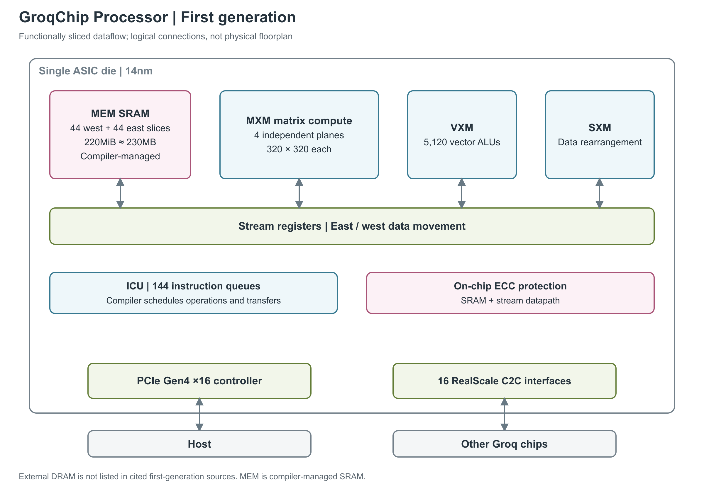

# Groq GroqChip Processor（第一代）

图：第一代 GroqChip 的功能连接示意。蓝色是矩阵、向量、重排和指令控制单元，粉色是 SRAM（静态随机存取存储器）与数据保护，绿色是数据传输接口；连线表示数据可以在切片间流动，不代表实际布局或唯一必经路径。图中的 14nm、44+44 个 MEM 切片、4 个 320×320 MXM 平面、5,120 个 vector ALU（向量算术逻辑单元）、144 个指令队列与 stream datapath 来自论文；230MB、PCIe Gen4 ×16 和 16 个 RealScale C2C（chip-to-chip，芯片间）接口来自产品简报。图中的 ECC（纠错码）覆盖 SRAM 和 stream datapath（流式数据通路），现有规格没有列出外部 HBM、GDDR 或 DDR。[1, pp.1, 3-6, 8, 12, Figs.4-5] [2, pp.1-2]

第一代 GroqChip 把神经网络计算组织成由编译器安排时序的数据流水线。论文称其为 TSP（Tensor Streaming Processor，张量流处理器），产品简报采用 LPU（Language Processing Unit，语言处理单元）这一架构名称；官方架构说明也明确提到 first-generation GroqChip。本文讨论这颗芯片的计算、存储和接口，GroqCard 与 GroqRack 只在说明产品形态时出现。[1, Abstract、§VII] [2, p.1] [3, Software First]

下文对论文 [1] 的引用使用 PDF 页序；PDF 第 1 页对应印刷页 145，例如 `[1, p.6]` 对应印刷页 150。论文中的说明性 1GHz 工作点与 v1.7 简报的 900MHz 产品规格分开记录。[1, p.1 页脚、p.6 §II-B] [2, p.2, Performance]

## 功能切片怎样组成流水线

GroqChip 沿功能划分硬件：MEM 存取数据，MXM 执行矩阵乘累加，VXM 做逐元素算术，SXM 调整元素位置，ICU 负责指令获取与派发，C2C 负责跨芯片传输。执行向量操作的功能切片纵向由 20 个 tile（基本硬件块）组成，每个 tile 处理 16 条 lane；同一横行跨过不同功能切片，构成一条 superlane。于是最小计算粒度是 16 个元素，完整向量覆盖 320 个元素。这里的 lane 表示并行处理的数据位置。[1, pp.2-4, §I-A/B、§II、Fig.5]

一条典型数据流是从 MEM 读出权重和输入，让 MXM 计算，再把结果直接交给 VXM 做 requantization（重新量化）和 ReLU 激活，最后写回 MEM。功能单元之间可以沿 stream（携带向量元素的数据流）串接，省去部分中间结果的一次写回和一次重读。论文中的 ResNet50 实现采用了这种组织；持续利用率还取决于各层的形状和操作链深度。[1, p.5, Table I 后段；p.9, §IV；p.10, §IV-B/C]

这套流水线同时具有两个方向的时序。数据沿水平方向向东或向西移动，指令从 ICU 向北经过各个 tile。一个 320 元素指令先在底部处理首个 16 元素 superlane，下一周期处理上方的 superlane，逐步遍历全部 20 个 tile。输入向量也要按相同节拍错开到达。这 20 级纵向流水描述一条向量指令经过各 tile 的过程；总时间还需计入具体指令的功能延迟和数据传输时间。[1, p.2, §I-A；p.6, §II-C、Fig.6；p.7, §III、Eq.4]

## MXM：矩阵、权重装载与累加

MXM（Matrix Execution Module，矩阵执行模块）有 4 个独立的 320×320 MACC 平面，MACC 指乘累加单元。阵列由 16×16 的 supercell 组织，局部部分和逐周期传向相邻 tile。权重先安装到阵列，输入 activation（激活值）从阵列侧边进入，INT32 或 FP32 结果从靠近芯片内部的一侧流出；输出 stream 上的累加器还可以累加这些结果。[1, p.8, §III-D、Fig.7；p.9, §III-D 续]

装载权重与发起计算有不同指令。`LW` 把 stream 数据读入 weight buffer，`IW` 从 stream 或该 buffer 安装阵列权重，`ABC` 控制 activation buffer 并协调输入到达，`ACC` 累加 MXM 输出。论文给出的局部装载粒度是每个 supercell 每周期接收 16 条 stream、每条 16 byte，即安装 256 个 INT8 权重。利用两侧各方向的 32 条 stream，可以并行向全部平面装入 409,600 个权重；论文报告小于 40 cycles，包含 SRAM 访问和片内传输时间。这里的权重数和周期数针对一次阵列装载，SRAM 容量及单次存储访问另有各自的定义。[1, p.3, §II；p.5, Table I；p.8, §III-D；p.11, §V-b]

| 路径或阶段 | 原文公开的格式与行为 | 来源与条件 |
|---|---|---|
| 整数矩阵路径 | INT8 输入，INT32 累加；权重安装后可逐周期生成新的 INT32 dot product（点积） | [1, p.8, §III-D；p.10, §IV-D] |
| 浮点矩阵路径 | FP16 输入，FP32 累加；两个 320×320 byte-plane 配合支持 FP16 | [1, p.9, §III-D；p.10, §IV-D] |
| 点积结果形成 | 每个输出的 320 项求和完成后，只在末尾做一次舍入，形成 INT32 或 FP32 结果 | [1, p.9, §III-D]；没有公开具体舍入模式或内部物理累加器总位宽 |
| 后续重新量化 | VXM 可把 MXM 的 INT32/FP32 结果转换回 INT8/FP16；论文称其 FP32 路径可以跟上 4 个 MXM 平面的输出速率 | [1, p.10, §IV-D]；是该流水线的匹配关系，不是独立的 VXM 峰值规格 |
| 产品数值字段 | v1.7 列出 INT8、INT16、INT32、TruePoint，另标 `MXM: FP32`、`VXM: FP16, FP32` | [2, p.2, Numerics]；这张简表没有把各格式逐项对应到输入、乘积或累加阶段，不能由 `MXM: FP32` 反推原生 FP32×FP32 乘法阵列 |

公开精度路径要与产品峰值一起阅读。v1.7 在 900MHz 下标称最高 750TOPS INT8、188TFLOPS FP16；TOPS/TFLOPS 分别指每秒万亿次整数/浮点运算。论文结论另给 1GHz 时 820 TeraOps/s。两份资料没有提供足以完整重建产品峰值的逐指令计数口径，因此保留各自频率和原报值，不把阵列数量直接换成额外的产品规格。论文明确没有采用基于 pruning/sparsity（剪枝/稀疏性）的优化，不能再给这些峰值乘一个稀疏倍率。[2, p.2, Performance] [1, p.12, §VI、§VII]

TruePoint 在产品简报中只有技术名称；本次材料没有说明它的缩放粒度、全部舍入模式、subnormal（非规格化数）处理或 NaN/Inf 行为。MXM weight buffer、activation buffer 和输出累加器的存在可以由指令表及框图确认，但其独立容量、端口数和访问延迟没有列出。[2, p.2, Numerics] [1, p.5, Table I；pp.8-9, §III-D、Fig.7]

## VXM 与 SXM：算术和重排各做什么

VXM（Vector Execution Module，向量执行模块）在每条 lane 上安排 4×4 的 ALU 网格，也就是每条 lane 16 个 ALU、全芯片 5,120 个 ALU。论文描述其支持 32-bit 定点和浮点运算，32-bit 输入沿 4 条自然对齐的 stream 组成的 SG4 传入。ALU 不保留上条指令的条件码或状态标志；整数加法和乘法均提供饱和与模运算版本，用显式指令选择溢出处理方式。[1, p.8, §III-C；p.12, §VII]

| VXM 功能 | 指令或使用方式 | 已公开的边界 |
|---|---|---|
| 逐元素运算 | 单输入 mask、negate；双输入 add、mul、sub；定点与浮点类型转换 | [1, p.5, Table I]；未给出所有操作的逐周期吞吐和延迟 |
| 激活与特殊函数 | ReLU、TanH、Exp、RSqrt（倒数平方根） | [1, p.5, Table I]；没有单列专用特殊函数单元数量、近似误差或吞吐 |
| lane 内串接 | 多个 ALU 顺次处理同一数据，中间结果不必写回 MEM；可用于 batch normalization、量化、leaky ReLU 等 | [1, p.8, §III-C]；操作链深度会影响持续吞吐，论文记录过 VXM 无法完全跟上矩阵输出的局部情况 [1, p.10, §IV-B] |

论文把控制工作放在 ICU，把上述算术放在 VXM/MXM，没有另列通用 scalar core（标量核）的数量、寄存器文件或独立吞吐。不能把 144 个指令队列看成 144 个 scalar core，也不能按 5,120 个 ALU 的数量直接宣布所有向量指令都有同一峰值。[1, pp.3-5, §II、Table I；p.8, §III-A/C]

SXM（Switch Execution Module，交换执行模块）负责跨 lane 的数据位置变化。MEM 和 stream registers 构成水平方向的数据通路，SXM 提供南北方向的移动；论文将组合路由描述为 X-Y-X。芯片东西两侧各有一个 SXM。这些功能用于完成 tensor reshape（张量重排）。[1, p.2, §I-B；p.9, §III-E、Fig.8]

| SXM 操作 | 粒度与行为 | 来源 |
|---|---|---|
| Shift / Select | 两组 lane shifter 分别向北和向南移动；选择移位或未移位的元素形成结果 | [1, p.9, §III-E、Fig.8] |
| Permute | 按预先给定的双射映射重排 320 条 lane | [1, p.5, Table I；p.9, §III-E] |
| Distribute | 在一个 16-lane superlane 内重排、复制或补零；论文称可按完整 stream 带宽工作 | [1, p.5, Table I；p.9, §III-E]；未另给 byte/s 或操作延迟 |
| Rotate | 对 n×n 输入产生包含全部旋转情况的 n² 条输出 stream，n 为 3 或 4 | [1, p.5, Table I] |
| Transpose | 16 条输入 stream 各取 16 元素，交换 16×16 元素的行列，再产生 16 条输出 stream；每个 SXM 可发射两条 transpose 指令，全片最多四个并行 transpose 操作 | [1, p.9, §III-E]；这里的“四个并行”不是一周期完成四次全向量转置的延迟承诺 |

## SRAM：容量、分片与双 bank 访问

MEM 形成分区但全局可寻址的 SRAM 空间，由编译器安排张量和程序文本的位置。220MiB 对应这颗芯片的主要数据存储空间，由软件直接管理。论文还明确说明，计算单元之间没有依赖传统局部寄存器文件或通信 FIFO（先进先出队列），而是通过整片 streaming registers 传递结果；这不否认 MXM 中另有特定用途的权重和 activation buffer。[1, pp.5-6, §II-B；p.8, §III-B；p.9, §IV；p.12, §VI；p.5, Table I]

| 存储层级 | 容量与组织 | 读写含义 |
|---|---|---|
| 全片 MEM | 88 个切片，共 220MiB；v1.7 产品简报写 230MB | 由编译器显式管理的共享 SRAM，权重、activation 和程序文本共同占用 [1, pp.5-6, §II-B；p.9, §IV] [2, p.2, Memory] |
| 东/西半区 | 每侧 44 个 MEM 切片；编号 0 至 43，MEM0 最靠近 VXM，MEM43 最靠近 SXM | 地址所在切片影响到消费者的传输距离 [1, p.5, §II-B；p.4, Fig.4；p.11, §V-b] |
| 单个 MEM 切片 | 20 个纵向 tile，共 2.5MiB | 各 tile 共同构成 320-byte 向量，执行时按 superlane 错开 [1, pp.5-6, §II-B/C] |
| 单 tile 的寻址容量 | 原文给出 13-bit 物理字地址、每字 16 byte；按此计算为 2¹³×16 byte=128KiB | 这是由地址宽度计算的值，与 2.5MiB÷20 相符；不是另一个独立缓存容量 [1, p.4, §II 的 MEM 描述；p.5, §II-B] |
| SRAM bank / 端口 | 每切片 2 个 bank，pseudo-dual-port SRAM（伪双端口 SRAM），全片最高 176 路 bank 并发 | 一读一写可同时服务，前提是落到不同 bank；bank 选择位对编译器可见，不等价于同一 bank 任意双端口访问 [1, p.8, §III-B；pp.9-10, §IV-A] |
| 物理访问粒度 | 一个 SRAM word 为 16 byte，分别对应 superlane 的 16 条 lane；完整架构向量为 320 byte | 16-byte 字粒度与 320-byte 向量操作属于不同层级 [1, p.6, §II-B；p.7, §II-F] |

容量的两种写法基本相容：220MiB 按二进制单位换算为 230.68672MB，产品的 230MB 是接近的十进制标称值。这只是近似对应，不能将两个数字写成精确等号。编译器还会预留若干 MEM 切片存程序指令，因而全部 SRAM 容量不等于模型权重的独占可用空间。[1, pp.5-6, §II-B；p.9, §IV] [2, p.2, Memory；前述 MB 数值为单位换算]

直接 `Read`/`Write` 的地址由指令给出；`Gather`/`Scatter` 则用另一条 stream 提供的 address map（地址映射）完成间接访问。要让多条输入流并发，编译器将张量分配到不同 MEM 切片。论文的 transpose 例子从 16 个切片读入 16 条 stream，再把转置结果写回；同一切片可以从一个 bank 读旧输入，并向另一个 bank 写新结果。[1, p.8, §III-B；pp.9-10, §IV-A、Listing 2]

存储位置和 bank 使用必须与后续计算一起排程。论文记录，调整输入输出的切片分配并交错使用 bank 后，下一条流水线能够在上一条尚未完全写回时开始读取，减少流水线填充和排空造成的空闲。这个例子也说明，即使省去了 cache，存储切片争用仍需要靠数据分配解决。[1, p.10, §IV-C]

## Stream registers 与带宽口径

stream registers 是编译器可见的流式寄存器通路。每条 lane 有 64 条逻辑 stream，向东和向西各 32 条，每条 stream 在每条 lane 上携带 1 byte。INT16 使用成对 stream，INT32/FP32 使用自然对齐的四条 stream；完整的单 byte-stream 覆盖 320 条 lane，形成 320-byte 向量。仅按这些逻辑通道计算，64×320 byte=20KiB 是一组流的逻辑数据宽度，不是全芯片物理 streaming-register 容量；沿途有多个寄存器位置，论文没有汇总其物理容量。[1, pp.2-3, §I-B、§II；p.4, Fig.4；20KiB 为通道数量计算]

每个核心周期，数据沿指定方向推进一个 stream-register hop（寄存器间跳步）。功能切片可以读取经过的值，也可以把自己的结果覆盖到某条 stream 上，并选择结果向哪个方向继续。硬件不为每个值跟踪起点和终点；如果没有被使用或覆盖，它会继续流向芯片边缘。因此，消费者什么时候读取、经过多少跳才能抵达，都必须由编译器安排。已查材料没有给出可单独引用的 SRAM 首字读取延迟或完整寄存器文件的读写端口表。[1, p.5, §II-A；p.7, §II-E、§III；p.11, §V-c]

论文用 1GHz 演示 SRAM、stream 和取指的带宽关系。以下“论文原报”保留原文单位；“按公式复算”明确按 1GHz=10⁹ cycles/s、1TB=10¹² byte、1TiB=2⁴⁰ byte 计算，没有把复算值改称芯片实测带宽。[1, p.6, §II-B、Eqs.1-2 及其后取指段落]

| 带宽层级 | 原文公式或边界 | 论文原报 @说明性 1GHz | 按原式 byte/cycle 严格复算 |
|---|---|---:|---:|
| 单个 MEM 半区的 stream 接口 | 2 个方向×32 byte/lane×320 lanes；操作数读出与结果写入合计 | 20TiB/s | 20,480 byte/cycle，即 20.48TB/s，约 18.63TiB/s |
| 全片 SRAM bank 合计 | 2 个半区×44 slices/半区×2 banks/slice×320 byte/cycle | 55TiB/s；每半区 27.5TiB/s | 全片 56,320 byte/cycle，即 56.32TB/s，约 51.22TiB/s |
| 最大取指流量 | 144×16 byte/cycle，取指同样占用 SRAM 带宽 | 2.25TiB/s | 2,304 byte/cycle，即 2.304TB/s，约 2.095TiB/s |

原文的 TiB/s 标签与其 1GHz 假设下的严格单位计算并不一致，这个差别需要保留，不能把复算值与原报值混着使用。即使只按原报的 55TiB/s 换算，它也约为 60.47TB/s，仍不是 v1.7 简报的“最高 80TB/s”。简报未展开 80TB/s 的端口组成、读写合计规则或持续访问条件，无法仅靠单位、频率或现有 bank 描述消除两份资料的差别。[1, p.6, §II-B、Eqs.1-2；本表及 60.47TB/s 为计算值] [2, pp.1-2, Memory]

论文对带宽余量的解释是：SRAM 内部除了服务流向计算单元的操作数和返回结果，还要供应取指，所以 SRAM bank 合计带宽高于外露的 stream 带宽。这三种流量不能相加成一个“芯片总内存带宽”，也不能把双向 stream 合计值当作单向读取带宽。[1, p.6, §II-B]

## ICU：指令队列和可预排的时序

ICU（Instruction Control Unit，指令控制单元）共有 144 个独立指令队列（IQ），各自按编译器规定的顺序派发。论文称每个队列每周期可以发射一条或多条指令，但没有给出统一的最大多发射宽度。取指、译码和派发从运算 tile 中独立出来后，ICU 在这版实现中占不到 3% 的芯片面积。这些队列分别控制功能切片的执行顺序。[1, pp.2-3, §I-A、§II]

| 控制机制 | 公开行为和数量 | 对执行的意义 |
|---|---|---|
| `Ifetch` | 一次从 stream 取入 640 byte 指令文本，即两个 320-byte 向量；取指可与正常指令执行并行 | 编译器插入预取以保证队列不会耗空；640 byte 是一次填充量，论文未把它明确列为整个 IQ 的物理容量 [1, p.8, §III-A3] |
| `Sync` / `Notify` | 一个队列发送 Notify，其余参与队列等待 Sync；从 Notify 发出到 Sync 完成的全片 barrier 需要 35 cycles | 理论上复位后同步一次即可；实际程序在配置 tile 后先同步，再按共同逻辑时间运行 [1, p.8, §III-A2] |
| 重复 `NOP` | 16-bit 重复计数字段；论文在 1GHz 下给出约 1ns 至 65μs 的等待范围 | 编译器用它控制相邻指令间隔；连续空闲超过几个周期时可以关闭相应 clock enable [1, pp.7-8, §III-A1] |
| `Repeat n,d` / `Config` | 前者重复上一条指令并指定迭代间隔，后者配置低功耗模式 | 配合编译器时序和 tile 使用范围；资料未给出全部参数编码及模式功耗 [1, p.5, Table I；p.7, §II-F] |

ISA（Instruction Set Architecture，指令集架构）还暴露 `d_func` 和 `d_skew`：前者描述指令功能延迟，后者描述派发与操作数到达之间的偏移。论文的时间关系是 `T=N+d_func+δ(j,i)`，N 为切片内 tile 数，δ(j,i) 为生产者和消费者之间的 stream 传输周期数。编译器据此同时安排数据所在位置与使用时刻，维持各切片共同的逻辑时间。[1, p.7, §III、Eq.4；p.8, §III-A3]

## PCIe 与芯片间互联

主机通过集成的 PCIe Gen4 ×16 控制器连接 GroqChip。论文中的 C2C/I/O 模块含轻量 DMA（Direct Memory Access，直接内存访问）引擎，用于把模型送入 TSP 内存并启动执行，也能向主机报告中断，例如遇到多比特内存错误。现有材料没有给出这条 DMA 的独立引擎数、描述符组织、持续有效带宽或端到端延迟。[2, p.2, I/O] [1, pp.4-5, §II 的 C2C 描述]

| C2C 层级 | 原始规格或计算值 | 方向和协议条件 |
|---|---|---|
| 芯片互联端点 | 16 个 RealScale C2C 接口；论文实现为 16 条 ×4 链路，每 lane 30Gbps | [2, p.2, Chip Scaling] [1, pp.4-5, §II] |
| 单条 ×4 链路线速 | 4×30Gbps=120Gbps=15GB/s | 由原文链路宽度计算，单方向原始引脚速率，未扣协议开销 [1, pp.4-5, §II] |
| 全片 C2C 引脚合计 | 单方向计算为 1.92Tb/s=240GB/s；双方向原文给 3.84Tb/s，折合 480GB/s | 全部端点相加；双向收发合计不是任一方向可独占的带宽，也不是应用有效载荷吞吐 [1, p.5, §II 的带宽公式] |
| 数据传输指令 | `Send` 发送 320-byte 向量，`Receive` 接收后放入主存储；`Deskew` 管理近同频链路间的偏斜 | [1, p.5, Table I]；未报告单跳有效载荷延迟、缓冲深度或拥塞吞吐 |

产品简报称这些端点可以直接连接其他芯片，不必额外加入交换机、卡或 CPU。论文说明端点可分组构建高 radix（较多连接端口）的网络，但这些材料没有固定某套 GroqRack 拓扑、集群规模或集合通信引擎。单芯片 SRAM 带宽也不会自动成为多芯片共享内存带宽，跨芯片的数据必须通过这里的 C2C 通路传输。[2, p.1, 16 chip-to-chip interconnects] [1, pp.4-5, §II、Table I]

## ECC、低功耗与物理实现

数据保护随流水线移动。每个 128-bit SRAM word 配 9-bit ECC，合计 137 bit，采用 SECDED（单比特纠错、双比特检错）。校验位在生产者处生成并和数据一起存储、沿 stream datapath 传送，消费者使用前再检查；这样覆盖 SRAM 与 streaming registers 的软错误。论文还说明操作数或指令文本上的可纠正软错误会自动修正，并登记到 CSR（Control and Status Register，控制状态寄存器）供错误处理程序查询。它没有列出整套重放、坏行替换或芯片失效后的恢复机制。[1, p.6, §II-D] [2, p.1, End-to-end on-chip protection]

低功耗控制与实际向量长度相联系。向量长度可按 16-lane 步长从 16 增至 320 元素，未使用的 superlane tile 可以配置为低功耗状态；重复 NOP 期间也能关闭 clock enable。论文没有提供这些模式各自节约的瓦数、状态切换延迟或电压条件，不能从功能描述推算固定的节能比例。[1, p.7, §II-F；pp.7-8, §III-A1]

| 物理或功耗项目 | 公开值 | 适用边界 |
|---|---|---|
| 工艺、尺寸、晶体管 | 14nm；裸片 25×29mm；268 亿晶体管 | [1, p.1, Abstract；p.12, §VII]；尺寸是 die 边长，不是封装或板卡尺寸 |
| 标称产品频率 | 900MHz | [1, p.1, Abstract] [2, p.2, Performance]；未列出 base/boost 档位或电压表 |
| 芯片功耗 | 最大 300W；TDP（热设计功耗）215W；平均 185W | [2, p.2, Power]；简报未说明平均值的负载、温度和统计区间，应分别按最大、热设计和平均功耗理解 |
| 封装与散热 | 已查材料未给出封装结构、封装尺寸或芯片独立散热方案 | [1, p.12, §VII] 提到 PCIe CEM 形态，该描述属于卡形态；[2, p.2] 为处理器规格，不能补入 GroqCard 的板卡参数 |

论文的逐层功耗图把尖峰与多个卷积同时占满算术资源联系起来，说明功耗随实际调度变化；图中纵轴采用相对功耗的百分比刻度，也未给出完整测量环境，本文不据此还原绝对瓦数。[1, p.9, §IV；p.11, Fig.10]

2020 年论文披露第一代 TSP；2022 年 v1.5 简报标注已投产，并在介绍中称其为可灵活集成的 standalone chip。2024 年 v1.7 则把可用形态写成 GroqRack 计算集群的一部分；2025 年合作公告继续列出 GroqRack 本地部署方案。这些是各版本材料当时的产品形态，不能据此确认今天仍可独立零售，也不能把机柜参数写成芯片规格。[1, p.1, publication；p.12, §VII] [4, p.1 介绍、p.2 Availability] [2, p.2, Availability] [5, 正文第 3 段“Under the collaboration”]

## 参考资料

[1] Abts et al.，*Think Fast: A Tensor Streaming Processor (TSP) for Accelerating Deep Learning Workloads*，ISCA 2020，印刷页 145-158；正文引用采用 PDF 页序。[本地 PDF](../../原始资料/论文/Groq_LPU/01_厂商直接架构论文/2020_Groq_Think_Fast_Tensor_Streaming_Processor_ISCA.pdf)

[2] Groq，*GroqChip Processor Product Brief v1.7*，2024。[本地 PDF](../../原始资料/论文/Groq_LPU/90_官方白皮书与技术资料/2024_GroqChip_Processor_Product_Brief_v1.7.pdf)

[3] Groq，*What Is a Language Processing Unit?*，2025-03-07。[官方说明](https://groq.com/blog/the-groq-lpu-explained) [本地原文](../../原始资料/网页快照/Groq/GroqChip/2026-09-17/lpu-explained.html)

[4] Groq，*GroqChip Processor Product Brief v1.5*，2022。[官方 PDF](https://www.groq.com/GroqDocs/Product%20Spec%20Sheet%20-%20GroqChip%E2%84%A2%20Processor.pdf) [本地原文](../../原始资料/论文/Groq_LPU/90_官方白皮书与技术资料/2022_GroqChip_Processor_Product_Brief_v1.5.pdf)

[5] Groq，*Groq Partners with Aljammaz Technologies to Power AI Inference Across MENA*，2025-10-17。[官方公告](https://groq.com/newsroom/groq-partners-with-aljammaz-technologies-to-power-ai-inference-across-mena) [本地原文](../../原始资料/网页快照/Groq/GroqChip/2026-09-17/aljammaz-announcement.html)
