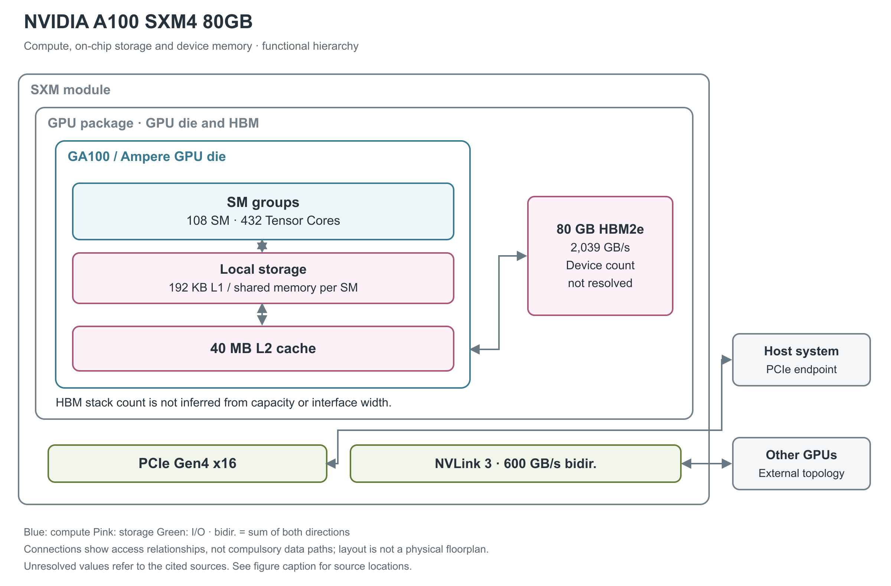

# NVIDIA A100 SXM4 80GB

A100 SXM4 80GB 是 Ampere 架构的数据中心 GPU 模组，兼顾训练、推理与高性能计算。它把一个 GA100 GPU 与 HBM2e（高带宽堆叠内存） 组合，再通过 SXM4 服务器底板接入主机和其他 GPU。[1, pp.1-2；2, pp.14-20]

图 1：A100 启用的计算资源、局部存储、40 MB L2 与 80 GB HBM2e。当前 80GB 数据手册未重述每个 HBM stack 的具体组织，因此图用总容量框，不把早期 40GB 版本的堆叠细节直接搬过来。[1, p.1；2, pp.19,22,35-36,52-54]

## 一个 GA100 裸片承载哪些计算资源

A100 启用 108 个 SM（流式多处理器），组织为 54 个 TPC（Texture Processing Cluster，纹理处理簇）、7 个 GPC（Graphics Processing Cluster，图形处理簇）。每 SM 有 64 个 FP32 CUDA Core 和 4 个第三代 Tensor Core，整颗 GPU 分别为 6,912 个和 432 个；还有 3,456 个非 Tensor FP64 单元及 6,912 个 INT32 单元。官方 80GB SXM 测试环境也明确给出 108 SM，不能把完整 GA100 的 128 SM 当作本产品配置。[2, pp.19-22,36；6, §4.3, Figure 4]

GA100 为 TSMC 7nm N7 工艺，面积 826 mm²、晶体管数 542 亿。GPU 是单个计算裸片；NVLink 面向模组外 GPU 连接，因此图中没有双计算裸片间的 D2D 互联。[2, pp.14-15,19-20]

## SM 内的发射与矩阵单元

每个 SM 分为四个处理分区，每分区带独立 warp scheduler（warp 调度器，每 warp 含 32 个线程）、dispatch unit、L0 instruction cache 和 16,384×32-bit 寄存器文件；SM 上方还有共享的 L1 instruction cache。这里的 instruction cache 存指令，不能与下方 192 KB 的数据 L1/shared memory 混为一层。公开框图还列出每 SM 的 32 个 LD/ST（load/store，读写）单元、4 个 SFU（特殊函数单元）区块和 4 个纹理单元，但没有给出指令 cache 容量、寄存器 bank/端口数或寄存器整体读写带宽。[2, p.22, Figure 7；2, p.36, Table 4]

第三代 Tensor Core 的一个明确基准是 FP16 乘、FP32 累加：每 Tensor Core 每周期 256 FMA（融合乘加），四个合计 1,024 FMA/SM/clock，即 2,048 FLOP/SM/clock。这个速率描述矩阵执行阵列，不代表一条 warp 级 `mma` 指令在一个周期完成；指令形状、依赖与并发度仍决定是否能填满流水线。[2, p.24]

## 第三代 Tensor Core 的精度范围

Ampere 在 Tensor Core 中支持 TF32、BF16、FP16、FP64、INT8、INT4 等路径。TF32 面向以 FP32 表示的数据进行矩阵计算，BF16 与 TF32 的矩阵结果采用 FP32 累加；FP16 支持混合精度累加。输入格式和累加格式共同影响数值行为，不能只看“16位”或“8位”标签。[2, pp.23-29]

下表是单 GPU 理论峰值。TFLOPS／TOPS 分别是每秒万亿次浮点／整数运算，稀疏列要求符合结构化稀疏格式。[1, p.1；2, pp.15,36]

| 运算路径 | Dense 稠密 | 结构化稀疏 |
|---|---:|---:|
| TF32 Tensor | 156 TFLOPS | 312 TFLOPS |
| FP16／BF16 Tensor | 312 TFLOPS | 624 TFLOPS |
| INT8 Tensor | 624 TOPS | 1,248 TOPS |
| INT4 Tensor | 1,248 TOPS | 2,496 TOPS |
| FP64 Tensor | 19.5 TFLOPS | 未列 |
| Binary Tensor | 4,992 TOPS | 未列；bitwise MMA 路径 [2, p.23, Table 2] |
| 普通 FP32／FP64 | 19.5／9.7 TFLOPS | 不适用 |

非 Tensor FP16 与 BF16 分别为 78、39 TFLOPS。A100 架构表的 boost 时钟为 1,410 MHz；80GB 数据手册未单独重述时钟，所以这里将它注明为 A100 实现的峰值条件，不当作任意任务的固定频率。GPU 的整个计算过程还包含访存与同步，结构化稀疏峰值并不等于应用加速比。[2, p.36]

## 普通算术、特殊函数与每周期吞吐

以下采用 CUDA 编程指南的 compute capability 8.0 列，单位是“结果数/SM/clock”，用于区分指令吞吐与 TFLOPS。一次 FMA（融合乘加）生成一个结果，按 FLOPS 计数时包含一次乘法和一次加法。表中各行属于不同或共享的执行路径，不能求和得到同时可用的总吞吐。[20, §5.4.1, Table 4]

| 原生指令类别 | 每 SM 每周期结果数 | 阅读条件 |
|---|---:|---|
| FP32 add／multiply／FMA | 64 | FMA 的运算计数为表值的两倍 |
| FP64 add／multiply／FMA | 32 | 非 Tensor 路径 |
| FP16 add／multiply／FMA | 256 | packed 16-bit 算术路径，非 Tensor |
| INT32 add／subtract；multiply／IMAD | 64；64 | 乘加和加法须分别计数 |
| FP32 reciprocal／rsqrt／log2／exp2／sin／cos | 16 | 表列原生近似指令；完整数学库函数可能展开为多条指令 |
| INT32 shift／compare／min／max／bitwise | 64 | 按相应原生指令分别读取 |
| popcount／count-leading-zeros | 16 | 位处理，不计入浮点峰值 |
| warp shuffle／warp reduce／warp vote | 32／16／64 | 吞吐单位仍为每线程结果，warp 含 32 个线程 |

A100 的 FP32 与 INT32 是分开的执行资源，独立指令可重叠，例如地址更新与当前 tile 的 FP32 计算。Tensor 的 INT8／INT4 乘积累加到 INT32；TF32 虽只有 1 个符号位、8 个指数位和 10 个小数位，仍以 32-bit 容器保存，不能按 19/32 比例缩小内存容量需求。[2, pp.27,34；22, §1.4.1.5]

## 寄存器、L1、L2 与 HBM 分别做什么

每 SM 有 256 KB 寄存器文件，以及 192 KB 合并的 L1 cache／shared memory。shared memory 最多 164 KB，供线程块显式存放需要复用的数据；L1 则由硬件缓存访问内容。异步 global-to-shared copy 可以减少经寄存器中转的搬运开销，配合计算流水安排数据供给。[2, pp.21-22,30-34,36-37]

各 SM 外侧是合计 40 MB 的 L2 cache。白皮书给出其读带宽为 5,120 bytes/clock，描述的是片上缓存每时钟周期能读取的字节数。L2 支持控制数据驻留及压缩机制；压缩能否降低流量与数据内容有关，不能把压缩相关的宣传倍数直接乘到所有程序的带宽上。[2, pp.24,35-36]

L2 分为两大分区各含 40 个 slice，每个 slice 为 512 KB；每个内存控制器对应 8 个 slice。靠近某一分区的 GPC 优先从该分区获得较低代价的访问，全 GPU 的硬件 cache coherence 保持统一 CUDA 内存模型。这里的分区是同一 GA100 内的组织，不能理解为两个计算裸片。[2, p.35, A100 L2 Cache]

shared memory 的 bank 是并行访问的基本单元。官方指南说明，compute capability 5.x 及更新架构使用 32 个 bank，连续 32-bit 字映射到连续 bank，每 bank 每周期提供 32 bit。由此得到无冲突、各 bank 同时服务时的 bank 侧理想上限 32×4＝128 B/SM/clock。同一 bank 的不同地址会拆分服务，同一地址的读可以广播。这一推导既不是 L1 cache 命中带宽，也不是 Tensor Core 全部操作数路径或整个 GPU 的持续带宽；实际吞吐还受发射和访问模式限制。[21, §Shared Memory and Memory Banks]

shared memory 可选 carveout 为 0／8／16／32／64／100／132／164 KB；每 block 有 1 KB 保留量，因此单 block 可寻址最多 163 KB，静态分配兼容上限为 48 KB，更大动态分配需显式 opt-in。SM 最大驻留 64 warp、2,048 线程、32 block；每线程最多 255 个寄存器。较大的 tile 同时占用寄存器和 shared memory，因而可能减少并发 block 数。[22, §§1.4.1.1,1.4.2.3；20, §Compute Capabilities]

更外层的 80 GB HBM2e 保存较大的模型和数据，峰值带宽为 2,039 GB/s。A100 实现使用十个 512-bit 控制器形成 5,120-bit 接口，但 80GB 数据手册没有逐一说明其 DRAM 堆栈结构，因此本篇只画可以确认的 HBM 总体。HBM 与片上 L2 的容量、带宽和管理方式都不同。[1, p.1；2, pp.19,36]

## 异步搬运和稀疏执行的数据流

普通 global-to-shared copy 经过寄存器，而 Ampere 的异步 copy 可直接把 global 数据搬入 shared memory，允许绕过 L1。随后 `ldmatrix` 按矩阵布局把 shared 中的 tile 分发给 warp 的寄存器，再由 `mma`／`mma.sp` 消费。`ldmatrix.x1/x2/x4` 分别搬运 128／256／512 B/warp，每线程得到 4／8／16 B；这与每线程发起普通 `ld.shared` 的寻址和寄存器布局不同。[2, p.21；22, §1.4.1.2；24, pp.10-11, Figures 12-14, Table 8]

结构化稀疏需要事先给矩阵 A 构造合法非零位置并附带 metadata；硬件按 metadata 选择对应 B 操作数，省去零元素的乘加。2:4 的高层解释是每四个元素保留两个；具体 PTX（Parallel Thread Execution，CUDA 的虚拟指令集）格式还随精度改变，例如 TF32 使用 1:2 粒度，不能对所有类型套用同一 metadata 布局。把普通稠密矩阵填零或只缩短编码，本身不会自动调用 sparse Tensor Core。[2, pp.31-33, Figures 12-13；28, §9.7.16.6.1, Sparse matrix storage]

## 原始微基准揭示的延迟与带宽边界

Tensor Core 微基准论文只标注 A100，未把全部结果固定到 SXM4 80GB，因此下表作为 Ampere A100 执行路径观察，与上文 SKU 规格分开。作者用单 warp、ILP＝1 的依赖链测完成延迟，再增加 warp 数和 ILP（独立指令数）测吞吐，吞吐不是简单取延迟倒数。[24, §4, pp.4-5]

| 原始测量路径 | 完成延迟 | 并发条件及实测吞吐 |
|---|---:|---|
| FP16→FP32 sparse `mma.sp.m16n8k32` | 24.7 cycle | 8 warp、ILP＝2：1,979.1 有效 FMA/SM/clock |
| FP16→FP32 sparse `mma.sp.m16n8k16` | 17.8 cycle | 同样 8 warp、ILP＝2：1,290.5 有效 FMA/SM/clock |
| `ldmatrix.x1`，128 B/warp | 23.1 cycle | 8 warp、ILP＝4：127.7 B/SM/clock |
| `ldmatrix.x2`，256 B/warp | 25.1 cycle | 4 warp、ILP＝4：127.8 B/SM/clock |
| `ldmatrix.x4`，512 B/warp | 29.3 cycle | 4 warp、ILP＝2：127.3 B/SM/clock |
| `ld.shared.u32` | 无冲突 23.0 cycle | 2／4／8-way 冲突时为 25.0／29.0／37.0 cycle |

表中前两行来自 Table 6（p.10），其余来自 Tables 9-10（p.12）。较小 K 的 sparse 指令即使完成更快，也未达到较大 K 的吞吐；shared-memory 指令达到接近 128 B/clock 需要足够并发。作者对内部搬运单元数量的解释是推断，本文不把它画成已知电路。[24, §§6-7, pp.9-12]

另一项 NoC（片上互联网络）研究绕过 L1、预热 L2，并让线程访问映射到指定 slice 的地址。在其 A100 上，单 SM 到近分区 slice 约 39.5 GB/s、远分区约 26 GB/s；把发流 SM 增至约 8 个后，同一 slice 的吞吐趋于饱和，近远分区差距显著缩小。这个测量包含 SM 到 L2 的互联路径，不能替代官方 5,120 B/clock 的 L2 读阵列带宽。论文未明确容量/板型，也没有提供足以将这些值绑定到本 SKU 的统一运行时钟。[25, §II.C, pp.2-3；§V.B, pp.7-8, Figures 12-14]

随机访问研究则明确使用 A100 SXM4 80GB：每 warp 合并读取 32 个 32-bit 字，即 128 B 随机 cache line，工作集超过约 64 GB 时吞吐明显下降。把同一探测资源组内 SM 的访问限制在适当窗口，能恢复全 HBM 范围内的吞吐；作者将其解释为地址翻译共享资源的限制。较大事务的补充测量为 32×64-bit 约 1,400 GB/s、32×128-bit 约 1,600 GB/s，均为该程序的实测，论文没有给出锁定频率和完整软件版本。约 64 GB 是观测到的工作集拐点，不是官方公布的 TLB 容量。[26, §§1.1-1.3,2.1-2.4, pp.1-6, Figures 1-6]

## NVLink 扩展与 MIG 隔离

主机接口是 PCIe Gen4 x16，白皮书给出理论每方向约 31.5 GB/s，数据手册以约 64 GB/s 双向合计表示。GPU 间使用 12 条第三代 NVLink，每条每方向 25 GB/s，整个 GPU 合计 600 GB/s。NVLink 支持对端内存访问和远端 page fault 回传；系统拓扑由模组外的底板、NVSwitch 等组件组织。[1, p.1；2, pp.52-54]

MIG（多实例 GPU）可以将计算、cache 和 HBM 资源隔离为最多 7 个实例。80GB 配置的 profiles 包括 10／20／40／80 GB 等容量，具体可同时使用的实例组合由官方 profile 表规定。全 GPU 的媒体资源表列出 5 个 NVDEC、1 个 JPEG、1 个 OFA 光流加速器和 7 个 copy engine；这些资源如何分配也受 profile 限制。[3, A100 MIG Profiles, Table 12]

## 400 W 与 500 W 为什么同时出现

标准 A100 SXM4 80GB 的最大 TDP（热设计功耗） 为 400 W。数据手册另注明 HGX A100-80GB CTS（Custom Thermal Solution，定制散热方案）版本可支持最高 500 W，因此不能把 500 W 写成所有 80GB 模组的默认功耗。SXM4 需要服务器级供电与冷却，具体散热方案随系统而定。[1, p.1, notes 2-3]

HBM、L2、L1 与寄存器提供 SECDED ECC，NVLink 支持错误检测、重传及远端故障归属。80GB 产品于 2020 年 11 月公布；后续软件支持状态和硬件是否可订购是两件事。现有资料尚不足以补出这款容量版本的全部 DRAM 物理组织和封装细节。[2, pp.35,52-54；4, opening；5, lifecycle scope]

## 参考资料

页码采用文内印刷页码；独立微基准采用 PDF 页序。网页按所列章节、表或图定位。

[1] NVIDIA，*NVIDIA A100 Tensor Core GPU Datasheet*，2188504，2022-05。[本地PDF](../../原始资料/论文/NVIDIA_GPU/90_官方白皮书与技术资料/NVIDIA_A100_Tensor_Core_GPU_Datasheet_2188504.pdf)

[2] NVIDIA，*NVIDIA A100 Tensor Core GPU Architecture In-Depth*，2020。[本地PDF](../../原始资料/论文/NVIDIA_GPU/90_官方白皮书与技术资料/2020_NVIDIA_A100_Architecture_Whitepaper.pdf)

[3] NVIDIA，*MIG User Guide: Supported GPUs and A100 MIG Profiles*。[原文](https://docs.nvidia.com/datacenter/tesla/mig-user-guide/supported-gpus.html)；[原文](https://docs.nvidia.com/datacenter/tesla/mig-user-guide/supported-mig-profiles.html) [本地原文 1](../../原始资料/网页快照/NVIDIA/产品详解补充/2026-09-17/ref-724e4856b45e-supported-gpus.html) [本地原文 2](../../原始资料/网页快照/NVIDIA/产品详解补充/2026-09-17/ref-45475f30f152-supported-mig-profiles.html)

[4] NVIDIA，*NVIDIA Doubles Down: Announces A100 80GB GPU, Supercharging World's Most Powerful GPU for AI Supercomputing*，2020-11-16。[原文](https://nvidianews.nvidia.com/news/nvidia-doubles-down-announces-a100-80gb-gpu-supercharging-worlds-most-powerful-gpu-for-ai-supercomputing) [本地原文](../../原始资料/网页快照/NVIDIA/产品详解补充/2026-09-17/ref-c07789018217-nvidia-doubles-down-announces-a100-80gb-gpu-supercharging-worlds-most-powerful-gpu-for-ai-supercomputing.html)

[5] NVIDIA，*vGPU Software Lifecycle on Supported GPUs*，更新于 2026-08-04。[原文](https://docs.nvidia.com/vgpu/news/vgpu-software-lifecycle-on-supported-gpus/index.html) [本地原文](../../原始资料/网页快照/NVIDIA/产品详解补充/2026-09-17/ref-43c5182e39c7-index.html)

[6] NVIDIA，*Convolutional Layers User's Guide*。[原文](https://docs.nvidia.com/deeplearning/performance/dl-performance-convolutional/index.html) [本地原文](../../原始资料/网页快照/NVIDIA/产品详解补充/2026-09-17/ref-f17a3de512a5-index.html)

[20] NVIDIA，*CUDA C++ Programming Guide*，12.8.1，§5.4.1 Table 4。[原文](https://docs.nvidia.com/cuda/archive/12.8.1/cuda-c-programming-guide/index.html#arithmetic-instructions) [本地原文](../../原始资料/网页快照/NVIDIA/CUDA-PTX/2026-09-17/cuda-programming-12.8.1.html)

[21] NVIDIA，*CUDA C++ Best Practices Guide*，13.4，§Shared Memory and Memory Banks。[原文](https://docs.nvidia.com/cuda/cuda-c-best-practices-guide/index.html#shared-memory-and-memory-banks) [本地原文](../../原始资料/网页快照/NVIDIA/CUDA-PTX/2026-09-17/cuda-best-practices-13.4.html)

[22] NVIDIA，*Ampere Tuning Guide*，13.4。[原文](https://docs.nvidia.com/cuda/ampere-tuning-guide/index.html) [本地原文](../../原始资料/网页快照/NVIDIA/产品详解补充/2026-09-17/ref-080aec9ca913-index.html)

[24] *Dissecting Tensor Cores via Microbenchmarks: Latency, Throughput and Numeric Behaviors*，本地 arXiv v3，2022。[本地 PDF](../../原始资料/论文/NVIDIA_GPU/02_独立逆向与微基准/2023_Dissecting_Tensor_Cores_Microbenchmarks.pdf)

[25] *Uncovering Real GPU NoC Characteristics: Implications on Interconnect Architecture*，本地 PDF 版本生成于 2024。[本地 PDF](../../原始资料/论文/NVIDIA_GPU/02_独立逆向与微基准/2024_Uncovering_Real_GPU_NoC_Characteristics.pdf)

[26] Alden Walker，*Enabling Full-Speed Random Access to the Entire Memory on the A100 GPU*，2024。[本地 PDF](../../原始资料/论文/NVIDIA_GPU/02_独立逆向与微基准/2024_A100_Full_Speed_Random_Access_Memory.pdf)

[28] NVIDIA，*Parallel Thread Execution ISA*，9.4。[原文](https://docs.nvidia.com/cuda/parallel-thread-execution/) [本地原文](../../原始资料/网页快照/NVIDIA/CUDA-PTX/2026-09-17/ptx-9.4.html)
