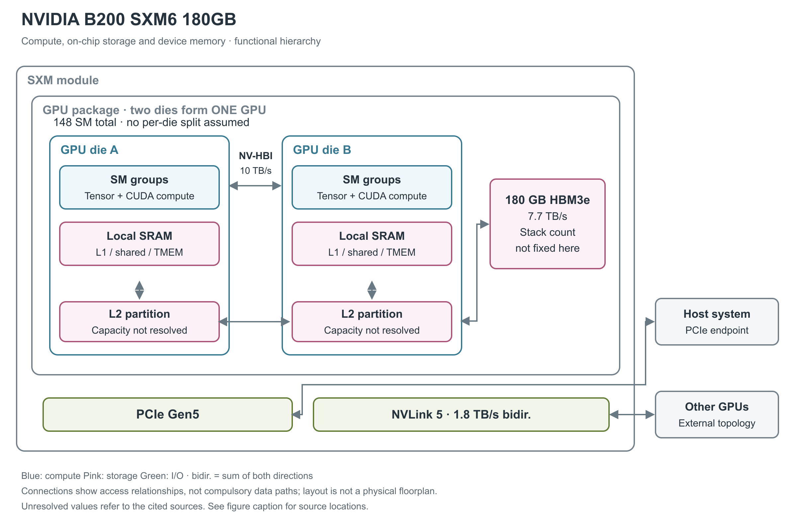

# NVIDIA B200 SXM6 180GB

B200 采用 Blackwell 架构，把两个大型 GPU 裸片连接成一颗逻辑 GPU，再与 HBM3e（高带宽堆叠内存） 组合为 SXM6 模组。封装内 NV-HBI 连接两块裸片，模组外 NVLink 连接其他 GPU，PCIe 连接主机。[1, pp.8-9；2, pp.7-10；6, p.7]

图 1：双裸片 Blackwell GPU 的逻辑组成。148 SM 是当前 B200 的公开使能总数，图未假设每裸片恰好分到一半；L2 分区分别画在两个 GPU 裸片内，连线表示逻辑共享关系，不代表另有缓存裸片。180 GB HBM3e 采用总容量框，stack 数及每裸片分配未由本款资料明确给出。[8, Streaming multiprocessor count；2, pp.7-10；1, p.8；3, §1.4.2.3；9, §9.7.18.1]

## 两个裸片为何仍是一颗 GPU

B200 的两个 GPU 裸片通过 NV-HBI（NVIDIA High-Bandwidth Interface，封装内高带宽接口）连接，公开带宽为 10 TB/s，所引原文未明确其方向；两个裸片形成一个 coherent GPU。软件把它作为一颗 GPU 使用；这条链路与连接其他模组的 NVLink 是两个不同层级。Blackwell 双裸片整体采用 TSMC 4NP，共约 2,080 亿晶体管，这不是每个裸片各有 2,080 亿。[2, pp.7-8；1, p.9]

NVIDIA 的 CUDA MPS（Multi-Process Service，多进程服务） 技术文章直接披露 HGX B200 正常 GPU 有 148 个 SM（流式多处理器）。SM 内同时存在 CUDA 算术、第五代 Tensor Core 矩阵计算和局部数据存储。当前型号资料没有完整列出 GPC（Graphics Processing Cluster，图形处理簇）、TPC（Texture Processing Cluster，纹理处理簇）、实际 L2 总容量，因此图将 SM 画成两组逻辑计算区域，不用完整架构上限填充产品资源。[8, MLOPart device capabilities and characteristics；3, §1.4.1]

## 低精度矩阵计算与普通算术

第五代 Tensor Core 和第二代 Transformer Engine 增加 FP4、FP6 等低精度路径，并通过 micro-tensor scaling 管理较小数据组的动态范围。FP4、FP6、FP8 等输入位宽并不等于所有中间结果和累加都使用相同位宽；本篇不从架构支持列表推导所引资料未列的累加组合。[2, pp.8-9]

下表来自技术简报 Table 3 的 HGX B200 单 GPU 行。PFLOPS／POPS 表示每秒千万亿次浮点／整数运算，TFLOPS 为每秒万亿次浮点运算。表中 dense／sparse 显示值按原文保留，FP16 的 2.2 不改写成由两倍关系算出的 2.25。需要注意，技术简报同表的容量行写“最高 192 GB”，而本篇采用的数据手册列出 180 GB；两份来源的 HGX B200 sparse 峰值一致，但数据手册用“dense 为 sparse 的一半”作统一脚注，显示精度与简报略有不同。[2, pp.25-26；1, p.8, notes 1-2]

| 运算路径 | Dense 稠密 | 结构化稀疏 |
|---|---:|---:|
| NVFP4 Tensor | 9 PFLOPS | 18 PFLOPS |
| FP8／FP6 Tensor | 4.5 PFLOPS | 9 PFLOPS |
| INT8 Tensor | 4.5 POPS | 9 POPS |
| FP16／BF16 Tensor | 2.2 PFLOPS | 4.5 PFLOPS |
| TF32 Tensor | 1.1 PFLOPS | 2.2 PFLOPS |
| FP32 | 75 TFLOPS | 不适用 |
| 原表“FP64 Tensor Core / FP64” | 37 TFLOPS | 原文未拆分两条路径 |

B200 的具体运行时钟未在所选型号表中公开。产品另有 7 个 NVDEC、7 个 nvJPEG 和专用 Decompression Engine，用于视频、图像和压缩数据处理；它们不计入 Tensor Core 矩阵峰值。[1, p.8]

## 低精度格式的缩放成本与稀疏粒度

NVFP4 采用两级缩放：每 16 个 FP4 值共用一个 FP8 E4M3 scale，张量再配一个 FP32 scale。只看组内编码，16 个值的 payload 为 8 B，加 1 B scale 为 9 B；相对 16 B 的 FP8 payload，理想压缩比约为 1.78，而不是忽略 scale 时的 2。这个计算尚未包含张量级 scale、对齐、padding 和 sparse metadata，不能直接当作应用总内存压缩比。FP4 的存储位宽也不决定累加器位宽。[10, Ultra-charged NVFP4 performance；9, §9.7.18.10.7, Block Scaling for tcgen05.mma；本段字节数为按上述格式计算]

PTX（Parallel Thread Execution，CUDA 的虚拟指令集）的 block-scaling 模式区分 16 元素与 32 元素共享 scale 的形式；MMA descriptor 决定具体输入和输出格式，scale A/B 存在 TMEM（Tensor Memory，Tensor Core 专用片上暂存区）。`tcgen05.mma` 的基础运算为 D＝A×B＋D，选择不读旧 D 时为 D＝A×B，因此对已有 partial sum（部分和）的读取与新输出写回都属于片上矩阵路径。[9, §§9.7.18.10.7,9.7.18.10.10.1]

`tcgen05.mma.sp` 把 A 的 M×K 逻辑矩阵以 M×(K/2) payload 保存，并用 metadata 还原保留值的位置。TF32 为 1:2，FP16/BF16、FP8/FP6 等相应路径为 2:4；对 `sm_100a` 与 `sm_103a`，MXFP4/NVFP4 的 v0 模式为成对的 4:8，即每八个元素按两元素为一对保留其中两对。后者约束比任选四个非零更强。较新 ISA 中另一架构的 v1 2:4 模式不能反向移植到本产品。[9, §§9.7.18.10.9.1-9.7.18.10.9.3]

## B200 的 Tensor 数值微基准

数值微基准在 B200 上观察到，旧 FP8 `mma.sync.aligned` 路径会先转换成 FP16，再走 HMMA；显式 `tcgen05.mma` 的 `kind::f8f6f4` 才映射为 UTCQMMA。后者的模型每组累加 32 个 FP8 乘积，对齐阶段保留 25 个小数位；H100/H200 原生 FP8 模型为 13 个。FP16/BF16→FP32 的 B200 模型每组 16 个乘积、25 个对齐小数位，与 Hopper 的对应模式相同。论文采用 CUDA 12.8，测试向量推导的是输出数值模型，不是厂商披露的内部物理位宽。[23, §4.1.7, pp.12-14；Figure 5, Tables 3-4；§4.2, p.16]

## 存储层次多了 Tensor Memory

每 SM 可提供 256 KB 合并的 L1／texture cache／shared memory，其中 shared-memory 容量最多 228 KB，单个线程块最多寻址 227 KB。L1 是硬件缓存，shared memory 由线程块显式使用，它们共用容量。每 SM 的寄存器文件有 64K 个 32-bit 寄存器；这些都属于局部资源。[3, §§1.4.1.1,1.4.2.3]

Blackwell 指令集还引入 Tensor Memory，简称 TMEM，是服务新一代 Tensor Core 数据通路的片上暂存区。程序通过 tcgen05 指令族分配和使用它；其逻辑地址空间不能直接当作整颗 GPU 的物理 SRAM 总量。图将 TMEM 放在局部存储层，而没有将它与 L2 合并。[9, §§9.7.18.1.2,9.7.18.7.1,9.7.18.10]

封装内 HBM3e 合计 180 GB，数据手册给出峰值 7.7 TB/s。官方参考架构对 B200 又使用“最高 8 TB/s”的表述；正文保留数据手册的精确规格与另一来源的上限表达，图采用前者。L2 存在，但 Tuning Guide 中的 126 MB 明确写给“GB200 GPU”，不能自动移为 B200 180GB 的已确认容量。[1, p.8；7, Table 1；3, §§1.4.2.1-1.4.2.2]

## SM 资源配额、shared memory 与 cluster

B200 的 compute capability 为 10.0，每 SM 最多驻留 64 warp（32 个线程组成的调度组）、32 block，寄存器文件为 64K×32-bit，单线程最多 255 个寄存器。最大 shared memory 为 228 KB/SM，单 block 可寻址 227 KB；0／8／16／32／64／100／132／164／196／228 KB 是可选择的 carveout。静态 shared memory 保持 48 KB 兼容界限，更大分配需显式 opt-in。这些限制决定 tile 能放多大、同时能保留多少 block，不能仅按总 SM 数估计并行度。[3, §§1.4.1.1,1.4.2.3]

shared memory 由 32 个 bank 构成，官方通用 CUDA 指南给出每 bank 32 bit/clock，故无冲突情况下的 bank 侧理想速率为 128 B/SM/clock。广播、bank conflict、指令发射和搬运方向会影响实际可交付吞吐；这不等于 TMEM、L1 cache 或 Tensor Core 操作数端口带宽。寄存器、数据 L1/shared、TMEM 和 L2 是不同资源，不能将它们合称为一块可自由分配的 SRAM。[21, §Shared Memory and Memory Banks；3, §1.4.2.3；9, §9.7.18.1]

Blackwell 保留 Thread Block Cluster 和 DSM，即同一 cluster 内 block 可以访问彼此的 shared memory，并可与 L2 访问重叠。官方建议 DSM 访问合并且对齐 32 B segment；B200 可移植 cluster 上限为 8 block，可 opt-in 16 block。更大 cluster 会减少可驻留 block 数，跨 SM 的显式复用并不保证提高整体占用率。[3, §1.4.1.2]

## TMEM 的分配、访问与累加路径

`tcgen05` 把矩阵累加结果从普通线程寄存器中分离出来。PTX 对 `sm_100a/sm_100f` 定义的 TMEM 视图是 128 lane×512 column，每 cell 32 bit；按此计算为 256 KiB 的可寻址区域。32-bit TMEM 地址的高 16 bit 选择 lane、低 16 bit 选择 column，地址编码空间的大小不等于物理 SRAM 大小。[9, §§9.7.18.1-9.7.18.1.1]

非 exclusive（非独占）分配在 `cta_group::1` 下由 CTA（线程块）内一个 warp 发起；`cta_group::2` 则要求两个配对 CTA 各一个 warp 共同参与分配和释放。分配以 32 column 为单位，列数为 2 的幂；每列分配会覆盖全部 128 lane。最小块由 32×128×4 B 算得 16 KiB。kernel 退出前必须显式释放已分配 TMEM。`tcgen05.ld/st` 的访问按 warpgroup 分成四组 lane：warp 0、1、2、3 分别访问 lane 0-31、32-63、64-95、96-127，四个 warp 都可访问所有 column。这是可编程的权限/布局规则，不能把 TMEM 当作任意线程直接索引的 shared memory。[9, §§9.7.18.1.2,9.7.18.7,9.7.18.8.1]

| 数据通路 | 源和目的 | 与普通 shared memory 的差别 |
|---|---|---|
| `tcgen05.cp` | shared memory → TMEM | 按支持的矩阵形状异步搬运 |
| `tcgen05.ld`／`tcgen05.st` | TMEM → register／register → TMEM | warp 协作，受 lane 分组和形状约束 |
| `tcgen05.mma` 的 A | shared memory descriptor 或 TMEM 地址 | A 可以直接复用 TMEM 中的中间结果 |
| `tcgen05.mma` 的 B | shared memory descriptor | B 保持 shared-memory 输入路径 |
| 累加矩阵 D、block scale、稀疏 metadata | TMEM | 结果与控制数据各有规定布局；不能随意复用同一位置 |

上述路径来自 PTX §§9.7.18.8-9.7.18.10，`tcgen05.mma` 为单线程发起整项 MMA 的异步指令。`cta_group::1` 操作本 CTA 的 TMEM，`cta_group::2` 同时使用配对 CTA 的 TMEM；同一 kernel 的相关指令必须使用一致的 group 设定。异步发起不代表结果已经可读，数据消费者仍需遵守 completion 与跨 proxy 的同步要求。[9, §§9.7.18.5-9.7.18.6,9.7.18.10.10.1]

这条路径可让连续矩阵运算把中间 D 保留为下一步 A，减少往 HBM 回写再取回的流量；实际是否省掉搬运取决于 tile 布局、容量和后续指令能否直接消费它。所引官方资料没有公布 TMEM 的物理 bank/端口数、cycle latency 或 B/clock 峰值，也没有给出完整寄存器文件带宽。[9, §§9.7.18.1,9.7.18.8-9.7.18.10]

## 解压引擎与 Tensor Core 以外的数据处理

Blackwell 专用 Decompression Engine 用于压缩数据加载，技术简报给出架构上限最高 800 GB/s，并列 LZ4、Snappy、Deflate。简报的示例是 GB200 上的压缩数据库查询；这一值没有说明所有 B200 数据/格式下的输入或输出口径和可持续速率，因此这里只列为架构引擎上限。解压后的数据仍需占用 HBM 并被后续计算消费，解压引擎带宽不与 HBM 或 Tensor FLOPS 相加。[2, pp.10-11, Decompression Engine]

## 封装内互联、NVLink 和 PCIe

NV-HBI 提供一致地址访问后，两个裸片仍有局部性。NVIDIA MPS 文档说明 MLOPart 可把一个 B200 GPU 暴露为两个内存局部性设备；HGX B200 示例从正常 148 SM 变为每分区 70 SM，两分区合计 140 SM。每个分区有自己的核心和普通内存分配范围，但 CUDA managed memory 是例外；同一物理 GPU 上的分区还共享虚拟地址空间，不保证 MIG（Multi-Instance GPU，多实例 GPU）式的内存/性能隔离。因此不能把该模式的数量当作裸片默认各启用 70 SM，也不能与 MIG 的隔离含义混用。跨同一物理 GPU 的 MLOPart 设备访问可走 NV-HBI；访存较局部时收益还要与减少的 SM 数权衡。[8, MLOPart device capabilities and characteristics; Streaming multiprocessor count; Peer access]

图中央 10 TB/s 的 NV-HBI 把两个裸片连成一个 GPU。图下方第五代 NVLink 则连接 GPU 模组，18 条链路每条每方向 50 GB/s，整个 GPU 双向合计 1.8 TB/s。GPU 间 peer access 需要软件启用；封装内的 coherent GPU 语义不能直接扩展为所有 GPU 的缓存都一致。[2, pp.7-10；3, §1.4.3]

主机接口为 PCIe Gen5，数据手册标 128 GB/s，但未在该项旁明确方向。HGX 服务器的 NVSwitch、SHARP 归约与网络接口都位于 SXM6 模组之外。这里不把系统内归约能力或八 GPU 的总带宽写成 B200 单 GPU 内部单元。[1, pp.8-9]

## 隔离、安全与功耗

MIG 多实例 GPU 支持最多 7 个硬件隔离实例，180GB 配置的 profiles 包括 1g.23gb、1g.45gb、2g.45gb、3g.90gb、4g.90gb、7g.180gb 以及带媒体资源的 1g.23gb+me。实例同时划分 SM、L2 和内存资源；profile 名称不能替代整颗 GPU 的缓存总容量。[5, B200 MIG Profiles, Table 5]

Blackwell 提供专用 RAS（可靠性、可用性与可维护性）管理引擎、Confidential Computing、TEE-I/O（可信执行环境的 I/O 保护）与 NVLink inline protection。B200 单 GPU 的最大可配置 TDP（热设计功耗） 为 1,000 W，实际风冷或液冷由服务器实现；支持文档列出的不同 HGX 配置不意味着所有 B200 模组固定使用一种散热方案。[1, pp.8-9；2, pp.9-12；6, p.7]

Blackwell 平台在 2024 年 3 月公布。当前资料对双裸片、HBM 容量和设备端点已有说明，但具体 HBM stack 数、封装内物理排布和 B200 的 L2 容量仍未在所引型号资料中确认。[4, opening；1, pp.8-9；3, §1.4.2.2]

## 参考资料

页码采用文内印刷页码；独立微基准采用 PDF 页序。网页按所列章节、表或图定位。

[1] NVIDIA，*NVIDIA Blackwell Datasheet*，4204213，2025-10。[本地 PDF](../../原始资料/论文/NVIDIA_GPU/90_官方白皮书与技术资料/2025_NVIDIA_Blackwell_Datasheet_4204213_OCT25.pdf)

[2] NVIDIA，*NVIDIA Blackwell Architecture Technical Brief*，v2.1。[本地 PDF](../../原始资料/论文/NVIDIA_GPU/90_官方白皮书与技术资料/NVIDIA_Blackwell_Architecture_Technical_Brief_v2.1.pdf)

[3] NVIDIA，*Blackwell Tuning Guide*，13.4。[原文](https://docs.nvidia.com/cuda/blackwell-tuning-guide/) [本地原文](../../原始资料/网页快照/NVIDIA/产品详解补充/2026-09-17/ref-ea632a37f5b5-blackwell-tuning-guide.html)

[4] NVIDIA，*NVIDIA Blackwell Platform Arrives to Power a New Era of Computing*，2024-03-18。[原文](https://nvidianews.nvidia.com/news/nvidia-blackwell-platform-arrives-to-power-a-new-era-of-computing) [本地原文](../../原始资料/网页快照/NVIDIA/产品详解补充/2026-09-17/ref-24203513100c-nvidia-blackwell-platform-arrives-to-power-a-new-era-of-computing.html)

[5] NVIDIA，*MIG User Guide: Supported GPUs and B200 MIG Profiles*。[原文](https://docs.nvidia.com/datacenter/tesla/mig-user-guide/supported-gpus.html)；[原文](https://docs.nvidia.com/datacenter/tesla/mig-user-guide/supported-mig-profiles.html) [本地原文 1](../../原始资料/网页快照/NVIDIA/产品详解补充/2026-09-17/ref-724e4856b45e-supported-gpus.html) [本地原文 2](../../原始资料/网页快照/NVIDIA/产品详解补充/2026-09-17/ref-45475f30f152-supported-mig-profiles.html)

[6] NVIDIA，*NVIDIA Trusted Computing Solutions R595 GA Release Notes*，RN-12817-001_v02。[原文](https://docs.nvidia.com/595trd1-trusted-computing-solutions-release-notes.pdf) [本地原文](../../原始资料/论文/NVIDIA_GPU/90_官方白皮书与技术资料/20260917-ref-f84a41e761a5-595trd1-trusted-computing-solutions-release-notes.pdf)

[7] NVIDIA，*HGX AI Factory: Components*。[原文](https://docs.nvidia.com/enterprise-reference-architectures/hgx-ai-factory/latest/components.html) [本地原文](../../原始资料/网页快照/NVIDIA/产品详解补充/2026-09-17/ref-cc28745ad0f7-components.html)

[8] NVIDIA，*Boost GPU Memory Performance with No Code Changes Using NVIDIA CUDA MPS*，2025-12-16，2026-06 更新。[原文](https://developer.nvidia.com/blog/boost-gpu-memory-performance-with-no-code-changes-using-nvidia-cuda-mps/) [本地原文](../../原始资料/网页快照/NVIDIA/产品详解补充/2026-09-17/ref-7e198b219007-boost-gpu-memory-performance-with-no-code-changes-using-nvidia-cuda-mps.html)

[9] NVIDIA，*Parallel Thread Execution ISA*，9.4。[原文](https://docs.nvidia.com/cuda/parallel-thread-execution/#tensor-memory-allocation) [本地原文](../../原始资料/网页快照/NVIDIA/CUDA-PTX/2026-09-17/ptx-9.4.html)

[10] NVIDIA，*Inside NVIDIA Blackwell Ultra: The Chip Powering the AI Factory Era*，其中 NVFP4 格式段说明 Blackwell 架构的两级缩放。[原文](https://developer.nvidia.com/blog/inside-nvidia-blackwell-ultra-the-chip-powering-the-ai-factory-era/) [本地原文](../../原始资料/网页快照/NVIDIA/产品详解补充/2026-09-17/ref-a4e08f0f8de1-inside-nvidia-blackwell-ultra-the-chip-powering-the-ai-factory-era.html)

[21] NVIDIA，*CUDA C++ Best Practices Guide*，13.4，§Shared Memory and Memory Banks。[原文](https://docs.nvidia.com/cuda/cuda-c-best-practices-guide/index.html#shared-memory-and-memory-banks) [本地原文](../../原始资料/网页快照/NVIDIA/CUDA-PTX/2026-09-17/cuda-best-practices-13.4.html)

[23] F. A. Khattak、M. Mikaitis，*Accurate Models of NVIDIA Tensor Cores*，本地版本为 2026-06-11 v4。[本地 PDF](../../原始资料/论文/NVIDIA_GPU/02_独立逆向与微基准/2025_Accurate_Models_NVIDIA_Tensor_Cores.pdf)
