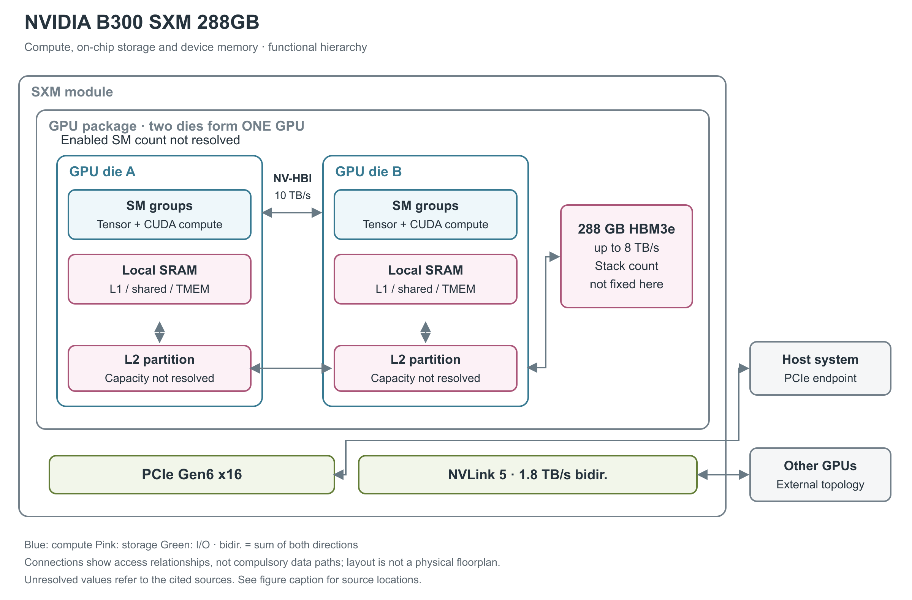

# NVIDIA B300 SXM 288GB

B300 是 Blackwell Ultra 系列的 SXM GPU，面向训练和推理，尤其强调低精度矩阵计算与 attention 相关执行能力。这里介绍参考架构列出的 288GB 版本；另一组官方表以 270GB 为条件，不能把两组数字直接拼成一份无争议规格。[3, Table 1；1, pp.25-26]

图 1：B300 的双裸片、分布于两个裸片内并保持一致性的 L2、局部 Tensor Memory 和 HBM3e（高带宽堆叠内存）。实际 SM 数与 L2 容量未确认；官方技术文章的 HBM 正文写 8 个 12-Hi stack，但末尾修订说明又称应为 12 个 stack，因此本图保留容量而不固定堆栈数。[2, Dual-reticle design; Figure 2; Memory; Interconnect; update note；3, Tables 1-2]

## 双裸片与局部计算存储

Blackwell Ultra 通过 NV-HBI 封装内接口把两个 GPU 裸片组成单一 coherent GPU，接口公布带宽为 10 TB/s，但原来源未明确这个数字的方向。整个双裸片 GPU 采用 TSMC 4NP、约 2,080 亿晶体管。芯片间 NVLink 与这条裸片间接口不同，不能把二者放在同一层比较。[2, Dual-reticle design]

架构完整实现最多有 160 个 SM（流式多处理器），每 SM 有 128 个 CUDA Core、4 个第五代 Tensor Core。官方脚注明确资源数随型号变化，因此“最多 160”不能直接写成 B300 SXM 288GB 的实际使能数。图用计算组表示两侧裸片，不标未经确认的对半分配。[2, Streaming multiprocessors and note 1]

每 SM 的 256 KB Tensor Memory，简称 TMEM，是 Tensor Core 通路附近的片上暂存区，用于保存中间结果、支持操作数复用。两个 GPU 裸片的 L2 保持一致性，但所引资料未列容量。TMEM 与 L2 的职责不同，也不能把每 SM 的 TMEM 乘上未确认的 SM 数后写成产品 SRAM 规格。[2, Streaming multiprocessors; Memory]

## SM 中的指令、寄存器与数据存储

官方 Ultra SM 图给出四个处理分区：每分区有 L0 instruction cache、一个标为 32 thread/clock 的 warp scheduler（warp 调度器，每 warp 含 32 个线程） 与 dispatch unit、16,384×32-bit 寄存器文件、64 KB TMEM，以及 8 个 LD/ST（load/store，读写） 图示单元和一个 SFU（特殊函数单元）区块。四个分区合计 256 KB 寄存器与 256 KB TMEM；SM 另有共享 L1 instruction cache、TMA（Tensor Memory Accelerator，张量内存搬运器）、256 KB 数据 L1/shared memory 和四个纹理单元。这三处 256 KB 分别服务线程状态、Tensor 中间结果和数据缓存/工作区，物理和编程角色不同。[2, Figure 2, Blackwell Ultra SM architecture；上述合计由四分区相加]

该图没有披露 L0/L1 指令缓存容量、寄存器 bank/端口数、TMEM 的物理 bank 数或各自读写 B/clock，也未在图中逐项标出 FP32/INT32/FP64 的并发规则。因此本篇保留具体已知资源，不从图的方框面积或 B200 吞吐猜测 Ultra 的所有执行比例。[2, Figure 2]

## 计算峰值为什么暂不能与 288GB 无条件绑定

技术简报 Table 3 给出一组 HGX B300 单 GPU 峰值，但同一表同时写 270GB HBM3e（高带宽堆叠内存）、7.7TB/s 和 1,100W。Blackwell Ultra datasheet 也保留相同内存条件，驱动支持表仍出现 270GB SXM6 AC，故不能简单把它视为已作废的早期数值。[1, pp.25-26；10, HGX B300 specifications；11, supported hardware]

以下是这组 270GB 条件下的参考峰值，只用于完整呈现原始资料，不宣称它们已经对应图中的 288GB 产品。PFLOPS／POPS 表示每秒千万亿次浮点／整数运算。[1, pp.25-26]

| 运算路径 | Dense 稠密 | 结构化稀疏 |
|---|---:|---:|
| FP4 Tensor | 14 PFLOPS | 18 PFLOPS |
| FP8／FP6 Tensor | 4.5 PFLOPS | 9 PFLOPS |
| INT8 Tensor | 0.15 POPS | 0.30 POPS |
| FP16／BF16 Tensor | 2.2 PFLOPS | 4.5 PFLOPS |
| TF32 Tensor | 1.1 PFLOPS | 2.2 PFLOPS |
| FP32 | 75 TFLOPS | 不适用 |
| 原表“FP64 Tensor Core / FP64” | 1.2 TFLOPS | 原文未拆分 |

同为 270GB 条件的 Ultra datasheet 将 INT8 sparse 写为 307 TOPS，并用脚注说明 dense 为其一半；技术简报则显示 0.15／0.30 POPS。两处显示值并非完全一致，故上表保留简报原数，不把它们作为更高精度的统一定值。[10, p.5, Individual Blackwell Ultra GPU Specifications and note 2；1, pp.25-26]

第二代 Transformer Engine 管理 micro-tensor scaling 和动态范围。Ultra 对 `MUFU.EX2` 指数指令的吞吐提高到 Blackwell 的两倍，可作用于 softmax 的指数阶段；这是某条执行路径的改进，不能写成整个 attention 或完整模型无条件快两倍。产品具体时钟和部分累加语义未在现有型号资料中完整公布。[1, pp.8-9；8, Alleviating the softmax bottleneck; Sample results]

## 低精度格式的缩放成本与稀疏粒度

NVFP4 采用两级缩放：每 16 个 FP4 值共用一个 FP8 E4M3 scale，张量再配一个 FP32 scale。只看组内编码，16 个值的 payload 为 8 B，加 1 B scale 为 9 B；相对 16 B 的 FP8 payload，理想压缩比约为 1.78，而不是忽略 scale 时的 2。这个计算尚未包含张量级 scale、对齐、padding 和 sparse metadata，不能直接当作应用总内存压缩比。FP4 的存储位宽也不决定累加器位宽。[2, Ultra-charged NVFP4 performance；28, §9.7.18.10.7, Block Scaling for tcgen05.mma；本段字节数为按上述格式计算]

PTX（Parallel Thread Execution，CUDA 的虚拟指令集）的 block-scaling 模式区分 16 元素与 32 元素共享 scale 的形式；MMA descriptor 决定具体输入和输出格式，scale A/B 存在 TMEM。`tcgen05.mma` 的基础运算为 D＝A×B＋D，选择不读旧 D 时为 D＝A×B，因此对已有 partial sum（部分和）的读取与新输出写回都属于片上矩阵路径。[28, §§9.7.18.10.7,9.7.18.10.10.1]

`tcgen05.mma.sp` 把 A 的 M×K 逻辑矩阵以 M×(K/2) payload 保存，并用 metadata 还原保留值的位置。TF32 为 1:2，FP16/BF16、FP8/FP6 等相应路径为 2:4；对 `sm_100a` 与 `sm_103a`，MXFP4/NVFP4 的 v0 模式为成对的 4:8，即每八个元素按两元素为一对保留其中两对。后者约束比任选四个非零更强。较新 ISA 中另一架构的 v1 2:4 模式不能反向移植到本产品。[28, §§9.7.18.10.9.1-9.7.18.10.9.3]

## SFU、解压与媒体单元

softmax 的数据依赖通常是先形成 attention score，再完成逐行最大值/指数/求和/归一化，随后才把概率送入下一次矩阵乘法。Ultra 增强的是其中的 `MUFU.EX2` 指数路径，不能把 SFU 的两倍吞吐直接乘到整段 attention。官方后续微基准在 GB200 与 GB300 上循环执行 `exp2`，FP32 分别得到 4,943 与 10,024 Gop/s；这是两个 superchip 平台中 GPU 路径的测量，正文未给出足够时钟与使能配置来绑定 B300 SXM 288GB，故只作为架构机制的旁证。[8, Alleviating the softmax bottleneck; Benchmarking MUFU.EX2 performance]

Ultra 架构对比表给出 SFU EX2 上限 10.7 TeraExponentials/s，仍属于该表的完整 Ultra 配置，不能与 270GB HGX 行无条件拼接。`EX2` 是以 2 为底的指数；计算自然指数时需要相应的输入缩放，官方文章把它简称为 natural exponential execution，不能据此改变指令语义。[2, Table 2；8, Benchmarking MUFU.EX2 performance；28, §9.7.3.21, ex2]

专用解压引擎的架构上限为 800 GB/s，支持 nvCOMP 调用；视频/JPEG 解码由 NVDEC 与 NVJPEG 专用单元执行。AV1 支持存在原文冲突：Ultra 技术文章列出 AV1、HEVC、H.264，而 Ultra datasheet p.5 脚注 3 明确写 AV1 不受支持；这里不把 AV1 支持写成已确认能力。原文没有为本 288GB 配置逐项给出各 codec 的流数、功耗或持续吞吐，因此不按另一个 Blackwell 型号的引擎数量填入本表。解压吞吐还应与压缩格式、压缩比及输入/输出字节口径一起读取。[2, AI video and data processing enhancements；10, p.5, note 3；1, pp.10-11]

## TMEM 的分配、访问与累加路径

`tcgen05` 把矩阵累加结果从普通线程寄存器中分离出来。以下分配与操作数规则来自支持 `sm_103a` 的 tcgen05 指令族。PTX 的布局说明以 `sm_100a/sm_100f` 为例；分配表另明确给出 `sm_103` 的最多 512 column，Ultra 的 256 KB 物理容量由前述官方 SM 图独立确认。PTX 对 `sm_100a/sm_100f` 定义的 TMEM 视图是 128 lane×512 column，每 cell 32 bit；按此计算为 256 KiB 的可寻址区域。32-bit TMEM 地址的高 16 bit 选择 lane、低 16 bit 选择 column，地址编码空间的大小不等于物理 SRAM 大小。[28, §§9.7.18.1-9.7.18.1.1,9.7.18.7.1；2, Figure 2]

非 exclusive（非独占）分配在 `cta_group::1` 下由 CTA（线程块）内一个 warp 发起；`cta_group::2` 则要求两个配对 CTA 各一个 warp 共同参与分配和释放。分配以 32 column 为单位，列数为 2 的幂；每列分配会覆盖全部 128 lane。最小块由 32×128×4 B 算得 16 KiB。kernel 退出前必须显式释放已分配 TMEM。`tcgen05.ld/st` 的访问按 warpgroup 分成四组 lane：warp 0、1、2、3 分别访问 lane 0-31、32-63、64-95、96-127，四个 warp 都可访问所有 column。这是可编程的权限/布局规则，不能把 TMEM 当作任意线程直接索引的 shared memory。[28, §§9.7.18.1.2,9.7.18.7,9.7.18.8.1]

| 数据通路 | 源和目的 | 与普通 shared memory 的差别 |
|---|---|---|
| `tcgen05.cp` | shared memory → TMEM | 按支持的矩阵形状异步搬运 |
| `tcgen05.ld`／`tcgen05.st` | TMEM → register／register → TMEM | warp 协作，受 lane 分组和形状约束 |
| `tcgen05.mma` 的 A | shared memory descriptor 或 TMEM 地址 | A 可以直接复用 TMEM 中的中间结果 |
| `tcgen05.mma` 的 B | shared memory descriptor | B 保持 shared-memory 输入路径 |
| 累加矩阵 D、block scale、稀疏 metadata | TMEM | 结果与控制数据各有规定布局；不能随意复用同一位置 |

上述路径来自 PTX §§9.7.18.8-9.7.18.10，`tcgen05.mma` 为单线程发起整项 MMA 的异步指令。`cta_group::1` 操作本 CTA 的 TMEM，`cta_group::2` 同时使用配对 CTA 的 TMEM；同一 kernel 的相关指令必须使用一致的 group 设定。异步发起不代表结果已经可读，数据消费者仍需遵守 completion 与跨 proxy 的同步要求。[28, §§9.7.18.5-9.7.18.6,9.7.18.10.10.1]

这条路径可让连续矩阵运算把中间 D 保留为下一步 A，减少往 HBM 回写再取回的流量；实际是否省掉搬运取决于 tile 布局、容量和后续指令能否直接消费它。所引官方资料没有公布 TMEM 的物理 bank/端口数、cycle latency 或 B/clock 峰值，也没有给出完整寄存器文件带宽。[28, §§9.7.18.1,9.7.18.8-9.7.18.10]

## HBM 容量确认到哪里

HGX 参考架构和 NIM 支持文档把 B300 SXM 标为每 GPU 288 GB HBM3e，峰值带宽最高 8 TB/s。HBM 是同封装的堆叠 DRAM，负责大容量数据保存；GPU 片上 L2 只是其中部分数据的缓存，不能把 288GB 称为“片上 SRAM”。[3, Table 1；6, per-GPU VRAM tables]

当前官方技术文章内部仍存在 stack 数文字不一致：Memory 小节写 eight 12-Hi stacks，而文末修订说明说由 8 更正为 12。这里的 12-Hi 指垂直堆叠高度，与 12 个 stack 是两个概念。在来源没有厘清前，用一个 HBM 聚合框比画出确定的 8 或 12 个更准确。[2, Memory and update note]

## 三种连接的物理位置

封装内 NV-HBI 负责两个裸片协作。设备间第五代 NVLink 有 18 条链路，单 GPU 双向合计 1.8 TB/s。主机侧 GPU 端点为 PCIe Gen6 x16，双向 256 GB/s；HGX 底板中某段 CPU-facing Gen5 连接属于另一层链路，不改变 GPU 端点本身的定义。[2, Interconnect；3, Table 2]

图中未把 Grace CPU、NVLink-C2C 或 ConnectX 网络接口画入单 GPU。它们出现在不同上层平台中，不能由 Blackwell Ultra 家族框图自动归入 B300 SXM 模组。NVSwitch 的集合通信能力也在模组之外。[3, NVIDIA HGX B300 Baseboard and Table 2]

## 功耗、实例划分与仍待澄清的配置

288GB 精确配置的功耗尚未在这些资料中对应清楚。270GB 表的 1,100W 和通用 Ultra 文章的最高 1,400W 分别带有自己的产品范围，都不能直接填写成该 288GB 版本的 TDP（热设计功耗）。NIM 支持表给出 `NVIDIA-B300-SXM6-AC` 名称，具体气流、散热器和供电仍由整机方案实现。[1, pp.25-26；2, Table 2；6, Verified GPUs]

Ultra datasheet 为 HGX B300 列出最多 7 个 MIG（Multi-Instance GPU，多实例 GPU）实例；GPU Operator 26.3 文档收录的 25.10.0 发布说明列出 profiles，包括 1g.34gb、1g.67gb、2g.67gb、3g.135gb、4g.135gb、7g.269gb 和带媒体资源的版本。这些可见 framebuffer 名称不等于直接公布了 288GB 物理内存的扣减构成，不能用 profile 名称自行解释 270GB 与 288GB 的差异。[10, p.5, MIG；7, 25.10.0, New Features, Added support for new MIG profiles]

所引资料仍未厘清 288GB 与 270GB 两组配置的对应关系，整芯片算力和能效比较应分别保留这两组来源条件。[3, Table 1；1, pp.25-26]

## 参考资料

页码采用文内印刷页码；独立微基准采用 PDF 页序。网页按所列章节、表或图定位。

[1] NVIDIA，*NVIDIA Blackwell Architecture Technical Brief*，v2.1。[本地 PDF](../../原始资料/论文/NVIDIA_GPU/90_官方白皮书与技术资料/NVIDIA_Blackwell_Architecture_Technical_Brief_v2.1.pdf)

[2] NVIDIA，*Inside NVIDIA Blackwell Ultra: The Chip Powering the AI Factory Era*，2025-08-22。[原文](https://developer.nvidia.com/blog/inside-nvidia-blackwell-ultra-the-chip-powering-the-ai-factory-era/) [本地原文](../../原始资料/网页快照/NVIDIA/产品详解补充/2026-09-17/ref-a4e08f0f8de1-inside-nvidia-blackwell-ultra-the-chip-powering-the-ai-factory-era.html)

[3] NVIDIA，*HGX AI Factory: Components*。[原文](https://docs.nvidia.com/enterprise-reference-architectures/hgx-ai-factory/latest/components.html) [本地原文](../../原始资料/网页快照/NVIDIA/产品详解补充/2026-09-17/ref-cc28745ad0f7-components.html)

[6] NVIDIA，*Support Matrix for NIMs: NVIDIA NIM for Large Language Models*。[原文](https://docs.nvidia.com/nim/large-language-models/latest/reference/support-matrix.html) [本地原文](../../原始资料/网页快照/NVIDIA/产品详解补充/2026-09-17/ref-eba1272edbd8-support-matrix.html)

[7] NVIDIA，*GPU Operator 26.3 Release Notes*。[原文](https://docs.nvidia.com/datacenter/cloud-native/gpu-operator/26.3/release-notes.html) [本地原文](../../原始资料/网页快照/NVIDIA/产品详解补充/2026-09-17/ref-c42aed1e51d6-release-notes.html)

[8] NVIDIA，*Making Softmax More Efficient with NVIDIA Blackwell Ultra*，2026-02-25。[原文](https://developer.nvidia.com/blog/making-softmax-more-efficient-with-nvidia-blackwell-ultra/) [本地原文](../../原始资料/网页快照/NVIDIA/产品详解补充/2026-09-17/ref-45c949f6fa78-making-softmax-more-efficient-with-nvidia-blackwell-ultra.html)

[10] NVIDIA，*NVIDIA Blackwell Ultra Datasheet*，2025-10。[原文](https://dam-cdn.nvd.orangelogic.com/AssetLink/1k0p832eq8r5ca0u5383ie5o4tp3bst1.pdf)；[本地 PDF](../../原始资料/论文/NVIDIA_GPU/90_官方白皮书与技术资料/2025_NVIDIA_Blackwell_Ultra_Datasheet.pdf)

[11] NVIDIA，*R595 Trusted Computing Solutions Release Notes*。[原文](https://docs.nvidia.com/595trd1-trusted-computing-solutions-release-notes.pdf) [本地原文](../../原始资料/论文/NVIDIA_GPU/90_官方白皮书与技术资料/20260917-ref-f84a41e761a5-595trd1-trusted-computing-solutions-release-notes.pdf)

[28] NVIDIA，*Parallel Thread Execution ISA*，9.4。[原文](https://docs.nvidia.com/cuda/parallel-thread-execution/) [本地原文](../../原始资料/网页快照/NVIDIA/CUDA-PTX/2026-09-17/ptx-9.4.html)
