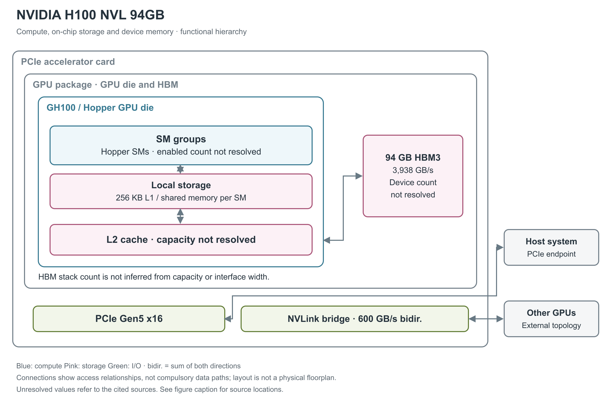

# NVIDIA H100 NVL 94GB

H100 NVL 面向大语言模型等推理应用，采用可由 NVLink 桥连接的 PCIe 加速卡。这里介绍一张 94 GB 卡；常见的 188 GB 描述来自两张卡的容量相加。[1, pp.1,9-10；4, opening]

图 1：单卡 GH100、片上局部存储、L2 与 HBM3（高带宽堆叠内存）的层级。现有型号资料未给出实际 SM 数、L2 容量和 HBM stack 数，因此保留这些结构但不填猜测值。右侧其他 GPU 位于卡外。[1, pp.3-5,9-10；3, pp.18-21,27]

## SM 的执行分区与资源配额

H100 NVL 采用 Hopper 架构的 GH100。图中央的 SM 是流式多处理器，包含执行普通算术的 CUDA Core 和第四代 Tensor Core 矩阵单元。Hopper 每 SM 有 128 个 FP32 CUDA Core、4 个 Tensor Core；这张卡的使能 SM 数没有在所选产品简报或数据手册中列出，因此不能从完整 GH100 的 144 SM 或 H100 SXM5 的 132 SM 推到本卡。[3, pp.18-21；1, pp.3-5；2, p.2]

Hopper SM 有四个处理分区，每分区含 32 个 FP32、16 个 FP64、16 个 INT32 执行单元、一个 Tensor Core、8 个 LD/ST（load/store，读写）单元和一个 SFU（特殊函数单元）区块。每分区另有 warp scheduler（warp 调度器，每 warp 含 32 个线程）、dispatch unit、L0 instruction cache 与 16,384×32-bit 寄存器文件；四分区共享 SM 的 L1 instruction cache、TMA（Tensor Memory Accelerator，张量内存搬运器）和数据 L1/shared memory。L0/L1 指令 cache 的容量与寄存器 bank/端口吞吐未由本白皮书给出，不能由框图面积推算。[3, p.21, Figure 7；pp.39-40, Table 3]

一个 SM 的资源上限为 64 warp、2,048 线程、32 block、65,536 个 32-bit 寄存器；单线程最多 255 个寄存器、单 block 最多 1,024 线程。它们是同时约束占用率的上限，无法保证每个 kernel 同时达到所有上限。[3, p.41, Table 4]

## Hopper 如何执行矩阵和非矩阵计算

SM 以 32 线程 warp 执行程序；Tensor Core 支持低精度矩阵乘加，普通算术路径负责其他操作。FP8 的 E4M3／E5M2 输入可采用 FP16 或 FP32 累加，Transformer Engine 结合缩放因子和统计信息选择精度。TMA 硬件协助 global／shared memory 之间的张量搬运；Thread Block Cluster 支持同一 GPC（Graphics Processing Cluster，图形处理簇） 内多个 SM 协作。它们都是共享 Hopper 架构机制。[3, pp.22-24,29-35,41,44-46]

下表直接采用 H100 数据手册的 NVL 单卡列。该表低精度 Tensor 项带有结构化稀疏条件，未单列 dense 稠密值；这里不把折半计算的值伪装成原文公布的 dense 规格。TFLOPS／TOPS 分别表示每秒万亿次浮点／整数运算。[2, p.2, Technical Specifications and note]

| 运算路径 | 单卡理论峰值 | 条件 |
|---|---:|---|
| FP8 Tensor | 3,341 TFLOPS | 结构化稀疏 |
| FP16／BF16 Tensor | 1,671 TFLOPS | 结构化稀疏 |
| TF32 Tensor | 835 TFLOPS | 结构化稀疏 |
| INT8 Tensor | 3,341 TOPS | 结构化稀疏 |
| FP64 Tensor | 60 TFLOPS | 未附稀疏条件 |
| 普通 FP32／FP64 | 60／30 TFLOPS | 非 Tensor 路径 |

单卡 base／boost 时钟为 1,080／1,785 MHz，并列出 7 个 NVDEC、7 个 JPEG 解码器。GH100 裸片采用 TSMC 4N，面积 814 mm²、约 800 亿晶体管；这些物理数字不用于描述整张 PCIe 卡。[1, p.3；2, p.2；3, pp.17,40]

## 普通算术、特殊函数与每周期吞吐

以下采用 CUDA 编程指南的 compute capability 9.0 列，单位是“结果数/SM/clock”，用于区分指令吞吐与 TFLOPS。一次 FMA（融合乘加）生成一个结果，按 FLOPS 计数时包含一次乘法和一次加法。表中各行属于不同或共享的执行路径，不能求和得到同时可用的总吞吐。[20, §5.4.1, Table 4]

| 原生指令类别 | 每 SM 每周期结果数 | 阅读条件 |
|---|---:|---|
| FP32 add／multiply／FMA | 128 | FMA 的运算计数为表值的两倍 |
| FP64 add／multiply／FMA | 64 | 非 Tensor 路径 |
| FP16 add／multiply／FMA | 256 | packed 16-bit 算术路径，非 Tensor |
| INT32 add／subtract；multiply／IMAD | 64；64 | 乘加和加法须分别计数 |
| FP32 reciprocal／rsqrt／log2／exp2／sin／cos | 16 | 表列原生近似指令；完整数学库函数可能展开为多条指令 |
| INT32 shift／compare／min／max／bitwise | 64 | 按相应原生指令分别读取 |
| popcount／count-leading-zeros | 16 | 位处理，不计入浮点峰值 |
| warp shuffle／warp reduce／warp vote | 32／16／64 | 吞吐单位仍为每线程结果，warp 含 32 个线程 |
| 16-bit／32-bit DPX | 128／64 | fused min/max/add 等动态规划指令，非矩阵乘加 |

Hopper 的 FP16/BF16 Tensor 通路每 SM 每周期吞吐是 Ampere 同类型的两倍；按每 Tensor Core 每周期 512 次 dense FP16/BF16 FMA、每 SM 四个 Tensor Core 计算，即 2,048 FMA 或 4,096 FLOP/SM/clock。FP8 再提高一倍；这些是架构每周期推导，不用于在 SM 数或时钟未公布时反算 SKU 配置。[3, pp.22-23,39-40, Table 3]

## Tensor 操作数、稀疏 metadata 与数值路径

传统 `mma.sync` 把矩阵 fragment 放在 warp 的寄存器中；Hopper 的异步 `wgmma` 由四个连续 warp、共 128 线程协作，A 可来自寄存器或 shared memory，B 来自 shared memory，D 累加结果分布于线程寄存器。这样可以减少 B 的寄存器中转，但结果仍占寄存器，不能把 Hopper TMA 误认成 Blackwell 的 TMEM（Tensor Memory，Tensor 专用片上暂存区）结果存储。[28, §9.7.17, Asynchronous Warpgroup Level Matrix Multiply-Accumulate Instructions]

低精度 sparse MMA 需要给 A 提供压缩数据和位置 metadata，B 按对应索引匹配。FP16/BF16、FP8/INT8 的 `wgmma.sp` 使用 2:4 粒度，TF32 为 1:2；它们都保留一半元素，但 metadata 布局不同。普通 dense 指令不会因为输入恰好有零而自动跳过对应乘加。[28, §9.7.17.6.1, Sparse matrix storage]

数值微基准对 H100/H200 的一个重要观察是：FP8 `mma.sync.aligned.m16n8k32` 在所测工具链中先转换成 FP16，再调用 HMMA；`wgmma.mma_async` 才映射到原生 FP8 QGMMA。因此“输入为 FP8”不足以确定使用哪条硬件路径。原生 FP8 的模型每组累加 32 个乘积，乘积对齐保留 13 个小数位；FP16/BF16→FP32 则每组 16 个乘积、保留 25 个对齐小数位。这里是作者从测试向量归纳的可复现数值模型，不能将该位数当成厂商披露的物理加法器宽度。论文的 H100/H200 未区分全部 SXM/NVL 板型，CUDA 为 12.8，本文不移植其器件峰值或时钟。[23, §4.1.6, pp.11-14, Figure 5, Tables 3-4；§4.2, p.16]

## 寄存器、片上缓存与 HBM

每 SM 的 256 KB 寄存器文件用于线程状态，另外 256 KB 由 L1 cache 与 shared memory 分配使用。shared memory 最多为 228 KB，属于程序显式管理的工作区；L1 则缓存访问内容。更外层的 L2 为 GPU 共享缓存，但所引本卡资料未列实际容量。图画出 L2 的存在，未把完整 GH100 的 60 MB 标成 H100 NVL 的产品容量。[3, pp.18,21,27,37,40]

封装内的 HBM3（高带宽堆叠内存） 合计 94 GB，产品简报给出 6,016-bit 总线、2,619 MHz 内存频率与 3,938 GB/s 峰值带宽。数据手册把后者约写为 3.9 TB/s。现有资料未明确列出堆栈数，所以图采用聚合 HBM 框；容量和总线宽度不足以证明具体堆叠布局。[1, p.4, Table 2；2, p.2]

## 片上存储的可分配容量和实际访问路径

shared memory 的 bank 是并行访问的基本单元。官方指南说明，compute capability 5.x 及更新架构使用 32 个 bank，连续 32-bit 字映射到连续 bank，每 bank 每周期提供 32 bit。由此得到无冲突、各 bank 同时服务时的 bank 侧理想上限 32×4＝128 B/SM/clock。同一 bank 的不同地址会拆分服务，同一地址的读可以广播。这一推导既不是 L1 cache 命中带宽，也不是 Tensor Core 全部操作数路径或整个 GPU 的持续带宽；实际吞吐还受发射和访问模式限制。[21, §Shared Memory and Memory Banks]

shared-memory carveout 可选 0／8／16／32／64／100／132／164／196／228 KB；每 block 预留 1 KB，单 block 最高可寻址 227 KB。静态分配超过 48 KB 的兼容界限，需要转为动态分配并 opt-in。228 KB 的可编程容量与 256 KB 的统一 L1/shared 容量不是两个可相加的 SRAM。[22, §§1.4.1.1,1.4.2.4]

Hopper 的 L2 采用 partitioned crossbar，把 GPC 的数据访问尽量留在直接相连的 L2 分区；驻留控制可选择更应保留或驱逐的数据。官方说明 L2 到 SM 的带宽提高，但没有给出可移植到本卡的每方向绝对数。ILC（inline compression，在线数据压缩）可对分配的内存区自动选压缩算法或不压缩，减少实际搬运字节；它仍保留未压缩大小的内存分配，不能把压缩收益直接当作可用 HBM 容量增加。[3, p.37；22, §§1.4.2.2-1.4.2.3]

TMA 接受 1D 至 5D 张量的 descriptor，由一个线程发起 global↔shared 搬运，并处理 stride、坐标和边界；shared→global 方向还能在支持的类型上做 add/min/max/and/or 等逐元素归约。TMA 不需要用寄存器逐元素中转数据，计算 warp 可以并行处理先前 tile。异步 transaction barrier 同时等待线程 arrive 和预期事务字节数，避免只等线程而过早读取仍在途的数据。[3, pp.32-35, Figures 18-20；22, §1.4.1.2]

Thread Block Cluster 把多个 block 同时安排在一个 GPC 内；DSM（Distributed Shared Memory，分布式 shared memory）允许 load/store/atomic 直接访问同一 cluster 的其他 block，数据通过专用 SM-to-SM 网络交换。该路径可与 L2 访问并行，官方建议合并访问并对齐到 32 B segment；跨 cluster 不能据此直接访问任意 SM 的 shared memory。可移植 cluster 上限是 8 block，H100 可 opt-in 16 block，但较大 cluster 会限制可同时驻留的 block 数。[3, pp.29-30；22, §1.4.1.3]

## 两张卡怎样连接

PCIe Gen5 x16 负责主机连接，支持 Gen5 x8 或 Gen4 x16 协商。Gen5 x16 的每方向规格为 64 GB/s，双向合计 128 GB/s。另一组接口是卡顶端的三个 NVLink bridge connector：连接一张相邻 H100 NVL 时，必须把三块 bridge 全部装上，最大双向带宽为 600 GB/s。[1, pp.3,7,9-10；3, pp.49-50]

两张卡仍各有自己的 GPU 和 94 GB HBM。产品简报定义了点到点数据传输，却没有声明桥接后自动获得一个统一的 188 GB 内存池。模型如何跨两张卡分配参数、如何交换中间结果，仍由软件安排。所引单卡资料也未列独立的集合通信引擎。[1, pp.9-11]

本卡支持 MIG（Multi-Instance GPU，多实例 GPU），最多划分 7 个独立的计算、缓存和显存实例；SR-IOV（单根 I/O 虚拟化）另支持 32 个 VF（虚拟功能），与 MIG 实例数含义不同。[1, pp.3-4,8]

## 供电、散热与可靠性

H100 NVL 为全高全长、10.5 英寸、双槽卡，带双向被动散热器，需要服务器风道。450 W／600 W 线缆模式下，默认和最大板卡功耗为 400 W，最低为 200 W；300 W 模式下，默认和最大限制为 310 W。数据手册的可配置 350 至 400 W 是概括描述，装机时还要满足产品简报的具体供电条件。[1, pp.1,3,6,12-15；2, p.2]

HBM 配置启用 ECC，Hopper 架构对 HBM、L2、L1 与寄存器提供单比特纠错、双比特检错保护。该型号在 2023 年 3 月的推理平台发布中公布。实际使能核心数、L2 容量、HBM stack 数以及封装基板仍未由所引型号资料确认。[1, p.5；3, p.38；4, H100 NVL]

## 参考资料

页码采用文内印刷页码；独立微基准采用 PDF 页序。网页按所列章节、表或图定位。

[1] NVIDIA，*NVIDIA H100 NVL GPU Product Brief*，PB-11773-001_v01，2024-03-14。[本地 PDF](../../原始资料/论文/NVIDIA_GPU/90_官方白皮书与技术资料/2023_NVIDIA_H100_NVL_GPU_Product_Brief_v01.pdf)

[2] NVIDIA，*NVIDIA H100 Tensor Core GPU Datasheet*，Sep. 2024，3440270。[本地 PDF](../../原始资料/论文/NVIDIA_GPU/01_厂商直接架构论文/2024_NVIDIA_H100_Tensor_Core_GPU_Datasheet_2430615.pdf)

[3] NVIDIA，*NVIDIA H100 Tensor Core GPU Architecture*，v1.04（本地版本版权页为 2023）。[本地 PDF](../../原始资料/论文/NVIDIA_GPU/01_厂商直接架构论文/2022_NVIDIA_H100_Tensor_Core_GPU_Architecture_Whitepaper_v1.04.pdf)

[4] NVIDIA，*NVIDIA Launches Inference Platforms for Large Language Models and Generative AI Workloads*，2023-03-21。[原文](https://nvidianews.nvidia.com/news/nvidia-launches-inference-platforms-for-large-language-models-and-generative-ai-workloads) [本地原文](../../原始资料/网页快照/NVIDIA/产品详解补充/2026-09-17/ref-b74c0125c0cf-nvidia-launches-inference-platforms-for-large-language-models-and-generative-ai-workloads.html)

[20] NVIDIA，*CUDA C++ Programming Guide*，12.8.1，§5.4.1 Table 4。[原文](https://docs.nvidia.com/cuda/archive/12.8.1/cuda-c-programming-guide/index.html#arithmetic-instructions) [本地原文](../../原始资料/网页快照/NVIDIA/CUDA-PTX/2026-09-17/cuda-programming-12.8.1.html)

[21] NVIDIA，*CUDA C++ Best Practices Guide*，13.4，§Shared Memory and Memory Banks。[原文](https://docs.nvidia.com/cuda/cuda-c-best-practices-guide/index.html#shared-memory-and-memory-banks) [本地原文](../../原始资料/网页快照/NVIDIA/CUDA-PTX/2026-09-17/cuda-best-practices-13.4.html)

[22] NVIDIA，*Hopper Tuning Guide*，13.4。[原文](https://docs.nvidia.com/cuda/hopper-tuning-guide/index.html) [本地原文](../../原始资料/网页快照/NVIDIA/产品详解补充/2026-09-17/ref-659a0c19fa52-index.html)

[23] F. A. Khattak、M. Mikaitis，*Accurate Models of NVIDIA Tensor Cores*，本地版本为 2026-06-11 v4。[本地 PDF](../../原始资料/论文/NVIDIA_GPU/02_独立逆向与微基准/2025_Accurate_Models_NVIDIA_Tensor_Cores.pdf)

[28] NVIDIA，*Parallel Thread Execution ISA*，9.4。[原文](https://docs.nvidia.com/cuda/parallel-thread-execution/) [本地原文](../../原始资料/网页快照/NVIDIA/CUDA-PTX/2026-09-17/ptx-9.4.html)
