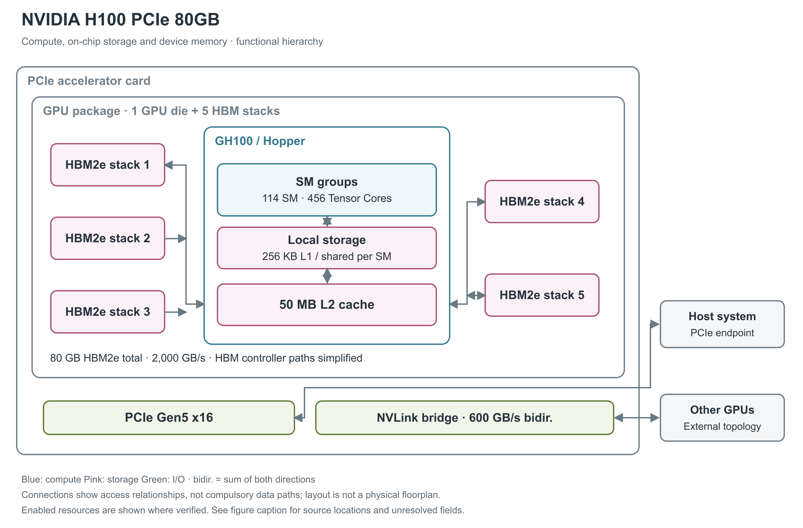

# NVIDIA H100 PCIe 80GB

H100 PCIe 把 Hopper 架构装入可插入服务器的双槽加速卡。它与 H100 SXM5 共享 GH100 裸片设计，但计算资源、HBM（高带宽堆叠内存） 类型、供电和 GPU 间连接采用不同配置。[1, pp.15,18；2, pp.1-4] 白皮书把这一路线放在功率预算较低的标准机架环境，特别提到一次使用 1 或 2 个 GPU 的推理及部分 HPC 应用。[1, p.15, H100 PCIe Gen 5 GPU]

图 1：一个 GH100 裸片与五个 HBM2e stack 构成 GPU 封装，再安装于 PCIe 板卡。图中 114 SM、50 MB L2 和 80 GB HBM2e 均为该版本；HBM 方框位置是逻辑排布。NVLink bridge 连接的是另一张卡，不属于封装内互联。[1, pp.18,21,39-40；2, pp.4,8-9]

## SM 的执行分区与资源配额

H100 PCIe 启用 114 个 SM（Streaming Multiprocessor，执行线程程序的流式多处理器），合计 14,592 个 FP32 CUDA Core 与 456 个第四代 Tensor Core。SM 进一步组织成 57 个 TPC（Texture Processing Cluster，纹理处理簇）；白皮书对上层 GPC（Graphics Processing Cluster，图形处理簇） 数保留“7 或 8”的表述，因此图中不人为固定 GPC 排列。完整 GH100 设计的 144 SM 不代表这张卡的使能资源。[1, pp.18-21,39-40]

Hopper SM 有四个处理分区，每分区含 32 个 FP32、16 个 FP64、16 个 INT32 执行单元、一个 Tensor Core、8 个 LD/ST（load/store，读写）单元和一个 SFU（特殊函数单元）区块。每分区另有 warp scheduler（warp 调度器，每 warp 含 32 个线程）、dispatch unit、L0 instruction cache 与 16,384×32-bit 寄存器文件；四分区共享 SM 的 L1 instruction cache、TMA（Tensor Memory Accelerator，张量内存搬运器）和数据 L1/shared memory。L0/L1 指令 cache 的容量与寄存器 bank/端口吞吐未由本白皮书给出，不能由框图面积推算。[1, p.21, Figure 7；pp.39-40, Table 3]

一个 SM 的资源上限为 64 warp、2,048 线程、32 block、65,536 个 32-bit 寄存器；单线程最多 255 个寄存器、单 block 最多 1,024 线程。它们是同时约束占用率的上限，无法保证每个 kernel 同时达到所有上限。[1, p.41, Table 4]

## 精度与峰值分别属于哪些单元

第四代 Tensor Core 提供 FP8、FP16、BF16、TF32、FP64 和 INT8 矩阵计算。FP8 与 FP16 支持 FP16／FP32 累加，BF16 与 TF32 使用 FP32 累加；输入位宽与累加位宽要分别理解。下表为单卡理论峰值，TFLOPS／TOPS 分别表示每秒万亿次浮点／整数运算。[1, pp.20-24,39-40]

| 运算路径 | Dense 稠密 | 结构化稀疏 |
|---|---:|---:|
| FP8 Tensor | 1,513 TFLOPS | 3,026 TFLOPS |
| FP16／BF16 Tensor | 756 TFLOPS | 1,513 TFLOPS |
| TF32 Tensor | 378 TFLOPS | 756 TFLOPS |
| INT8 Tensor | 1,513 TOPS | 3,026 TOPS |
| FP64 Tensor | 51.2 TFLOPS | 未列 |
| 普通 FP32／FP64 | 51.2／25.6 TFLOPS | 不适用 |

非 Tensor FP16／BF16 为 102.4 TFLOPS，INT32 为 25.6 TOPS。产品的 base／boost 时钟为 1,125／1,755 MHz，但白皮书计算低精度 Tensor 峰值时使用 1,620 MHz，FP64 Tensor 与普通 FP32／FP64 使用 1,755 MHz。稀疏列要求指定数据结构和执行路径，不能作为任意模型的默认吞吐。[2, p.3；1, pp.39-40]

## 普通算术、特殊函数与每周期吞吐

以下采用 CUDA 编程指南的 compute capability 9.0 列，单位是“结果数/SM/clock”，用于区分指令吞吐与 TFLOPS。一次 FMA（融合乘加）生成一个结果，按 FLOPS 计数时包含一次乘法和一次加法。表中各行属于不同或共享的执行路径，不能求和得到同时可用的总吞吐。[20, §5.4.1, Table 4]

| 原生指令类别 | 每 SM 每周期结果数 | 阅读条件 |
|---|---:|---|
| FP32 add／multiply／FMA | 128 | FMA 的运算计数为表值的两倍 |
| FP64 add／multiply／FMA | 64 | 非 Tensor 路径 |
| FP16 add／multiply／FMA | 256 | packed 16-bit 算术路径，非 Tensor |
| INT32 add／subtract；multiply／IMAD | 64；64 | 乘加和加法须分别计数 |
| FP32 reciprocal／rsqrt／log2／exp2／sin／cos | 16 | 表列原生近似指令；完整数学库函数可能展开为多条指令 |
| INT32 shift／compare／min／max／bitwise | 64 | 按相应原生指令分别读取 |
| popcount／count-leading-zeros | 16 | 位处理，不计入浮点峰值 |
| warp shuffle／warp reduce／warp vote | 32／16／64 | 吞吐单位仍为每线程结果，warp 含 32 个线程 |
| 16-bit／32-bit DPX | 128／64 | fused min/max/add 等动态规划指令，非矩阵乘加 |

Hopper 的 FP16/BF16 Tensor 通路每 SM 每周期吞吐是 Ampere 同类型的两倍；按每 Tensor Core 每周期 512 次 dense FP16/BF16 FMA、每 SM 四个 Tensor Core 计算，即 2,048 FMA 或 4,096 FLOP/SM/clock。FP8 再提高一倍；这些是架构每周期推导，不用于在 SM 数或时钟未公布时反算 SKU 配置。[1, pp.22-23,39-40, Table 3]

## Tensor 操作数、稀疏 metadata 与数值路径

传统 `mma.sync` 把矩阵 fragment 放在 warp 的寄存器中；Hopper 的异步 `wgmma` 由四个连续 warp、共 128 线程协作，A 可来自寄存器或 shared memory，B 来自 shared memory，D 累加结果分布于线程寄存器。这样可以减少 B 的寄存器中转，但结果仍占寄存器，不能把 Hopper TMA 误认成 Blackwell 的 TMEM（Tensor Memory，Tensor 专用片上暂存区）结果存储。[28, §9.7.17, Asynchronous Warpgroup Level Matrix Multiply-Accumulate Instructions]

低精度 sparse MMA 需要给 A 提供压缩数据和位置 metadata，B 按对应索引匹配。FP16/BF16、FP8/INT8 的 `wgmma.sp` 使用 2:4 粒度，TF32 为 1:2；它们都保留一半元素，但 metadata 布局不同。普通 dense 指令不会因为输入恰好有零而自动跳过对应乘加。[28, §9.7.17.6.1, Sparse matrix storage]

数值微基准对 H100/H200 的一个重要观察是：FP8 `mma.sync.aligned.m16n8k32` 在所测工具链中先转换成 FP16，再调用 HMMA；`wgmma.mma_async` 才映射到原生 FP8 QGMMA。因此“输入为 FP8”不足以确定使用哪条硬件路径。原生 FP8 的模型每组累加 32 个乘积，乘积对齐保留 13 个小数位；FP16/BF16→FP32 则每组 16 个乘积、保留 25 个对齐小数位。这里是作者从测试向量归纳的可复现数值模型，不能将该位数当成厂商披露的物理加法器宽度。论文的 H100/H200 未区分全部 SXM/NVL 板型，CUDA 为 12.8，本文不移植其器件峰值或时钟。[23, §4.1.6, pp.11-14, Figure 5, Tables 3-4；§4.2, p.16]

## 寄存器与 SM 局部工作区

每个 SM 同时包含普通算术与 Tensor Core 矩阵路径，并采用 32 线程组成的 warp 调度。局部存储由 256 KB 寄存器文件和 256 KB L1 cache／shared memory 组合资源构成。L1 由硬件缓存访问内容，shared memory 由程序显式安排；后者最多使用 228 KB，两者容量存在分配关系。Hopper 的 TMA 张量搬运器、线程块集群与跨 SM 的 shared-memory 访问支持片内数据复用。[1, pp.21,27,29-35,41]

## 五个 HBM2e 堆栈与共享 L2

图中 50 MB L2 位于 SM 与外部 HBM 之间，是整个 GPU 共享的片上缓存。封装内的五个 HBM2e stack 共提供 80 GB，通过十个 512-bit 控制器形成 5,120-bit 接口。HBM2e 是堆叠 DRAM，容量属于封装内设备内存，不能与主机内存或 L2 容量合并。[1, pp.18,36-40]

产品简报给出的内存频率为 1,593 MHz，带宽为 2,000 GB/s；白皮书曾列 2,039 GB/s，但明确注明尚未定版，因此本文采用产品简报值。HBM、L2、L1 与寄存器支持 ECC 纠错，HBM 还具备故障行重映射机制。[2, p.4, Tables 2-3；1, pp.38-40]

## 片上存储的可分配容量和实际访问路径

shared memory 的 bank 是并行访问的基本单元。官方指南说明，compute capability 5.x 及更新架构使用 32 个 bank，连续 32-bit 字映射到连续 bank，每 bank 每周期提供 32 bit。由此得到无冲突、各 bank 同时服务时的 bank 侧理想上限 32×4＝128 B/SM/clock。同一 bank 的不同地址会拆分服务，同一地址的读可以广播。这一推导既不是 L1 cache 命中带宽，也不是 Tensor Core 全部操作数路径或整个 GPU 的持续带宽；实际吞吐还受发射和访问模式限制。[21, §Shared Memory and Memory Banks]

shared-memory carveout 可选 0／8／16／32／64／100／132／164／196／228 KB；每 block 预留 1 KB，单 block 最高可寻址 227 KB。静态分配超过 48 KB 的兼容界限，需要转为动态分配并 opt-in。228 KB 的可编程容量与 256 KB 的统一 L1/shared 容量不是两个可相加的 SRAM。[22, §§1.4.1.1,1.4.2.4]

Hopper 的 L2 采用 partitioned crossbar，把 GPC 的数据访问尽量留在直接相连的 L2 分区；驻留控制可选择更应保留或驱逐的数据。官方说明 L2 到 SM 的带宽提高，但没有给出可移植到本卡的每方向绝对数。ILC（inline compression，在线数据压缩）可对分配的内存区自动选压缩算法或不压缩，减少实际搬运字节；它仍保留未压缩大小的内存分配，不能把压缩收益直接当作可用 HBM 容量增加。[1, p.37；22, §§1.4.2.2-1.4.2.3]

TMA 接受 1D 至 5D 张量的 descriptor，由一个线程发起 global↔shared 搬运，并处理 stride、坐标和边界；shared→global 方向还能在支持的类型上做 add/min/max/and/or 等逐元素归约。TMA 不需要用寄存器逐元素中转数据，计算 warp 可以并行处理先前 tile。异步 transaction barrier 同时等待线程 arrive 和预期事务字节数，避免只等线程而过早读取仍在途的数据。[1, pp.32-35, Figures 18-20；22, §1.4.1.2]

Thread Block Cluster 把多个 block 同时安排在一个 GPC 内；DSM（Distributed Shared Memory，分布式 shared memory）允许 load/store/atomic 直接访问同一 cluster 的其他 block，数据通过专用 SM-to-SM 网络交换。该路径可与 L2 访问并行，官方建议合并访问并对齐到 32 B segment；跨 cluster 不能据此直接访问任意 SM 的 shared memory。可移植 cluster 上限是 8 block，H100 可 opt-in 16 block，但较大 cluster 会限制可同时驻留的 block 数。[1, pp.29-30；22, §1.4.1.3]

## H100 PCIe 的 cluster 微基准

Lühnen 等明确在 H100 PCIe、CUDA 12.3、SLURM 环境测试，节点调度可能使不同轮次使用不同物理 GPU；论文没有说明固定 GPU 时钟。指令测量使用 cycle，跨 SM 搬运使用 `%globaltimer`，两种计时不可混用。下列数据是该测试程序的结果，不是所有 H100 PCIe 的额定延迟。[27, §III.A；§IV, p.3]

| 测量对象 | 结果 | 实验条件与定位 |
|---|---|---|
| cluster arrive | cluster 1 至 8 block 约 1,050 cycle；16 block 再增约 150 cycle | 每 block 1 线程，median；p.4, §V.A.2 |
| cluster wait | 单 block 45 cycle；超过 4 block 时可增至 87 cycle | 同一指令微基准；p.4 |
| cluster.sync | median 最高约 1,300 cycle | 相近配置的 grid.sync 约 2,200 cycle；__syncthreads 约 14 cycle；p.4 |
| 256 KiB 的 DSM push 搬运 | uint8/16/32/64 为 154.11／77.06／38.59／19.36 μs | 32 threads/block，两 block；Table II, p.4 |
| 多发送者竞争 | 单发送者写 2 MiB 约 308 μs；同时发送时部分需约 608 μs | 16-block cluster，15-to-1；p.5, §V.A.4 |
| cluster 调度开销 | 16-block cluster 在大 grid 下最高约 22% | 对比不使用 cluster 的 launch；p.4, Figure 3 |

DSM 的有效性还取决于谁写谁读。该研究中的 push 直接写接收者的 shared memory，pull 先写本地再由接收者远程读取；小于等于 128 B 时 pull 甚至慢于通过 global memory 交换。论文对 8,192 B 的加速文字存在“230% faster”和“2.3×”两种表述，因此这里只保留方向结论，不用这个含混值作为比率规格。较大 cluster 也可能留下空闲 SM，这解释了扩大共享工作区为何不必然提高吞吐。[27, pp.3-6, Figures 2-5, Conclusion]

## PCIe 插卡和两卡互联

主机接口为 PCIe Gen5 x16，并支持协商为 Gen5 x8 或 Gen4 x16。Gen5 x16 每方向 64 GB/s、双向合计 128 GB/s。GPU 间可用三块 NVLink bridge 连接两张相邻 H100 PCIe 卡，达到峰值时必须同时安装三块桥。[2, pp.4,8-10；1, pp.49-50]

H100 还支持 32-bit 与 64-bit 的原生 PCIe atomic CAS（比较并交换）、exchange 和 fetch-add，用于 CPU/GPU 之间的同步；SR-IOV 的 PF（物理功能）或 VF（虚拟功能）可经 NVLink 访问 peer GPU。原子事务能力与缓存一致性是不同的接口语义。[1, p.50, PCIe Gen 5]

NVLink 的资料存在内部冲突：产品简报首页写 900 GB/s，但桥接章节 Table 6 给出 600 GB/s，架构白皮书的 PCIe 产品描述也给 600 GB/s。因此图采用桥接章节值，并保留冲突说明。该带宽对应两卡连接，不能把 SXM5 的 NVSwitch 系统能力直接移用到这张卡。[2, pp.1,8-9；1, p.15]

普通 NVLink 连接支持按 GPU 物理地址访问对端内存，不能据此宣称缓存一致；两卡桥也没有证明卡内存在专门的集合通信归约引擎。GH100 采用 TSMC 4N 工艺，面积 814 mm²、约 800 亿晶体管，这些数字描述 GPU 裸片，不是板卡尺寸。[1, pp.17,40,47]

产品简报还列出 MIG（Multi-Instance GPU，多实例 GPU）最多 7 个实例，以及 SR-IOV（单根 I/O 虚拟化）支持 32 个 VF（虚拟功能）。VF 的数量描述 PCIe 虚拟化功能，不等于 32 个 MIG 硬件分区。[2, p.4, Tables 1-3]

MIG 为各实例划定独占的 crossbar 端口、L2 bank、内存控制器和 DRAM 地址总线，因而实例之间的隔离不仅涉及计算调度。Hopper 还允许每个 MIG 实例获得至少一个 NVDEC 与一个 NVJPG，并提供独立性能监视器，支持多个实例同时 profiling（性能剖析）。这些是资源分配机制；完整 GPU 的缓存容量、带宽和媒体吞吐不能直接当作单个实例的规格。[1, pp.43-44, H100 MIG Enhancements]

## 供电和散热决定可用的功耗档位

板卡为全高全长、10.5 英寸、双槽，使用被动散热器，依赖服务器气流。最大板级功耗为 350 W；使用受支持的 300 W 线缆模式时，默认和最大功耗限制为 310 W，最低为 200 W。350 W 配置需要相应的 450 W 或 600 W 供电模式。这些是板卡供电条件，不等于持续任务的实测功率。[2, pp.1,3,7-8,11-12]

热管理还区分实测温度和剩余热余量。产品简报以 GPU 内部传感器平均值 TAVG＝87°C、HBM 最高传感器值 THBM＝95°C 作为热资格条件；TLIMIT 则表示距软件降频阈值还有多少摄氏度，最大运行条件为 0°C，硬件降至 50% 时钟和关断分别对应 −2°C、−5°C。这些负值是越过阈值后的余量，不是芯片处于零下温度。[2, pp.5-6, Tables 4-5]

H100 家族于 2022 年 9 月宣布进入量产。现有资料没有披露本卡完整片内网络带宽、封装基板或持续 NVLink 有效载荷性能；图只画已能确认的组成和访问关系。[3, Global Rollout of Hopper；1, pp.18-19；2, pp.8-10]

## 参考资料

页码采用文内印刷页码；独立微基准采用 PDF 页序。网页按所列章节、表或图定位。

[1] NVIDIA，*NVIDIA H100 Tensor Core GPU Architecture*，v1.04（本地版本版权页为 2023）。[本地 PDF](../../原始资料/论文/NVIDIA_GPU/01_厂商直接架构论文/2022_NVIDIA_H100_Tensor_Core_GPU_Architecture_Whitepaper_v1.04.pdf)

[2] NVIDIA，*NVIDIA H100 PCIe GPU Product Brief*，PB-11133-001_v02，2022-11-30。[本地 PDF](../../原始资料/论文/NVIDIA_GPU/90_官方白皮书与技术资料/2022_NVIDIA_H100_PCIe_GPU_Product_Brief_v02.pdf)

[3] NVIDIA，*NVIDIA Hopper in Full Production; Systems with H100 GPU Coming Soon from World’s Top Computer Makers*，2022-09-20。[原文](https://nvidianews.nvidia.com/news/nvidia-hopper-in-full-production) [本地原文](../../原始资料/网页快照/NVIDIA/产品详解补充/2026-09-17/ref-79473e85295a-nvidia-hopper-in-full-production.html)

[20] NVIDIA，*CUDA C++ Programming Guide*，12.8.1，§5.4.1 Table 4。[原文](https://docs.nvidia.com/cuda/archive/12.8.1/cuda-c-programming-guide/index.html#arithmetic-instructions) [本地原文](../../原始资料/网页快照/NVIDIA/CUDA-PTX/2026-09-17/cuda-programming-12.8.1.html)

[21] NVIDIA，*CUDA C++ Best Practices Guide*，13.4，§Shared Memory and Memory Banks。[原文](https://docs.nvidia.com/cuda/cuda-c-best-practices-guide/index.html#shared-memory-and-memory-banks) [本地原文](../../原始资料/网页快照/NVIDIA/CUDA-PTX/2026-09-17/cuda-best-practices-13.4.html)

[22] NVIDIA，*Hopper Tuning Guide*，13.4。[原文](https://docs.nvidia.com/cuda/hopper-tuning-guide/index.html) [本地原文](../../原始资料/网页快照/NVIDIA/产品详解补充/2026-09-17/ref-659a0c19fa52-index.html)

[23] F. A. Khattak、M. Mikaitis，*Accurate Models of NVIDIA Tensor Cores*，本地版本为 2026-06-11 v4。[本地 PDF](../../原始资料/论文/NVIDIA_GPU/02_独立逆向与微基准/2025_Accurate_Models_NVIDIA_Tensor_Cores.pdf)

[27] Tim Lühnen 等，*Benchmarking Thread Block Cluster*，本地 PDF 版本生成于 2024。[本地 PDF](../../原始资料/论文/NVIDIA_GPU/02_独立逆向与微基准/2024_Benchmarking_Thread_Block_Cluster.pdf)

[28] NVIDIA，*Parallel Thread Execution ISA*，9.4。[原文](https://docs.nvidia.com/cuda/parallel-thread-execution/) [本地原文](../../原始资料/网页快照/NVIDIA/CUDA-PTX/2026-09-17/ptx-9.4.html)
