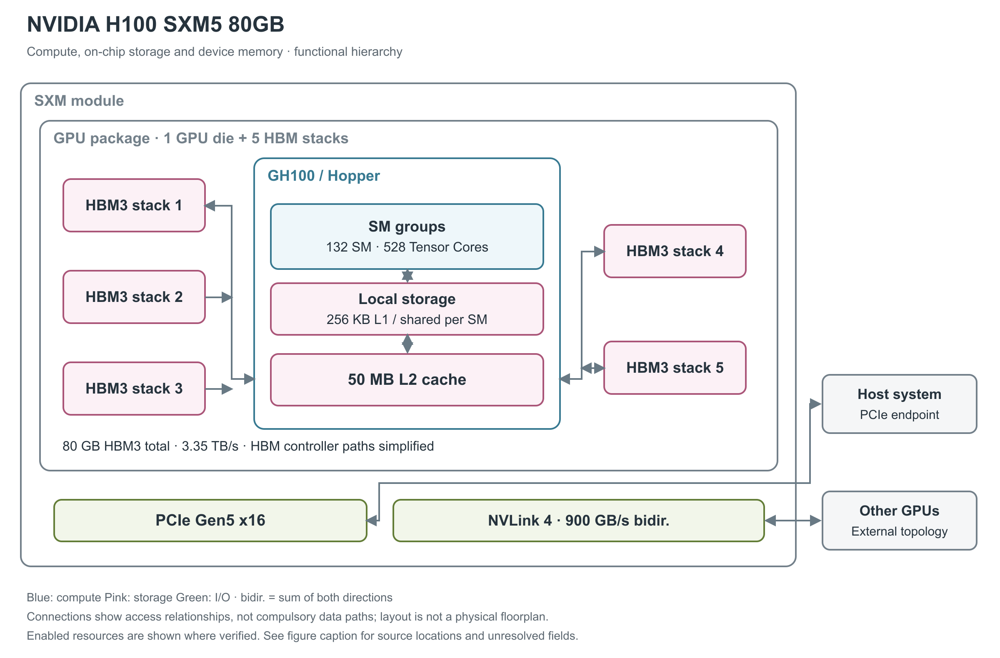

# NVIDIA H100 SXM5 80GB

H100 SXM5 是面向数据中心训练、推理和高性能计算的 Hopper GPU 模组。封装包含计算裸片与 HBM 高带宽内存，模组通过 PCIe 连接主机、通过 NVLink 连接其他 GPU。[1, pp.15-18]

图 1：H100 SXM5 的功能与封装层级。一个 GH100 裸片旁有五个 HBM3 stack；蓝色计算区和粉色 L2 都在 GH100 内。各 stack 的画面位置仅用于数清组成，不代表真实布线或物理排列。图中采用本产品启用的 132 SM、50 MB L2，未照搬完整 GH100 的 144 SM、60 MB L2。[1, pp.18-21,36-40,47,49-50；2, p.2]

## SM 的执行分区与资源配额

图中央的 SM（Streaming Multiprocessor，流式多处理器）是执行线程程序的基本计算单元。H100 SXM5 启用 132 个 SM，共有 16,896 个 FP32 CUDA Core 和 528 个第四代 Tensor Core。CUDA Core 执行一般算术，Tensor Core 承担矩阵乘加；后面的不同精度峰值分别对应这些路径，不能相加成一个“总算力”。这些单元位于一个采用 TSMC 4N 工艺、面积 814 mm²、约 800 亿晶体管的 GH100 裸片中。[1, pp.17-21, 39-41]

Hopper SM 有四个处理分区，每分区含 32 个 FP32、16 个 FP64、16 个 INT32 执行单元、一个 Tensor Core、8 个 LD/ST（load/store，读写）单元和一个 SFU（特殊函数单元）区块。每分区另有 warp scheduler（warp 调度器，每 warp 含 32 个线程）、dispatch unit、L0 instruction cache 与 16,384×32-bit 寄存器文件；四分区共享 SM 的 L1 instruction cache、TMA（Tensor Memory Accelerator，张量内存搬运器）和数据 L1/shared memory。L0/L1 指令 cache 的容量与寄存器 bank/端口吞吐未由本白皮书给出，不能由框图面积推算。[1, p.21, Figure 7；pp.39-40, Table 3]

一个 SM 的资源上限为 64 warp、2,048 线程、32 block、65,536 个 32-bit 寄存器；单线程最多 255 个寄存器、单 block 最多 1,024 线程。它们是同时约束占用率的上限，无法保证每个 kernel 同时达到所有上限。[1, p.41, Table 4]

## 矩阵计算与精度

一个 warp 包含 32 个线程。Tensor Core 支持 FP8、FP16、BF16、TF32、FP64 和 INT8 矩阵路径；FP8 包含 E4M3、E5M2 两种格式，可累加到 FP16 或 FP32。Transformer Engine 结合硬件与软件，按张量统计和缩放因子选用 FP8 或 16-bit 路径。[1, pp.22-24, 39-46]

下表保留白皮书的理论峰值。TFLOPS 表示每秒万亿次浮点运算，TOPS 表示每秒万亿次整数运算；dense 指稠密计算，sparse 列只在满足 NVIDIA 结构化稀疏条件时成立。计算峰值不表示完整模型能以相同比例加速。[1, pp.20, 39-40]

| 计算路径 | Dense | Structured sparse |
|---|---:|---:|
| FP8 Tensor | 1,978.9 TFLOPS | 3,957.8 TFLOPS |
| FP16／BF16 Tensor | 989.4 TFLOPS | 1,978.9 TFLOPS |
| TF32 Tensor | 494.7 TFLOPS | 989.4 TFLOPS |
| INT8 Tensor | 1,978.9 TOPS | 3,957.8 TOPS |
| FP64 Tensor | 66.9 TFLOPS | 未列 |
| 普通 FP32／FP64 | 66.9／33.5 TFLOPS | 不适用 |

非 Tensor 的 FP16／BF16 峰值为 133.8 TFLOPS，INT32 为 33.5 TOPS。白皮书对 FP8、FP16、BF16 和 TF32 Tensor 峰值采用 1,830 MHz，对 FP64 Tensor 及普通 FP32／FP64 采用 1,980 MHz；这些是峰值计算所用的 boost 条件，不是所有运行状态下的固定时钟。H100 另有 DPX 动态规划指令，以及 7 个 NVDEC 和 7 个 JPEG 解码器。[1, pp.27, 39-40；2, p.2]

## 普通算术、特殊函数与每周期吞吐

以下采用 CUDA 编程指南的 compute capability 9.0 列，单位是“结果数/SM/clock”，用于区分指令吞吐与 TFLOPS。一次 FMA（融合乘加）生成一个结果，按 FLOPS 计数时包含一次乘法和一次加法。表中各行属于不同或共享的执行路径，不能求和得到同时可用的总吞吐。[20, §5.4.1, Table 4]

| 原生指令类别 | 每 SM 每周期结果数 | 阅读条件 |
|---|---:|---|
| FP32 add／multiply／FMA | 128 | FMA 的运算计数为表值的两倍 |
| FP64 add／multiply／FMA | 64 | 非 Tensor 路径 |
| FP16 add／multiply／FMA | 256 | packed 16-bit 算术路径，非 Tensor |
| INT32 add／subtract；multiply／IMAD | 64；64 | 乘加和加法须分别计数 |
| FP32 reciprocal／rsqrt／log2／exp2／sin／cos | 16 | 表列原生近似指令；完整数学库函数可能展开为多条指令 |
| INT32 shift／compare／min／max／bitwise | 64 | 按相应原生指令分别读取 |
| popcount／count-leading-zeros | 16 | 位处理，不计入浮点峰值 |
| warp shuffle／warp reduce／warp vote | 32／16／64 | 吞吐单位仍为每线程结果，warp 含 32 个线程 |
| 16-bit／32-bit DPX | 128／64 | fused min/max/add 等动态规划指令，非矩阵乘加 |

Hopper 的 FP16/BF16 Tensor 通路每 SM 每周期吞吐是 Ampere 同类型的两倍；按每 Tensor Core 每周期 512 次 dense FP16/BF16 FMA、每 SM 四个 Tensor Core 计算，即 2,048 FMA 或 4,096 FLOP/SM/clock。FP8 再提高一倍；这些是架构每周期推导，不用于在 SM 数或时钟未公布时反算 SKU 配置。[1, pp.22-23,39-40, Table 3]

## Tensor 操作数、稀疏 metadata 与数值路径

传统 `mma.sync` 把矩阵 fragment 放在 warp 的寄存器中；Hopper 的异步 `wgmma` 由四个连续 warp、共 128 线程协作，A 可来自寄存器或 shared memory，B 来自 shared memory，D 累加结果分布于线程寄存器。这样可以减少 B 的寄存器中转，但结果仍占寄存器，不能把 Hopper TMA 误认成 Blackwell 的 TMEM（Tensor Memory，Tensor 专用片上暂存区）结果存储。[28, §9.7.17, Asynchronous Warpgroup Level Matrix Multiply-Accumulate Instructions]

低精度 sparse MMA 需要给 A 提供压缩数据和位置 metadata，B 按对应索引匹配。FP16/BF16、FP8/INT8 的 `wgmma.sp` 使用 2:4 粒度，TF32 为 1:2；它们都保留一半元素，但 metadata 布局不同。普通 dense 指令不会因为输入恰好有零而自动跳过对应乘加。[28, §9.7.17.6.1, Sparse matrix storage]

数值微基准对 H100/H200 的一个重要观察是：FP8 `mma.sync.aligned.m16n8k32` 在所测工具链中先转换成 FP16，再调用 HMMA；`wgmma.mma_async` 才映射到原生 FP8 QGMMA。因此“输入为 FP8”不足以确定使用哪条硬件路径。原生 FP8 的模型每组累加 32 个乘积，乘积对齐保留 13 个小数位；FP16/BF16→FP32 则每组 16 个乘积、保留 25 个对齐小数位。这里是作者从测试向量归纳的可复现数值模型，不能将该位数当成厂商披露的物理加法器宽度。论文的 H100/H200 未区分全部 SXM/NVL 板型，CUDA 为 12.8，本文不移植其器件峰值或时钟。[23, §4.1.6, pp.11-14, Figure 5, Tables 3-4；§4.2, p.16]

## 寄存器、片上缓存与 HBM

离计算最近的是各 SM 的寄存器和局部存储。每个 SM 有 256 KB 寄存器文件，以及合计 256 KB 的 L1 cache／shared memory。L1 是硬件管理的缓存，shared memory 是线程块显式使用的工作区；两者分配同一组容量，shared memory 最多占 228 KB，不能把这些数字相加。全 GPU 的 50 MB L2 是更外层的共享缓存，保存可复用数据，以减少对 HBM 的访问。[1, pp.21, 27, 37, 40]

再往外是封装内的五个 HBM3 stack，合计 80 GB。HBM 是把 DRAM 芯片垂直堆叠而成的高带宽内存；这里的“片外”是相对 GH100 裸片而言，它仍位于 GPU 封装内。该配置启用十个 512-bit 控制器，合计 5,120-bit 接口。数据手册给出的 HBM 带宽为 3.35 TB/s；白皮书的细化值为 3,352 GB/s。这是 GPU 与 HBM 之间的规格，不是 L2 或 NVLink 带宽。[1, pp.18, 36-40；2, p.2]

Hopper 还提供 TMA（Tensor Memory Accelerator，张量内存搬运器），由少量线程发起张量的异步搬运，并由硬件处理地址和边界。Thread Block Cluster 把若干线程块安排到同一 GPC（Graphics Processing Cluster，图形处理簇） 计算簇内，使它们能够访问彼此的 shared memory。图中未展开这些细节，因为它们改变的是片内协作和搬运方式，没有新增一层外部 DRAM。[1, pp.29-35]

## 片上存储的可分配容量和实际访问路径

shared memory 的 bank 是并行访问的基本单元。官方指南说明，compute capability 5.x 及更新架构使用 32 个 bank，连续 32-bit 字映射到连续 bank，每 bank 每周期提供 32 bit。由此得到无冲突、各 bank 同时服务时的 bank 侧理想上限 32×4＝128 B/SM/clock。同一 bank 的不同地址会拆分服务，同一地址的读可以广播。这一推导既不是 L1 cache 命中带宽，也不是 Tensor Core 全部操作数路径或整个 GPU 的持续带宽；实际吞吐还受发射和访问模式限制。[21, §Shared Memory and Memory Banks]

shared-memory carveout 可选 0／8／16／32／64／100／132／164／196／228 KB；每 block 预留 1 KB，单 block 最高可寻址 227 KB。静态分配超过 48 KB 的兼容界限，需要转为动态分配并 opt-in。228 KB 的可编程容量与 256 KB 的统一 L1/shared 容量不是两个可相加的 SRAM。[22, §§1.4.1.1,1.4.2.4]

Hopper 的 L2 采用 partitioned crossbar，把 GPC 的数据访问尽量留在直接相连的 L2 分区；驻留控制可选择更应保留或驱逐的数据。官方说明 L2 到 SM 的带宽提高，但没有给出可移植到本卡的每方向绝对数。ILC（inline compression，在线数据压缩）可对分配的内存区自动选压缩算法或不压缩，减少实际搬运字节；它仍保留未压缩大小的内存分配，不能把压缩收益直接当作可用 HBM 容量增加。[1, p.37；22, §§1.4.2.2-1.4.2.3]

TMA 接受 1D 至 5D 张量的 descriptor，由一个线程发起 global↔shared 搬运，并处理 stride、坐标和边界；shared→global 方向还能在支持的类型上做 add/min/max/and/or 等逐元素归约。TMA 不需要用寄存器逐元素中转数据，计算 warp 可以并行处理先前 tile。异步 transaction barrier 同时等待线程 arrive 和预期事务字节数，避免只等线程而过早读取仍在途的数据。[1, pp.32-35, Figures 18-20；22, §1.4.1.2]

Thread Block Cluster 把多个 block 同时安排在一个 GPC 内；DSM（Distributed Shared Memory，分布式 shared memory）允许 load/store/atomic 直接访问同一 cluster 的其他 block，数据通过专用 SM-to-SM 网络交换。该路径可与 L2 访问并行，官方建议合并访问并对齐到 32 B segment；跨 cluster 不能据此直接访问任意 SM 的 shared memory。可移植 cluster 上限是 8 block，H100 可 opt-in 16 block，但较大 cluster 会限制可同时驻留的 block 数。[1, pp.29-30；22, §1.4.1.3]

## 主机连接与多 GPU 扩展

图下方两类接口承担不同工作。PCIe Gen5 x16 连接主机，每方向 64 GB/s、双向合计 128 GB/s。第四代 NVLink 则面向 GPU 间连接：18 条链路每条每方向 25 GB/s，合计 900 GB/s 双向带宽。[1, pp.47, 49-50；2, p.2]

SXM5 模组要装到服务器底板上。HGX H100 四卡配置可采用点到点 NVLink，八卡配置由外部 NVSwitch 组织连接；SHARP 网络内归约在交换机中完成，不能把它画进 GH100。普通 NVLink 连接支持访问其他 GPU 的内存，但这不等于各 GPU 的缓存自动一致。白皮书还讨论跨节点、独立网络地址空间的 NVLink Network；其中最多 256 GPU 的描述属于发布期系统目标。[1, pp.15-16, 47-48]

MIG（Multi-Instance GPU，多实例 GPU）支持最多 7 个硬件隔离实例，每个实例分别获得计算、缓存和显存资源；数据手册列出最多 7 个 10 GB 实例。[2, p.2；1, Second-Generation Secure MIG, pp.42-43]

## 功耗、可靠性与使用边界

该模组最高 TDP（热设计功耗） 为 700 W，并允许配置。TDP 是散热和供电设计所用的上限指标，不是程序运行时固定消耗的功率。HBM、L2、L1 和寄存器支持 SECDED ECC，即单比特纠错、双比特检错；HBM 支持故障行处理，NVLink 支持错误检测和包重传。[1, p.38, p.47；2, p.2]

H100 家族在 2022 年 3 月发布、同年 9 月宣布进入量产，合作伙伴系统计划于 10 月推出。所引资料没有完整披露封装基板、片内网络带宽或 SXM5 的固定散热方案；这些地方没有按相邻型号补齐。[3, Global Rollout of Hopper；4, Availability；1, pp.15-18]

## 参考资料

页码采用文内印刷页码；独立微基准采用 PDF 页序。网页按所列章节、表或图定位。

[1] NVIDIA，*NVIDIA H100 Tensor Core GPU Architecture*，v1.04（本地版本版权页为 2023）。[本地 PDF](../../原始资料/论文/NVIDIA_GPU/01_厂商直接架构论文/2022_NVIDIA_H100_Tensor_Core_GPU_Architecture_Whitepaper_v1.04.pdf)

[2] NVIDIA，*NVIDIA H100 Tensor Core GPU Datasheet*，Sep. 2024，3440270。[本地 PDF](../../原始资料/论文/NVIDIA_GPU/01_厂商直接架构论文/2024_NVIDIA_H100_Tensor_Core_GPU_Datasheet_2430615.pdf)

[3] NVIDIA，*NVIDIA Hopper in Full Production; Systems with H100 GPU Coming Soon from World’s Top Computer Makers*，2022-09-20。[原文](https://nvidianews.nvidia.com/news/nvidia-hopper-in-full-production) [本地原文](../../原始资料/网页快照/NVIDIA/产品详解补充/2026-09-17/ref-79473e85295a-nvidia-hopper-in-full-production.html)

[4] NVIDIA，*NVIDIA Announces Hopper Architecture, the Next Generation of Accelerated Computing*，2022-03-22。[原文](https://nvidianews.nvidia.com/news/nvidia-announces-hopper-architecture-the-next-generation-of-accelerated-computing) [本地原文](../../原始资料/网页快照/NVIDIA/产品详解补充/2026-09-17/ref-f03b0c4d4193-nvidia-announces-hopper-architecture-the-next-generation-of-accelerated-computing.html)

[20] NVIDIA，*CUDA C++ Programming Guide*，12.8.1，§5.4.1 Table 4。[原文](https://docs.nvidia.com/cuda/archive/12.8.1/cuda-c-programming-guide/index.html#arithmetic-instructions) [本地原文](../../原始资料/网页快照/NVIDIA/CUDA-PTX/2026-09-17/cuda-programming-12.8.1.html)

[21] NVIDIA，*CUDA C++ Best Practices Guide*，13.4，§Shared Memory and Memory Banks。[原文](https://docs.nvidia.com/cuda/cuda-c-best-practices-guide/index.html#shared-memory-and-memory-banks) [本地原文](../../原始资料/网页快照/NVIDIA/CUDA-PTX/2026-09-17/cuda-best-practices-13.4.html)

[22] NVIDIA，*Hopper Tuning Guide*，13.4。[原文](https://docs.nvidia.com/cuda/hopper-tuning-guide/index.html) [本地原文](../../原始资料/网页快照/NVIDIA/产品详解补充/2026-09-17/ref-659a0c19fa52-index.html)

[23] F. A. Khattak、M. Mikaitis，*Accurate Models of NVIDIA Tensor Cores*，本地版本为 2026-06-11 v4。[本地 PDF](../../原始资料/论文/NVIDIA_GPU/02_独立逆向与微基准/2025_Accurate_Models_NVIDIA_Tensor_Cores.pdf)

[28] NVIDIA，*Parallel Thread Execution ISA*，9.4。[原文](https://docs.nvidia.com/cuda/parallel-thread-execution/) [本地原文](../../原始资料/网页快照/NVIDIA/CUDA-PTX/2026-09-17/ptx-9.4.html)
