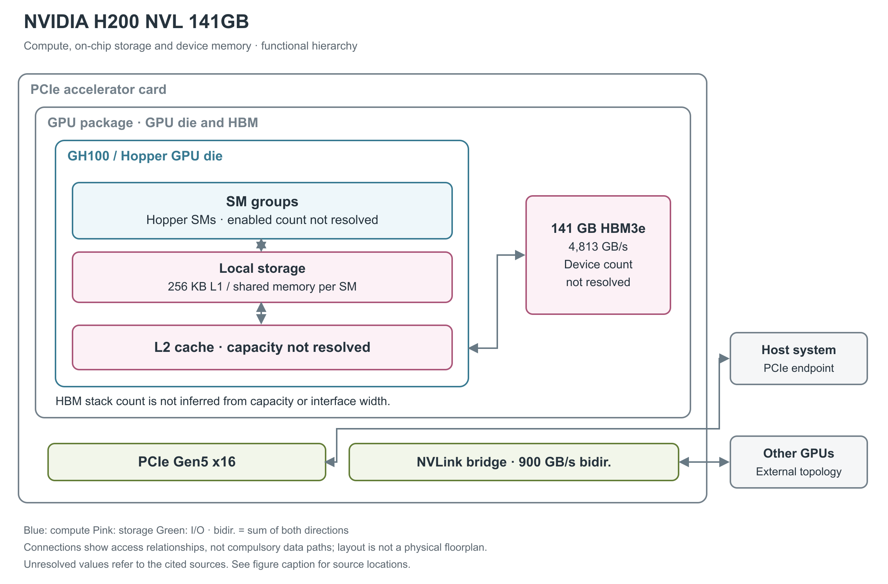

# NVIDIA H200 NVL 141GB

H200 NVL 把 Hopper GPU 与 HBM3e（高带宽堆叠内存） 放入 PCIe 加速卡，并通过宽 NVLink bridge 支持相邻卡连接。单卡包含自己的 Hopper GPU 与 HBM3e，桥接负责卡间通信。[1, pp.1,4,9；4, opening]

图 1：单张 H200 NVL 的功能组成。141 GB HBM3e 是每卡容量，NVLink 连接的其他 GPU 位于卡外。实际 SM 数、L2 容量和 HBM stack 数未由当前型号资料明确给出；图中不借用 H200 SXM5 的数字。[1, pp.3-4,9；2, pp.18-21,27；3, GPU specifications]

## SM 的执行分区与资源配额

GPU 采用 Hopper 架构的 GH100。其 SM（流式多处理器）同时具备 CUDA 普通算术和第四代 Tensor Core 矩阵计算。每个 SM 有 256 KB 寄存器文件，以及 256 KB 合并的 L1 cache／shared memory；shared memory 最高可分配 228 KB，供程序显式管理数据复用，L1 则提供硬件缓存。它们是每 SM 的局部资源。[2, pp.21,27,40]

Hopper SM 有四个处理分区，每分区含 32 个 FP32、16 个 FP64、16 个 INT32 执行单元、一个 Tensor Core、8 个 LD/ST（load/store，读写）单元和一个 SFU（特殊函数单元）区块。每分区另有 warp scheduler（warp 调度器，每 warp 含 32 个线程）、dispatch unit、L0 instruction cache 与 16,384×32-bit 寄存器文件；四分区共享 SM 的 L1 instruction cache、TMA（Tensor Memory Accelerator，张量内存搬运器）和数据 L1/shared memory。L0/L1 指令 cache 的容量与寄存器 bank/端口吞吐未由本白皮书给出，不能由框图面积推算。[2, p.21, Figure 7；pp.39-40, Table 3]

一个 SM 的资源上限为 64 warp、2,048 线程、32 block、65,536 个 32-bit 寄存器；单线程最多 255 个寄存器、单 block 最多 1,024 线程。它们是同时约束占用率的上限，无法保证每个 kernel 同时达到所有上限。[2, p.41, Table 4]

## 计算规格与精度条件

单卡 base／boost 频率为 1,230／1,785 MHz。Hopper Tensor Core 支持 FP8、FP16、BF16、TF32、INT8 和 FP64 等路径；FP8 有 E4M3／E5M2 格式，可累加到 FP16 或 FP32。下表采用 H200 产品页中的 NVL 列；低精度 Tensor 数字包含结构化稀疏条件，不能作为稠密模型的默认速度。原页同时注明这些是 preliminary specifications，即可能调整的初步规格。[1, p.3；2, pp.22-24；3, GPU specifications and note 2]

| 运算路径 | 单卡理论峰值 | 条件 |
|---|---:|---|
| FP8 Tensor | 3,341 TFLOPS | 结构化稀疏 |
| FP16／BF16 Tensor | 1,671 TFLOPS | 结构化稀疏 |
| TF32 Tensor | 835 TFLOPS | 结构化稀疏 |
| FP64 Tensor | 60 TFLOPS | 未附稀疏条件 |
| 普通 FP32／FP64 | 60／30 TFLOPS | 非 Tensor |
| INT8 Tensor | 原页单位与整数运算不一致 | 结构化稀疏；详见下文 |

TFLOPS 指每秒万亿次浮点运算，INT8 通常用 TOPS 表示整数操作；原页把 INT8 写为“3,341 TFLOPS”。这是核实过的原文，不能作为单位无歧义的整数峰值，本文不替厂商改成 TOPS。资料还列出 7 个 NVDEC 与 7 个 JPEG 解码器。由于 dense 峰值未单列，本文不把稀疏值折半后当作原文规格。[3, GPU specifications]

## 普通算术、特殊函数与每周期吞吐

以下采用 CUDA 编程指南的 compute capability 9.0 列，单位是“结果数/SM/clock”，用于区分指令吞吐与 TFLOPS。一次 FMA（融合乘加）生成一个结果，按 FLOPS 计数时包含一次乘法和一次加法。表中各行属于不同或共享的执行路径，不能求和得到同时可用的总吞吐。[20, §5.4.1, Table 4]

| 原生指令类别 | 每 SM 每周期结果数 | 阅读条件 |
|---|---:|---|
| FP32 add／multiply／FMA | 128 | FMA 的运算计数为表值的两倍 |
| FP64 add／multiply／FMA | 64 | 非 Tensor 路径 |
| FP16 add／multiply／FMA | 256 | packed 16-bit 算术路径，非 Tensor |
| INT32 add／subtract；multiply／IMAD | 64；64 | 乘加和加法须分别计数 |
| FP32 reciprocal／rsqrt／log2／exp2／sin／cos | 16 | 表列原生近似指令；完整数学库函数可能展开为多条指令 |
| INT32 shift／compare／min／max／bitwise | 64 | 按相应原生指令分别读取 |
| popcount／count-leading-zeros | 16 | 位处理，不计入浮点峰值 |
| warp shuffle／warp reduce／warp vote | 32／16／64 | 吞吐单位仍为每线程结果，warp 含 32 个线程 |
| 16-bit／32-bit DPX | 128／64 | fused min/max/add 等动态规划指令，非矩阵乘加 |

Hopper 的 FP16/BF16 Tensor 通路每 SM 每周期吞吐是 Ampere 同类型的两倍；按每 Tensor Core 每周期 512 次 dense FP16/BF16 FMA、每 SM 四个 Tensor Core 计算，即 2,048 FMA 或 4,096 FLOP/SM/clock。FP8 再提高一倍；这些是架构每周期推导，不用于在 SM 数或时钟未公布时反算 SKU 配置。[2, pp.22-23,39-40, Table 3]

## Tensor 操作数、稀疏 metadata 与数值路径

传统 `mma.sync` 把矩阵 fragment 放在 warp 的寄存器中；Hopper 的异步 `wgmma` 由四个连续 warp、共 128 线程协作，A 可来自寄存器或 shared memory，B 来自 shared memory，D 累加结果分布于线程寄存器。这样可以减少 B 的寄存器中转，但结果仍占寄存器，不能把 Hopper TMA 误认成 Blackwell 的 TMEM（Tensor Memory，Tensor 专用片上暂存区）结果存储。[28, §9.7.17, Asynchronous Warpgroup Level Matrix Multiply-Accumulate Instructions]

低精度 sparse MMA 需要给 A 提供压缩数据和位置 metadata，B 按对应索引匹配。FP16/BF16、FP8/INT8 的 `wgmma.sp` 使用 2:4 粒度，TF32 为 1:2；它们都保留一半元素，但 metadata 布局不同。普通 dense 指令不会因为输入恰好有零而自动跳过对应乘加。[28, §9.7.17.6.1, Sparse matrix storage]

数值微基准对 H100/H200 的一个重要观察是：FP8 `mma.sync.aligned.m16n8k32` 在所测工具链中先转换成 FP16，再调用 HMMA；`wgmma.mma_async` 才映射到原生 FP8 QGMMA。因此“输入为 FP8”不足以确定使用哪条硬件路径。原生 FP8 的模型每组累加 32 个乘积，乘积对齐保留 13 个小数位；FP16/BF16→FP32 则每组 16 个乘积、保留 25 个对齐小数位。这里是作者从测试向量归纳的可复现数值模型，不能将该位数当成厂商披露的物理加法器宽度。论文的 H100/H200 未区分全部 SXM/NVL 板型，CUDA 为 12.8，本文不移植其器件峰值或时钟。[23, §4.1.6, pp.11-14, Figure 5, Tables 3-4；§4.2, p.16]

## 寄存器、L1 与共享 L2

更外层有 GPU 共享 L2，再通过内存控制路径访问 HBM3e。产品简报没有给出本卡的使能 SM 总数与实际 L2 容量，因此图仅画出层级。完整 GH100 的 144 SM／60 MB L2 和 H200 SXM5 的使能配置均不能替代这张卡的产品证据。[2, pp.18-19；1, pp.3-4]

Hopper 以 warp 组织 32 个线程的执行，支持 TMA 张量搬运器和同一 GPC（Graphics Processing Cluster，图形处理簇） 内的线程块集群。前者处理 global／shared memory 之间的异步搬运，后者支持跨 SM 的 shared-memory 访问。它们有助于组织计算和数据复用，但并不增加封装外的 GPU 数量。[2, pp.29-35,41]

## 141 GB HBM3e 对应什么

单卡 HBM3e 容量为 141 GB，总线宽度 6,016 bit，内存频率 3,201 MHz。产品简报给出 4,813 GB/s 峰值带宽，产品页以 4.8 TB/s 表示。HBM（高带宽堆叠 DRAM）位于 GPU 封装内；其容量不是 PCIe 主机内存，也不是 L2 cache 容量。[1, p.4, Table 2-2；3, GPU specifications]

现有资料未明确列出 stack 数和封装基板结构，故采用聚合 HBM 框。GH100 本身为 TSMC 4N 单片式 GPU 裸片，面积 814 mm²、约 800 亿晶体管。NVLink bridge 位于卡与卡之间，不能把它画成 GH100 与 HBM 之间的封装互联。[2, pp.17-19,40；1, pp.9-10]

## 片上存储的可分配容量和实际访问路径

shared memory 的 bank 是并行访问的基本单元。官方指南说明，compute capability 5.x 及更新架构使用 32 个 bank，连续 32-bit 字映射到连续 bank，每 bank 每周期提供 32 bit。由此得到无冲突、各 bank 同时服务时的 bank 侧理想上限 32×4＝128 B/SM/clock。同一 bank 的不同地址会拆分服务，同一地址的读可以广播。这一推导既不是 L1 cache 命中带宽，也不是 Tensor Core 全部操作数路径或整个 GPU 的持续带宽；实际吞吐还受发射和访问模式限制。[21, §Shared Memory and Memory Banks]

shared-memory carveout 可选 0／8／16／32／64／100／132／164／196／228 KB；每 block 预留 1 KB，单 block 最高可寻址 227 KB。静态分配超过 48 KB 的兼容界限，需要转为动态分配并 opt-in。228 KB 的可编程容量与 256 KB 的统一 L1/shared 容量不是两个可相加的 SRAM。[22, §§1.4.1.1,1.4.2.4]

Hopper 的 L2 采用 partitioned crossbar，把 GPC 的数据访问尽量留在直接相连的 L2 分区；驻留控制可选择更应保留或驱逐的数据。官方说明 L2 到 SM 的带宽提高，但没有给出可移植到本卡的每方向绝对数。ILC（inline compression，在线数据压缩）可对分配的内存区自动选压缩算法或不压缩，减少实际搬运字节；它仍保留未压缩大小的内存分配，不能把压缩收益直接当作可用 HBM 容量增加。[2, p.37；22, §§1.4.2.2-1.4.2.3]

TMA 接受 1D 至 5D 张量的 descriptor，由一个线程发起 global↔shared 搬运，并处理 stride、坐标和边界；shared→global 方向还能在支持的类型上做 add/min/max/and/or 等逐元素归约。TMA 不需要用寄存器逐元素中转数据，计算 warp 可以并行处理先前 tile。异步 transaction barrier 同时等待线程 arrive 和预期事务字节数，避免只等线程而过早读取仍在途的数据。[2, pp.32-35, Figures 18-20；22, §1.4.1.2]

Thread Block Cluster 把多个 block 同时安排在一个 GPC 内；DSM（Distributed Shared Memory，分布式 shared memory）允许 load/store/atomic 直接访问同一 cluster 的其他 block，数据通过专用 SM-to-SM 网络交换。该路径可与 L2 访问并行，官方建议合并访问并对齐到 32 B segment；跨 cluster 不能据此直接访问任意 SM 的 shared memory。可移植 cluster 上限是 8 block，H100 可 opt-in 16 block，但较大 cluster 会限制可同时驻留的 block 数。[2, pp.29-30；22, §1.4.1.3]

## 一块宽桥连接相邻 GPU

主机接口为 PCIe Gen5 x16，也可协商为 Gen5 x8 或 Gen4 x16。官方产品表写 128 GB/s，但该 NVL 表项没有在数值旁单列方向，故不能只凭这一行把它称作单向带宽。[1, pp.3,7；3, GPU specifications]

GPU 间连接采用一个宽 NVLink bridge connector，包含 18 条 link，单 GPU 最大双向端点带宽为 900 GB/s，可组成两卡或四卡的相邻 H200 NVL 连接组。四卡容量相加与单卡的 141 GB 是不同层级；是否采用模型并行、怎样分布数据，由软件和系统配置决定。[1, pp.1,9, Table 4-1]

普通 Hopper NVLink 支持 GPU 间共享地址空间和远端内存访问，但这些描述不等于缓存一致。桥接本身也不是集合通信归约引擎。所引资料未列卡内独立 collective engine，外部 NVSwitch 的 SHARP 能力不放入这张卡的架构图。[2, pp.47-48；1, pp.9-10]

## 散热、电源与隔离

板卡为全高全长、10.5 英寸、双槽，被动散热器支持两个气流方向；不含支架、延长件和桥时重 1,217 g。默认和最大板级功耗为 600 W，最低可设置 200 W，另有 350 W power compliance limit，供电采用 16-pin 12VHPWR 辅助接口。这些限额要结合供电条件阅读，不能当作实测持续功率。[1, pp.3-8]

MIG 多实例 GPU 最多提供 7 个隔离实例，141 GB 配置的 profiles 覆盖 18／35／71／141 GB 等大小，并可选择带媒体资源的版本。Hopper 存储路径提供 SECDED ECC，H200 NVL 支持 secure boot 与 Confidential Computing。当前资料对这些产品能力已有说明，但所引资料未列的核心数量、L2 容量与堆栈数仍应留空。[5, Supported GPUs and H200 MIG Profiles；2, p.38；1, pp.3-4,8；3, GPU specifications, Confidential Computing]

## 参考资料

页码采用文内印刷页码；独立微基准采用 PDF 页序。网页按所列章节、表或图定位。

[1] NVIDIA，*NVIDIA H200 NVL GPU Product Brief*，PB-12128-001_v01，2025-04。[本地 PDF](../../原始资料/论文/NVIDIA_GPU/90_官方白皮书与技术资料/2025_NVIDIA_H200_NVL_Product_Brief.pdf)

[2] NVIDIA，*NVIDIA H100 Tensor Core GPU Architecture*，v1.04（本地版本版权页为 2023）。[本地 PDF](../../原始资料/论文/NVIDIA_GPU/01_厂商直接架构论文/2022_NVIDIA_H100_Tensor_Core_GPU_Architecture_Whitepaper_v1.04.pdf)

[3] NVIDIA，*NVIDIA H200 GPU*。[原文](https://www.nvidia.com/en-us/data-center/h200/) [本地原文](../../原始资料/网页快照/NVIDIA/产品详解补充/2026-09-17/ref-d055a8f098f0-h200.html)

[4] NVIDIA，*Hopper Scales New Heights, Accelerating AI and HPC Applications for Mainstream Enterprise Servers*，2024-11-18。[原文](https://blogs.nvidia.com/blog/hopper-h200-nvl/) [本地原文](../../原始资料/网页快照/NVIDIA/产品详解补充/2026-09-17/ref-f0dc535ef660-hopper-h200-nvl.html)

[5] NVIDIA，*MIG User Guide: Supported GPUs and H200 MIG Profiles*。[原文](https://docs.nvidia.com/datacenter/tesla/mig-user-guide/supported-gpus.html)；[原文](https://docs.nvidia.com/datacenter/tesla/mig-user-guide/supported-mig-profiles.html) [本地原文 1](../../原始资料/网页快照/NVIDIA/产品详解补充/2026-09-17/ref-724e4856b45e-supported-gpus.html) [本地原文 2](../../原始资料/网页快照/NVIDIA/产品详解补充/2026-09-17/ref-45475f30f152-supported-mig-profiles.html)

[20] NVIDIA，*CUDA C++ Programming Guide*，12.8.1，§5.4.1 Table 4。[原文](https://docs.nvidia.com/cuda/archive/12.8.1/cuda-c-programming-guide/index.html#arithmetic-instructions) [本地原文](../../原始资料/网页快照/NVIDIA/CUDA-PTX/2026-09-17/cuda-programming-12.8.1.html)

[21] NVIDIA，*CUDA C++ Best Practices Guide*，13.4，§Shared Memory and Memory Banks。[原文](https://docs.nvidia.com/cuda/cuda-c-best-practices-guide/index.html#shared-memory-and-memory-banks) [本地原文](../../原始资料/网页快照/NVIDIA/CUDA-PTX/2026-09-17/cuda-best-practices-13.4.html)

[22] NVIDIA，*Hopper Tuning Guide*，13.4。[原文](https://docs.nvidia.com/cuda/hopper-tuning-guide/index.html) [本地原文](../../原始资料/网页快照/NVIDIA/产品详解补充/2026-09-17/ref-659a0c19fa52-index.html)

[23] F. A. Khattak、M. Mikaitis，*Accurate Models of NVIDIA Tensor Cores*，本地版本为 2026-06-11 v4。[本地 PDF](../../原始资料/论文/NVIDIA_GPU/02_独立逆向与微基准/2025_Accurate_Models_NVIDIA_Tensor_Cores.pdf)

[28] NVIDIA，*Parallel Thread Execution ISA*，9.4。[原文](https://docs.nvidia.com/cuda/parallel-thread-execution/) [本地原文](../../原始资料/网页快照/NVIDIA/CUDA-PTX/2026-09-17/ptx-9.4.html)
