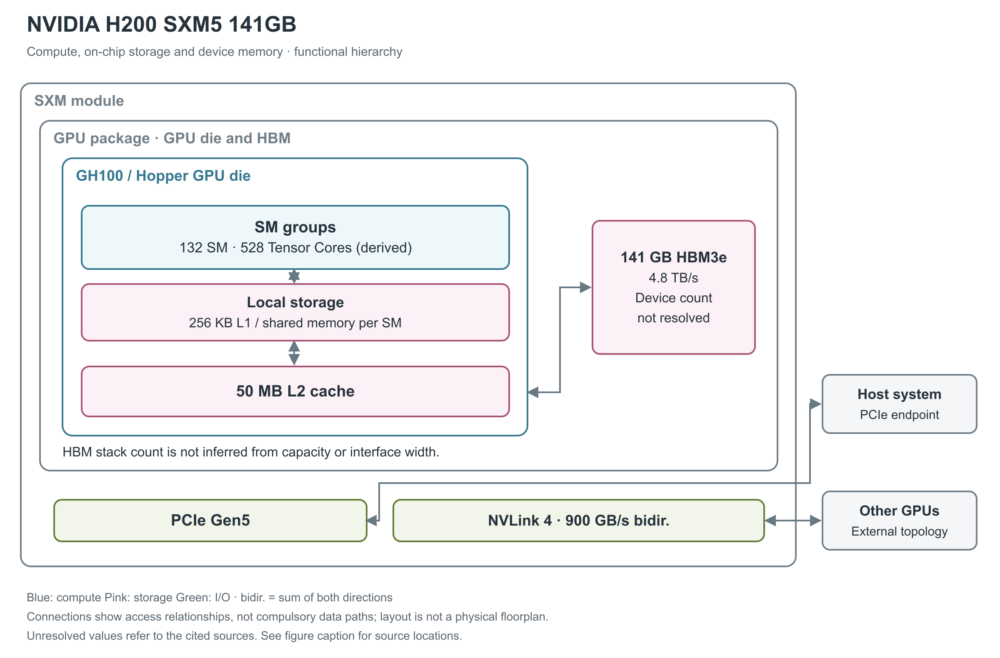

# NVIDIA H200 SXM5 141GB

H200 SXM5 延续 Hopper 的计算组织，把更大容量、更高带宽的 HBM3e（高带宽堆叠内存）配到 GH100 周围。阅读这款产品时，计算核心与内存供给应分开看：它的主要配置特点首先体现在 HBM，而非换用一套全新的 SM。[1, pp.1,4；2, p.4；3, pp.18-21]

图 1：H200 SXM5 的单 GPU 架构。132 SM、50 MB L2 来自 NVIDIA 的 H200 SXM 方框图，141 GB HBM3e 来自该型号数据手册。已有来源没有明确列出 HBM stack 数，因此不按容量猜测数量。528 个 Tensor Core 由 132 SM×每 SM 4 个推得。[2, p.4；3, p.21；1, p.4]

## SM 的执行分区与资源配额

H200 SXM5 启用 132 个 SM（流式多处理器）。每个 Hopper SM 包含 128 个 FP32 CUDA Core、4 个第四代 Tensor Core，并有普通整数、FP64 等执行路径；由此可推得 16,896 个 FP32 CUDA Core 和 528 个 Tensor Core。这里明确区分了 H200 图直接公布的 SM 数与根据共享结构计算的单元总数。[2, p.4；3, pp.21,39-41]

Hopper SM 有四个处理分区，每分区含 32 个 FP32、16 个 FP64、16 个 INT32 执行单元、一个 Tensor Core、8 个 LD/ST（load/store，读写）单元和一个 SFU（特殊函数单元）区块。每分区另有 warp scheduler（warp 调度器，每 warp 含 32 个线程）、dispatch unit、L0 instruction cache 与 16,384×32-bit 寄存器文件；四分区共享 SM 的 L1 instruction cache、TMA（Tensor Memory Accelerator，张量内存搬运器）和数据 L1/shared memory。L0/L1 指令 cache 的容量与寄存器 bank/端口吞吐未由本白皮书给出，不能由框图面积推算。[3, p.21, Figure 7；pp.39-40, Table 3]

一个 SM 的资源上限为 64 warp、2,048 线程、32 block、65,536 个 32-bit 寄存器；单线程最多 255 个寄存器、单 block 最多 1,024 线程。它们是同时约束占用率的上限，无法保证每个 kernel 同时达到所有上限。[3, p.41, Table 4]

## Tensor 与普通算术的产品峰值

Hopper Tensor Core 支持 FP8、FP16、BF16、TF32、FP64 和 INT8 等路径；FP8 支持 E4M3／E5M2 和 FP16／FP32 累加。Transformer Engine 结合硬件与软件管理缩放因子和精度转换。数据手册中低精度 Tensor 项采用结构化稀疏条件，不能直接视为稠密计算能力；原表另注明这些是 preliminary specifications，即可能调整的初步规格。[3, pp.22-24,44-46；1, p.4]

| 运算路径 | 单 GPU 理论峰值 | 原表条件 |
|---|---:|---|
| FP8 Tensor | 3,958 TFLOPS | 结构化稀疏 |
| FP16／BF16 Tensor | 1,979 TFLOPS | 结构化稀疏 |
| TF32 Tensor | 989 TFLOPS | 结构化稀疏 |
| FP64 Tensor | 67 TFLOPS | 未附稀疏条件 |
| 普通 FP32／FP64 | 67／34 TFLOPS | 非 Tensor 路径 |
| INT8 Tensor | 原表单位与整数运算不一致 | 结构化稀疏；详见下文 |

TFLOPS 是每秒万亿次浮点运算；INT8 通常应使用 TOPS 整数运算单位，但这份官方表把 INT8 写为“3,958 TFLOPS”。这是核实过的原表文字，不能作为单位无歧义的整数峰值，本文不替厂商改成 TOPS。表中没有单独公布 dense 值，本文也不以折半值替代原始规格。所引 H200 SXM 专属资料没有给出 base／boost 时钟，不从 H100 或峰值公式补写。[1, p.4]

## 普通算术、特殊函数与每周期吞吐

以下采用 CUDA 编程指南的 compute capability 9.0 列，单位是“结果数/SM/clock”，用于区分指令吞吐与 TFLOPS。一次 FMA（融合乘加）生成一个结果，按 FLOPS 计数时包含一次乘法和一次加法。表中各行属于不同或共享的执行路径，不能求和得到同时可用的总吞吐。[20, §5.4.1, Table 4]

| 原生指令类别 | 每 SM 每周期结果数 | 阅读条件 |
|---|---:|---|
| FP32 add／multiply／FMA | 128 | FMA 的运算计数为表值的两倍 |
| FP64 add／multiply／FMA | 64 | 非 Tensor 路径 |
| FP16 add／multiply／FMA | 256 | packed 16-bit 算术路径，非 Tensor |
| INT32 add／subtract；multiply／IMAD | 64；64 | 乘加和加法须分别计数 |
| FP32 reciprocal／rsqrt／log2／exp2／sin／cos | 16 | 表列原生近似指令；完整数学库函数可能展开为多条指令 |
| INT32 shift／compare／min／max／bitwise | 64 | 按相应原生指令分别读取 |
| popcount／count-leading-zeros | 16 | 位处理，不计入浮点峰值 |
| warp shuffle／warp reduce／warp vote | 32／16／64 | 吞吐单位仍为每线程结果，warp 含 32 个线程 |
| 16-bit／32-bit DPX | 128／64 | fused min/max/add 等动态规划指令，非矩阵乘加 |

Hopper 的 FP16/BF16 Tensor 通路每 SM 每周期吞吐是 Ampere 同类型的两倍；按每 Tensor Core 每周期 512 次 dense FP16/BF16 FMA、每 SM 四个 Tensor Core 计算，即 2,048 FMA 或 4,096 FLOP/SM/clock。FP8 再提高一倍；这些是架构每周期推导，不用于在 SM 数或时钟未公布时反算 SKU 配置。[3, pp.22-23,39-40, Table 3]

## Tensor 操作数、稀疏 metadata 与数值路径

传统 `mma.sync` 把矩阵 fragment 放在 warp 的寄存器中；Hopper 的异步 `wgmma` 由四个连续 warp、共 128 线程协作，A 可来自寄存器或 shared memory，B 来自 shared memory，D 累加结果分布于线程寄存器。这样可以减少 B 的寄存器中转，但结果仍占寄存器，不能把 Hopper TMA 误认成 Blackwell 的 TMEM（Tensor Memory，Tensor 专用片上暂存区）结果存储。[28, §9.7.17, Asynchronous Warpgroup Level Matrix Multiply-Accumulate Instructions]

低精度 sparse MMA 需要给 A 提供压缩数据和位置 metadata，B 按对应索引匹配。FP16/BF16、FP8/INT8 的 `wgmma.sp` 使用 2:4 粒度，TF32 为 1:2；它们都保留一半元素，但 metadata 布局不同。普通 dense 指令不会因为输入恰好有零而自动跳过对应乘加。[28, §9.7.17.6.1, Sparse matrix storage]

数值微基准对 H100/H200 的一个重要观察是：FP8 `mma.sync.aligned.m16n8k32` 在所测工具链中先转换成 FP16，再调用 HMMA；`wgmma.mma_async` 才映射到原生 FP8 QGMMA。因此“输入为 FP8”不足以确定使用哪条硬件路径。原生 FP8 的模型每组累加 32 个乘积，乘积对齐保留 13 个小数位；FP16/BF16→FP32 则每组 16 个乘积、保留 25 个对齐小数位。这里是作者从测试向量归纳的可复现数值模型，不能将该位数当成厂商披露的物理加法器宽度。论文的 H100/H200 未区分全部 SXM/NVL 板型，CUDA 为 12.8，本文不移植其器件峰值或时钟。[23, §4.1.6, pp.11-14, Figure 5, Tables 3-4；§4.2, p.16]

## 寄存器、L1 与共享 L2

线程以 32 个一组的 warp 执行。Tensor Core 负责矩阵乘加，普通 CUDA 算术单元承担其余操作。每 SM 有 256 KB 寄存器文件，另有 256 KB L1 cache／shared memory 组合容量，其中 shared memory 最多 228 KB。图中局部存储框按每 SM 理解；它并非把这些资源集中成全 GPU 共享的一块 SRAM。[3, pp.21,27,40-41]

L2 才是更外层的共享缓存，本款容量为 50 MB。它可保留多次使用的数据，减少对 HBM 的访问。Hopper 的 TMA 张量内存搬运器支持异步数据搬运，线程块集群还允许同一 GPC（Graphics Processing Cluster，图形处理簇） 内多个 SM 使用分布式 shared memory；这些机制与缓存容量承担不同作用。[2, p.4；3, pp.29-37]

## HBM3e 提供容量和带宽

封装内有合计 141 GB 的 HBM3e，单 GPU 峰值带宽为 4.8 TB/s。HBM 是垂直堆叠的 DRAM，它与 GPU 裸片处在同一封装范围，保存容量较大的权重、激活和其他数据；L2、L1 则属于 GPU 片上存储。4.8 TB/s 描述 GPU 与 HBM 之间的供给能力，不代表每个 SM、L2 或 GPU 间互联的带宽。[1, pp.1,4；2, p.4]

GH100 的完整设计图有 12 个 512-bit 内存控制器，但当前 H200 型号资料没有单列实际控制器使能数和 HBM 堆栈数。图保留 HBM 聚合区域，不把完整设计图、H100 配置或总容量当作 H200 封装布局证据。GH100 采用 TSMC 4N、814 mm²、约 800 亿晶体管，仍是单片式计算裸片。[3, pp.17-19,40；2, p.4]

## 片上存储的可分配容量和实际访问路径

shared memory 的 bank 是并行访问的基本单元。官方指南说明，compute capability 5.x 及更新架构使用 32 个 bank，连续 32-bit 字映射到连续 bank，每 bank 每周期提供 32 bit。由此得到无冲突、各 bank 同时服务时的 bank 侧理想上限 32×4＝128 B/SM/clock。同一 bank 的不同地址会拆分服务，同一地址的读可以广播。这一推导既不是 L1 cache 命中带宽，也不是 Tensor Core 全部操作数路径或整个 GPU 的持续带宽；实际吞吐还受发射和访问模式限制。[21, §Shared Memory and Memory Banks]

shared-memory carveout 可选 0／8／16／32／64／100／132／164／196／228 KB；每 block 预留 1 KB，单 block 最高可寻址 227 KB。静态分配超过 48 KB 的兼容界限，需要转为动态分配并 opt-in。228 KB 的可编程容量与 256 KB 的统一 L1/shared 容量不是两个可相加的 SRAM。[22, §§1.4.1.1,1.4.2.4]

Hopper 的 L2 采用 partitioned crossbar，把 GPC 的数据访问尽量留在直接相连的 L2 分区；驻留控制可选择更应保留或驱逐的数据。官方说明 L2 到 SM 的带宽提高，但没有给出可移植到本卡的每方向绝对数。ILC（inline compression，在线数据压缩）可对分配的内存区自动选压缩算法或不压缩，减少实际搬运字节；它仍保留未压缩大小的内存分配，不能把压缩收益直接当作可用 HBM 容量增加。[3, p.37；22, §§1.4.2.2-1.4.2.3]

TMA 接受 1D 至 5D 张量的 descriptor，由一个线程发起 global↔shared 搬运，并处理 stride、坐标和边界；shared→global 方向还能在支持的类型上做 add/min/max/and/or 等逐元素归约。TMA 不需要用寄存器逐元素中转数据，计算 warp 可以并行处理先前 tile。异步 transaction barrier 同时等待线程 arrive 和预期事务字节数，避免只等线程而过早读取仍在途的数据。[3, pp.32-35, Figures 18-20；22, §1.4.1.2]

Thread Block Cluster 把多个 block 同时安排在一个 GPC 内；DSM（Distributed Shared Memory，分布式 shared memory）允许 load/store/atomic 直接访问同一 cluster 的其他 block，数据通过专用 SM-to-SM 网络交换。该路径可与 L2 访问并行，官方建议合并访问并对齐到 32 B segment；跨 cluster 不能据此直接访问任意 SM 的 shared memory。可移植 cluster 上限是 8 block，H100 可 opt-in 16 block，但较大 cluster 会限制可同时驻留的 block 数。[3, pp.29-30；22, §1.4.1.3]

## 从 SXM5 模组到多 GPU 服务器

H200 SXM5 通过 PCIe Gen5 与主机连接，官方 H200 方框图写明 128 GB/s 双向带宽。第四代 NVLink 的单 GPU 双向端点带宽为 900 GB/s。两者与 4.8 TB/s HBM 带宽分别处于图的不同位置。[2, p.4；1, p.4]

官方发布稿说明，四卡和八卡 HGX H200 server board 与 HGX H100 系统的硬件和软件兼容，合作伙伴可升级已有系统设计。这是系统平台兼容声明，不能据此认定任意 H100 服务器都允许直接更换模组。[5, NVIDIA H200 Form Factors]

NVLink 允许 GPU 访问对端内存，普通连接使用共同地址空间与 GPU 物理地址路由；这不能等同于缓存一致或一个统一的系统内存池。HGX 服务器中的 NVSwitch 和 SHARP 归约属于模组外系统设施，所引资料未列单 GPU 独立的跨设备集合通信引擎。[3, pp.15,47-48]

H200 支持 MIG（Multi-Instance GPU，多实例 GPU），最多分为 7 个硬件隔离实例。当前 141 GB 配置的 profile 有 1g.18gb、1g.35gb、2g.35gb、3g.71gb、4g.71gb、7g.141gb 及带媒体资源的 1g.18gb+me；18 GB 是最小 profile 的名称所示容量，不能理解为任意分区都相同。[6, Supported GPUs; H200 MIG Profiles, Table 11]

H200 专门 profile 表还给出计算与存储份额：1g.18gb 和 1g.35gb 都使用 1/7 的 SM、1/8 的 L2 和一个 copy engine，HBM 份额分别为 1/8 和 1/4；2g.35gb 保持 1/4 HBM，同时使用 2/7 SM、1/4 L2 和两个 copy engine。同一块 GPU 可以提供不同存算比的隔离实例，整卡配比不能直接代表任意实例。[6, H200 MIG Profiles, Table 11]

## 功耗与可靠性

单模组最高 TDP（热设计功耗） 为 700 W，可配置；风冷或液冷如何实现由服务器方案决定，不能把 H200 NVL 的 PCIe 双槽散热描述移到 SXM5。Hopper 的 HBM、L2、L1、寄存器具备 SECDED ECC 保护，H200 还支持 Confidential Computing，保护运行中的数据和执行环境。[1, p.4；3, p.38]

NVIDIA 在 2023 年 11 月公布 H200。封装基板、stack 数和片内网络的持续性能未在所引型号资料中给出。[5, opening；2, p.4]

## 参考资料

页码采用文内印刷页码；独立微基准采用 PDF 页序。网页按所列章节、表或图定位。

[1] NVIDIA，*NVIDIA H200 Tensor Core GPU Datasheet*，3512650，Nov. 2024。[本地 PDF](../../原始资料/论文/NVIDIA_GPU/90_官方白皮书与技术资料/2024_NVIDIA_H200_Tensor_Core_GPU_Datasheet_3512650.pdf)

[2] NVIDIA，*CUDA Programming and Optimization*，2024。[本地 PDF](../../原始资料/论文/NVIDIA_GPU/90_官方白皮书与技术资料/2024_NVIDIA_CUDA_Programming_and_Optimization_H200.pdf)

[3] NVIDIA，*NVIDIA H100 Tensor Core GPU Architecture*，v1.04（本地版本版权页为 2023）。[本地 PDF](../../原始资料/论文/NVIDIA_GPU/01_厂商直接架构论文/2022_NVIDIA_H100_Tensor_Core_GPU_Architecture_Whitepaper_v1.04.pdf)

[5] NVIDIA，*NVIDIA Supercharges Hopper, the World’s Leading AI Computing Platform*，2023-11-13。[原文](https://nvidianews.nvidia.com/news/nvidia-supercharges-hopper-the-worlds-leading-ai-computing-platform) [本地原文](../../原始资料/网页快照/NVIDIA/产品详解补充/2026-09-17/ref-ed86308bd23b-nvidia-supercharges-hopper-the-worlds-leading-ai-computing-platform.html)

[6] NVIDIA，*MIG User Guide: Supported GPUs and H200 MIG Profiles*。[原文](https://docs.nvidia.com/datacenter/tesla/mig-user-guide/supported-gpus.html)；[原文](https://docs.nvidia.com/datacenter/tesla/mig-user-guide/supported-mig-profiles.html) [本地原文 1](../../原始资料/网页快照/NVIDIA/产品详解补充/2026-09-17/ref-724e4856b45e-supported-gpus.html) [本地原文 2](../../原始资料/网页快照/NVIDIA/产品详解补充/2026-09-17/ref-45475f30f152-supported-mig-profiles.html)

[20] NVIDIA，*CUDA C++ Programming Guide*，12.8.1，§5.4.1 Table 4。[原文](https://docs.nvidia.com/cuda/archive/12.8.1/cuda-c-programming-guide/index.html#arithmetic-instructions) [本地原文](../../原始资料/网页快照/NVIDIA/CUDA-PTX/2026-09-17/cuda-programming-12.8.1.html)

[21] NVIDIA，*CUDA C++ Best Practices Guide*，13.4，§Shared Memory and Memory Banks。[原文](https://docs.nvidia.com/cuda/cuda-c-best-practices-guide/index.html#shared-memory-and-memory-banks) [本地原文](../../原始资料/网页快照/NVIDIA/CUDA-PTX/2026-09-17/cuda-best-practices-13.4.html)

[22] NVIDIA，*Hopper Tuning Guide*，13.4。[原文](https://docs.nvidia.com/cuda/hopper-tuning-guide/index.html) [本地原文](../../原始资料/网页快照/NVIDIA/产品详解补充/2026-09-17/ref-659a0c19fa52-index.html)

[23] F. A. Khattak、M. Mikaitis，*Accurate Models of NVIDIA Tensor Cores*，本地版本为 2026-06-11 v4。[本地 PDF](../../原始资料/论文/NVIDIA_GPU/02_独立逆向与微基准/2025_Accurate_Models_NVIDIA_Tensor_Cores.pdf)

[28] NVIDIA，*Parallel Thread Execution ISA*，9.4。[原文](https://docs.nvidia.com/cuda/parallel-thread-execution/) [本地原文](../../原始资料/网页快照/NVIDIA/CUDA-PTX/2026-09-17/ptx-9.4.html)
