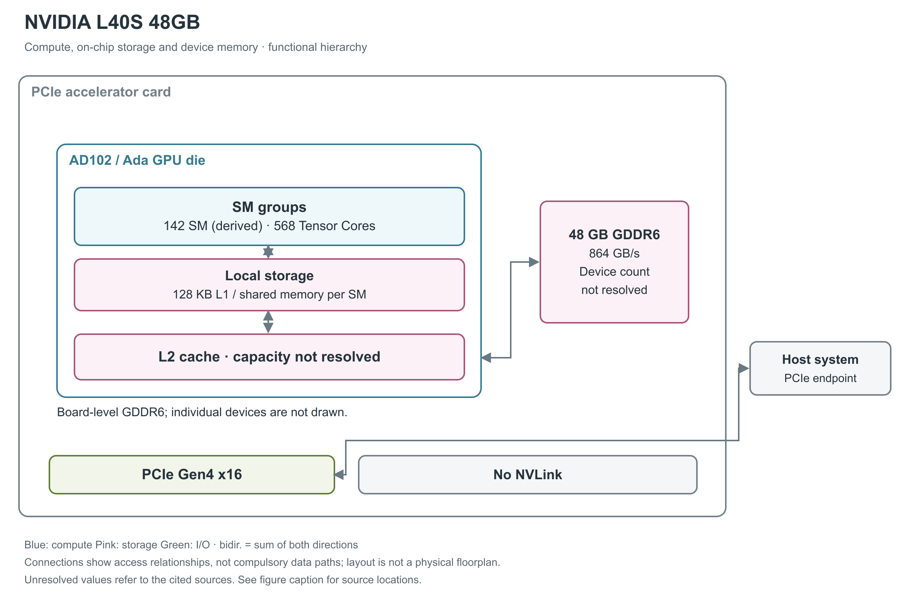

# NVIDIA L40S 48GB

L40S 是面向生成式 AI、图形和视频的数据中心 Ada 加速卡。它使用一颗 AD102 GPU 和板上 GDDR6，保留 CUDA、Tensor、RT 与媒体处理能力，采用普通 PCIe 插卡形态。[1, pp.1-3；2, Overview；5, Ada Lovelace]

图 1：L40S 的计算与存储层级。142 SM 根据官方 18,176 CUDA Core÷每 SM 128 个推得；L2 存在，但所引型号资料未列实际容量。GDDR6 用总容量框表示，没有从接口宽度反推颗粒数。[2, GPU Specifications；3, pp.7-12；1, p.3] 图中 PCIe 端点及无 NVLink 的条件另见产品简报。[1, p.2]

## AD102 的计算资源怎样分工

L40S 公布的资源为 18,176 个 CUDA Core、568 个第四代 Tensor Core、142 个第三代 RT Core。Ada 每 SM 有 128 个 CUDA Core、4 个 Tensor Core、1 个 RT Core，由此可精确推导出 142 个 SM；每 TPC（Texture Processing Cluster，纹理处理簇）含两个 SM，但所引资料没有给出本卡 TPC 的实际使能情况，不能只用 142÷2 认定使能 TPC 数。GPC（Graphics Processing Cluster，图形处理簇）数也未列，因此图只标出有依据的 SM 数。[2, GPU Specifications；3, pp.7-8]

SM（流式多处理器）用 warp（32 个线程组成的调度组） 组织线程执行。CUDA 路径处理一般算术，Tensor Core 做矩阵运算，RT Core 加速光线追踪。第三代 RT Core 还包括 Opacity Micromap 和 Displaced Micro-Mesh 相关单元；整卡另有 3 个 NVENC 与 3 个 NVDEC 视频引擎。它们服务的计算不同，各自峰值不能合成一个统一速度指标。[3, pp.8-11,30；2, GPU Specifications]

AD102 使用 TSMC 4N，裸片约 608.5 mm²、763 亿晶体管。白皮书中的完整 AD102 有 144 SM，不能用完整设计图覆盖 L40S 的 142 SM 使能状态。[3, pp.7-8,12-14]

## 四个处理分区的共享执行资源

Ada 的四个 SM 分区各有 64 KB 寄存器、L0 instruction cache、warp scheduler、dispatch unit、一个 Tensor Core、4 个 LD/ST（load/store，读写）单元和一个 SFU（特殊函数单元）区块。每分区的 CUDA 资源分为 16 个专用 FP32 与 16 个 FP32/INT32 共享单元。因此每 SM 可以提供 128 个 FP32 结果/clock，或组合成 64 个 FP32 加 64 个 INT32 结果/clock；不能把满 FP32 和满 INT32 峰值相加。地址生成、整数索引和浮点计算会影响共享流水线的实际利用率。[3, pp.10-11, Figure 5]

L0 是分区内的指令缓存；下方的 128 KB unified L1/shared 则存数据。所引框图没有给出 L0 容量、更高层指令缓存的组织、寄存器 bank/端口数或整套寄存器读写带宽。LD/ST 单元的数量也不能直接当作每周期 cache line 数。[3, pp.10-12]

## 计算数据中的已知值与疑点

产品 base／boost 时钟为 1,065／2,520 MHz。Tensor Core 支持 FP8、FP16、BF16、TF32、INT8 和 INT4；FP8／FP16 可累加到 FP16 或 FP32，BF16 使用 FP32 累加。官方性能页注明峰值以 boost 条件计。[1, p.2；3, pp.24,27,30；2, Highlights note]

下表沿用产品页数值。TFLOPS／TOPS 分别是每秒万亿次浮点／整数运算；结构化稀疏值要求相应的数据格式与执行路径。[2, GPU Specifications and note]

| 运算路径 | Dense 稠密 | 结构化稀疏 |
|---|---:|---:|
| 普通 FP32 | 91.6 TFLOPS | 不适用 |
| TF32 Tensor | 183 TFLOPS | 366 TFLOPS |
| FP16／BF16 Tensor | 原表两列关系待澄清，见下文 | 原表两列关系待澄清，见下文 |
| FP8 Tensor | 733 TFLOPS | 1,466 TFLOPS |
| INT8 Tensor | 733 TOPS | 1,466 TOPS |
| INT4 Tensor | 原表与 INT8 相同，见下文 | 原表与 INT8 相同，见下文 |

产品页原表确实写为 FP16／BF16 dense 362.05 TFLOPS、sparse 733 TFLOPS，两列并不满足两倍关系；INT4 原表确实写为 dense 733 TOPS、sparse 1,466 TOPS，与 INT8 行完全相同。这些是已核对的原文值，但其口径仍有疑点，不能作为无歧义峰值参与精确比较，也不能按相邻精度或架构规律自行改数。RT Core 另有 212 TFLOPS 的独立指标，不与上述矩阵、普通算术相加。[2, GPU Specifications and note]

## 普通算术、特殊函数与每周期吞吐

以下采用 CUDA 编程指南的 compute capability 8.9 列，单位是“结果数/SM/clock”，用于区分指令吞吐与 TFLOPS。一次 FMA（融合乘加）生成一个结果，按 FLOPS 计数时包含一次乘法和一次加法。表中各行属于不同或共享的执行路径，不能求和得到同时可用的总吞吐。[20, §5.4.1, Table 4]

| 原生指令类别 | 每 SM 每周期结果数 | 阅读条件 |
|---|---:|---|
| FP32 add／multiply／FMA | 128 | FMA 的运算计数为表值的两倍 |
| FP64 add／multiply／FMA | 2 | 非 Tensor 路径 |
| FP16 add／multiply／FMA | 128 | packed 16-bit 算术路径，非 Tensor |
| INT32 add／subtract；multiply／IMAD | 64；64 | 乘加和加法须分别计数 |
| FP32 reciprocal／rsqrt／log2／exp2／sin／cos | 16 | 表列原生近似指令；完整数学库函数可能展开为多条指令 |
| INT32 shift／compare／min／max／bitwise | 64 | 按相应原生指令分别读取 |
| popcount／count-leading-zeros | 16 | 位处理，不计入浮点峰值 |
| warp shuffle／warp reduce／warp vote | 32／16／64 | 吞吐单位仍为每线程结果，warp 含 32 个线程 |

FP64 每周期结果数只有 2，是普通 CUDA 算术路径；本卡资料没有列出 FP64 Tensor 峰值。精度相同也必须核对累加器：Ada 白皮书在 RTX 4090 表中把 FP16 与 FP32 累加分别列出，但 L4/L40S 型号峰值表并未这样拆列，所以前文的产品峰值不能无条件套给所有累加模式，更不能把 RTX 4090 的特定速率折算为本卡已公布数据。[20, §5.4.1, Table 4；3, pp.29-30, Table 2]

## L40S 的原生 FP8 数值行为

针对 L40S 的数值研究使用 CUDA 12.9，确认 FP8 `mma.sync.aligned.m16n8k32` 映射为 QMMA。其原生 FP8 内积模型每组 16 个乘积，对齐阶段保留 13 个小数位；FP32 输出最后采用截断、FP16 输出采用 round-to-nearest-even。FP16/BF16→FP32 的模型则每组 8 个乘积、对齐 24 个小数位。输出标作 FP32，仍不代表每个乘积都按普通 IEEE FP32 FMA 逐项舍入。[23, §4.1.4, pp.10-11；Tables 3-4, pp.14-15；§4.2, p.16]

这些位数来自定向测试向量与随机向量的行为匹配，不是芯片物理 netlist。论文的 FP8 数值模型可补充本卡指令语义，但没有为 L40S 48GB 提供可移植的全套 cache/shared-memory 带宽和延迟。[23, §§4.1.4,4.2]

## 片上 cache 与板上显存

每 SM 有 256 KB 寄存器文件和 128 KB 合并的 L1 cache／shared memory。shared memory 由程序安排数据复用，L1 是硬件管理的缓存；两者共享容量。GPU 还有更外层的 L2，但现有 L40S 专属资料没有直接公布实际容量，因此图不沿用完整 AD102 或 L40 的 98,304 KB。[3, pp.8,12,37]

板上 48 GB GDDR6 通过 384-bit 接口连接 GPU，内存频率 9,001 MHz，峰值带宽 864 GB/s，并启用 ECC。GDDR6 与 GPU 不同于 HBM（高带宽堆叠内存） 同封装组织；图仅标明板上内存关系，所引材料未给出单颗 DRAM 的容量和排列。[1, pp.3-4, Tables 2-3]

## shared memory 配额与搬运粒度

每 SM 最多驻留 48 warp，即由 32 threads/warp 推得 1,536 线程，最多 24 个 block；64K 个 32-bit 寄存器由驻留线程共享，单线程最多 255 个。shared memory 最高 100 KB，单 block 可寻址 99 KB，二者差别来自每 block 的 1 KB 保留量。可选 carveout 为 0／8／16／32／64／100 KB；超过 48 KB 的分配需要显式启用动态 shared memory。[22, §§1.4.1.1,1.4.2.2；20, §Compute Capabilities]

shared memory 的 bank 是并行访问的基本单元。官方指南说明，compute capability 5.x 及更新架构使用 32 个 bank，连续 32-bit 字映射到连续 bank，每 bank 每周期提供 32 bit。由此得到无冲突、各 bank 同时服务时的 bank 侧理想上限 32×4＝128 B/SM/clock。同一 bank 的不同地址会拆分服务，同一地址的读可以广播。这一推导既不是 L1 cache 命中带宽，也不是 Tensor Core 全部操作数路径或整个 GPU 的持续带宽；实际吞吐还受发射和访问模式限制。[21, §Shared Memory and Memory Banks]

Ada 的 unified L1/texture cache 合并 warp 请求，减少重复或碎片化的数据取回；L2 的驻留控制允许软件对有复用价值的数据设置保留偏好。global memory 的 CUDA `local` 地址空间仍可能落在设备 DRAM 中，例如寄存器溢出，名称并不保证是片上 local SRAM。现有专属资料没有给出本卡 L1/L2 读写带宽、cache-hit 延迟、TLB 容量或可持续片内网络带宽，因此这些项不能用 RTX 4090 或 L40 的微基准补齐。[22, §1.4.2；20, §§5.3.2.2,5.3.2.3]

## PCIe 连接与服务器条件

L40S 使用 PCIe Gen4 x16，产品页明确为 64 GB/s 双向带宽，也可协商 Gen4 x8 或 Gen3 x16。它不支持 NVLink，也不支持 MIG 多实例 GPU，因此图没有独立 GPU 间链路或硬件隔离分区。多卡通信的表现取决于主机和外部系统，不能借用 H100 SXM 的 NVSwitch 结构。[1, pp.2,6-7；2, Interconnect Interface; NVLink Support; MIG Support]

板卡为全高全长双槽，尺寸 4.4×10.5 英寸，采用双向被动散热器并配 4 个 DisplayPort 1.4a。默认和最大板级功耗为 350 W，辅助电源为 16-pin 接口；供电 sense 档位不满足要求时卡不能启动。板卡依靠服务器气流，350 W 是产品上限而非任意程序的持续功耗。[1, pp.1-2,5,10-13；2, GPU Specifications]

虚拟化方面支持 SR-IOV（单根 I/O 虚拟化）的 32 个 VF（虚拟功能），与 MIG 的计算、缓存和内存硬件划分不同。[1, p.3, Table 3]

板上 CEC 安全控制机制提供 secure boot、回滚保护、密钥撤销、带外安全升级、恢复与远程认证。L40S 于 2023 年 8 月发布，当前可读资料对板卡配置较完整，但 L2 实际容量及上述峰值疑点仍未解决。[1, pp.3-4,7；4, opening；2, GPU Specifications]

## 参考资料

页码采用文内印刷页码；独立微基准采用 PDF 页序。网页按所列章节、表或图定位。

[1] NVIDIA，*NVIDIA L40S GPU Accelerator Product Brief*，PB-11470-001_v02，2023-08-08。[本地 PDF](../../原始资料/论文/NVIDIA_GPU/90_官方白皮书与技术资料/2023_NVIDIA_L40S_GPU_Accelerator_Product_Brief_v02.pdf)

[2] NVIDIA，*NVIDIA L40S GPU for AI and Graphics Performance*。[原文](https://www.nvidia.com/en-us/data-center/l40s/) [本地原文](../../原始资料/网页快照/NVIDIA/产品详解补充/2026-09-17/ref-fbc69a181308-l40s.html)

[3] NVIDIA，*NVIDIA Ada GPU Architecture*，v2.02（本地版本版权页为 2023）。[本地 PDF](../../原始资料/论文/NVIDIA_GPU/90_官方白皮书与技术资料/2022_NVIDIA_Ada_Architecture_Whitepaper.pdf)

[4] NVIDIA，*NVIDIA, Global Data Center System Manufacturers to Supercharge Generative AI and Industrial Digitalization*，2023-08-08。[原文](https://nvidianews.nvidia.com/news/nvidia-global-data-center-system-manufacturers-to-supercharge-generative-ai-and-industrial-digitalization) [本地原文](../../原始资料/网页快照/NVIDIA/产品详解补充/2026-09-17/ref-9487dbd6c067-nvidia-global-data-center-system-manufacturers-to-supercharge-generative-ai-and-industrial-digitalization.html)

[5] NVIDIA，*Hardware Setup and Requirements: NVIDIA Omniverse NuRec*，更新于 2026-08-25。[原文](https://docs.nvidia.com/nurec/basics/hardware.html) [本地原文](../../原始资料/网页快照/NVIDIA/产品详解补充/2026-09-17/ref-123be1e84f88-hardware.html)

[20] NVIDIA，*CUDA C++ Programming Guide*，12.8.1，§5.4.1 Table 4。[原文](https://docs.nvidia.com/cuda/archive/12.8.1/cuda-c-programming-guide/index.html#arithmetic-instructions) [本地原文](../../原始资料/网页快照/NVIDIA/CUDA-PTX/2026-09-17/cuda-programming-12.8.1.html)

[21] NVIDIA，*CUDA C++ Best Practices Guide*，13.4，§Shared Memory and Memory Banks。[原文](https://docs.nvidia.com/cuda/cuda-c-best-practices-guide/index.html#shared-memory-and-memory-banks) [本地原文](../../原始资料/网页快照/NVIDIA/CUDA-PTX/2026-09-17/cuda-best-practices-13.4.html)

[22] NVIDIA，*Ada Tuning Guide*，13.4。[原文](https://docs.nvidia.com/cuda/ada-tuning-guide/index.html) [本地原文](../../原始资料/网页快照/NVIDIA/产品详解补充/2026-09-17/ref-1b87ffef1f91-index.html)

[23] F. A. Khattak、M. Mikaitis，*Accurate Models of NVIDIA Tensor Cores*，本地版本为 2026-06-11 v4。[本地 PDF](../../原始资料/论文/NVIDIA_GPU/02_独立逆向与微基准/2025_Accurate_Models_NVIDIA_Tensor_Cores.pdf)
