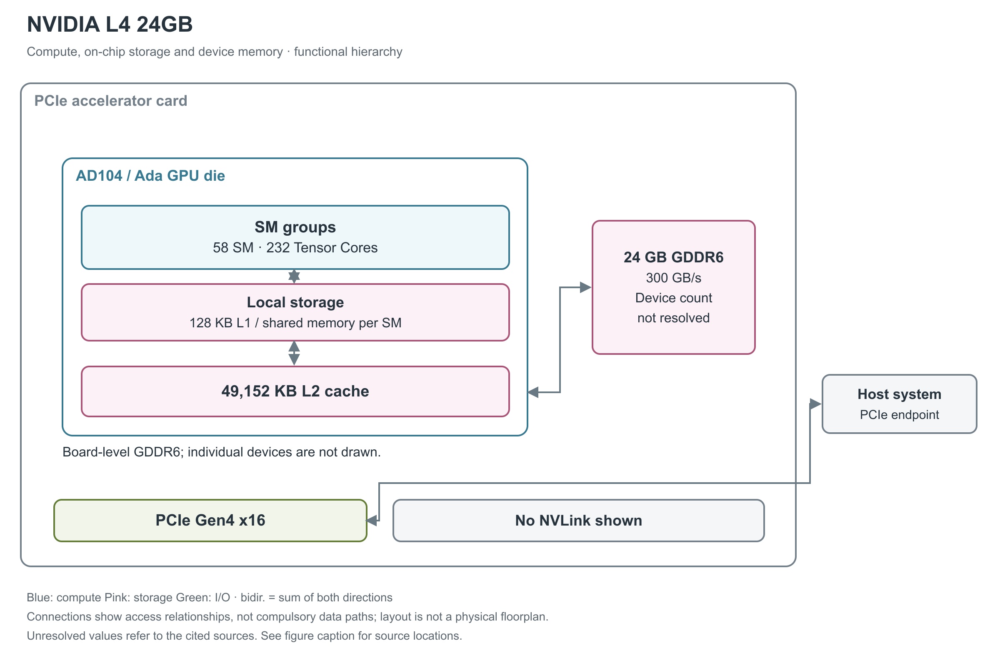

# NVIDIA L4 24GB

L4 是面向 AI 推理、视频和图形工作负载的低功耗 Ada 加速卡。它采用板上 GDDR6，而非与计算裸片同封装的 HBM（高带宽堆叠内存），经 GPU 的内存接口访问。[1, pp.1-3；2, pp.39-40；4, L4]

图 1：AD104 GPU 内的 SM、局部存储和 L2，以及板上的 GDDR6。图以聚合框表示显存，不猜测 DRAM 封装颗数；L2 的 49,152 KB 和 58 SM 取自 L4 专属规格表。[2, pp.10-12,39-40；1, pp.2-3]

## 一张小卡保留三类计算能力

L4 采用 TSMC 4N 工艺的 Ada 架构 AD104 GPU，启用 5 个 GPC（Graphics Processing Cluster，图形处理簇）、29 个 TPC（Texture Processing Cluster，纹理处理簇） 和 58 个 SM（流式多处理器）。每 SM 有普通 CUDA 算术单元、第四代 Tensor Core 矩阵单元和第三代 RT Core 光线追踪单元。整卡共有 7,424 个 CUDA Core、232 个 Tensor Core、58 个 RT Core，因此它的用途不局限于矩阵乘法。[2, pp.8-12,39-40]

Ada SM 以 warp（32 个线程组成的调度组） 调度线程，分为四个处理分区。每 SM 有 256 KB 寄存器文件及 128 KB 统一 L1 cache／shared memory：L1 缓存访问数据，shared memory 是程序显式管理的局部工作区，两者共享同一容量。各处理分区的调度与执行资源如下节所述。[2, pp.8-12]

视频链路另有 2 个 NVENC 编码器、4 个 NVDEC 解码器和 4 个 JPEG 解码器。它们是独立于 Tensor Core 峰值的专用单元；执行视频与 AI 联合流程时，不能只用 FP8 数字描述整条处理链。[2, pp.39-40]

## 四个处理分区的共享执行资源

Ada 的四个 SM 分区各有 64 KB 寄存器、L0 instruction cache、warp scheduler、dispatch unit、一个 Tensor Core、4 个 LD/ST（load/store，读写）单元和一个 SFU（特殊函数单元）区块。每分区的 CUDA 资源分为 16 个专用 FP32 与 16 个 FP32/INT32 共享单元。因此每 SM 可以提供 128 个 FP32 结果/clock，或组合成 64 个 FP32 加 64 个 INT32 结果/clock；不能把满 FP32 和满 INT32 峰值相加。地址生成、整数索引和浮点计算会影响共享流水线的实际利用率。[2, pp.10-11, Figure 5]

L0 是分区内的指令缓存；下方的 128 KB unified L1/shared 则存数据。所引框图没有给出 L0 容量、更高层指令缓存的组织、寄存器 bank/端口数或整套寄存器读写带宽。LD/ST 单元的数量也不能直接当作每周期 cache line 数。[2, pp.10-12]

## Tensor、CUDA 和 RT 峰值分开读

第四代 Tensor Core 支持 FP8、FP16、BF16、TF32、INT8 和 INT4；FP8／FP16 可采用 FP16 或 FP32 累加，BF16 使用 FP32 累加。下表是白皮书中直接列出的单卡数字，TFLOPS／TOPS 分别表示每秒万亿次浮点／整数操作。[2, pp.24,27,30,40]

| 运算路径 | Dense 稠密 | 结构化稀疏 |
|---|---:|---:|
| 普通 FP32 | 30.3 TFLOPS | 不适用 |
| TF32 Tensor | 60 TFLOPS | 120 TFLOPS |
| FP16／BF16 Tensor | 121 TFLOPS | 242 TFLOPS |
| FP8 Tensor | 242 TFLOPS | 485 TFLOPS |
| INT8 Tensor | 242 TOPS | 485 TOPS |
| INT4 Tensor | 484 TOPS | 969 TOPS |

原表因四舍五入并非每一对都精确等于两倍，保留 242／485、484／969 的原始显示值。RT Core 的单独指标为 73.1 TFLOPS，不与 CUDA 或 Tensor 数字相加。产品 base／boost 频率分别为 795／2,040 MHz。[2, p.40；1, p.2]

## 普通算术、特殊函数与每周期吞吐

以下采用 CUDA 编程指南的 compute capability 8.9 列，单位是“结果数/SM/clock”，用于区分指令吞吐与 TFLOPS。一次 FMA（融合乘加）生成一个结果，按 FLOPS 计数时包含一次乘法和一次加法。表中各行属于不同或共享的执行路径，不能求和得到同时可用的总吞吐。[20, §5.4.1, Table 4]

| 原生指令类别 | 每 SM 每周期结果数 | 阅读条件 |
|---|---:|---|
| FP32 add／multiply／FMA | 128 | FMA 的运算计数为表值的两倍 |
| FP64 add／multiply／FMA | 2 | 非 Tensor 路径 |
| FP16 add／multiply／FMA | 128 | packed 16-bit 算术路径，非 Tensor |
| INT32 add／subtract；multiply／IMAD | 64；64 | 乘加和加法须分别计数 |
| FP32 reciprocal／rsqrt／log2／exp2／sin／cos | 16 | 表列原生近似指令；完整数学库函数可能展开为多条指令 |
| INT32 shift／compare／min／max／bitwise | 64 | 按相应原生指令分别读取 |
| popcount／count-leading-zeros | 16 | 位处理，不计入浮点峰值 |
| warp shuffle／warp reduce／warp vote | 32／16／64 | 吞吐单位仍为每线程结果，warp 含 32 个线程 |

FP64 每周期结果数只有 2，是普通 CUDA 算术路径；本卡资料没有列出 FP64 Tensor 峰值。精度相同也必须核对累加器：Ada 白皮书在 RTX 4090 表中把 FP16 与 FP32 累加分别列出，但 L4/L40S 型号峰值表并未这样拆列，所以前文的产品峰值不能无条件套给所有累加模式，更不能把 RTX 4090 的特定速率折算为本卡已公布数据。[20, §5.4.1, Table 4；2, pp.29-30, Table 2]

## 媒体管线与矩阵管线的交界

L4 的 NVENC 支持 AV1 编码，视频解码、JPEG 解码与 Tensor 运算各由专用引擎或 SM 处理；硬件块的数量只能说明可用资源，流数还受 codec、分辨率、帧率和驱动配置约束。白皮书 L4 表中的 OFA 行显示“281”，但未在该行明确单位，本文不将它误读成 281 个光流引擎。[2, pp.24,39-40, Table 5]

现有逆向材料中的 L40S、RTX 4090、RTX 1000 Ada 等测试可说明同架构的研究方法，但没有提供 L4 的对应实测配置。本文保留官方 per-SM 吞吐与 L4 自身峰值，不给它添加其他 Ada 卡的延迟保证。[20, §5.4.1；2, Table 5]

## L2 与板上 GDDR6

L4 的实际 L2 cache 为 49,152 KB，是 GPU 共享缓存。更外层的 24 GB GDDR6 位于板上，经 192-bit 接口连接 GPU，峰值带宽 300 GB/s。GDDR6 容量负责承载较大的模型与数据，L2 则用于片上复用；二者既不在同一物理位置，也没有相同的访问代价。[2, p.40；1, p.3]

内存频率在产品简报中为 6,251 MHz。GDDR6 的 ECC 默认启用，并可由软件关闭；资料没有给出单个显存颗粒容量、总颗数及正反面布局，因此图仅展示其与 GPU 的关系。所引官方文档也未披露 AD104 裸片面积与晶体管数。[1, p.3, Tables 2-3；2, pp.12,39-40]

## shared memory 配额与搬运粒度

每 SM 最多驻留 48 warp，即由 32 threads/warp 推得 1,536 线程，最多 24 个 block；64K 个 32-bit 寄存器由驻留线程共享，单线程最多 255 个。shared memory 最高 100 KB，单 block 可寻址 99 KB，二者差别来自每 block 的 1 KB 保留量。可选 carveout 为 0／8／16／32／64／100 KB；超过 48 KB 的分配需要显式启用动态 shared memory。[22, §§1.4.1.1,1.4.2.2；20, §Compute Capabilities]

shared memory 的 bank 是并行访问的基本单元。官方指南说明，compute capability 5.x 及更新架构使用 32 个 bank，连续 32-bit 字映射到连续 bank，每 bank 每周期提供 32 bit。由此得到无冲突、各 bank 同时服务时的 bank 侧理想上限 32×4＝128 B/SM/clock。同一 bank 的不同地址会拆分服务，同一地址的读可以广播。这一推导既不是 L1 cache 命中带宽，也不是 Tensor Core 全部操作数路径或整个 GPU 的持续带宽；实际吞吐还受发射和访问模式限制。[21, §Shared Memory and Memory Banks]

Ada 的 unified L1/texture cache 合并 warp 请求，减少重复或碎片化的数据取回；L2 的驻留控制允许软件对有复用价值的数据设置保留偏好。global memory 的 CUDA `local` 地址空间仍可能落在设备 DRAM 中，例如寄存器溢出，名称并不保证是片上 local SRAM。现有专属资料没有给出本卡 L1/L2 读写带宽、cache-hit 延迟、TLB 容量或可持续片内网络带宽，因此这些项不能用 RTX 4090 或 L40 的微基准补齐。[22, §1.4.2；20, §§5.3.2.2,5.3.2.3]

## 主机连接、虚拟化与散热

L4 的主机接口为 PCIe Gen4 x16，也能以 Gen4 x8 或 Gen3 x16 工作。产品页列出 64 GB/s headline，但该项未明确方向，不把它写作单向带宽。当前资料没有给出 NVLink 或其他专用 GPU 间互联；多卡部署依赖服务器自身的连接与软件。[1, pp.2,6-7；3, Product Specifications]

L4 支持时间分片 vGPU 及 SR-IOV（单根 I/O 虚拟化），产品简报列出 32 个虚拟功能，但它不支持 MIG 多实例 GPU。32 个虚拟功能不意味着 32 个具有独立计算、缓存和内存配额的 MIG 硬件分区。[1, pp.2,6-7；5, Recommended NVIDIA GPUs, Table 1]

卡尺寸为 2.71×6.67 英寸，单槽、低矮型，采用支持两种气流方向的被动散热器。默认及最大总板级功耗为 72 W，最低为 40 W；散热器没有主动风扇，仍需服务器提供气流。设备安全机制包括 secure boot、固件安全升级、回滚保护和安全恢复。[1, pp.1-3,5,7-8]

L4 在 2023 年 3 月发布。所引官方资料未公开片内网络拓扑及多卡缓存一致性等细节；图中没有补画这些能力。[4, L4；1, pp.2-7]

## 参考资料

页码采用文内印刷页码；独立微基准采用 PDF 页序。网页按所列章节、表或图定位。

[1] NVIDIA，*NVIDIA L4 GPU Accelerator Product Brief*，PB-11316-001_v01，2023-03-09。[本地 PDF](../../原始资料/论文/NVIDIA_GPU/90_官方白皮书与技术资料/2023_NVIDIA_L4_GPU_Accelerator_Product_Brief_v01.pdf)

[2] NVIDIA，*NVIDIA Ada GPU Architecture*，v2.02（本地版本版权页为 2023）。[本地 PDF](../../原始资料/论文/NVIDIA_GPU/90_官方白皮书与技术资料/2022_NVIDIA_Ada_Architecture_Whitepaper.pdf)

[3] NVIDIA，*NVIDIA L4 Tensor Core GPU*。[原文](https://www.nvidia.com/en-us/data-center/l4/) [本地原文](../../原始资料/网页快照/NVIDIA/产品详解补充/2026-09-17/ref-5a0cb639ff5d-l4.html)

[4] NVIDIA，*NVIDIA Launches Inference Platforms for Large Language Models and Generative AI Workloads*，2023-03-21。[原文](https://nvidianews.nvidia.com/news/nvidia-launches-inference-platforms-for-large-language-models-and-generative-ai-workloads) [本地原文](../../原始资料/网页快照/NVIDIA/产品详解补充/2026-09-17/ref-b74c0125c0cf-nvidia-launches-inference-platforms-for-large-language-models-and-generative-ai-workloads.html)

[5] NVIDIA，*NVIDIA Virtual PC: Sizing and GPU Selection Guide: Recommended NVIDIA GPUs for NVIDIA vPC*，更新于 2026-08-19。[原文](https://docs.nvidia.com/vgpu/sizing/virtual-pc/latest/gpu-vpc.html) [本地原文](../../原始资料/网页快照/NVIDIA/产品详解补充/2026-09-17/ref-ebbb84711ad3-gpu-vpc.html)

[20] NVIDIA，*CUDA C++ Programming Guide*，12.8.1，§5.4.1 Table 4。[原文](https://docs.nvidia.com/cuda/archive/12.8.1/cuda-c-programming-guide/index.html#arithmetic-instructions) [本地原文](../../原始资料/网页快照/NVIDIA/CUDA-PTX/2026-09-17/cuda-programming-12.8.1.html)

[21] NVIDIA，*CUDA C++ Best Practices Guide*，13.4，§Shared Memory and Memory Banks。[原文](https://docs.nvidia.com/cuda/cuda-c-best-practices-guide/index.html#shared-memory-and-memory-banks) [本地原文](../../原始资料/网页快照/NVIDIA/CUDA-PTX/2026-09-17/cuda-best-practices-13.4.html)

[22] NVIDIA，*Ada Tuning Guide*，13.4。[原文](https://docs.nvidia.com/cuda/ada-tuning-guide/index.html) [本地原文](../../原始资料/网页快照/NVIDIA/产品详解补充/2026-09-17/ref-1b87ffef1f91-index.html)
