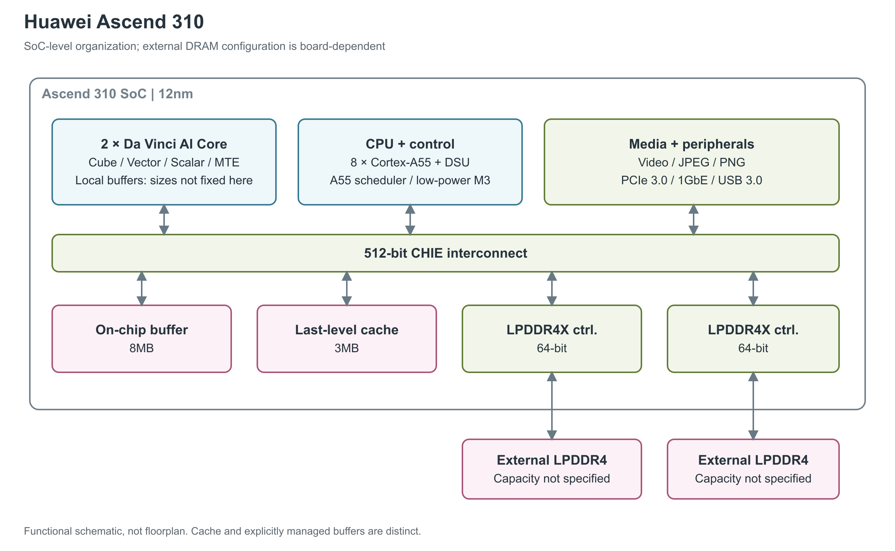

# 华为 Ascend 310

Ascend 310 是面向终端与边缘推理的片上系统（SoC）。它把 AI 运算、通用 CPU、媒体处理和外设接口放在一颗芯片里，适合从图像或视频输入到神经网络推理的一体化处理。[1, pp.24, 33]

图：按 Hot Chips 31 的 Ascend 310 SoC 框图重绘。两颗外接 LPDDR4 芯片是原图所示连接示例，具体容量与实际板级配置没有给定；芯片内的共享 buffer、末级缓存与 AI Core 本地缓冲分开显示。连线表示连接关系，不表示所有数据都必须经过缓存。[1, p.24]

## AI Core 只是 SoC 的一部分

芯片内有两个 Da Vinci AI Core，它们负责神经网络中的密集运算；八个 Arm Cortex-A55 CPU core 负责通用处理。图中还保留了媒体处理和外设接口，因为它们与 AI Core 一起构成边缘推理设备：视频解码后的数据可以进入 AI 计算路径，控制程序则可在 CPU 上运行。官方框图另列一个 A55 task scheduler、低功耗 M3 和两个 DMA 数据搬运引擎，这些不能再算入八核 CPU 的数量。[1, p.24]

Da Vinci AI Core 内部按工作性质分为 Cube、Vector、Scalar 和 MTE。Cube 执行矩阵乘法，Vector 处理逐元素运算和激活等操作，Scalar 负责控制，MTE（Memory Transfer Engine，内存搬运引擎）在各级本地缓冲之间搬运数据，并支持转置、img2col 和零值解压。独立队列允许计算与搬运重叠。这些是共用核心架构的分工，不代表 Ascend 310 已启用所有 Ascend-Max 资源。[1, pp.9, 12] [2, pp.3-4]

公开材料对 Ascend-Mini 的架构选点和量产芯片峰值采用了不同口径。HPCA 表5将 Ascend-Mini 与 Ascend-Max、Ascend 放在一组合并单元格中，给出 1GHz、Cube 8192 FLOPS/cycle、Vector 宽度 256B；Hot Chips 则把 Ascend 310 的单芯片峰值列为 FP16 8TFLOPS、INT8 16TOPS。不能将架构表的每周期吞吐直接乘两个核，再称为 Ascend 310 的产品峰值。单核资源和微基准结果在下文分别说明。[2, PDF p.6 / proceedings p.794, Table 5] [1, pp.10, 33]

## 三种存储各有位置

存储分为三个层次。AI Core 内的 L1、L0A/L0B/L0C 和 Unified Buffer 是显式管理的本地缓冲，服务计算过程中的操作数和中间结果；SoC 共享部分另有 8MB on-chip buffer 与 3MB LLC（Last-Level Cache，末级缓存）。这两项共享容量不能加到某个 AI Core 上，也不能把 8MB buffer 改名为 L2 cache。[1, pp.9, 24] [2, pp.3-4]

芯片外的数据存储通过两个 64-bit LPDDR4X 控制器连接。官方框图在控制器外分别画了一颗 LPDDR4 chip，所以图中保留了两条独立内存连接；文档没有指定单芯片产品必配的 DRAM 容量、速率、总带宽和 ECC。购买某块 Atlas 模组时看到的内存容量，是该模组的配置，不能自动成为 Ascend 310 的固定参数。[1, p.24]

片内各部分由 512-bit CHIE interconnect 连接。它承担 AI、CPU、共享存储、DMA 和 I/O 之间的数据交换，但资料没有给出足够的时钟和并发条件来把 512-bit 换算成持续带宽。HPCA Table 5 给出的 Ascend 310 LLC 带宽为每 AI Core 96GB/s，这是片内层级的设计参数，与外接 LPDDR 带宽不同。[1, p.24] [2, Table 5]

## 计算路径与实际搬运速度

独立研究 *Performance modeling on DaVinci AI core* 针对 Ascend 310 的单核和双核运行做了指令级微基准，直接测到了本地缓冲之间的带宽。其方法是增加处理数据量，再对时间与数据量作最小二乘拟合；Vector 项分别测普通搬运和 FP32 到 FP16 的转换，Cube 项改变 `mmad` 矩阵乘加指令的参数。它补充了“数据从哪个缓冲流到哪个缓冲、能流多快”的信息。[9, journal p.138 / PDF p.5, §4.1]

| 实测路径或操作 | 单 AI Core | 双 AI Core 合计 | 测量含义 |
|---|---:|---:|---|
| MTE1：L1 → L0A | 347.99GB/s | 695.97GB/s | 本地操作数搬运 |
| MTE1：L1 → L0B | 174.37GB/s | 348.79GB/s | 与 L0A 路径不同，不能用同一带宽代表 |
| Vector 搬运，不转换格式 | 174.06GB/s | 348.16GB/s | 属于数据通路吞吐，不是向量 FLOPS |
| Vector 搬运，FP32 → FP16 | 174.09GB/s | 348.20GB/s | 包含论文指定的精度转换 |
| Cube，RESET off | 5390.32GFLOPS | 10796.92GFLOPS | 论文自定义的 `mmad` FLOP 计数 |
| Cube，RESET on | 5397.34GFLOPS | 10789.17GFLOPS | 与上一行使用不同指令参数 |
| Kernel 启动时间 | 2354.5ns | 2293.5ns | 该测试环境的启动开销 |

整表来自论文表2。[9, journal p.138 / PDF p.5, Table 2] 论文将最小 16×16×16 运算块记作 `(15+16)×16×16=7936 FLOP`，没有简单按每个 MAC 两次操作计数；测试平台的实际频率、板卡内存配置和明确 CANN 版本没有在实验说明中给出。其 Cube 实测高于同表转引的单核 4096GFLOPS 规格，故这些数值仅描述作者的测试，不替代本产品 8TFLOPS 的官方标称峰值。[9, §4.1, Table 2]

这组数据还有一个直接的架构含义：计算核内部的 L1→L0 搬运基本可以随启用核数增加，而核外访问会争用共享通路。研究分别让 MTE2 从外部存储读入、MTE3 从 Unified Buffer 写出，再调整两者的重叠区间，定位到两个 AI Core 共享的 Interconnect Bus。四个读写搬运参与者同时竞争时，合计约 42GB/s；作者观察到各参与者近似均分带宽，并据此将该共享总线建模为半双工。这个约 42GB/s 是特定竞争实验的总吞吐，不能改称 LPDDR 标称带宽或 LLC 峰值。[9, journal pp.139-141 / PDF pp.6-8, Figs.6-8, §4.2-4.3]

在执行控制上，该研究将 Cube、Vector、MTE1、MTE2、MTE3 视为可并行的五类执行资源，各指令队列按 FIFO 顺序工作；Scalar PSQ 负责派发，跨队列依赖由 `set_flag` / `wait_flag` 显式同步，使用八个二值信号量寄存器。其模型采用每指令 40ns 初始化和 2050ns kernel 初始化参数，后者含 MTE2 1000ns、MTE3 350ns。它们是作者用于该平台性能模型的校准参数，并非缓存 load-to-use 延迟；论文没有给出可直接采用的寄存器、L0、L1、LLC 随机访问延迟表。[9, journal pp.135-137, 142 / PDF pp.2-4, 9, Table 4]

矩阵以外的计算能力同样不能忽略。官方共用核心配置给出 Vector 每周期 256 operations，并支持 INT8、FP16、FP32 及激活、ROI、SORT、NMS 等特殊操作；HPCA 的架构选点表则用 256B 表示 Vector 宽度。前者是计算吞吐口径，后者是数据宽度，不能互换；具体算术指令、精度、实际时钟与芯片配置尚不足以组成 Ascend 310 的分精度 Vector 峰值表。[1, pp.9-10] [2, Table 5]

## 产品规格与边缘部署

| 对应部分 | 公开规格 | 条件与来源 |
|---|---|---|
| AI 计算 | FP16 8TFLOPS；INT8 16TOPS | 单芯片厂商峰值，未说明稀疏或 MAC 计数规则。[1, p.33] |
| 通用处理 | 8×Arm Cortex-A55 | SoC 内 CPU，不计入 AI 峰值。[1, p.24] |
| 共享存储 | 8MB buffer；3MB LLC | 不包含每 AI Core 本地缓冲。[1, p.24] |
| 内存接口 | 2×64-bit LPDDR4X | 实际 DRAM 容量与速率未给定。[1, p.24] |
| 视频 | 16 路 H.264/H.265 解码；1 路编码 | 规格页未给出帧率、分辨率与 profile 条件。[1, p.33] |
| 工艺与功耗 | 12nm；8W | Hot Chips 产品规格；未公开完整测量条件。[1, p.33] |

FP16 和 INT8 分别表示 16 位浮点与 8 位整数运算，适合描述不同精度下的计算能力。Da Vinci 架构论文给出 Cube 的 FP16 源操作数与 FP32 目的数据类型，但这不足以确认物理累加器位宽或全部舍入行为。表中的 8TFLOPS 和 16TOPS 是整颗芯片的标称值，不能当作任意模型的实际吞吐。[2, pp.3-4] [1, p.33]

Ascend 310 提供 PCIe 3.0 的 1 至 4 lane RC/EP 控制器、Gigabit Ethernet 和 USB 3.0 device。RC/EP 分别指 PCIe 根复合体与端点角色，说明它可连接主机或外部端点；串行外设还有 SPI、UART、I2C 和 GPIO。这套接口体现了 SoC 面向边缘设备的集成方式，公开框图没有提供多颗 AI 芯片之间的专用 scale-up 互联。[1, p.24]

裸片照片标注边长为 9.8×10.65mm。封装类型、尺寸、晶体管数及当前销售状态没有在本文参考资料中明确披露。该型号于 2018 年推出，华为 2019 年报记录了基于 Ascend 310 的 Atlas 产品部署；这些记录不应与后来的 Ascend 310P、310B、310C 合并使用。[1, p.40] [2, Table 10] [8, p.34]

## 参考资料

[1] Huawei，*DaVinci: A Scalable Architecture for Neural Network Computing*，Hot Chips 31，2019。[本地 PDF](../../原始资料/论文/华为昇腾_DaVinci/01_厂商直接架构论文/2019_DaVinci_Scalable_Architecture_HotChips31.pdf)

[2] Heng Liao et al.，*Ascend: A Scalable and Unified Architecture for Ubiquitous Deep Neural Network Computing*，HPCA 2021。[本地 PDF](../../原始资料/论文/华为昇腾_DaVinci/01_厂商直接架构论文/2021_Ascend_Scalable_Unified_Architecture_HPCA.pdf)

[8] 华为投资控股有限公司，*华为 2019 年年度报告*。<https://www-file.huawei.com/-/media/corporate/pdf/annual-report/annual_report_2019_cn.pdf?la=zh> [本地原文](../../原始资料/论文/华为昇腾_DaVinci/90_官方白皮书与技术资料/Huawei-2019-Annual-Report.pdf)

[9] Yifeng Tang and Cho-li Wang，*Performance modeling on DaVinci AI core*，Journal of Parallel and Distributed Computing 175 (2023), pp.134-149。[本地 PDF](../../原始资料/论文/华为昇腾_DaVinci/02_独立逆向与微基准/2023_Performance_Modeling_DaVinci_AI_Core.pdf)
