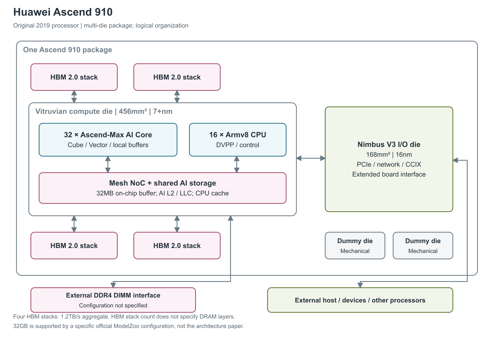

# 华为 Ascend 910

2019 年推出的 Ascend 910 面向 AI 训练。它采用多裸片封装：一块计算裸片承担 AI 和 CPU 运算，一块 I/O 裸片处理外部连接，四个 HBM 堆栈在封装内提供高带宽存储。[1, pp.25, 37] [2, pp.6-7] [6, opening]

图：按 Hot Chips 31 的 SoC、封装图与 HPCA 论文重绘。HBM 与计算裸片同封装，但位于计算裸片之外；两个 dummy die 用于机械均衡，不参与计算。图中块的位置不代表真实 floorplan。[1, pp.25, 37] [2, Figs.10-12]

## 从封装看到计算与存储

图中央的计算裸片名为 Vitruvian，集成 32 个 Ascend-Max AI Core、16 个 Armv8 CPU core，以及媒体预处理 DVPP。AI Core 按四组、每组八个的方式出现在官方框图中。Nimbus V3 则是一块独立的 I/O 裸片，连接 PCIe、网络、CCIX 和扩展板接口。两者分工明确，所以计算裸片的面积、工艺和内部带宽不能直接当作整个封装的参数。[1, p.25] [2, PDF pp.6-7, 10 / proceedings pp.794-795, 798, Table 7]

每个 AI Core 内有 Cube 矩阵路径、Vector 向量路径、Scalar 控制路径，以及负责搬运的 MTE（Memory Transfer Engine，内存搬运引擎）。Ascend-Max 的 Cube 使用 16×16×16 的 FP16 组织，INT8 可扩展为 16×32×16。HPCA 正文将整个 Cube 描述为 4,096 个乘法器与 4,096 个累加器，而 Hot Chips 核心图和 HPCA 图1在输出侧单独标注的是 16² accumulator。原文未解释两种累加器计数的对应关系，本文分别保留其所在层次，不用输出侧标注代替全部累加资源数量。[1, p.9] [2, PDF pp.2-3 / proceedings pp.790-791, Figure 1、§2.1] Vector 宽度为 2,048-bit，承担激活、排序等操作。FP16 Cube 的程序员可见源类型为 FP16、目的类型为 FP32；目的类型不能替代尚未完整公开的物理累加和舍入说明。[1, p.9] [2, pp.3-4, Figure 2, Table 4]

AI Core 的操作数先放在本地缓冲中，由 MTE 显式搬运。每核给出的容量是 L1 1MB、L0A/L0B 各 64KB、L0C 256KB、Unified Buffer 256KB，另有 32KB 指令缓存。MTE 支持 img2col、转置和零值解压，计算路径与搬运路径可以按独立队列重叠执行。这些本地 SRAM 与图中 SoC 共享存储承担不同职责。[1, pp.9, 12] [2, Figure 1, pp.3-4]

## 矩阵、向量与标量的能力差别

官方微架构配置把 Da Vinci Max 的 Cube 标为 8192 operations/cycle，把 Vector 标为 256 operations/cycle。前者来自 4096 个 FP16 MAC 的矩阵组织；后者服务普通向量运算，不应与 Cube 峰值相加后称为某种矩阵精度的吞吐。256 operations/cycle 那一栏没有逐一展开 FP16、FP32、INT8 的具体指令口径。[1, pp.9-10]

| 计算范围 | 官方架构数据 | 数据所指的对象 |
|---|---|---|
| 一个 Cube | 4096 个 FP16 MAC；INT8 组织支持 8192 个 MAC | 16×16×16 FP16 / 16×32×16 INT8 数据路径，乘加均计时分别为 8192 / 16384 operations/cycle。[1, p.9] [2, PDF p.3 / proceedings p.791] |
| 一个 Vector | 2048-bit；配置表给 256 operations/cycle | 数据宽度与运算计数不同；支持 INT8/FP16/FP32 和特殊函数。[1, pp.9-10] |
| 一个 Scalar | 控制、标量运算与地址生成 | 不承担主要矩阵吞吐；官方没有独立的型号级分精度峰值表。[1, p.9] [2, Table 2] |
| 整颗芯片的矩阵峰值 | FP16 256TFLOPS；INT8 512TOPS | 产品规格，32 个 AI Core；未给出结构化稀疏倍率。[1, p.33] |

HPCA 另给一组 7nm 实际计算单元的比较数据：Scalar 为 2GFLOPS、0.04mm²；Vector 为 256GFLOPS、0.46W、0.70mm²；Cube 为 8TFLOPS、3.13W、2.57mm²。它用来解释不同单元的计算密度和功耗，表中没有交代完整时钟、算术精度与测试负载，因此本文保留在“单元级测量”层级，不把面积或功耗乘 32 反推整颗芯片。[2, PDF p.3 / proceedings p.791, Table 3]

同一论文的物理实现图12把 Vector 标为 128GFLOPS，与表3的 256GFLOPS 不同。图表没有说明两者各自的精度、频率或运算计数条件，因此这两个原报值均不能直接定为 Ascend 910 的统一 Vector 峰值。[2, PDF p.7 / proceedings p.795, Figure 12；PDF p.3 / proceedings p.791, Table 3]

Vector 的任务包括归一化、激活、格式转换与部分计算机视觉操作；它与 Cube 的连接允许矩阵输出先进入 L0C，再送往 Vector，结果保存在 Unified Buffer。官方图还标出 FP16→FP32、FP32→FP16 和 ReLU 路径。MTE 中的零值解压帮助减少部分存储流量，但现有材料没有证明 Cube 会按某个固定 N:M 规则跳过乘法，因此不能把这项功能转换成“稀疏算力翻倍”。[1, p.9] [2, PDF pp.3-4 / proceedings pp.791-792, Table 2, §2.2]

## 本地缓冲的容量、宽度与调度

| AI Core 内部层级 | 每核容量 | 直接作用 |
|---|---:|---|
| 指令缓存 | 32KB | 保存待 PSQ 排序、派发的指令 |
| L1 Buffer | 1MB | 暂存输入与权重，并向更近的 L0 分块供数 |
| L0A / L0B | 各 64KB | 分别提供矩阵两侧输入 |
| L0C | 256KB | 保存矩阵输出和中间累加结果 |
| Unified Buffer | 256KB | Vector / Scalar 的工作缓冲与输出缓冲 |

容量和连接由官方核心框图给出。[1, p.9] 它还标注 L0 load 4096-bit、L1 load 2048-bit、Unified Buffer load/store 2048-bit 和 L2 access 1024-bit×2；这些是特定接口宽度，图中未把它们全部定义成每周期可持续收发的字节数。寄存器方面，图中区分通用寄存器 GPR、专用寄存器 SPR 及 Cube 输入/累加 DFF，但没有给出可按核汇总的寄存器容量。[1, p.9]

不同资料中的“L1 带宽”存在口径差别。Hot Chips 配置表给出 A 路 8192-bit、B 路 2048-bit 的 bus width；HPCA 表5的 1GHz Ascend-Max 设计点则在 `L1 Bandwidth` 栏写 A 4TB/s、B 2TB/s、UB 2TB/s。后者没有逐条解释这些 A/B/UB 数值与前述物理接口的对应，不能据此把 L1→L0A 标成已确认的 4TB/s 持续带宽。两份原值均保留，等待更细的指令或接口资料消除差异。[1, p.10] [2, PDF p.6 / proceedings p.794, Table 5]

Cube、Vector 与 MTE 独立排队执行，遇到数据依赖再由显式 barrier 同步。这使输入预取、矩阵计算和结果后处理可以重叠，但可重叠的前提是缓冲区生命周期与依赖安排正确。原始文档没有给出各队列深度、完整指令延迟、各 SRAM bank 数与冲突代价，因此不会用接口宽度去替代这些延迟参数。[2, PDF p.4 / proceedings p.792, §2.2, Figure 3]

## Cache、HBM 与片内网络

计算裸片使用 4×6 的二维 mesh NoC，即把运算和存储节点连成网格状片上网络。HPCA 给出的相邻链路参数为 2GHz、1,024-bit，对应 256GB/s；全芯片到 L2 的吞吐为 4TB/s，到 HBM 子系统为 1.2TB/s。这三项分别描述一条片内链路、共享存储访问和封装内 DRAM 访问，不能相加成为一个“总带宽”。[2, pp.6-7]

Hot Chips 框图将共享 AI 存储标为 32MB on-chip buffer，HPCA 则讨论 AI LLC/L2 与 CPU LLC，因此图中保留“共享 AI 存储／L2”层级，同时在正文保留原始 buffer 命名。每核的 L0、L1 和 Unified Buffer 仍单独存在；CPU 缓存也不是 AI Core 的本地缓冲。HPCA Table 5 另列每 AI Core 的 LLC 带宽 94GB/s，它与全芯片 4TB/s 的说明层级不同。[1, p.25] [2, p.6, Table 5]

四个 HBM 2.0 堆栈共同构成 1.2TB/s 的内存子系统。两篇架构资料没有在芯片规格段写出容量；华为官方 ModelZoo 的八 NPU 环境写有“Ascend 910 32GB×8”，为每 NPU 32GB 提供了具体系统配置证据。本文将 32GB 标为这一运行环境的配置，不假定所有原始 910 封装都由独立数据手册保证该容量。Hot Chips 的计算裸片图还画出了 DDR4 接口与封装外 DIMM，未给定容量和带宽，不能与这四个 HBM 混成一个数值。[1, p.25] [2, pp.6-7] [10, Before You Start: Test Notes]

## 独立实现中的持续吞吐

SGEMM-cube 论文在一套明确标为 Ascend 910A、32 AI Core、1GHz、标称内存带宽 1.2TB/s 的环境中测试了 FP32 矩阵乘法的近似实现。作者把每个 FP32 输入分解为高位项与缩放后的残差项，使用三次主要 FP16 GEMM，再进行 FP32 结果合成。这提供的是低精度 Cube 完成高精度任务的算法吞吐，不表示芯片新增了原生 FP32 Cube。[11, PDF pp.7-15, 22 / 正文 pp.6-14, 21, §4、§6.1]

| 该论文的测试或模型参数 | 数值 | 条件 |
|---|---:|---|
| 近似 FP32 GEMM，单缓冲实现峰值 | 41.7TFLOPS | `(bm,bk,bn,Nfused)=(192,80,192,32)`，Figure 11(a) |
| 近似 FP32 GEMM，双缓冲实现峰值 | 65.3TFLOPS | `(176,64,176,44)`，Figure 11(b)；搬运与 Cube 运算重叠 |
| 三次 FP16 GEMM 对应的理论上界 | 256/3≈85.3TFLOPS | 是算法换算的 FP32-equivalent 上界，不是原生 FP32 峰值 |
| Roofline 所用主存→L1 带宽 | 1.16TB/s | 作者称根据 Ascend 910A 测量设定，Figure 10；不是每核 L1 SRAM 带宽 |

表中性能以 `2mnk / kernel时间` 统计，`bm/bk/bn` 是矩阵分块尺寸，`Nfused` 是融合处理的分块数。[11, PDF pp.22, 25-26 / 正文 pp.21, 24-25, §6.1、§6.3, Figures 10-11] 双缓冲最高达到上述等效上界的约 77%；文中未给明确的 CANN 版本，也没有足够说明把 1.16TB/s 当成所有大小、方向与访问方式下的可持续带宽。[11, §6.1、§6.3]

这项实现不保证与 IEEE FP32 逐位一致：省略低位残差之间的乘积、使用 FP16 保存分量以及固定缩放都会影响误差，当前实现也不覆盖完整 FP32 动态范围。论文图4另列若干片内路径的 TB/s 数值，但没有明确单核与全芯片的统计边界，而且图中 Global Memory 容量标注与测试平台说明不够一致，因此本文不将那些箭头数值升级为 Ascend 910 的确定规格。[11, PDF pp.16, 27-28 / 正文 pp.15, 26-27, Figure 4, §7]

## 规格与物理实现

| 图中部分 | 公开规格 | 来源及条件 |
|---|---|---|
| AI Core | 32 个；FP16 256TFLOPS、INT8 512TOPS | 单芯片厂商峰值；未给结构化稀疏倍率。[1, p.33] |
| 计算裸片 | 456mm²，7+nm EUV | Vitruvian，包括 AI、CPU、存储与媒体单元。[1, pp.33, 37] [2, Table 7] |
| I/O 裸片 | 168mm²，16nm | Nimbus V3。[1, p.37] [2, Table 7] |
| HBM | 4 个堆栈，合计 1.2TB/s | 每个 HBM 区域标注 96mm²，未给 DRAM 层数。[1, pp.25, 37] [2, p.7] |
| 机械均衡裸片 | 2 个，每个 110mm² | dummy die，没有计算或存储功能。[1, p.37] |
| 媒体路径 | 128 路 full-HD H.264/H.265 解码 | 未展开帧率和 codec profile。[1, p.33] [2, p.7] |

封装图写“8 dies integrated”，论文又说六个功能 die，两者可以由是否计入两个 dummy die 解释。资料中的 1,228mm² 是 456+168+4×96+2×110 的面积和，不是封装外形面积，也不是单块硅的面积。本文所查资料未明确披露封装基板、interposer、外形尺寸和总晶体管数。[1, p.37] [2, pp.6-7]

功耗数值反映了不同发布口径。Hot Chips 规格页写 350W；正式发布公告则解释，350W 是原计划规格，完成开发后的最大功耗为 310W，2019 年报也称达到规格算力所需功耗为 310W。HPCA 论文另列 rated TDP 300W。发布前后的变化可以解释前两个数值，但 TDP 与最大功耗仍不是同一概念，资料也没有统一给出电压、频率与负载条件。[1, p.33] [6, Ascend 910: More computing power] [4, p.34] [2, PDF pp.7, 10 / proceedings pp.795, 798, §3.1.2、Table 7]

## 多芯片服务器怎样连接

Nimbus 提供的是芯片外部连接能力；实际训练服务器再把多颗 Ascend 910 组织起来。论文中的八芯片服务器分成两个四芯片组，组内使用 HCCS 高速缓存一致性网络，组间通过 PCIe 连接。该段分别给出 30GB/s 与 32GB/s，但前者未明确按单链路、单芯片还是整组统计，不能填成单芯片互联端点的确定带宽。[2, PDF p.8 / proceedings p.796]

Ascend 910 于 2019 年 8 月 23 日正式发布，随后用于 Atlas 部件、服务器与云服务。这里介绍的是原始 Ascend 910，后来的 910B、910C 和 Atlas A2/A3 配置需要各自的资料。当前独立销售状态、更多数值格式的型号级峰值，以及 attention、MoE routing 或 KV Cache 的专用硬件，现有参考资料没有给出足够证据。[6, opening] [4, pp.5, 34, 36] [9, Huawei's computing strategy；Atlas 900, the world's fastest AI training cluster]

## 参考资料

[1] Huawei，*DaVinci: A Scalable Architecture for Neural Network Computing*，Hot Chips 31，2019。[本地 PDF](../../原始资料/论文/华为昇腾_DaVinci/01_厂商直接架构论文/2019_DaVinci_Scalable_Architecture_HotChips31.pdf)

[2] Heng Liao et al.，*Ascend: A Scalable and Unified Architecture for Ubiquitous Deep Neural Network Computing*，HPCA 2021。[本地 PDF](../../原始资料/论文/华为昇腾_DaVinci/01_厂商直接架构论文/2021_Ascend_Scalable_Unified_Architecture_HPCA.pdf)

[4] 华为投资控股有限公司，*华为 2019 年年度报告*。<https://www-file.huawei.com/-/media/corporate/pdf/annual-report/annual_report_2019_cn.pdf?la=zh> [本地原文](../../原始资料/论文/华为昇腾_DaVinci/90_官方白皮书与技术资料/Huawei-2019-Annual-Report.pdf)

[6] Huawei，*Huawei launches Ascend 910 and MindSpore*，2019-08-23。<https://kommunikasjon.ntb.no/pressemelding/17869431/huawei-launches-ascend-910-the-worlds-most-powerful-ai-processor-and-mindspore-an-all-scenario-ai-computing-framework?publisherId=17847024> [本地原文](../../原始资料/网页快照/华为/产品详解补充/2026-09-17/华为_Ascend910-ref6.html)

[9] Huawei，*Huawei announces computing strategy and releases Atlas 900*，2019-09-18。<https://www.huawei.com/en/news/2019/9/huawei-computing-strategy-atlas-900-ai-training-cluster> [本地原文](../../原始资料/网页快照/华为/产品详解补充/2026-09-17/华为_Ascend910-ref9.html)

[10] Huawei Ascend ModelZoo，*YOLOv3*。<https://www.hiascend.com/en/software/modelzoo/models/detail/2/7b5f73072a24453389602051affe9b31> [本地原文](../../原始资料/网页快照/华为/产品详解补充/2026-09-17/modelzoo-browser.html)

[11] *SGEMM-cube: FP32-Accuracy Approximation on Ascend NPUs with FP16 Matrix Engines*，现有独立研究论文版本。[本地 PDF](../../原始资料/论文/华为昇腾_DaVinci/02_独立逆向与微基准/2025_SGEMM_Cube_Ascend_NPUs.pdf)
