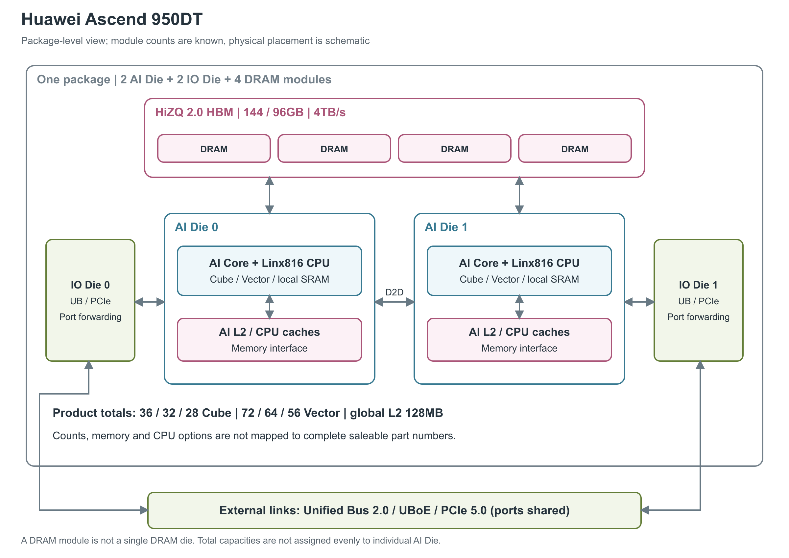

# 华为 Ascend 950DT

Ascend 950DT 面向大模型预训练、后训练与推理，包括 prefill（处理输入上下文）和 decode（逐步生成输出）。它采用第三代 DaVinci 计算架构，并在同封装内提供高带宽 DRAM 与面向多设备的通信能力。[1, PDF pp.10, 12，正文 pp.6, 8]

图：按《昇腾950 NPU架构白皮书》图3-1、图4-1、图4-9概括；4 个内存模块是封装内 DRAM，模块个数不等于内部 DRAM 裸片层数。两块 AI Die 中的资源只画逻辑分工，产品总资源列在图下方，不暗示每块 die 的使能数相同。布局与连线均为示意。[1, PDF pp.12-15, 17, 25，正文 pp.8-11, 13, 21] 内存名称采用官方路线图的 HiZQ 2.0 HBM（高带宽内存）。[2, Ascend 950DT]

## 一个封装内的两类裸片

两块 AI Die 负责主要计算、片上缓存和内存访问；两块 IO Die 负责 Unified Bus、PCIe 等通信。高速 D2D Clink 与 Memory Interface 把它们和内存模块连接起来。这里的 D2D 是封装内裸片间连接，它与从封装引出的设备互联是两层不同链路，后文的 2016GB/s 不能当作 D2D 带宽。[1, PDF p.12，正文 p.8]

AI 计算的基本分工是一个 Cube Core 配两个 Vector Core。Cube 处理矩阵乘法，Vector 处理向量运算，各有 Scalar 控制路径；Linx816 CPU 则执行通用任务。白皮书的完整设计有 36 个 AI 子系统、四个 CPU Cluster、四个 DVPP 图像处理子系统与 STARS2.0 调度系统，但产品表对 950DT 实际列的是 36 / 32 / 28 个 Cube、72 / 64 / 56 个 Vector。本文保留这些资源档位，不把完整设计图当成每个产品的使能配置。[1, PDF pp.13, 17，正文 pp.9, 13]

950DT 也并非一个参数完全固定的销售 SKU（可区分的产品配置）。白皮书分别列出计算、CPU、内存与缓存的多个档位，却没有给出它们与完整料号的一一对应关系。因此可以按同列对照 Cube 数和对应算力，不能把 CPU、内存、L2 的最高值拼成唯一型号。[1, PDF pp.13-15，正文 pp.9-11，表3-1]

## 本地缓冲、L2 与 DRAM

距离计算最近的是每个 AI Core 的 Local Memory：L1 512KB，L0A 与 L0B 各 64KB，L0C 256KB，以及合计 512KB 的 Unified Buffer。图4-1进一步显示两个 Vector 各带 256KB Unified Buffer。它们保存运算当前使用的数据；在 SIMD 编程下，软件显式管理全局内存、本地内存和寄存器之间的搬运，因此不能把所有这些 SRAM 都称为硬件 cache。[1, PDF pp.17, 25，正文 pp.13, 21，图4-1、表4-2] [6, 基于AI Core的SIMD算子开发通用步骤]

图中跨计算资源共享的是全局 L2 cache，950DT 的公开容量为 128MB。每条 cache line 为 512B，分成四个 128B sector；支持访问提示、按 way 管理和 CMO（cache maintenance operation，缓存维护操作）。CPU 另有每核 64KB L1、1MB L2，以及每 cluster 4MB L3。CPU 的 L2 与服务 AI 计算的全局 L2 是两个层次，读规格时不能只看“L2”这个名字。[1, PDF pp.15, 24-27，正文 pp.11, 20-23]

封装内最外层是 4 个 HiZQ 2.0 高速内存模块。白皮书称它为“高速片上内存”，并明确其介质是 DRAM；此处“片上”包含合封的内存，不能理解为与逻辑电路同一裸片上的 SRAM。两块计算 die 采用统一内存访问，芯片内 CPU cache 与 AI Core/L2 由硬件协调一致性，但这并不自动涵盖所有远程设备的 cache。[1, PDF pp.12, 24-26，正文 pp.8, 20-22] [2, Ascend 950DT]

| 图中层级 | 950DT 公开规格 | 怎样理解 |
|---|---|---|
| 封装内 DRAM | 144 / 96GB；4TB/s | 产品档位；未公开内存层数、位宽与持续条件 |
| 全局 L2 cache | 128MB | 支持跨计算 die 一致性；不等于 CPU 的每核 L2 |
| CPU | Linx816 8C16T / 6C12T，支持 NEON | C 为核数、T 为线程数，不是 AI Core 数 |
| 图像处理 | VPC 4/2 个、JPEGD 8 个、JPEGE 4/2 个 | 档位不能按斜杠位置与其他字段强行配对 |

表中数值来自表3-1、表4-2与内存子系统说明。[1, PDF pp.14-15, 24-26，正文 pp.10-11, 20-22] DRAM 还支持在线 ECC 纠错、弱单元巡检与重写/隔离，以及保留行动态修复；现有资料未展开全部纠错参数和覆盖粒度。[1, PDF p.26，正文 p.22]

全局 L2 采用多 bank 分布式组织，按 512B 低位交织并结合高位异或；每个 bank 支持同时读写。两块 AI Die 的 L2 由硬件保持一致，但仍有局部亲和性，调度到靠近数据所在 die 的计算资源仍有意义。L2 hint 可以选择分配/替换行为，短期不再使用的输出可以设置 non-allocate 直接写入 Global Memory；针对 SDMA，还提供预取、写回、无效化与冲刷等 CMO 操作。[1, PDF pp.26-27 / 正文 pp.22-23, §4.3.2]

这些资料已经给出 L2 的容量、line/sector 大小、bank 并发方式和管理行为，却没有提供 L2 总带宽、每 bank 带宽、命中延迟，以及 L1/L0/UB/寄存器间的定量吞吐。CPU 各级 cache 的容量同样不能推出其带宽或延迟。白皮书也未披露封装内 Clink 的位宽、速率和跨 die 访问延迟；不将 DRAM 带宽或对外 Unified Bus 带宽移用到这些位置。[1, PDF pp.12, 24-27 / 正文 pp.8, 20-23]

## Cube 与 Vector 怎样协作

Cube 图示使用 16×16×16 FP16 组织，支持 MXFP4、HiF8、MXFP8、FP8、INT8、BF16、FP16、TF32 输入。Vector 则承担矩阵计算前后的处理；两类单元的峰值在本节末尾分开列出。[1, PDF pp.17-20，正文 pp.13-16]

Vector 支持 SIMD 与 SIMT 两种编程方式，分别适合统一向量操作和带分支、不规则访问的线程任务。寄存器式 SIMD 在 Unified Buffer 与运算单元之间增加 Register File，并支持双发 ALU 与乱序执行；双发不意味着任意两条指令都能同时执行。CANN 文档说明单个 SIMD 寄存器为 256B；SIMT 视图则可把 Unified Buffer 用作 Shared Memory 与 Data Cache。它们是对底层资源的不同使用方式，不能重复计入存储容量。[1, PDF pp.11, 16, 21，正文 pp.7, 12, 17] [6, AI Core核心硬件组件、新架构双模式矢量计算结构] [7, 抽象硬件架构]

### 向量寄存器与 SIMT 线程怎样使用同一批资源

白皮书图4-1将每个 Vector Core 画成两组 64×FP32 或两组 128×FP16 的算术组织，每个 Vector Core 各有 256KB Unified Buffer 和 Register File；一个 Cube 加两个 Vector 组成的 AI 子系统对应三个独立 Scalar 控制路径。图示的并行宽度有助于理解计算资源配比，但不能代替分指令吞吐表。[1, PDF p.17 / 正文 p.13, 图4-1]

SIMD 模式下，单个可编程向量寄存器为 256B；Memory 模式的向量算子主要通过 UB 交换数据，Reg 模式则显式把 UB 中的数据送入寄存器，在寄存器中计算后再写回。SIMT 模式按线程分配寄存器，并将同一个 UB 分成共享内存与 Data Cache。它们共享底层存储，不能把 256KB UB、SIMT 共享内存和 Data Cache 三项相加。[6, AI Core核心硬件组件、新架构双模式矢量计算结构] [7, 抽象硬件架构]

| CANN 9.1.0 中的 SIMT 资源 | 公开值或规则 | 对算子执行的含义 |
|---|---|---|
| 一个 Warp | 32 个线程 | 同一条指令控制一组线程；分支发散时按活跃掩码执行 |
| 一个 Thread Block | 最多 2048 个线程 | 线程共享本地内存，能够在块内同步 |
| 一个 Grid | 最多 65535 个 Thread Block | 是一次 launch 的软件范围，不代表同时驻留这么多线程块 |
| 单个 AIV 的 UB | 256KB | 在共享内存、预留空间和 Data Cache 之间分配 |
| 默认编译器预留 UB | 8KB | 用于编译器及 Ascend C，不能当作用户共享内存 |
| SIMT Data Cache | 最少 32KB，最多 128KB | 容量取决于用户静态与动态共享内存配置 |

线程规则来自《线程架构》，存储容量来自《内存层级》“共享内存大小的限制”。[8, 线程层次结构、Warp执行机制] [9, 共享内存大小的限制] 在默认预留模式下，`Data Cache = min(256KB - 静态共享内存 - 动态共享内存 - 8KB, 128KB)`；若为 Data Cache 保留最低 32KB，用户共享内存的容量上界据此为 216KB。这一 216KB 是公式推导值，实际只可访问已申请区域。文档提供禁用预留区的编译选项，但附注公式仍保留 8KB 项，本文不据该选项另算更大的可用容量。[9, 共享内存大小的限制]

| 编译期配置的最大线程数 | 每个线程可用寄存器数 |
|---|---:|
| 1 至 256 | 127 |
| 257 至 512 | 64 |
| 513 至 1024 | 32 |
| 1025 至 2048 | 16 |

这是 `__launch_bounds__` 所约束的分配关系，默认最大线程数为 1024；它与 SIMD 的 256B 向量寄存器是两种编程视图，不能把表中每线程的寄存器个数乘以 256B。配置越多线程，每线程可用寄存器越少，复杂算子可能因此发生寄存器溢出，转而使用栈空间。文档未给出可直接汇总的物理 Register File 总容量、端口数或 TB/s 数值。[8, 配置最大线程数] [9, 寄存器]

### 低精度格式和结果转换

Cube 的 FP8 路径覆盖 E4M3、E5M2，分别使用 4/5 位指数、3/2 位尾数；FP4 图示为 1 位符号、2 位指数、1 位尾数。HiF8 使用可变的 Dot 前缀字段选择指数宽度和非正规数标志，特殊非正规数把综合阶码范围扩展至 [-22,15]，共 38 个幂次；特殊值包括零、NaN、正负无穷，其中零不区分正负。MX 格式额外携带共享的 8-bit scale，HiF8 不采用这一附加缩放字段。MXFP4/MXFP8、普通 FP8 和 HiF8 的数值语义不同，不能仅因存储位数相近而互换。[1, PDF pp.18-20 / 正文 pp.14-16, 图4-3至图4-4、表4-1]

低精度规格表描述 Cube 输入格式及吞吐，白皮书还单独说明输出可以在 L0C→UB 搬运时从 FP32/INT32 转为 BF16、FP16、FP8、INT8，并完成 NZ→ND/DN 排布转换。这样的随路转换减少中间结果写出后再由 Vector 处理的步骤，但没有逐一给出每种输入格式的乘积精度、完整累加规则、舍入模式和转换吞吐，不能自行补成一套 IEEE 数值行为保证。[1, PDF p.17 / 正文 p.13, §4.1.1]

### 核内数据搬运

Cube 的 L1 与 Vector 的 Unified Buffer 之间有直接通路，可以边搬运边转换精度和布局，减少融合算子中间结果绕行。NDDMA 多维搬运引擎支持五维布局变换，以 128B 请求聚合数据，BufferID 机制协调生产者与消费者。这里的请求粒度与 L2 的 512B cache line 分属不同层级。这些通路让分块矩阵结果更快进入后处理，但其持续带宽仍需单独的测量资料。[1, PDF pp.17, 22-24，正文 pp.13, 18-20]

### 矩阵与向量峰值

下表按 36 / 32 / 28 个 Cube 的档位顺序列出峰值。TFLOPS 为每秒万亿次浮点运算，TOPS 为每秒万亿次整数运算。资料没有给出相应频率、功耗模式、FMA 计数和结构化稀疏条件，因此均作为厂商规格读取。[1, PDF pp.13-14，正文 pp.9-10，表3-1]

| 单元和格式 | 按公开资源档位排列的峰值 |
|---|---|
| Cube MXFP4（TFLOPS） | 1946 / 1730 / 1513 |
| Cube HiF8 / MXFP8 / FP8（TFLOPS） | 973 / 865 / 756 |
| Cube INT8（TOPS） | 973 / 865 / 756 |
| Cube BF16 / FP16（TFLOPS） | 486 / 432 / 378 |
| Cube TF32（TFLOPS） | 243 / 216 / 189 |
| Vector FP16 / BF16（TFLOPS） | 60 / 54 / 47 |
| Vector FP32（TFLOPS） | 30 / 27 / 23 |
| Vector INT8（TOPS） | 60 / 54 / 47 |
| Vector INT16（TOPS） | 30 / 27 / 23 |
| Vector INT32（TOPS） | 15 / 13 / 11 |
| Vector INT64（TOPS） | 7 / 6 / 5 |

同频下，Cube 的 HiF8/MXFP8/FP8 速率为 FP16 的两倍，MXFP4 为四倍，这是数值格式造成的吞吐差别，不是稀疏翻倍。官方还列出 Cube+Vector 聚合数：MXFP4 为 2007 / 1784 / 1561TFLOPS；HiF8/MXFP8/FP8 为 1034 / 919 / 804TFLOPS；INT8 为 1034 / 919 / 804TOPS；BF16/FP16 为 547 / 486 / 425TFLOPS；TF32 为 273 / 243 / 212TFLOPS。这些总量与纯矩阵路径不同。最大 2007TFLOPS 是聚合 MXFP4，纯 Cube 同档为 1946TFLOPS。聚合数与取整后的分项并不总能严格相加，例如 1946+60 与 2007 的差异，本文保留原值。[1, PDF pp.13-14, 17，正文 pp.9-10, 13]

## 通信也有独立的硬件路径

全封装提供 72 条最高 112Gbps 的 HiLink lane，组成 18 个 ×4 端口。Unified Bus 2.0 的 2016GB/s 是这组端口的双向原始速率口径，不是应用可持续使用的有效负载带宽。这里的 UB 指设备通信总线；前文 AI Core 内的 Unified Buffer 也缩写为 UB，但二者功能完全不同。[1, PDF pp.13, 15，正文 pp.9, 11]

同组端口还可以复用为两路 400Gbps UBoE（Unified Bus over Ethernet）和 PCIe 5.0 ×16。前者双向合计 200GB/s、占两个 UB 端口；后者标称双向 128GB/s、占四个 UB 端口，可降宽并向下兼容早期 PCIe，RC/EP 角色静态选定。因此 2016、200 和 128GB/s 不能叠加成芯片总出口带宽。每个 IO Die 内九个 ×4 端口之间的转发在 I/O 侧完成，不经计算 die 或 DRAM。[1, PDF pp.15, 29-35，正文 pp.11, 25-31]

访问远端内存有两条方式：URMA 通过 Jetty 队列异步执行 read/write/send 与部分原子操作；UB Memory 则允许 AI Core/CPU 发起远程 load/store 与原子访问。UMMU 处理地址翻译与权限校验。白皮书称共享访问范围最高为 128TB，这是可访问地址空间的范围，绝不是本封装的 DRAM 容量，也不足以证明远端全局缓存一致或缺页迁移。[1, PDF pp.11, 30-32，正文 pp.7, 26-28]

在超节点组网中，计算芯片还可经 UB 端口直接访问 CPU 内存池，以及基于 UB 的存储资源池；白皮书说明后者可省去中间存储协议转换。这些是外部资源访问路径，不增加单封装的 DRAM 容量。文档未给这些路径的持续带宽、负载实测或自动迁移规则，不能据此宣称模型状态会自动在各层存储间调度。[1, PDF pp.36-37／正文 pp.32-33，§4.7.2-4.7.3]

CCU 是集合通信加速单元，可执行软件预置的搬运、同步和归约算法，支持 Broadcast、Reduce Scatter、All Gather、All Reduce、All2All 与 All2Allv。其内部有任务控制、MemorySlice 与 Reduce Unit，但白皮书未列出数量、缓冲容量和归约吞吐。STARS2.0 支持 2048 条任务流，并行上限包括 16 个 AI CPU 任务、64 个 Host 任务、64 个 UB Jetty 任务、32 个 CCU 任务和 32 个 SDMA 通道；任务数量不能当成物理引擎数。[1, PDF pp.27-28, 32-33，正文 pp.23-24, 28-29]

STARS 的同步容量还包括最多 128K 个单比特标志，或最多 4096 个 32-bit 标志。它通过专用 HSCB 控制总线与 AIC/AIV 交互，独立于普通数据 NoC，支持广播调度；资料将调度开销描述为 ns 级，但未给一个可用于模型计算的精确延迟。资源可分成最多 8 个 Group，按 die 安排亲和性；AIC/AIV/SDMA 最多可划分为 16 个资源池，其他加速器最多 8 个资源池，并将资源池绑定到虚拟机。Group、资源池、并发任务数分别描述调度、隔离和运行上限，均不能当作更多物理核。[1, PDF p.28 / 正文 p.24, §4.4]

URMA 的异步原子操作包括 FetchAdd 和 CompareAndSwap；UB Memory 的同步原子操作包括 AtomicStore、AtomicLoad、AtomicSwap 与 AtomicCompareAndSwap。URMA 通过 Doorbell 触发 Jetty 队列，CCU 可以在远端内存、本端 DRAM 与自身 MemorySlice 之间编排搬运，然后调用 Reduce Unit 归约。白皮书未给原子操作位宽、发起率、归约精度表或 CCU SRAM 容量，因此不把通信支持列表转写成确定的归约 TOPS。[1, PDF pp.30-33 / 正文 pp.26-29, §4.6.1、§4.6.3-4.6.4]

UBoE 物理端口支持 1×4 或 2×2 拆分，对应一路 400/200/100/50/25Gbps，或两路 200/100/50/25Gbps；芯片总计两组 400G Ethernet Link。PCIe 章节还列 1×16、1×8、1×4、1×2 link 模式，以及 DMA 和 MCTP 加速器。它们都是端口配置能力，实际同时可用的接口组合取决于 SerDes 复用，不能按所有模式的最大值求和。[1, PDF pp.31, 35 / 正文 pp.27, 31, §4.6.2、§4.6.6]

UB 支持链路重传；RTP 支持端到端可靠重传，CTP 不支持。原文关于 RTP 的四个 Port、CTP 的九个 Port 没有清楚限定是每 IO Die 还是整个封装，不能再乘二。架构支持 Clos、Full Mesh+Clos 和 nD-Mesh 等组网，以及最高 8192 卡超节点，这些是扩展能力，不代表已交付某一规模的系统。[1, PDF pp.30-31，正文 pp.26-27]

## 产品落地与尚未公开的部分

Ascend 950DT 于 2025 年 9 月 18 日公开，路线图给出的单芯片可用窗口是 2026Q4。官方已有 Atlas 650E、850E、950 型号以及 Atlas 950 真机展示，但这些证据仍不足以确认全部 DT 配置独立上市。Atlas 650E 的 8×950DT、8×96GB 是具体服务器配置，可组成跨两台服务器的 16-NPU full-mesh；它不取代白皮书已直接列出的 144GB 档位。2026 年新闻所说 Atlas 850E 支持 96 卡商用部署，是能力说明，不等于已完成特定客户的 96 卡部署。[2, Ascend 950DT] [4, Product Features and Specifications] [5, 真机亮相与 Atlas 850E]

图像处理的规格也按资源档位给出：VPC 的 1080p 等效吞吐为 5760/2880FPS，JPEG 解码为 4096FPS，JPEG 编码为 1024/512FPS，后两者最大支持 32K×32K 分辨率；并非所有最大吞吐与最大图像尺寸能同时成立。[1, PDF p.14，正文 p.10，表3-1] 制程、裸片面积、晶体管数、芯片时钟、功耗和封装外形均未在白皮书中披露。FlashAttention、Softmax 与 GELU 的通路优化已有说明，但不能据此画出独立的 attention 或 MoE 引擎。[1, PDF pp.16-22，正文 pp.12-18]

DVPP 的 VPC 支持 resize、crop、padding、色彩空间转换、HSV 调整、像素增强，以及仿射/透视变换。JPEGD 输入是 8-bit baseline JPEG，支持 YUV444/422/420/440/400、区域解码和对应 semi-planar 输出；JPEGE 支持 Baseline Sequential DCT 编码及 YUV420 semi-planar、YUV422 packed/semi-planar、YUV444 planar/packed、YUV400。两者最大分辨率都是 32768×32768；这些格式约束应与前面的等效 FPS 一起阅读，不能把最大分辨率和最高帧率相乘得到实际吞吐。[1, PDF p.29 / 正文 p.25, §4.5]

## 参考资料

[1] Huawei，《昇腾950 NPU架构白皮书》，40页，版权2026，未标明确切发布日期。<https://public-download.obs.cn-east-2.myhuaweicloud.com/ascend/%E6%98%87%E8%85%BE950%20NPU%E6%9E%B6%E6%9E%84%E7%99%BD%E7%9A%AE%E4%B9%A6.pdf>；[本地 PDF](../../原始资料/论文/华为昇腾_DaVinci/90_官方白皮书与技术资料/2026_Ascend950_NPU_Architecture_White_Paper.pdf)

[2] Huawei，《以开创的超节点互联技术，引领AI基础设施新范式》，2025-09-18。<https://www.huawei.com/cn/news/2025/9/hc-xu-keynote-speech> [本地原文](../../原始资料/网页快照/华为/产品详解补充/2026-09-17/华为_Ascend950PR-ref2.html)

[4] Huawei Ascend Community，Atlas 650E。<https://www.hiascend.com/en/hardware/ai-server?tag=800A2> [本地原文](../../原始资料/网页快照/华为/产品详解补充/2026-09-17/华为_Ascend950DT-ref4.html)

[5] Huawei，《昇腾950超节点真机亮相2026世界人工智能大会》，2026-07-17。<https://www.huawei.com/cn/news/2026/7/atlas-950-superpod> [本地原文](../../原始资料/网页快照/华为/产品详解补充/2026-09-17/华为_Ascend950DT-ref5.html)

[6] Huawei Ascend Community，《概述：AI Core SIMD编程》，CANN9.1.0。<https://www.hiascend.com/document/detail/zh/CANNCommunityEdition/910/programug/Ascendcopdevg/docs/guide/%E7%BC%96%E7%A8%8B%E6%8C%87%E5%8D%97/%E7%BC%96%E7%A8%8B%E6%A8%A1%E5%9E%8B/AI-Core-SIMD%E7%BC%96%E7%A8%8B/%E6%A6%82%E8%BF%B0.md> [本地原文](../../原始资料/网页快照/华为/产品详解补充/2026-09-17/simd-910.html)

[7] Huawei Ascend Community，《抽象硬件架构：AI Core SIMT编程》，CANN9.1.0。<https://www.hiascend.com/document/detail/zh/CANNCommunityEdition/910/programug/Ascendcopdevg/docs/guide/%E7%BC%96%E7%A8%8B%E6%8C%87%E5%8D%97/%E7%BC%96%E7%A8%8B%E6%A8%A1%E5%9E%8B/AI-Core-SIMT%E7%BC%96%E7%A8%8B/%E6%8A%BD%E8%B1%A1%E7%A1%AC%E4%BB%B6%E6%9E%B6%E6%9E%84.md> [本地原文](../../原始资料/网页快照/华为/产品详解补充/2026-09-17/simt-910.html)

[8] Huawei Ascend Community，《线程架构：AI Core SIMT编程》，CANN9.1.0。<https://www.hiascend.com/document/detail/zh/CANNCommunityEdition/910/programug/Ascendcopdevg/docs/guide/%E7%BC%96%E7%A8%8B%E6%8C%87%E5%8D%97/%E7%BC%96%E7%A8%8B%E6%A8%A1%E5%9E%8B/AI-Core-SIMT%E7%BC%96%E7%A8%8B/%E7%BA%BF%E7%A8%8B%E6%9E%B6%E6%9E%84.md> [本地原文](../../原始资料/网页快照/华为/产品详解补充/2026-09-17/simt-threads-910.md)

[9] Huawei Ascend Community，《内存层级：AI Core SIMT编程》，CANN9.1.0。<https://www.hiascend.com/document/detail/zh/CANNCommunityEdition/910/programug/Ascendcopdevg/docs/guide/%E7%BC%96%E7%A8%8B%E6%8C%87%E5%8D%97/%E7%BC%96%E7%A8%8B%E6%A8%A1%E5%9E%8B/AI-Core-SIMT%E7%BC%96%E7%A8%8B/%E5%86%85%E5%AD%98%E5%B1%82%E7%BA%A7.md> [本地原文](../../原始资料/网页快照/华为/产品详解补充/2026-09-17/simt-memory-910.md)
