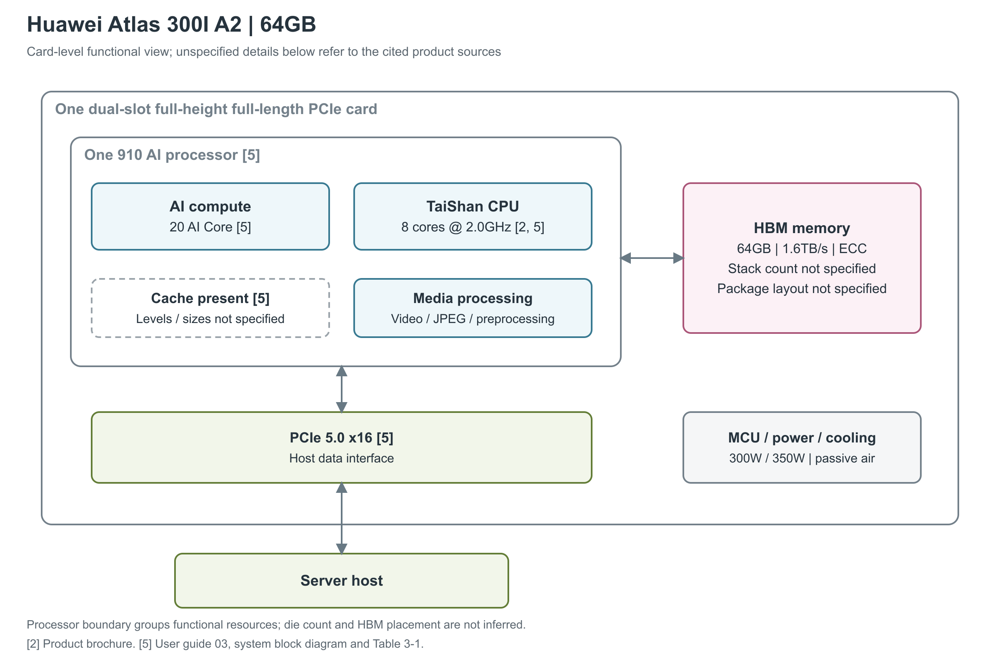

# 华为 Atlas 300I A2 64GB

Atlas 300I A2 是安装在服务器中的 PCIe 推理加速卡，面向生成式模型、推荐、搜索和内容审核。64GB 型号将 AI 计算、通用 CPU、媒体处理与 HBM 高带宽内存放在同一张卡上；产品指南将用途明确限定为推理。理解这张卡时，既要看模型计算能力，也要看输入数据如何进入处理器、媒体预处理占用什么资源，以及服务器能否提供所需电力与气流。[1, 概述] [2, 应用场景] [5, 产品简介“概述”]

图：依据用户指南图1-2和表3-1重绘到板卡与处理器功能层。卡上有一颗 910 AI 处理器；内部的 AI Core、CPU、Cache 和媒体框是功能分组，HBM 单独画在右侧便于理解数据流，不表示实际封装位置或堆栈数量。指南没有公开准确芯片子型号及 cache 层级，不能照搬原始 Ascend 910 的物理框图。[5, 图1-2、表3-1] [2, 产品规格]

## 从处理器内部到主机

处理器集成 20 个 AI Core 和 8 个 TaiShan Core，彩页给出 CPU 频率 2.0GHz。AI Core 执行神经网络计算，CPU 处理通用任务，图像与视频单元承担模型输入前后的媒体工作。官方虚拟化资源查询另列 7 个可分配 AI CPU；这是软件资源池的数量，与八核物理 CPU 规格属于不同层次。[5, 图1-2、表3-1] [2, 产品规格] [4, 附录“查询单NPU卡规格”表1]

用户指南确认处理器提供 Cache，但尚未展开本卡使用的 Cube、Vector、Scalar 组织，以及 L0/L1/L2、寄存器的数量、容量和内部带宽。本篇因此把图画到 AI Core 和 Cache 这一层；即使知道处理器属于 910 系列，也不足以把较早 910 或另一个 910 子型号的核心频率、HBM 组织和微基准结果迁移过来。[5, 系统框图、基本规格]

卡通过 PCIe 5.0 ×16 接口与主机通信。板上的 MCU 是管理微控制器，服务器 iBMC 可以通过它读取 PCB、BOM 版本，以及单板温度、功耗、电源电压；指南还列出带内在线升级和带内、带外状态查询。这里的管理通路与承载模型数据的 PCIe 通路作用不同。[5, 系统框图、表3-1、可维护性] 维护文档为本卡提供 PCIe 信号质量查询，本组产品资料没有给出可用于推导 HCCS 或 RoCE 带宽的本卡专属接口规格。[3, 眼图测试参数]

## 算力与 HBM

| 图中部分 | 本型号规格 | 数值适用范围 |
|---|---|---|
| AI 计算 | INT8 560TOPS；FP16 280TFLOPS；FP32 75TFLOPS | 单卡最高规格；FP32 来自彩页，资料没有分解矩阵与向量通路，也未注明 dense/sparse、累加格式。[1, 技术规格] [2, 产品规格] |
| AI Core / CPU | 20 AI Core；8 TaiShan Core，CPU 2.0GHz | CPU 频率不等于 AI Core 频率。[5, 表3-1] [2, 产品规格] |
| HBM | 64GB，1.6TB/s，支持 ECC | 标称容量和带宽，ECC 为存储纠错。[5, 表3-1] |
| Cache / 本地存储 | 确認有 Cache；具体层级、容量、带宽与延迟未列出 | 不能从 DRAM 带宽推算片内存储带宽。[5, 系统框图、表3-1] |
| 主机接口 | PCIe 5.0 ×16 | 接口代际和通道数，不是已测得的 DMA 吞吐。[5, 表3-1] |
| 整卡功耗档位 | 300W / 350W，被动风冷 | 由供电连接方式选择上限，条件见后文。[5, 表3-1、电源管理] |

TOPS 与 TFLOPS 分别表示每秒万亿次整数和浮点运算。彩页给出的 FP32 75TFLOPS 没有说明它具体来自 Vector、Cube 或其他路径，不能擅自把它改写成“FP32 向量峰值”。同样，FP16 280TFLOPS 没有配套精度累加说明。用户指南将峰值标为理论设计值，并提示实际测量可能存在误差；算子形状、数据准备和精度转换都会影响任务持续吞吐。[2, 产品规格] [5, 表3-1脚注a]

HBM 容量决定权重、激活和 KV Cache 等运行数据能同时占用多少空间，带宽则约束它们在计算期间的搬运速度。32GB 与 64GB 是同名产品的两个正式配置：前者为 800GB/s，后者为 1.6TB/s；两款在规格表中共用计算峰值。更大的内存与更高带宽有助于不同的瓶颈，不能直接换算成任意模型的吞吐比例。[1, 技术规格] [2, 产品规格] [5, 表3-1]

现有本卡资料未给出 HBM 代际、堆栈数、总位宽、时钟、封装位置或持续带宽测试条件，也没有型号级 BF16、FP8、INT4 峰值和结构化稀疏倍率。图中保留这些边界，避免把邻近产品的详细数据误写成这张卡的规格。[1, 技术规格] [2, 产品规格] [5, 表3-1]

## 媒体处理与虚拟化资源

媒体单元使卡能够直接处理视觉输入。下面的吞吐均为官方“等效”规格，FPS 表示帧每秒；资料没有给出 codec profile、bit depth 和并行流配置，因此不能理解成对任意视频或图像的保证。[2, 产品规格] [5, 表3-1]

| 处理路径 | 等效吞吐 | 图像尺寸范围 |
|---|---|---|
| 视频解码 | 1080p，480FPS | 本表没有列出完整分辨率范围 |
| JPEG 解码 | 1080p，12,288FPS | 32×32 至 16,384×16,384 |
| JPEG 编码 | 1080p，1,024FPS | 32×32 至 8,192×8,192 |

上表均来自彩页“产品规格”和用户指南表3-1。[2, 产品规格] [5, 表3-1]

官方资源查询表列出整卡可分配的 20 AI Core、64GB 内存、7 AI CPU、9 VPC、2 VDEC、24 JPEGD、4 JPEGE。VPC 是图像预处理资源，VDEC 是视频解码，JPEGD/JPEGE 分别是 JPEG 解码/编码；VENC（视频编码）为 0，PNGD（PNG 解码）为不适用。这里描述的是软件可分配资源，并没有给出每个资源背后的物理流水线组织。[4, 附录“查询单NPU卡规格”表1]

| 单个 vNPU 模板 | AI Core | 内存/GB | AI CPU | VPC | VDEC | JPEGD | JPEGE |
|---|---:|---:|---:|---:|---:|---:|---:|
| `vir10_3c_32g` | 10 | 32 | 3 | 4 | 1 | 12 | 2 |
| `vir05_1c_16g` | 5 | 16 | 1 | 2 | 0 | 6 | 1 |

表中 vNPU 指从物理卡硬切分出的虚拟 NPU；所有模板的 PNGD 和 VENC 均为 0。这两种模板分别取走一半或四分之一的 AI Core 和内存，可以组成一分二或一分四的实例。媒体资源并不全部按同一比例分配：四分之一模板的 VDEC 为 0，适合已经完成视频解码或不需要视频解码的任务。[4, 附录“查询切分模板”表1]

这些配置来自 HDK 25.5.0 与 CANN 9.0.0-beta.1 的官方实践，软件版本是资源划分结论的条件。该实践限定一个推理服务只能绑定一张 vNPU，同一模型不能混用物理 NPU 与 vNPU；物理卡切分后不能再把整张物理卡挂载到容器，也不支持不同规格标卡混插后进行这套虚拟化。它说明了硬切分的使用边界，没有据此确认 SR-IOV。[4, §2.1、§2.2]

## 供电、散热与部署条件

这是一张双槽、全高全长 PCIe 卡，用户指南明确尺寸为长 266.7mm、宽 39.04mm、高 111.15mm，重量 1.32kg。它没有主动风扇，需要服务器提供气流，支持双向进风、出风。产品网页同表中的“五个热插拔风扇、4+1 冗余”指服务器抽屉；卡自身不支持通知式或暴力热插拔。[1, 技术规格] [5, 表3-1、散热要求、热插拔]

供电遵循 PCIe CEM 5.0。指南要求槽位具备 5.5A@12V 和 0.5A@3.3V 的供电能力，额外连接器提供 27A@12V。12V HPWR 连接器含六个 12V 电源脚、六个接地脚，并通过 S3/S4 感知线选择最大功耗：表中 S4 接地时为 350W，S4 悬空时为 300W，S3 的两种状态不改变这个结果；未连接 S1 至 S4 时默认最大 300W。这些数字说明供电配置要求，不表示实际任务一直消耗该功率。[5, 电源管理]

气流需求随进风温度和功耗档位增加。下表保留用户指南表3-3、表3-4的全部工作点；CFM 是每分钟立方英尺的体积流量，压降则描述气流通过散热器的阻力。[5, 散热要求表3-3、表3-4]

| 进风口平均温度 | 300W 建议最低风量 | 300W 压降 | 350W 建议最低风量 | 350W 压降 |
|---|---:|---:|---:|---:|
| 25°C | 13.1CFM | 64Pa | 17.5CFM | 98Pa |
| 30°C | 14.4CFM | 73Pa | 20.6CFM | 126Pa |
| 35°C | 17.2CFM | 95Pa | 25.3CFM | 177Pa |
| 40°C | 21.5CFM | 136Pa | 31.7CFM | 259Pa |
| 45°C | 27.4CFM | 202Pa | 39.7CFM | 383Pa |

原指南要求在实际服务器中验证上述建议值；卡只要处于上电状态，就需要至少 5.0CFM 气流。卡内传感器同时监测 AI 芯片和存储芯片，两者的降频温度均为 105°C，长期工作上限均为 105°C；下电温度分别为 AI 芯片 115°C、存储芯片 110°C。因此温度保护和主机气流会直接影响长时间运行能否维持性能。[5, 散热要求、表3-5]

环境规格为工作温度 5°C 至 45°C、存储温度 −40°C 至 70°C，非冷凝条件下工作相对湿度 8% 至 90%、存储相对湿度 8% 至 95%。工作海拔上限为 3050m；表3-2给出的通用规则是在海拔超过 900m 后每升高 300m，将最高环境温度降低 1°C。原表还为 ASHRAE A3/A4 配置分别列出 175m/125m 降低 1°C 的条件，具体服务器适配时须使用对应环境等级。[5, 表3-2]

主机识别本卡时，PCI Vendor ID 与 Subsystem Vendor ID 均为 `0x19E5`，Device ID 为 `0xD802`，本 64GB 配置的 Subsystem Device ID 为 `0x4001`。这些标识有助于区分同名的两款板卡，但不能单独推断处理器微架构。准确芯片子型号、独立首发日期、首次出货时间，以及尚未展开的片内层级带宽与延迟，仍未在本文所用资料中找到。[5, 表3-1] [1, 产品页] [2, 产品规格]

## 参考资料

[1] Huawei，*Atlas 300I A2*。<https://e.huawei.com/cn/products/computing/ascend/atlas-300i-a2> [本地原文](../../原始资料/网页快照/华为/产品详解补充/2026-09-17/atlas-product.html)

[2] Huawei，*Atlas 300I A2 推理卡产品彩页*。<https://e.huawei.com/marketingcloud/pep/asset/20000001/Material/799a9236e96a48b7aa126b10f3d7be97/M3T1A590N1195067466974908517/%E6%98%87%E8%85%BEAtlas%20300I%20A2%20%E6%8E%A8%E7%90%86%E5%8D%A1%E4%BA%A7%E5%93%81%E5%BD%A9%E9%A1%B5.pdf> [本地原文](../../原始资料/论文/华为昇腾_DaVinci/90_官方白皮书与技术资料/Atlas300IA2-产品彩页-20260917.pdf)

[3] Huawei Ascend Community，*眼图测试*，MindCluster 7.2.RC1。<https://www.hiascend.com/document/detail/zh/mindcluster/72rc1/toolbox/toolboxug/toolboxug_0021.html> [本地原文](../../原始资料/网页快照/华为/产品详解补充/2026-09-17/atlas-eye-original.html)

[4] Huawei Ascend Community，*NPU 卡虚拟化硬切分参考实践*。<https://www.hiascend.com/developer/techArticles/20251212-1?envFlag=1> [本地原文](../../原始资料/网页快照/华为/产品详解补充/2026-09-17/atlas-virtual.html)

[5] Huawei，*A300I A2 推理卡 用户指南 03*，EDOC1100503150，2026-06-01 更新。[系统框图](https://support.huawei.com/enterprise/zh/doc/EDOC1100503150/af5a256f)、[基本规格表3-1](https://support.huawei.com/enterprise/zh/doc/EDOC1100503150/e95402c0)、[环境条件表3-2](https://support.huawei.com/enterprise/zh/doc/EDOC1100503150/8033246b)、[电源管理](https://support.huawei.com/enterprise/zh/doc/EDOC1100503150/492ce033)、[散热要求表3-3、3-4](https://support.huawei.com/enterprise/zh/doc/EDOC1100503150/6f44892d)、[器件温度表3-5](https://support.huawei.com/enterprise/zh/doc/EDOC1100503150/561974c7)、[热插拔](https://support.huawei.com/enterprise/zh/doc/EDOC1100503150/6aacf894)、[可维护性](https://support.huawei.com/enterprise/zh/doc/EDOC1100503150/93b7cfdf)。 [本地原文 1](../../原始资料/网页快照/华为/产品详解补充/2026-09-17/atlas-guide-block.html) [本地原文 2](../../原始资料/网页快照/华为/产品详解补充/2026-09-17/atlas-guide-basic.html) [本地原文 3](../../原始资料/网页快照/华为/产品详解补充/2026-09-17/atlas-guide-environment.html) [本地原文 4](../../原始资料/网页快照/华为/产品详解补充/2026-09-17/atlas-guide-power.html) [本地原文 5](../../原始资料/网页快照/华为/产品详解补充/2026-09-17/atlas-guide-thermal-requirement.html) [本地原文 6](../../原始资料/网页快照/华为/产品详解补充/2026-09-17/atlas-guide-thermal-spec.html) [本地原文 7](../../原始资料/网页快照/华为/产品详解补充/2026-09-17/atlas-guide-hotplug.html) [本地原文 8](../../原始资料/网页快照/华为/产品详解补充/2026-09-17/atlas-guide-maintain.html)
