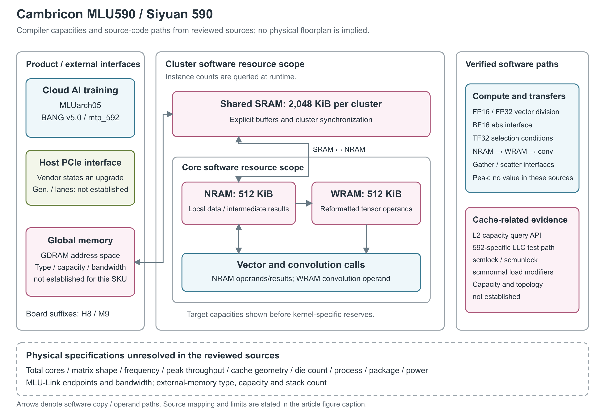

# 寒武纪思元 590 / MLU590

思元 590 是寒武纪在 2022 年公布的云端智能训练芯片，采用 MLUarch05 架构。官方开源代码补充了新闻没有展开的存储作用域、算子搬运路径和数值模式，但尚不足以还原整颗芯片的计算阵列与封装。下面的图据此区分产品定位、软件可见资源和仍缺少定值的物理规格。[1, 正文“在演讲的最后”及下一段] [4, independent_build.sh, lines 123-127] [5, core/context.cpp, lines 193-249]

图：中间的计算核（Core）和核组（Cluster）是驱动属性与算子代码使用的资源作用域，框内容量是 MLU590 编译目标值；只画一个作用域实例，不表示实际核数。箭头表示源码中可见的拷贝方向与计算操作数路径，不表示物理总线、端口或带宽。右侧给出已确认的软件计算与 LLC（last-level cache，末级缓存）测试路径；底部虚线框保留没有型号级定值的物理参数。[1, 新品介绍] [2, §3.1-3.2, Tables 3.1-3.3] [4, lines 123-127] [5, core/context.cpp, lines 204-219；kernels/kernel.h, lines 36-80] [6, binary_op_5pipeline.h, lines 100-153；deformable-attention backward, lines 582-611；div_union1.mlu, lines 84-124；abs.cpp, lines 54-63；scatter_gather.h, lines 74-88] [7, executor.cpp, lines 972-1004；fill_llc_device.mlu, lines 26-52]

## 产品名称与软件目标

寒武纪公司新闻使用中文产品名“思元590”，CNToolkit 文档则在 Chip Level 一栏写 MLU590。两份材料没有直接声明二者为别名，本文按同厂商、同型号号段谨慎归并。MLU590-H8 和 MLU590-M9 列在 Board Level，属于板卡名称；名称本身没有说明板上芯片数、内存容量或功耗。[1, 正文末段新品介绍] [2, §3.1, Table 3.1]

MLUarch05 是新闻中的架构名称；BANG v5.0、`compute_50` 和 `mtp_592` 是工具链的计算能力与目标标识。CNCC 编译器将 MLU590 映射到 `compute_50 / mtp_592`，CNAS 汇编器使用 `mtp_592`。CNToolkit 将 `mtp_NWG.QC` 中的 `NWG` 定义为编译时感知的计算能力，`QC` 则描述运行时感知的并行可扩展能力，因此 `mtp_592.{18}` 不能读成“18 个核”。同一行还列有 MLU570，这表示软件目标共用，不能据此互相移植物理规格。[2, §3.1 命名规则；§3.1-3.2, Tables 3.1-3.3]

CNToolkit 的同一资源行还原样列出 `(4096WFU+512WRAM, 512NRAM, 2048SRAM)`。其中 WFU 是该表的资源标签，本页未说明其计数单位和每周期运算定义，因而本文只保留这项原报字段，不把 `4096WFU` 换算为硬件乘加（MAC）单元数或峰值算力；三个存储字段则可以与下文的编译容量及驱动作用域对应。[2, §3.1, Table 3.1] [4, lines 123-127] [5, core/context.cpp, lines 204-219]

实际可见的计算资源还受运行上下文影响。官方开源算子库 MLU-OPS 初始化时分别查询设备的 cluster 数、每个 cluster 的 core 数，以及当前上下文可见的 cluster 数和 Union 任务限制。这里的 cluster 是计算核组成的资源组，Union 是跨一组 cluster 调度任务的类型；源码采用运行时查询结果，不给 MLU590 写死一个全芯片核数。[5, core/context.cpp, lines 193-203, 259-284] [8, §3.3.4.1]

## 本地存储的容量、作用域与软件预留

固定版本的 MLU-OPS 构建帮助给出本地数据存储 NRAM、权值存储 WRAM、共享存储 SRAM 三种容量宏；同版本初始化代码使用的驱动属性分别是 `NRAM_SIZE_PER_CORE`、`WEIGHT_RAM_SIZE_PER_CORE` 和 `MAX_SHARED_RAM_SIZE_PER_CLUSTER`。结合这两处，可以把此前只有名称的资源明确到每个计算核与每个 cluster，仍不能在缺少实例数量时求出全芯片总容量。[4, lines 123-127] [5, core/context.cpp, lines 204-219]

| 软件可见存储 | MLU590 目标容量 | 作用域及源码中的使用方式 | 原文定位 |
|---|---:|---|---|
| NRAM | 512 KiB | 每个计算核的本地数据空间；向量算子在其中安排输入、输出与临时缓冲区 | [4, lines 124-126] [5, core/context.cpp, lines 204-208] [6, abs_block.mlu, lines 78-90；unary_op_3pipeline.h, lines 69-98] |
| WRAM | 512 KiB | 每个计算核的权值数据空间；卷积路径将数据从 NRAM 按要求重排、搬入 WRAM，再交给卷积计算 | [4, lines 124-126] [5, core/context.cpp, lines 209-213] [6, deformable-attention backward, lines 582-611] |
| SRAM | 2,048 KiB，即 2 MiB | 每个 cluster 的共享数据空间；算子可通过它在 GDRAM 与各核 NRAM 之间分块搬运数据 | [4, lines 124-126] [5, core/context.cpp, lines 214-219] [6, binary_op_5pipeline.h, lines 100-153] |

原构建帮助写作 KB；表中采用 KiB，因为同版本 `kernels/kernel.h` 将这些宏乘以 1,024 后作为字节容量使用。NRAM、WRAM 和共享 SRAM 在这里都是显式声明、划分并通过拷贝指令使用的本地存储空间，不能简单改称 L1/L2 cache；GDRAM 指代码可访问的全局 DRAM 地址空间，也不等于已经确认采用某一代 HBM。[5, kernels/kernel.h, lines 36-80] [6, div_union1.mlu, lines 35-37；deformable-attention backward, lines 35-41] [8, §3.3.2]

编译目标容量也不等于算子能全部拿来放 tensor。通用头文件定义 `REM_FOR_STACK = 128 × 1,024` 字节，注明预留给 CNCC 编译器，并从 NRAM 与 SRAM 的容量中减去这部分。因此在采用该通用宏的 MLU590 kernel 中，可分配的缓冲区上限分别为 384 KiB NRAM、1,920 KiB SRAM；WRAM 的通用上限仍为 512 KiB。这里的减法是按源码得到的软件预算，不表示芯片少实现了对应存储。[5, kernels/kernel.h, lines 36-41, 67-85；core/context.cpp, lines 274-296]

不同 kernel 还会采用自己的预留方式。例如该版本 deformable-attention backward 实现为 NRAM 预留 48 KiB、为 SRAM 预留 32 KiB；结合目标容量，其显式数组大小分别是 464 KiB、2,016 KiB，WRAM 数组为 512 KiB。这与通用头文件的预算并不矛盾，说明“可用容量”必须连同具体 kernel 的缓冲区分配一起阅读。片上空间会继续分给输入、输出、中间结果和流水缓冲，不能把整块 NRAM 都算成一个矩阵 tile 的可用空间。[6, deformable-attention backward, lines 29-41, 450-485] [5, kernels/kernel.h, lines 67-80]

## 向量、张量计算与数值模式

官方开发指南用 ALU 表示标量执行、VFU 表示向量执行、TFU 表示矩阵或卷积执行，并介绍 IO-DMA 和 Move-DMA 两类搬运流水。不过该指南在硬件模型开头说明下文以 MLU03 为例，不能把其中的流水组织、核数或性能数字直接当成 MLU590。对于本型号，更直接的证据来自带有 `592` 编译条件的算子实现。[8, §3.3.1-3.3.3] [6, div_union1.mlu, lines 79-108；deformable-attention backward, line 462]

向量路径中，除法 kernel 在 `__BANG_ARCH__ >= 592` 分支调用 `__bang_div`，分别处理 `float`（FP32）和 `half`（FP16）输入输出，操作数位于 NRAM。绝对值算子的主机检查对 MLU590 及后续目标开放 BF16（16 位浮点数据格式），并在设备代码中使用 `__bang_abs` 处理本地数据；BF16 与 FP16 在这一绝对值实现中复用 `half` 模板，不能据此认定存在一条独立的原生 BF16 算术链。这些实现提供了相应的数据类型支持与编程接口，但无法单独给出向量 lane 数、指令延迟、每周期吞吐或特殊函数单元数量。[6, div_union1.mlu, lines 84-124；abs.cpp, lines 54-63；abs_block.mlu, lines 78-90, 124-139]

卷积路径通过 WRAM 存放经过重排的操作数。在专门针对 `__BANG_ARCH__ == 592` 的 deformable-attention backward 分支中，程序先把 NRAM 中的中间数据以 `NRAM2WRAM` 搬运到 WRAM，按 kernel 使用的分段布局排列，再用 `__bang_conv` 与全一向量完成求和归约。随后结果参与 NRAM 上的向量运算并写回 SRAM。这个例子表明卷积计算路径可以被算子代码用于归约，不意味着 MLU590 内置了一个专用 deformable-attention 单元；代码里的布局分段数也不能直接解释成硬件乘加（MAC）单元数。[6, deformable-attention backward, lines 450-462, 580-622]

软件还区分了 FP32 与 TF32 计算模式：测试框架的 `isPlatformSupportTf32()` 对 MLU590 返回真，而选择 TF32 计算效率口径时还检查两个操作数的计算数据类型是否为 `float`、环境开关是否开启，以及算子参数是否允许。计算数据类型优先取 `oc_dt` 覆写值，否则取 tensor 的 `dtype`，因此不能只检查外部输入格式。`CAMBRICON_TF32_OVERRIDE` 用于控制 FP32 计算是否允许使用 TF32。该版本用于选择张量计算效率口径的 `lt_op_set` 仍为空，所以上述内容只说明框架中的能力判断与选择逻辑，不表示普通测试已经走过这一分支，也不能据此补出乘积精度、累加位宽或硬件舍入规则。[7, executor.cpp, lines 972-1024；executor.h, lines 109-110；core/mlu_env.cpp, lines 28-32]

CNNL（寒武纪人工智能计算库）的发布说明还记录了 BF16 算子范围：MLU500 series 的 BF16 支持已覆盖文档列出的部分算子，包括矩阵乘、卷积反向数据计算等。库支持范围不等于所有矩阵指令都采用相同的输入、乘积与累加链。本文保留这些有明确适用范围的软件支持记录；所查资料尚未给出 MLU590 硬件矩阵计算的完整输入、乘积与累加精度链。[3, v1.23.0“特性变更”] [7, executor.cpp, lines 1007-1016, 1107-1143]

本文核对的固定版本测试源码没有填出 MLU590 的张量峰值算力。尽管存在 INT8、INT16、FP16、FP32 和 TF32 的型号专用计算分支，对应的张量吞吐常量在这个固定版本中全部初始化为零，MLU590 的静态 IO 带宽常量也为零。这些值不能解释成硬件能力为零，也不能作为峰值计算的依据。测试框架另有共用的向量计算系数，但没有足够的本型号硬件说明将其升格为规格；目前仍缺少可采用的型号级峰值与每核吞吐定值。[7, executor.h, lines 69-110；executor.cpp, lines 948-969, 1027-1157]

## 数据怎样进入计算核

MLU590 的算子代码支持两类可辨认的数据流。绝对值算子采用的三级流水直接在 GDRAM 与 NRAM 之间异步拷贝，把 NRAM 分成交替使用的缓冲区，在读取下一块、计算当前块和写回上一块之间安排显式同步。这里的“三级”指软件中的 load、compute、store 阶段，并非芯片内部只有三级硬件 pipeline。[6, abs_block.mlu, lines 115-139；unary_op_3pipeline.h, lines 69-98]

除法算子调用的五级流水加入 cluster 共享 SRAM：数据先由 GDRAM 进入 SRAM，再按计算核分块搬入 NRAM，完成向量计算后沿 NRAM→SRAM→GDRAM 返回。源码在这些步骤之间使用 `__sync_cluster()` 和计算同步，并安排交替缓冲。它说明共享 SRAM 能承担跨核分发和汇集中的缓冲作用，但不提供 SRAM 端口数、搬运引擎数量，也不证明每条路径都能同时达到各自峰值。[6, div.cpp, lines 72-80；div_union1.mlu, lines 35-37, 107-125；binary_op_5pipeline.h, lines 79-153]

非连续地址访问也有本型号对应的入口：`scatter_gather.h` 为 `__BANG_ARCH__ == 592` 定义同步、异步的 gather/scatter 包装，并根据是否传入 mask 选择调用形式。结合前面的分块拷贝，可以确认软件能够处理连续与索引式的数据搬运；这还不足以判断硬件合并访存粒度、事务数量或随机访问带宽。[6, scatter_gather.h, lines 74-88]

访存对齐与物理接口宽度也要分开。通用 kernel 头文件定义 `NFU_ALIGN_SIZE = 128` 字节、`WRAM_ALIGN_SIZE = 64`，计算元素数的对齐常量为 64。这些是该实现采用的分块与布局约束，不能将它们写成 NRAM 的 bank 数、每周期 128 字节带宽或一个硬件向量的固定长度。[5, kernels/kernel.h, lines 49-53]

## Cache、片外内存与互联

固定源码包含 cache 相关的查询与测试路径。运行时初始化会查询最大 L2 cache 容量与 persisting L2（持久保留区）容量；测试端还有只对架构码 `592` 启用的 LLC 填充函数，使用带 `scmlock`、`scmunlock`、`scmnormal` 修饰的 GDRAM→NRAM 读取指令。它们证明软件具有相应的缓存查询和测试机制，尚不能确定 MLU590 的 cache 层次映射、bank 数、替换策略或一致性协议。[5, core/context.cpp, lines 239-249] [7, fill_llc.mlu, lines 27-36；fill_llc_device.mlu, lines 26-52]

测试框架对设备名包含 `MLU590` 的分支分配 48 MiB 常量内存作为 LLC 测试区。这个数是公开源码中的测试工作集大小，缺少硬件规格书或实测容量曲线时，不将其写成“MLU590 有 48 MiB L2”。缓存测试区、每核 NRAM 和每个 cluster 的共享 SRAM 是三种不同对象，不能相加得到所谓片上总缓存容量。[7, executor.h, lines 645-652；executor.cpp, lines 1521-1536]

对于片外内存，2022 年厂商新闻只说思元590 比当时在售产品拥有更大的容量、更高的带宽，并升级了 PCIe 接口，没有给出具体对比型号和绝对值。运行时源码查询内存时钟、全局内存总线宽度，并据此计算带宽，但本文所查源码没有附带 MLU590 设备实际返回的数值。因而 HBM/GDDR 类型、容量、堆栈数、内存带宽，以及 PCIe 代际和 lane 数，仍不能从这些资料确定。[1, 正文“据介绍”] [5, core/context.cpp, lines 229-238, 279-280]

CNDrv 与 CNRT 分别是驱动接口库和运行时库，提供主机与设备内存管理、异步执行以及多卡多机协同接口。该描述没有给出 MLU590 的设备互联端点、链路数、MLU-Link 带宽或集合通信卸载单元。制程、裸片面积、晶体管数、封装内裸片数量、运行频率与功耗，也没有在本文已核资料中形成可采用的型号级定值。[2, §3.4.3-3.4.4] [1, 新品介绍] [4-8, 本文使用的型号条目与源码]

## 公开状态与资料边界

2022 年 9 月 2 日的 WAIC 新闻将思元590 称为“在研”产品；CNNL v1.14.0 的发布说明记录新增 MLU590 硬件支持，CNToolkit 和官方 MLU-OPS 也列入该目标。这足以确认其进入正式软件工具支持范围，不能只凭 SDK 条目判定量产日期、独立销售或当前可订购状态。[1, 页面日期与新品介绍] [2, Tables 3.1-3.3] [3, v1.14.0“特性变更”] [4, lines 65-70, 123-127]

本文所用 MLU-OPS 固定提交已重新取得完整源码，构建脚本也与本地归档内容一致。CNToolkit 和 CNNL 页面直连仍遇到官方服务的访问或网关错误，但本次已保存搜索引擎对同一官方页面呈现的正文及章节；相关引用限于实际呈现的内容。官方开发指南中以其他架构为例的物理组织，以及本地资料里其他思元型号的数字，均不填入 MLU590 规格。[2-3, 官方页面搜索呈现与访问条件] [4-8, 固定提交] [8, §3.3.1]

## 参考资料

[1] 寒武纪，《2022 WAIC：寒武纪展现全算力产品实力 用“芯”助力行业快速升级》，2022-09-02。[官方网页](https://www.cambricon.com/index.php?a=show&c=index&catid=127&id=51&m=content)；[本地快照](../../原始资料/网页快照/寒武纪/MLU590/2026-08-12/WAIC_2022_思元590_2022-09-02.html)。

[2] 寒武纪，*CNToolkit 安装升级使用手册 3.8.4*，§3 组件介绍。[官方文档](https://sdk.cambricon.com/static/independent/CNToolkit/3.8.4/releasenote/3.8.4/build/html/chapter_components/index.html)，本次使用同页搜索呈现的 §3.1-3.2（Tables 3.1-3.3）及 §3.4.3-3.4.4。 [本地检索正文（非原始PDF或HTML）](../../原始资料/网页快照/寒武纪/MLU590/2026-09-17/cntoolkit-search-original.txt)

[3] 寒武纪，*CNNL 1.23.2 版本说明书*。[官方文档](https://sdk.cambricon.com/static/independent/CNNL/1.23.2/releasenote/1.23.2/build/html/cnnl.html)，本次使用同页搜索呈现的 v1.14.0、v1.23.0 条目。 [本地检索正文（非原始PDF或HTML）](../../原始资料/网页快照/寒武纪/MLU590/2026-09-17/cnnl-search-original.txt)

以下源码和开发指南统一固定在 Cambricon `mlu-ops` commit `67b3707f9ce55718490534955903a007ae86f517`；行号对应该提交，不随主分支变化。

[4] Cambricon，MLU-OPS 构建脚本。[independent_build.sh](https://github.com/Cambricon/mlu-ops/blob/67b3707f9ce55718490534955903a007ae86f517/independent_build.sh#L123-L127)。 [本地原文](../../原始资料/网页快照/寒武纪/MLU590/2026-09-17/mlu-ops/independent_build.sh)

[5] Cambricon，MLU-OPS 资源查询与缓冲区宏。[core/context.cpp](https://github.com/Cambricon/mlu-ops/blob/67b3707f9ce55718490534955903a007ae86f517/core/context.cpp#L193-L296)；[kernels/kernel.h](https://github.com/Cambricon/mlu-ops/blob/67b3707f9ce55718490534955903a007ae86f517/kernels/kernel.h#L33-L85)。 [本地原文 1](../../原始资料/网页快照/寒武纪/MLU590/2026-09-17/mlu-ops/core/context.cpp) [本地原文 2](../../原始资料/网页快照/寒武纪/MLU590/2026-09-17/mlu-ops/kernels/kernel.h)

[6] Cambricon，MLU-OPS 算子与数据搬运实现。[abs.cpp](https://github.com/Cambricon/mlu-ops/blob/67b3707f9ce55718490534955903a007ae86f517/kernels/abs/abs.cpp#L54-L63)；[abs_block.mlu](https://github.com/Cambricon/mlu-ops/blob/67b3707f9ce55718490534955903a007ae86f517/kernels/abs/abs_block.mlu#L78-L139)；[div.cpp](https://github.com/Cambricon/mlu-ops/blob/67b3707f9ce55718490534955903a007ae86f517/kernels/div/div.cpp#L72-L80)；[div_union1.mlu](https://github.com/Cambricon/mlu-ops/blob/67b3707f9ce55718490534955903a007ae86f517/kernels/div/div_union1.mlu#L35-L125)；[unary_op_3pipeline.h](https://github.com/Cambricon/mlu-ops/blob/67b3707f9ce55718490534955903a007ae86f517/kernels/unary_op/unary_op_3pipeline.h#L69-L98)；[binary_op_5pipeline.h](https://github.com/Cambricon/mlu-ops/blob/67b3707f9ce55718490534955903a007ae86f517/kernels/binary_op/binary_op_5pipeline.h#L79-L153)；[scatter_gather.h](https://github.com/Cambricon/mlu-ops/blob/67b3707f9ce55718490534955903a007ae86f517/kernels/utils/scatter_gather.h#L74-L88)；[deformable-attention backward](https://github.com/Cambricon/mlu-ops/blob/67b3707f9ce55718490534955903a007ae86f517/kernels/ms_deform_attn/ms_deform_attn_backward/ms_deform_attn_backward_fast_union1.mlu#L29-L41)，本文用这一简称指该文件，其 `592` 专用分支见 lines 462-744。 [本地原文 1](../../原始资料/网页快照/寒武纪/MLU590/2026-09-17/mlu-ops/kernels/abs/abs.cpp) [本地原文 2](../../原始资料/网页快照/寒武纪/MLU590/2026-09-17/mlu-ops/kernels/abs/abs_block.mlu) [本地原文 3](../../原始资料/网页快照/寒武纪/MLU590/2026-09-17/mlu-ops/kernels/div/div.cpp) [本地原文 4](../../原始资料/网页快照/寒武纪/MLU590/2026-09-17/mlu-ops/kernels/div/div_union1.mlu) [本地原文 5](../../原始资料/网页快照/寒武纪/MLU590/2026-09-17/mlu-ops/kernels/unary_op/unary_op_3pipeline.h) [本地原文 6](../../原始资料/网页快照/寒武纪/MLU590/2026-09-17/mlu-ops/kernels/binary_op/binary_op_5pipeline.h) [本地原文 7](../../原始资料/网页快照/寒武纪/MLU590/2026-09-17/mlu-ops/kernels/utils/scatter_gather.h) [本地原文 8](../../原始资料/网页快照/寒武纪/MLU590/2026-09-17/mlu-ops/kernels/ms_deform_attn/ms_deform_attn_backward/ms_deform_attn_backward_fast_union1.mlu)

[7] Cambricon，MLU-OPS 数值模式与性能测试代码。[executor.cpp](https://github.com/Cambricon/mlu-ops/blob/67b3707f9ce55718490534955903a007ae86f517/test/mlu_op_gtest/pb_gtest/src/executor.cpp)；[executor.h](https://github.com/Cambricon/mlu-ops/blob/67b3707f9ce55718490534955903a007ae86f517/test/mlu_op_gtest/pb_gtest/include/executor.h)；[core/mlu_env.cpp](https://github.com/Cambricon/mlu-ops/blob/67b3707f9ce55718490534955903a007ae86f517/core/mlu_env.cpp#L28-L32)；[fill_llc.mlu](https://github.com/Cambricon/mlu-ops/blob/67b3707f9ce55718490534955903a007ae86f517/test/mlu_op_gtest/pb_gtest/src/internal_kernel/fill_llc/fill_llc.mlu#L27-L36)；[fill_llc_device.mlu](https://github.com/Cambricon/mlu-ops/blob/67b3707f9ce55718490534955903a007ae86f517/test/mlu_op_gtest/pb_gtest/src/internal_kernel/fill_llc/fill_llc_device.mlu#L26-L52)。 [本地原文 1](../../原始资料/网页快照/寒武纪/MLU590/2026-09-17/mlu-ops/test/mlu_op_gtest/pb_gtest/src/executor.cpp) [本地原文 2](../../原始资料/网页快照/寒武纪/MLU590/2026-09-17/mlu-ops/test/mlu_op_gtest/pb_gtest/include/executor.h) [本地原文 3](../../原始资料/网页快照/寒武纪/MLU590/2026-09-17/mlu-ops/core/mlu_env.cpp) [本地原文 4](../../原始资料/网页快照/寒武纪/MLU590/2026-09-17/mlu-ops/test/mlu_op_gtest/pb_gtest/src/internal_kernel/fill_llc/fill_llc.mlu) [本地原文 5](../../原始资料/网页快照/寒武纪/MLU590/2026-09-17/mlu-ops/test/mlu_op_gtest/pb_gtest/src/internal_kernel/fill_llc/fill_llc_device.mlu)

[8] Cambricon，*BANG C 算子开发*，§3.3 基本概念。[固定版本指南](https://github.com/Cambricon/mlu-ops/blob/67b3707f9ce55718490534955903a007ae86f517/docs/BANG-C-OPS-Develop-Guide.md#L615-L729)。该节以 MLU03 为说明实例，本文只用来解释编程术语和限定其适用边界。 [本地原文](../../原始资料/网页快照/寒武纪/MLU590/2026-09-17/mlu-ops/docs/BANG-C-OPS-Develop-Guide.md)
