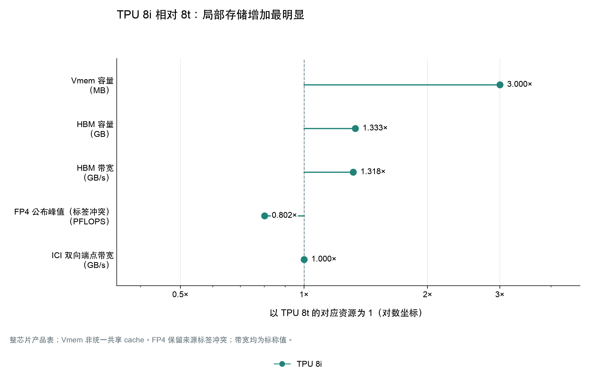
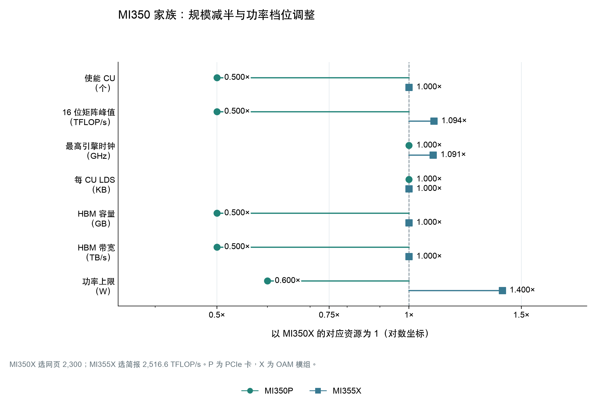
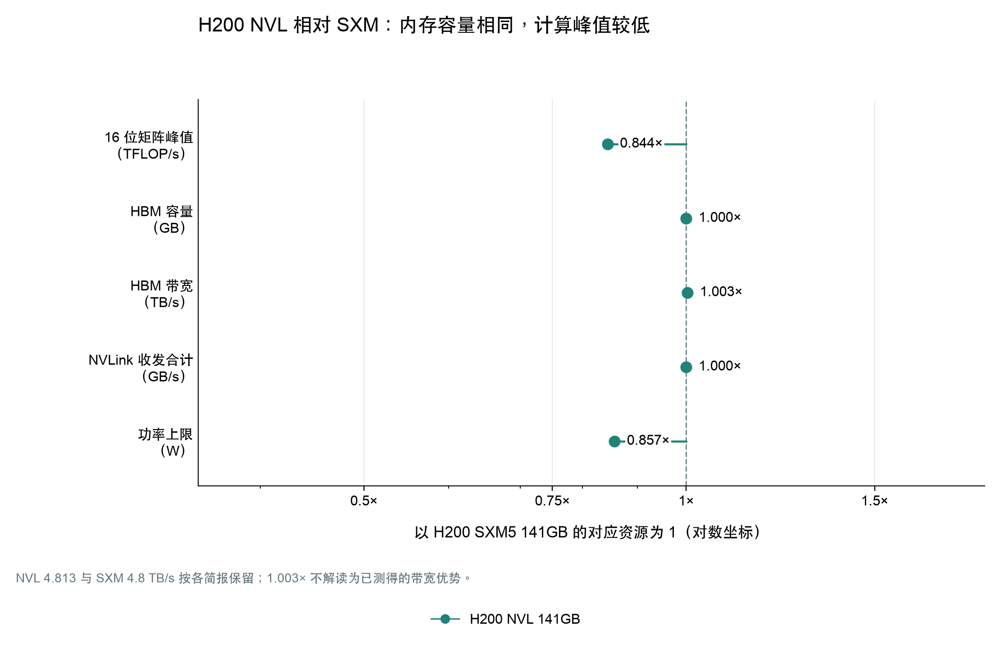

# 家族内产品比较

家族内比较显示，产品分化发生的位置并不固定。TPU 8 的差异涉及局部存储、专用计算与互联拓扑；Trainium1／Inferentia2 主要在共同核心之外调整连接；H100、H200 和 MI350 的多个配置还受到板卡形态、供电与冷却约束。比较时既要保留不同点，也要明确共同实现，否则容易把整个架构的能力写成某款产品独有的设计。

训练／推理取向与更高 B/P 之间没有在这些案例中形成稳定对应。H100 NVL、H200 NVL 的单位算力外存供给高于各自 SXM，但两组属于同一 Hopper 家族，不能计作两份独立架构证据；TPU 8i 在有精度标签分歧的条件下呈相似方向。TPU v5p 相对 v5e 的方向相反，Trainium1／Inferentia2 和 MI350P／MI350X 则分别近似相同。以下各节给出这些观察的数字、条件与官方解释。

跨代案例用于辨认其他影响因素：核心没有明显改变时，内存升级仍能改变存算配比；核心与内存同时升级时，还要检查实际增长是否同步。它们不作为新的训练／推理分化证据。同一产品在多个案例出现时也只计作一个产品观察。

| 对照类型 | 产品组 | 重点问题 |
|---|---|---|
| 官方负载目标对照 | [TPU 8t／8i](#family-a01) | 训练供给与 decoding 状态、同步开销分别怎样处理 |
| 官方负载目标对照 | [Ascend 950PR／950DT](#family-a02) | prefill 侧重与训练、decode 覆盖怎样对应内存方案；哪些计算档位尚未绑定 |
| 官方负载目标对照 | [Trainium1／Inferentia2](#family-a03) | 相同核心和本地存储之外，连接配置怎样不同 |
| 同代定位与规模 | [TPU v5e／v5p](#family-a04) | 每核工作存储、整芯片资源与扩展目标怎样分别变化 |
| 同架构部署配置 | [H100 SXM／PCIe／NVL](#family-a05) | 使能资源、HBM 与 GPU 连接如何适应不同服务器 |
| 同架构资源档位 | [MI350P／MI350X／MI355X](#family-a06) | 资源缩放与运行频率、冷却预算分别贡献什么 |
| 同架构部署配置 | [H200 SXM／NVL](#family-a07) | 相同容量与近似带宽怎样搭配不同计算及连接域 |
| 同架构用途侧重 | [L4／L40S](#family-a08) | 矩阵、图形与媒体资源是否同比增长 |
| 同用途容量配置 | [Atlas 300I A2 32GB／64GB](#family-a09) | 同为推理卡时，内存档位产生多大的组内跨度 |
| 跨代辅助案例 | [H100→H200](#family-a10) | 沿 SXM、NVL 两分支辨认内存升级 |
| 跨代辅助案例 | [MI300X→MI325X](#family-a11) | CDNA 3 核心延续时的内存变化 |
| 跨代辅助案例 | [Trainium2→Trainium3](#family-a12) | 核心、局部存储、HBM 与互联是否同步升级 |

### 9.1 TPU 8t / 8i：训练的数据供给与推理的状态、同步开销

Google 将 TPU 8t 的首要目标设为大规模 pretraining（预训练）与 embedding 密集负载，将 8i 的目标设为 post-training（后训练）、sampling（采样）和高并发 reasoning（推理）。两者均支持完整 AI 生命周期，因此适合按主要设计取向分组，不能解释成排他的训练或推理能力。官方对差异的解释相当具体：8t 要让矩阵计算持续得到数据，8i 要减少 autoregressive decoding（逐 token 生成）中保存状态、归约和同步造成的等待。[Google 技术详解，Specialized by design、The pre-training powerhouse、The sampling and serving specialist](../产品详解/Google-TPU/Google_TPU_8t_one_chip_产品详解.md#ref-1)

同一技术文章给出的资源配置如下。Vmem 是靠近向量执行单元的局部工作存储，不能与其他架构的透明 L2 cache 直接等同；表中的 HBM 为封装内高带宽主存，ICI 为芯片间互联。

| 整芯片资源或实现 | TPU 8t | TPU 8i | 比较意义与来源 |
|---|---:|---:|---|
| Vmem 容量 | 128 MB | 384 MB | 8i 为 3 倍；保留产品表的 MB 单位。[技术详解，On-Chip SRAM](../产品详解/Google-TPU/Google_TPU_8t_one_chip_产品详解.md#ref-1) |
| HBM3E 容量 | 216 GB | 288 GB | 8i 为 1.333 倍。[技术详解，HBM Capacity、Figures 1/4](../产品详解/Google-TPU/Google_TPU_8t_one_chip_产品详解.md#ref-1) |
| HBM 带宽 | 6,528 GB/s | 8,601 GB/s | 8i 为 1.318 倍；持续有效带宽未给出。[技术详解，HBM Bandwidth](../产品详解/Google-TPU/Google_TPU_8t_one_chip_产品详解.md#ref-1) |
| FP4 公布峰值 | 12.6 PFLOPS | 10.1 PFLOPS | 8i 为 0.802 倍；仅采用同一技术表，精度标签冲突见下文。[技术详解，Peak FP4 PFLOPs](../产品详解/Google-TPU/Google_TPU_8t_one_chip_产品详解.md#ref-1) |
| ICI 双向端点带宽 | 19.2 Tb/s | 19.2 Tb/s | 两款相同；各为 2,400 GB/s，未规定有效载荷条件。[8t 发布规格图，Bidirectional scale-up bandwidth](../产品详解/Google-TPU/Google_TPU_8t_one_chip_产品详解.md#ref-2)、[8i 同项](../产品详解/Google-TPU/Google_TPU_8i_one_chip_产品详解.md#ref-2) |
| 专用机制与系统互联 | SparseCore、LLM Decoder Engine；3D torus | CAE；Boardfly | 专用计算逻辑与芯片外拓扑分别比较。[技术详解，Specialized Chip Features、Network Topology](../产品详解/Google-TPU/Google_TPU_8t_one_chip_产品详解.md#ref-1) |

8i 的存储资源增加，而该表的矩阵峰值较低。按表内 FP4 条件计算，8i 的 HBM 带宽／算力为 8t 的 1.644 倍，既包含带宽增加，也包含峰值分母下降。这支持“8i 在此配置中给每单位公布算力配了更多存储资源”的描述，无法单独证明模型吞吐或每 token 延迟的改善。尤其是 8i 的官方发布图将 Pod 峰值标成 FP8，技术详解却使用 FP4，原资料未解释冲突；这个比值应保留为条件分析，不能转写成无歧义的 FP8、BF16 或全行业结论。JAX 静态开发模型中的运算速率也不用于重定标这两条产品峰值。[技术详解，at a glance](../产品详解/Google-TPU/Google_TPU_8t_one_chip_产品详解.md#ref-1)、[8i 发布规格图，FP8 Eflops per pod](../产品详解/Google-TPU/Google_TPU_8i_one_chip_产品详解.md#ref-4)

官方将 8i 的较大 Vmem 与长上下文 decoding 保存更多 KV Cache 联系起来；KV Cache 是此前 token 的 key/value 状态，占用随模型、上下文和并发量变化。其可用容量还受局部分区影响：JAX 对 8t 给单 TensorCore 128 MiB VMEM，对 8i 给每 TensorCore 192 MiB、共两个核心。两核容量相加不能说明一个核心可用全部空间，MiB 也不能与产品表的 MB 静默互换。Pallas 的编程模型由程序指定分块、编译器安排 HBM 搬运，进一步说明 Vmem 容量应结合工作区和调度方式理解。对 8t，官方更强调 VPU（向量处理单元）与 MXU（矩阵乘法单元）的配比，使 quantization、softmax、layer normalization 与矩阵乘重叠；SparseCore 则处理 embedding 的不规则访问，并卸载 data-dependent all-gather。它们改善的是矩阵计算前后的供给过程，不能仅由 Vmem 大小排序判断。[技术详解，Large on-chip SRAM、VPU/MXU overlap、The SparseCore advantage](../产品详解/Google-TPU/Google_TPU_8t_one_chip_产品详解.md#ref-1)、[JAX，TPU_8T/TPU_8I 分支与物理核心计数](../产品详解/Google-TPU/Google_TPU_8i_one_chip_产品详解.md#ref-21)、[Pallas，BlockSpecs and grid iteration](../产品详解/Google-TPU/Google_TPU_8i_one_chip_产品详解.md#ref-22)

8i 还在独立 chiplet 上配置 CAE（集合操作加速引擎），聚合芯片内两个 TensorCore 的结果，针对 decoding 的 reduction 与 synchronization。官方“片上 collective 延迟降低 5 倍”的声明缺少消息大小和完整基线，不能写成跨设备 all-reduce 或整模型加速。芯片外的 Boardfly 解决另一段等待：同为上述 ICI 端点带宽，8i 改用分层高连接度网络，8t 使用 3D torus 并面向更大训练域。官方用一个 1,024 节点 torus 的最长 16 hop 与 Boardfly 的 7 hop 作解释；这是示例网络的路径比较，并非 8t 完整 Superpod 的实测对照。文章还存在 Boardfly 四芯片 ring／fully connected、1,152 个位置／1,024 active chips 的表述差异，限制了精确复建。8t 则另有 TPUDirect RDMA/Storage 的主机旁路路径，发布图给出 400 Gb/s per chip 的 scale-out 网络配置；这部分属于系统供给，8i 未披露同口径值，不能补零。两款产品在存储、片内同步、芯片间拓扑和主机供给上分别调整，现有证据不足以把任何一项变化单独归因为模型性能提升。[技术详解，CAE、Boardfly ICI topology、Deep dive: The Boardfly vs. torus math、Faster storage access](../产品详解/Google-TPU/Google_TPU_8t_one_chip_产品详解.md#ref-1)、[8t 发布规格图，Scale-out networking bandwidth](../产品详解/Google-TPU/Google_TPU_8t_one_chip_产品详解.md#ref-2)

### 9.2 Ascend 950PR／950DT：共同核心下的内存选择

Ascend 950PR 的官方目标是推荐、大模型 prefill（输入上下文计算阶段）与多模态推理；950DT 则覆盖预训练、后训练及推理，明确包含 prefill 和 decode（逐步生成输出）。这组比较体现的是推理中的特定负载与全流程用途之间的选择。白皮书把不同内存配置作为两者共架构设计中的分化手段，同时保留相同的第三代 DaVinci 基本组织：两个 AI Die、两个 IO Die，每个 AI 子系统含一个 Cube 矩阵核和两个 Vector 向量核。PR 合封八个高速内存模块，DT 合封四个；模块数不代表内存容量高低，也不等于 DRAM 内部裸片层数。[架构白皮书，PDF pp.10、12-13／正文 pp.6、8-9](../产品详解/华为昇腾/华为_Ascend950PR.md#ref-1)

| 比较位置 | 950PR | 950DT | 对比时应保留的条件 |
|---|---|---|---|
| Cube／Vector 使能数 | 32／64 或 28／56 | 36／72、32／64 或 28／56 | 完整设计的 36 个 AI 子系统不等于每种配置的使能数 |
| 共同的 32-Cube 计算档位 | Cube FP16/BF16 为 432 TFLOPS；Vector 为 54 TFLOPS | 同左 | 486 TFLOPS 是 Cube+Vector 聚合值，不能作纯矩阵分母 |
| 同档低精度 Cube 峰值 | FP8、MXFP8、HiF8 为 865 TFLOPS；MXFP4 为 1730 TFLOPS | 同左 | 编码不同；未公开完整累加及稀疏条件 |
| 每 AI 子系统局部存储 | L1 512 KB；L0A/B 各 64 KB；L0C 256 KB；两个 Vector 各有 256 KB Unified Buffer | 同左 | 资源用途不同，不合并成一个共享 cache |
| 全局 L2 | 128／112 MB | 128 MB | 共同支持 512 B line、128 B sector；各档位与计算配置未完整绑定 |
| 官方明确并列的主推内存组合 | 128 GB、1.6 TB/s | 144 GB、4 TB/s | 可比较容量和带宽，不与任意计算档位拼成唯一 SKU |
| 设备通信接口 | 18 个 ×4 UB 端口，2016 GB/s 双向原始速率 | 同左 | UBoE、PCIe 共用部分端口，最大带宽不能相加 |
| 图像预处理与编解码 | VPC 4／2、JPEGD 8、JPEGE 4／2 | 同左 | PR 的多模态定位不意味着这些单元只在 PR 存在 |

表中规格来自[白皮书表3-1、图4-1、表4-2，PDF pp.13-15、17、25／正文 pp.9-11、13、21](../产品详解/华为昇腾/华为_Ascend950PR.md#ref-1)。两边共同的 32-Cube 档位具有相同计算规格；DT 额外提供 36-Cube 档位，但表中没有完整料号把计算、CPU、L2 和内存档位逐一绑定。因此不能把 PR 的最大计算、最大内存与 DT 的最大计算、最大内存分别拼成两个确定配置，再据此推导存算比。局部缓冲及低精度路径属于两者共享的基础，不能独立证明 PR 更面向推理。

内存差异可以直接比较。以白皮书同时列出的 128 GB／1.6 TB/s 和 144 GB／4 TB/s 两个组合为准，DT 的容量为 PR 的 1.125 倍，带宽为 2.5 倍。容量除以带宽得到 80 ms 和 36 ms，描述的是按标称带宽顺序流过全部容量一次的理想时间，不是随机访问延迟或模型请求延迟。[配置来源：白皮书，PDF p.10／正文 p.6；比值为据此计算](../产品详解/华为昇腾/华为_Ascend950DT.md#ref-1) 这一事实支持“DT 在内存吞吐上投入更多”的判断，却不支持“推理产品都应有更高带宽”的概括：PR 本身也是推理产品，目标中又有计算量和数据复用都较高的 prefill。是否形成性能收益，仍取决于具体算子的 DRAM 流量、复用和并行度。

L2 管理与调度提供了比容量更细的观察维度。两者的 L2 都采用多 bank 分布式组织，每个 bank 支持同时读写；跨 die 一致性由硬件维护，但保留局部亲和性。STARS2.0 可将资源划为最多八个 Group，按 die 调度以利用这种局部性，并通过独立于数据 NoC 的 HSCB 控制总线调度计算。NDDMA 以硬件地址生成和缓存聚合执行多维搬运；Cube 与 Vector 的直接通路则减少中间结果经过 L2 的交换。这些共同机制说明，外存带宽相同也不保证算子的实际搬运量相同；它们没有提供可用于比较的 L2 总带宽，不能用 1.6 或 4 TB/s 代替。[白皮书，PDF pp.22-23、26-28／正文 pp.18-19、22-24](../产品详解/华为昇腾/华为_Ascend950PR.md#ref-1)

通信也应作为共同能力理解。UB（Unified Bus，设备互联总线）支持异步 URMA、同步远程内存访问和 CCU 集合通信卸载；它与核内同样缩写为 UB 的 Unified Buffer 是不同资源。UBoE 提供两路 400 Gb/s 以太网接入，PCIe 5.0 ×16 提供主机连接，但二者分别与 UB 共用两个、四个端口。每个 IO Die 内的端口转发不经过计算 die 和 DRAM；面向超节点，UB 还可直接连接 CPU 内存池与存储资源池。这些机制扩展了设备可访问的资源范围，既不能计入封装 DRAM 容量，也没有证明自动迁移或远端全局缓存一致性。[白皮书，PDF pp.15、30-38／正文 pp.11、26-34](../产品详解/华为昇腾/华为_Ascend950DT.md#ref-1) 两款产品保留相同的通信规格，表明本组最明确的分化发生在内存方案与使能档位，而公开资料尚未显示另一套仅供 PR 或 DT 使用的 Cube、局部缓冲或通信核心。

### 9.3 Trainium1 / Inferentia2：共同计算核心与不同连接配置

AWS 对两款产品的目标描述不同：Trn1 面向生成式模型训练，Inf2 面向生成式模型推理。芯片文档进一步将 Trainium 的 NeuronLink 用于训练扩展与内存池，将 Inferentia2 的 NeuronLink 用于集合通信，以兼顾推理延迟和吞吐。因此，产品定位的依据来自官方负载目标；名称不同不意味着内部使用不同的计算核心。[Trn1 产品页，Why Amazon EC2 Trn1 Instances?](../产品详解/AWS/AWS_Trainium1_one_chip_产品详解.md#ref-5) [Inf2 产品页，Why Amazon EC2 Inf2 Instances?](../产品详解/AWS/AWS_Inferentia2_one_chip_产品详解.md#ref-5) [Trainium 芯片文档，NeuronLink](../产品详解/AWS/AWS_Trainium1_one_chip_产品详解.md#ref-1) [Inferentia2 芯片文档，NeuronLink](../产品详解/AWS/AWS_Inferentia2_one_chip_产品详解.md#ref-1)

官方 NKI（Neuron Kernel Interface，底层 kernel 编程接口）指南用同一份微架构说明覆盖两者。两款芯片均有两个 NeuronCore-v2，以下主要资源相同；能够直接确认的芯片级数量差异是 NeuronLink 接口由四组变成两组。[NKI 指南，device overview 与 NeuronCore-v2 Compute Engines](../产品详解/AWS/AWS_Trainium1_one_chip_产品详解.md#ref-2)

| 比较维度 | Trainium1 | Inferentia2 | 口径与依据 |
|---|---|---|---|
| 计算核心与引擎 | 2 个 NCv2；每核 Tensor、Vector、Scalar、GpSimd | 相同 | 四类引擎分别负责矩阵、向量归约、逐元素／非线性和可编程算子。[NKI，Compute Engines](../产品详解/AWS/AWS_Trainium1_one_chip_产品详解.md#ref-2) |
| 纯 Tensor 峰值 | FP16/BF16/TF32/cFP8：184 TFLOPS；FP32：46 TFLOPS | 相同 | 每核 92／23 乘两核的资源加总，采用原报取整数；芯片宣传值另列 190／47.5。[NKI，Tensor Engine: Data Types](../产品详解/AWS/AWS_Trainium1_one_chip_产品详解.md#ref-2) [芯片表，Compute](../产品详解/AWS/AWS_Trainium1_one_chip_产品详解.md#ref-1) |
| 本地 HBM | 2 stack，32 GiB；820 GiB/s | 相同 | 采用各自芯片技术页的容量与带宽分支。[Trainium，Device Memory](../产品详解/AWS/AWS_Trainium1_one_chip_产品详解.md#ref-1) [Inferentia2，Device Memory](../产品详解/AWS/AWS_Inferentia2_one_chip_产品详解.md#ref-1) |
| 每核工作与累加存储 | 24 MiB SBUF + 2 MiB PSUM | 相同 | SBUF 为软件管理暂存区，PSUM 保存矩阵部分和；两核各有局部空间。[NKI，Compute Engines、memory hierarchy](../产品详解/AWS/AWS_Trainium1_one_chip_产品详解.md#ref-2) |
| 数据搬运与通信单元 | 32 个 DMA；6 个 CC-Core | 相同 | DMA 为直接内存搬运引擎；CC-Core 负责集合通信，未披露单核通信吞吐。[NKI，device overview](../产品详解/AWS/AWS_Trainium1_one_chip_产品详解.md#ref-2) |
| NeuronLink-v2 接口 | 4 组 | 2 组 | 比较接口数量；不足以推导实际通信性能比。[NKI，device overview](../产品详解/AWS/AWS_Trainium1_one_chip_产品详解.md#ref-2) |

两者都支持 cFP8，而且其 Tensor 峰值与 FP16/BF16 相同。仅凭支持 8 位格式，无法将这组中的训练产品与推理产品分开，也不能把格式字长减半写成矩阵吞吐翻倍。按表中 184 TFLOPS、32 GiB 与 820 GiB/s 计算，两者的 DRAM 带宽／算力都约为 0.004785 Byte/FLOP，容量／算力都约为 0.1867 GB/TFLOPS。NKI 另写 820 GB/s；采用该分支会同时改变两款产品的带宽比值，但不会产生组内差异。190 TFLOPS 的芯片宣传值与 2×92 的 Tensor 加总值，官方没有解释计数差别，不能据此自行拆出其他引擎的贡献。[NKI，device overview、Tensor Engine: Data Types](../产品详解/AWS/AWS_Trainium1_one_chip_产品详解.md#ref-2) [Trainium 芯片表，Compute、Device Memory；比值按原值计算](../产品详解/AWS/AWS_Trainium1_one_chip_产品详解.md#ref-1)

共同点还包括影响利用率的执行约束。每个引擎有独立指令流，但 Vector 与 GpSimd 访问 SBUF 时、Vector 与 Scalar 访问 PSUM 时必须串行化。PSUM 每个 partition 有八个 bank，允许最多八组矩阵累加工作并存，使下一组矩阵运算可以与前一组结果处理重叠。TensorEngine 还可用 background LoadStationary，在当前矩阵计算期间预装下一块固定输入。它们解释了同一计算核心如何通过布局和调度减少等待，但没有证据表明这些机制只属于训练或只属于推理。共享机制与相同标称资源也不足以证明两类实例在任意 kernel 上都有相同实测利用率。[NKI，Data Movement、Near-memory accumulation in PSUM、Tensor Engine: Performance Consideration](../产品详解/AWS/AWS_Trainium1_one_chip_产品详解.md#ref-2)

连接差异需要连同系统用途解释。Trn1/Trn1n 的十六芯片实例采用 2D torus，官方明确支持经 NeuronLink 直接寻址池化设备内存；Inf2 文档则强调用 AllReduce、AllGather 等集合操作跨芯片分片模型，例如 Tensor Parallelism（张量并行）。后者的叙述不足以证明与 Trn1 具有完全相同的远端内存访问语义。Trainium 的跨代规格表写 384 GB/s/chip，Inf2 系统表写 192 GiB/s/chip，两者带宽方向未说明，且单位不同；不能由此或由 4∶2 接口数认定训练通信快两倍。该组提供的证据是：明确的训练／推理取向可以共用计算和本地存储资源，并在连接配置及部署方式上分化；它不支持“推理芯片必然有更高 DRAM 存算比”的普遍判断。[Trn1/Trn1n Architecture，拓扑与 memory pooling](../产品详解/AWS/AWS_Trainium1_one_chip_产品详解.md#ref-4) [Inf2 Architecture，实例表与 Tensor Parallelism](../产品详解/AWS/AWS_Inferentia2_one_chip_产品详解.md#ref-4) [Trainium2 Architecture，Interconnect comparison table](../产品详解/AWS/AWS_Trainium1_one_chip_产品详解.md#ref-8)

### 9.4 TPU v5e / v5p：成本效率与大规模训练的不同资源配置

Google 将 v5e 定义为兼顾训练与推理的产品，将 v5p 的重点放在大型模型训练、性能和扩展规模上。v5e 甚至在同一芯片上区分云资源的供应方式：training 配置优先吞吐和可用性，serving 配置优先时延。因此，本组比较的是同代产品的设计取向与部署规模，不能把 v5e 的所有特征归为“只服务推理”。官方 JAX 架构教程称 v5e 为 inference-optimized，反映其设计侧重；这与 Cloud 明确支持两种用途应分别记录。[v5e 文档，Configurations](../产品详解/Google-TPU/Google_Cloud_TPU_v5e_one_chip_产品详解.md#ref-1)；[v5p 发布文，Inside Cloud TPU v5p](../产品详解/Google-TPU/Google_Cloud_TPU_v5p_one_chip_产品详解.md#ref-4)；[JAX 教程，What Is a TPU?](../产品详解/Google-TPU/Google_Cloud_TPU_v5e_one_chip_产品详解.md#ref-20)

| 层级与资源 | TPU v5e | TPU v5p | 同口径观察与来源 |
|---|---|---|---|
| 单核矩阵结构 | 4 个 128×128 MXU | 4 个 128×128 MXU | 每 TensorCore 的矩阵阵列数量和大小相同；[JAX，TPU_V5E / TPU_V5P 分支](../产品详解/Google-TPU/Google_Cloud_TPU_v5p_one_chip_产品详解.md#ref-21) |
| 整芯片核心与 BF16 峰值 | 1 TensorCore，197 TFLOPS | 2 TensorCore，459 TFLOPS | 核数 2 倍，峰值约 2.33 倍；不能把其余差额全部解释为阵列结构变化；[v5e 规格](../产品详解/Google-TPU/Google_Cloud_TPU_v5e_one_chip_产品详解.md#ref-1)、[v5p 规格](../产品详解/Google-TPU/Google_Cloud_TPU_v5p_one_chip_产品详解.md#ref-1) |
| 每核 / 整芯片 VMEM | 128 / 128 MiB | 64 / 128 MiB | 整芯片总量相同，每核局部工作集不同；[JAX，TPU_V5E / TPU_V5P 分支](../产品详解/Google-TPU/Google_Cloud_TPU_v5p_one_chip_产品详解.md#ref-21) |
| Cloud 主存容量 / 带宽 | 16 GB / 800 GiB/s | 95 GiB / 2,765 GB/s | 换算后容量约 6.38 倍、带宽约 3.22 倍；两型号 System architecture，沿用第一层选值 |
| ICI 双向端点 / 系统拓扑 | 400 GB/s，4 端口，2D torus | 1,200 GB/s，6 link，3D torus | 端点为 3 倍；小 slice 的回环条件须另查；两型号 System architecture |
| SparseCore | 未找到公开配置 | 4 个，每个 16 tile | v5e 缺项不填零；[v5p 文档](../产品详解/Google-TPU/Google_Cloud_TPU_v5p_one_chip_产品详解.md#ref-1)，[JAX 分支与输入边界](../产品详解/Google-TPU/Google_Cloud_TPU_v5e_one_chip_产品详解.md#ref-21) |
| 最大单 slice 训练配置 | 256 chips | 6,144 chips | 系统配置上限，不是单芯片资源；[v5e Configurations](../产品详解/Google-TPU/Google_Cloud_TPU_v5e_one_chip_产品详解.md#ref-1)，[v5p Configurations](../产品详解/Google-TPU/Google_Cloud_TPU_v5p_one_chip_产品详解.md#ref-1) |

v5p 的外存增长快于算力增长：按表中 Cloud 数值换算，其 HBM 带宽/算力约为 v5e 的 1.38 倍，容量/算力约为 2.74 倍；偏大规模训练的产品也会配置更多单位算力的外存供给。VMEM 则呈现相反的局部关系：v5e 单核能使用 128 MiB，v5p 每核只有 64 MiB，两核合计才达到相同容量。VMEM 是编译器管理的工作存储，容量与每核任务划分会影响哪些分块能留在片上；这里不能换用透明 L2 cache 的命中率解释。v5p 支持 Megacore，将两物理核抽象为一个逻辑 device，但并不把每核 VMEM 变为单核可任意支配的 128 MiB 池。上述容量影响是架构推断，实际收益仍取决于算子布局、寄存器溢出和软件划分。[JAX，TPU_V5E / TPU_V5P、supports_megacore](../产品详解/Google-TPU/Google_Cloud_TPU_v5p_one_chip_产品详解.md#ref-21)；[Pallas，Array Layouts / Multicore TPU configurations](../产品详解/Google-TPU/Google_Cloud_TPU_v5p_one_chip_产品详解.md#ref-22)

v5p 还有独立于矩阵峰值的 SparseCore 路径，用于 embedding、scatter/gather 和部分集合通信。其每 tile 512 KiB 局部 VMEM、每 SC 16 tile，与共享 SPMEM 是不同空间；不能用跨代论文介绍通用 SparseCore 的 2.5 MiB 数值覆盖型号专属配置。DMA 的 32 B 最小传输粒度与 gather/scatter 原生 32-bit 数据访问，也说明这种专用路径有自己的搬运条件。另一边，v5e 未披露对应配置，只能保留缺口。低精度同样需要区分路径：v5p 的 459 TFLOPS FP8 被 Google 标为 emulated，不能仅凭格式名就认为相对 BF16 获得了两倍矩阵吞吐。[JAX，TPU_V5P 分支](../产品详解/Google-TPU/Google_Cloud_TPU_v5p_one_chip_产品详解.md#ref-21)；[Pallas，Hardware overview / Gathering and scattering 16-bit dtypes](../产品详解/Google-TPU/Google_Cloud_TPU_v5p_one_chip_产品详解.md#ref-23)；[Google Ironwood 发布文，Figure 2 图注](../产品详解/Google-TPU/Google_Cloud_TPU_v5p_one_chip_产品详解.md#ref-24)

扩展能力还取决于端点之外的组织。v5p 的 4×4×4 及更大 slice 具备完整三维回环，并可借助光电路交换和 ICI resiliency 绕过部分系统故障；符合条件的 slice 还能改用 twisted torus。官方给出 4×4×8 拓扑的理论二分带宽增加约 70%，但单芯片端点仍是 1,200 GB/s，模型收益随并行策略变化。v5e 的小 slice 则不能默认使用完整二维回环。这些差异支持“v5p 更重视大规模任务的通信组织与可用性”，尚不足以将每项差异单独归因于训练：两者还有资源规模、云端供应策略和成本目标的共同影响。[v5p 文档，Twisted torus topologies / Cloud TPU ICI resiliency](../产品详解/Google-TPU/Google_Cloud_TPU_v5p_one_chip_产品详解.md#ref-1)；[JAX 教程，ICI table 注释 / Worked Problems, Question 5](../产品详解/Google-TPU/Google_Cloud_TPU_v5e_one_chip_产品详解.md#ref-20)

### 9.5 H100 SXM／PCIe／NVL：相同核心下的内存与部署取舍

NVIDIA 对三款 H100 的区分包含两类目标。Hopper 白皮书把 SXM5 放在单服务器和跨服务器的多 GPU 扩展场景，把标准 PCIe 80GB 放在功率预算较低的标准机架，特别指出一次使用 1 或 2 个 GPU 的推理及部分 HPC 应用；两者均保留广泛的 AI/HPC 用途。H100 NVL 的型号简报则明确以 LLM inference 为主要优化目标，并强调接近 4 TB/s 的单卡内存带宽。NVL 仍采用 PCIe 插卡形态；型号名里的“PCIe”在下表专指 80GB 版本。[Hopper 白皮书 p.15](../产品详解/NVIDIA/NVIDIA_H100_SXM5_80GB.md#ref-1)，[NVL 产品简报 p.1](../产品详解/NVIDIA/NVIDIA_H100_NVL_94GB.md#ref-1)

| 单 GPU／单模组或卡的比较项 | H100 SXM5 80GB | H100 PCIe 80GB | H100 NVL 94GB | 来源和条件 |
|---|---:|---:|---:|---|
| 实际使能 SM（流式多处理器） | 132 | 114 | 未公开 | [白皮书 pp.18,39](../产品详解/NVIDIA/NVIDIA_H100_SXM5_80GB.md#ref-1)；NVL 不借用相邻型号 |
| FP16/BF16 矩阵 dense 峰值 | 989.4 TFLOP/s | 756 TFLOP/s | 835.5 TFLOP/s，推导 | [白皮书 Table 3](../产品详解/NVIDIA/NVIDIA_H100_SXM5_80GB.md#ref-1)；NVL 为[数据手册 p.2](../产品详解/NVIDIA/NVIDIA_H100_NVL_94GB.md#ref-2)的 1,671 稀疏峰值按明确的 2 倍条件折半，含原值舍入 |
| L2 容量 | 50 MB | 50 MB | 未公开 | [白皮书 pp.18,40](../产品详解/NVIDIA/NVIDIA_H100_SXM5_80GB.md#ref-1)；完整 GH100 的 60 MB 不回填到 NVL |
| HBM 类型、容量 | HBM3，80 GB | HBM2e，80 GB | HBM3，94 GB | [白皮书 p.18](../产品详解/NVIDIA/NVIDIA_H100_SXM5_80GB.md#ref-1)，[NVL 简报 p.4](../产品详解/NVIDIA/NVIDIA_H100_NVL_94GB.md#ref-1) |
| HBM 标称带宽 | 3.35 TB/s | 2.000 TB/s | 3.938 TB/s | [SXM 数据手册 p.2](../产品详解/NVIDIA/NVIDIA_H100_SXM5_80GB.md#ref-2)，[PCIe 简报 p.4](../产品详解/NVIDIA/NVIDIA_H100_PCIe_80GB.md#ref-2)，[NVL 简报 p.4](../产品详解/NVIDIA/NVIDIA_H100_NVL_94GB.md#ref-1) |
| NVLink 端点收发合计 | 900 GB/s | 600 GB/s，有来源冲突 | 600 GB/s | [白皮书 pp.15,47](../产品详解/NVIDIA/NVIDIA_H100_SXM5_80GB.md#ref-1)，[PCIe 简报 pp.1,8-9](../产品详解/NVIDIA/NVIDIA_H100_PCIe_80GB.md#ref-2)，[NVL 简报 pp.9-10](../产品详解/NVIDIA/NVIDIA_H100_NVL_94GB.md#ref-1) |
| 功率规格 | 模组最高 TDP 700 W | 最大板卡功率 350 W | 最大板卡功率 400 W | [SXM 数据手册 p.2](../产品详解/NVIDIA/NVIDIA_H100_SXM5_80GB.md#ref-2)，[PCIe 简报 p.3](../产品详解/NVIDIA/NVIDIA_H100_PCIe_80GB.md#ref-2)，[NVL 简报 p.3](../产品详解/NVIDIA/NVIDIA_H100_NVL_94GB.md#ref-1)；对象边界不同，均非实测耗电 |
| MIG 上限及该表所列实例容量 | 最多 7 个，10 GB/实例 | 最多 7 个，简报未列单实例容量 | 最多 7 个，12 GB/实例 | [数据手册 p.2](../产品详解/NVIDIA/NVIDIA_H100_NVL_94GB.md#ref-2)，[PCIe 简报 p.4](../产品详解/NVIDIA/NVIDIA_H100_PCIe_80GB.md#ref-2) |

SXM 与标准 PCIe 的计算差距可以进一步拆开。两者每 SM 都有四个 Tensor Core，局部 L1/shared memory 的组合容量均为 256 KB，shared memory 上限均为 228 KB；SXM 的 SM 数约多 15.8%，用于低精度 Tensor 峰值计算的时钟为 1,830 MHz，PCIe 为 1,620 MHz，约高 13.0%。两项相乘约解释 30.9% 的 16 位峰值差距，余下小差别处在公开规格舍入范围。两者的 L2 却同为 50 MB，HBM 容量也同为 80 GB，只有 HBM 类型和带宽改变。因此，按算力归一后 PCIe 的 L2 容量和 HBM 容量都较高，但 HBM 带宽/算力只有 SXM 的约 0.781 倍；“资源较少”并不意味着所有资源配比同方向变化。[白皮书 pp.18,27,39-40](../产品详解/NVIDIA/NVIDIA_H100_SXM5_80GB.md#ref-1)，[PCIe 简报 p.4](../产品详解/NVIDIA/NVIDIA_H100_PCIe_80GB.md#ref-2)

NVL 相对 SXM 呈现另一种变化：所选 16 位峰值约为 0.844 倍，HBM 容量和带宽却都约为 1.175 倍，使容量/算力和带宽/算力均提高约 39%。这与官方明确的 LLM 推理目标相符，可解释为较大的模型常驻空间，以及更充足的单位计算外存供给。它仍不足以证明任意 decode workload 的加速比；batch、KV Cache、量化格式和内存访问复用都会改变瓶颈。三者共有的 FP8、Transformer Engine、TMA（张量内存搬运器）和 Thread Block Cluster（线程块簇）不能列成 NVL 独有的推理机制，NVL 未公开的 SM/L2 数也应继续留空。[NVL 简报 pp.1,3-5](../产品详解/NVIDIA/NVIDIA_H100_NVL_94GB.md#ref-1)，[数据手册 p.2](../产品详解/NVIDIA/NVIDIA_H100_NVL_94GB.md#ref-2)，[Hopper 白皮书 pp.22-24,29-35](../产品详解/NVIDIA/NVIDIA_H100_SXM5_80GB.md#ref-1)

互联和分区方式决定这些资源怎样供作业使用。SXM 可接入 HGX 的四 GPU 点到点结构或八 GPU NVSwitch 结构；PCIe 和 NVL 的三块 bridge 则连接一张相邻卡，三块都装上才可正确工作并达到峰值。PCIe 简报首页的 900 GB/s 与专门桥接表的 600 GB/s 冲突，本组保留桥接表的 600 GB/s 分支，第一层端点图仍按来源冲突排除；NVL 的 188 GB 是两张卡容量相加，不能当作单卡内存或自动形成的统一内存池。MIG（多实例 GPU）又把一颗 GPU 的 crossbar 端口、L2 bank、内存控制器和 DRAM 地址总线划给各实例，实例可拥有独立解码资源与性能监视器。因而整卡容量、整卡互联和单实例可用资源需要分别分析。功率上限还取决于供电线缆模式，两个 PCIe 型号在所列 300 W 线缆模式下都限制为 310 W；无法把 350 W 或 400 W 峰值配置的计算数直接配给这个较低功率档位来算能效。[白皮书 pp.15-16,42-44](../产品详解/NVIDIA/NVIDIA_H100_SXM5_80GB.md#ref-1)，[PCIe 简报 pp.8-12](../产品详解/NVIDIA/NVIDIA_H100_PCIe_80GB.md#ref-2)，[NVL 简报 pp.3,9-15](../产品详解/NVIDIA/NVIDIA_H100_NVL_94GB.md#ref-1)

### 9.6 MI350P／MI350X／MI355X：资源规模、运行频率与部署条件

AMD 将 MI350P 定位于现有企业数据中心中的 generative AI 和 agentic AI，采用标准 PCIe 插卡降低改造基础设施的要求。MI350X 与 MI355X 的官方用途都覆盖 training、inference 和 HPC（高性能计算），二者重点差异在部署：MI350X 面向兼容既有平台的风冷系统，MI355X 面向能够提供更大供电、冷却预算的高密度系统。白皮书直接把这种分工解释为“复用基础设施”和“追求更高性能及密度”两类需求。因此，这组能检验同一计算架构在不同部署目标下如何配置资源，不能将三款排成训练到推理的单一序列。[MI350P brochure，p.1](../产品详解/AMD/MI350P.md#ref-2)；[CDNA 4 白皮书，pp.3,13,15-16](../产品详解/AMD/MI350X.md#ref-3)

| 单设备资源或配置 | MI350P | MI350X | MI355X |
|---|---:|---:|---:|
| 形态 | 双槽 PCIe 卡 | OAM 模组 | OAM 模组 |
| XCD（计算裸片）／IOD（I/O 裸片） | 4／1 | 8／2 | 8／2 |
| 使能 CU（计算单元）／Matrix Core | 128／512 | 256／1,024 | 256／1,024 |
| 最高引擎时钟 | 2.2GHz | 2.2GHz | 2.4GHz |
| FP16/BF16 dense Matrix 峰值 | 1,150 TFLOPS | 2,300 TFLOPS | 2,516.6 TFLOPS |
| HBM3E 容量／带宽 | 144GB／4TB/s | 288GB／8TB/s | 288GB／8TB/s |
| 每 CU LDS（显式管理的局部暂存区） | 160KB | 160KB | 160KB |
| 每 XCD L2／全设备 L2 容量之和 | 4MB／16MB | 4MB／32MB | 4MB／32MB |
| Infinity Cache | 128MB | 256MB | 256MB |
| 专用 GPU scale-up 端点 | 未确认 | 7×153.6GB/s | 7×153.6GB/s |
| 额定功率规格 | 最大 600W，可配 450W | 最大 1000W | 1400W |

表内各型号取自对应产品页与 brochure，CU 内机制取 CDNA 4 白皮书。L2 总量是各 XCD 容量求和，不能当作任意 CU 都可直接使用的统一 16MB 或 32MB cache；scale-up 数字为每链路双向合计，排除独立 PCIe 主机接口。MI350X 的 brochure 另列 2,309.6 TFLOPS，与白皮书 CU 数、时钟和每周期吞吐复算不一致，沿用第一层的官网 2,300；MI355X 沿用其 datasheet 的 2,516.6，官网 2,500 是较粗的显示值。MI350P 的早期 brochure 将峰值标为 estimated，且未绑定 450W 或 600W 运行点。[MI350P 规格，pp.1-2](../产品详解/AMD/MI350P.md#ref-2)；[MI350X 规格，pp.1-2](../产品详解/AMD/MI350X.md#ref-2)；[MI355X 规格，pp.1-2](../产品详解/AMD/MI355X.md#ref-2)；[CDNA 4 白皮书，pp.8-9,18-19](../产品详解/AMD/MI350X.md#ref-3)

从 MI350P 到 MI350X，XCD、CU、HBM 容量与带宽、L2 总量和 Infinity Cache 均翻倍，时钟相同；每 CU 的 HBM 配置都为 1.125GB、31.25GB/s。按表中 16 位选值，B/P（外存带宽／计算峰值）也相同。这是计算与内存资源近似同比扩大的例子，没有显示企业推理产品必然获得更高的每核外存供给。每 CU 的 LDS 和每 XCD 的 L2 保留同样的组织：LDS 读吞吐为 256B/cycle，L2 有 16 个 channel、每 channel 每周期读 128B 和写 64B，并支持脏行写回后保留副本。它们为三款共享的复用机制；按最大引擎时钟直接推算 L2 的 TB/s，还缺少该缓存时钟域的明确依据。共同的 F8F6F4 矩阵指令也有相同条件：A/B 都用 FP4 或 FP6 才取较短执行周期，任一输入用 FP8 即走较长周期，不能把“支持 FP4”直接换成所有低精度负载的同倍加速。[MI350P brochure，pp.1-2](../产品详解/AMD/MI350P.md#ref-2)；[MI350X brochure，pp.1-2](../产品详解/AMD/MI350X.md#ref-2)；[LDS 与 L2，白皮书 p.9](../产品详解/AMD/MI350X.md#ref-3)；[ISA Table 28、§7.1.5，印刷 pp.43,50-51](../产品详解/AMD/MI350X.md#ref-6)

从 MI350X 到 MI355X，CU、HBM、cache 容量和 GPU 间端点均不变，最高时钟提高约 9.1%，表中峰值提高约 9.4%，B/P 因分母增加而下降约 8.6%。该小幅差别包含 MI350X 选值的舍入和来源限制，不宜据此追求更精细的架构结论。1000W 到 1400W 是供电规格变化，不能解释为实际训练或推理能耗增加 40%。MI355X 简报明确说明，较高功率预算用于减少长时间高负载下的 throttling（降频）；白皮书则把直接液冷与机架密度联系起来。原文支持这种设计意图，但没有提供三款同模型、同 batch、同持续性能条件的能效对照。[MI355X 简报，p.1 Designed for High-Density Computing](../产品详解/AMD/MI355X.md#ref-2)；[白皮书，pp.15-16、Table 2](../产品详解/AMD/MI355X.md#ref-3)

分区进一步说明“支持推理”并不要求另做一套核心。MI350X/MI355X 可将八个 XCD 联合用于大任务，也可拆成多个实例；Figure 6 给出的双、四、八计算分区分别为每实例 4/2/1 个 XCD、144/72/36GB。后三种例子都使用 NPS2，即每个 IOD 一个 144GB 内存池，所以八个计算实例不等于八个独立 NUMA 域。AMD 将本地 NPS2 分区与减少跨 IOD 流量联系起来。MI350P 则列最多四个 36GB 物理分区，内存分区为一，其专用 GPU scale-up 链路未公开。比较推理部署时，实例粒度、内存局部性和设备连接范围因此需要与容量和峰值一起看；资料未给三款在这些模式下可直接比较的持续性能。[CDNA 4 白皮书，pp.11-13、Figure 6](../产品详解/AMD/MI350X.md#ref-3)；[MI350P brochure，pp.1-2](../产品详解/AMD/MI350P.md#ref-2)

### 9.7 H200 SXM／NVL：内存资源接近，计算规模与部署方式不同

H200 SXM 面向生成式 AI 与 HPC（高性能计算），H200 NVL 的专属简报则明确把 LLM inference 列为主要优化目标，并强调标准企业风冷机架中的部署灵活性。NVL 的官方发布文章同时支持 fine-tuning（模型微调）与 HPC，所以“偏推理”是主要目标的归纳，不能改写成训练功能缺失。两款都沿用 Hopper 的 SM（流式多处理器）、第四代 Tensor Core、Transformer Engine（管理精度转换和缩放的计算机制）和 TMA（张量内存搬运器），公开差异集中在产品配置。[H200 数据手册 pp.1-4](../产品详解/NVIDIA/NVIDIA_H200_SXM5_141GB.md#ref-1)，[NVL 简报 p.1](../产品详解/NVIDIA/NVIDIA_H200_NVL_141GB.md#ref-1)，[官方发布文开篇](../产品详解/NVIDIA/NVIDIA_H200_NVL_141GB.md#ref-4)，[Hopper 白皮书 pp.21-24,32-35](../产品详解/NVIDIA/NVIDIA_H200_NVL_141GB.md#ref-2)

| 单 GPU 比较项 | H200 SXM5 141GB | H200 NVL 141GB | 来源与条件 |
|---|---:|---:|---|
| FP16/BF16 Tensor dense 峰值 | 989.5 TFLOP/s | 835.5 TFLOP/s | 均由稀疏峰值按明确的 2 倍关系折半；[数据手册 p.4](../产品详解/NVIDIA/NVIDIA_H200_SXM5_141GB.md#ref-1)，[白皮书 pp.21-23](../产品详解/NVIDIA/NVIDIA_H200_NVL_141GB.md#ref-2) |
| HBM3e（高带宽堆叠内存）容量 | 141 GB | 141 GB | [数据手册 p.4](../产品详解/NVIDIA/NVIDIA_H200_SXM5_141GB.md#ref-1) |
| HBM 标称带宽 | 4.8 TB/s | 4.813 TB/s | NVL 专属简报更细，统一产品表两者均约写 4.8；[简报 p.4, Table 2-2](../产品详解/NVIDIA/NVIDIA_H200_NVL_141GB.md#ref-1) |
| 单 GPU NVLink 端点收发合计 | 900 GB/s | 900 GB/s | SXM 为模组端点；NVL 通过两卡或四卡桥连接；[数据手册 p.4](../产品详解/NVIDIA/NVIDIA_H200_SXM5_141GB.md#ref-1)，[NVL 简报 pp.1,9-10](../产品详解/NVIDIA/NVIDIA_H200_NVL_141GB.md#ref-1) |
| 已披露的使能 SM／L2 | 132／50 MB | 未公开 | [H200 方框图 p.4](../产品详解/NVIDIA/NVIDIA_H200_SXM5_141GB.md#ref-2)；不把 SXM 数字套入 NVL |
| 最大功率规格 | 模组 TDP（热设计功耗）700 W，可配置 | 板卡 600 W，可配置 | [数据手册 p.4](../产品详解/NVIDIA/NVIDIA_H200_SXM5_141GB.md#ref-1)，[NVL 简报 p.3](../产品详解/NVIDIA/NVIDIA_H200_NVL_141GB.md#ref-1)；边界有别，均非实测 |
| 产品形态 | SXM5 模组，系统决定散热方案 | 全高全长、双槽、被动风冷 PCIe 卡 | [数据手册 p.4](../产品详解/NVIDIA/NVIDIA_H200_SXM5_141GB.md#ref-1)，[NVL 简报 pp.3,6](../产品详解/NVIDIA/NVIDIA_H200_NVL_141GB.md#ref-1) |

按表中选值，NVL 的 16 位计算峰值约为 SXM 的 0.844 倍，HBM 容量相同，容量/算力提高约 18.4%，带宽/算力提高约 18.8%。后一个百分比包含 4.813 与 4.8 的披露精度差；若统一采用产品表 4.8 TB/s，两项都是约 18.4%。这组存算比上升主要来自较低的计算分母，没有证据据此认定 NVL 读取相同权重更快。对于只计算权重流量的理想带宽时间界，应直接看绝对带宽；真实推理还受 batch、KV Cache、量化与访问复用影响。SXM 时钟和 NVL 实际 SM/L2 配置尚未在专属资料中披露，计算差距究竟来自频率还是单元数量，目前无法区分。[数据手册 p.4](../产品详解/NVIDIA/NVIDIA_H200_SXM5_141GB.md#ref-1)，[NVL 简报 pp.3-4](../产品详解/NVIDIA/NVIDIA_H200_NVL_141GB.md#ref-1)

端点相同也没有消除系统区别。SXM 出现在四 GPU 或八 GPU 的 HGX 系统中；NVL 用一个宽桥连接两张或四张相邻卡，官方建议桥内 GPU 位于同一 CPU 或 PCIe switch 域。NVL 服务器支持最多八张卡，不等于八张卡都处在一个四卡桥的直连域。功率约束也比“可调至 200 W”更严格：NVL 启动时仍要求 16-pin 线缆识别为 600 W 档，较低档位不能启动，运行时降低功率不会解除这条要求。因而机架供电、风道和通信拓扑都可能解释产品选择，不能仅凭训练／推理标签归因。[数据手册 p.4](../产品详解/NVIDIA/NVIDIA_H200_SXM5_141GB.md#ref-1)，[NVL 简报 pp.3,9-13, Tables 4-2 至 4-3](../产品详解/NVIDIA/NVIDIA_H200_NVL_141GB.md#ref-1)

MIG（多实例 GPU）进一步改变一个作业能使用的配比。Hopper 为实例分配独立的 crossbar 端口、L2 bank、内存控制器和 DRAM 地址总线路径，内存隔离覆盖从片上到外存的访问过程；研究实例配置时需要重新选择相应资源份额，整卡存储参数并不能代替这些配额。[Hopper 白皮书 p.43](../产品详解/NVIDIA/NVIDIA_H200_NVL_141GB.md#ref-2) H200 专门 profile 表中，1g.18gb 和 1g.35gb 都分到 1/7 SM、1/8 L2 和一个 copy engine，HBM 份额却从 1/8 增到 1/4；2g.35gb 则在相同 HBM 份额下分到更多 SM 和 L2。这是两款共同支持的资源组合，不能把整卡 141 GB 除以七来表示任意实例，也不能把产品表中 NVL 的 16.5 GB 与 SXM 的 18 GB 直接解释为不同的硬件隔离机制；专门 Guide 对 H200 141GB 给出了统一的 18 GB 起始 profile。NVL 另列的 SR-IOV（单根 I/O 虚拟化）中的 32 个 VF（PCIe 虚拟功能）属于接口虚拟化上限，与最多七个 MIG 实例不同。[MIG Guide, Supported GPUs 及 H200 Profiles, Table 11](../产品详解/NVIDIA/NVIDIA_H200_NVL_141GB.md#ref-5)，[NVL 简报 pp.4,7-8](../产品详解/NVIDIA/NVIDIA_H200_NVL_141GB.md#ref-1)

### 9.8 L4／L40S：同为 Ada，多用途资源并不同比缩放

L4 与 L40S 都覆盖训练、推理、图形和视频，但主要产品目标不同。L4 的发布公告把它放在 AI video 推理平台中，Ada 白皮书强调低功耗、低矮形态和边缘至云端的通用服务器部署；L4 产品简报仍明确支持 training。L40S 的简报和产品页则把生成式 AI 的训练、推理、渲染及虚拟工作站并列，采用更大的板卡和供电预算。这组适合解释低功耗视频／推理产品与高吞吐多用途产品的资源分配，不能当作纯训练芯片对纯推理芯片的实验。[L4 简报 p.1](../产品详解/NVIDIA/NVIDIA_L4_24GB.md#ref-1)，[Ada 白皮书 pp.39-40](../产品详解/NVIDIA/NVIDIA_L4_24GB.md#ref-2)，[L4 发布公告，NVIDIA L4 for AI Video](../产品详解/NVIDIA/NVIDIA_L4_24GB.md#ref-4)，[L40S 简报 p.1](../产品详解/NVIDIA/NVIDIA_L40S_48GB.md#ref-1)

| 资源或机制 | L4 24GB | L40S 48GB | 条件与来源 |
|---|---:|---:|---|
| 实际 SM／Tensor Core | 58／232 | 142／568 | L4 为专属表值；L40S 的 SM 由每 SM 128 个 CUDA Core 及 4 个 Tensor Core 推导。[Ada Table 5](../产品详解/NVIDIA/NVIDIA_L4_24GB.md#ref-2)，[L40S Specifications](../产品详解/NVIDIA/NVIDIA_L40S_48GB.md#ref-2) |
| Boost 频率 | 2,040 MHz | 2,520 MHz | 标称 boost，非持续实测。[L4 简报 p.2](../产品详解/NVIDIA/NVIDIA_L4_24GB.md#ref-1)，[L40S 简报 p.2](../产品详解/NVIDIA/NVIDIA_L40S_48GB.md#ref-1) |
| Dense FP8 矩阵峰值 | 242 TFLOPS | 733 TFLOPS | 两张产品表都未逐累加模式拆列。[Ada p.40](../产品详解/NVIDIA/NVIDIA_L4_24GB.md#ref-2)，[L40S Specifications](../产品详解/NVIDIA/NVIDIA_L40S_48GB.md#ref-2) |
| GDDR6 容量／带宽／接口 | 24 GB／300 GB/s／192 bit | 48 GB／864 GB/s／384 bit | 单卡、同为 ECC GDDR6。[L4 简报 p.3](../产品详解/NVIDIA/NVIDIA_L4_24GB.md#ref-1)，[L40S 简报 p.3](../产品详解/NVIDIA/NVIDIA_L40S_48GB.md#ref-1) |
| 每 SM 局部工作区 | 128 KB L1/shared，共享区上限 100 KB | 相同 | 单 block 最多寻址 99 KB；局部容量规则相同。[Ada Tuning Guide §§1.4.1.1、1.4.2.2](../产品详解/NVIDIA/NVIDIA_L4_24GB.md#ref-22) |
| L2 cache | 49,152 KB | 型号容量未直接披露 | 不借用 L40 或满配 AD102 数值。[Ada pp.12、37、40](../产品详解/NVIDIA/NVIDIA_L4_24GB.md#ref-2) |
| NVENC／NVDEC | 2／4 | 3／3 | 专用视频编码／解码引擎数，不等于给定 codec 下的流数。[Ada p.40](../产品详解/NVIDIA/NVIDIA_L4_24GB.md#ref-2)，[L40S Specifications](../产品详解/NVIDIA/NVIDIA_L40S_48GB.md#ref-2) |
| 最大板级功耗与形态 | 72 W、单槽低矮半长 | 350 W、全高全长双槽 | 两者均为被动散热；功耗是规格上限。[L4 简报 pp.1-2、5](../产品详解/NVIDIA/NVIDIA_L4_24GB.md#ref-1)，[L40S 简报 pp.1-2、5](../产品详解/NVIDIA/NVIDIA_L40S_48GB.md#ref-1) |
| 主机与设备连接 | PCIe Gen4 x16；未找到专用 GPU 互联 | PCIe Gen4 x16；明确无 NVLink | 主机总线能力与专用 scale-up 互联分别记录。[L4 简报 pp.2、6](../产品详解/NVIDIA/NVIDIA_L4_24GB.md#ref-1)，[L40S 简报 pp.2、6](../产品详解/NVIDIA/NVIDIA_L40S_48GB.md#ref-1) |

两款产品的 Ada SM 都保留 CUDA、第四代 Tensor Core、第三代 RT Core，以及相同的寄存器和局部工作区规则；单 SM 最多驻留 48 个 warp、24 个 block。这些共同机制没有因为产品主要面向视频推理或生成式 AI 而更换。L40S 的 SM 数约为 L4 的 2.45 倍，boost 频率约为 1.24 倍，产品表的 dense FP8 峰值约为 3.03 倍；容量只增加到 2 倍，带宽为 2.88 倍。按表中 FP8 条件计算，两卡 B/P 分别约为 0.001240、0.001179 B/FLOP，数值接近；C/P 分别约为 0.0992、0.0655 GB/TFLOPS。容量相对于算力有所缩小，带宽则较接近计算峰值的扩展幅度。L40S 的 FP16/BF16 原表存在 dense 362.05 与 sparse 733 TFLOPS 不满足两倍关系的问题，不能用 FP8 反推一个已确认的 16 位峰值，也不据此给出精确的 16 位配比。[Ada pp.8-12、40](../产品详解/NVIDIA/NVIDIA_L4_24GB.md#ref-2)，[Ada Tuning Guide §§1.4.1.1、1.4.2.2](../产品详解/NVIDIA/NVIDIA_L4_24GB.md#ref-22)，[L40S Specifications 及脚注](../产品详解/NVIDIA/NVIDIA_L40S_48GB.md#ref-2)

媒体资源呈现另一种变化：L40S 的编码器更多，解码器反而比 L4 少一个。Ada 的第八代 NVENC 支持 AV1 编码，第五代 NVDEC 支持 AV1、H.264、H.265 等格式，两种卡采用不同的编码／解码数量组合。因此，矩阵峰值、输入视频解码和输出编码不能由同一个缩放系数描述。对“视频输入→AI 处理→编码输出”的应用，应分别检查各阶段的资源和测试条件。官方将 L4 用于 AI video，与较多解码器的配置相吻合，但所引文档没有单独证明解码器数量就是选择该定位的原因，更不能只凭引擎数断言任意视频工作负载的性能高低。[Ada pp.24-25、39-40](../产品详解/NVIDIA/NVIDIA_L4_24GB.md#ref-2)，[L40S Specifications，NVENC／NVDEC](../产品详解/NVIDIA/NVIDIA_L40S_48GB.md#ref-2)

L40S 的多用途定位还体现在部署模式中。它默认的 Display Off 模式支持 SR-IOV 的 32 个虚拟功能，也是运行 vGPU 的要求；开启显示时，可选择 8 GiB 或 256 MiB 的 BAR1 地址窗口配置，VF BAR 配置不再适用，切换后需要重启。BAR1 是 PCIe 地址窗口，不是显存容量或独立硬件分区；跨卡 frame lock 依赖外加 Quadro Sync II 板，也不能算作 GPU 计算互联。其可编程功耗允许按系统预算设置 power cap，但标称最大板级功耗从 72 W 增至 350 W，不足以证明任何实测能效变化。这些显示、虚拟化、供电和形态条件与核心资源共同决定产品可部署的位置，解释这组差异时需要与训练／推理标签一起考虑。[L40S 简报 pp.3、7-10，Tables 3、5 及 Programmable Power](../产品详解/NVIDIA/NVIDIA_L40S_48GB.md#ref-1)，[L4 简报 p.2](../产品详解/NVIDIA/NVIDIA_L4_24GB.md#ref-1)

### 9.9 Atlas 300I A2 32GB / 64GB：相同推理用途下的内存档位

Atlas 300I A2 的两种容量配置均为服务器 PCIe 推理卡，用户指南明确只支持 AI 推理任务、不支持训练任务。指南将它们放在同一张规格表中：两者都是一颗 910 AI 处理器、20 个 AI Core、8 个 TaiShan Core，采用 PCIe 5.0 ×16；差异明确落在 HBM 容量、HBM 带宽和 PCI 子系统设备标识上。因此，这组产品适合检验“同一用途能否对应不同存算配比”，不能计作训练型与推理型架构分化的另一份证据。官方资料没有进一步解释两种容量分别面向哪些模型或服务等级。[用户指南，概述、表3-1](../产品详解/华为昇腾/华为_Atlas300I_A2_32GB.md#ref-5)

| 比较项 | 32GB 配置 | 64GB 配置 | 条件与来源 |
|---|---|---|---|
| 计算峰值 | FP16 280TFLOPS；INT8 560TOPS；FP32 75TFLOPS | 相同 | 单卡厂商值，未分解计算路径和 dense/sparse 条件。[彩页，p.1 产品规格](../产品详解/华为昇腾/华为_Atlas300I_A2_32GB.md#ref-2) |
| HBM 容量 / 带宽 | 32GB / 800GB/s | 64GB / 1600GB/s | 支持 ECC（存储纠错）；HBM 代际、堆栈数和位宽未展开。[指南，表3-1](../产品详解/华为昇腾/华为_Atlas300I_A2_64GB.md#ref-5) |
| B/P | 0.002857 byte/FLOP | 0.005714 byte/FLOP | 带宽除以上述 FP16 厂商峰值，保留计算条件限制。 |
| C/P | 0.1143 GB/(TFLOP/s) | 0.2286 GB/(TFLOP/s) | 容量除以上述 FP16 厂商峰值。 |
| C/B | 40ms | 40ms | 按标称带宽顺序搬运等容量数据的理想时间尺度，不是实测延迟。 |
| 标准半卡 / 四分之一卡模板 | 10 AI Core 配 16GB；5 AI Core 配 8GB | 10 AI Core 配 32GB；5 AI Core 配 16GB | 软件版本及媒体资源约束见下文。[硬切分实践，附录模板表1、表2](../产品详解/华为昇腾/华为_Atlas300I_A2_64GB.md#ref-4) |
| 最大功耗配置 | 300W / 350W | 300W / 350W | 由供电感知线选择，未按内存容量绑定。[指南，电源管理](../产品详解/华为昇腾/华为_Atlas300I_A2_32GB.md#ref-5) |

容量与带宽都增加一倍，计算峰值保持相同，于是 B/P 和 C/P 同时增加一倍，而 C/B 不变。这两个配比变化来自同一次内存配置变化，不能当作两条独立证据。对固定模型而言，容量增加可以扩大权重、激活和 KV Cache 的可容纳空间；带宽增加则可能缓解数据搬运瓶颈。这里的“可能”是根据资源约束作出的分析，官方并未给出同条件模型测试，也没有证明两倍带宽必然变成两倍 token 吞吐。FP16 峰值的矩阵/向量分解、累加格式和稀疏条件仍不清楚，组内条件比较成立，不代表已经获得可与所有 GPU dense 矩阵峰值直接合并的测量。[彩页，p.1](../产品详解/华为昇腾/华为_Atlas300I_A2_32GB.md#ref-2)、[指南，表3-1脚注a](../产品详解/华为昇腾/华为_Atlas300I_A2_64GB.md#ref-5)

内存档位还影响 vNPU（物理卡硬切分出的虚拟 NPU）的资源额度。官方实践使用 HDK 25.5.0 和 CANN 9.0.0-beta.1：两款标准半卡模板都分配 10 AI Core、3 AI CPU，内存分别为 16GB 和 32GB；四分之一模板都分配 5 AI Core、1 AI CPU，内存分别为 8GB 和 16GB，但视频解码资源 VDEC 为 0。32GB 的表中另列 `_m` 与 `_nm` 模板，前者在 10 AI Core、16GB 下取得整卡全部可分配媒体资源，后者不取得媒体资源；64GB 表没有列出对应模板，这只能说明披露范围不同。可见，模型服务切分需要同时考虑计算、内存与媒体资源，不能将每种资源都机械地按二分之一分配。该实践还限定一个推理服务只能绑定一张 vNPU，同一模型不能混用物理 NPU 和 vNPU。[硬切分实践，§2.1、§2.2、附录“查询切分模板”表1和表2](../产品详解/华为昇腾/华为_Atlas300I_A2_32GB.md#ref-4)

两款卡共用的部署条件也影响比较。350W 档位要求 12V HPWR 的 S4 感知线接地；未连接感知线时默认最大 300W，不能把 32GB 写成 300W、64GB 写成 350W。被动风冷需要主机送风，例如在 45°C 进风时，300W 与 350W 档位建议的最低风量分别为 27.4CFM 和 39.7CFM，仍须在实际服务器中验证。相同的额定上限不等于相同实测能耗。指南还确认 Cache、安全启动和板上管理微控制器，但没有公开 Cache 容量、信任根或准确芯片子型号；这些共同机制不能从其他 910 型号补齐。当前能解释的产品差异主要是内存容量、带宽及服务资源分配，尚不足以将差异归因于某种未公开的 AI Core 或封装实现。[指南，电源管理、散热要求表3-3/3-4、系统框图、概述](../产品详解/华为昇腾/华为_Atlas300I_A2_32GB.md#ref-5)

### 9.10 H100→H200：沿 SXM 与 NVL 分别观察内存升级

H200 延续 Hopper 计算架构，NVIDIA 把更大、更快的 HBM3e（高带宽堆叠内存）作为主要改动，用于 LLM 推理和内存密集的 HPC（高性能计算）任务。对比应沿 SXM 模组与 NVL 板卡分别展开：两条分支的内存基线不同，互联和功率的变化也不同。它们适合检验“同一计算架构增强内存供给”这一解释，不能重复计为两份独立的训练／推理架构证据。[H200 数据手册 pp.1-4](../产品详解/NVIDIA/NVIDIA_H200_SXM5_141GB.md#ref-1)

| 单 GPU 比较项 | H100 SXM5 | H200 SXM5 | H100 NVL | H200 NVL | 来源和条件 |
|---|---:|---:|---:|---:|---|
| FP16/BF16 矩阵 dense，TFLOP/s | 989.4 | 989.5，推导 | 835.5，推导 | 835.5，推导 | [Hopper 白皮书 Table 3](../产品详解/NVIDIA/NVIDIA_H100_SXM5_80GB.md#ref-1)；[H100 数据手册 p.2](../产品详解/NVIDIA/NVIDIA_H100_NVL_94GB.md#ref-2)；[H200 数据手册 p.4](../产品详解/NVIDIA/NVIDIA_H200_SXM5_141GB.md#ref-1)，稀疏 headline 按明确 2 倍条件折半 |
| HBM 代际及容量，GB | HBM3，80 | HBM3e，141 | HBM3，94 | HBM3e，141 | [H100 数据手册 p.2](../产品详解/NVIDIA/NVIDIA_H100_SXM5_80GB.md#ref-2)；[H200 数据手册 p.4](../产品详解/NVIDIA/NVIDIA_H200_SXM5_141GB.md#ref-1) |
| HBM 带宽，TB/s | 3.35 | 4.8 | 3.938 | 4.813 | [H100 数据手册 p.2](../产品详解/NVIDIA/NVIDIA_H100_SXM5_80GB.md#ref-2)；[H200 数据手册 p.4](../产品详解/NVIDIA/NVIDIA_H200_SXM5_141GB.md#ref-1)；NVL 采用各自专属简报的详细值：[H100 p.4](../产品详解/NVIDIA/NVIDIA_H100_NVL_94GB.md#ref-1)、[H200 p.4](../产品详解/NVIDIA/NVIDIA_H200_NVL_141GB.md#ref-1) |
| NVLink 端点收发合计，GB/s | 900 | 900 | 600 | 900 | [H100 数据手册 p.2](../产品详解/NVIDIA/NVIDIA_H100_SXM5_80GB.md#ref-2)；[H200 数据手册 p.4](../产品详解/NVIDIA/NVIDIA_H200_SXM5_141GB.md#ref-1) |
| 最大功率规格，W | 700，模组 | 700，模组 | 400，板卡 | 600，板卡 | [H100 数据手册 p.2](../产品详解/NVIDIA/NVIDIA_H100_SXM5_80GB.md#ref-2)；[H200 数据手册 p.4](../产品详解/NVIDIA/NVIDIA_H200_SXM5_141GB.md#ref-1)；[H100 NVL 简报 p.3](../产品详解/NVIDIA/NVIDIA_H100_NVL_94GB.md#ref-1)、[H200 NVL 简报 p.3](../产品详解/NVIDIA/NVIDIA_H200_NVL_141GB.md#ref-1)，均非实测耗电 |

SXM 分支的 HBM 容量增加 76.25%，标称带宽增加约 43.28%，所选 16 位峰值则相差约 0.01%；后者来自直接 dense 表值和已舍入 sparse 表值折半，不能解释成计算核心升级。两款实际使能的 132 个 SM（流式多处理器）、50 MB L2，以及每 SM 的 Hopper 局部资源相同，NVLink 端点和模组功率上限也相同。容量/算力约提高 76.2%，带宽/算力约提高 43.3%，主要变化发生在 HBM 供给。NVIDIA 还明确说明四卡、八卡 HGX H200 服务器板与 HGX H100 系统的硬件和软件兼容；这是系统平台的延续，不能延伸为任意整机允许直接更换模组。[Hopper 白皮书 pp.18,39-40](../产品详解/NVIDIA/NVIDIA_H100_SXM5_80GB.md#ref-1)，[H200 方框图 p.4](../产品详解/NVIDIA/NVIDIA_H200_SXM5_141GB.md#ref-2)，[H200 发布稿，NVIDIA H200 Form Factors](../产品详解/NVIDIA/NVIDIA_H200_SXM5_141GB.md#ref-5)

NVL 分支的容量增加 50%，带宽增加约 22.22%，所列 FP16/BF16 和 FP8 Tensor 峰值保持相同。两代 NVL 的 HBM 总线均为 6,016 bit，内存时钟从 2,619 MHz 增至 3,201 MHz；时钟比与带宽比均约为 1.222，公开数字与同总线宽度下提高内存速率相符。HBM stack 数和单 stack 密度仍未披露，不能据容量比例补出封装细节。NVLink 端点从 600 增至 900 GB/s，桥接域从两卡扩展为可选两卡或四卡，最大板卡功率从 400 增至 600 W。因此 NVL 不是只替换 HBM 的完全受控实验，多卡性能还可能受互联域和运行功率影响；四卡容量相加也不意味着自动形成统一内存池。[H100 NVL 简报 pp.3-4,9-10](../产品详解/NVIDIA/NVIDIA_H100_NVL_94GB.md#ref-1)，[H200 NVL 简报 pp.3-4,9-10](../产品详解/NVIDIA/NVIDIA_H200_NVL_141GB.md#ref-1)

容量变化还伴随主机映射规格的变化。两款 NVL 都支持 32 个 VF（PCIe 虚拟功能），但 PF（物理功能）的 BAR2 地址窗口从 128 GiB 增至 256 GiB，VF 对应的 BAR1 总窗口也从 128 GiB 增至 256 GiB，单 VF 份额从 4 GiB 增至 8 GiB。BAR（基址寄存器）定义设备地址映射窗口，这些数字不能填进 HBM 容量栏，也不能解释为 PCIe 吞吐翻倍；它们提供的是扩容后接口配置的另一项变化。[H100 NVL 简报 p.4, Table 3](../产品详解/NVIDIA/NVIDIA_H100_NVL_94GB.md#ref-1)，[H200 NVL 简报 p.4, Table 2-3](../产品详解/NVIDIA/NVIDIA_H200_NVL_141GB.md#ref-1)

更大的容量可能允许更大的 batch（批量）或减少模型分片，更高带宽则降低相同流量的理想传输时间；这两条作用不能从一个存算比中分辨。官方 H200 数据手册给出的 Llama2 70B 单 GPU 吞吐对比采用相同 2K 输入长度、128 输出长度，但 H100 SXM 的 batch 为 8，H200 SXM 为 32。该结果反映所选产品与运行配置的共同效果，不能把宣传的约两倍推理吞吐全部归于 43.3% 的 HBM 带宽增长，也不能移作单请求延迟改善幅度。这里可以确认的是内存资源扩充及其应用机会；实际收益仍取决于模型、精度、batch 和通信方式。[H200 数据手册 pp.1-2，LLM 吞吐图及测试条件](../产品详解/NVIDIA/NVIDIA_H200_SXM5_141GB.md#ref-1)

### 9.11 MI300X→MI325X：同一计算架构上的内存升级

MI300X 与 MI325X 都覆盖训练、推理和 HPC。AMD 在 MI325X 正式发布稿中明确列出 foundation model training、fine-tuning 和 inferencing；该型号扩大 HBM，不能据此改归为推理专用产品。两者都采用 CDNA 3，拥有 8 个 XCD（计算裸片）、304 个 CU（计算单元）、1,216 个 Matrix Core 和 2.1GHz 最高引擎频率；连矩阵及向量路径的各精度峰值也相同。这组比较提供了一个较清楚的控制：在计算核心延续的情况下，观察内存升级怎样改变资源配比。[正式发布稿，开篇与 MI325X 产品段](../产品详解/AMD/MI325X.md#ref-6) [CDNA 3 白皮书，Table 2，pp.23-25](../产品详解/AMD/MI325X.md#ref-2)

| 单模组资源 | MI300X | MI325X | 变化 |
|---|---:|---:|---|
| 使能 CU / Matrix Core | 304 / 1,216 | 304 / 1,216 | 相同 |
| FP16 / BF16 Matrix dense | 1,307.4TFLOPS | 1,307.4TFLOPS | 相同 |
| FP8 Matrix dense | 2,614.9TFLOPS | 2,614.9TFLOPS | 相同 |
| HBM 容量及介质 | 192GB HBM3 | 256GB HBM3E | 容量增加 33.3% |
| HBM 峰值带宽 | 5.3TB/s | 6.0TB/s | 增加约 13.2% |
| 每 XCD 的 L2 / 全 GPU Infinity Cache | 4MB / 256MB | 4MB / 256MB | 相同作用域下均不变 |
| GPU 互联端点带宽 | 896GB/s | 896GB/s | 均为 7×128GB/s 双向合计 |
| Maximum TBP（模组功率上限） | 750W | 1000W | 增加 33.3% |

计算、HBM、端点和功率采用两份 SKU datasheet p.1；片上存储按白皮书 pp.9-11。MI300X 的产品页显示较粗的 1.3/2.61PFLOPS，比较采用 datasheet 的精确显示值；白皮书脚注还给出由接口速率推算的 5.325TB/s，表中保留两份规格书的 5.3 与 6.0TB/s。互联没有混入主机 PCIe，也没有使用网页另列的 8 条 Infinity Fabric。[MI300X datasheet，pp.1-2](../产品详解/AMD/MI300X.md#ref-8) [MI325X datasheet，pp.1-2](../产品详解/AMD/MI325X.md#ref-3) [白皮书，pp.9-11、25、27](../产品详解/AMD/MI325X.md#ref-2)

按上述同一口径计算，HBM 容量／16 位峰值由 0.1469 增至 0.1958GB/TFLOPS，HBM 带宽／16 位峰值由约 0.004054 增至 0.004589Byte/FLOP，分别增加 33.3% 和 13.2%。新增容量可以为权重、KV cache 或训练中间状态提供更多空间，带宽增加则可能减轻外存供给限制；这是资源条件的推断，不能直接变成固定的推理或训练加速比。每 CU 的 64KB LDS（软件管理的局部暂存区）、32KB L1、每 XCD 的 4MB L2 及全 GPU 的 256MB Infinity Cache 都没有同步扩容。8 份 L2 合计 32MB 也不等于一个透明的共享空间：L2 在 XCD 内维持一致性，跨 XCD 由内存侧的 snoop filter 协调。因而 HBM 升级不会自动扩大每个 CU 或 XCD 可驻留的计算块。[两型号计算与内存规格，Table 2](../产品详解/AMD/MI325X.md#ref-2) [存储层次与一致性，pp.9-11](../产品详解/AMD/MI300X.md#ref-2)

官方的计算分区表进一步说明了容量增长发生在哪个资源范围。SPX、DPX、QPX、CPX 分别对应每逻辑分区 8、4、2、1 个 XCD；ROCm 7.2.4 列出 MI300X 的每分区容量为 192/96/48/24GB，MI325X 则为 256/128/64/32GB。在相同分区规模下，计算资源相同，每个任务分得的容量增加。HBM 的 NPS（NUMA Per Socket，内存分区模式）还可以与计算分区分别配置，不能把软件呈现的逻辑 GPU 数当作新的物理芯片数。白皮书 p.14 同时标注两款型号，却沿用 192GB 图示，MI325X 的容量应以型号表为准；各模式是否能部署还受相应驱动和虚拟化配置限制。[ROCm 型号表，Partitioning](../产品详解/AMD/MI325X.md#ref-8) [白皮书，pp.12-14](../产品详解/AMD/MI325X.md#ref-2)

MI325X 沿用八模组平台接口，AMD 宣称可替换 MI300X 平台，但单模组功率上限已经从 750W 增至 1000W，平台兼容不能解释为供电和冷却需求相同。由于计算峰值未增加，按额定上限计算的 FP16 峰值／功率反而下降 25%；这只描述规格配比，不能据此判断真实任务能效变差。两款产品的存算比差异可以由 HBM 更新解释，不构成训练与推理定位分化的独立证据；正式 MI325X 还应固定为 256GB，不与早期预告的 288GB 混用。[MI325X datasheet，p.1 的兼容说明与功率表](../产品详解/AMD/MI325X.md#ref-3) [MI300X datasheet，p.1](../产品详解/AMD/MI300X.md#ref-8) [正式发布稿，MI325X 产品段](../产品详解/AMD/MI325X.md#ref-6) [早期路线图，MI325X 段](../产品详解/AMD/MI325X.md#ref-7)

### 9.12 Trainium2→Trainium3：低精度扩展与搬运机制的代际变化

Trainium2 与 Trainium3 都应按训推兼顾比较。Trainium2 的 2023 年预告突出训练，但 2024 年正式上市（GA）发布稿已明确说明芯片为训练与推理共同设计；Trainium3 的 GA 正文也同时提出训练与 serving，并强调实时、推理和长上下文负载。早期“训练芯片”的称谓可以保留为分类敏感性分支，不能代替后续明确的产品目标。这组提供的是代际演进对照，不再增加一份独立的训练／推理分化证据。[Trainium2 发布定位，David Brown statement](../产品详解/AWS/AWS_Trainium2_one_chip_产品详解.md#ref-12)、[Trainium3 GA，opening及training and serving段](../产品详解/AWS/AWS_Trainium3_one_chip_产品详解.md#ref-6)

| 单芯片或单核资源 | Trainium2 | Trainium3 | 比较条件与来源 |
|---|---:|---:|---|
| 物理计算核 | 8×NCv3 | 8×NCv4 | 同为八核；[NKI v3，device diagram](../产品详解/AWS/AWS_Trainium2_one_chip_产品详解.md#ref-2)、[NKI v4，device overview](../产品详解/AWS/AWS_Trainium3_one_chip_产品详解.md#ref-2) |
| 单芯片 BF16/FP16 Tensor 名义合计 | 632 TFLOPS | 632 TFLOPS | 都按8×每核79计算，原报每核已取整；与667/671 headline分开；[NKI v3，Tensor Engine](../产品详解/AWS/AWS_Trainium2_one_chip_产品详解.md#ref-2)、[NKI v4，同节](../产品详解/AWS/AWS_Trainium3_one_chip_产品详解.md#ref-2) |
| 单芯片低精度 Tensor 名义合计 | FP8 E4/E5 1,264 TFLOPS | MXFP8／MXFP4输入 2,520 TFLOPS | 8×158／315；格式与缩放方案改变，MXFP4计算前转为MXFP8；[NKI v3，Double FP8](../产品详解/AWS/AWS_Trainium2_one_chip_产品详解.md#ref-2)、[NCv4，Tensor Engine](../产品详解/AWS/AWS_Trainium3_one_chip_产品详解.md#ref-3) |
| SBUF／PSUM，单核 | 28／2 MiB | 32／2 MiB | 软件管理局部存储；[NKI v3，Compute Engine Updates](../产品详解/AWS/AWS_Trainium2_one_chip_产品详解.md#ref-2)、[NKI v4，同节](../产品详解/AWS/AWS_Trainium3_one_chip_产品详解.md#ref-2) |
| Vector FP32，单核 | 1.0 TFLOPS | 1.2 TFLOPS | Scalar均为1.2；[NKI v3，Vector/Scalar Engine](../产品详解/AWS/AWS_Trainium2_one_chip_产品详解.md#ref-2)、[NKI v4，同节](../产品详解/AWS/AWS_Trainium3_one_chip_产品详解.md#ref-2) |
| HBM容量／带宽 | 96 GiB／2.9 TB/s | 144 GiB／4.9 TB/s | 统一取芯片页，NKI另有3／4.7 TB/s且容量有GB标签；[Trn2，Memory](../产品详解/AWS/AWS_Trainium2_one_chip_产品详解.md#ref-1)、[Trn3，Device memory](../产品详解/AWS/AWS_Trainium3_one_chip_产品详解.md#ref-1) |
| 主DMA数量／芯片搬运带宽 | 128／3.5 TB/s | 128／4.9 TB/s | 原文未完整说明方向，保留原口径；[Trn2，Data movement](../产品详解/AWS/AWS_Trainium2_one_chip_产品详解.md#ref-1)、[Trn3，同节](../产品详解/AWS/AWS_Trainium3_one_chip_产品详解.md#ref-1) |
| NeuronLink数量／芯片页聚合带宽 | 4／1.28 TB/s | 4／2.56 TB/s | v3→v4；方向和有效载荷不完整，Trn3系统表另有不同数值；[Trn2，Interconnect](../产品详解/AWS/AWS_Trainium2_one_chip_产品详解.md#ref-1)、[Trn3，NeuronLink](../产品详解/AWS/AWS_Trainium3_one_chip_产品详解.md#ref-1) |

物理 Tensor 阵列仍为每核 128×128 PE，BF16 通路与频率也延续；较大的增量落在低精度执行上。NCv3 的 double FP8 每个 PE 同时处理两对输入，NCv4 的 MX 模式处理四对，并让每 32 个元素共享一个 8-bit scale。对应的 SBUF 排布从最外层 free 维分两份改为最内层连续打包四个元素，matmul 还要读取两套 scale。按上述同精度矩阵资源复算，16 位 B/P 增加约 69%；若分别使用各代的 FP8／MXFP8 峰值，B/P 却下降约 15%。后者包含格式变化，不能解释成相同精度、相同精度损失下的性能退步。这个案例直接说明，存算比的变化方向依赖采用的计算路径。[NKI v3，Double FP8 Matmul Performance](../产品详解/AWS/AWS_Trainium2_one_chip_产品详解.md#ref-2)、[NKI v4，Quad-MXFP8/MXFP4 Matmul Performance](../产品详解/AWS/AWS_Trainium3_one_chip_产品详解.md#ref-2)；比值由表中数据计算。

NCv4 对中间结果和非矩阵操作的调整同样有分析价值。PSUM 仍为 2 MiB，却允许直接保存 BF16 结果；继续累加时先升为 FP32，相加后再降为 BF16，节省空间的同时改变了分块间的舍入过程。background transpose 可与 matmul 重叠，由硬件自动决定触发；Vector 的快速 exponential 可融合减行最大值和求和，官方明确联系到长上下文 self-attention 的 softmax。其四倍吞吐是相对 Scalar 指定 exp 指令的比较，不是整个 attention 的四倍加速。XORWOW 随机数状态保存和恢复则明确服务于训练复现，说明这些更新并不只面向某一类负载。[NKI v4，BF16 Matmul Results in PSUM、Background Transpose、Fast Exponential Evaluation、XORWOW-based PRNG](../产品详解/AWS/AWS_Trainium3_one_chip_产品详解.md#ref-2)

搬运侧新增了按 offset tensor 间接访问 SBUF/PSUM、在 SBUF 邻近执行 DMA 的 read-add-write，以及四类服务等级的 DMA Traffic Shaping。它们分别处理不规则访问、搬运中累加和计算／通信争用；read-add-write 在同格式 BF16 或 FP32 条件下可保持普通 copy 吞吐，官方给出的此前对应路径约为 copy 的 50%。但所用 v2.31.0 文档明确注明这三项当时尚无 NKI ISA API，硬件描述与该版本可调用能力须分开。系统层又从 Trn2 的 torus／跨实例 ring 扩展为 Trn3 的 NeuronSwitch all-to-all fabric，端到端收益还会受拓扑、切分和流量模式影响。代际变化可解释为什么相同定位下 B/P、低精度能力和局部调度都在变化；仅凭这些规格，无法把模型性能提升分别归因于其中某一项。[NKI v4，Data Movement and DMA updates及各Note](../产品详解/AWS/AWS_Trainium3_one_chip_产品详解.md#ref-2)、[Trn2系统架构](../产品详解/AWS/AWS_Trainium2_one_chip_产品详解.md#ref-4)、[Trn3系统架构，Connectivity and Networking](../产品详解/AWS/AWS_Trainium3_one_chip_产品详解.md#ref-4)
