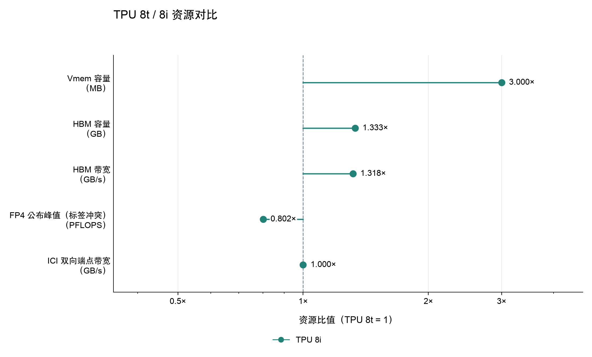
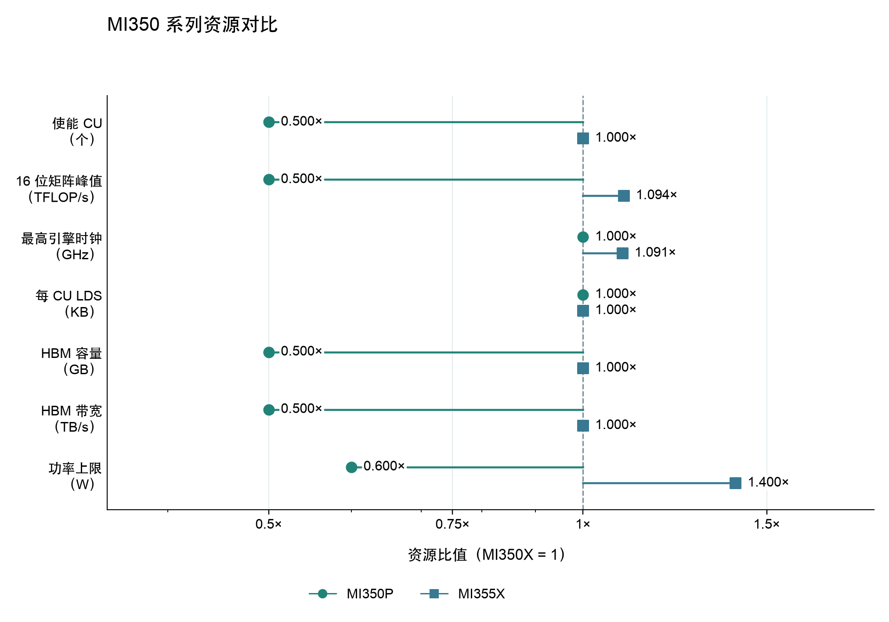
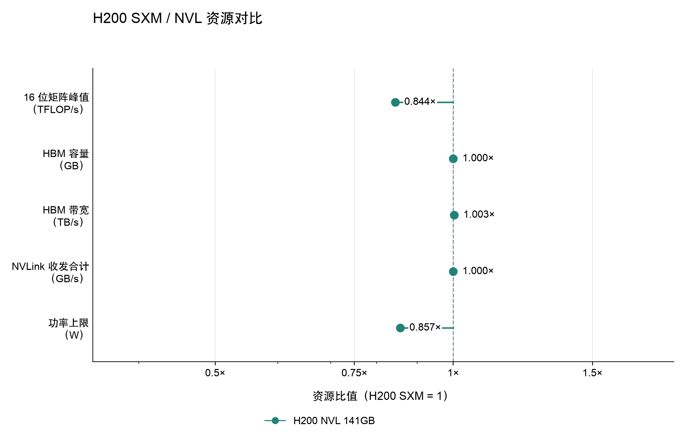

# 家族内产品比较

本篇与[主报告](训练与推理架构比较.md)第 9 节内容相同，单独列出 12 组产品对照及跨组分析，方便集中阅读。章节编号沿用主报告。

以下 12 组对照中，前 9 组比较用途、部署方式或资源档位，后 3 组比较代际变化。关注点是计算核心、片上存储、外部内存、互联和部署条件怎样一起变化。涉及同一底层架构的多组对照，在综合判断时只算同一来源的证据。

### 9.1 TPU 8t / 8i：训练侧重数据供给，推理侧重状态与同步

Google 将 TPU 8t 主要用于大规模 pretraining（预训练）和 embedding（嵌入查表）密集负载，将 8i 主要用于 post-training（后训练）、采样和高并发推理。两者都支持完整的 AI 生命周期。官方对差异的解释是：8t 要持续为矩阵计算供数，8i 要减少逐 token 生成时保存状态、归约和同步造成的等待。[Google 技术详解，参考 1，Specialized by design、The pre-training powerhouse、The sampling and serving specialist](../产品详解/Google-TPU/Google_TPU_8t_one_chip_产品详解.md)

| 整芯片资源或实现 | TPU 8t | TPU 8i |
| --- | ---: | ---: |
| Vmem 容量 | 128 MB | 384 MB |
| HBM3E 容量 | 216 GB | 288 GB |
| HBM 带宽 | 6,528 GB/s | 8,601 GB/s |
| FP4 公布峰值 | 12.6 PFLOPS | 10.1 PFLOPS |
| ICI 双向端点带宽 | 19.2 Tb/s | 19.2 Tb/s |
| 专用机制与系统互联 | SparseCore、LLM Decoder Engine；3D torus | CAE；Boardfly |

表中数值来自同一篇技术详解的 at a glance 表。Vmem 是靠近向量执行单元的工作存储；ICI 是 TPU 的芯片间互联。这里保留原文的 MB、GB 和 Tb/s，1 byte 等于 8 bit。FP4 峰值还有一处来源冲突：8i 的发布规格图标成 FP8，技术详解却使用 FP4，官方尚未解释，因此表中的峰值只用于带此限制的组内分析。[技术详解，参考 1，at a glance](../产品详解/Google-TPU/Google_TPU_8t_one_chip_产品详解.md)；[8i 发布规格图，参考 4，FP8 Eflops per pod](../产品详解/Google-TPU/Google_TPU_8i_one_chip_产品详解.md)

8i 的外存容量和带宽更高，而上表的计算峰值更低。按该表计算，8i 的 B/P 是 8t 的约 1.644 倍。比值增大同时来自带宽增加和算力分母减小，不能全部解释为内存升级。

片上存储也需要看每个核心能使用多少。开发接口中，8t 是单 TensorCore 使用 128 MiB VMEM，8i 是两个 TensorCore 各用 192 MiB；两核合计不等于一个核心能使用全部空间。Google 将 8i 较大的 Vmem 与长上下文 decode 保存更多 KV Cache 联系起来。对 8t，则强调向量单元与矩阵单元重叠执行量化、softmax 和 layer normalization，并通过 SparseCore 处理 embedding 的不规则访问。前者侧重保留状态，后者侧重让矩阵计算少等数据。[参考 21，TPU_8T / TPU_8I 核心配置](../产品详解/Google-TPU/Google_TPU_8i_one_chip_产品详解.md)；[参考 1，Large on-chip SRAM、VPU/MXU overlap、The SparseCore advantage](../产品详解/Google-TPU/Google_TPU_8t_one_chip_产品详解.md)

8i 的 CAE 是集合操作加速引擎，放在独立 chiplet（小裸片）上，用于聚合芯片内两个 TensorCore 的结果。芯片外则采用 Boardfly，减少部分通信路径的跳数；8t 使用 3D torus，面向更大的训练系统。官方给出的 CAE 延迟改善缺少完整测试条件，Boardfly 的节点和局部连接描述也有不一致，因而这里能确认设计方向，尚不能据此给出整个模型的加速幅度。[参考 1，CAE、Boardfly ICI topology、Deep dive: The Boardfly vs. torus math](../产品详解/Google-TPU/Google_TPU_8t_one_chip_产品详解.md)

### 9.2 Ascend 950PR / 950DT：共用计算核心，选择不同内存方案

950PR 面向推荐、大模型 prefill（计算输入上下文的阶段）和多模态推理；950DT 覆盖预训练、后训练，以及 prefill 和 decode（逐步生成输出）。两者共用第三代 DaVinci 基本组织，都有两个计算裸片和两个 I/O 裸片，每个 AI 子系统含一个 Cube 矩阵核和两个 Vector 向量核。[Ascend 950 白皮书，参考 1，PDF pp.10、12-13](../产品详解/华为昇腾/华为_Ascend950PR.md)

| 比较位置 | 950PR | 950DT |
| --- | --- | --- |
| Cube／Vector 使能数 | 32／64 或 28／56 | 36／72、32／64 或 28／56 |
| 共同的 32-Cube 计算档位 | Cube FP16/BF16 为 432 TFLOPS；Vector 为 54 TFLOPS | 同左 |
| 同档低精度 Cube 峰值 | FP8、MXFP8、HiF8 为 865 TFLOPS；MXFP4 为 1730 TFLOPS | 同左 |
| 每 AI 子系统局部存储 | L1 512 KB；L0A/B 各 64 KB；L0C 256 KB；两个 Vector 各有 256 KB Unified Buffer | 同左 |
| 全局 L2 | 128／112 MB | 128 MB |
| 官方明确并列的主推内存组合 | 128 GB、1.6 TB/s | 144 GB、4 TB/s |
| 设备通信接口 | 18 个 ×4 UB 端口，2016 GB/s 双向原始速率 | 同左 |

表中资源来自白皮书表 3-1、图 4-1 和表 4-2。两款产品在共同的 32-Cube 档位下，计算规格相同；DT 另有 36-Cube 档位。不过白皮书没有把每档计算、L2、CPU 与内存绑定到完整料号，因此仍无法把最大算力和最大内存拼成一个确定配置来计算 B/P。这里的 L1、L0 和 Unified Buffer 都是计算单元附近的局部存储，L2 则由多个 bank（存储分组）组成。[参考 1，PDF pp.13-15、17、25](../产品详解/华为昇腾/华为_Ascend950PR.md)

已经明确配对的内存组合可以直接看：DT 的 144 GB 比 PR 的 128 GB 多 12.5%，4 TB/s 则是 1.6 TB/s 的 2.5 倍。这一组中，面向更广泛用途的 DT 配了更高带宽，PR 本身仍是推理产品。prefill 通常有较大的矩阵计算量和数据复用机会，decode 的需求又随模型和并发量变化，所以“推理需要更高带宽”不足以解释两者的选择。这一负载解释是根据资源作出的分析；厂商明确给出的是用途和内存方案。[参考 1，PDF p.10](../产品详解/华为昇腾/华为_Ascend950DT.md)

两者还共用跨裸片 L2 一致性、多维数据搬运和 Cube 与 Vector 的直接通路。STARS2.0 调度器可以按裸片分组安排任务，利用数据的局部性。设备连接采用 UB（Unified Bus，统一总线），与核内的 Unified Buffer 虽然缩写相同，却是不同资源。这些共同机制说明，本组最明确的区别在内存配置和启用的计算资源数量，公开资料没有显示 PR、DT 各有一套不同的基本计算核心。[参考 1，PDF pp.22-23、26-28、30-38](../产品详解/华为昇腾/华为_Ascend950PR.md)

### 9.3 Trainium1 / Inferentia2：计算与本地存储相同，连接配置不同

AWS 将 Trainium1 主要用于训练，将 Inferentia2 主要用于推理，但两者共用 NeuronCore-v2 计算核心。NKI（Neuron Kernel Interface，底层算子编程接口）用同一份微架构说明介绍它们。[参考 5，Trn1 产品用途；参考 2，device overview](../产品详解/AWS/AWS_Trainium1_one_chip_产品详解.md)；[参考 5，Inf2 产品用途](../产品详解/AWS/AWS_Inferentia2_one_chip_产品详解.md)

| 比较维度 | Trainium1 | Inferentia2 | 口径与依据 |
| --- | --- | --- | --- |
| 计算核心与引擎 | 2 个 NCv2；每核 Tensor、Vector、Scalar、GpSimd | 相同 | 四类引擎分别负责矩阵、向量归约、逐元素／非线性和可编程算子。[NKI，Compute Engines](../产品详解/AWS/AWS_Trainium1_one_chip_产品详解.md#ref-2) |
| 纯 Tensor 峰值 | FP16/BF16/TF32/cFP8：184 TFLOPS；FP32：46 TFLOPS | 相同 | 每核 92／23 乘两核的资源加总，采用原报取整数；芯片宣传值另列 190／47.5。[NKI，Tensor Engine: Data Types](../产品详解/AWS/AWS_Trainium1_one_chip_产品详解.md#ref-2) [芯片表，Compute](../产品详解/AWS/AWS_Trainium1_one_chip_产品详解.md#ref-1) |
| 本地 HBM | 2 stack，32 GiB；820 GiB/s | 相同 | 采用各自芯片技术页的容量与带宽分支。[Trainium，Device Memory](../产品详解/AWS/AWS_Trainium1_one_chip_产品详解.md#ref-1) [Inferentia2，Device Memory](../产品详解/AWS/AWS_Inferentia2_one_chip_产品详解.md#ref-1) |
| 每核工作与累加存储 | 24 MiB SBUF + 2 MiB PSUM | 相同 | SBUF 为软件管理暂存区，PSUM 保存矩阵部分和；两核各有局部空间。[NKI，Compute Engines、memory hierarchy](../产品详解/AWS/AWS_Trainium1_one_chip_产品详解.md#ref-2) |
| 数据搬运与通信单元 | 32 个 DMA；6 个 CC-Core | 相同 | DMA 为直接内存搬运引擎；CC-Core 负责集合通信，未披露单核通信吞吐。[NKI，device overview](../产品详解/AWS/AWS_Trainium1_one_chip_产品详解.md#ref-2) |
| NeuronLink-v2 接口 | 4 组 | 2 组 | 比较接口数量；不足以推导实际通信性能比。[NKI，device overview](../产品详解/AWS/AWS_Trainium1_one_chip_产品详解.md#ref-2) |

SBUF 是程序使用的片上工作区，PSUM 保存矩阵计算的累加结果；DMA 负责数据搬运，CC-Core 处理集合通信。表中的数值来自 NKI 和芯片文档。其中 184 TFLOPS 是两个核心各 92 TFLOPS 的矩阵峰值之和；官方另给 190 TFLOPS 整芯片值，但没有解释差额，本报告沿用前者。[参考 2，device overview、NeuronCore-v2 Compute Engines；参考 1，Compute、Device Memory](../产品详解/AWS/AWS_Trainium1_one_chip_产品详解.md)

按 184 TFLOPS、32 GiB 和 820 GiB/s 计算，两者的 B/P 都约为 0.004785 byte/FLOP，C/P 都约为 0.1867 GB/(TFLOP/s)。NKI 的另一个页面写成 820 GB/s，采用该值会同时改变两款产品的结果，仍不会产生组内差异。cFP8 矩阵峰值也与 FP16/BF16 相同。这一组直接说明，主要用途不同，不一定需要不同的存算比或低精度吞吐。

两者的 NeuronLink 接口数量不同：Trainium1 为四组，Inferentia2 为两组。Trn1/Trn1n 的十六芯片实例采用二维 torus，并支持直接寻址池化的设备内存；Inf2 主要强调通过集合通信把模型分到多颗芯片。由于带宽资料的单位和收发方向没有完全对齐，接口数 4∶2 不能直接解释为训练通信快两倍。能够确认的是，AWS 在共同计算核心之外，通过连接和系统配置区分这两款产品。[参考 4，Trn1/Trn1n Architecture；参考 8，Interconnect comparison table](../产品详解/AWS/AWS_Trainium1_one_chip_产品详解.md)；[参考 4，Inf2 Architecture、Tensor Parallelism](../产品详解/AWS/AWS_Inferentia2_one_chip_产品详解.md)

### 9.4 TPU v5e / v5p：大规模训练需要更多外存与通信资源

v5e 同时支持训练和推理，侧重成本效率；v5p 更强调大型模型训练、性能和扩展规模。v5e 在云端还区分 training 和 serving 配置，分别侧重吞吐与时延。这里比较的是产品设计和部署侧重点。[参考 1，Configurations；参考 20，What Is a TPU?](../产品详解/Google-TPU/Google_Cloud_TPU_v5e_one_chip_产品详解.md)；[参考 4，Inside Cloud TPU v5p](../产品详解/Google-TPU/Google_Cloud_TPU_v5p_one_chip_产品详解.md)

| 层级与资源 | TPU v5e | TPU v5p |
| --- | --- | --- |
| 单核矩阵结构 | 4 个 128×128 MXU | 4 个 128×128 MXU |
| 整芯片核心与 BF16 峰值 | 1 TensorCore，197 TFLOPS | 2 TensorCore，459 TFLOPS |
| 每核 / 整芯片 VMEM | 128 / 128 MiB | 64 / 128 MiB |
| Cloud 主存容量 / 带宽 | 16 GB / 800 GiB/s | 95 GiB / 2,765 GB/s |
| ICI 双向端点 / 系统拓扑 | 400 GB/s，4 端口，2D torus | 1,200 GB/s，6 link，3D torus |
| SparseCore | 未找到公开配置 | 4 个，每个 16 tile |
| 最大单 slice 训练配置 | 256 chips | 6,144 chips |

矩阵结构和 VMEM 来自 JAX 型号配置，外存、ICI 和 slice 数量来自 Cloud TPU 文档。MXU 是矩阵乘法单元，TensorCore 是 TPU 的计算核心；SparseCore 是处理稀疏访问和部分通信的专用核心。[参考 21，TPU_V5E / TPU_V5P；参考 1，System architecture、Configurations](../产品详解/Google-TPU/Google_Cloud_TPU_v5p_one_chip_产品详解.md)

v5p 的外存增长快于算力增长：B/P 约为 v5e 的 1.38 倍，C/P 约为 2.74 倍。因此，更偏大规模训练的型号同样可能有更高的单位算力内存供给。局部工作区却不同：v5e 单核有 128 MiB，v5p 每核 64 MiB、两核合计 128 MiB。v5p 的 Megacore 模式虽把两核呈现为一个逻辑设备，仍需要按每核工作区安排数据，不能当成一块任意共享的 128 MiB 存储。[参考 21，supports_megacore；参考 22，Multicore TPU configurations](../产品详解/Google-TPU/Google_Cloud_TPU_v5p_one_chip_产品详解.md)

v5p 的更大 slice、三维回环连接和故障绕行能力，有助于组织大规模任务的通信。部分 slice 可使用 twisted torus：官方示例中，4×4×8 配置的理论二分带宽约提高 70%，单芯片端点带宽仍为 1,200 GB/s。二分带宽描述网络分成两半后，两半之间的通信能力；这个例子说明改变拓扑也能增加系统通信能力，不必增加每颗芯片的接口带宽。实际收益仍取决于任务如何切分。[参考 1，Twisted torus topologies、Cloud TPU ICI resiliency](../产品详解/Google-TPU/Google_Cloud_TPU_v5p_one_chip_产品详解.md)

### 9.5 H100 SXM / PCIe / NVL：同一架构的计算、内存与形态取舍

H100 的三种产品都使用 Hopper 架构。NVIDIA 将 SXM5 用于多 GPU 扩展，将标准 PCIe 80GB 放在功率预算较低的机架中，特别提到只用一两颗 GPU 的推理和部分 HPC（高性能计算）任务；NVL 则明确侧重 LLM（大语言模型）推理。NVL 本身也是 PCIe 插卡，下面“PCIe”专指 80GB 标准款。[Hopper 白皮书，参考 1，p.15](../产品详解/NVIDIA/NVIDIA_H100_SXM5_80GB.md)；[产品简报，参考 1，p.1](../产品详解/NVIDIA/NVIDIA_H100_NVL_94GB.md)

| 单 GPU／单模组或卡的比较项 | H100 SXM5 80GB | H100 PCIe 80GB | H100 NVL 94GB |
| --- | ---: | ---: | ---: |
| 实际使能 SM（流式多处理器） | 132 | 114 | 未公开 |
| FP16/BF16 矩阵 dense 峰值 | 989.4 TFLOP/s | 756 TFLOP/s | 835.5 TFLOP/s，推导 |
| L2 容量 | 50 MB | 50 MB | 未公开 |
| HBM 类型、容量 | HBM3，80 GB | HBM2e，80 GB | HBM3，94 GB |
| HBM 标称带宽 | 3.35 TB/s | 2.000 TB/s | 3.938 TB/s |
| NVLink 端点收发合计 | 900 GB/s | 600 GB/s，有来源冲突 | 600 GB/s |
| 功率规格 | 模组最高 TDP 700 W | 最大板卡功率 350 W | 最大板卡功率 400 W |

计算、缓存和频率来自 Hopper 白皮书 pp.18、27、39-40，内存和功率采用各型号简报。NVL 的稠密矩阵峰值按官方稀疏倍率折算。PCIe 的 NVLink 值在此保留专门桥接表中的 600 GB/s；其首页另写 900 GB/s，这一冲突使它未进入前面的统一端点图。[参考 1，pp.18、27、39-40；参考 2，p.2](../产品详解/NVIDIA/NVIDIA_H100_SXM5_80GB.md)；[参考 2，pp.4、8-12](../产品详解/NVIDIA/NVIDIA_H100_PCIe_80GB.md)；[参考 1，pp.3-5、9-10；参考 2，p.2](../产品详解/NVIDIA/NVIDIA_H100_NVL_94GB.md)

SXM 的 SM（流式多处理器）比 PCIe 多约 15.8%，用于峰值计算的频率也高约 13.0%；两项合起来基本解释了约 30.9% 的 16 位算力差距。两者每个 SM 的局部资源相同，L2 和 HBM 容量也相同，所以减少计算单元和频率后，每单位算力对应的容量反而增大。但 PCIe 的 B/P 只有 SXM 的约 0.781 倍，容量配比和带宽配比没有同方向变化。

NVL 则把内存容量和带宽都提高到 SXM 的约 1.175 倍，而所选计算峰值约为 0.844 倍，使 C/P 和 B/P 都提高约 39%。这与其 LLM 推理目标一致，可能为模型常驻和数据供给提供更多余量；具体 decode 速度仍受 batch（批量）、KV Cache 和量化格式影响。FP8、Transformer Engine 和局部数据搬运机制由 Hopper 家族共用，不能当作 NVL 独有的推理设计。[参考 1，pp.1、3-5](../产品详解/NVIDIA/NVIDIA_H100_NVL_94GB.md)；[参考 1，pp.22-24、29-35](../产品详解/NVIDIA/NVIDIA_H100_SXM5_80GB.md)

系统连接还会进一步拉开差别：SXM 可以进入四 GPU 或八 GPU 的 HGX 底板，PCIe 和 NVL 则通过桥接连接相邻两卡。双卡 NVL 的 188 GB 是两张卡的容量之和，程序仍需安排跨卡的数据和计算。选择产品时，这些部署限制与单卡算力同样需要考虑。[参考 1，pp.15-16、47-48](../产品详解/NVIDIA/NVIDIA_H100_SXM5_80GB.md)；[参考 1，pp.9-15](../产品详解/NVIDIA/NVIDIA_H100_NVL_94GB.md)

### 9.6 MI350P / MI350X / MI355X：核心相同，资源数量与功率不同

MI350P 面向现有企业数据中心的推理部署，使用 PCIe 插卡；MI350X、MI355X 面向训练、推理和 HPC，使用 OAM 模组。三者共用 CDNA 4 计算架构，主要调整裸片和计算单元数量、频率、内存以及散热要求。[参考 1，产品定位与规格](../产品详解/AMD/MI350P.md)；[参考 1，产品用途；参考 3，CDNA 4 白皮书](../产品详解/AMD/MI350X.md)

| 单设备资源或配置 | MI350P | MI350X | MI355X |
| --- | ---: | ---: | ---: |
| 形态 | 双槽 PCIe 卡 | OAM 模组 | OAM 模组 |
| XCD（计算裸片）／IOD（I/O 裸片） | 4／1 | 8／2 | 8／2 |
| 使能 CU（计算单元）／Matrix Core | 128／512 | 256／1,024 | 256／1,024 |
| 最高引擎时钟 | 2.2GHz | 2.2GHz | 2.4GHz |
| FP16/BF16 dense Matrix 峰值 | 1,150 TFLOPS | 2,300 TFLOPS | 2,516.6 TFLOPS |
| HBM3E 容量／带宽 | 144GB／4TB/s | 288GB／8TB/s | 288GB／8TB/s |
| 每 CU LDS（显式管理的局部暂存区） | 160KB | 160KB | 160KB |
| 每 XCD L2／全设备 L2 容量之和 | 4MB／16MB | 4MB／32MB | 4MB／32MB |
| Infinity Cache | 128MB | 256MB | 256MB |
| 专用 GPU scale-up 端点 | 未确认 | 7×153.6GB/s | 7×153.6GB/s |
| 额定功率规格 | 最大 600W，可配 450W | 最大 1000W | 1400W |

XCD 是计算裸片，IOD 是 I/O 裸片，CU 是计算单元；LDS 是程序显式管理的局部工作区。表中计算和内存数值来自型号资料，局部存储和裸片组织来自 CDNA 4 架构说明。MI350P 每 XCD 的 L2 与每 CU 的 LDS 依据其共用的架构规则，未把多个 XCD 的 L2 视为一块统一共享存储。[MI350P，参考 1，Specifications；参考 2，pp.1-2；参考 4，p.9](../产品详解/AMD/MI350P.md)；[MI350X，参考 1，Specifications；参考 3，pp.3-5、9、13-16](../产品详解/AMD/MI350X.md)；[MI355X，参考 1，Specifications；参考 3，pp.3-5、9、13-16](../产品详解/AMD/MI355X.md)

MI350P 的矩阵峰值、内存容量和带宽，都是 MI350X 的一半，B/P 和 C/P 因而基本相同。每个 CU 的工作区也没有缩小。它的推理定位主要体现在产品规模、PCIe 形态和部署预算上，不能由“推理产品”推导出更高的存算比。

MI355X 则保留与 MI350X 相同的计算单元数量和内存配置，提高最高频率及功率上限，并采用液冷。计算峰值提高后，B/P 反而降低。这一差别可以由运行频率和供电散热解释，无需假设它换了一套更偏训练的计算核心。低精度支持和数据搬运机制仍是三者共享的架构能力。[MI355X，参考 1，Specifications；参考 3，pp.13、15-16](../产品详解/AMD/MI355X.md)；[CDNA 4 白皮书，参考 3，pp.7-9](../产品详解/AMD/MI350X.md)

### 9.7 H200 SXM / NVL：内存接近，计算峰值和连接方式不同

H200 SXM 与 NVL 的 HBM 容量相同，带宽也很接近。NVIDIA 将 SXM 用于 HGX、MGX 等平台，NVL 则用于以 PCIe 连接的企业服务器，特别强调推理和 HPC。[参考 1，pp.1-4](../产品详解/NVIDIA/NVIDIA_H200_SXM5_141GB.md)；[参考 1，pp.1-3](../产品详解/NVIDIA/NVIDIA_H200_NVL_141GB.md)

| 单 GPU 比较项 | H200 SXM5 141GB | H200 NVL 141GB |
| --- | ---: | ---: |
| FP16/BF16 Tensor dense 峰值 | 989.5 TFLOP/s | 835.5 TFLOP/s |
| HBM3e（高带宽堆叠内存）容量 | 141 GB | 141 GB |
| HBM 标称带宽 | 4.8 TB/s | 4.813 TB/s |
| 单 GPU NVLink 端点收发合计 | 900 GB/s | 900 GB/s |
| 已披露的使能 SM／L2 | 132／50 MB | 未公开 |
| 最大功率规格 | 模组 TDP（热设计功耗）700 W，可配置 | 板卡 600 W，可配置 |
| 产品形态 | SXM5 模组，系统决定散热方案 | 全高全长、双槽、被动风冷 PCIe 卡 |

计算值依据数据手册中稀疏峰值及其两倍关系折算，NVL 带宽采用该型号简报；共同的 900 GB/s 是单 GPU 收发合计。[参考 1，p.4；参考 2，p.4](../产品详解/NVIDIA/NVIDIA_H200_SXM5_141GB.md)；[参考 1，pp.3-4](../产品详解/NVIDIA/NVIDIA_H200_NVL_141GB.md)

NVL 的计算峰值约为 SXM 的 84.4%，所以即使内存几乎相同，其 B/P 和 C/P 仍更高。这个例子中的比值变化主要来自算力分母，不能理解成 NVL 又增加了一次内存。这也是 Hopper 家族内部的产品配置变化，与 H100 对照相关，不能再算一份独立架构证据。

连接方式有所不同：SXM 使用 HGX 的多 GPU 底板，NVL 可以组成两卡或四卡桥接域。两者还支持 MIG（多实例 GPU），把一颗 GPU 的计算和内存资源分给多个任务。但各资源不是总按相同比例分配：H200 的 1g.18gb 和 1g.35gb 都分到 1/7 的 SM、1/8 的 L2，HBM 份额却不同。因此，研究某个服务实例时，需要看实际分区配置，不能直接套用整卡存算比。[参考 1，pp.9-13；参考 5，H200 Profiles，Table 11](../产品详解/NVIDIA/NVIDIA_H200_NVL_141GB.md)

### 9.8 L4 / L40S：矩阵计算和视频资源分别配置

L4 与 L40S 都使用 Ada 架构，并覆盖 AI、图形和视频用途。L4 更强调低功耗、低矮卡形态和视频推理；L40S 则以更大的板卡和功率预算支持生成式 AI、渲染和虚拟工作站。[参考 1，p.1；参考 2，pp.39-40；参考 4，NVIDIA L4 for AI Video](../产品详解/NVIDIA/NVIDIA_L4_24GB.md)；[参考 1，p.1](../产品详解/NVIDIA/NVIDIA_L40S_48GB.md)

| 资源或机制 | L4 24GB | L40S 48GB |
| --- | ---: | ---: |
| 实际 SM／Tensor Core | 58／232 | 142／568 |
| Boost 频率 | 2,040 MHz | 2,520 MHz |
| Dense FP8 矩阵峰值 | 242 TFLOPS | 733 TFLOPS |
| GDDR6 容量／带宽／接口 | 24 GB／300 GB/s／192 bit | 48 GB／864 GB/s／384 bit |
| 每 SM 局部工作区 | 128 KB L1/shared，共享区上限 100 KB | 相同 |
| NVENC／NVDEC | 2／4 | 3／3 |
| 最大板级功耗与形态 | 72 W、单槽低矮半长 | 350 W、全高全长双槽 |

L40S 的 SM 数按公开 CUDA Core 数及每 SM 的配置推导；矩阵峰值采用明确的 FP8 稠密值。两卡的计算、内存、编解码器和功率来自产品简报与 Ada 白皮书，局部工作区来自 Ada Tuning Guide。[参考 1，pp.2-3；参考 2，p.40；参考 22，§§1.4.1.1、1.4.2.2](../产品详解/NVIDIA/NVIDIA_L4_24GB.md)；[参考 1，pp.2-3；参考 2，Specifications](../产品详解/NVIDIA/NVIDIA_L40S_48GB.md)

L40S 的 FP8 峰值约为 L4 的 3.03 倍，内存带宽为 2.88 倍，容量为 2 倍。因此两者 FP8 的 B/P 接近，L40S 的 C/P 则更低。L40S 的 16 位原始规格表存在稠密与稀疏数值不一致的问题，所以这里用 FP8 比较，没有反推一个确定的 16 位峰值。

视频资源并没有与矩阵算力一起按比例增长。NVENC 是视频编码引擎，NVDEC 是视频解码引擎；L40S 的编码器比 L4 多一个，解码器反而少一个。对于“视频输入、AI 处理、编码输出”的应用，需要分别检查三个阶段。L4 的较多解码器与其视频推理定位相符，但仅凭引擎数量，还不能判断某种编码格式或视频分辨率下的实际处理能力。[Ada 白皮书，参考 2，pp.24-25、39-40](../产品详解/NVIDIA/NVIDIA_L4_24GB.md)；[参考 2，NVENC / NVDEC](../产品详解/NVIDIA/NVIDIA_L40S_48GB.md)

### 9.9 Atlas 300I A2 32GB / 64GB：同为推理卡，内存配置也可以不同

两种容量的 Atlas 300I A2 都是 PCIe 推理卡，官方明确不支持训练任务。它们采用相同数量的 AI Core，主要差异是 HBM 容量和带宽。[用户指南，参考 5，概述、表 3-1](../产品详解/华为昇腾/华为_Atlas300I_A2_32GB.md)

| 比较项 | 32GB 配置 | 64GB 配置 |
| --- | --- | --- |
| 计算峰值 | FP16 280TFLOPS；INT8 560TOPS；FP32 75TFLOPS | 相同 |
| HBM 容量 / 带宽 | 32GB / 800GB/s | 64GB / 1600GB/s |
| B/P | 0.002857 byte/FLOP | 0.005714 byte/FLOP |
| C/P | 0.1143 GB/(TFLOP/s) | 0.2286 GB/(TFLOP/s) |
| 标准半卡 / 四分之一卡模板 | 10 AI Core 配 16GB；5 AI Core 配 8GB | 10 AI Core 配 32GB；5 AI Core 配 16GB |
| 最大功耗配置 | 300W / 350W | 300W / 350W |

计算与内存规格来自官方彩页和用户指南。FP16 的矩阵、向量及稀疏条件尚未完全说明，因此这里比较两种卡的相对变化，仍保留整卡峰值的限制。半卡、四分之一卡配置来自官方硬切分实践，指把物理卡分配成多个 vNPU（虚拟 NPU）实例。[参考 2，p.1；参考 4，§2.1、附录表 1；参考 5，表 3-1](../产品详解/华为昇腾/华为_Atlas300I_A2_32GB.md)；[参考 4，§2.2、附录表 2](../产品详解/华为昇腾/华为_Atlas300I_A2_64GB.md)

64GB 款容量和带宽都翻倍，计算峰值保持相同，B/P 和 C/P 因而同时翻倍。更大的容量可能容纳更多权重和 KV Cache，带宽增加也可能缓解搬运瓶颈；实际模型是否受益，还要看工作集和访问量，官方没有提供可据此归因的同条件测试。

切分后的资源也需要按模板查看。两款卡的标准半卡、四分之一卡模板分得相同计算单元数量，但内存份额不同；四分之一模板还没有视频解码资源。功率则由配置和供电条件决定，两种容量都支持表中的 300W/350W 档位，不能把低功率固定归给 32GB、高功率固定归给 64GB。[参考 4，硬切分模板；参考 5，电源管理](../产品详解/华为昇腾/华为_Atlas300I_A2_32GB.md)

### 9.10 H100 → H200：计算架构延续，重点升级内存

H200 延续 Hopper 计算架构，主要扩大并加快 HBM，用于 LLM 推理和内存密集的 HPC 任务。SXM 和 NVL 原来的配置不同，下面分两条产品线看变化。[H200 数据手册，参考 1，pp.1-4](../产品详解/NVIDIA/NVIDIA_H200_SXM5_141GB.md)

| 单 GPU 比较项 | H100 SXM5 | H200 SXM5 | H100 NVL | H200 NVL |
| --- | ---: | ---: | ---: | ---: |
| FP16/BF16 矩阵 dense，TFLOP/s | 989.4 | 989.5，推导 | 835.5，推导 | 835.5，推导 |
| HBM 代际及容量，GB | HBM3，80 | HBM3e，141 | HBM3，94 | HBM3e，141 |
| HBM 带宽，TB/s | 3.35 | 4.8 | 3.938 | 4.813 |
| NVLink 端点收发合计，GB/s | 900 | 900 | 600 | 900 |
| 最大功率规格，W | 700，模组 | 700，模组 | 400，板卡 | 600，板卡 |

规格来自各型号白皮书、数据手册和简报。带“推导”的计算值由官方稀疏峰值折半；H100 SXM 与 H200 SXM 的 0.1 TFLOP/s 差别来自规格舍入，不代表计算架构升级。[参考 1，pp.18、39-40](../产品详解/NVIDIA/NVIDIA_H100_SXM5_80GB.md)；[参考 1，p.4](../产品详解/NVIDIA/NVIDIA_H200_SXM5_141GB.md)；[参考 1，pp.3-4](../产品详解/NVIDIA/NVIDIA_H100_NVL_94GB.md)；[参考 1，pp.3-4](../产品详解/NVIDIA/NVIDIA_H200_NVL_141GB.md)

SXM 分支的容量增加 76.25%，带宽增加约 43.28%，计算峰值基本相同；两者都是 132 个 SM、50 MB L2，互联端点和模组功率上限也相同。因此，存算比提高主要来自外存升级。NVL 分支的容量增加 50%、带宽增加约 22.22%，同时提高了 NVLink 带宽、桥接规模和最大板卡功率，多卡性能还会受到这些变化影响。[参考 2，p.4](../产品详解/NVIDIA/NVIDIA_H200_SXM5_141GB.md)；[参考 1，pp.3-4、9-10](../产品详解/NVIDIA/NVIDIA_H100_NVL_94GB.md)；[参考 1，pp.3-4、9-10](../产品详解/NVIDIA/NVIDIA_H200_NVL_141GB.md)

更多内存可能允许更大的 batch，或减少模型切分；更高带宽则减少相同数据量的理想搬运时间。NVIDIA 的 Llama2 70B 示例使用相同的输入输出长度，但 H100 SXM 的 batch 为 8，H200 为 32。因此，示例中的约两倍吞吐包含产品和运行配置共同变化的效果，不能全部归于 43.3% 的带宽提升，也不能当成单请求延迟的改善。[参考 1，pp.1-2，LLM 吞吐图及测试条件](../产品详解/NVIDIA/NVIDIA_H200_SXM5_141GB.md)

### 9.11 MI300X → MI325X：计算资源不变，扩大 HBM

MI300X 和 MI325X 都面向训练、推理及 HPC，两者共用 CDNA 3 架构，计算核心数量和最高频率相同。MI325X 增加内存容量和带宽，适合用来观察外存升级怎样改变存算比。[参考 6，正式发布稿；参考 2，Table 2，pp.23-25](../产品详解/AMD/MI325X.md)

| 单模组资源 | MI300X | MI325X | 变化 |
| --- | ---: | ---: | --- |
| 使能 CU / Matrix Core | 304 / 1,216 | 304 / 1,216 | 相同 |
| FP16 / BF16 Matrix dense | 1,307.4TFLOPS | 1,307.4TFLOPS | 相同 |
| FP8 Matrix dense | 2,614.9TFLOPS | 2,614.9TFLOPS | 相同 |
| HBM 容量及介质 | 192GB HBM3 | 256GB HBM3E | 容量增加 33.3% |
| HBM 峰值带宽 | 5.3TB/s | 6.0TB/s | 增加约 13.2% |
| 每 XCD 的 L2 / 全 GPU Infinity Cache | 4MB / 256MB | 4MB / 256MB | 相同作用域下均不变 |
| GPU 互联端点带宽 | 896GB/s | 896GB/s | 均为 7×128GB/s 双向合计 |
| Maximum TBP（模组功率上限） | 750W | 1000W | 增加 33.3% |

计算、HBM、互联和功率采用两份型号数据手册，缓存采用 CDNA 3 白皮书。MI325X 使用正式的 256GB 配置，早期预告的 288GB 不放入这组比较。[参考 8，pp.1-2；参考 2，pp.9-11](../产品详解/AMD/MI300X.md)；[参考 3，pp.1-2；参考 6，正式发布稿](../产品详解/AMD/MI325X.md)

计算不变时，容量增加 33.3%，带宽增加约 13.2%，C/P 和 B/P 也按相同比例提高。每个 CU 的 LDS、每个 XCD 的 L2 和全 GPU 的 Infinity Cache 没有扩容，所以外存升级没有改变单个计算单元可用的片上工作区。多份 L2 合计容量也仍需按裸片分别使用。[参考 2，pp.9-11](../产品详解/AMD/MI300X.md)；[参考 2，Table 2](../产品详解/AMD/MI325X.md)

更大的 HBM 可以为模型权重、KV Cache 或训练中间状态提供空间，实际效果取决于负载。MI325X 的模组功率上限也从 750W 增至 1000W，平台供电和散热需要相应支持。峰值算力相同并不意味着实际能耗相同，额定功率提高也不足以说明实际任务能效变差。[参考 3，p.1，兼容说明与功率表](../产品详解/AMD/MI325X.md)

### 9.12 Trainium2 → Trainium3：主要增加低精度吞吐与数据搬运能力

Trainium2、Trainium3 的正式发布说明都包含训练和推理。Trainium2 早期预告更强调训练，但后续官方已经明确了两类用途；这里按训推兼顾看待这组代际变化。[参考 12，David Brown statement](../产品详解/AWS/AWS_Trainium2_one_chip_产品详解.md)；[参考 6，training and serving](../产品详解/AWS/AWS_Trainium3_one_chip_产品详解.md)

| 单芯片或单核资源 | Trainium2 | Trainium3 |
| --- | ---: | ---: |
| 物理计算核 | 8×NCv3 | 8×NCv4 |
| 单芯片 BF16/FP16 Tensor 名义合计 | 632 TFLOPS | 632 TFLOPS |
| 单芯片低精度 Tensor 名义合计 | FP8 E4/E5 1,264 TFLOPS | MXFP8／MXFP4输入 2,520 TFLOPS |
| SBUF／PSUM，单核 | 28／2 MiB | 32／2 MiB |
| Vector FP32，单核 | 1.0 TFLOPS | 1.2 TFLOPS |
| HBM容量／带宽 | 96 GiB／2.9 TB/s | 144 GiB／4.9 TB/s |
| 主DMA数量／芯片搬运带宽 | 128／3.5 TB/s | 128／4.9 TB/s |
| NeuronLink数量／芯片页聚合带宽 | 4／1.28 TB/s | 4／2.56 TB/s |

NCv3、NCv4 是两代 NeuronCore，SBUF 是工作区，PSUM 是矩阵累加存储。矩阵值由每核峰值乘以八个核心得到；数据搬运和互联采用芯片文档的统计值，NeuronLink 数值未说明完整收发方向，不与前文的双向端点带宽混用。[参考 1，Compute、Device Memory；参考 2，NeuronCore-v3](../产品详解/AWS/AWS_Trainium2_one_chip_产品详解.md)；[参考 1，芯片规格；参考 2，NeuronCore-v4](../产品详解/AWS/AWS_Trainium3_one_chip_产品详解.md)

两代的物理矩阵阵列都为每核 128×128 个处理单元，16 位矩阵峰值合计相同。较大的增量发生在低精度计算：NCv3 的 double FP8 每个处理单元同时处理两对输入，NCv4 的 MX 模式处理四对，并让每 32 个元素共享缩放信息。以 16 位峰值作分母，B/P 增加约 69%；分别用两代的 FP8/MXFP8 峰值作分母，B/P 却下降约 15%。变化方向不同，来自所选计算路径不同，不能直接理解为某一代“存储更不足”。[参考 2，Double FP8 Matmul Performance](../产品详解/AWS/AWS_Trainium2_one_chip_产品详解.md)；[参考 2，Quad-MXFP8/MXFP4 Matmul Performance](../产品详解/AWS/AWS_Trainium3_one_chip_产品详解.md)

NCv4 还允许 PSUM 保存 BF16 结果，并改进后台转置和向量指数计算。AWS 将快速指数计算与长上下文 attention 的 softmax 联系起来，也增加了服务训练复现的随机数状态保存。硬件新增的间接寻址、搬运中累加和流量整形，则用于不规则访问及计算、通信争用；所用文档版本注明其中三项当时尚无 NKI 接口，不能默认软件已经能调用。系统也从 Trn2 的 torus 和跨实例 ring，转向 Trn3 的 NeuronSwitch 交换网络。算力、局部调度和系统通信都在变化，模型性能需要结合整套配置判断。[参考 2，BF16 Matmul Results in PSUM、Fast Exponential Evaluation、Data Movement and DMA updates；参考 4，Connectivity and Networking](../产品详解/AWS/AWS_Trainium3_one_chip_产品详解.md)

### 9.13 跨组看，差异主要发生在哪里

这 12 组对照最常见的情况，是共用基本计算核心，再调整内存、启用的计算资源和系统连接。NVIDIA 的 H100、H200 在同一 Hopper 家族内改变 SM 数、频率、HBM 和形态；AMD 的 MI350 系列调整裸片数量、频率和部署功率；AWS 的 Trainium1/Inferentia2 共用核心和本地存储，主要改变连接；Ascend 950PR/DT 共用 DaVinci 基本组织，选择不同内存方案。这些分别来自四家厂商，但同一 Hopper 家族中的几组比较没有重复计数。对应数值与官方出处见第 9.2、9.3、9.5、9.6、9.7 节。

TPU 8 是本次样本中同代专用设计更明确的一组。8t、8i 除了容量和峰值不同，还分别强调不规则数据供给、片内集合操作及不同的芯片间拓扑。Google 明确把这些设计与训练或逐 token 推理的需求联系起来。这不能反过来说明其他厂商没有专用设计：当前拿到的同代对照和披露深度并不相同，跨代的 Trainium2/3 也能看到计算与搬运路径更新。相关设计说明见第 9.1、9.12 节。

主存比值没有形成通用的训练／推理分界。H100 NVL、H200 NVL 的 B/P 高于同代 SXM，但 TPU v5p 相对 v5e 呈相反方向，Trainium1/Inferentia2 和 MI350P/MI350X 又基本相同。Atlas 两款都只做推理，存算比仍可相差一倍。造成差异的原因有内存增配，也有算力降低、产品规模和代际变化。H100→H200、MI300X→MI325X 提供了计算架构延续而内存升级的例子，说明高存算比本身不能证明专门为推理设计。

片上 SRAM 也要按使用范围看。TPU v5e/v5p 的整芯片 VMEM 合计相同，每核容量却不同；MI350P/MI350X 的全设备缓存合计随裸片数量增长，每个 CU 的局部工作区保持相同。较大的局部工作区可能少搬一些中间数据，较大的共享缓存可能提高数据复用，但这两种作用都依赖工作集、布局和软件安排。这是基于资源的分析，现有规格没有给出跨产品统一的性能收益。

互联差异同样不只在每秒多少 GB。H100 的桥接与 NVSwitch、AWS 的接口数量与交换结构、TPU 的 torus 与 Boardfly，分别改变连接规模或通信路径。训练中的梯度同步、MoE（混合专家模型）的跨设备数据交换，以及多卡 decode 的逐步同步，会给网络带来不同要求。TPU 8 的相同端点带宽、不同拓扑尤其说明：接口总带宽相同，系统通信行为仍可能不同。具体是否受益，要看任务并行方式和消息大小。

训练、prefill 和 decode 也不应只靠产品标签合并解释。prefill 往往包含较大的矩阵计算，有机会复用输入数据；逐 token 的 decode 更可能受到权重、KV Cache 搬运和同步等待影响，但 batch、上下文长度和模型结构会改变瓶颈。厂商对 TPU 8、Ascend 950 的说明可以确认设计目标；本报告由容量、带宽和拓扑推测负载影响的部分，仍需实际任务验证。选型时，应先明确负载和部署条件，再看这些资源变化是否解决了对应问题。

