# 训练与推理芯片：全产品分布与家族内比较

两层比较 · 7 家厂商、36 个产品、12 个产品组 · 2026 年 9 月 23 日

这份报告比较现有清单中产品的数值格式、计算规模、存储供给、设备互联与部署条件。产品按照具体 SKU（硬件配置明确的型号）或官方单芯片配置计数；服务器、机架和集群只用于解释接口与部署边界。范围限于现有 36 个对象，尚不能代表整个市场。

全部产品进入格式矩阵、产品总表和逐项证据；每张定量图使用条件足够明确的子集。当前有 33 个产品可列外部主存容量、33 个可列带宽，27 个能将 16 位峰值与主存配置配对。其中 19 个采用明确的矩阵 dense 值或有依据的换算，另 8 个仍有计算路径或稠密条件未完全对齐。dense 指未利用结构化稀疏跳过运算。

现有数据尚不支持用单一存算比区分训练与推理产品。数值格式和主存类型在不同定位的产品之间广泛交叉；相近计算规模的产品，其容量、带宽与互联供给也不总是同比增加。第一层呈现资源分布，第二层结合 12 个产品组的官方资料说明哪些差异来自共同核心下的配置调整，哪些涉及机制改变。规格差异仍需结合负载和实测，才能解释实际性能或能效差异。

## 1. 产品范围与读图方法

颜色表示官方主要设计目标：偏训练、偏推理或训推兼顾。官方支持用途在另一列保留，支持另一用途不自动改变主要取向。这是依据官方产品目标的研究分类，不表示用途排他性或厂商投入比例。TPU v5e、Trillium、Ironwood、Trainium2/3、H100 PCIe、H200 NVL 的表述存在交叉，正文另检查采用其他有来源分类时的结果；分类依据保存在文末，不根据带宽、功耗或名称推断。

算力和配比图中的实心点采用明确矩阵 dense 口径，空心点表示整芯片值或条件未展开的厂商值。实心点也没有统一所有累加格式和时钟，它们适合比较公开资源配置，不构成相同精度质量下的性能测试。依据稀疏倍率或核数换算的值在证据中注明计算过程。产品编号在图表与证据条目间保持一致，点击图中数据点可回查证据。

“未确认”表示资料不足；“不适用”表示该层资源并不存在于当前比较对象中；“配置未配对”表示已有数值无法组合为同一产品配置。三者都没有按零处理。重复使用同一底层架构的多个 SKU 是多个产品观察，不能算作多个独立架构证据。

| 编号与产品 | 主要设计取向 | 官方资料覆盖用途 | 外部主存 | 产品形态 |
|---|---|---|---|---|
| [01 A100 SXM4 80GB](#panorama-a100_sxm4) | 训推兼顾 | 训推均有资料 | HBM2e | SXM4 模组 |
| [02 H100 SXM5 80GB](#panorama-h100_sxm5) | 训推兼顾 | 训推均有资料 | HBM3 | SXM5 模组 |
| [03 H100 PCIe 80GB](#panorama-h100_pcie) | 训推兼顾 | 训推均有资料 | HBM2e | 全高全长双槽 PCIe 卡，10.5 英寸 |
| [04 H100 NVL 94GB](#panorama-h100_nvl) | 偏推理 | 推理有资料 | HBM3 | 全高全长双槽 PCIe 卡，10.5 英寸 |
| [05 L4 24GB](#panorama-l4) | 偏推理 | 训推均有资料 | GDDR6 | 单槽低矮型 PCIe 卡，2.71×6.67 英寸 |
| [06 L40S 48GB](#panorama-l40s) | 训推兼顾 | 训推均有资料 | GDDR6 | 全高全长双槽 PCIe 卡，4.4×10.5 英寸 |
| [07 H200 SXM5 141GB](#panorama-h200_sxm5) | 训推兼顾 | 训推均有资料 | HBM3e | SXM5 模组 |
| [08 H200 NVL 141GB](#panorama-h200_nvl) | 偏推理 | 训推均有资料 | HBM3e | 全高全长双槽 PCIe 卡，10.5 英寸 |
| [09 B200 SXM6 180GB](#panorama-b200_sxm6) | 训推兼顾 | 训推均有资料 | HBM3e | SXM6 模组 |
| [10 B300 SXM6 288GB](#panorama-b300_sxm6) | 训推兼顾 | 训推均有资料 | HBM3e | SXM，支持文档名为 NVIDIA-B300-SXM6-AC |
| [11 MI300X](#panorama-mi300x) | 训推兼顾 | 训推均有资料 | HBM3 | OAM 加速器模组，54V UBB 供电 |
| [12 MI325X](#panorama-mi325x) | 训推兼顾 | 训推均有资料 | HBM3E | OAM 加速器模组，54V UBB 供电 |
| [13 MI350P](#panorama-mi350p) | 偏推理 | 推理有资料 | HBM3E | 双槽、全高全长 PCIe CEM 卡，267mm，12V-2x6 辅助供电 |
| [14 MI350X](#panorama-mi350x) | 训推兼顾 | 训推均有资料 | HBM3E | OAM 加速器模组，54V UBB 供电 |
| [15 MI355X](#panorama-mi355x) | 训推兼顾 | 训推均有资料 | HBM3E | OAM 加速器模组，54V UBB 供电 |
| [16 MI455X](#panorama-mi455x) | 训推兼顾 | 训推均有资料 | HBM4 | 单 GPU / EAM（Enhanced Accelerator Module） |
| [17 TPU v4](#panorama-tpu_v4) | 偏训练 | 训练有资料 | HBM2 | 官方单芯片配置（云端） |
| [18 TPU v5e](#panorama-tpu_v5e) | 偏推理 | 训推均有资料 | HBM2E | 官方单芯片配置（云端） |
| [19 TPU v5p](#panorama-tpu_v5p) | 偏训练 | 训推均有资料 | HBM2E | 官方单芯片配置（云端） |
| [20 TPU v6e](#panorama-tpu_v6e) | 偏推理 | 训推均有资料 | HBM | 官方单芯片配置（云端） |
| [21 TPU7x / Ironwood](#panorama-tpu7x) | 偏推理 | 训推均有资料 | HBM3E | 官方单芯片配置（云端） |
| [22 TPU 8t](#panorama-tpu8t) | 偏训练 | 训练有资料 | HBM3E | 官方单芯片配置（云端） |
| [23 TPU 8i](#panorama-tpu8i) | 偏推理 | 训推均有资料 | HBM3E | 官方单芯片配置（云端） |
| [24 Inferentia1](#panorama-inferentia1) | 偏推理 | 推理有资料 | DDR4 | 官方单芯片配置（云端） |
| [25 Inferentia2](#panorama-inferentia2) | 偏推理 | 推理有资料 | HBM | 官方单芯片配置（云端） |
| [26 Trainium1](#panorama-trainium1) | 偏训练 | 训推均有资料 | HBM | 官方单芯片配置（云端） |
| [27 Trainium2](#panorama-trainium2) | 训推兼顾 | 训推均有资料 | HBM3 | 官方单芯片配置（云端） |
| [28 Trainium3](#panorama-trainium3) | 训推兼顾 | 训推均有资料 | HBM3e | 官方单芯片配置（云端） |
| [29 Ascend 310](#panorama-ascend310) | 偏推理 | 推理有资料 | LPDDR4X | 边缘/终端 SoC 芯片 |
| [30 Ascend 910](#panorama-ascend910) | 偏训练 | 训练有资料 | HBM2 | 原始 Ascend 910 多裸片封装，计算 die + I/O die + 4 个 HBM stack |
| [31 Atlas 300I A2 32GB](#panorama-atlas300ia2_32) | 偏推理 | 推理有资料 | HBM（代际未公开） | 双槽、全高全长 PCIe 卡，266.7×39.04×111.15mm |
| [32 Atlas 300I A2 64GB](#panorama-atlas300ia2_64) | 偏推理 | 推理有资料 | HBM（代际未公开） | 双槽、全高全长 PCIe 卡，266.7×39.04×111.15mm |
| [33 Ascend 950PR](#panorama-ascend950pr) | 偏推理 | 推理有资料 | HiBL 1.0 HBM | 单芯片多裸片封装 |
| [34 Ascend 950DT](#panorama-ascend950dt) | 训推兼顾 | 训推均有资料 | HiZQ 2.0 HBM | 单芯片多裸片封装 |
| [35 GroqChip Gen1](#panorama-groq_gen1) | 偏推理 | 推理有资料 | 不设外部 DRAM | 单处理器 |
| [36 MLU590](#panorama-mlu590) | 偏训练 | 训练有资料 | 未确认 | 芯片级对象；板卡配置未固定 |

PCIe 是主机与加速器之间常用的连接接口；SXM、OAM、EAM 是不同的加速器模组形态；SoC 指集成多个功能单元的系统芯片。表中只概括产品形态，封装组成与冷却条件见第 10 节。

## 2. 数值格式与计算规模

FP64、FP32、FP16、FP8、FP4 分别使用相应位数的浮点表示；BF16 是另一种 16 位浮点格式，TF32 是具有特定尾数和指数范围的矩阵输入模式。INT8、INT4 表示整数格式。相同位数不保证相同数值范围、舍入、缩放或累加行为，FP8/FP4 家族中的不同编码在图中合并展示可用性，具体变体仍见逐产品证据。

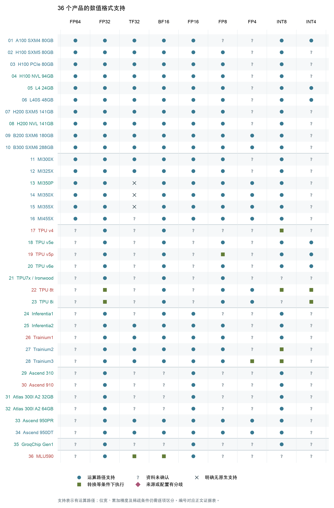

图 1。圆点表示有对应运算路径，不保证是矩阵路径，也不保证高速执行。方块表示经转换等条件后执行；叉号仅用于来源明确排除的原生支持，问号表示未确认，菱形保留来源分歧。仅能存储某格式或做独立类型转换，不计作该格式的计算支持。每个格子的执行范围和来源可在第 10 节展开。

格式支持矩阵没有形成训练与推理之间的单一精度界线。FP16/BF16 等路径在多类定位中出现，低位输入也不能单凭位宽判断是“推理专用”。例如 Trainium3 的 MXFP4 输入先映射到 MXFP8 后进入 TensorEngine（AWS 的矩阵计算引擎），故保留为条件支持；AMD CDNA 4 架构的 TF32 软件模拟也与原生 TF32 路径区分。MXFP4/MXFP8 属于带共享缩放因子的低位浮点格式；这些执行条件不能相加为“支持格式总分”。[Trainium3](../产品详解/AWS/AWS_Trainium3_one_chip_产品详解.md) [MI350X](../产品详解/AMD/MI350X.md)

36 个产品中，30 个有 BF16 运算路径记录，另 1 个保留条件支持；FP8 家族为 26 个、另 1 个条件支持，FP4 家族为 10 个、另 1 个条件支持。这说明低位浮点已出现在多种产品中，但尚不是本清单所有产品共有的能力。其余格子主要是当前资料未确认，不能据此断言硬件不支持。

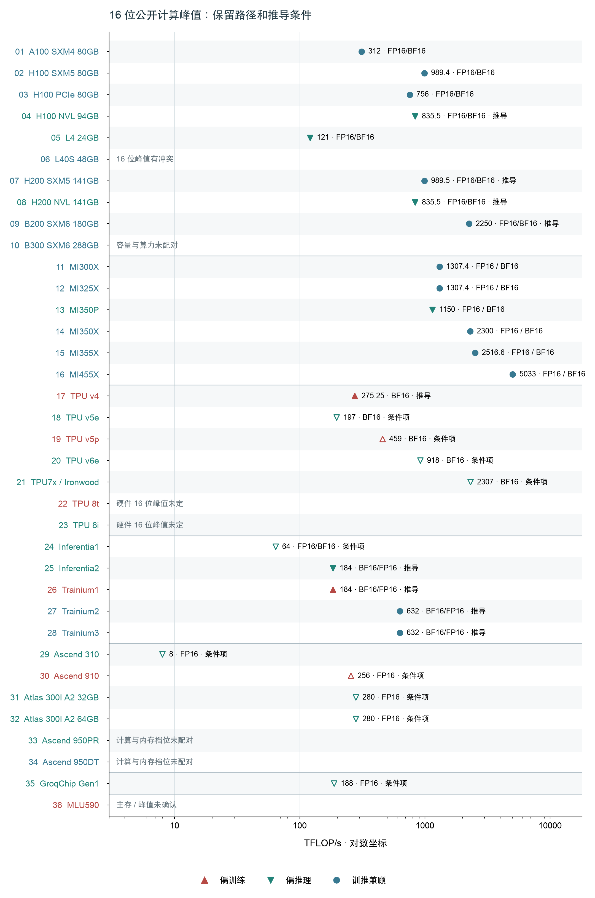

图 2。TFLOP/s 表示每秒万亿次浮点运算。选取可以固定到本产品的 FP16 或 BF16 峰值；矩阵、向量和标量不相加成总算力，稀疏峰值也不与 dense 值直接并列。没有可靠 16 位数值的产品仍占一行；Groq 的片上主存路线不妨碍其出现在计算规模图中。

NVIDIA 的部分型号依据明确的结构化稀疏倍率折算 dense 值；AWS 的部分型号采用已披露单核 TensorEngine 峰值乘核数，保留整芯片宣传值作为另一个来源口径。图 2 中的值和后续存算比始终使用同一条记录。L40S 的原表矛盾、B300 的容量版本对应问题、TPU 8 的软件性能模型以及 Ascend 950 的多档配置分别说明，不用最大值拼成一个点。

## 3. 存储组织与外部主存

DRAM 在这里指设备用于保存权重和运行状态的外部主存；HBM 是采用堆叠封装的高带宽 DRAM，GDDR 是常见于图形与加速卡的显存，DDR/LPDDR 是其他主存接口形式。“外部”相对计算裸片而言，HBM 即使位于同一封装内仍归入这一层。SRAM 则用于片上缓存或工作存储；cache 的硬件管理方式与程序显式管理的工作存储分别记录。

下表按已有实现组织产品。这里比较存储层的用途和管理方式，没有把不同层级的 SRAM 加成“等效 L2”，也没有要求每个产品必须具有 L2。

| 产品范围 | 已确认的组织特点 | 比较时保留的边界 |
|---|---|---|
| NVIDIA：A100、H100/H200 各型、L4/L40S、B200/B300 | 寄存器、硬件管理的 L1/L2 与程序显式使用的 shared memory 并存。部分产品还有专用矩阵工作存储或跨核心访问机制。 [产品详解](../产品详解/NVIDIA/NVIDIA_A100_SXM4_80GB.md) | 同一层的共享范围和各 SKU 实际容量分别确认，cache 与工作存储不重复相加。 |
| AMD：MI300X、MI325X、MI350P/X、MI355X | 计算侧局部存储和 L2，与内存侧 Infinity Cache 分层组织。 [产品详解](../产品详解/AMD/MI350X.md) | 各计算裸片的 L2 总量不等同于一个统一共享 L2；显式工作存储与 cache 分开。 |
| AMD：MI455X | 本地 SRAM 在工作存储与 vector cache 间分配，全局 L2 位于 fabric/cache 裸片。 [产品详解](../产品详解/AMD/MI455X.md) | 共享本地 SRAM 的不同配置不能重复求和；全局 L2 与本地层保持区别。 |
| Google：TPU v4、v5e、v5p、v6e、TPU7x | 片上工作存储服务矩阵与向量路径，外部 HBM 保存更大的数据集。 [产品详解](../产品详解/Google-TPU/Google_Cloud_TPU_v4_one_chip_产品详解.md) | 按各代 TensorCore 与工作存储的作用域记录，不以名称推断等效 GPU cache。 |
| Google：TPU 8t、8i | 公开 Vmem 与 HBM 配置。 [产品详解](../产品详解/Google-TPU/Google_TPU_8t_one_chip_产品详解.md) | 产品表 MB 与开发接口 MiB 分开；每核局部空间不能视作统一共享 cache。 |
| AWS：Inferentia1/2、Trainium1/2/3 | 片上工作存储、部分和缓冲与数据搬运路径分工；各代按实际公开内容展开。 [产品详解](../产品详解/AWS/AWS_Trainium3_one_chip_产品详解.md) | 显式搬运与缓冲的容量、端口和服务引擎分别解释，不把它们标成 L2。 |
| 昇腾：Ascend 310、910 | 核内工作缓冲与芯片共享存储、CPU cache 分属不同层级。 [产品详解](../产品详解/华为昇腾/华为_Ascend310.md) | Ascend 310 的外部内存配置未固定；不能借用具体板卡填单芯片容量。 |
| 昇腾：Atlas 300I A2 两容量版本 | 新用户指南确认 Cache 和 HBM。 [产品详解](../产品详解/华为昇腾/华为_Atlas300I_A2_32GB.md) | 本卡的 cache 层级和容量未展开，不迁移其他 910 子型号细节。 |
| 昇腾：950PR、950DT | 核内显式缓冲、全局 L2 与同封装 DRAM 分层组织。 [产品详解](../产品详解/华为昇腾/华为_Ascend950PR.md) | 主推内存组合可单独比较，计算档位尚未与它们配成唯一 SKU。 |
| Groq：第一代 GroqChip | 以片上 SRAM 保存工作数据，由执行计划组织数据流动。 [产品详解](../产品详解/Groq/Groq_GroqChip_Processor_第一代.md) | 没有本报告所比较的外部 DRAM 层；SRAM 容量、片内带宽不放入 DRAM 图。 |
| 寒武纪：MLU590 | 可取得的软件资源描述与已确认芯片事实分开记录。 [产品详解](../产品详解/寒武纪/寒武纪_思元590_MLU590.md) | 缺少可固定到该芯片的主存规格时，保留未确认。 |

各组文字只概括共同组织，组内每款的确切容量、管理语义和来源分别保存在第 10 节，不从一个型号的规格推断同组所有型号。

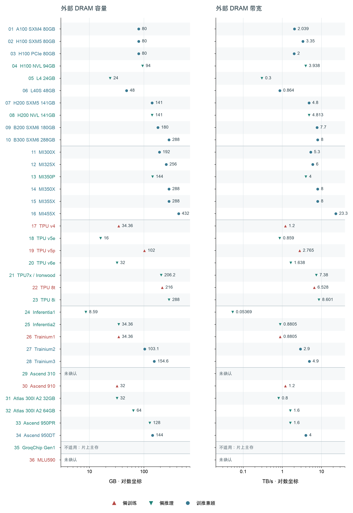

图 3。左右面板分别表示容量和带宽，使用十进制 GB、TB/s；原文 GiB 按二进制字节数换算，原始单位保存在证据中。对数坐标用于同时显示不同规模产品。采用的值是规格或明确标注的配置值，不是持续测得带宽。

外部容量与带宽是两个独立的资源条件：容量决定能同时容纳多少数据，带宽约束搬运速度。HBM 出现在训练、推理和训推兼顾的多种定位中，采用 HBM 本身不足以分类用途。Groq 的空缺属于架构不适用，Ascend 310 和 MLU590 的空缺属于当前配置或证据不足，这两种情况不作相同解释。

本清单有 30 个产品采用 HBM，L4 和 L40S 采用 GDDR6，Inferentia1 使用 DDR4。Ascend 310 已确认 LPDDR4X 接口但未固定外存配置，Groq 采用片上主存，MLU590 的主存规格尚未确认。因此，“外部 DRAM”能够覆盖大部分产品，仍需为片上主存路线保留独立位置。

图 3 为每个产品选择可定位的展示值，离散候选没有画成连续误差区间。H100 SXM 采用现行简报的 3.35 TB/s，白皮书的 3.352 TB/s 带未定版注记，MI455X 的 23.3/19.6 TB/s 则保留各自来源上下文。Ascend 910 的容量来自具体官方测试配置，950PR/DT 的内存来自主推组合；这些记录不自动保证其他字段已与它们完整配对。

容量除以带宽 C/B 可以补充描述存储本身：按标称带宽顺序流过一遍完整容量，理想情况下需要多长时间。33 个可配对主存记录的结果约为 18.5 至 160 ms；它不需要计算峰值，因此 B300、TPU 8 和 Ascend 950 的已确认主存组合也能参与。这个数值不包含访问启动、随机访问、利用率或其他流量，不能当成内存访问延迟。各产品结果列在第 5 节的补充配比表。

## 4. DRAM 与计算资源的配比

令 P 表示所选 16 位峰值，C 表示同配置 DRAM 容量，B 表示其带宽。B/P 的单位是 byte/FLOP，描述每单位峰值计算对应多少外存供数；C/P 使用 GB/(TFLOP/s)，描述计算规模对应多少存储空间。它们是配置指标，不能直接给出模型容量、延迟或利用率。

本节使用 27 个可配对产品，实心 19 个、空心 8 个。明确没有外部 DRAM 的对象、缺数值或配置未固定的对象不进入散点，但在图 6 和证据表中保留。图中的斜线是等配比参考线；两款产品即使落在同一条线上，绝对资源规模也可能相差很大。

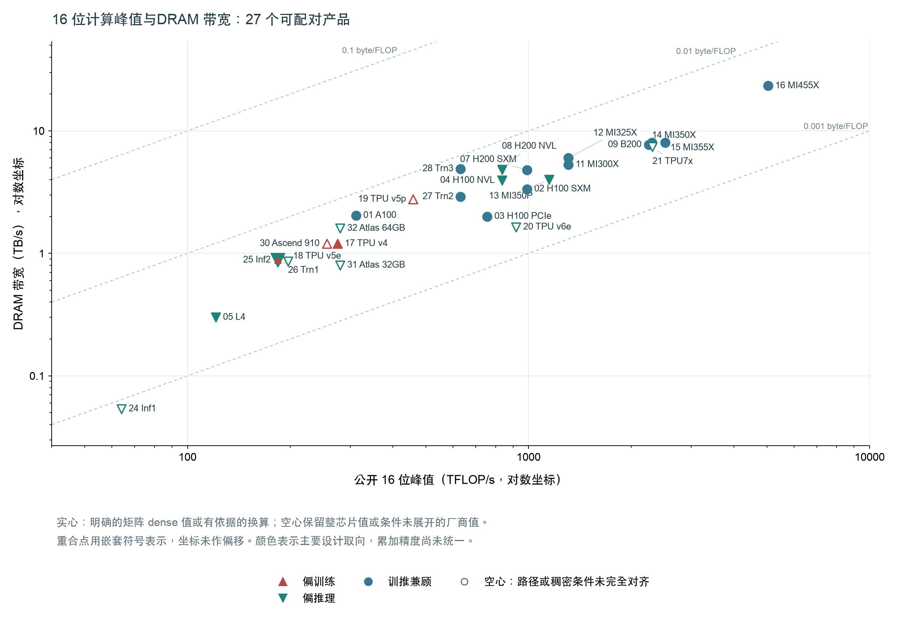

图 4。横轴为 16 位计算峰值，纵轴为 DRAM 带宽。相同峰值下，点越靠上代表标称外存供给越多；保持相同比值的资源同比增长沿等比线移动。空心点的计算口径尚未完全对齐，不用它们与实心点直接构造用途组均值。

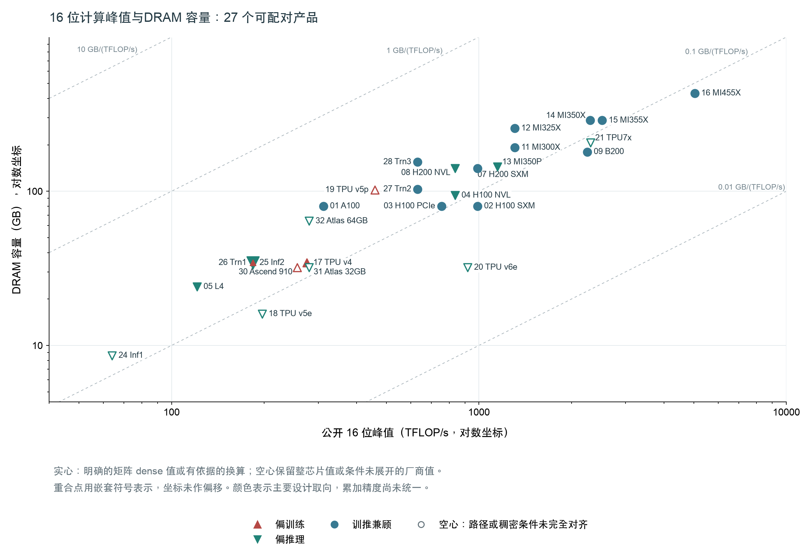

图 5。横轴与图 4 相同，纵轴改为容量。两张图分别回答数据“放得下多少”和“搬得动多快”，并不重复。模型权重、训练状态、激活和 KV Cache（推理中保存的注意力键值状态）如何占用容量，还需要具体负载条件。

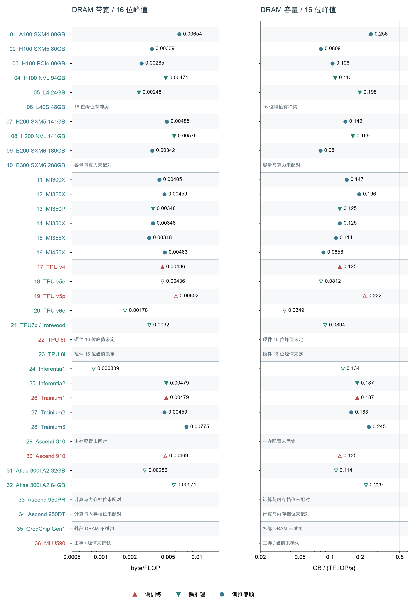

图 6。将两个比值展开到全体产品行，并列出未形成比值的原因。没有将 L40S 的冲突值取平均，没有用 TPU 8 的软件成本模型充当硬件峰值，也没有把 B300、Ascend 950 的最大算力与最大内存跨配置拼接。

只看 19 个采用明确矩阵 dense 值或有依据换算的产品，所选峰值从 121 到 5,033 TFLOP/s，相差约 41.6 倍；B/P 则落在约 0.00248 至 0.00775 byte/FLOP，跨度约 3.13 倍。绝对带宽随计算规模有较大的变化，但每单位峰值对应的外存供给仍有明显差异。这一范围描述本次选值；若替换为各来源的候选值，边界也可能改变。

同一子集中，C/P 约为 0.0800 至 0.256 GB/(TFLOP/s)，跨度约 3.21 倍。容量配比和带宽配比也不必同步：例如 L4 的 B/P 约 0.00248，而 C/P 约 0.198；B200 的对应值约为 0.00342 和 0.0800。两种排序反映不同资源供给，不能合并成一个“存算更均衡”的分数。[L4 取值](#panorama-l4) [B200 取值](#panorama-b200_sxm6)

在这组样本中，容量与带宽没有被计算峰值唯一决定：相同或相近计算规模附近仍存在不同的主存配置。图中相同用途颜色也分布在多个配比位置。当前证据支持讨论资源配置的范围，不支持给“训练组”或“推理组”规定一个统一存算比；产品代际、形态和共用底层架构仍是其他解释。

## 5. 设备互联端点

本节采用单设备专用互联端点的 TX + RX（发送与接收合计）标称带宽，NVLink、Infinity Fabric、ICI 等协议名称在证据中保留。只有方向和统计边界明确的 22 个产品进入左图；主机 PCIe、封装内裸片间带宽和服务器聚合带宽单独处理。右图仅在 16 位峰值也可固定时计算配比。

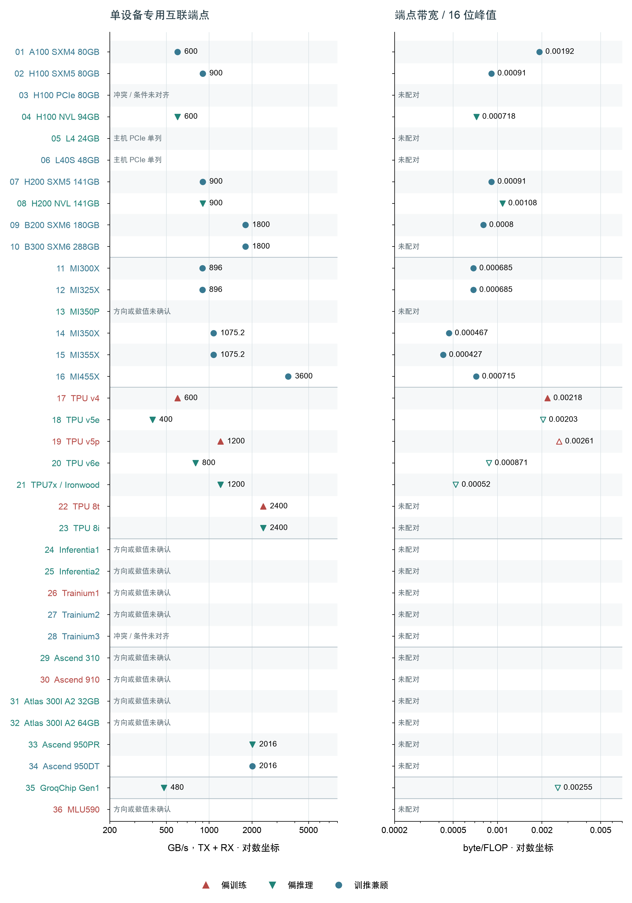

图 7。左侧是端点带宽，右侧是端点带宽/16 位峰值。协议编码、交换结构、链路复用和流量模式没有统一；Ascend 950 的数值包含原始链路速率口径。图中比值只表示接口预算，不能换算成跨设备归约、all-to-all（所有设备互相交换数据）或模型扩展效率。

主机接口与专用设备互联承担不同连接关系。未公开专用接口不表示没有任何多设备通信方式；公开很高的端点合计值，也不保证一条任务数据路径可以独占全部链路。H100 PCIe 的 600/900 GB/s 来源冲突，以及 AWS 部分型号方向或聚合方式不明的值，都保留在逐项证据中，不静默选成无条件单点。

还可以把设备端点带宽 D 与 DRAM 带宽 B 相除。21 个产品可以形成这一比值，所选值约为 0.134 至 1.26。D 使用收发合计，B 使用主存规格带宽，所以 D/B 表示两种接口的标称资源关系，不能直接读成“有多少比例的 HBM 数据可发给另一芯片”。Ascend 950PR 的原始端点合计与链路复用条件尤其需要保留。

展开 36 个产品的补充配比：容量 / 带宽、设备互联 / DRAM

| 产品 | C/B：标称容量流过时间（ms） | D/B：互联收发合计 / DRAM 带宽 |
|---|---|---|
| [01 A100 SXM4 80GB](#panorama-a100_sxm4) | 39.2 | 0.294 |
| [02 H100 SXM5 80GB](#panorama-h100_sxm5) | 23.9 | 0.269 |
| [03 H100 PCIe 80GB](#panorama-h100_pcie) | 40 | 未配对 |
| [04 H100 NVL 94GB](#panorama-h100_nvl) | 23.9 | 0.152 |
| [05 L4 24GB](#panorama-l4) | 80 | 未配对 |
| [06 L40S 48GB](#panorama-l40s) | 55.6 | 未配对 |
| [07 H200 SXM5 141GB](#panorama-h200_sxm5) | 29.4 | 0.188 |
| [08 H200 NVL 141GB](#panorama-h200_nvl) | 29.3 | 0.187 |
| [09 B200 SXM6 180GB](#panorama-b200_sxm6) | 23.4 | 0.234 |
| [10 B300 SXM6 288GB](#panorama-b300_sxm6) | 36 | 0.225 |
| [11 MI300X](#panorama-mi300x) | 36.2 | 0.169 |
| [12 MI325X](#panorama-mi325x) | 42.7 | 0.149 |
| [13 MI350P](#panorama-mi350p) | 36 | 未配对 |
| [14 MI350X](#panorama-mi350x) | 36 | 0.134 |
| [15 MI355X](#panorama-mi355x) | 36 | 0.134 |
| [16 MI455X](#panorama-mi455x) | 18.5 | 0.155 |
| [17 TPU v4](#panorama-tpu_v4) | 28.6 | 0.5 |
| [18 TPU v5e](#panorama-tpu_v5e) | 18.6 | 0.466 |
| [19 TPU v5p](#panorama-tpu_v5p) | 36.9 | 0.434 |
| [20 TPU v6e](#panorama-tpu_v6e) | 19.5 | 0.488 |
| [21 TPU7x / Ironwood](#panorama-tpu7x) | 27.9 | 0.163 |
| [22 TPU 8t](#panorama-tpu8t) | 33.1 | 0.368 |
| [23 TPU 8i](#panorama-tpu8i) | 33.5 | 0.279 |
| [24 Inferentia1](#panorama-inferentia1) | 160 | 未配对 |
| [25 Inferentia2](#panorama-inferentia2) | 39 | 未配对 |
| [26 Trainium1](#panorama-trainium1) | 39 | 未配对 |
| [27 Trainium2](#panorama-trainium2) | 35.5 | 未配对 |
| [28 Trainium3](#panorama-trainium3) | 31.6 | 未配对 |
| [29 Ascend 310](#panorama-ascend310) | 未确认 | 未配对 |
| [30 Ascend 910](#panorama-ascend910) | 26.7 | 未配对 |
| [31 Atlas 300I A2 32GB](#panorama-atlas300ia2_32) | 40 | 未配对 |
| [32 Atlas 300I A2 64GB](#panorama-atlas300ia2_64) | 40 | 未配对 |
| [33 Ascend 950PR](#panorama-ascend950pr) | 80 | 1.26 |
| [34 Ascend 950DT](#panorama-ascend950dt) | 36 | 0.504 |
| [35 GroqChip Gen1](#panorama-groq_gen1) | 不适用：无外部 DRAM | 不适用：无外部 DRAM |
| [36 MLU590](#panorama-mlu590) | 未确认 | 未配对 |

取值与来源见对应产品证据。C 采用 GB、B 采用 TB/s 时，C/B 的数值恰为 ms；计算 D/B 前先将 D 的 GB/s 换成 TB/s。

## 6. 功率规格与部署条件

功率先按板卡、模组和芯片边界分类。TDP 是热设计功耗，TBP 是整板功率；额定或最大值与某负载的平均耗电不是同一指标。所用功率规格还可能随线缆、供电、散热或软件档位改变。

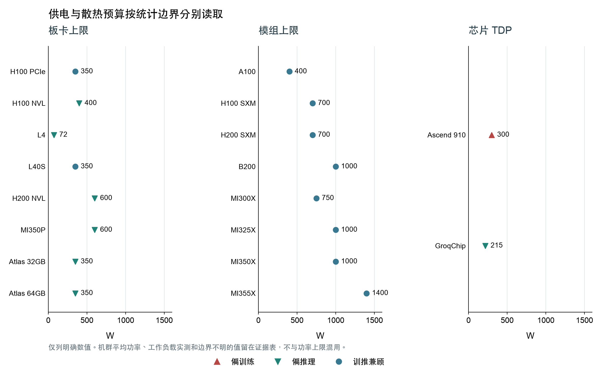

图 8。18 个有明确数值和边界的产品分面呈现，不合并为能效排名。TPU 的机群平均功率、Groq 的平均值与最高功耗、Ascend 310 的未定边界原报值均在证据中保留；图中的 Groq 与 Ascend 910 仅取明确的芯片 TDP。B300 的功率没有与本研究容量配置绑定，MI455X、Ascend 950 等缺少对应单设备值时保持缺失。

PCIe 插卡、SXM/OAM/EAM 模组和云内芯片处于不同供电及部署约束。第一层可以展示这些预算的范围，不能用峰值除上限功率得到实测训练或推理能效，也不能从模组功率反推计算裸片功耗。所有产品的形态与冷却条件见第 1 节及逐项证据。

## 7. 低精度、主机接口与功率配比

低位宽格式另设坐标，不与 16 位峰值拼成算力排名。MX 表示一组元素共享缩放信息的 microscaling 格式；相同位宽不代表相同动态范围、累加行为或执行路径。下图使用同一产品的已确认主存配置，空心点保留原文尚未展开的条件。

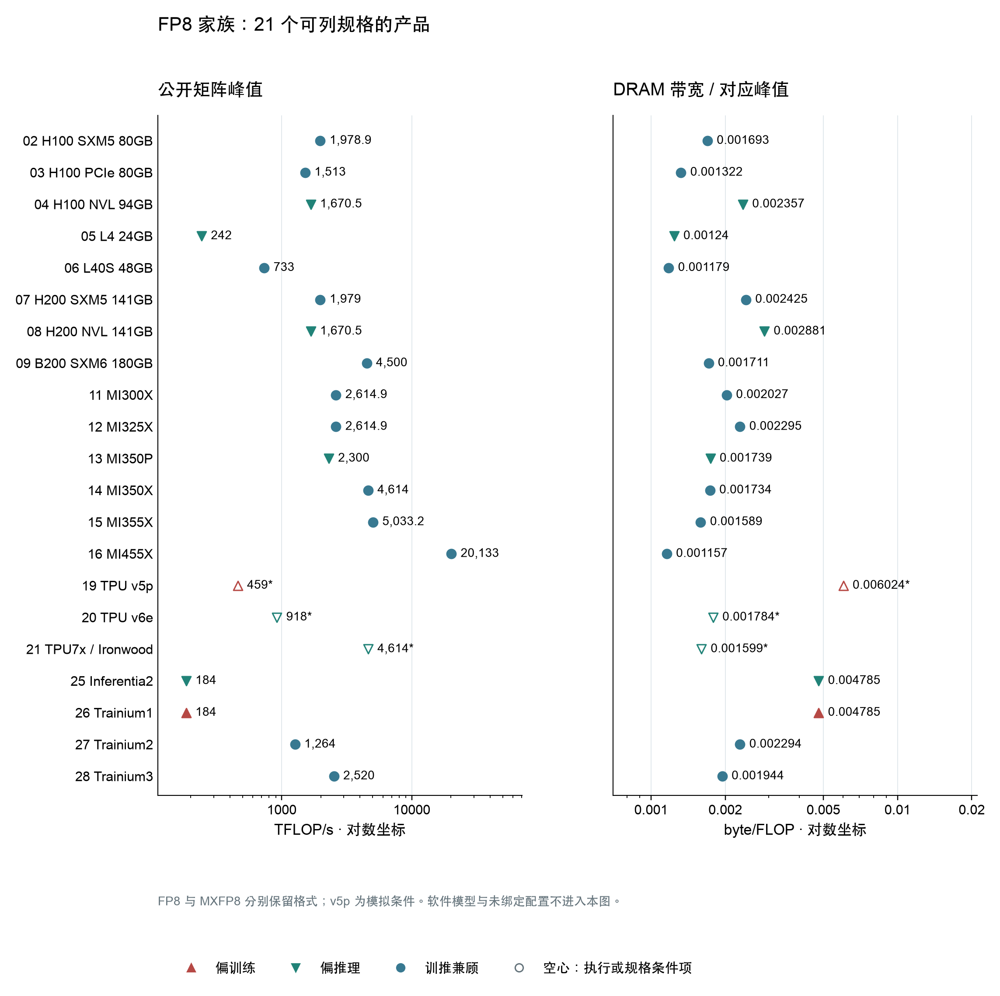

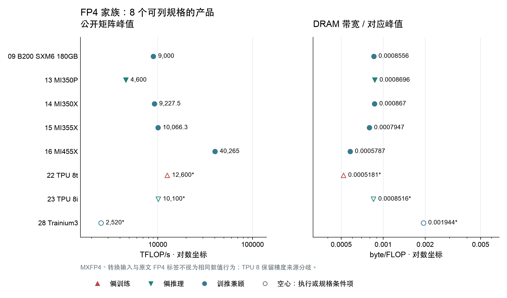

FP8 和 FP4 能力跨越多种定位。TPU v5p 的官方规格列 459 TFLOP/s，但 Google 的 Ironwood 发布文将旧代 FP8 描述为 emulated（模拟实现），故不标成原生 FP8；Trainium3 的 MXFP4 输入先映射为 MXFP8 后计算，峰值没有因输入位宽减半而翻倍。TPU 8 的技术文章与发布规格图存在 FP4/FP8 标签分歧，仍保留为条件项。下表逐行给出来源。

低精度选值、与 16 位的比值及执行条件

| 产品 | FP8 家族 TFLOP/s | FP4 家族 TFLOP/s | 相对 16 位公开峰值 | 条件与来源 |
|---|---:|---:|---|---|
| [H100 SXM5 80GB](#panorama-h100_sxm5) | 1978.9 | 未确认 | FP8/16位=2 | FP8 E4M3/E5M2：白皮书分别列出 FP16 与 FP32 累加，dense 峰值相同；保留原表精度及频率条件。 [参考 1，pp.20,39-40, Table 3](../产品详解/NVIDIA/NVIDIA_H100_SXM5_80GB.md#ref-1) |
| [H100 PCIe 80GB](#panorama-h100_pcie) | 1513 | 未确认 | FP8/16位=2 | FP8 E4M3/E5M2：1620 MHz低精度Tensor峰值；不使用普通FP32的1755 MHz。 [参考 1，pp.20,39-40, Table 3](../产品详解/NVIDIA/NVIDIA_H100_PCIe_80GB.md#ref-1) |
| [H100 NVL 94GB](#panorama-h100_nvl) | 1670.5 | 未确认 | FP8/16位=2 | FP8 E4M3/E5M2：3341 sparse / 2；推导值含原数舍入；单张94GB卡。 [参考 2，p.2, Technical Specifications and note](../产品详解/NVIDIA/NVIDIA_H100_NVL_94GB.md#ref-2); [参考 3，pp.11,21](../产品详解/NVIDIA/NVIDIA_H100_NVL_94GB.md#ref-3); [参考 28，§9.7.17.6.1](../产品详解/NVIDIA/NVIDIA_H100_NVL_94GB.md#ref-28) |
| [L4 24GB](#panorama-l4) | 242 | 未确认 | FP8/16位=2 | FP8 E4M3/E5M2：白皮书直接dense；不将sparse485折半覆盖242。 [参考 2，p.40, Table 5](../产品详解/NVIDIA/NVIDIA_L4_24GB.md#ref-2) |
| [L40S 48GB](#panorama-l40s) | 733 | 未确认 | 16位未配对 | FP8 E4M3/E5M2：FP8行无FP16行的362.05/733矛盾；本次不由733反推已确认FP16值。 [参考 2，GPU Specifications and note](../产品详解/NVIDIA/NVIDIA_L40S_48GB.md#ref-2) |
| [H200 SXM5 141GB](#panorama-h200_sxm5) | 1979 | 未确认 | FP8/16位=2 | FP8 E4M3/E5M2：3958 sparse / 2；preliminary规格。 [参考 1，p.4, Technical Specifications and notes](../产品详解/NVIDIA/NVIDIA_H200_SXM5_141GB.md#ref-1); [参考 3，pp.11,21](../产品详解/NVIDIA/NVIDIA_H200_SXM5_141GB.md#ref-3); [参考 28，§9.7.17.6.1](../产品详解/NVIDIA/NVIDIA_H200_SXM5_141GB.md#ref-28) |
| [H200 NVL 141GB](#panorama-h200_nvl) | 1670.5 | 未确认 | FP8/16位=2 | FP8 E4M3/E5M2：3341 sparse / 2；preliminary；带宽保留现有详细简报4.813TB/s及网页4.8候选。 [参考 3，GPU specifications and note 2](../产品详解/NVIDIA/NVIDIA_H200_NVL_141GB.md#ref-3); [参考 2，pp.11,21](../产品详解/NVIDIA/NVIDIA_H200_NVL_141GB.md#ref-2); [参考 28，§9.7.17.6.1](../产品详解/NVIDIA/NVIDIA_H200_NVL_141GB.md#ref-28) |
| [B200 SXM6 180GB](#panorama-b200_sxm6) | 4500 | 9000 | FP8/16位=2；FP4/16位=4 | FP8/FP6 Tensor：与180GB/7.7TB/s同一数据手册：9PF sparse / 2。技术简报最高192GB条件不替换本配置。 [参考 1，p.8, notes 1-2](../产品详解/NVIDIA/NVIDIA_B200_SXM6_180GB.md#ref-1) NVFP4：与180GB数据手册一致：18PF sparse / 2；每16元素FP8 scale，另有tensor FP32 scale。 [参考 1，p.8, notes 1-2](../产品详解/NVIDIA/NVIDIA_B200_SXM6_180GB.md#ref-1); [参考 9，§9.7.18.10.7](../产品详解/NVIDIA/NVIDIA_B200_SXM6_180GB.md#ref-9) |
| [MI300X](#panorama-mi300x) | 2614.9 | 未确认 | FP8/16位=2 | FP8 E4M3/E5M2 FNUZ：Matrix路径，FP32 C/D；不与CDNA4的OCP编码视为完全相同数值格式。 [参考 8，p.1](../产品详解/AMD/MI300X.md#ref-8); [参考 3，§12.10, pp.267-272,277-279](../产品详解/AMD/MI300X.md#ref-3) |
| [MI325X](#panorama-mi325x) | 2614.9 | 未确认 | FP8/16位=2 | FP8 E4M3/E5M2 FNUZ：Matrix路径，FP32 C/D。 [参考 3，AI / HPC Peak Theoretical Performance](../产品详解/AMD/MI325X.md#ref-3); [参考 5，§12.10, pp.267-272,277-279](../产品详解/AMD/MI325X.md#ref-5) |
| [MI350P](#panorama-mi350p) | 2300 | 4600 | FP8/16位=2；FP4/16位=4 | OCP-FP8; MXFP8另列同值：单卡144GB；brochure标estimated；MX格式带scale，不能将两条路径相加。 [参考 1，GPU Specifications](../产品详解/AMD/MI350P.md#ref-1); [参考 2，p.1 performance tables](../产品详解/AMD/MI350P.md#ref-2) MXFP4：每32元素scale；MXFP4/6行未给稀疏倍增；原文estimated。 [参考 1，GPU Specifications](../产品详解/AMD/MI350P.md#ref-1); [参考 2，p.1 performance tables](../产品详解/AMD/MI350P.md#ref-2) |
| [MI350X](#panorama-mi350x) | 4614 | 9227.5 | 16位不同来源有冲突，暂不派生 | OCP-FP8; MXFP8另列同值：brochure精确显示值；现有FP16采用产品页2300，brochure的2309.6与架构复算有冲突，计算跨精度倍率须保留此条件。 [参考 2，p.1 AI / HPC Peak Theoretical Performance](../产品详解/AMD/MI350X.md#ref-2) MXFP4：brochure精确显示值；MX路径不自行乘稀疏倍率。 [参考 2，p.1 AI / HPC Peak Theoretical Performance](../产品详解/AMD/MI350X.md#ref-2) |
| [MI355X](#panorama-mi355x) | 5033.2 | 10066.3 | FP8/16位=2；FP4/16位=4 | OCP-FP8; MXFP8另列同值：与现有FP16=2516.6同源；不要改用网页舍入值替换。 [参考 2，p.1 AI / HPC Peak Theoretical Performance](../产品详解/AMD/MI355X.md#ref-2) MXFP4：MFMA的A/B均用FP4/FP6时才有最快周期；任一FP8走较慢路径。 [参考 2，p.1 AI / HPC Peak Theoretical Performance](../产品详解/AMD/MI355X.md#ref-2) |
| [MI455X](#panorama-mi455x) | 20133 | 40265 | FP8/16位=4；FP4/16位=8 | OCP FP8; MXFP8另列同值：规格表未列FP8稀疏峰值；FP8 WMMA C/D可选FP16/FP32，未逐模式给峰值。 [参考 2，p.1 AI Peak Theoretical Performance](../产品详解/AMD/MI455X.md#ref-2) OCP MXFP4：支持16或32元素scale组，按指令限制使用；block-scale WMMA不支持结构化稀疏。 [参考 2，p.1 AI Peak Theoretical Performance](../产品详解/AMD/MI455X.md#ref-2); [参考 9，§7.12.6, pp.103-105](../产品详解/AMD/MI455X.md#ref-9) |
| [TPU v5p](#panorama-tpu_v5p) | 459 | 未确认 | FP8/16位=1 | FP8/BF8（原文标签）：Cloud用FP8、论文用BF8；累加/输出与dense条件未全面展开。 官方Ironwood发布文Figure 2称v5p的FP8为emulated；当前矩阵峰值保留459但标转换/模拟条件，不称原生FP8。 [参考 1，System architecture](../产品详解/Google-TPU/Google_Cloud_TPU_v5p_one_chip_产品详解.md#ref-1); [参考 2，Table 1](../产品详解/Google-TPU/Google_Cloud_TPU_v5p_one_chip_产品详解.md#ref-2); [参考 24，Figure 2 caption](../产品详解/Google-TPU/Google_Cloud_TPU_v5p_one_chip_产品详解.md#ref-24) |
| [TPU v6e](#panorama-tpu_v6e) | 918 | 未确认 | FP8/16位=1 | FP8（官方产品表）：与官方BF16=918同速；JAX920是开发模型替代，不能混用于本行比例。 [参考 2，TPU architecture specifications](../产品详解/Google-TPU/Google_Cloud_TPU_v6e_one_chip_产品详解.md#ref-2) |
| [TPU7x / Ironwood](#panorama-tpu7x) | 4614 | 未确认 | FP8/16位=2 | FP8（产品规格）：官方峰值，未说明结构化稀疏条件；JAX每核2300两核4600为另一模型。 [参考 1，System architecture](../产品详解/Google-TPU/Google_Cloud_TPU7x_one_chip_产品详解.md#ref-1); [参考 5，Table 1 and pp.2,6](../产品详解/Google-TPU/Google_Cloud_TPU7x_one_chip_产品详解.md#ref-5) |
| [TPU 8t](#panorama-tpu8t) | 未确认 | 12600 | 16位未配对 | FP4（技术文章规格）：单芯片；未公开全部缩放/累加/稠密计数条件，不除4制造FP16。 [参考 1，Native FP4 and Peak FP4 PFLOPs](../产品详解/Google-TPU/Google_TPU_8t_one_chip_产品详解.md#ref-1) |
| [TPU 8i](#panorama-tpu8i) | 未确认 | 10100 | 16位未配对 | FP4（技术文章规格）：单芯片；官方发布图出现FP8标签冲突，必须显式注释；可在条件面板显示，不进入严格子集。 [参考 1，Peak FP4 PFLOPs](../产品详解/Google-TPU/Google_TPU_8i_one_chip_产品详解.md#ref-1) |
| [Inferentia2](#panorama-inferentia2) | 184 | 未确认 | FP8/16位=1 | cFP8：2核 × 92TFLOPS纯Tensor；与现有FP16=184统一，不用整芯片advertised190。cFP8编码细节未完整展开。 [参考 2，engine width/frequency table and Tensor Engine: Data Types](../产品详解/AWS/AWS_Inferentia2_one_chip_产品详解.md#ref-2) |
| [Trainium1](#panorama-trainium1) | 184 | 未确认 | FP8/16位=1 | cFP8：2核 × 92TFLOPS纯Tensor；与现有FP16=184统一，不用整芯片advertised190。cFP8编码细节未完整展开。 [参考 2，engine width/frequency table and Tensor Engine: Data Types](../产品详解/AWS/AWS_Trainium1_one_chip_产品详解.md#ref-2) |
| [Trainium2](#panorama-trainium2) | 1264 | 未确认 | FP8/16位=2 | FP8 E4/E5 double-row：8核 × 158TFLOPS；对应FP16=8×79=632。E3不翻倍；double FP8不能与sparse、column tiling或transpose mode合用。 [参考 2，Table 11 and Tensor Engine; Double FP8 Matmul Performance](../产品详解/AWS/AWS_Trainium2_one_chip_产品详解.md#ref-2) |
| [Trainium3](#panorama-trainium3) | 2520 | 2520 | FP8/16位=3.99；FP4/16位=3.99 | MXFP8：8核 × 315TFLOPS；对应FP16=632；不同于advertised2517。每32元素共享8-bit scale。 [参考 2，Table 11 and Tensor Engine](../产品详解/AWS/AWS_Trainium3_one_chip_产品详解.md#ref-2); [参考 3，Tensor Engine](../产品详解/AWS/AWS_Trainium3_one_chip_产品详解.md#ref-3) MXFP4输入，计算前映射为MXFP8：8核 × 315TFLOPS；转换输入路径单独标记，不能称原生FP4乘法阵列；MXFP4与MXFP8同速。 [参考 2，Table 11 and Quad-MXFP8/MXFP4 Matmul Performance](../产品详解/AWS/AWS_Trainium3_one_chip_产品详解.md#ref-2); [参考 3，Tensor Engine](../产品详解/AWS/AWS_Trainium3_one_chip_产品详解.md#ref-3) |

比值是表内规格的算术比较；含模拟、转换或厂商条件项的行不解释为原生矩阵阵列加速倍数，也不比较算法精度质量。

配置未配对的规格与软件性能模型

| 产品 | 保留记录 | 条件与来源 |
|---|---|---|
| B300 SXM6 288GB | fp8_tflops=4500；fp4_tflops=14000 | 270GB/7.7TB/s配置；当前对象288GB/8TB/s，不能拼接；FP4 sparse18PF与dense14PF不构成简单2倍。 [参考 1，pp.25-26, Table 3](../产品详解/NVIDIA/NVIDIA_B300_SXM6_288GB.md#ref-1) |
| TPU 8t | BF16 996.1 TFLOP/s | JAX静态开发模型；8t一核，8i两核合计；不进入产品额定峰值主图。 [参考 21，TPU_8T branch](../产品详解/Google-TPU/Google_TPU_8t_one_chip_产品详解.md#ref-21) |
| TPU 8t | FP8 5976.9 TFLOP/s | JAX静态开发模型；不与技术文章FP4峰值相除。 [参考 21，TPU_8T branch](../产品详解/Google-TPU/Google_TPU_8t_one_chip_产品详解.md#ref-21) |
| TPU 8i | BF16 1101 TFLOP/s | JAX静态开发模型；8t一核，8i两核合计；不进入产品额定峰值主图。 [参考 21，TPU_8I branch](../产品详解/Google-TPU/Google_TPU_8i_one_chip_产品详解.md#ref-21) |
| TPU 8i | FP8 8808 TFLOP/s | JAX静态开发模型；不与技术文章FP4峰值相除。 [参考 21，TPU_8I branch](../产品详解/Google-TPU/Google_TPU_8i_one_chip_产品详解.md#ref-21) |
| Ascend 950PR | cube_count=32；fp16_tflops=432；fp8_tflops=865；fp4_tflops=1730；format=Cube FP16/BF16；FP8/HiF8/MXFP8；MXFP4 | 纯Cube，不能加Vector；内存档位与计算档位未逐项映射，不进入固定SKU的B/P。 [参考 1，PDF pp.13-14 / 正文pp.9-10, 表3-1](../产品详解/华为昇腾/华为_Ascend950PR.md#ref-1) |
| Ascend 950PR | cube_count=28；fp16_tflops=378；fp8_tflops=756；fp4_tflops=1513；format=Cube FP16/BF16；FP8/HiF8/MXFP8；MXFP4 | 纯Cube，不能加Vector；内存档位与计算档位未逐项映射，不进入固定SKU的B/P。 [参考 1，PDF pp.13-14 / 正文pp.9-10, 表3-1](../产品详解/华为昇腾/华为_Ascend950PR.md#ref-1) |
| Ascend 950DT | cube_count=36；fp16_tflops=486；fp8_tflops=973；fp4_tflops=1946；format=Cube FP16/BF16；FP8/HiF8/MXFP8；MXFP4 | 纯Cube，不能加Vector；内存档位与计算档位未逐项映射，不进入固定SKU的B/P。 [参考 1，PDF pp.13-14 / 正文pp.9-10, 表3-1](../产品详解/华为昇腾/华为_Ascend950DT.md#ref-1) |
| Ascend 950DT | cube_count=32；fp16_tflops=432；fp8_tflops=865；fp4_tflops=1730；format=Cube FP16/BF16；FP8/HiF8/MXFP8；MXFP4 | 纯Cube，不能加Vector；内存档位与计算档位未逐项映射，不进入固定SKU的B/P。 [参考 1，PDF pp.13-14 / 正文pp.9-10, 表3-1](../产品详解/华为昇腾/华为_Ascend950DT.md#ref-1) |
| Ascend 950DT | cube_count=28；fp16_tflops=378；fp8_tflops=756；fp4_tflops=1513；format=Cube FP16/BF16；FP8/HiF8/MXFP8；MXFP4 | 纯Cube，不能加Vector；内存档位与计算档位未逐项映射，不进入固定SKU的B/P。 [参考 1，PDF pp.13-14 / 正文pp.9-10, 表3-1](../产品详解/华为昇腾/华为_Ascend950DT.md#ref-1) |

软件模型是开发工具使用的估计，不作为厂商峰值，也不替代缺失硬件参数。

36 个产品的稀疏条件与主机接口

| 产品 | 稀疏相关事实 | 主机接口 |
|---|---|---|
| [A100 SXM4 80GB](#panorama-a100_sxm4) | 2:4结构化稀疏；低精度Tensor条件峰值约2倍，需压缩值与位置metadata。 [参考 2，pp.27-29](../产品详解/NVIDIA/NVIDIA_A100_SXM4_80GB.md#ref-2) | PCIe Gen4 x16；每方向约31.5GB/s，数据手册约64GB/s双向；理论接口值。 [参考 1，p.1](../产品详解/NVIDIA/NVIDIA_A100_SXM4_80GB.md#ref-1); [参考 2，pp.52-54](../产品详解/NVIDIA/NVIDIA_A100_SXM4_80GB.md#ref-2) |
| [H100 SXM5 80GB](#panorama-h100_sxm5) | FP16/BF16、FP8/INT8 wgmma.sp为2:4；TF32为1:2，均保留一半元素；普通dense指令不自动跳零。 [参考 28，§9.7.17.6.1, Sparse matrix storage](../产品详解/NVIDIA/NVIDIA_H100_SXM5_80GB.md#ref-28) | PCIe Gen5 x16；64GB/s每方向，128GB/s收发合计。 [参考 1，pp.47,49-50](../产品详解/NVIDIA/NVIDIA_H100_SXM5_80GB.md#ref-1); [参考 2，p.2](../产品详解/NVIDIA/NVIDIA_H100_SXM5_80GB.md#ref-2) |
| [H100 PCIe 80GB](#panorama-h100_pcie) | FP16/BF16、FP8/INT8 wgmma.sp为2:4；TF32为1:2，均保留一半元素；普通dense指令不自动跳零。 [参考 28，§9.7.17.6.1, Sparse matrix storage](../产品详解/NVIDIA/NVIDIA_H100_PCIe_80GB.md#ref-28) | PCIe Gen5 x16；64GB/s每方向，128GB/s收发合计；支持降为Gen5 x8或Gen4 x16。 [参考 2，pp.4,8-10](../产品详解/NVIDIA/NVIDIA_H100_PCIe_80GB.md#ref-2); [参考 1，pp.49-50](../产品详解/NVIDIA/NVIDIA_H100_PCIe_80GB.md#ref-1) |
| [H100 NVL 94GB](#panorama-h100_nvl) | FP16/BF16、FP8/INT8 wgmma.sp为2:4；TF32为1:2，均保留一半元素；普通dense指令不自动跳零。 [参考 28，§9.7.17.6.1, Sparse matrix storage](../产品详解/NVIDIA/NVIDIA_H100_NVL_94GB.md#ref-28) | PCIe Gen5 x16；64GB/s每方向，128GB/s收发合计；支持降为Gen5 x8或Gen4 x16。 [参考 1，pp.3,7,9-10](../产品详解/NVIDIA/NVIDIA_H100_NVL_94GB.md#ref-1); [参考 3，pp.49-50](../产品详解/NVIDIA/NVIDIA_H100_NVL_94GB.md#ref-3) |
| [L4 24GB](#panorama-l4) | Ada Tensor结构化稀疏；产品表同时列dense/sparse；FP8为242/485TFLOPS，显示舍入保留。 [参考 2，pp.24,27,30,40](../产品详解/NVIDIA/NVIDIA_L4_24GB.md#ref-2) | PCIe Gen4 x16；产品页64GB/s未在该项明确方向；支持降为Gen4 x8或Gen3 x16。 [参考 1，pp.2,6-7](../产品详解/NVIDIA/NVIDIA_L4_24GB.md#ref-1); [参考 3，Product Specifications](../产品详解/NVIDIA/NVIDIA_L4_24GB.md#ref-3) |
| [L40S 48GB](#panorama-l40s) | Ada Tensor结构化稀疏；FP8为733/1466TFLOPS；FP16 dense/sparse两列冲突，保留疑点。 [参考 2，GPU Specifications and note](../产品详解/NVIDIA/NVIDIA_L40S_48GB.md#ref-2); [参考 3，p.30, Table 2](../产品详解/NVIDIA/NVIDIA_L40S_48GB.md#ref-3) | PCIe Gen4 x16；64GB/s双向；支持降为Gen4 x8或Gen3 x16，官方明确无NVLink。 [参考 1，pp.2,6-7](../产品详解/NVIDIA/NVIDIA_L40S_48GB.md#ref-1); [参考 2，Interconnect Interface; NVLink Support](../产品详解/NVIDIA/NVIDIA_L40S_48GB.md#ref-2) |
| [H200 SXM5 141GB](#panorama-h200_sxm5) | FP16/BF16、FP8/INT8 wgmma.sp为2:4；TF32为1:2，均保留一半元素；普通dense指令不自动跳零。 [参考 28，§9.7.17.6.1, Sparse matrix storage](../产品详解/NVIDIA/NVIDIA_H200_SXM5_141GB.md#ref-28) | PCIe Gen5；型号方框图明确128GB/s双向；所引型号表未单列lane数。 [参考 2，p.4](../产品详解/NVIDIA/NVIDIA_H200_SXM5_141GB.md#ref-2); [参考 1，p.4](../产品详解/NVIDIA/NVIDIA_H200_SXM5_141GB.md#ref-1) |
| [H200 NVL 141GB](#panorama-h200_nvl) | FP16/BF16、FP8/INT8 wgmma.sp为2:4；TF32为1:2，均保留一半元素；普通dense指令不自动跳零。 [参考 28，§9.7.17.6.1, Sparse matrix storage](../产品详解/NVIDIA/NVIDIA_H200_NVL_141GB.md#ref-28) | PCIe Gen5 x16；表列128GB/s但NVL表项未明确方向；可降为Gen5 x8或Gen4 x16。 [参考 1，pp.3,7](../产品详解/NVIDIA/NVIDIA_H200_NVL_141GB.md#ref-1); [参考 3，GPU specifications](../产品详解/NVIDIA/NVIDIA_H200_NVL_141GB.md#ref-3) |
| [B200 SXM6 180GB](#panorama-b200_sxm6) | FP16/BF16与FP8/FP6等2:4，TF32 1:2；sm_100a的MXFP4/NVFP4 v0为成对4:8，不能称任意4:8。 [参考 9，§§9.7.18.10.9.1-9.7.18.10.9.3](../产品详解/NVIDIA/NVIDIA_B200_SXM6_180GB.md#ref-9) | PCIe Gen5；128GB/s，所引表项未明确方向或lane数。 [参考 1，pp.8-9](../产品详解/NVIDIA/NVIDIA_B200_SXM6_180GB.md#ref-1) |
| [B300 SXM6 288GB](#panorama-b300_sxm6) | 对应sm_103a的FP4 v0为成对4:8；其他精度按ISA；270GB规格的FP4 sparse/dense非2倍，不能套用统一倍率。 [参考 28，§§9.7.18.10.9.1-9.7.18.10.9.3](../产品详解/NVIDIA/NVIDIA_B300_SXM6_288GB.md#ref-28); [参考 1，pp.25-26](../产品详解/NVIDIA/NVIDIA_B300_SXM6_288GB.md#ref-1) | GPU端点PCIe Gen6 x16，256GB/s双向；HGX中CPU-facing Gen5属于另一段连接。 [参考 2，Interconnect](../产品详解/NVIDIA/NVIDIA_B300_SXM6_288GB.md#ref-2); [参考 3，Table 2](../产品详解/NVIDIA/NVIDIA_B300_SXM6_288GB.md#ref-3) |
| [MI300X](#panorama-mi300x) | A每4个元素至少2个零并提供位置metadata；FP8/FP16/BF16等条件峰值约2倍。 [参考 2，p.8](../产品详解/AMD/MI300X.md#ref-2); [参考 3，§7.4, pp.52-53](../产品详解/AMD/MI300X.md#ref-3) | PCIe Gen5 x16为主机端点；与7条GPU Infinity Fabric分开，不能把总I/O1024GB/s全记为GPU互联。 [参考 8，pp.1-2](../产品详解/AMD/MI300X.md#ref-8); [参考 2，pp.15-17](../产品详解/AMD/MI300X.md#ref-2) |
| [MI325X](#panorama-mi325x) | A每4个元素至少2个零并提供位置metadata；FP8/FP16/BF16等条件峰值约2倍。 [参考 2，p.8](../产品详解/AMD/MI325X.md#ref-2); [参考 5，§7.4, pp.52-53](../产品详解/AMD/MI325X.md#ref-5) | PCIe Gen5 x16，datasheet列128GB/s；本行未将未明示方向写成单向。 [参考 3，Specifications](../产品详解/AMD/MI325X.md#ref-3) |
| [MI350P](#panorama-mi350p) | A沿K轴每4个元素2个零并提供index；OCP-FP8/FP16/BF16/INT8列稀疏值；MX格式不自行倍增。 [参考 7，§7.5, pp.60-64; §12.10, pp.278-283,286-288](../产品详解/AMD/MI350P.md#ref-7) | PCIe Gen5 x16，brochure列128GB/s，未明确方向及有效载荷口径。 [参考 2，p.1 Specifications](../产品详解/AMD/MI350P.md#ref-2) |
| [MI350X](#panorama-mi350x) | A沿K轴每4个元素2个零并提供index；OCP-FP8/FP16/BF16/INT8列稀疏值；MX格式不自行倍增。 [参考 6，§7.5, pp.60-64; §12.10, pp.278-283,286-288](../产品详解/AMD/MI350X.md#ref-6) | PCIe Gen5 x16，brochure列128GB/s，未明确方向及有效载荷口径。 [参考 2，p.1 Specifications](../产品详解/AMD/MI350X.md#ref-2) |
| [MI355X](#panorama-mi355x) | A沿K轴每4个元素2个零并提供index；OCP-FP8/FP16/BF16/INT8列稀疏值；MX格式不自行倍增。 [参考 6，§7.5, pp.60-64; §12.10, pp.278-283,286-288](../产品详解/AMD/MI355X.md#ref-6) | PCIe Gen5 x16，brochure列128GB/s，未明确方向及有效载荷口径。 [参考 2，p.1 Specifications](../产品详解/AMD/MI355X.md#ref-2) |
| [MI455X](#panorama-mi455x) | SWMMAC沿K轴2:4；产品仅FP16/BF16/INT8列稀疏峰值。FP8稀疏指令存在但未列峰值；block-scale WMMA不支持稀疏。 [参考 2，p.1](../产品详解/AMD/MI455X.md#ref-2); [参考 9，Table 43, pp.95-96; §7.12.3, p.101; §7.12.6, pp.103-105](../产品详解/AMD/MI455X.md#ref-9) | CPU-GPU Infinity Fabric 16 lanes，256GB/s双向并提供主机访问GPU内存的一致性；2×PCIe Gen6 x16属于NIC scale-out。 [参考 4，p.14](../产品详解/AMD/MI455X.md#ref-4); [参考 4，p.13](../产品详解/AMD/MI455X.md#ref-4) |
| [TPU v4](#panorama-tpu_v4) | 现有记录未确认通用结构化稀疏矩阵倍增；SparseCore/不规则访问卸载不能等同于2:4矩阵执行。  | PCIe Gen3 x16；模型估算每方向约16GB/s，型号物理接口与开发估算分别记录。 [参考 2，Other](../产品详解/Google-TPU/Google_Cloud_TPU_v4_one_chip_产品详解.md#ref-2); [参考 7，Table 1 and p.7 footnote 4](../产品详解/Google-TPU/Google_Cloud_TPU_v4_one_chip_产品详解.md#ref-7); [参考 20，PCIe bandwidth is limited](../产品详解/Google-TPU/Google_Cloud_TPU_v4_one_chip_产品详解.md#ref-20) |
| [TPU v5e](#panorama-tpu_v5e) | 现有记录未确认通用结构化稀疏矩阵倍增；SparseCore/不规则访问卸载不能等同于2:4矩阵执行。  | PCIe路径存在；开发者教程估算约16GB/s/TPU；代际/lane数与额定方向规格未确认，不作物理规格定值。 [参考 20，TPU specs](../产品详解/Google-TPU/Google_Cloud_TPU_v5e_one_chip_产品详解.md#ref-20) |
| [TPU v5p](#panorama-tpu_v5p) | 现有记录未确认通用结构化稀疏矩阵倍增；SparseCore/不规则访问卸载不能等同于2:4矩阵执行。  | CPU经PCIe连接；代际/lane数未公布。开发教程约16GB/s/TPU；DCN6.25GB/s为分摊host网络，非芯片NIC。 [参考 1，Configurations](../产品详解/Google-TPU/Google_Cloud_TPU_v5p_one_chip_产品详解.md#ref-1); [参考 2，p.5](../产品详解/Google-TPU/Google_Cloud_TPU_v5p_one_chip_产品详解.md#ref-2); [参考 20，TPU specs](../产品详解/Google-TPU/Google_Cloud_TPU_v5p_one_chip_产品详解.md#ref-20) |
| [TPU v6e](#panorama-tpu_v6e) | 现有记录未确认通用结构化稀疏矩阵倍增；SparseCore/不规则访问卸载不能等同于2:4矩阵执行。  | 开发估算PCIe约32GB/s/TPU；代际/lane数未确认，DCN12.5GB/s为分摊host网络。 [参考 20，TPU specs](../产品详解/Google-TPU/Google_Cloud_TPU_v6e_one_chip_产品详解.md#ref-20); [参考 1，Supported configurations and VM types](../产品详解/Google-TPU/Google_Cloud_TPU_v6e_one_chip_产品详解.md#ref-1) |
| [TPU7x / Ironwood](#panorama-tpu7x) | 现有记录未确认通用结构化稀疏矩阵倍增；SparseCore/不规则访问卸载不能等同于2:4矩阵执行。  | 数据接口PCIe Gen5 x16；另有Gen2 x1管理通道，不作第二条等价数据通道。 [参考 4，pp.15,22](../产品详解/Google-TPU/Google_Cloud_TPU7x_one_chip_产品详解.md#ref-4); [参考 5，Table 1 and p.7 footnote 4](../产品详解/Google-TPU/Google_Cloud_TPU7x_one_chip_产品详解.md#ref-5) |
| [TPU 8t](#panorama-tpu8t) | 现有记录未确认通用结构化稀疏矩阵倍增；SparseCore/不规则访问卸载不能等同于2:4矩阵执行。  | 数据接口PCIe Gen5 x16；另有Gen2 x1管理通道；TPUDirect RDMA/Storage为直达设备的数据路径。 [参考 1，Figure 1; Faster storage access; Figure 3](../产品详解/Google-TPU/Google_TPU_8t_one_chip_产品详解.md#ref-1) |
| [TPU 8i](#panorama-tpu8i) | 现有记录未确认通用结构化稀疏矩阵倍增；SparseCore/不规则访问卸载不能等同于2:4矩阵执行。  | 数据接口PCIe Gen5 x16；另有Gen2 x1管理通道。 [参考 1，Figure 4](../产品详解/Google-TPU/Google_TPU_8i_one_chip_产品详解.md#ref-1) |
| [Inferentia1](#panorama-inferentia1) | 现有记录未确认结构化稀疏矩阵执行条件；不据此认定不支持。  | 固定版本官方框图标Host PCIe Gen4；lane数、额定带宽未标明。 [参考 8，Inferentia architecture diagram](../产品详解/AWS/AWS_Inferentia1_one_chip_产品详解.md#ref-8) |
| [Inferentia2](#panorama-inferentia2) | 现有记录未确认结构化稀疏矩阵执行条件；不据此认定不支持。  | 主机PCIe路径已确认；所引资料未给代际、lane数或型号级带宽。 [参考 2，device diagram and memory hierarchy](../产品详解/AWS/AWS_Inferentia2_one_chip_产品详解.md#ref-2) |
| [Trainium1](#panorama-trainium1) | Trainium2 官方跨代表将 Trainium1 的 FP8/FP16/BF16/TF32 Sparse 峰值列为 Not applicable；保留原表状态，不记作零吞吐。 [参考 8，Compute comparison table](../产品详解/AWS/AWS_Trainium1_one_chip_产品详解.md#ref-8) | 主机PCIe路径已确认；所引资料未给代际、lane数或型号级带宽。 [参考 1，chip architecture](../产品详解/AWS/AWS_Trainium1_one_chip_产品详解.md#ref-1); [参考 2，device diagram](../产品详解/AWS/AWS_Trainium1_one_chip_产品详解.md#ref-2) |
| [Trainium2](#panorama-trainium2) | 支持4:16、4:12、4:8、2:8、2:4、1:4、1:2；double FP8不能与sparse matmul同时使用，最高值不能套所有模式。 [参考 2，Double FP8 Matmul Performance](../产品详解/AWS/AWS_Trainium2_one_chip_产品详解.md#ref-2); [参考 3，Tensor Engine](../产品详解/AWS/AWS_Trainium2_one_chip_产品详解.md#ref-3) | 主机PCIe路径已确认；所引资料未给代际与lane数。 [参考 2，Trainium2 Device Diagram](../产品详解/AWS/AWS_Trainium2_one_chip_产品详解.md#ref-2) |
| [Trainium3](#panorama-trainium3) | 支持4:16、4:12、4:8、2:8、2:4、1:4、1:2；稀疏FP16/BF16/TF32峰值与MX模式分开。 [参考 1，Compute](../产品详解/AWS/AWS_Trainium3_one_chip_产品详解.md#ref-1); [参考 3，Tensor Engine](../产品详解/AWS/AWS_Trainium3_one_chip_产品详解.md#ref-3) | 系统文档存在多组PCIe Gen6交换连接，但属于设备间通信；不足以确定单芯片到host CPU的完整接口规格。 [参考 4，Trn3 UltraServer Connectivity and Networking; Routing and address-based switching](../产品详解/AWS/AWS_Trainium3_one_chip_产品详解.md#ref-4) |
| [Ascend 310](#panorama-ascend310) | 现有记录未确认结构化稀疏矩阵执行条件；不据此认定不支持。  | PCIe 3.0 x1至x4 RC/EP控制器；支持根复合体/端点角色，具体板级连接取决于部署。 [参考 1，p.24](../产品详解/华为昇腾/华为_Ascend310.md#ref-1) |
| [Ascend 910](#panorama-ascend910) | MTE零值解压可减少搬运；现有资料不能确认Cube按固定N:M跳过乘法，不写成稀疏算力倍增。 [参考 1，p.9](../产品详解/华为昇腾/华为_Ascend910.md#ref-1); [参考 2，PDF pp.3-4 / proceedings pp.791-792, Table 2, §2.2](../产品详解/华为昇腾/华为_Ascend910.md#ref-2) | Nimbus I/O die连接PCIe等外部接口；所引系统的32GB/s组间PCIe数值不作为单芯片host定值。 [参考 1，p.25](../产品详解/华为昇腾/华为_Ascend910.md#ref-1); [参考 2，PDF p.8 / proceedings p.796](../产品详解/华为昇腾/华为_Ascend910.md#ref-2) |
| [Atlas 300I A2 32GB](#panorama-atlas300ia2_32) | 现有记录未确认结构化稀疏矩阵执行条件；不据此认定不支持。  | PCIe 5.0 x16；公开代际与lane数，没有本卡持续DMA吞吐。 [参考 5，系统框图、表3-1](../产品详解/华为昇腾/华为_Atlas300I_A2_32GB.md#ref-5) |
| [Atlas 300I A2 64GB](#panorama-atlas300ia2_64) | 现有记录未确认结构化稀疏矩阵执行条件；不据此认定不支持。  | PCIe 5.0 x16；公开代际与lane数，没有本卡持续DMA吞吐。 [参考 5，系统框图、表3-1](../产品详解/华为昇腾/华为_Atlas300I_A2_64GB.md#ref-5) |
| [Ascend 950PR](#panorama-ascend950pr) | 现有记录未确认结构化稀疏矩阵执行条件；不据此认定不支持。  | PCIe 5.0 x16标称128GB/s双向，占用4个UB端口；SerDes复用使其不能与2016GB/s UB上限直接相加。 [参考 1，PDF pp.15,29-35 / 正文pp.11,25-31](../产品详解/华为昇腾/华为_Ascend950PR.md#ref-1) |
| [Ascend 950DT](#panorama-ascend950dt) | 现有记录未确认结构化稀疏矩阵执行条件；不据此认定不支持。  | PCIe 5.0 x16标称128GB/s双向，占用4个UB端口；SerDes复用使其不能与2016GB/s UB上限直接相加。 [参考 1，PDF pp.15,29-35 / 正文pp.11,25-31](../产品详解/华为昇腾/华为_Ascend950DT.md#ref-1) |
| [GroqChip Gen1](#panorama-groq_gen1) | 第一代论文明确未采用pruning/sparsity优化；188TFLOPS等峰值不再乘稀疏倍率。 [参考 1，p.12, §§VI-VII](../产品详解/Groq/Groq_GroqChip_Processor_第一代.md#ref-1); [参考 2，p.2, Performance](../产品详解/Groq/Groq_GroqChip_Processor_第一代.md#ref-2) | 集成PCIe Gen4 x16控制器；DMA持续有效带宽和延迟未给出。 [参考 2，p.2, I/O](../产品详解/Groq/Groq_GroqChip_Processor_第一代.md#ref-2); [参考 1，pp.4-5, §II](../产品详解/Groq/Groq_GroqChip_Processor_第一代.md#ref-1) |
| [MLU590](#panorama-mlu590) | 现有记录未确认结构化稀疏矩阵执行条件；不据此认定不支持。  | 厂商称升级PCIe接口；型号级代际、lane数和绝对带宽未公开。 [参考 1，正文“据介绍”](../产品详解/寒武纪/寒武纪_思元590_MLU590.md#ref-1) |

未确认不表示不存在。SparseCore 的不规则访问与结构化稀疏矩阵模式分别记录；主机接口的标称值不作为持续测量值。

同一 SKU 的 16 位峰值／功率规格

| 产品 | 功率边界 | TFLOP/s/W | 条件与来源 |
|---|---|---:|---|
| A100 SXM4 80GB | 模组上限 | 0.78 | FP16/BF16；明确矩阵口径。[参考 1，p.1](../产品详解/NVIDIA/NVIDIA_A100_SXM4_80GB.md#ref-1); [参考 2，pp.15,36](../产品详解/NVIDIA/NVIDIA_A100_SXM4_80GB.md#ref-2) [参考 1，p.1, notes 2-3](../产品详解/NVIDIA/NVIDIA_A100_SXM4_80GB.md#ref-1) |
| H100 SXM5 80GB | 模组上限 | 1.413 | FP16/BF16；明确矩阵口径。[参考 1，pp.20,39-40, Table 3](../产品详解/NVIDIA/NVIDIA_H100_SXM5_80GB.md#ref-1) [参考 2，p.2](../产品详解/NVIDIA/NVIDIA_H100_SXM5_80GB.md#ref-2) |
| H100 PCIe 80GB | 板卡上限 | 2.16 | FP16/BF16；明确矩阵口径。[参考 1，pp.20,39-40, Table 3](../产品详解/NVIDIA/NVIDIA_H100_PCIe_80GB.md#ref-1) [参考 2，pp.1,3,7-8,11-12](../产品详解/NVIDIA/NVIDIA_H100_PCIe_80GB.md#ref-2) |
| H100 NVL 94GB | 板卡上限 | 2.089 | FP16/BF16；明确矩阵口径。[参考 2，p.2, Technical Specifications and note](../产品详解/NVIDIA/NVIDIA_H100_NVL_94GB.md#ref-2); 稀疏倍数 [参考 3，pp.11,21](../产品详解/NVIDIA/NVIDIA_H100_NVL_94GB.md#ref-3); FP16/BF16 2:4 规则 [参考 28，§9.7.17.6.1](../产品详解/NVIDIA/NVIDIA_H100_NVL_94GB.md#ref-28) [参考 1，pp.3,6,12-15](../产品详解/NVIDIA/NVIDIA_H100_NVL_94GB.md#ref-1); [参考 2，p.2](../产品详解/NVIDIA/NVIDIA_H100_NVL_94GB.md#ref-2) |
| L4 24GB | 板卡上限 | 1.681 | FP16/BF16；明确矩阵口径。[参考 2，p.40, Table 5](../产品详解/NVIDIA/NVIDIA_L4_24GB.md#ref-2) [参考 1，pp.1-3,5,7-8](../产品详解/NVIDIA/NVIDIA_L4_24GB.md#ref-1) |
| H200 SXM5 141GB | 模组上限 | 1.414 | FP16/BF16；明确矩阵口径。[参考 1，p.4, Technical Specifications, notes 1-2](../产品详解/NVIDIA/NVIDIA_H200_SXM5_141GB.md#ref-1); 稀疏倍数 [参考 3，pp.11,21](../产品详解/NVIDIA/NVIDIA_H200_SXM5_141GB.md#ref-3); FP16/BF16 2:4 [参考 28，§9.7.17.6.1](../产品详解/NVIDIA/NVIDIA_H200_SXM5_141GB.md#ref-28) [参考 1，p.4](../产品详解/NVIDIA/NVIDIA_H200_SXM5_141GB.md#ref-1) |
| H200 NVL 141GB | 板卡上限 | 1.393 | FP16/BF16；明确矩阵口径。[参考 3，GPU specifications, note 2](../产品详解/NVIDIA/NVIDIA_H200_NVL_141GB.md#ref-3); 稀疏倍数 [参考 2，pp.11,21](../产品详解/NVIDIA/NVIDIA_H200_NVL_141GB.md#ref-2); FP16/BF16 2:4 [参考 28，§9.7.17.6.1](../产品详解/NVIDIA/NVIDIA_H200_NVL_141GB.md#ref-28) [参考 1，pp.3-8](../产品详解/NVIDIA/NVIDIA_H200_NVL_141GB.md#ref-1) |
| B200 SXM6 180GB | 模组上限 | 2.25 | FP16/BF16；明确矩阵口径。[参考 1，p.8, Individual Blackwell GPU Specifications, note 2](../产品详解/NVIDIA/NVIDIA_B200_SXM6_180GB.md#ref-1) [参考 1，p.8](../产品详解/NVIDIA/NVIDIA_B200_SXM6_180GB.md#ref-1) |
| MI300X | 模组上限 | 1.743 | FP16 / BF16；明确矩阵口径。[参考 8，p.1, AI / HPC Peak Theoretical Performance](../产品详解/AMD/MI300X.md#ref-8) [参考 8，p.1, Specifications](../产品详解/AMD/MI300X.md#ref-8); [参考 1，Board Specifications](../产品详解/AMD/MI300X.md#ref-1) |
| MI325X | 模组上限 | 1.307 | FP16 / BF16；明确矩阵口径。[参考 3，p.1, AI / HPC Peak Theoretical Performance](../产品详解/AMD/MI325X.md#ref-3) [参考 3，p.1, Specifications](../产品详解/AMD/MI325X.md#ref-3); [参考 1，Board Specifications](../产品详解/AMD/MI325X.md#ref-1) |
| MI350P | 板卡上限 | 1.917 | FP16 / BF16；明确矩阵口径。[参考 1，GPU Specifications](../产品详解/AMD/MI350P.md#ref-1) [参考 1，Board Specifications](../产品详解/AMD/MI350P.md#ref-1); [参考 2，p.1, Specifications](../产品详解/AMD/MI350P.md#ref-2) |
| MI350X | 模组上限 | 2.3 | FP16 / BF16；明确矩阵口径。[参考 1，GPU Specifications](../产品详解/AMD/MI350X.md#ref-1) [参考 1，Requirements / Board Specifications](../产品详解/AMD/MI350X.md#ref-1); [参考 2，p.1](../产品详解/AMD/MI350X.md#ref-2) |
| MI355X | 模组上限 | 1.798 | FP16 / BF16；明确矩阵口径。[参考 2，p.1, AI / HPC Peak Theoretical Performance](../产品详解/AMD/MI355X.md#ref-2) [参考 1，Requirements / Board Specifications](../产品详解/AMD/MI355X.md#ref-1); [参考 2，p.1](../产品详解/AMD/MI355X.md#ref-2) |
| Ascend 910 | 芯片TDP | 0.8533 | FP16；计算条件项。[参考 1，p.33](../产品详解/华为昇腾/华为_Ascend910.md#ref-1) [参考 2，PDF pp.7,10, §3.1.2 / Table 7](../产品详解/华为昇腾/华为_Ascend910.md#ref-2); [参考 6，Ascend 910: More computing power](../产品详解/华为昇腾/华为_Ascend910.md#ref-6); [参考 1，p.33](../产品详解/华为昇腾/华为_Ascend910.md#ref-1) |
| Atlas 300I A2 32GB | 板卡上限 | 0.8 | FP16；计算条件项。[参考 5，表3-1及脚注a](../产品详解/华为昇腾/华为_Atlas300I_A2_32GB.md#ref-5); [参考 2，产品规格](../产品详解/华为昇腾/华为_Atlas300I_A2_32GB.md#ref-2) [参考 5，表3-1、电源管理](../产品详解/华为昇腾/华为_Atlas300I_A2_32GB.md#ref-5) |
| Atlas 300I A2 64GB | 板卡上限 | 0.8 | FP16；计算条件项。[参考 5，表3-1及脚注a](../产品详解/华为昇腾/华为_Atlas300I_A2_64GB.md#ref-5); [参考 2，产品规格](../产品详解/华为昇腾/华为_Atlas300I_A2_64GB.md#ref-2) [参考 5，表3-1、电源管理](../产品详解/华为昇腾/华为_Atlas300I_A2_64GB.md#ref-5) |
| GroqChip Gen1 | 芯片TDP | 0.8744 | FP16；计算条件项。[参考 2，p.2, Performance](../产品详解/Groq/Groq_GroqChip_Processor_第一代.md#ref-2); [参考 1，p.12, §VI-VII](../产品详解/Groq/Groq_GroqChip_Processor_第一代.md#ref-1) [参考 2，p.2, Power](../产品详解/Groq/Groq_GroqChip_Processor_第一代.md#ref-2) |

不同功率边界分别读取。这是额定资源预算的比值，峰值计算与功率上限并非同一次负载测量，不能据此宣称实际能效。

## 8. 取向差异是否跨家族重复

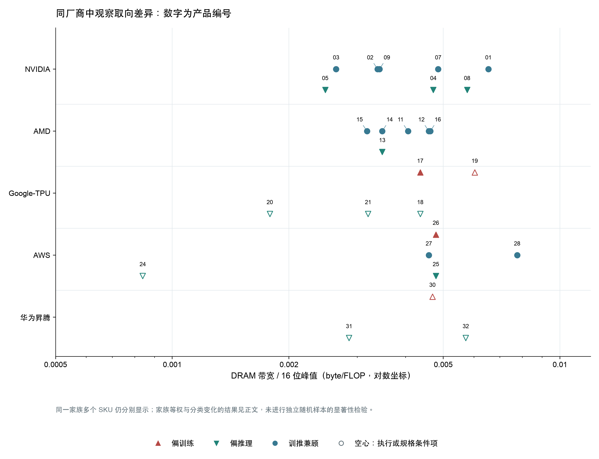

下表只作描述性敏感性检查，不把这批有选择的产品当作随机独立样本。第一、二行检查计算条件的影响；第三行将 TPU v5e、Trillium、Ironwood 和 H200 NVL 改归训推兼顾，将 Trainium2/3 按早期发布表述列偏训练，并将 H100 PCIe 改归偏推理；第四行先在同一家族、同一取向内取中位数，再汇总，降低型号数量不均的影响。

| 数据选择 | 偏训练：产品/家族数；B/P；C/P | 偏推理：产品/家族数；B/P；C/P | 训推兼顾：产品/家族数；B/P；C/P |
|---|---|---|---|
| 全部可配对规格（含条件项） | 4/4；0.004736；0.1559 | 11/9；0.003478；0.1252 | 12/8；0.004321；0.1339 |
| 仅明确矩阵 dense 或有依据换算 | 2/2；0.004572；0.1558 | 5/4；0.004713；0.1688 | 12/8；0.004321；0.1339 |
| 采用有来源的替代分类 | 6/6；0.004736；0.1749 | 8/6；0.003168；0.1297 | 13/9；0.004054；0.1144 |
| 先按家族及取向取中位数 | 4/4；0.004736；0.1559 | 11/9；0.003478；0.1342 | 12/8；0.004455；0.1415 |

B/P 使用 byte/FLOP，C/P 使用 GB/(TFLOP/s)，表内为各方案的中位数。家族归组及派生过程保存在绘图脚本中。只保留明确矩阵口径后，偏训练组仅剩 TPU v4 与 Trainium1 两个家族。改变分类不能补足缺失的同代对照，因此这里不做显著性或因果判断。

当前数据不支持“偏推理产品普遍拥有更高 DRAM 带宽／算力”的统一规律。AWS 的 Trainium1 与 Inferentia2 在所选同口径计算和 HBM 配置上重合；同为推理卡的 Atlas 两容量版本则有不同 B/P。NVIDIA、AMD 的多个参照产品同时面向训推，不能把它们全部当成训练组。图中仍能看到局部资源倾斜，但其含义要回到下一节的家族内官方说明。

绝对规模也没有给出单一用途分界。偏训练组已确认的 DRAM 带宽跨 0.880 至 6.528 TB/s，偏推理组跨 0.0537 至 8.601 TB/s，范围明显交叉；大规模资源还集中在多款训推兼顾的 GPU。BF16、FP8 和 FP4 均在不同取向中出现，格式可用性与低精度吞吐倍率须分别读取。设备互联方面，AWS 的接口数量对照与 TPU 8 的等端点带宽、异拓扑对照也指向不同的分化方式，尚不能得到跨家族统一的 D/P 阈值。

功率与 P/W 的用途比较则主要受证据覆盖限制：偏训练组目前只有 Ascend 910 的芯片 TDP 可以画入，而偏推理组可画的多数是整板功率；兼顾组又以模组为主。云端芯片缺少同边界额定值，不能把这份功率分布解释成训练与推理设计的一般差异。主机接口、稀疏机制和存储组织的补充表用于说明实现条件，公开接口上限或支持状态尚不足以推导实际吞吐。

C/P 与 B/P 也不是独立的多份证据：C/P = (C/B) × (B/P)。部分比值升高是分母计算峰值降低，部分来自内存增容，只有同时查看绝对资源与机制，才能区分这些原因。产品分类依据与数值证据在最后一节逐项列出。

## 9. 家族内定位、资源与机制

家族内比较显示，产品分化发生的位置并不固定。TPU 8 的差异涉及局部存储、专用计算与互联拓扑；Trainium1／Inferentia2 主要在共同核心之外调整连接；H100、H200 和 MI350 的多个配置还受到板卡形态、供电与冷却约束。比较时既要保留不同点，也要明确共同实现，否则容易把整个架构的能力写成某款产品独有的设计。

训练／推理取向与更高 B/P 之间没有在这些案例中形成稳定对应。H100 NVL、H200 NVL 的单位算力外存供给高于各自 SXM，但两组属于同一 Hopper 家族，不能计作两份独立架构证据；TPU 8i 在有精度标签分歧的条件下呈相似方向。TPU v5p 相对 v5e 的方向相反，Trainium1／Inferentia2 和 MI350P／MI350X 则分别近似相同。以下各节给出这些观察的数字、条件与官方解释。

跨代案例用于辨认其他影响因素：核心没有明显改变时，内存升级仍能改变存算配比；核心与内存同时升级时，还要检查实际增长是否同步。它们不作为新的训练／推理分化证据。同一产品在多个案例出现时也只计作一个产品观察。

| 对照类型 | 产品组 | 重点问题 |
|---|---|---|
| 官方负载目标对照 | [TPU 8t／8i](#family-a01) | 训练供给与 decoding 状态、同步开销分别怎样处理 |
| 官方负载目标对照 | [Ascend 950PR／950DT](#family-a02) | prefill 侧重与训练、decode 覆盖怎样对应内存方案；哪些计算档位尚未绑定 |
| 官方负载目标对照 | [Trainium1／Inferentia2](#family-a03) | 相同核心和本地存储之外，连接配置怎样不同 |
| 同代定位与规模 | [TPU v5e／v5p](#family-a04) | 每核工作存储、整芯片资源与扩展目标怎样分别变化 |
| 同架构部署配置 | [H100 SXM／PCIe／NVL](#family-a05) | 使能资源、HBM 与 GPU 连接如何适应不同服务器 |
| 同架构资源档位 | [MI350P／MI350X／MI355X](#family-a06) | 资源缩放与运行频率、冷却预算分别贡献什么 |
| 同架构部署配置 | [H200 SXM／NVL](#family-a07) | 相同容量与近似带宽怎样搭配不同计算及连接域 |
| 同架构用途侧重 | [L4／L40S](#family-a08) | 矩阵、图形与媒体资源是否同比增长 |
| 同用途容量配置 | [Atlas 300I A2 32GB／64GB](#family-a09) | 同为推理卡时，内存档位产生多大的组内跨度 |
| 跨代辅助案例 | [H100→H200](#family-a10) | 沿 SXM、NVL 两分支辨认内存升级 |
| 跨代辅助案例 | [MI300X→MI325X](#family-a11) | CDNA 3 核心延续时的内存变化 |
| 跨代辅助案例 | [Trainium2→Trainium3](#family-a12) | 核心、局部存储、HBM 与互联是否同步升级 |

### 9.1 TPU 8t / 8i：训练的数据供给与推理的状态、同步开销

Google 将 TPU 8t 的首要目标设为大规模 pretraining（预训练）与 embedding 密集负载，将 8i 的目标设为 post-training（后训练）、sampling（采样）和高并发 reasoning（推理）。两者均支持完整 AI 生命周期，因此适合按主要设计取向分组，不能解释成排他的训练或推理能力。官方对差异的解释相当具体：8t 要让矩阵计算持续得到数据，8i 要减少 autoregressive decoding（逐 token 生成）中保存状态、归约和同步造成的等待。[Google 技术详解，Specialized by design、The pre-training powerhouse、The sampling and serving specialist](../产品详解/Google-TPU/Google_TPU_8t_one_chip_产品详解.md#ref-1)

同一技术文章给出的资源配置如下。Vmem 是靠近向量执行单元的局部工作存储，不能与其他架构的透明 L2 cache 直接等同；表中的 HBM 为封装内高带宽主存，ICI 为芯片间互联。

| 整芯片资源或实现 | TPU 8t | TPU 8i | 比较意义与来源 |
|---|---:|---:|---|
| Vmem 容量 | 128 MB | 384 MB | 8i 为 3 倍；保留产品表的 MB 单位。[技术详解，On-Chip SRAM](../产品详解/Google-TPU/Google_TPU_8t_one_chip_产品详解.md#ref-1) |
| HBM3E 容量 | 216 GB | 288 GB | 8i 为 1.333 倍。[技术详解，HBM Capacity、Figures 1/4](../产品详解/Google-TPU/Google_TPU_8t_one_chip_产品详解.md#ref-1) |
| HBM 带宽 | 6,528 GB/s | 8,601 GB/s | 8i 为 1.318 倍；持续有效带宽未给出。[技术详解，HBM Bandwidth](../产品详解/Google-TPU/Google_TPU_8t_one_chip_产品详解.md#ref-1) |
| FP4 公布峰值 | 12.6 PFLOPS | 10.1 PFLOPS | 8i 为 0.802 倍；仅采用同一技术表，精度标签冲突见下文。[技术详解，Peak FP4 PFLOPs](../产品详解/Google-TPU/Google_TPU_8t_one_chip_产品详解.md#ref-1) |
| ICI 双向端点带宽 | 19.2 Tb/s | 19.2 Tb/s | 两款相同；各为 2,400 GB/s，未规定有效载荷条件。[8t 发布规格图，Bidirectional scale-up bandwidth](../产品详解/Google-TPU/Google_TPU_8t_one_chip_产品详解.md#ref-2)、[8i 同项](../产品详解/Google-TPU/Google_TPU_8i_one_chip_产品详解.md#ref-2) |
| 专用机制与系统互联 | SparseCore、LLM Decoder Engine；3D torus | CAE；Boardfly | 专用计算逻辑与芯片外拓扑分别比较。[技术详解，Specialized Chip Features、Network Topology](../产品详解/Google-TPU/Google_TPU_8t_one_chip_产品详解.md#ref-1) |

8i 的存储资源增加，而该表的矩阵峰值较低。按表内 FP4 条件计算，8i 的 HBM 带宽／算力为 8t 的 1.644 倍，既包含带宽增加，也包含峰值分母下降。这支持“8i 在此配置中给每单位公布算力配了更多存储资源”的描述，无法单独证明模型吞吐或每 token 延迟的改善。尤其是 8i 的官方发布图将 Pod 峰值标成 FP8，技术详解却使用 FP4，原资料未解释冲突；这个比值应保留为条件分析，不能转写成无歧义的 FP8、BF16 或全行业结论。JAX 静态开发模型中的运算速率也不用于重定标这两条产品峰值。[技术详解，at a glance](../产品详解/Google-TPU/Google_TPU_8t_one_chip_产品详解.md#ref-1)、[8i 发布规格图，FP8 Eflops per pod](../产品详解/Google-TPU/Google_TPU_8i_one_chip_产品详解.md#ref-4)

官方将 8i 的较大 Vmem 与长上下文 decoding 保存更多 KV Cache 联系起来；KV Cache 是此前 token 的 key/value 状态，占用随模型、上下文和并发量变化。其可用容量还受局部分区影响：JAX 对 8t 给单 TensorCore 128 MiB VMEM，对 8i 给每 TensorCore 192 MiB、共两个核心。两核容量相加不能说明一个核心可用全部空间，MiB 也不能与产品表的 MB 静默互换。Pallas 的编程模型由程序指定分块、编译器安排 HBM 搬运，进一步说明 Vmem 容量应结合工作区和调度方式理解。对 8t，官方更强调 VPU（向量处理单元）与 MXU（矩阵乘法单元）的配比，使 quantization、softmax、layer normalization 与矩阵乘重叠；SparseCore 则处理 embedding 的不规则访问，并卸载 data-dependent all-gather。它们改善的是矩阵计算前后的供给过程，不能仅由 Vmem 大小排序判断。[技术详解，Large on-chip SRAM、VPU/MXU overlap、The SparseCore advantage](../产品详解/Google-TPU/Google_TPU_8t_one_chip_产品详解.md#ref-1)、[JAX，TPU_8T/TPU_8I 分支与物理核心计数](../产品详解/Google-TPU/Google_TPU_8i_one_chip_产品详解.md#ref-21)、[Pallas，BlockSpecs and grid iteration](../产品详解/Google-TPU/Google_TPU_8i_one_chip_产品详解.md#ref-22)

8i 还在独立 chiplet 上配置 CAE（集合操作加速引擎），聚合芯片内两个 TensorCore 的结果，针对 decoding 的 reduction 与 synchronization。官方“片上 collective 延迟降低 5 倍”的声明缺少消息大小和完整基线，不能写成跨设备 all-reduce 或整模型加速。芯片外的 Boardfly 解决另一段等待：同为上述 ICI 端点带宽，8i 改用分层高连接度网络，8t 使用 3D torus 并面向更大训练域。官方用一个 1,024 节点 torus 的最长 16 hop 与 Boardfly 的 7 hop 作解释；这是示例网络的路径比较，并非 8t 完整 Superpod 的实测对照。文章还存在 Boardfly 四芯片 ring／fully connected、1,152 个位置／1,024 active chips 的表述差异，限制了精确复建。8t 则另有 TPUDirect RDMA/Storage 的主机旁路路径，发布图给出 400 Gb/s per chip 的 scale-out 网络配置；这部分属于系统供给，8i 未披露同口径值，不能补零。两款产品在存储、片内同步、芯片间拓扑和主机供给上分别调整，现有证据不足以把任何一项变化单独归因为模型性能提升。[技术详解，CAE、Boardfly ICI topology、Deep dive: The Boardfly vs. torus math、Faster storage access](../产品详解/Google-TPU/Google_TPU_8t_one_chip_产品详解.md#ref-1)、[8t 发布规格图，Scale-out networking bandwidth](../产品详解/Google-TPU/Google_TPU_8t_one_chip_产品详解.md#ref-2)

### 9.2 Ascend 950PR／950DT：共同核心下的内存选择

Ascend 950PR 的官方目标是推荐、大模型 prefill（输入上下文计算阶段）与多模态推理；950DT 则覆盖预训练、后训练及推理，明确包含 prefill 和 decode（逐步生成输出）。这组比较体现的是推理中的特定负载与全流程用途之间的选择。白皮书把不同内存配置作为两者共架构设计中的分化手段，同时保留相同的第三代 DaVinci 基本组织：两个 AI Die、两个 IO Die，每个 AI 子系统含一个 Cube 矩阵核和两个 Vector 向量核。PR 合封八个高速内存模块，DT 合封四个；模块数不代表内存容量高低，也不等于 DRAM 内部裸片层数。[架构白皮书，PDF pp.10、12-13／正文 pp.6、8-9](../产品详解/华为昇腾/华为_Ascend950PR.md#ref-1)

| 比较位置 | 950PR | 950DT | 对比时应保留的条件 |
|---|---|---|---|
| Cube／Vector 使能数 | 32／64 或 28／56 | 36／72、32／64 或 28／56 | 完整设计的 36 个 AI 子系统不等于每种配置的使能数 |
| 共同的 32-Cube 计算档位 | Cube FP16/BF16 为 432 TFLOPS；Vector 为 54 TFLOPS | 同左 | 486 TFLOPS 是 Cube+Vector 聚合值，不能作纯矩阵分母 |
| 同档低精度 Cube 峰值 | FP8、MXFP8、HiF8 为 865 TFLOPS；MXFP4 为 1730 TFLOPS | 同左 | 编码不同；未公开完整累加及稀疏条件 |
| 每 AI 子系统局部存储 | L1 512 KB；L0A/B 各 64 KB；L0C 256 KB；两个 Vector 各有 256 KB Unified Buffer | 同左 | 资源用途不同，不合并成一个共享 cache |
| 全局 L2 | 128／112 MB | 128 MB | 共同支持 512 B line、128 B sector；各档位与计算配置未完整绑定 |
| 官方明确并列的主推内存组合 | 128 GB、1.6 TB/s | 144 GB、4 TB/s | 可比较容量和带宽，不与任意计算档位拼成唯一 SKU |
| 设备通信接口 | 18 个 ×4 UB 端口，2016 GB/s 双向原始速率 | 同左 | UBoE、PCIe 共用部分端口，最大带宽不能相加 |
| 图像预处理与编解码 | VPC 4／2、JPEGD 8、JPEGE 4／2 | 同左 | PR 的多模态定位不意味着这些单元只在 PR 存在 |

表中规格来自[白皮书表3-1、图4-1、表4-2，PDF pp.13-15、17、25／正文 pp.9-11、13、21](../产品详解/华为昇腾/华为_Ascend950PR.md#ref-1)。两边共同的 32-Cube 档位具有相同计算规格；DT 额外提供 36-Cube 档位，但表中没有完整料号把计算、CPU、L2 和内存档位逐一绑定。因此不能把 PR 的最大计算、最大内存与 DT 的最大计算、最大内存分别拼成两个确定配置，再据此推导存算比。局部缓冲及低精度路径属于两者共享的基础，不能独立证明 PR 更面向推理。

内存差异可以直接比较。以白皮书同时列出的 128 GB／1.6 TB/s 和 144 GB／4 TB/s 两个组合为准，DT 的容量为 PR 的 1.125 倍，带宽为 2.5 倍。容量除以带宽得到 80 ms 和 36 ms，描述的是按标称带宽顺序流过全部容量一次的理想时间，不是随机访问延迟或模型请求延迟。[配置来源：白皮书，PDF p.10／正文 p.6；比值为据此计算](../产品详解/华为昇腾/华为_Ascend950DT.md#ref-1) 这一事实支持“DT 在内存吞吐上投入更多”的判断，却不支持“推理产品都应有更高带宽”的概括：PR 本身也是推理产品，目标中又有计算量和数据复用都较高的 prefill。是否形成性能收益，仍取决于具体算子的 DRAM 流量、复用和并行度。

L2 管理与调度提供了比容量更细的观察维度。两者的 L2 都采用多 bank 分布式组织，每个 bank 支持同时读写；跨 die 一致性由硬件维护，但保留局部亲和性。STARS2.0 可将资源划为最多八个 Group，按 die 调度以利用这种局部性，并通过独立于数据 NoC 的 HSCB 控制总线调度计算。NDDMA 以硬件地址生成和缓存聚合执行多维搬运；Cube 与 Vector 的直接通路则减少中间结果经过 L2 的交换。这些共同机制说明，外存带宽相同也不保证算子的实际搬运量相同；它们没有提供可用于比较的 L2 总带宽，不能用 1.6 或 4 TB/s 代替。[白皮书，PDF pp.22-23、26-28／正文 pp.18-19、22-24](../产品详解/华为昇腾/华为_Ascend950PR.md#ref-1)

通信也应作为共同能力理解。UB（Unified Bus，设备互联总线）支持异步 URMA、同步远程内存访问和 CCU 集合通信卸载；它与核内同样缩写为 UB 的 Unified Buffer 是不同资源。UBoE 提供两路 400 Gb/s 以太网接入，PCIe 5.0 ×16 提供主机连接，但二者分别与 UB 共用两个、四个端口。每个 IO Die 内的端口转发不经过计算 die 和 DRAM；面向超节点，UB 还可直接连接 CPU 内存池与存储资源池。这些机制扩展了设备可访问的资源范围，既不能计入封装 DRAM 容量，也没有证明自动迁移或远端全局缓存一致性。[白皮书，PDF pp.15、30-38／正文 pp.11、26-34](../产品详解/华为昇腾/华为_Ascend950DT.md#ref-1) 两款产品保留相同的通信规格，表明本组最明确的分化发生在内存方案与使能档位，而公开资料尚未显示另一套仅供 PR 或 DT 使用的 Cube、局部缓冲或通信核心。

### 9.3 Trainium1 / Inferentia2：共同计算核心与不同连接配置

AWS 对两款产品的目标描述不同：Trn1 面向生成式模型训练，Inf2 面向生成式模型推理。芯片文档进一步将 Trainium 的 NeuronLink 用于训练扩展与内存池，将 Inferentia2 的 NeuronLink 用于集合通信，以兼顾推理延迟和吞吐。因此，产品定位的依据来自官方负载目标；名称不同不意味着内部使用不同的计算核心。[Trn1 产品页，Why Amazon EC2 Trn1 Instances?](../产品详解/AWS/AWS_Trainium1_one_chip_产品详解.md#ref-5) [Inf2 产品页，Why Amazon EC2 Inf2 Instances?](../产品详解/AWS/AWS_Inferentia2_one_chip_产品详解.md#ref-5) [Trainium 芯片文档，NeuronLink](../产品详解/AWS/AWS_Trainium1_one_chip_产品详解.md#ref-1) [Inferentia2 芯片文档，NeuronLink](../产品详解/AWS/AWS_Inferentia2_one_chip_产品详解.md#ref-1)

官方 NKI（Neuron Kernel Interface，底层 kernel 编程接口）指南用同一份微架构说明覆盖两者。两款芯片均有两个 NeuronCore-v2，以下主要资源相同；能够直接确认的芯片级数量差异是 NeuronLink 接口由四组变成两组。[NKI 指南，device overview 与 NeuronCore-v2 Compute Engines](../产品详解/AWS/AWS_Trainium1_one_chip_产品详解.md#ref-2)

| 比较维度 | Trainium1 | Inferentia2 | 口径与依据 |
|---|---|---|---|
| 计算核心与引擎 | 2 个 NCv2；每核 Tensor、Vector、Scalar、GpSimd | 相同 | 四类引擎分别负责矩阵、向量归约、逐元素／非线性和可编程算子。[NKI，Compute Engines](../产品详解/AWS/AWS_Trainium1_one_chip_产品详解.md#ref-2) |
| 纯 Tensor 峰值 | FP16/BF16/TF32/cFP8：184 TFLOPS；FP32：46 TFLOPS | 相同 | 每核 92／23 乘两核的资源加总，采用原报取整数；芯片宣传值另列 190／47.5。[NKI，Tensor Engine: Data Types](../产品详解/AWS/AWS_Trainium1_one_chip_产品详解.md#ref-2) [芯片表，Compute](../产品详解/AWS/AWS_Trainium1_one_chip_产品详解.md#ref-1) |
| 本地 HBM | 2 stack，32 GiB；820 GiB/s | 相同 | 采用各自芯片技术页的容量与带宽分支。[Trainium，Device Memory](../产品详解/AWS/AWS_Trainium1_one_chip_产品详解.md#ref-1) [Inferentia2，Device Memory](../产品详解/AWS/AWS_Inferentia2_one_chip_产品详解.md#ref-1) |
| 每核工作与累加存储 | 24 MiB SBUF + 2 MiB PSUM | 相同 | SBUF 为软件管理暂存区，PSUM 保存矩阵部分和；两核各有局部空间。[NKI，Compute Engines、memory hierarchy](../产品详解/AWS/AWS_Trainium1_one_chip_产品详解.md#ref-2) |
| 数据搬运与通信单元 | 32 个 DMA；6 个 CC-Core | 相同 | DMA 为直接内存搬运引擎；CC-Core 负责集合通信，未披露单核通信吞吐。[NKI，device overview](../产品详解/AWS/AWS_Trainium1_one_chip_产品详解.md#ref-2) |
| NeuronLink-v2 接口 | 4 组 | 2 组 | 比较接口数量；不足以推导实际通信性能比。[NKI，device overview](../产品详解/AWS/AWS_Trainium1_one_chip_产品详解.md#ref-2) |

两者都支持 cFP8，而且其 Tensor 峰值与 FP16/BF16 相同。仅凭支持 8 位格式，无法将这组中的训练产品与推理产品分开，也不能把格式字长减半写成矩阵吞吐翻倍。按表中 184 TFLOPS、32 GiB 与 820 GiB/s 计算，两者的 DRAM 带宽／算力都约为 0.004785 Byte/FLOP，容量／算力都约为 0.1867 GB/TFLOPS。NKI 另写 820 GB/s；采用该分支会同时改变两款产品的带宽比值，但不会产生组内差异。190 TFLOPS 的芯片宣传值与 2×92 的 Tensor 加总值，官方没有解释计数差别，不能据此自行拆出其他引擎的贡献。[NKI，device overview、Tensor Engine: Data Types](../产品详解/AWS/AWS_Trainium1_one_chip_产品详解.md#ref-2) [Trainium 芯片表，Compute、Device Memory；比值按原值计算](../产品详解/AWS/AWS_Trainium1_one_chip_产品详解.md#ref-1)

共同点还包括影响利用率的执行约束。每个引擎有独立指令流，但 Vector 与 GpSimd 访问 SBUF 时、Vector 与 Scalar 访问 PSUM 时必须串行化。PSUM 每个 partition 有八个 bank，允许最多八组矩阵累加工作并存，使下一组矩阵运算可以与前一组结果处理重叠。TensorEngine 还可用 background LoadStationary，在当前矩阵计算期间预装下一块固定输入。它们解释了同一计算核心如何通过布局和调度减少等待，但没有证据表明这些机制只属于训练或只属于推理。共享机制与相同标称资源也不足以证明两类实例在任意 kernel 上都有相同实测利用率。[NKI，Data Movement、Near-memory accumulation in PSUM、Tensor Engine: Performance Consideration](../产品详解/AWS/AWS_Trainium1_one_chip_产品详解.md#ref-2)

连接差异需要连同系统用途解释。Trn1/Trn1n 的十六芯片实例采用 2D torus，官方明确支持经 NeuronLink 直接寻址池化设备内存；Inf2 文档则强调用 AllReduce、AllGather 等集合操作跨芯片分片模型，例如 Tensor Parallelism（张量并行）。后者的叙述不足以证明与 Trn1 具有完全相同的远端内存访问语义。Trainium 的跨代规格表写 384 GB/s/chip，Inf2 系统表写 192 GiB/s/chip，两者带宽方向未说明，且单位不同；不能由此或由 4∶2 接口数认定训练通信快两倍。该组提供的证据是：明确的训练／推理取向可以共用计算和本地存储资源，并在连接配置及部署方式上分化；它不支持“推理芯片必然有更高 DRAM 存算比”的普遍判断。[Trn1/Trn1n Architecture，拓扑与 memory pooling](../产品详解/AWS/AWS_Trainium1_one_chip_产品详解.md#ref-4) [Inf2 Architecture，实例表与 Tensor Parallelism](../产品详解/AWS/AWS_Inferentia2_one_chip_产品详解.md#ref-4) [Trainium2 Architecture，Interconnect comparison table](../产品详解/AWS/AWS_Trainium1_one_chip_产品详解.md#ref-8)

### 9.4 TPU v5e / v5p：成本效率与大规模训练的不同资源配置

Google 将 v5e 定义为兼顾训练与推理的产品，将 v5p 的重点放在大型模型训练、性能和扩展规模上。v5e 甚至在同一芯片上区分云资源的供应方式：training 配置优先吞吐和可用性，serving 配置优先时延。因此，本组比较的是同代产品的设计取向与部署规模，不能把 v5e 的所有特征归为“只服务推理”。官方 JAX 架构教程称 v5e 为 inference-optimized，反映其设计侧重；这与 Cloud 明确支持两种用途应分别记录。[v5e 文档，Configurations](../产品详解/Google-TPU/Google_Cloud_TPU_v5e_one_chip_产品详解.md#ref-1)；[v5p 发布文，Inside Cloud TPU v5p](../产品详解/Google-TPU/Google_Cloud_TPU_v5p_one_chip_产品详解.md#ref-4)；[JAX 教程，What Is a TPU?](../产品详解/Google-TPU/Google_Cloud_TPU_v5e_one_chip_产品详解.md#ref-20)

| 层级与资源 | TPU v5e | TPU v5p | 同口径观察与来源 |
|---|---|---|---|
| 单核矩阵结构 | 4 个 128×128 MXU | 4 个 128×128 MXU | 每 TensorCore 的矩阵阵列数量和大小相同；[JAX，TPU_V5E / TPU_V5P 分支](../产品详解/Google-TPU/Google_Cloud_TPU_v5p_one_chip_产品详解.md#ref-21) |
| 整芯片核心与 BF16 峰值 | 1 TensorCore，197 TFLOPS | 2 TensorCore，459 TFLOPS | 核数 2 倍，峰值约 2.33 倍；不能把其余差额全部解释为阵列结构变化；[v5e 规格](../产品详解/Google-TPU/Google_Cloud_TPU_v5e_one_chip_产品详解.md#ref-1)、[v5p 规格](../产品详解/Google-TPU/Google_Cloud_TPU_v5p_one_chip_产品详解.md#ref-1) |
| 每核 / 整芯片 VMEM | 128 / 128 MiB | 64 / 128 MiB | 整芯片总量相同，每核局部工作集不同；[JAX，TPU_V5E / TPU_V5P 分支](../产品详解/Google-TPU/Google_Cloud_TPU_v5p_one_chip_产品详解.md#ref-21) |
| Cloud 主存容量 / 带宽 | 16 GB / 800 GiB/s | 95 GiB / 2,765 GB/s | 换算后容量约 6.38 倍、带宽约 3.22 倍；两型号 System architecture，沿用第一层选值 |
| ICI 双向端点 / 系统拓扑 | 400 GB/s，4 端口，2D torus | 1,200 GB/s，6 link，3D torus | 端点为 3 倍；小 slice 的回环条件须另查；两型号 System architecture |
| SparseCore | 未找到公开配置 | 4 个，每个 16 tile | v5e 缺项不填零；[v5p 文档](../产品详解/Google-TPU/Google_Cloud_TPU_v5p_one_chip_产品详解.md#ref-1)，[JAX 分支与输入边界](../产品详解/Google-TPU/Google_Cloud_TPU_v5e_one_chip_产品详解.md#ref-21) |
| 最大单 slice 训练配置 | 256 chips | 6,144 chips | 系统配置上限，不是单芯片资源；[v5e Configurations](../产品详解/Google-TPU/Google_Cloud_TPU_v5e_one_chip_产品详解.md#ref-1)，[v5p Configurations](../产品详解/Google-TPU/Google_Cloud_TPU_v5p_one_chip_产品详解.md#ref-1) |

v5p 的外存增长快于算力增长：按表中 Cloud 数值换算，其 HBM 带宽/算力约为 v5e 的 1.38 倍，容量/算力约为 2.74 倍；偏大规模训练的产品也会配置更多单位算力的外存供给。VMEM 则呈现相反的局部关系：v5e 单核能使用 128 MiB，v5p 每核只有 64 MiB，两核合计才达到相同容量。VMEM 是编译器管理的工作存储，容量与每核任务划分会影响哪些分块能留在片上；这里不能换用透明 L2 cache 的命中率解释。v5p 支持 Megacore，将两物理核抽象为一个逻辑 device，但并不把每核 VMEM 变为单核可任意支配的 128 MiB 池。上述容量影响是架构推断，实际收益仍取决于算子布局、寄存器溢出和软件划分。[JAX，TPU_V5E / TPU_V5P、supports_megacore](../产品详解/Google-TPU/Google_Cloud_TPU_v5p_one_chip_产品详解.md#ref-21)；[Pallas，Array Layouts / Multicore TPU configurations](../产品详解/Google-TPU/Google_Cloud_TPU_v5p_one_chip_产品详解.md#ref-22)

v5p 还有独立于矩阵峰值的 SparseCore 路径，用于 embedding、scatter/gather 和部分集合通信。其每 tile 512 KiB 局部 VMEM、每 SC 16 tile，与共享 SPMEM 是不同空间；不能用跨代论文介绍通用 SparseCore 的 2.5 MiB 数值覆盖型号专属配置。DMA 的 32 B 最小传输粒度与 gather/scatter 原生 32-bit 数据访问，也说明这种专用路径有自己的搬运条件。另一边，v5e 未披露对应配置，只能保留缺口。低精度同样需要区分路径：v5p 的 459 TFLOPS FP8 被 Google 标为 emulated，不能仅凭格式名就认为相对 BF16 获得了两倍矩阵吞吐。[JAX，TPU_V5P 分支](../产品详解/Google-TPU/Google_Cloud_TPU_v5p_one_chip_产品详解.md#ref-21)；[Pallas，Hardware overview / Gathering and scattering 16-bit dtypes](../产品详解/Google-TPU/Google_Cloud_TPU_v5p_one_chip_产品详解.md#ref-23)；[Google Ironwood 发布文，Figure 2 图注](../产品详解/Google-TPU/Google_Cloud_TPU_v5p_one_chip_产品详解.md#ref-24)

扩展能力还取决于端点之外的组织。v5p 的 4×4×4 及更大 slice 具备完整三维回环，并可借助光电路交换和 ICI resiliency 绕过部分系统故障；符合条件的 slice 还能改用 twisted torus。官方给出 4×4×8 拓扑的理论二分带宽增加约 70%，但单芯片端点仍是 1,200 GB/s，模型收益随并行策略变化。v5e 的小 slice 则不能默认使用完整二维回环。这些差异支持“v5p 更重视大规模任务的通信组织与可用性”，尚不足以将每项差异单独归因于训练：两者还有资源规模、云端供应策略和成本目标的共同影响。[v5p 文档，Twisted torus topologies / Cloud TPU ICI resiliency](../产品详解/Google-TPU/Google_Cloud_TPU_v5p_one_chip_产品详解.md#ref-1)；[JAX 教程，ICI table 注释 / Worked Problems, Question 5](../产品详解/Google-TPU/Google_Cloud_TPU_v5e_one_chip_产品详解.md#ref-20)

### 9.5 H100 SXM／PCIe／NVL：相同核心下的内存与部署取舍

NVIDIA 对三款 H100 的区分包含两类目标。Hopper 白皮书把 SXM5 放在单服务器和跨服务器的多 GPU 扩展场景，把标准 PCIe 80GB 放在功率预算较低的标准机架，特别指出一次使用 1 或 2 个 GPU 的推理及部分 HPC 应用；两者均保留广泛的 AI/HPC 用途。H100 NVL 的型号简报则明确以 LLM inference 为主要优化目标，并强调接近 4 TB/s 的单卡内存带宽。NVL 仍采用 PCIe 插卡形态；型号名里的“PCIe”在下表专指 80GB 版本。[Hopper 白皮书 p.15](../产品详解/NVIDIA/NVIDIA_H100_SXM5_80GB.md#ref-1)，[NVL 产品简报 p.1](../产品详解/NVIDIA/NVIDIA_H100_NVL_94GB.md#ref-1)

| 单 GPU／单模组或卡的比较项 | H100 SXM5 80GB | H100 PCIe 80GB | H100 NVL 94GB | 来源和条件 |
|---|---:|---:|---:|---|
| 实际使能 SM（流式多处理器） | 132 | 114 | 未公开 | [白皮书 pp.18,39](../产品详解/NVIDIA/NVIDIA_H100_SXM5_80GB.md#ref-1)；NVL 不借用相邻型号 |
| FP16/BF16 矩阵 dense 峰值 | 989.4 TFLOP/s | 756 TFLOP/s | 835.5 TFLOP/s，推导 | [白皮书 Table 3](../产品详解/NVIDIA/NVIDIA_H100_SXM5_80GB.md#ref-1)；NVL 为[数据手册 p.2](../产品详解/NVIDIA/NVIDIA_H100_NVL_94GB.md#ref-2)的 1,671 稀疏峰值按明确的 2 倍条件折半，含原值舍入 |
| L2 容量 | 50 MB | 50 MB | 未公开 | [白皮书 pp.18,40](../产品详解/NVIDIA/NVIDIA_H100_SXM5_80GB.md#ref-1)；完整 GH100 的 60 MB 不回填到 NVL |
| HBM 类型、容量 | HBM3，80 GB | HBM2e，80 GB | HBM3，94 GB | [白皮书 p.18](../产品详解/NVIDIA/NVIDIA_H100_SXM5_80GB.md#ref-1)，[NVL 简报 p.4](../产品详解/NVIDIA/NVIDIA_H100_NVL_94GB.md#ref-1) |
| HBM 标称带宽 | 3.35 TB/s | 2.000 TB/s | 3.938 TB/s | [SXM 数据手册 p.2](../产品详解/NVIDIA/NVIDIA_H100_SXM5_80GB.md#ref-2)，[PCIe 简报 p.4](../产品详解/NVIDIA/NVIDIA_H100_PCIe_80GB.md#ref-2)，[NVL 简报 p.4](../产品详解/NVIDIA/NVIDIA_H100_NVL_94GB.md#ref-1) |
| NVLink 端点收发合计 | 900 GB/s | 600 GB/s，有来源冲突 | 600 GB/s | [白皮书 pp.15,47](../产品详解/NVIDIA/NVIDIA_H100_SXM5_80GB.md#ref-1)，[PCIe 简报 pp.1,8-9](../产品详解/NVIDIA/NVIDIA_H100_PCIe_80GB.md#ref-2)，[NVL 简报 pp.9-10](../产品详解/NVIDIA/NVIDIA_H100_NVL_94GB.md#ref-1) |
| 功率规格 | 模组最高 TDP 700 W | 最大板卡功率 350 W | 最大板卡功率 400 W | [SXM 数据手册 p.2](../产品详解/NVIDIA/NVIDIA_H100_SXM5_80GB.md#ref-2)，[PCIe 简报 p.3](../产品详解/NVIDIA/NVIDIA_H100_PCIe_80GB.md#ref-2)，[NVL 简报 p.3](../产品详解/NVIDIA/NVIDIA_H100_NVL_94GB.md#ref-1)；对象边界不同，均非实测耗电 |
| MIG 上限及该表所列实例容量 | 最多 7 个，10 GB/实例 | 最多 7 个，简报未列单实例容量 | 最多 7 个，12 GB/实例 | [数据手册 p.2](../产品详解/NVIDIA/NVIDIA_H100_NVL_94GB.md#ref-2)，[PCIe 简报 p.4](../产品详解/NVIDIA/NVIDIA_H100_PCIe_80GB.md#ref-2) |

SXM 与标准 PCIe 的计算差距可以进一步拆开。两者每 SM 都有四个 Tensor Core，局部 L1/shared memory 的组合容量均为 256 KB，shared memory 上限均为 228 KB；SXM 的 SM 数约多 15.8%，用于低精度 Tensor 峰值计算的时钟为 1,830 MHz，PCIe 为 1,620 MHz，约高 13.0%。两项相乘约解释 30.9% 的 16 位峰值差距，余下小差别处在公开规格舍入范围。两者的 L2 却同为 50 MB，HBM 容量也同为 80 GB，只有 HBM 类型和带宽改变。因此，按算力归一后 PCIe 的 L2 容量和 HBM 容量都较高，但 HBM 带宽/算力只有 SXM 的约 0.781 倍；“资源较少”并不意味着所有资源配比同方向变化。[白皮书 pp.18,27,39-40](../产品详解/NVIDIA/NVIDIA_H100_SXM5_80GB.md#ref-1)，[PCIe 简报 p.4](../产品详解/NVIDIA/NVIDIA_H100_PCIe_80GB.md#ref-2)

NVL 相对 SXM 呈现另一种变化：所选 16 位峰值约为 0.844 倍，HBM 容量和带宽却都约为 1.175 倍，使容量/算力和带宽/算力均提高约 39%。这与官方明确的 LLM 推理目标相符，可解释为较大的模型常驻空间，以及更充足的单位计算外存供给。它仍不足以证明任意 decode workload 的加速比；batch、KV Cache、量化格式和内存访问复用都会改变瓶颈。三者共有的 FP8、Transformer Engine、TMA（张量内存搬运器）和 Thread Block Cluster（线程块簇）不能列成 NVL 独有的推理机制，NVL 未公开的 SM/L2 数也应继续留空。[NVL 简报 pp.1,3-5](../产品详解/NVIDIA/NVIDIA_H100_NVL_94GB.md#ref-1)，[数据手册 p.2](../产品详解/NVIDIA/NVIDIA_H100_NVL_94GB.md#ref-2)，[Hopper 白皮书 pp.22-24,29-35](../产品详解/NVIDIA/NVIDIA_H100_SXM5_80GB.md#ref-1)

互联和分区方式决定这些资源怎样供作业使用。SXM 可接入 HGX 的四 GPU 点到点结构或八 GPU NVSwitch 结构；PCIe 和 NVL 的三块 bridge 则连接一张相邻卡，三块都装上才可正确工作并达到峰值。PCIe 简报首页的 900 GB/s 与专门桥接表的 600 GB/s 冲突，本组保留桥接表的 600 GB/s 分支，第一层端点图仍按来源冲突排除；NVL 的 188 GB 是两张卡容量相加，不能当作单卡内存或自动形成的统一内存池。MIG（多实例 GPU）又把一颗 GPU 的 crossbar 端口、L2 bank、内存控制器和 DRAM 地址总线划给各实例，实例可拥有独立解码资源与性能监视器。因而整卡容量、整卡互联和单实例可用资源需要分别分析。功率上限还取决于供电线缆模式，两个 PCIe 型号在所列 300 W 线缆模式下都限制为 310 W；无法把 350 W 或 400 W 峰值配置的计算数直接配给这个较低功率档位来算能效。[白皮书 pp.15-16,42-44](../产品详解/NVIDIA/NVIDIA_H100_SXM5_80GB.md#ref-1)，[PCIe 简报 pp.8-12](../产品详解/NVIDIA/NVIDIA_H100_PCIe_80GB.md#ref-2)，[NVL 简报 pp.3,9-15](../产品详解/NVIDIA/NVIDIA_H100_NVL_94GB.md#ref-1)

### 9.6 MI350P／MI350X／MI355X：资源规模、运行频率与部署条件

AMD 将 MI350P 定位于现有企业数据中心中的 generative AI 和 agentic AI，采用标准 PCIe 插卡降低改造基础设施的要求。MI350X 与 MI355X 的官方用途都覆盖 training、inference 和 HPC（高性能计算），二者重点差异在部署：MI350X 面向兼容既有平台的风冷系统，MI355X 面向能够提供更大供电、冷却预算的高密度系统。白皮书直接把这种分工解释为“复用基础设施”和“追求更高性能及密度”两类需求。因此，这组能检验同一计算架构在不同部署目标下如何配置资源，不能将三款排成训练到推理的单一序列。[MI350P brochure，p.1](../产品详解/AMD/MI350P.md#ref-2)；[CDNA 4 白皮书，pp.3,13,15-16](../产品详解/AMD/MI350X.md#ref-3)

| 单设备资源或配置 | MI350P | MI350X | MI355X |
|---|---:|---:|---:|
| 形态 | 双槽 PCIe 卡 | OAM 模组 | OAM 模组 |
| XCD（计算裸片）／IOD（I/O 裸片） | 4／1 | 8／2 | 8／2 |
| 使能 CU（计算单元）／Matrix Core | 128／512 | 256／1,024 | 256／1,024 |
| 最高引擎时钟 | 2.2GHz | 2.2GHz | 2.4GHz |
| FP16/BF16 dense Matrix 峰值 | 1,150 TFLOPS | 2,300 TFLOPS | 2,516.6 TFLOPS |
| HBM3E 容量／带宽 | 144GB／4TB/s | 288GB／8TB/s | 288GB／8TB/s |
| 每 CU LDS（显式管理的局部暂存区） | 160KB | 160KB | 160KB |
| 每 XCD L2／全设备 L2 容量之和 | 4MB／16MB | 4MB／32MB | 4MB／32MB |
| Infinity Cache | 128MB | 256MB | 256MB |
| 专用 GPU scale-up 端点 | 未确认 | 7×153.6GB/s | 7×153.6GB/s |
| 额定功率规格 | 最大 600W，可配 450W | 最大 1000W | 1400W |

表内各型号取自对应产品页与 brochure，CU 内机制取 CDNA 4 白皮书。L2 总量是各 XCD 容量求和，不能当作任意 CU 都可直接使用的统一 16MB 或 32MB cache；scale-up 数字为每链路双向合计，排除独立 PCIe 主机接口。MI350X 的 brochure 另列 2,309.6 TFLOPS，与白皮书 CU 数、时钟和每周期吞吐复算不一致，沿用第一层的官网 2,300；MI355X 沿用其 datasheet 的 2,516.6，官网 2,500 是较粗的显示值。MI350P 的早期 brochure 将峰值标为 estimated，且未绑定 450W 或 600W 运行点。[MI350P 规格，pp.1-2](../产品详解/AMD/MI350P.md#ref-2)；[MI350X 规格，pp.1-2](../产品详解/AMD/MI350X.md#ref-2)；[MI355X 规格，pp.1-2](../产品详解/AMD/MI355X.md#ref-2)；[CDNA 4 白皮书，pp.8-9,18-19](../产品详解/AMD/MI350X.md#ref-3)

从 MI350P 到 MI350X，XCD、CU、HBM 容量与带宽、L2 总量和 Infinity Cache 均翻倍，时钟相同；每 CU 的 HBM 配置都为 1.125GB、31.25GB/s。按表中 16 位选值，B/P（外存带宽／计算峰值）也相同。这是计算与内存资源近似同比扩大的例子，没有显示企业推理产品必然获得更高的每核外存供给。每 CU 的 LDS 和每 XCD 的 L2 保留同样的组织：LDS 读吞吐为 256B/cycle，L2 有 16 个 channel、每 channel 每周期读 128B 和写 64B，并支持脏行写回后保留副本。它们为三款共享的复用机制；按最大引擎时钟直接推算 L2 的 TB/s，还缺少该缓存时钟域的明确依据。共同的 F8F6F4 矩阵指令也有相同条件：A/B 都用 FP4 或 FP6 才取较短执行周期，任一输入用 FP8 即走较长周期，不能把“支持 FP4”直接换成所有低精度负载的同倍加速。[MI350P brochure，pp.1-2](../产品详解/AMD/MI350P.md#ref-2)；[MI350X brochure，pp.1-2](../产品详解/AMD/MI350X.md#ref-2)；[LDS 与 L2，白皮书 p.9](../产品详解/AMD/MI350X.md#ref-3)；[ISA Table 28、§7.1.5，印刷 pp.43,50-51](../产品详解/AMD/MI350X.md#ref-6)

从 MI350X 到 MI355X，CU、HBM、cache 容量和 GPU 间端点均不变，最高时钟提高约 9.1%，表中峰值提高约 9.4%，B/P 因分母增加而下降约 8.6%。该小幅差别包含 MI350X 选值的舍入和来源限制，不宜据此追求更精细的架构结论。1000W 到 1400W 是供电规格变化，不能解释为实际训练或推理能耗增加 40%。MI355X 简报明确说明，较高功率预算用于减少长时间高负载下的 throttling（降频）；白皮书则把直接液冷与机架密度联系起来。原文支持这种设计意图，但没有提供三款同模型、同 batch、同持续性能条件的能效对照。[MI355X 简报，p.1 Designed for High-Density Computing](../产品详解/AMD/MI355X.md#ref-2)；[白皮书，pp.15-16、Table 2](../产品详解/AMD/MI355X.md#ref-3)

分区进一步说明“支持推理”并不要求另做一套核心。MI350X/MI355X 可将八个 XCD 联合用于大任务，也可拆成多个实例；Figure 6 给出的双、四、八计算分区分别为每实例 4/2/1 个 XCD、144/72/36GB。后三种例子都使用 NPS2，即每个 IOD 一个 144GB 内存池，所以八个计算实例不等于八个独立 NUMA 域。AMD 将本地 NPS2 分区与减少跨 IOD 流量联系起来。MI350P 则列最多四个 36GB 物理分区，内存分区为一，其专用 GPU scale-up 链路未公开。比较推理部署时，实例粒度、内存局部性和设备连接范围因此需要与容量和峰值一起看；资料未给三款在这些模式下可直接比较的持续性能。[CDNA 4 白皮书，pp.11-13、Figure 6](../产品详解/AMD/MI350X.md#ref-3)；[MI350P brochure，pp.1-2](../产品详解/AMD/MI350P.md#ref-2)

### 9.7 H200 SXM／NVL：内存资源接近，计算规模与部署方式不同

H200 SXM 面向生成式 AI 与 HPC（高性能计算），H200 NVL 的专属简报则明确把 LLM inference 列为主要优化目标，并强调标准企业风冷机架中的部署灵活性。NVL 的官方发布文章同时支持 fine-tuning（模型微调）与 HPC，所以“偏推理”是主要目标的归纳，不能改写成训练功能缺失。两款都沿用 Hopper 的 SM（流式多处理器）、第四代 Tensor Core、Transformer Engine（管理精度转换和缩放的计算机制）和 TMA（张量内存搬运器），公开差异集中在产品配置。[H200 数据手册 pp.1-4](../产品详解/NVIDIA/NVIDIA_H200_SXM5_141GB.md#ref-1)，[NVL 简报 p.1](../产品详解/NVIDIA/NVIDIA_H200_NVL_141GB.md#ref-1)，[官方发布文开篇](../产品详解/NVIDIA/NVIDIA_H200_NVL_141GB.md#ref-4)，[Hopper 白皮书 pp.21-24,32-35](../产品详解/NVIDIA/NVIDIA_H200_NVL_141GB.md#ref-2)

| 单 GPU 比较项 | H200 SXM5 141GB | H200 NVL 141GB | 来源与条件 |
|---|---:|---:|---|
| FP16/BF16 Tensor dense 峰值 | 989.5 TFLOP/s | 835.5 TFLOP/s | 均由稀疏峰值按明确的 2 倍关系折半；[数据手册 p.4](../产品详解/NVIDIA/NVIDIA_H200_SXM5_141GB.md#ref-1)，[白皮书 pp.21-23](../产品详解/NVIDIA/NVIDIA_H200_NVL_141GB.md#ref-2) |
| HBM3e（高带宽堆叠内存）容量 | 141 GB | 141 GB | [数据手册 p.4](../产品详解/NVIDIA/NVIDIA_H200_SXM5_141GB.md#ref-1) |
| HBM 标称带宽 | 4.8 TB/s | 4.813 TB/s | NVL 专属简报更细，统一产品表两者均约写 4.8；[简报 p.4, Table 2-2](../产品详解/NVIDIA/NVIDIA_H200_NVL_141GB.md#ref-1) |
| 单 GPU NVLink 端点收发合计 | 900 GB/s | 900 GB/s | SXM 为模组端点；NVL 通过两卡或四卡桥连接；[数据手册 p.4](../产品详解/NVIDIA/NVIDIA_H200_SXM5_141GB.md#ref-1)，[NVL 简报 pp.1,9-10](../产品详解/NVIDIA/NVIDIA_H200_NVL_141GB.md#ref-1) |
| 已披露的使能 SM／L2 | 132／50 MB | 未公开 | [H200 方框图 p.4](../产品详解/NVIDIA/NVIDIA_H200_SXM5_141GB.md#ref-2)；不把 SXM 数字套入 NVL |
| 最大功率规格 | 模组 TDP（热设计功耗）700 W，可配置 | 板卡 600 W，可配置 | [数据手册 p.4](../产品详解/NVIDIA/NVIDIA_H200_SXM5_141GB.md#ref-1)，[NVL 简报 p.3](../产品详解/NVIDIA/NVIDIA_H200_NVL_141GB.md#ref-1)；边界有别，均非实测 |
| 产品形态 | SXM5 模组，系统决定散热方案 | 全高全长、双槽、被动风冷 PCIe 卡 | [数据手册 p.4](../产品详解/NVIDIA/NVIDIA_H200_SXM5_141GB.md#ref-1)，[NVL 简报 pp.3,6](../产品详解/NVIDIA/NVIDIA_H200_NVL_141GB.md#ref-1) |

按表中选值，NVL 的 16 位计算峰值约为 SXM 的 0.844 倍，HBM 容量相同，容量/算力提高约 18.4%，带宽/算力提高约 18.8%。后一个百分比包含 4.813 与 4.8 的披露精度差；若统一采用产品表 4.8 TB/s，两项都是约 18.4%。这组存算比上升主要来自较低的计算分母，没有证据据此认定 NVL 读取相同权重更快。对于只计算权重流量的理想带宽时间界，应直接看绝对带宽；真实推理还受 batch、KV Cache、量化与访问复用影响。SXM 时钟和 NVL 实际 SM/L2 配置尚未在专属资料中披露，计算差距究竟来自频率还是单元数量，目前无法区分。[数据手册 p.4](../产品详解/NVIDIA/NVIDIA_H200_SXM5_141GB.md#ref-1)，[NVL 简报 pp.3-4](../产品详解/NVIDIA/NVIDIA_H200_NVL_141GB.md#ref-1)

端点相同也没有消除系统区别。SXM 出现在四 GPU 或八 GPU 的 HGX 系统中；NVL 用一个宽桥连接两张或四张相邻卡，官方建议桥内 GPU 位于同一 CPU 或 PCIe switch 域。NVL 服务器支持最多八张卡，不等于八张卡都处在一个四卡桥的直连域。功率约束也比“可调至 200 W”更严格：NVL 启动时仍要求 16-pin 线缆识别为 600 W 档，较低档位不能启动，运行时降低功率不会解除这条要求。因而机架供电、风道和通信拓扑都可能解释产品选择，不能仅凭训练／推理标签归因。[数据手册 p.4](../产品详解/NVIDIA/NVIDIA_H200_SXM5_141GB.md#ref-1)，[NVL 简报 pp.3,9-13, Tables 4-2 至 4-3](../产品详解/NVIDIA/NVIDIA_H200_NVL_141GB.md#ref-1)

MIG（多实例 GPU）进一步改变一个作业能使用的配比。Hopper 为实例分配独立的 crossbar 端口、L2 bank、内存控制器和 DRAM 地址总线路径，内存隔离覆盖从片上到外存的访问过程；研究实例配置时需要重新选择相应资源份额，整卡存储参数并不能代替这些配额。[Hopper 白皮书 p.43](../产品详解/NVIDIA/NVIDIA_H200_NVL_141GB.md#ref-2) H200 专门 profile 表中，1g.18gb 和 1g.35gb 都分到 1/7 SM、1/8 L2 和一个 copy engine，HBM 份额却从 1/8 增到 1/4；2g.35gb 则在相同 HBM 份额下分到更多 SM 和 L2。这是两款共同支持的资源组合，不能把整卡 141 GB 除以七来表示任意实例，也不能把产品表中 NVL 的 16.5 GB 与 SXM 的 18 GB 直接解释为不同的硬件隔离机制；专门 Guide 对 H200 141GB 给出了统一的 18 GB 起始 profile。NVL 另列的 SR-IOV（单根 I/O 虚拟化）中的 32 个 VF（PCIe 虚拟功能）属于接口虚拟化上限，与最多七个 MIG 实例不同。[MIG Guide, Supported GPUs 及 H200 Profiles, Table 11](../产品详解/NVIDIA/NVIDIA_H200_NVL_141GB.md#ref-5)，[NVL 简报 pp.4,7-8](../产品详解/NVIDIA/NVIDIA_H200_NVL_141GB.md#ref-1)

### 9.8 L4／L40S：同为 Ada，多用途资源并不同比缩放

L4 与 L40S 都覆盖训练、推理、图形和视频，但主要产品目标不同。L4 的发布公告把它放在 AI video 推理平台中，Ada 白皮书强调低功耗、低矮形态和边缘至云端的通用服务器部署；L4 产品简报仍明确支持 training。L40S 的简报和产品页则把生成式 AI 的训练、推理、渲染及虚拟工作站并列，采用更大的板卡和供电预算。这组适合解释低功耗视频／推理产品与高吞吐多用途产品的资源分配，不能当作纯训练芯片对纯推理芯片的实验。[L4 简报 p.1](../产品详解/NVIDIA/NVIDIA_L4_24GB.md#ref-1)，[Ada 白皮书 pp.39-40](../产品详解/NVIDIA/NVIDIA_L4_24GB.md#ref-2)，[L4 发布公告，NVIDIA L4 for AI Video](../产品详解/NVIDIA/NVIDIA_L4_24GB.md#ref-4)，[L40S 简报 p.1](../产品详解/NVIDIA/NVIDIA_L40S_48GB.md#ref-1)

| 资源或机制 | L4 24GB | L40S 48GB | 条件与来源 |
|---|---:|---:|---|
| 实际 SM／Tensor Core | 58／232 | 142／568 | L4 为专属表值；L40S 的 SM 由每 SM 128 个 CUDA Core 及 4 个 Tensor Core 推导。[Ada Table 5](../产品详解/NVIDIA/NVIDIA_L4_24GB.md#ref-2)，[L40S Specifications](../产品详解/NVIDIA/NVIDIA_L40S_48GB.md#ref-2) |
| Boost 频率 | 2,040 MHz | 2,520 MHz | 标称 boost，非持续实测。[L4 简报 p.2](../产品详解/NVIDIA/NVIDIA_L4_24GB.md#ref-1)，[L40S 简报 p.2](../产品详解/NVIDIA/NVIDIA_L40S_48GB.md#ref-1) |
| Dense FP8 矩阵峰值 | 242 TFLOPS | 733 TFLOPS | 两张产品表都未逐累加模式拆列。[Ada p.40](../产品详解/NVIDIA/NVIDIA_L4_24GB.md#ref-2)，[L40S Specifications](../产品详解/NVIDIA/NVIDIA_L40S_48GB.md#ref-2) |
| GDDR6 容量／带宽／接口 | 24 GB／300 GB/s／192 bit | 48 GB／864 GB/s／384 bit | 单卡、同为 ECC GDDR6。[L4 简报 p.3](../产品详解/NVIDIA/NVIDIA_L4_24GB.md#ref-1)，[L40S 简报 p.3](../产品详解/NVIDIA/NVIDIA_L40S_48GB.md#ref-1) |
| 每 SM 局部工作区 | 128 KB L1/shared，共享区上限 100 KB | 相同 | 单 block 最多寻址 99 KB；局部容量规则相同。[Ada Tuning Guide §§1.4.1.1、1.4.2.2](../产品详解/NVIDIA/NVIDIA_L4_24GB.md#ref-22) |
| L2 cache | 49,152 KB | 型号容量未直接披露 | 不借用 L40 或满配 AD102 数值。[Ada pp.12、37、40](../产品详解/NVIDIA/NVIDIA_L4_24GB.md#ref-2) |
| NVENC／NVDEC | 2／4 | 3／3 | 专用视频编码／解码引擎数，不等于给定 codec 下的流数。[Ada p.40](../产品详解/NVIDIA/NVIDIA_L4_24GB.md#ref-2)，[L40S Specifications](../产品详解/NVIDIA/NVIDIA_L40S_48GB.md#ref-2) |
| 最大板级功耗与形态 | 72 W、单槽低矮半长 | 350 W、全高全长双槽 | 两者均为被动散热；功耗是规格上限。[L4 简报 pp.1-2、5](../产品详解/NVIDIA/NVIDIA_L4_24GB.md#ref-1)，[L40S 简报 pp.1-2、5](../产品详解/NVIDIA/NVIDIA_L40S_48GB.md#ref-1) |
| 主机与设备连接 | PCIe Gen4 x16；未找到专用 GPU 互联 | PCIe Gen4 x16；明确无 NVLink | 主机总线能力与专用 scale-up 互联分别记录。[L4 简报 pp.2、6](../产品详解/NVIDIA/NVIDIA_L4_24GB.md#ref-1)，[L40S 简报 pp.2、6](../产品详解/NVIDIA/NVIDIA_L40S_48GB.md#ref-1) |

两款产品的 Ada SM 都保留 CUDA、第四代 Tensor Core、第三代 RT Core，以及相同的寄存器和局部工作区规则；单 SM 最多驻留 48 个 warp、24 个 block。这些共同机制没有因为产品主要面向视频推理或生成式 AI 而更换。L40S 的 SM 数约为 L4 的 2.45 倍，boost 频率约为 1.24 倍，产品表的 dense FP8 峰值约为 3.03 倍；容量只增加到 2 倍，带宽为 2.88 倍。按表中 FP8 条件计算，两卡 B/P 分别约为 0.001240、0.001179 B/FLOP，数值接近；C/P 分别约为 0.0992、0.0655 GB/TFLOPS。容量相对于算力有所缩小，带宽则较接近计算峰值的扩展幅度。L40S 的 FP16/BF16 原表存在 dense 362.05 与 sparse 733 TFLOPS 不满足两倍关系的问题，不能用 FP8 反推一个已确认的 16 位峰值，也不据此给出精确的 16 位配比。[Ada pp.8-12、40](../产品详解/NVIDIA/NVIDIA_L4_24GB.md#ref-2)，[Ada Tuning Guide §§1.4.1.1、1.4.2.2](../产品详解/NVIDIA/NVIDIA_L4_24GB.md#ref-22)，[L40S Specifications 及脚注](../产品详解/NVIDIA/NVIDIA_L40S_48GB.md#ref-2)

媒体资源呈现另一种变化：L40S 的编码器更多，解码器反而比 L4 少一个。Ada 的第八代 NVENC 支持 AV1 编码，第五代 NVDEC 支持 AV1、H.264、H.265 等格式，两种卡采用不同的编码／解码数量组合。因此，矩阵峰值、输入视频解码和输出编码不能由同一个缩放系数描述。对“视频输入→AI 处理→编码输出”的应用，应分别检查各阶段的资源和测试条件。官方将 L4 用于 AI video，与较多解码器的配置相吻合，但所引文档没有单独证明解码器数量就是选择该定位的原因，更不能只凭引擎数断言任意视频工作负载的性能高低。[Ada pp.24-25、39-40](../产品详解/NVIDIA/NVIDIA_L4_24GB.md#ref-2)，[L40S Specifications，NVENC／NVDEC](../产品详解/NVIDIA/NVIDIA_L40S_48GB.md#ref-2)

L40S 的多用途定位还体现在部署模式中。它默认的 Display Off 模式支持 SR-IOV 的 32 个虚拟功能，也是运行 vGPU 的要求；开启显示时，可选择 8 GiB 或 256 MiB 的 BAR1 地址窗口配置，VF BAR 配置不再适用，切换后需要重启。BAR1 是 PCIe 地址窗口，不是显存容量或独立硬件分区；跨卡 frame lock 依赖外加 Quadro Sync II 板，也不能算作 GPU 计算互联。其可编程功耗允许按系统预算设置 power cap，但标称最大板级功耗从 72 W 增至 350 W，不足以证明任何实测能效变化。这些显示、虚拟化、供电和形态条件与核心资源共同决定产品可部署的位置，解释这组差异时需要与训练／推理标签一起考虑。[L40S 简报 pp.3、7-10，Tables 3、5 及 Programmable Power](../产品详解/NVIDIA/NVIDIA_L40S_48GB.md#ref-1)，[L4 简报 p.2](../产品详解/NVIDIA/NVIDIA_L4_24GB.md#ref-1)

### 9.9 Atlas 300I A2 32GB / 64GB：相同推理用途下的内存档位

Atlas 300I A2 的两种容量配置均为服务器 PCIe 推理卡，用户指南明确只支持 AI 推理任务、不支持训练任务。指南将它们放在同一张规格表中：两者都是一颗 910 AI 处理器、20 个 AI Core、8 个 TaiShan Core，采用 PCIe 5.0 ×16；差异明确落在 HBM 容量、HBM 带宽和 PCI 子系统设备标识上。因此，这组产品适合检验“同一用途能否对应不同存算配比”，不能计作训练型与推理型架构分化的另一份证据。官方资料没有进一步解释两种容量分别面向哪些模型或服务等级。[用户指南，概述、表3-1](../产品详解/华为昇腾/华为_Atlas300I_A2_32GB.md#ref-5)

| 比较项 | 32GB 配置 | 64GB 配置 | 条件与来源 |
|---|---|---|---|
| 计算峰值 | FP16 280TFLOPS；INT8 560TOPS；FP32 75TFLOPS | 相同 | 单卡厂商值，未分解计算路径和 dense/sparse 条件。[彩页，p.1 产品规格](../产品详解/华为昇腾/华为_Atlas300I_A2_32GB.md#ref-2) |
| HBM 容量 / 带宽 | 32GB / 800GB/s | 64GB / 1600GB/s | 支持 ECC（存储纠错）；HBM 代际、堆栈数和位宽未展开。[指南，表3-1](../产品详解/华为昇腾/华为_Atlas300I_A2_64GB.md#ref-5) |
| B/P | 0.002857 byte/FLOP | 0.005714 byte/FLOP | 带宽除以上述 FP16 厂商峰值，保留计算条件限制。 |
| C/P | 0.1143 GB/(TFLOP/s) | 0.2286 GB/(TFLOP/s) | 容量除以上述 FP16 厂商峰值。 |
| C/B | 40ms | 40ms | 按标称带宽顺序搬运等容量数据的理想时间尺度，不是实测延迟。 |
| 标准半卡 / 四分之一卡模板 | 10 AI Core 配 16GB；5 AI Core 配 8GB | 10 AI Core 配 32GB；5 AI Core 配 16GB | 软件版本及媒体资源约束见下文。[硬切分实践，附录模板表1、表2](../产品详解/华为昇腾/华为_Atlas300I_A2_64GB.md#ref-4) |
| 最大功耗配置 | 300W / 350W | 300W / 350W | 由供电感知线选择，未按内存容量绑定。[指南，电源管理](../产品详解/华为昇腾/华为_Atlas300I_A2_32GB.md#ref-5) |

容量与带宽都增加一倍，计算峰值保持相同，于是 B/P 和 C/P 同时增加一倍，而 C/B 不变。这两个配比变化来自同一次内存配置变化，不能当作两条独立证据。对固定模型而言，容量增加可以扩大权重、激活和 KV Cache 的可容纳空间；带宽增加则可能缓解数据搬运瓶颈。这里的“可能”是根据资源约束作出的分析，官方并未给出同条件模型测试，也没有证明两倍带宽必然变成两倍 token 吞吐。FP16 峰值的矩阵/向量分解、累加格式和稀疏条件仍不清楚，组内条件比较成立，不代表已经获得可与所有 GPU dense 矩阵峰值直接合并的测量。[彩页，p.1](../产品详解/华为昇腾/华为_Atlas300I_A2_32GB.md#ref-2)、[指南，表3-1脚注a](../产品详解/华为昇腾/华为_Atlas300I_A2_64GB.md#ref-5)

内存档位还影响 vNPU（物理卡硬切分出的虚拟 NPU）的资源额度。官方实践使用 HDK 25.5.0 和 CANN 9.0.0-beta.1：两款标准半卡模板都分配 10 AI Core、3 AI CPU，内存分别为 16GB 和 32GB；四分之一模板都分配 5 AI Core、1 AI CPU，内存分别为 8GB 和 16GB，但视频解码资源 VDEC 为 0。32GB 的表中另列 `_m` 与 `_nm` 模板，前者在 10 AI Core、16GB 下取得整卡全部可分配媒体资源，后者不取得媒体资源；64GB 表没有列出对应模板，这只能说明披露范围不同。可见，模型服务切分需要同时考虑计算、内存与媒体资源，不能将每种资源都机械地按二分之一分配。该实践还限定一个推理服务只能绑定一张 vNPU，同一模型不能混用物理 NPU 和 vNPU。[硬切分实践，§2.1、§2.2、附录“查询切分模板”表1和表2](../产品详解/华为昇腾/华为_Atlas300I_A2_32GB.md#ref-4)

两款卡共用的部署条件也影响比较。350W 档位要求 12V HPWR 的 S4 感知线接地；未连接感知线时默认最大 300W，不能把 32GB 写成 300W、64GB 写成 350W。被动风冷需要主机送风，例如在 45°C 进风时，300W 与 350W 档位建议的最低风量分别为 27.4CFM 和 39.7CFM，仍须在实际服务器中验证。相同的额定上限不等于相同实测能耗。指南还确认 Cache、安全启动和板上管理微控制器，但没有公开 Cache 容量、信任根或准确芯片子型号；这些共同机制不能从其他 910 型号补齐。当前能解释的产品差异主要是内存容量、带宽及服务资源分配，尚不足以将差异归因于某种未公开的 AI Core 或封装实现。[指南，电源管理、散热要求表3-3/3-4、系统框图、概述](../产品详解/华为昇腾/华为_Atlas300I_A2_32GB.md#ref-5)

### 9.10 H100→H200：沿 SXM 与 NVL 分别观察内存升级

H200 延续 Hopper 计算架构，NVIDIA 把更大、更快的 HBM3e（高带宽堆叠内存）作为主要改动，用于 LLM 推理和内存密集的 HPC（高性能计算）任务。对比应沿 SXM 模组与 NVL 板卡分别展开：两条分支的内存基线不同，互联和功率的变化也不同。它们适合检验“同一计算架构增强内存供给”这一解释，不能重复计为两份独立的训练／推理架构证据。[H200 数据手册 pp.1-4](../产品详解/NVIDIA/NVIDIA_H200_SXM5_141GB.md#ref-1)

| 单 GPU 比较项 | H100 SXM5 | H200 SXM5 | H100 NVL | H200 NVL | 来源和条件 |
|---|---:|---:|---:|---:|---|
| FP16/BF16 矩阵 dense，TFLOP/s | 989.4 | 989.5，推导 | 835.5，推导 | 835.5，推导 | [Hopper 白皮书 Table 3](../产品详解/NVIDIA/NVIDIA_H100_SXM5_80GB.md#ref-1)；[H100 数据手册 p.2](../产品详解/NVIDIA/NVIDIA_H100_NVL_94GB.md#ref-2)；[H200 数据手册 p.4](../产品详解/NVIDIA/NVIDIA_H200_SXM5_141GB.md#ref-1)，稀疏 headline 按明确 2 倍条件折半 |
| HBM 代际及容量，GB | HBM3，80 | HBM3e，141 | HBM3，94 | HBM3e，141 | [H100 数据手册 p.2](../产品详解/NVIDIA/NVIDIA_H100_SXM5_80GB.md#ref-2)；[H200 数据手册 p.4](../产品详解/NVIDIA/NVIDIA_H200_SXM5_141GB.md#ref-1) |
| HBM 带宽，TB/s | 3.35 | 4.8 | 3.938 | 4.813 | [H100 数据手册 p.2](../产品详解/NVIDIA/NVIDIA_H100_SXM5_80GB.md#ref-2)；[H200 数据手册 p.4](../产品详解/NVIDIA/NVIDIA_H200_SXM5_141GB.md#ref-1)；NVL 采用各自专属简报的详细值：[H100 p.4](../产品详解/NVIDIA/NVIDIA_H100_NVL_94GB.md#ref-1)、[H200 p.4](../产品详解/NVIDIA/NVIDIA_H200_NVL_141GB.md#ref-1) |
| NVLink 端点收发合计，GB/s | 900 | 900 | 600 | 900 | [H100 数据手册 p.2](../产品详解/NVIDIA/NVIDIA_H100_SXM5_80GB.md#ref-2)；[H200 数据手册 p.4](../产品详解/NVIDIA/NVIDIA_H200_SXM5_141GB.md#ref-1) |
| 最大功率规格，W | 700，模组 | 700，模组 | 400，板卡 | 600，板卡 | [H100 数据手册 p.2](../产品详解/NVIDIA/NVIDIA_H100_SXM5_80GB.md#ref-2)；[H200 数据手册 p.4](../产品详解/NVIDIA/NVIDIA_H200_SXM5_141GB.md#ref-1)；[H100 NVL 简报 p.3](../产品详解/NVIDIA/NVIDIA_H100_NVL_94GB.md#ref-1)、[H200 NVL 简报 p.3](../产品详解/NVIDIA/NVIDIA_H200_NVL_141GB.md#ref-1)，均非实测耗电 |

SXM 分支的 HBM 容量增加 76.25%，标称带宽增加约 43.28%，所选 16 位峰值则相差约 0.01%；后者来自直接 dense 表值和已舍入 sparse 表值折半，不能解释成计算核心升级。两款实际使能的 132 个 SM（流式多处理器）、50 MB L2，以及每 SM 的 Hopper 局部资源相同，NVLink 端点和模组功率上限也相同。容量/算力约提高 76.2%，带宽/算力约提高 43.3%，主要变化发生在 HBM 供给。NVIDIA 还明确说明四卡、八卡 HGX H200 服务器板与 HGX H100 系统的硬件和软件兼容；这是系统平台的延续，不能延伸为任意整机允许直接更换模组。[Hopper 白皮书 pp.18,39-40](../产品详解/NVIDIA/NVIDIA_H100_SXM5_80GB.md#ref-1)，[H200 方框图 p.4](../产品详解/NVIDIA/NVIDIA_H200_SXM5_141GB.md#ref-2)，[H200 发布稿，NVIDIA H200 Form Factors](../产品详解/NVIDIA/NVIDIA_H200_SXM5_141GB.md#ref-5)

NVL 分支的容量增加 50%，带宽增加约 22.22%，所列 FP16/BF16 和 FP8 Tensor 峰值保持相同。两代 NVL 的 HBM 总线均为 6,016 bit，内存时钟从 2,619 MHz 增至 3,201 MHz；时钟比与带宽比均约为 1.222，公开数字与同总线宽度下提高内存速率相符。HBM stack 数和单 stack 密度仍未披露，不能据容量比例补出封装细节。NVLink 端点从 600 增至 900 GB/s，桥接域从两卡扩展为可选两卡或四卡，最大板卡功率从 400 增至 600 W。因此 NVL 不是只替换 HBM 的完全受控实验，多卡性能还可能受互联域和运行功率影响；四卡容量相加也不意味着自动形成统一内存池。[H100 NVL 简报 pp.3-4,9-10](../产品详解/NVIDIA/NVIDIA_H100_NVL_94GB.md#ref-1)，[H200 NVL 简报 pp.3-4,9-10](../产品详解/NVIDIA/NVIDIA_H200_NVL_141GB.md#ref-1)

容量变化还伴随主机映射规格的变化。两款 NVL 都支持 32 个 VF（PCIe 虚拟功能），但 PF（物理功能）的 BAR2 地址窗口从 128 GiB 增至 256 GiB，VF 对应的 BAR1 总窗口也从 128 GiB 增至 256 GiB，单 VF 份额从 4 GiB 增至 8 GiB。BAR（基址寄存器）定义设备地址映射窗口，这些数字不能填进 HBM 容量栏，也不能解释为 PCIe 吞吐翻倍；它们提供的是扩容后接口配置的另一项变化。[H100 NVL 简报 p.4, Table 3](../产品详解/NVIDIA/NVIDIA_H100_NVL_94GB.md#ref-1)，[H200 NVL 简报 p.4, Table 2-3](../产品详解/NVIDIA/NVIDIA_H200_NVL_141GB.md#ref-1)

更大的容量可能允许更大的 batch（批量）或减少模型分片，更高带宽则降低相同流量的理想传输时间；这两条作用不能从一个存算比中分辨。官方 H200 数据手册给出的 Llama2 70B 单 GPU 吞吐对比采用相同 2K 输入长度、128 输出长度，但 H100 SXM 的 batch 为 8，H200 SXM 为 32。该结果反映所选产品与运行配置的共同效果，不能把宣传的约两倍推理吞吐全部归于 43.3% 的 HBM 带宽增长，也不能移作单请求延迟改善幅度。这里可以确认的是内存资源扩充及其应用机会；实际收益仍取决于模型、精度、batch 和通信方式。[H200 数据手册 pp.1-2，LLM 吞吐图及测试条件](../产品详解/NVIDIA/NVIDIA_H200_SXM5_141GB.md#ref-1)

### 9.11 MI300X→MI325X：同一计算架构上的内存升级

MI300X 与 MI325X 都覆盖训练、推理和 HPC。AMD 在 MI325X 正式发布稿中明确列出 foundation model training、fine-tuning 和 inferencing；该型号扩大 HBM，不能据此改归为推理专用产品。两者都采用 CDNA 3，拥有 8 个 XCD（计算裸片）、304 个 CU（计算单元）、1,216 个 Matrix Core 和 2.1GHz 最高引擎频率；连矩阵及向量路径的各精度峰值也相同。这组比较提供了一个较清楚的控制：在计算核心延续的情况下，观察内存升级怎样改变资源配比。[正式发布稿，开篇与 MI325X 产品段](../产品详解/AMD/MI325X.md#ref-6) [CDNA 3 白皮书，Table 2，pp.23-25](../产品详解/AMD/MI325X.md#ref-2)

| 单模组资源 | MI300X | MI325X | 变化 |
|---|---:|---:|---|
| 使能 CU / Matrix Core | 304 / 1,216 | 304 / 1,216 | 相同 |
| FP16 / BF16 Matrix dense | 1,307.4TFLOPS | 1,307.4TFLOPS | 相同 |
| FP8 Matrix dense | 2,614.9TFLOPS | 2,614.9TFLOPS | 相同 |
| HBM 容量及介质 | 192GB HBM3 | 256GB HBM3E | 容量增加 33.3% |
| HBM 峰值带宽 | 5.3TB/s | 6.0TB/s | 增加约 13.2% |
| 每 XCD 的 L2 / 全 GPU Infinity Cache | 4MB / 256MB | 4MB / 256MB | 相同作用域下均不变 |
| GPU 互联端点带宽 | 896GB/s | 896GB/s | 均为 7×128GB/s 双向合计 |
| Maximum TBP（模组功率上限） | 750W | 1000W | 增加 33.3% |

计算、HBM、端点和功率采用两份 SKU datasheet p.1；片上存储按白皮书 pp.9-11。MI300X 的产品页显示较粗的 1.3/2.61PFLOPS，比较采用 datasheet 的精确显示值；白皮书脚注还给出由接口速率推算的 5.325TB/s，表中保留两份规格书的 5.3 与 6.0TB/s。互联没有混入主机 PCIe，也没有使用网页另列的 8 条 Infinity Fabric。[MI300X datasheet，pp.1-2](../产品详解/AMD/MI300X.md#ref-8) [MI325X datasheet，pp.1-2](../产品详解/AMD/MI325X.md#ref-3) [白皮书，pp.9-11、25、27](../产品详解/AMD/MI325X.md#ref-2)

按上述同一口径计算，HBM 容量／16 位峰值由 0.1469 增至 0.1958GB/TFLOPS，HBM 带宽／16 位峰值由约 0.004054 增至 0.004589Byte/FLOP，分别增加 33.3% 和 13.2%。新增容量可以为权重、KV cache 或训练中间状态提供更多空间，带宽增加则可能减轻外存供给限制；这是资源条件的推断，不能直接变成固定的推理或训练加速比。每 CU 的 64KB LDS（软件管理的局部暂存区）、32KB L1、每 XCD 的 4MB L2 及全 GPU 的 256MB Infinity Cache 都没有同步扩容。8 份 L2 合计 32MB 也不等于一个透明的共享空间：L2 在 XCD 内维持一致性，跨 XCD 由内存侧的 snoop filter 协调。因而 HBM 升级不会自动扩大每个 CU 或 XCD 可驻留的计算块。[两型号计算与内存规格，Table 2](../产品详解/AMD/MI325X.md#ref-2) [存储层次与一致性，pp.9-11](../产品详解/AMD/MI300X.md#ref-2)

官方的计算分区表进一步说明了容量增长发生在哪个资源范围。SPX、DPX、QPX、CPX 分别对应每逻辑分区 8、4、2、1 个 XCD；ROCm 7.2.4 列出 MI300X 的每分区容量为 192/96/48/24GB，MI325X 则为 256/128/64/32GB。在相同分区规模下，计算资源相同，每个任务分得的容量增加。HBM 的 NPS（NUMA Per Socket，内存分区模式）还可以与计算分区分别配置，不能把软件呈现的逻辑 GPU 数当作新的物理芯片数。白皮书 p.14 同时标注两款型号，却沿用 192GB 图示，MI325X 的容量应以型号表为准；各模式是否能部署还受相应驱动和虚拟化配置限制。[ROCm 型号表，Partitioning](../产品详解/AMD/MI325X.md#ref-8) [白皮书，pp.12-14](../产品详解/AMD/MI325X.md#ref-2)

MI325X 沿用八模组平台接口，AMD 宣称可替换 MI300X 平台，但单模组功率上限已经从 750W 增至 1000W，平台兼容不能解释为供电和冷却需求相同。由于计算峰值未增加，按额定上限计算的 FP16 峰值／功率反而下降 25%；这只描述规格配比，不能据此判断真实任务能效变差。两款产品的存算比差异可以由 HBM 更新解释，不构成训练与推理定位分化的独立证据；正式 MI325X 还应固定为 256GB，不与早期预告的 288GB 混用。[MI325X datasheet，p.1 的兼容说明与功率表](../产品详解/AMD/MI325X.md#ref-3) [MI300X datasheet，p.1](../产品详解/AMD/MI300X.md#ref-8) [正式发布稿，MI325X 产品段](../产品详解/AMD/MI325X.md#ref-6) [早期路线图，MI325X 段](../产品详解/AMD/MI325X.md#ref-7)

### 9.12 Trainium2→Trainium3：低精度扩展与搬运机制的代际变化

Trainium2 与 Trainium3 都应按训推兼顾比较。Trainium2 的 2023 年预告突出训练，但 2024 年正式上市（GA）发布稿已明确说明芯片为训练与推理共同设计；Trainium3 的 GA 正文也同时提出训练与 serving，并强调实时、推理和长上下文负载。早期“训练芯片”的称谓可以保留为分类敏感性分支，不能代替后续明确的产品目标。这组提供的是代际演进对照，不再增加一份独立的训练／推理分化证据。[Trainium2 发布定位，David Brown statement](../产品详解/AWS/AWS_Trainium2_one_chip_产品详解.md#ref-12)、[Trainium3 GA，opening及training and serving段](../产品详解/AWS/AWS_Trainium3_one_chip_产品详解.md#ref-6)

| 单芯片或单核资源 | Trainium2 | Trainium3 | 比较条件与来源 |
|---|---:|---:|---|
| 物理计算核 | 8×NCv3 | 8×NCv4 | 同为八核；[NKI v3，device diagram](../产品详解/AWS/AWS_Trainium2_one_chip_产品详解.md#ref-2)、[NKI v4，device overview](../产品详解/AWS/AWS_Trainium3_one_chip_产品详解.md#ref-2) |
| 单芯片 BF16/FP16 Tensor 名义合计 | 632 TFLOPS | 632 TFLOPS | 都按8×每核79计算，原报每核已取整；与667/671 headline分开；[NKI v3，Tensor Engine](../产品详解/AWS/AWS_Trainium2_one_chip_产品详解.md#ref-2)、[NKI v4，同节](../产品详解/AWS/AWS_Trainium3_one_chip_产品详解.md#ref-2) |
| 单芯片低精度 Tensor 名义合计 | FP8 E4/E5 1,264 TFLOPS | MXFP8／MXFP4输入 2,520 TFLOPS | 8×158／315；格式与缩放方案改变，MXFP4计算前转为MXFP8；[NKI v3，Double FP8](../产品详解/AWS/AWS_Trainium2_one_chip_产品详解.md#ref-2)、[NCv4，Tensor Engine](../产品详解/AWS/AWS_Trainium3_one_chip_产品详解.md#ref-3) |
| SBUF／PSUM，单核 | 28／2 MiB | 32／2 MiB | 软件管理局部存储；[NKI v3，Compute Engine Updates](../产品详解/AWS/AWS_Trainium2_one_chip_产品详解.md#ref-2)、[NKI v4，同节](../产品详解/AWS/AWS_Trainium3_one_chip_产品详解.md#ref-2) |
| Vector FP32，单核 | 1.0 TFLOPS | 1.2 TFLOPS | Scalar均为1.2；[NKI v3，Vector/Scalar Engine](../产品详解/AWS/AWS_Trainium2_one_chip_产品详解.md#ref-2)、[NKI v4，同节](../产品详解/AWS/AWS_Trainium3_one_chip_产品详解.md#ref-2) |
| HBM容量／带宽 | 96 GiB／2.9 TB/s | 144 GiB／4.9 TB/s | 统一取芯片页，NKI另有3／4.7 TB/s且容量有GB标签；[Trn2，Memory](../产品详解/AWS/AWS_Trainium2_one_chip_产品详解.md#ref-1)、[Trn3，Device memory](../产品详解/AWS/AWS_Trainium3_one_chip_产品详解.md#ref-1) |
| 主DMA数量／芯片搬运带宽 | 128／3.5 TB/s | 128／4.9 TB/s | 原文未完整说明方向，保留原口径；[Trn2，Data movement](../产品详解/AWS/AWS_Trainium2_one_chip_产品详解.md#ref-1)、[Trn3，同节](../产品详解/AWS/AWS_Trainium3_one_chip_产品详解.md#ref-1) |
| NeuronLink数量／芯片页聚合带宽 | 4／1.28 TB/s | 4／2.56 TB/s | v3→v4；方向和有效载荷不完整，Trn3系统表另有不同数值；[Trn2，Interconnect](../产品详解/AWS/AWS_Trainium2_one_chip_产品详解.md#ref-1)、[Trn3，NeuronLink](../产品详解/AWS/AWS_Trainium3_one_chip_产品详解.md#ref-1) |

物理 Tensor 阵列仍为每核 128×128 PE，BF16 通路与频率也延续；较大的增量落在低精度执行上。NCv3 的 double FP8 每个 PE 同时处理两对输入，NCv4 的 MX 模式处理四对，并让每 32 个元素共享一个 8-bit scale。对应的 SBUF 排布从最外层 free 维分两份改为最内层连续打包四个元素，matmul 还要读取两套 scale。按上述同精度矩阵资源复算，16 位 B/P 增加约 69%；若分别使用各代的 FP8／MXFP8 峰值，B/P 却下降约 15%。后者包含格式变化，不能解释成相同精度、相同精度损失下的性能退步。这个案例直接说明，存算比的变化方向依赖采用的计算路径。[NKI v3，Double FP8 Matmul Performance](../产品详解/AWS/AWS_Trainium2_one_chip_产品详解.md#ref-2)、[NKI v4，Quad-MXFP8/MXFP4 Matmul Performance](../产品详解/AWS/AWS_Trainium3_one_chip_产品详解.md#ref-2)；比值由表中数据计算。

NCv4 对中间结果和非矩阵操作的调整同样有分析价值。PSUM 仍为 2 MiB，却允许直接保存 BF16 结果；继续累加时先升为 FP32，相加后再降为 BF16，节省空间的同时改变了分块间的舍入过程。background transpose 可与 matmul 重叠，由硬件自动决定触发；Vector 的快速 exponential 可融合减行最大值和求和，官方明确联系到长上下文 self-attention 的 softmax。其四倍吞吐是相对 Scalar 指定 exp 指令的比较，不是整个 attention 的四倍加速。XORWOW 随机数状态保存和恢复则明确服务于训练复现，说明这些更新并不只面向某一类负载。[NKI v4，BF16 Matmul Results in PSUM、Background Transpose、Fast Exponential Evaluation、XORWOW-based PRNG](../产品详解/AWS/AWS_Trainium3_one_chip_产品详解.md#ref-2)

搬运侧新增了按 offset tensor 间接访问 SBUF/PSUM、在 SBUF 邻近执行 DMA 的 read-add-write，以及四类服务等级的 DMA Traffic Shaping。它们分别处理不规则访问、搬运中累加和计算／通信争用；read-add-write 在同格式 BF16 或 FP32 条件下可保持普通 copy 吞吐，官方给出的此前对应路径约为 copy 的 50%。但所用 v2.31.0 文档明确注明这三项当时尚无 NKI ISA API，硬件描述与该版本可调用能力须分开。系统层又从 Trn2 的 torus／跨实例 ring 扩展为 Trn3 的 NeuronSwitch all-to-all fabric，端到端收益还会受拓扑、切分和流量模式影响。代际变化可解释为什么相同定位下 B/P、低精度能力和局部调度都在变化；仅凭这些规格，无法把模型性能提升分别归因于其中某一项。[NKI v4，Data Movement and DMA updates及各Note](../产品详解/AWS/AWS_Trainium3_one_chip_产品详解.md#ref-2)、[Trn2系统架构](../产品详解/AWS/AWS_Trainium2_one_chip_产品详解.md#ref-4)、[Trn3系统架构，Connectivity and Networking](../产品详解/AWS/AWS_Trainium3_one_chip_产品详解.md#ref-4)

## 10. 全产品数值、条件与来源

每个条目保留本报告采用的值、候选或冲突以及引用位置。参考编号属于相应产品详解，点击即可定位到该篇的原始资料入口；同号不表示跨产品共用同一资料。格式矩阵中的每个状态也在这里逐格解释。

原始单位、完整候选和来源另存于[全产品绘图数据](panorama36.json)与[家族资源及来源记录](family-comparison-data.json)。图表由[全产品图表脚本](生成全产品图表.py)及[配比计算与家族绘图模块](comparison_analysis.py)生成；现有产品详解和原始资料仍是事实追溯入口。

01 A100 SXM4 80GB · 训推兼顾

[产品详解](../产品详解/NVIDIA/NVIDIA_A100_SXM4_80GB.md)

| 项目 | 本报告采用的内容与来源 |
|---|---|
| 主要设计取向 | 训推兼顾；官方覆盖训练、推理与 HPC。 [参考 1，pp.1-2](../产品详解/NVIDIA/NVIDIA_A100_SXM4_80GB.md#ref-1); [参考 2，pp.14-20](../产品详解/NVIDIA/NVIDIA_A100_SXM4_80GB.md#ref-2) |
| 官方支持用途 | 官方覆盖训练、推理与 HPC。 [参考 1，pp.1-2](../产品详解/NVIDIA/NVIDIA_A100_SXM4_80GB.md#ref-1); [参考 2，pp.14-20](../产品详解/NVIDIA/NVIDIA_A100_SXM4_80GB.md#ref-2) |
| 16 位峰值 | 312 TFLOP/s；FP16/BF16；矩阵路径；原文明确 dense。稠密 Tensor 峰值；结构化稀疏另为 624 TFLOPS，不纳入此值。 [参考 1，p.1](../产品详解/NVIDIA/NVIDIA_A100_SXM4_80GB.md#ref-1); [参考 2，pp.15,36](../产品详解/NVIDIA/NVIDIA_A100_SXM4_80GB.md#ref-2) |
| DRAM | HBM2e；80 GB；2.039 TB/s。2039 GB/s，单 GPU。 [参考 1，p.1](../产品详解/NVIDIA/NVIDIA_A100_SXM4_80GB.md#ref-1); [参考 2，pp.19,36](../产品详解/NVIDIA/NVIDIA_A100_SXM4_80GB.md#ref-2) |
| 本地组织 | 每 SM 寄存器 + 192 KB L1/shared 共享容量，shared 上限 164 KB；GPU 共享 40 MB L2。 同封装 HBM2e。 L1 为硬件 cache，shared 为显式工作存储；L2 分区组织但保持全 GPU cache coherence。 [参考 2，pp.21-22,30-37](../产品详解/NVIDIA/NVIDIA_A100_SXM4_80GB.md#ref-2) |
| 设备端点 | NVLink 3；600 GB/s，收发合计。12 条，每条每方向 25 GB/s；单 GPU 收发合计。PCIe Gen4 x16 为另一主机路径。 [参考 1，p.1](../产品详解/NVIDIA/NVIDIA_A100_SXM4_80GB.md#ref-1); [参考 2，pp.52-54](../产品详解/NVIDIA/NVIDIA_A100_SXM4_80GB.md#ref-2) |
| 功率 | 400 W；模组上限。定制 HGX A100-80GB CTS 版本最高 500 W，非标准配置。 TDP 或额定板级上限，非工作负载实测功耗。 [参考 1，p.1, notes 2-3](../产品详解/NVIDIA/NVIDIA_A100_SXM4_80GB.md#ref-1) |
| 部署 | SXM4 模组 由服务器方案提供冷却；CTS 为另条件。 [参考 1，p.1, notes 2-3](../产品详解/NVIDIA/NVIDIA_A100_SXM4_80GB.md#ref-1) |
| 存算图 | 已配对；矩阵 dense 或明确换算 |

数值格式的执行范围：

| 格式 | 状态 | 执行范围、条件与来源 |
|---|---|---|
| FP64 | 支持 | 普通 FP64 与 FP64 Tensor 路径。 [参考 2，pp.23-29,36](../产品详解/NVIDIA/NVIDIA_A100_SXM4_80GB.md#ref-2) |
| FP32 | 支持 | 普通 CUDA 算术路径；不把 TF32 记作 FP32 矩阵乘法。 [参考 2，pp.23-29,36](../产品详解/NVIDIA/NVIDIA_A100_SXM4_80GB.md#ref-2) |
| TF32 | 支持 | Tensor 路径，FP32 累加；数据仍用 32-bit 容器。 [参考 2，pp.23-29,36](../产品详解/NVIDIA/NVIDIA_A100_SXM4_80GB.md#ref-2) |
| BF16 | 支持 | Tensor 路径，FP32 累加。 [参考 2，pp.23-29,36](../产品详解/NVIDIA/NVIDIA_A100_SXM4_80GB.md#ref-2) |
| FP16 | 支持 | Tensor 路径，支持混合精度累加。 [参考 2，pp.23-29,36](../产品详解/NVIDIA/NVIDIA_A100_SXM4_80GB.md#ref-2) |
| FP8 | 未确认 | 所引资料未确认该格式的硬件运算路径；不据此认定不支持。 未找到可定位来源 |
| FP4 | 未确认 | 所引资料未确认该格式的硬件运算路径；不据此认定不支持。 未找到可定位来源 |
| INT8 | 支持 | Tensor 路径，INT32 累加。 [参考 2，pp.23-29,36](../产品详解/NVIDIA/NVIDIA_A100_SXM4_80GB.md#ref-2) |
| INT4 | 支持 | Tensor 路径，INT32 累加。 [参考 2，pp.23-29,36](../产品详解/NVIDIA/NVIDIA_A100_SXM4_80GB.md#ref-2) |

02 H100 SXM5 80GB · 训推兼顾

[产品详解](../产品详解/NVIDIA/NVIDIA_H100_SXM5_80GB.md)

| 项目 | 本报告采用的内容与来源 |
|---|---|
| 主要设计取向 | 训推兼顾；官方覆盖数据中心训练、推理与 HPC。 [参考 1，pp.15-18](../产品详解/NVIDIA/NVIDIA_H100_SXM5_80GB.md#ref-1) |
| 官方支持用途 | 官方覆盖数据中心训练、推理与 HPC。 [参考 1，pp.15-18](../产品详解/NVIDIA/NVIDIA_H100_SXM5_80GB.md#ref-1) |
| 16 位峰值 | 989.4 TFLOP/s；FP16/BF16；矩阵路径；原文明确 dense。白皮书直接列出的 dense；低精度 Tensor 峰值条件为 1830 MHz。 [参考 1，pp.20,39-40, Table 3](../产品详解/NVIDIA/NVIDIA_H100_SXM5_80GB.md#ref-1) |
| FP8 家族峰值 | 1978.9 TFLOP/s；FP8 E4M3/E5M2。白皮书分别列出 FP16 与 FP32 累加，dense 峰值相同；保留原表精度及频率条件。 [参考 1，pp.20,39-40, Table 3](../产品详解/NVIDIA/NVIDIA_H100_SXM5_80GB.md#ref-1) |
| DRAM | HBM3；80 GB；3.35 TB/s。当前数据手册单 GPU 3.35 TB/s；白皮书 3352 GB/s 同行标 Not Finalized，仅保留为历史表值。 [参考 2，p.2](../产品详解/NVIDIA/NVIDIA_H100_SXM5_80GB.md#ref-2); [参考 1，pp.18,36-40](../产品详解/NVIDIA/NVIDIA_H100_SXM5_80GB.md#ref-1) |
| 主存候选 / 原始单位 | 80 GB；3.352 TB/s；白皮书历史表值；该行注明 H100 带宽尚未 finalized，不作当前定版精确值。 [参考 1，pp.38-40](../产品详解/NVIDIA/NVIDIA_H100_SXM5_80GB.md#ref-1) |
| 本地组织 | 每 SM 256 KB 寄存器、256 KB L1/shared 共享容量；shared 上限 228 KB；50 MB 共享 L2。 同封装 HBM3。 L1 为硬件 cache，shared 为显式工作存储；GPU 共享 L2；cluster 内可跨 SM 访问 shared。 [参考 1，pp.21,27,29-37,40-41](../产品详解/NVIDIA/NVIDIA_H100_SXM5_80GB.md#ref-1) |
| 设备端点 | NVLink 4；900 GB/s，收发合计。18 条，每条每方向 25 GB/s；模组外 NVSwitch/SHARP 不计入单 GPU。 [参考 1，pp.47,49-50](../产品详解/NVIDIA/NVIDIA_H100_SXM5_80GB.md#ref-1); [参考 2，p.2](../产品详解/NVIDIA/NVIDIA_H100_SXM5_80GB.md#ref-2) |
| 功率 | 700 W；模组上限。最高 700 W，可配置。 TDP 或额定板级上限，非工作负载实测功耗。 [参考 2，p.2](../产品详解/NVIDIA/NVIDIA_H100_SXM5_80GB.md#ref-2) |
| 部署 | SXM5 模组 具体风冷/液冷由服务器方案决定，所引资料未给统一固定形式。 [参考 1，pp.15-18](../产品详解/NVIDIA/NVIDIA_H100_SXM5_80GB.md#ref-1); [参考 2，p.2](../产品详解/NVIDIA/NVIDIA_H100_SXM5_80GB.md#ref-2) |
| 存算图 | 已配对；矩阵 dense 或明确换算 |

数值格式的执行范围：

| 格式 | 状态 | 执行范围、条件与来源 |
|---|---|---|
| FP64 | 支持 | 普通 FP64 和 FP64 Tensor 路径。 [参考 1，pp.22-24,39-46](../产品详解/NVIDIA/NVIDIA_H100_SXM5_80GB.md#ref-1) |
| FP32 | 支持 | 普通 CUDA 算术路径。 [参考 1，pp.22-24,39-46](../产品详解/NVIDIA/NVIDIA_H100_SXM5_80GB.md#ref-1) |
| TF32 | 支持 | Tensor 路径，FP32 累加。 [参考 1，pp.22-24,39-46](../产品详解/NVIDIA/NVIDIA_H100_SXM5_80GB.md#ref-1) |
| BF16 | 支持 | Tensor 路径，FP32 累加。 [参考 1，pp.22-24,39-46](../产品详解/NVIDIA/NVIDIA_H100_SXM5_80GB.md#ref-1) |
| FP16 | 支持 | Tensor 路径，可用 FP16 或 FP32 累加。 [参考 1，pp.22-24,39-46](../产品详解/NVIDIA/NVIDIA_H100_SXM5_80GB.md#ref-1) |
| FP8 | 支持 | E4M3/E5M2，原生 wgmma Tensor 路径，可用 FP16 或 FP32 累加；不是所有 FP8 指令入口都采用原生路径。 [参考 1，pp.22-24,39-46](../产品详解/NVIDIA/NVIDIA_H100_SXM5_80GB.md#ref-1) |
| FP4 | 未确认 | 所引资料未确认该格式的硬件运算路径；不据此认定不支持。 未找到可定位来源 |
| INT8 | 支持 | INT8 Tensor 运算路径；整数峰值与浮点峰值分开。 [参考 1，pp.22-24,39-46](../产品详解/NVIDIA/NVIDIA_H100_SXM5_80GB.md#ref-1) |
| INT4 | 未确认 | 所引资料未确认该格式的硬件运算路径；不据此认定不支持。 未找到可定位来源 |

03 H100 PCIe 80GB · 训推兼顾

[产品详解](../产品详解/NVIDIA/NVIDIA_H100_PCIe_80GB.md)

| 项目 | 本报告采用的内容与来源 |
|---|---|
| 主要设计取向 | 训推兼顾；标准机架多用途；白皮书特别列出 1 至 2 GPU 推理及部分 HPC，产品简报的软件方案也覆盖训练。本报告归为兼顾，并检查偏推理分类。 [参考 1，p.15, H100 PCIe Gen 5 GPU](../产品详解/NVIDIA/NVIDIA_H100_PCIe_80GB.md#ref-1); [参考 2，p.15, NVIDIA AI Enterprise Software Suite](../产品详解/NVIDIA/NVIDIA_H100_PCIe_80GB.md#ref-2) |
| 官方支持用途 | 产品简报覆盖 model training、inference 与部署流程。 [参考 2，p.15, NVIDIA AI Enterprise Software Suite](../产品详解/NVIDIA/NVIDIA_H100_PCIe_80GB.md#ref-2) |
| 16 位峰值 | 756 TFLOP/s；FP16/BF16；矩阵路径；原文明确 dense。低精度 Tensor 峰值条件为 1620 MHz；不使用普通 FP32 的 1755 MHz 反推。 [参考 1，pp.20,39-40, Table 3](../产品详解/NVIDIA/NVIDIA_H100_PCIe_80GB.md#ref-1) |
| FP8 家族峰值 | 1513 TFLOP/s；FP8 E4M3/E5M2。1620 MHz低精度Tensor峰值；不使用普通FP32的1755 MHz。 [参考 1，pp.20,39-40, Table 3](../产品详解/NVIDIA/NVIDIA_H100_PCIe_80GB.md#ref-1) |
| DRAM | HBM2e；80 GB；2 TB/s。采用产品简报 2000 GB/s；白皮书旧 2039 GB/s 明确未定版，不进入配比。 [参考 2，p.4, Tables 2-3](../产品详解/NVIDIA/NVIDIA_H100_PCIe_80GB.md#ref-2); [参考 1，pp.18,36-40](../产品详解/NVIDIA/NVIDIA_H100_PCIe_80GB.md#ref-1) |
| 主存候选 / 原始单位 | 80 GB；2.039 TB/s；旧未定版，不作当前规格。 [参考 1，pp.38-40](../产品详解/NVIDIA/NVIDIA_H100_PCIe_80GB.md#ref-1) |
| 本地组织 | 每 SM 256 KB 寄存器、256 KB L1/shared 共享容量；shared 上限 228 KB；50 MB 共享 L2。 同封装 HBM2e。 L1 为硬件 cache，shared 为显式工作存储；GPU 共享 L2；cluster 内可跨 SM 访问 shared。 [参考 1，pp.21,27,29-37,40-41](../产品详解/NVIDIA/NVIDIA_H100_PCIe_80GB.md#ref-1) |
| 设备端点 | NVLink 4 bridge；600 GB/s，收发合计。采用三桥两卡连接专章和架构白皮书的 600 GB/s 双向；同产品简报首页 900 GB/s 与之冲突，不静默抹去。 [参考 2，pp.1,8-9, Table 6](../产品详解/NVIDIA/NVIDIA_H100_PCIe_80GB.md#ref-2); [参考 1，p.15](../产品详解/NVIDIA/NVIDIA_H100_PCIe_80GB.md#ref-1) |
| 功率 | 350 W；板卡上限。350 W 需 450/600 W 线缆模式；300 W 线缆模式最大 310 W，最低 200 W。 TDP 或额定板级上限，非工作负载实测功耗。 [参考 2，pp.1,3,7-8,11-12](../产品详解/NVIDIA/NVIDIA_H100_PCIe_80GB.md#ref-2) |
| 部署 | 全高全长双槽 PCIe 卡，10.5 英寸 被动散热器，依靠服务器气流。 [参考 2，pp.1,3,7-8,11-12](../产品详解/NVIDIA/NVIDIA_H100_PCIe_80GB.md#ref-2) |
| 存算图 | 已配对；矩阵 dense 或明确换算 |

数值格式的执行范围：

| 格式 | 状态 | 执行范围、条件与来源 |
|---|---|---|
| FP64 | 支持 | 普通 FP64 和 FP64 Tensor 路径。 [参考 1，pp.22-24,39-46](../产品详解/NVIDIA/NVIDIA_H100_PCIe_80GB.md#ref-1) |
| FP32 | 支持 | 普通 CUDA 算术路径。 [参考 1，pp.22-24,39-46](../产品详解/NVIDIA/NVIDIA_H100_PCIe_80GB.md#ref-1) |
| TF32 | 支持 | Tensor 路径，FP32 累加。 [参考 1，pp.22-24,39-46](../产品详解/NVIDIA/NVIDIA_H100_PCIe_80GB.md#ref-1) |
| BF16 | 支持 | Tensor 路径，FP32 累加。 [参考 1，pp.22-24,39-46](../产品详解/NVIDIA/NVIDIA_H100_PCIe_80GB.md#ref-1) |
| FP16 | 支持 | Tensor 路径，可用 FP16 或 FP32 累加。 [参考 1，pp.22-24,39-46](../产品详解/NVIDIA/NVIDIA_H100_PCIe_80GB.md#ref-1) |
| FP8 | 支持 | E4M3/E5M2，原生 wgmma Tensor 路径，可用 FP16 或 FP32 累加；不是所有 FP8 指令入口都采用原生路径。 [参考 1，pp.22-24,39-46](../产品详解/NVIDIA/NVIDIA_H100_PCIe_80GB.md#ref-1) |
| FP4 | 未确认 | 所引资料未确认该格式的硬件运算路径；不据此认定不支持。 未找到可定位来源 |
| INT8 | 支持 | INT8 Tensor 运算路径；整数峰值与浮点峰值分开。 [参考 1，pp.22-24,39-46](../产品详解/NVIDIA/NVIDIA_H100_PCIe_80GB.md#ref-1) |
| INT4 | 未确认 | 所引资料未确认该格式的硬件运算路径；不据此认定不支持。 未找到可定位来源 |

04 H100 NVL 94GB · 偏推理

[产品详解](../产品详解/NVIDIA/NVIDIA_H100_NVL_94GB.md)

| 项目 | 本报告采用的内容与来源 |
|---|---|
| 主要设计取向 | 偏推理；产品简报明确针对 LLM inference 优化；也覆盖通用 AI/HPC，但不据此推定训练定位。 [参考 1，p.1, Overview](../产品详解/NVIDIA/NVIDIA_H100_NVL_94GB.md#ref-1); [参考 4，opening](../产品详解/NVIDIA/NVIDIA_H100_NVL_94GB.md#ref-4) |
| 官方支持用途 | 产品简报明确针对 LLM inference 优化；也覆盖通用 AI/HPC，但不据此推定训练定位。 [参考 1，p.1, Overview](../产品详解/NVIDIA/NVIDIA_H100_NVL_94GB.md#ref-1); [参考 4，opening](../产品详解/NVIDIA/NVIDIA_H100_NVL_94GB.md#ref-4) |
| 16 位峰值 | 835.5 TFLOP/s；FP16/BF16；矩阵路径；依据明确条件换算 dense。1671 稀疏 TFLOPS ÷ 2 得 835.5，为统一比较的推导值；不是该数据手册直接公布的 dense，原始显示值含舍入。 [参考 2，p.2, Technical Specifications and note](../产品详解/NVIDIA/NVIDIA_H100_NVL_94GB.md#ref-2); 稀疏倍数 [参考 3，pp.11,21](../产品详解/NVIDIA/NVIDIA_H100_NVL_94GB.md#ref-3); FP16/BF16 2:4 规则 [参考 28，§9.7.17.6.1](../产品详解/NVIDIA/NVIDIA_H100_NVL_94GB.md#ref-28) |
| FP8 家族峰值 | 1670.5 TFLOP/s；FP8 E4M3/E5M2。3341 sparse / 2；推导值含原数舍入；单张94GB卡。 [参考 2，p.2, Technical Specifications and note](../产品详解/NVIDIA/NVIDIA_H100_NVL_94GB.md#ref-2); [参考 3，pp.11,21](../产品详解/NVIDIA/NVIDIA_H100_NVL_94GB.md#ref-3); [参考 28，§9.7.17.6.1](../产品详解/NVIDIA/NVIDIA_H100_NVL_94GB.md#ref-28) |
| DRAM | HBM3；94 GB；3.938 TB/s。单卡 94 GB；188 GB 是两卡相加。产品简报 3938 GB/s，数据手册 3.9 TB/s 约写。 [参考 1，p.4, Table 2](../产品详解/NVIDIA/NVIDIA_H100_NVL_94GB.md#ref-1); [参考 2，p.2](../产品详解/NVIDIA/NVIDIA_H100_NVL_94GB.md#ref-2) |
| 主存候选 / 原始单位 | 94 GB；3.9 TB/s；数据手册约写。 [参考 2，p.2](../产品详解/NVIDIA/NVIDIA_H100_NVL_94GB.md#ref-2) |
| 本地组织 | 每 SM 256 KB 寄存器、256 KB L1/shared 共享容量；shared 上限 228 KB；L2 存在，本型号实际容量未确认。 同封装 HBM3。 L1 为硬件 cache，shared 为显式工作存储；GPU 共享 L2；cluster 内可跨 SM 访问 shared。 [参考 3，pp.21,27,29-37,40-41](../产品详解/NVIDIA/NVIDIA_H100_NVL_94GB.md#ref-3) |
| 设备端点 | NVLink 4 bridge；600 GB/s，收发合计。两张相邻卡安装全部三块 bridge 时的收发合计；不表示自动形成 188 GB 统一缓存一致内存池。 [参考 1，pp.1,9-10](../产品详解/NVIDIA/NVIDIA_H100_NVL_94GB.md#ref-1) |
| 功率 | 400 W；板卡上限。450/600 W 线缆模式默认/最大 400 W、最低 200 W；300 W 模式最大 310 W。 TDP 或额定板级上限，非工作负载实测功耗。 [参考 1，pp.3,6,12-15](../产品详解/NVIDIA/NVIDIA_H100_NVL_94GB.md#ref-1); [参考 2，p.2](../产品详解/NVIDIA/NVIDIA_H100_NVL_94GB.md#ref-2) |
| 部署 | 全高全长双槽 PCIe 卡，10.5 英寸 双向被动散热器，依靠服务器气流。 [参考 1，pp.1,3,6,12-15](../产品详解/NVIDIA/NVIDIA_H100_NVL_94GB.md#ref-1) |
| 存算图 | 已配对；矩阵 dense 或明确换算 |

数值格式的执行范围：

| 格式 | 状态 | 执行范围、条件与来源 |
|---|---|---|
| FP64 | 支持 | 普通 FP64 和 FP64 Tensor 路径。 [参考 3，pp.22-24,39-46](../产品详解/NVIDIA/NVIDIA_H100_NVL_94GB.md#ref-3) |
| FP32 | 支持 | 普通 CUDA 算术路径。 [参考 3，pp.22-24,39-46](../产品详解/NVIDIA/NVIDIA_H100_NVL_94GB.md#ref-3) |
| TF32 | 支持 | Tensor 路径，FP32 累加。 [参考 3，pp.22-24,39-46](../产品详解/NVIDIA/NVIDIA_H100_NVL_94GB.md#ref-3) |
| BF16 | 支持 | Tensor 路径，FP32 累加。 [参考 3，pp.22-24,39-46](../产品详解/NVIDIA/NVIDIA_H100_NVL_94GB.md#ref-3) |
| FP16 | 支持 | Tensor 路径，可用 FP16 或 FP32 累加。 [参考 3，pp.22-24,39-46](../产品详解/NVIDIA/NVIDIA_H100_NVL_94GB.md#ref-3) |
| FP8 | 支持 | E4M3/E5M2，原生 wgmma Tensor 路径，可用 FP16 或 FP32 累加；不是所有 FP8 指令入口都采用原生路径。 [参考 3，pp.22-24,39-46](../产品详解/NVIDIA/NVIDIA_H100_NVL_94GB.md#ref-3) |
| FP4 | 未确认 | 所引资料未确认该格式的硬件运算路径；不据此认定不支持。 未找到可定位来源 |
| INT8 | 支持 | INT8 Tensor 运算路径；整数峰值与浮点峰值分开。 [参考 3，pp.22-24,39-46](../产品详解/NVIDIA/NVIDIA_H100_NVL_94GB.md#ref-3) |
| INT4 | 未确认 | 所引资料未确认该格式的硬件运算路径；不据此认定不支持。 未找到可定位来源 |

05 L4 24GB · 偏推理

[产品详解](../产品详解/NVIDIA/NVIDIA_L4_24GB.md)

| 项目 | 本报告采用的内容与来源 |
|---|---|
| 主要设计取向 | 偏推理；官方定位 AI 推理、视频与图形工作负载。 [参考 1，pp.1-3](../产品详解/NVIDIA/NVIDIA_L4_24GB.md#ref-1); [参考 2，pp.39-40](../产品详解/NVIDIA/NVIDIA_L4_24GB.md#ref-2); [参考 4，L4](../产品详解/NVIDIA/NVIDIA_L4_24GB.md#ref-4) |
| 官方支持用途 | 产品简报同时列出 training and inference；主要设计目标仍是低功耗推理、视频与图形。 [参考 1，p.1, Overview](../产品详解/NVIDIA/NVIDIA_L4_24GB.md#ref-1); [参考 2，pp.39-40](../产品详解/NVIDIA/NVIDIA_L4_24GB.md#ref-2) |
| 16 位峰值 | 121 TFLOP/s；FP16/BF16；矩阵路径；原文明确 dense。产品表直接列 dense 121；原表未逐累加模式拆列，不能宣称所有 FP16 累加模式都具有同一速率。 [参考 2，p.40, Table 5](../产品详解/NVIDIA/NVIDIA_L4_24GB.md#ref-2) |
| FP8 家族峰值 | 242 TFLOP/s；FP8 E4M3/E5M2。白皮书直接dense；不将sparse485折半覆盖242。 [参考 2，p.40, Table 5](../产品详解/NVIDIA/NVIDIA_L4_24GB.md#ref-2) |
| DRAM | GDDR6；24 GB；0.3 TB/s。板上 GDDR6，300 GB/s。 [参考 2，p.40](../产品详解/NVIDIA/NVIDIA_L4_24GB.md#ref-2); [参考 1，p.3](../产品详解/NVIDIA/NVIDIA_L4_24GB.md#ref-1) |
| 本地组织 | 每 SM 256 KB 寄存器、128 KB L1/shared 共享容量；shared 上限 100 KB；GPU 共享 49152 KB L2。 板上 GDDR6。 L1 为硬件 cache；shared 显式管理；L2 为 GPU 共享缓存。 [参考 2，pp.8-12,40](../产品详解/NVIDIA/NVIDIA_L4_24GB.md#ref-2); [参考 22，§§1.4.1.1,1.4.2.2](../产品详解/NVIDIA/NVIDIA_L4_24GB.md#ref-22) |
| 设备端点 | PCIe Gen4 x16；未确认。产品页 64 GB/s headline 未明确方向，不补作双向值；当前资料未确认专用 GPU 间互联。 [参考 1，pp.2,6-7](../产品详解/NVIDIA/NVIDIA_L4_24GB.md#ref-1); [参考 3，Product Specifications](../产品详解/NVIDIA/NVIDIA_L4_24GB.md#ref-3) |
| 功率 | 72 W；板卡上限。默认/最大 72 W，最低 40 W。 TDP 或额定板级上限，非工作负载实测功耗。 [参考 1，pp.1-3,5,7-8](../产品详解/NVIDIA/NVIDIA_L4_24GB.md#ref-1) |
| 部署 | 单槽低矮型 PCIe 卡，2.71×6.67 英寸 双向被动散热器，依靠服务器气流。 [参考 1，pp.1-3,5,7-8](../产品详解/NVIDIA/NVIDIA_L4_24GB.md#ref-1) |
| 存算图 | 已配对；矩阵 dense 或明确换算 |

数值格式的执行范围：

| 格式 | 状态 | 执行范围、条件与来源 |
|---|---|---|
| FP64 | 支持 | 普通 CUDA 算术支持，每 SM 每周期仅 2 个结果；未列 FP64 Tensor 路径。 [参考 20，§5.4.1, Table 4, compute capability 8.9](../产品详解/NVIDIA/NVIDIA_L4_24GB.md#ref-20) |
| FP32 | 支持 | 普通 CUDA 算术路径。 [参考 20，§5.4.1, Table 4, compute capability 8.9](../产品详解/NVIDIA/NVIDIA_L4_24GB.md#ref-20) |
| TF32 | 支持 | Tensor 路径。 [参考 2，pp.24,27,30](../产品详解/NVIDIA/NVIDIA_L4_24GB.md#ref-2) |
| BF16 | 支持 | Tensor 路径，FP32 累加。 [参考 2，pp.24,27,30](../产品详解/NVIDIA/NVIDIA_L4_24GB.md#ref-2) |
| FP16 | 支持 | Tensor 路径，支持 FP16/FP32 累加；产品峰值未逐累加模式拆列。 [参考 2，pp.24,27,30](../产品详解/NVIDIA/NVIDIA_L4_24GB.md#ref-2) |
| FP8 | 支持 | E4M3/E5M2 Tensor 路径，支持 FP16/FP32 累加。 [参考 2，pp.24,27,30](../产品详解/NVIDIA/NVIDIA_L4_24GB.md#ref-2) |
| FP4 | 未确认 | 所引资料未确认该格式的硬件运算路径；不据此认定不支持。 未找到可定位来源 |
| INT8 | 支持 | INT8 Tensor 运算路径。 [参考 2，pp.24,27,30](../产品详解/NVIDIA/NVIDIA_L4_24GB.md#ref-2) |
| INT4 | 支持 | INT4 Tensor 运算路径；支持状态不代表峰值没有来源疑点。 [参考 2，pp.24,27,30](../产品详解/NVIDIA/NVIDIA_L4_24GB.md#ref-2) |

06 L40S 48GB · 训推兼顾

[产品详解](../产品详解/NVIDIA/NVIDIA_L40S_48GB.md)

| 项目 | 本报告采用的内容与来源 |
|---|---|
| 主要设计取向 | 训推兼顾；产品页明确覆盖 LLM training and inference，并支持图形和视频。 [参考 2，Workloads → LLM Training and Inference](../产品详解/NVIDIA/NVIDIA_L40S_48GB.md#ref-2) |
| 官方支持用途 | 产品页明确覆盖 LLM training and inference，并支持图形和视频。 [参考 2，Workloads → LLM Training and Inference](../产品详解/NVIDIA/NVIDIA_L40S_48GB.md#ref-2) |
| 16 位峰值 | 未确认；FP16/BF16；矩阵路径；不纳入配比图。原表 dense 362.05 TFLOPS 与 sparse 733 TFLOPS 不满足两倍关系；保留原值，未自行校正，不进入无歧义 16 位主图。 [参考 2，GPU Specifications and note](../产品详解/NVIDIA/NVIDIA_L40S_48GB.md#ref-2) |
| FP8 家族峰值 | 733 TFLOP/s；FP8 E4M3/E5M2。FP8行无FP16行的362.05/733矛盾；本次不由733反推已确认FP16值。 [参考 2，GPU Specifications and note](../产品详解/NVIDIA/NVIDIA_L40S_48GB.md#ref-2) |
| 峰值候选 | 362.05 TFLOP/s；原表 dense 值；原表明确 dense 值。 [参考 2，GPU Specifications and note](../产品详解/NVIDIA/NVIDIA_L40S_48GB.md#ref-2) 366.5 TFLOP/s；由稀疏值换算的候选；按 2 倍结构化稀疏关系计算 733÷2 的条件候选；与原表 dense 不一致，只作敏感性展示，非已确认修正值。 [参考 2，GPU Specifications and note](../产品详解/NVIDIA/NVIDIA_L40S_48GB.md#ref-2); Ada 稀疏/稠密成对规格 [参考 3，p.30, Table 2](../产品详解/NVIDIA/NVIDIA_L40S_48GB.md#ref-3) |
| DRAM | GDDR6；48 GB；0.864 TB/s。板上 GDDR6，864 GB/s。 [参考 1，pp.3-4, Tables 2-3](../产品详解/NVIDIA/NVIDIA_L40S_48GB.md#ref-1) |
| 本地组织 | 每 SM 256 KB 寄存器、128 KB L1/shared 共享容量；shared 上限 100 KB；L2 存在但本型号容量未公开。 板上 GDDR6。 L1 为硬件 cache；shared 显式管理；L2 GPU 共享；不借用 L40 或完整 AD102 的容量。 [参考 3，pp.8,12,37](../产品详解/NVIDIA/NVIDIA_L40S_48GB.md#ref-3); [参考 22，§§1.4.1.1,1.4.2.2](../产品详解/NVIDIA/NVIDIA_L40S_48GB.md#ref-22) |
| 设备端点 | PCIe Gen4 x16；64 GB/s，收发合计。这是主机接口的收发合计；官方明确不支持 NVLink，不能与 NVLink 数据点混成同一类专用 scale-up 链路。 [参考 1，pp.2,6-7](../产品详解/NVIDIA/NVIDIA_L40S_48GB.md#ref-1); [参考 2，Interconnect Interface; NVLink Support](../产品详解/NVIDIA/NVIDIA_L40S_48GB.md#ref-2) |
| 功率 | 350 W；板卡上限。默认/最大 350 W；供电 sense 条件不足时不能启动。 TDP 或额定板级上限，非工作负载实测功耗。 [参考 1，pp.1-2,5,10-13](../产品详解/NVIDIA/NVIDIA_L40S_48GB.md#ref-1); [参考 2，GPU Specifications](../产品详解/NVIDIA/NVIDIA_L40S_48GB.md#ref-2) |
| 部署 | 全高全长双槽 PCIe 卡，4.4×10.5 英寸 双向被动散热器，依靠服务器气流。 [参考 1，pp.1-2,5,10-13](../产品详解/NVIDIA/NVIDIA_L40S_48GB.md#ref-1) |
| 存算图 | 16 位峰值有冲突 |

数值格式的执行范围：

| 格式 | 状态 | 执行范围、条件与来源 |
|---|---|---|
| FP64 | 支持 | 普通 CUDA 算术支持，每 SM 每周期仅 2 个结果；未列 FP64 Tensor 路径。 [参考 20，§5.4.1, Table 4, compute capability 8.9](../产品详解/NVIDIA/NVIDIA_L40S_48GB.md#ref-20) |
| FP32 | 支持 | 普通 CUDA 算术路径。 [参考 20，§5.4.1, Table 4, compute capability 8.9](../产品详解/NVIDIA/NVIDIA_L40S_48GB.md#ref-20) |
| TF32 | 支持 | Tensor 路径。 [参考 3，pp.24,27,30](../产品详解/NVIDIA/NVIDIA_L40S_48GB.md#ref-3) |
| BF16 | 支持 | Tensor 路径，FP32 累加。 [参考 3，pp.24,27,30](../产品详解/NVIDIA/NVIDIA_L40S_48GB.md#ref-3) |
| FP16 | 支持 | Tensor 路径，支持 FP16/FP32 累加；产品峰值未逐累加模式拆列。 [参考 3，pp.24,27,30](../产品详解/NVIDIA/NVIDIA_L40S_48GB.md#ref-3) |
| FP8 | 支持 | E4M3/E5M2 Tensor 路径，支持 FP16/FP32 累加。 [参考 3，pp.24,27,30](../产品详解/NVIDIA/NVIDIA_L40S_48GB.md#ref-3) |
| FP4 | 未确认 | 所引资料未确认该格式的硬件运算路径；不据此认定不支持。 未找到可定位来源 |
| INT8 | 支持 | INT8 Tensor 运算路径。 [参考 3，pp.24,27,30](../产品详解/NVIDIA/NVIDIA_L40S_48GB.md#ref-3) |
| INT4 | 支持 | INT4 Tensor 运算路径；支持状态不代表峰值没有来源疑点。 [参考 3，pp.24,27,30](../产品详解/NVIDIA/NVIDIA_L40S_48GB.md#ref-3) |

07 H200 SXM5 141GB · 训推兼顾

[产品详解](../产品详解/NVIDIA/NVIDIA_H200_SXM5_141GB.md)

| 项目 | 本报告采用的内容与来源 |
|---|---|
| 主要设计取向 | 训推兼顾；H200 官方发布稿将 HGX H200 用途明确为大型 LLM training and inference；不把此用途描述当作系统性能的单 GPU 数字。 [参考 5，NVIDIA H200 Form Factors](../产品详解/NVIDIA/NVIDIA_H200_SXM5_141GB.md#ref-5) |
| 官方支持用途 | H200 官方发布稿将 HGX H200 用途明确为大型 LLM training and inference；不把此用途描述当作系统性能的单 GPU 数字。 [参考 5，NVIDIA H200 Form Factors](../产品详解/NVIDIA/NVIDIA_H200_SXM5_141GB.md#ref-5) |
| 16 位峰值 | 989.5 TFLOP/s；FP16/BF16；矩阵路径；依据明确条件换算 dense。1979 稀疏 TFLOPS ÷ 2；推导值，非原文单列 dense。数据手册仍注 preliminary specifications。 [参考 1，p.4, Technical Specifications, notes 1-2](../产品详解/NVIDIA/NVIDIA_H200_SXM5_141GB.md#ref-1); 稀疏倍数 [参考 3，pp.11,21](../产品详解/NVIDIA/NVIDIA_H200_SXM5_141GB.md#ref-3); FP16/BF16 2:4 [参考 28，§9.7.17.6.1](../产品详解/NVIDIA/NVIDIA_H200_SXM5_141GB.md#ref-28) |
| FP8 家族峰值 | 1979 TFLOP/s；FP8 E4M3/E5M2。3958 sparse / 2；preliminary规格。 [参考 1，p.4, Technical Specifications and notes](../产品详解/NVIDIA/NVIDIA_H200_SXM5_141GB.md#ref-1); [参考 3，pp.11,21](../产品详解/NVIDIA/NVIDIA_H200_SXM5_141GB.md#ref-3); [参考 28，§9.7.17.6.1](../产品详解/NVIDIA/NVIDIA_H200_SXM5_141GB.md#ref-28) |
| DRAM | HBM3e；141 GB；4.8 TB/s。单 GPU。 [参考 1，pp.1,4](../产品详解/NVIDIA/NVIDIA_H200_SXM5_141GB.md#ref-1); [参考 2，p.4](../产品详解/NVIDIA/NVIDIA_H200_SXM5_141GB.md#ref-2) |
| 本地组织 | 每 SM 256 KB 寄存器、256 KB L1/shared 共享容量；shared 上限 228 KB；本型号 50 MB 共享 L2 [2, p.4]。 同封装 HBM3e。 L1 为硬件 cache，shared 为显式工作存储；GPU 共享 L2；cluster 内可跨 SM 访问 shared。 本型号 50 MB L2 [参考 2，p.4](../产品详解/NVIDIA/NVIDIA_H200_SXM5_141GB.md#ref-2); Hopper 局部存储与共享机制 [参考 3，pp.21,27,29-37,40-41](../产品详解/NVIDIA/NVIDIA_H200_SXM5_141GB.md#ref-3) |
| 设备端点 | NVLink 4；900 GB/s，收发合计。单 GPU 双向端点；外部 NVSwitch 和 SHARP 不计入模组。 [参考 2，p.4](../产品详解/NVIDIA/NVIDIA_H200_SXM5_141GB.md#ref-2); [参考 1，p.4](../产品详解/NVIDIA/NVIDIA_H200_SXM5_141GB.md#ref-1) |
| 功率 | 700 W；模组上限。最高 700 W，可配置；原表 preliminary。 TDP 或额定板级上限，非工作负载实测功耗。 [参考 1，p.4](../产品详解/NVIDIA/NVIDIA_H200_SXM5_141GB.md#ref-1) |
| 部署 | SXM5 模组 由服务器方案决定风冷或液冷。 [参考 1，p.4](../产品详解/NVIDIA/NVIDIA_H200_SXM5_141GB.md#ref-1); [参考 2，p.4](../产品详解/NVIDIA/NVIDIA_H200_SXM5_141GB.md#ref-2) |
| 存算图 | 已配对；矩阵 dense 或明确换算 |

数值格式的执行范围：

| 格式 | 状态 | 执行范围、条件与来源 |
|---|---|---|
| FP64 | 支持 | 普通 FP64 和 FP64 Tensor 路径。 [参考 3，pp.22-24,39-46](../产品详解/NVIDIA/NVIDIA_H200_SXM5_141GB.md#ref-3) |
| FP32 | 支持 | 普通 CUDA 算术路径。 [参考 3，pp.22-24,39-46](../产品详解/NVIDIA/NVIDIA_H200_SXM5_141GB.md#ref-3) |
| TF32 | 支持 | Tensor 路径，FP32 累加。 [参考 3，pp.22-24,39-46](../产品详解/NVIDIA/NVIDIA_H200_SXM5_141GB.md#ref-3) |
| BF16 | 支持 | Tensor 路径，FP32 累加。 [参考 3，pp.22-24,39-46](../产品详解/NVIDIA/NVIDIA_H200_SXM5_141GB.md#ref-3) |
| FP16 | 支持 | Tensor 路径，可用 FP16 或 FP32 累加。 [参考 3，pp.22-24,39-46](../产品详解/NVIDIA/NVIDIA_H200_SXM5_141GB.md#ref-3) |
| FP8 | 支持 | E4M3/E5M2，原生 wgmma Tensor 路径，可用 FP16 或 FP32 累加；不是所有 FP8 指令入口都采用原生路径。 [参考 3，pp.22-24,39-46](../产品详解/NVIDIA/NVIDIA_H200_SXM5_141GB.md#ref-3) |
| FP4 | 未确认 | 所引资料未确认该格式的硬件运算路径；不据此认定不支持。 未找到可定位来源 |
| INT8 | 支持 | INT8 Tensor 运算路径；整数峰值与浮点峰值分开。 [参考 3，pp.22-24,39-46](../产品详解/NVIDIA/NVIDIA_H200_SXM5_141GB.md#ref-3) |
| INT4 | 未确认 | 所引资料未确认该格式的硬件运算路径；不据此认定不支持。 未找到可定位来源 |

08 H200 NVL 141GB · 偏推理

[产品详解](../产品详解/NVIDIA/NVIDIA_H200_NVL_141GB.md)

| 项目 | 本报告采用的内容与来源 |
|---|---|
| 主要设计取向 | 偏推理；产品简报突出 LLM 推理，官方发布文另列 fine-tuning；本报告按主要目标归类。 [参考 1，p.1, Overview](../产品详解/NVIDIA/NVIDIA_H200_NVL_141GB.md#ref-1); [参考 4，opening paragraphs: fine-tune LLMs / inference and fine-tuning](../产品详解/NVIDIA/NVIDIA_H200_NVL_141GB.md#ref-4) |
| 官方支持用途 | 产品简报突出 LLM 推理；官方 NVL 发布文章还明确支持 fine-tuning（训练中的模型微调）。 [参考 1，p.1, Overview](../产品详解/NVIDIA/NVIDIA_H200_NVL_141GB.md#ref-1); [参考 4，opening paragraphs: fine-tune LLMs / inference and fine-tuning](../产品详解/NVIDIA/NVIDIA_H200_NVL_141GB.md#ref-4) |
| 16 位峰值 | 835.5 TFLOP/s；FP16/BF16；矩阵路径；依据明确条件换算 dense。1671 稀疏 TFLOPS ÷ 2；推导值，非原文单列 dense。原页仍注 preliminary specifications。 [参考 3，GPU specifications, note 2](../产品详解/NVIDIA/NVIDIA_H200_NVL_141GB.md#ref-3); 稀疏倍数 [参考 2，pp.11,21](../产品详解/NVIDIA/NVIDIA_H200_NVL_141GB.md#ref-2); FP16/BF16 2:4 [参考 28，§9.7.17.6.1](../产品详解/NVIDIA/NVIDIA_H200_NVL_141GB.md#ref-28) |
| FP8 家族峰值 | 1670.5 TFLOP/s；FP8 E4M3/E5M2。3341 sparse / 2；preliminary；带宽保留现有详细简报4.813TB/s及网页4.8候选。 [参考 3，GPU specifications and note 2](../产品详解/NVIDIA/NVIDIA_H200_NVL_141GB.md#ref-3); [参考 2，pp.11,21](../产品详解/NVIDIA/NVIDIA_H200_NVL_141GB.md#ref-2); [参考 28，§9.7.17.6.1](../产品详解/NVIDIA/NVIDIA_H200_NVL_141GB.md#ref-28) |
| DRAM | HBM3e；141 GB；4.813 TB/s。单卡；4813 GB/s 产品简报，4.8 TB/s 产品页约写。 [参考 1，p.4, Table 2-2](../产品详解/NVIDIA/NVIDIA_H200_NVL_141GB.md#ref-1); [参考 3，GPU specifications](../产品详解/NVIDIA/NVIDIA_H200_NVL_141GB.md#ref-3) |
| 主存候选 / 原始单位 | 141 GB；4.8 TB/s；产品页约写。 [参考 3，GPU specifications](../产品详解/NVIDIA/NVIDIA_H200_NVL_141GB.md#ref-3) |
| 本地组织 | 每 SM 256 KB 寄存器、256 KB L1/shared 共享容量；shared 上限 228 KB；L2 存在，本型号实际容量未确认。 同封装 HBM3e。 L1 为硬件 cache，shared 为显式工作存储；GPU 共享 L2；cluster 内可跨 SM 访问 shared。 [参考 2，pp.21,27,29-37,40-41](../产品详解/NVIDIA/NVIDIA_H200_NVL_141GB.md#ref-2) |
| 设备端点 | NVLink 4 bridge；900 GB/s，收发合计。18 条 link，单 GPU 双向合计；支持两卡或四卡相邻连接组。 [参考 1，pp.1,9, Table 4-1](../产品详解/NVIDIA/NVIDIA_H200_NVL_141GB.md#ref-1) |
| 功率 | 600 W；板卡上限。默认/最大 600 W、最低 200 W；另有 350 W power compliance limit。 TDP 或额定板级上限，非工作负载实测功耗。 [参考 1，pp.3-8](../产品详解/NVIDIA/NVIDIA_H200_NVL_141GB.md#ref-1) |
| 部署 | 全高全长双槽 PCIe 卡，10.5 英寸 双向被动散热器，依靠服务器气流。 [参考 1，pp.3-8](../产品详解/NVIDIA/NVIDIA_H200_NVL_141GB.md#ref-1) |
| 存算图 | 已配对；矩阵 dense 或明确换算 |

数值格式的执行范围：

| 格式 | 状态 | 执行范围、条件与来源 |
|---|---|---|
| FP64 | 支持 | 普通 FP64 和 FP64 Tensor 路径。 [参考 2，pp.22-24,39-46](../产品详解/NVIDIA/NVIDIA_H200_NVL_141GB.md#ref-2) |
| FP32 | 支持 | 普通 CUDA 算术路径。 [参考 2，pp.22-24,39-46](../产品详解/NVIDIA/NVIDIA_H200_NVL_141GB.md#ref-2) |
| TF32 | 支持 | Tensor 路径，FP32 累加。 [参考 2，pp.22-24,39-46](../产品详解/NVIDIA/NVIDIA_H200_NVL_141GB.md#ref-2) |
| BF16 | 支持 | Tensor 路径，FP32 累加。 [参考 2，pp.22-24,39-46](../产品详解/NVIDIA/NVIDIA_H200_NVL_141GB.md#ref-2) |
| FP16 | 支持 | Tensor 路径，可用 FP16 或 FP32 累加。 [参考 2，pp.22-24,39-46](../产品详解/NVIDIA/NVIDIA_H200_NVL_141GB.md#ref-2) |
| FP8 | 支持 | E4M3/E5M2，原生 wgmma Tensor 路径，可用 FP16 或 FP32 累加；不是所有 FP8 指令入口都采用原生路径。 [参考 2，pp.22-24,39-46](../产品详解/NVIDIA/NVIDIA_H200_NVL_141GB.md#ref-2) |
| FP4 | 未确认 | 所引资料未确认该格式的硬件运算路径；不据此认定不支持。 未找到可定位来源 |
| INT8 | 支持 | INT8 Tensor 运算路径；整数峰值与浮点峰值分开。 [参考 2，pp.22-24,39-46](../产品详解/NVIDIA/NVIDIA_H200_NVL_141GB.md#ref-2) |
| INT4 | 未确认 | 所引资料未确认该格式的硬件运算路径；不据此认定不支持。 未找到可定位来源 |

09 B200 SXM6 180GB · 训推兼顾

[产品详解](../产品详解/NVIDIA/NVIDIA_B200_SXM6_180GB.md)

| 项目 | 本报告采用的内容与来源 |
|---|---|
| 主要设计取向 | 训推兼顾；Blackwell 产品官方覆盖 LLM 训练与实时推理；B200 属该产品组合。 [参考 4，opening and Six Transformative Technologies / Blackwell product portfolio](../产品详解/NVIDIA/NVIDIA_B200_SXM6_180GB.md#ref-4); [参考 1，p.9, Second-Generation Transformer Engine](../产品详解/NVIDIA/NVIDIA_B200_SXM6_180GB.md#ref-1) |
| 官方支持用途 | Blackwell 产品官方覆盖 LLM 训练与实时推理；B200 属该产品组合。 [参考 4，opening and Six Transformative Technologies / Blackwell product portfolio](../产品详解/NVIDIA/NVIDIA_B200_SXM6_180GB.md#ref-4); [参考 1，p.9, Second-Generation Transformer Engine](../产品详解/NVIDIA/NVIDIA_B200_SXM6_180GB.md#ref-1) |
| 16 位峰值 | 2250 TFLOP/s；FP16/BF16；矩阵路径；依据明确条件换算 dense。同一 180 GB/7.7 TB/s 配置原表 sparse 4.5 PFLOPS，脚注明确 dense 为一半，因此 2250 TFLOPS。另一技术简报 2.2 PFLOPS 与最高 192 GB 条件分列保留，不混入目标 SKU。 [参考 1，p.8, Individual Blackwell GPU Specifications, note 2](../产品详解/NVIDIA/NVIDIA_B200_SXM6_180GB.md#ref-1) |
| FP8 家族峰值 | 4500 TFLOP/s；FP8/FP6 Tensor。与180GB/7.7TB/s同一数据手册：9PF sparse / 2。技术简报最高192GB条件不替换本配置。 [参考 1，p.8, notes 1-2](../产品详解/NVIDIA/NVIDIA_B200_SXM6_180GB.md#ref-1) |
| FP4 家族峰值 | 9000 TFLOP/s；NVFP4。与180GB数据手册一致：18PF sparse / 2；每16元素FP8 scale，另有tensor FP32 scale。 [参考 1，p.8, notes 1-2](../产品详解/NVIDIA/NVIDIA_B200_SXM6_180GB.md#ref-1); [参考 9，§9.7.18.10.7](../产品详解/NVIDIA/NVIDIA_B200_SXM6_180GB.md#ref-9) |
| 峰值候选 | 2200 TFLOP/s；另一容量配置的 dense 值；技术简报 HGX B200 行显示 dense 2.2 PFLOPS，同表容量最高 192 GB；主图采用 180 GB 数据手册同表折算。 [参考 2，pp.25-26, Table 3](../产品详解/NVIDIA/NVIDIA_B200_SXM6_180GB.md#ref-2) |
| DRAM | HBM3e；180 GB；7.7 TB/s。目标 SKU 180 GB + 7.7 TB/s；不拼接其他来源上限。 [参考 1，p.8](../产品详解/NVIDIA/NVIDIA_B200_SXM6_180GB.md#ref-1) |
| 主存候选 / 原始单位 | 8 TB/s；最高 8 TB/s 的参考架构表达。 [参考 7，Table 1](../产品详解/NVIDIA/NVIDIA_B200_SXM6_180GB.md#ref-7) 192 GB；up to 192 GB，不作为已确认 192 GB SKU；不能与带宽任意组合。 [参考 2，pp.25-26, Table 3](../产品详解/NVIDIA/NVIDIA_B200_SXM6_180GB.md#ref-2) |
| 本地组织 | 每 SM 寄存器、256 KB L1/shared 共享容量及 TMEM；L2 存在，B200 实际总容量未确认。 同封装 HBM3e。 两个计算裸片以 NV-HBI 形成一个 coherent GPU；L2 分布在裸片内，跨裸片仍有访问局部性；TMEM 非通用共享 SRAM。 [参考 2，pp.7-10](../产品详解/NVIDIA/NVIDIA_B200_SXM6_180GB.md#ref-2); [参考 3，§§1.4.1.1,1.4.2](../产品详解/NVIDIA/NVIDIA_B200_SXM6_180GB.md#ref-3); [参考 8，MLOPart device capabilities and characteristics; Peer access](../产品详解/NVIDIA/NVIDIA_B200_SXM6_180GB.md#ref-8); [参考 9，§9.7.18.1](../产品详解/NVIDIA/NVIDIA_B200_SXM6_180GB.md#ref-9) |
| 设备端点 | NVLink 5；1800 GB/s，收发合计。18 条，每条每方向 50 GB/s；单 GPU 收发合计。封装内 NV-HBI 10 TB/s 方向未明，不纳入本端点。 [参考 2，pp.7-10](../产品详解/NVIDIA/NVIDIA_B200_SXM6_180GB.md#ref-2); [参考 3，§1.4.3](../产品详解/NVIDIA/NVIDIA_B200_SXM6_180GB.md#ref-3) |
| 功率 | 1000 W；模组上限。最高可配置 1000 W，180 GB 配置同表。 TDP 或额定板级上限，非工作负载实测功耗。 [参考 1，p.8](../产品详解/NVIDIA/NVIDIA_B200_SXM6_180GB.md#ref-1) |
| 部署 | SXM6 模组 风冷/液冷随整机配置，非统一固定形式。 [参考 1，pp.8-9](../产品详解/NVIDIA/NVIDIA_B200_SXM6_180GB.md#ref-1); [参考 6，p.7](../产品详解/NVIDIA/NVIDIA_B200_SXM6_180GB.md#ref-6) |
| 存算图 | 已配对；矩阵 dense 或明确换算 |

数值格式的执行范围：

| 格式 | 状态 | 执行范围、条件与来源 |
|---|---|---|
| FP64 | 支持 | 原表写 FP64/FP64 Tensor Core，未拆分普通与矩阵速率，但确认该数值格式执行支持。 [参考 1，p.8](../产品详解/NVIDIA/NVIDIA_B200_SXM6_180GB.md#ref-1); [参考 2，pp.8-9,25-26](../产品详解/NVIDIA/NVIDIA_B200_SXM6_180GB.md#ref-2) |
| FP32 | 支持 | 普通 FP32 算术路径。 [参考 1，p.8](../产品详解/NVIDIA/NVIDIA_B200_SXM6_180GB.md#ref-1); [参考 2，pp.8-9,25-26](../产品详解/NVIDIA/NVIDIA_B200_SXM6_180GB.md#ref-2) |
| TF32 | 支持 | Tensor 路径。 [参考 1，p.8](../产品详解/NVIDIA/NVIDIA_B200_SXM6_180GB.md#ref-1); [参考 2，pp.8-9,25-26](../产品详解/NVIDIA/NVIDIA_B200_SXM6_180GB.md#ref-2) |
| BF16 | 支持 | Tensor 路径；输入位宽不等于累加位宽。 [参考 1，p.8](../产品详解/NVIDIA/NVIDIA_B200_SXM6_180GB.md#ref-1); [参考 2，pp.8-9,25-26](../产品详解/NVIDIA/NVIDIA_B200_SXM6_180GB.md#ref-2) |
| FP16 | 支持 | Tensor 路径；输入位宽不等于累加位宽。 [参考 1，p.8](../产品详解/NVIDIA/NVIDIA_B200_SXM6_180GB.md#ref-1); [参考 2，pp.8-9,25-26](../产品详解/NVIDIA/NVIDIA_B200_SXM6_180GB.md#ref-2) |
| FP8 | 支持 | Tensor 路径，第二代 Transformer Engine；具体指令与缩放格式需区分。 [参考 1，p.8](../产品详解/NVIDIA/NVIDIA_B200_SXM6_180GB.md#ref-1); [参考 2，pp.8-9,25-26](../产品详解/NVIDIA/NVIDIA_B200_SXM6_180GB.md#ref-2) |
| FP4 | 支持 | NVFP4 Tensor 路径；每 16 值的 block scale 及张量级 scale 另占空间。 [参考 1，p.8](../产品详解/NVIDIA/NVIDIA_B200_SXM6_180GB.md#ref-1); [参考 2，pp.8-9,25-26](../产品详解/NVIDIA/NVIDIA_B200_SXM6_180GB.md#ref-2) |
| INT8 | 支持 | INT8 Tensor 路径。 [参考 1，p.8](../产品详解/NVIDIA/NVIDIA_B200_SXM6_180GB.md#ref-1); [参考 2，pp.8-9,25-26](../产品详解/NVIDIA/NVIDIA_B200_SXM6_180GB.md#ref-2) |
| INT4 | 未确认 | 所引资料未确认该格式的硬件运算路径；不据此认定不支持。 未找到可定位来源 |

10 B300 SXM6 288GB · 训推兼顾

[产品详解](../产品详解/NVIDIA/NVIDIA_B300_SXM6_288GB.md)

| 项目 | 本报告采用的内容与来源 |
|---|---|
| 主要设计取向 | 训推兼顾；Blackwell Ultra 官方覆盖 pre-training、post-training 和低 batch 推理；B300 为 Ultra 的 SXM 产品。 [参考 2，Streaming multiprocessors; AI factory system architecture](../产品详解/NVIDIA/NVIDIA_B300_SXM6_288GB.md#ref-2); [参考 3，Table 1](../产品详解/NVIDIA/NVIDIA_B300_SXM6_288GB.md#ref-3) |
| 官方支持用途 | Blackwell Ultra 官方覆盖 pre-training、post-training 和低 batch 推理；B300 为 Ultra 的 SXM 产品。 [参考 2，Streaming multiprocessors; AI factory system architecture](../产品详解/NVIDIA/NVIDIA_B300_SXM6_288GB.md#ref-2); [参考 3，Table 1](../产品详解/NVIDIA/NVIDIA_B300_SXM6_288GB.md#ref-3) |
| 16 位峰值 | 未确认；FP16/BF16；矩阵路径；不纳入配比图。FP16/BF16 dense 2.2、sparse 4.5 PFLOPS 与 270 GB/7.7 TB/s/1100 W 同表；无法对应本研究 288 GB 配置，不计算 288 GB 的存算比。 [参考 1，pp.25-26](../产品详解/NVIDIA/NVIDIA_B300_SXM6_288GB.md#ref-1); [参考 3，Table 1](../产品详解/NVIDIA/NVIDIA_B300_SXM6_288GB.md#ref-3); [参考 10，HGX B300 specifications](../产品详解/NVIDIA/NVIDIA_B300_SXM6_288GB.md#ref-10) |
| DRAM | HBM3e；288 GB；8 TB/s。288 GB 与最高 8 TB/s 是目标来源组合；8 为 up to；270 GB/7.7 TB/s 是另一组来源条件，未解释成容量扣减。 [参考 3，Table 1](../产品详解/NVIDIA/NVIDIA_B300_SXM6_288GB.md#ref-3); [参考 6，per-GPU VRAM tables](../产品详解/NVIDIA/NVIDIA_B300_SXM6_288GB.md#ref-6) |
| 主存候选 / 原始单位 | 270 GB；7.7 TB/s；另一配置组合，未与 288 GB 建立对应，不能交叉拼值。 [参考 1，pp.25-26](../产品详解/NVIDIA/NVIDIA_B300_SXM6_288GB.md#ref-1); [参考 10，HGX B300 specifications](../产品详解/NVIDIA/NVIDIA_B300_SXM6_288GB.md#ref-10) |
| 本地组织 | 每 SM 256 KB 寄存器、256 KB L1/shared、256 KB TMEM 各自独立；两个裸片内 L2 存在但产品总容量未知。 同封装 HBM3e；stack 数原文内部冲突。 双裸片 NV-HBI 构成单一 coherent GPU；两个 L2 保持一致性；每 SM TMEM 不按未确认 SM 数求全片和。 [参考 2，Dual-reticle design; Figure 2; Memory; update note](../产品详解/NVIDIA/NVIDIA_B300_SXM6_288GB.md#ref-2) |
| 设备端点 | NVLink 5；1800 GB/s，收发合计。18 条 link，单 GPU 收发合计 1.8 TB/s；另有 PCIe Gen6 x16 双向 256 GB/s。 [参考 2，Interconnect](../产品详解/NVIDIA/NVIDIA_B300_SXM6_288GB.md#ref-2); [参考 3，Table 2](../产品详解/NVIDIA/NVIDIA_B300_SXM6_288GB.md#ref-3) |
| 功率 | 未确认；口径未确定。270 GB 表为 1100 W；通用 Ultra 文章最高 1400 W。 两种功率均未确认对应本研究 288 GB SKU，不用于功率或能效配比。 [参考 1，pp.25-26](../产品详解/NVIDIA/NVIDIA_B300_SXM6_288GB.md#ref-1); [参考 2，Table 2](../产品详解/NVIDIA/NVIDIA_B300_SXM6_288GB.md#ref-2); [参考 6，Verified GPUs](../产品详解/NVIDIA/NVIDIA_B300_SXM6_288GB.md#ref-6) |
| 部署 | SXM，支持文档名为 NVIDIA-B300-SXM6-AC 资料带 AC 名称；具体气流、散热器和供电随整机，288 GB 配置仍有对应缺口。 [参考 6，Verified GPUs](../产品详解/NVIDIA/NVIDIA_B300_SXM6_288GB.md#ref-6); [参考 3，NVIDIA HGX B300 Baseboard](../产品详解/NVIDIA/NVIDIA_B300_SXM6_288GB.md#ref-3) |
| 存算图 | 容量与算力未配对 |

数值格式的执行范围：

| 格式 | 状态 | 执行范围、条件与来源 |
|---|---|---|
| FP64 | 支持 | B300 参考规格确认 FP64，原表未拆分普通/矩阵；288 GB 对应吞吐未确认。 [参考 1，pp.25-26, Table 3](../产品详解/NVIDIA/NVIDIA_B300_SXM6_288GB.md#ref-1); [参考 2，Streaming multiprocessors; Ultra-charged NVFP4 performance](../产品详解/NVIDIA/NVIDIA_B300_SXM6_288GB.md#ref-2); [参考 28，§9.7.18.10](../产品详解/NVIDIA/NVIDIA_B300_SXM6_288GB.md#ref-28) |
| FP32 | 支持 | 普通 FP32 执行路径；288 GB 对应峰值未确认。 [参考 1，pp.25-26, Table 3](../产品详解/NVIDIA/NVIDIA_B300_SXM6_288GB.md#ref-1); [参考 2，Streaming multiprocessors; Ultra-charged NVFP4 performance](../产品详解/NVIDIA/NVIDIA_B300_SXM6_288GB.md#ref-2); [参考 28，§9.7.18.10](../产品详解/NVIDIA/NVIDIA_B300_SXM6_288GB.md#ref-28) |
| TF32 | 支持 | Blackwell Ultra Tensor 执行路径；不把 270 GB 行吞吐绑定 288 GB。 [参考 1，pp.25-26, Table 3](../产品详解/NVIDIA/NVIDIA_B300_SXM6_288GB.md#ref-1); [参考 2，Streaming multiprocessors; Ultra-charged NVFP4 performance](../产品详解/NVIDIA/NVIDIA_B300_SXM6_288GB.md#ref-2); [参考 28，§9.7.18.10](../产品详解/NVIDIA/NVIDIA_B300_SXM6_288GB.md#ref-28) |
| BF16 | 支持 | Blackwell Ultra Tensor 执行路径；288 GB 对应峰值未确认。 [参考 1，pp.25-26, Table 3](../产品详解/NVIDIA/NVIDIA_B300_SXM6_288GB.md#ref-1); [参考 2，Streaming multiprocessors; Ultra-charged NVFP4 performance](../产品详解/NVIDIA/NVIDIA_B300_SXM6_288GB.md#ref-2); [参考 28，§9.7.18.10](../产品详解/NVIDIA/NVIDIA_B300_SXM6_288GB.md#ref-28) |
| FP16 | 支持 | Blackwell Ultra Tensor 执行路径；288 GB 对应峰值未确认。 [参考 1，pp.25-26, Table 3](../产品详解/NVIDIA/NVIDIA_B300_SXM6_288GB.md#ref-1); [参考 2，Streaming multiprocessors; Ultra-charged NVFP4 performance](../产品详解/NVIDIA/NVIDIA_B300_SXM6_288GB.md#ref-2); [参考 28，§9.7.18.10](../产品详解/NVIDIA/NVIDIA_B300_SXM6_288GB.md#ref-28) |
| FP8 | 支持 | Blackwell Ultra Tensor 执行路径；288 GB 对应峰值未确认。 [参考 1，pp.25-26, Table 3](../产品详解/NVIDIA/NVIDIA_B300_SXM6_288GB.md#ref-1); [参考 2，Streaming multiprocessors; Ultra-charged NVFP4 performance](../产品详解/NVIDIA/NVIDIA_B300_SXM6_288GB.md#ref-2); [参考 28，§9.7.18.10](../产品详解/NVIDIA/NVIDIA_B300_SXM6_288GB.md#ref-28) |
| FP4 | 支持 | NVFP4 执行路径；带两级缩放，FP4 sparse 不能无条件套用 2 倍关系。 [参考 1，pp.25-26, Table 3](../产品详解/NVIDIA/NVIDIA_B300_SXM6_288GB.md#ref-1); [参考 2，Streaming multiprocessors; Ultra-charged NVFP4 performance](../产品详解/NVIDIA/NVIDIA_B300_SXM6_288GB.md#ref-2); [参考 28，§9.7.18.10](../产品详解/NVIDIA/NVIDIA_B300_SXM6_288GB.md#ref-28) |
| INT8 | 支持 | 参考规格确认 INT8 执行；技术简报与数据手册吞吐显示值不同，288 GB 配置吞吐未绑定。 [参考 1，pp.25-26, Table 3](../产品详解/NVIDIA/NVIDIA_B300_SXM6_288GB.md#ref-1); [参考 2，Streaming multiprocessors; Ultra-charged NVFP4 performance](../产品详解/NVIDIA/NVIDIA_B300_SXM6_288GB.md#ref-2); [参考 28，§9.7.18.10](../产品详解/NVIDIA/NVIDIA_B300_SXM6_288GB.md#ref-28) |
| INT4 | 未确认 | 所引资料未确认该格式的硬件运算路径；不据此认定不支持。 未找到可定位来源 |

11 MI300X · 训推兼顾

[产品详解](../产品详解/AMD/MI300X.md)

| 项目 | 本报告采用的内容与来源 |
|---|---|
| 主要设计取向 | 训推兼顾；AI training、inference 和高性能计算。 [参考 8，p.1, 产品简介](../产品详解/AMD/MI300X.md#ref-8) |
| 官方支持用途 | AI training、inference 和高性能计算。 [参考 8，p.1, 产品简介](../产品详解/AMD/MI300X.md#ref-8) |
| 16 位峰值 | 1307.4 TFLOP/s；FP16 / BF16；矩阵路径；原文明确 dense。单 GPU dense 峰值；不加 Vector，不采用结构化稀疏的 2614.9 TFLOPS。 [参考 8，p.1, AI / HPC Peak Theoretical Performance](../产品详解/AMD/MI300X.md#ref-8) |
| FP8 家族峰值 | 2614.9 TFLOP/s；FP8 E4M3/E5M2 FNUZ。Matrix路径，FP32 C/D；不与CDNA4的OCP编码视为完全相同数值格式。 [参考 8，p.1](../产品详解/AMD/MI300X.md#ref-8); [参考 3，§12.10, pp.267-272,277-279](../产品详解/AMD/MI300X.md#ref-3) |
| DRAM | HBM3；192 GB；5.3 TB/s。单 GPU 标称容量与峰值带宽；不含 Infinity Cache 带宽。 [参考 2，p.11](../产品详解/AMD/MI300X.md#ref-2); [参考 8，p.1, Specifications](../产品详解/AMD/MI300X.md#ref-8) |
| 本地组织 | 每 CU 的寄存器、32KB L1 vector cache 与 64KB 软件管理 LDS；每 XCD 4MB L2；IOD 上有 256MB Infinity Cache。 8 个 HBM3 stack，经 4 个 IOD 访问。 LDS 服务 workgroup；L2 在各 XCD 内共享，不是一个统一 32MB L2；Infinity Cache 位于内存侧，跨 XCD 由 snoop filter 协调一致性。 [参考 2，pp.9-11](../产品详解/AMD/MI300X.md#ref-2); [参考 3，§2.2.1, p.6](../产品详解/AMD/MI300X.md#ref-3) |
| 设备端点 | Infinity Fabric scale-up；896 GB/s，收发合计。7×128GB/s，按每条双向合计规格求和。产品页另列 8 links；采用数据手册 7 条 GPU 互联加独立 PCIe 主机口配置，不含主机带宽。 [参考 8，pp.1-2, Specifications / Coherent Shared Memory](../产品详解/AMD/MI300X.md#ref-8); [参考 2，pp.15-17](../产品详解/AMD/MI300X.md#ref-2) |
| 功率 | 750 W；模组上限。Maximum TBP 750W OAM 模组总板级功耗上限，不是实测功耗或计算裸片 TDP。 [参考 8，p.1, Specifications](../产品详解/AMD/MI300X.md#ref-8); [参考 1，Board Specifications](../产品详解/AMD/MI300X.md#ref-1) |
| 部署 | OAM 加速器模组，54V UBB 供电。 被动散热；需服务器提供冷却，未给持续峰值的完整环境条件。 [参考 1，Requirements / Board Specifications](../产品详解/AMD/MI300X.md#ref-1) |
| 存算图 | 已配对；矩阵 dense 或明确换算 |

数值格式的执行范围：

| 格式 | 状态 | 执行范围、条件与来源 |
|---|---|---|
| FP64 | 支持 | Matrix 和 Vector 均有运算路径；两者峰值分别列出，不相加。 [参考 8，p.1, AI / HPC Peak Theoretical Performance](../产品详解/AMD/MI300X.md#ref-8) |
| FP32 | 支持 | Matrix 和 Vector 均有运算路径；两者峰值分别列出，不相加。 [参考 8，p.1, AI / HPC Peak Theoretical Performance](../产品详解/AMD/MI300X.md#ref-8) |
| TF32 | 支持 | 存在 TF32/XF32 矩阵路径；FP32 输入乘法尾数缩至 10 bits。TF32 峰值在白皮书 Table 1 与规格表间有差异，但支持本身明确。 [参考 8，p.1, AI / HPC Peak Theoretical Performance](../产品详解/AMD/MI300X.md#ref-8); [参考 3，Table 28, pp.42-43](../产品详解/AMD/MI300X.md#ref-3) |
| BF16 | 支持 | 矩阵运算支持，选定 MFMA 的 C/D 为 FP32；FP16 另有 Vector 路径。 [参考 8，p.1, AI / HPC Peak Theoretical Performance](../产品详解/AMD/MI300X.md#ref-8); [参考 3，§12.10, pp.267-272](../产品详解/AMD/MI300X.md#ref-3) |
| FP16 | 支持 | 矩阵运算支持，选定 MFMA 的 C/D 为 FP32；FP16 另有 Vector 路径。 [参考 8，p.1, AI / HPC Peak Theoretical Performance](../产品详解/AMD/MI300X.md#ref-8); [参考 3，§12.10, pp.267-272](../产品详解/AMD/MI300X.md#ref-3) |
| FP8 | 支持 | FP8/BF8 Matrix，E4M3/E5M2 FNUZ 变体；选定指令以 FP32 C/D 累加。 [参考 9，Data type support / FP8 variant change](../产品详解/AMD/MI300X.md#ref-9); [参考 3，§12.10, pp.267-272,277-279](../产品详解/AMD/MI300X.md#ref-3) |
| FP4 | 未确认 | 所用型号资料未确认原生运算支持；不把未提及记为不支持。 [参考 8，p.1, AI / HPC Peak Theoretical Performance](../产品详解/AMD/MI300X.md#ref-8) |
| INT8 | 支持 | INT8 Matrix，选定 MFMA 的 C/D 为 INT32。 [参考 8，p.1, AI / HPC Peak Theoretical Performance](../产品详解/AMD/MI300X.md#ref-8); [参考 3，§12.10, pp.277-279](../产品详解/AMD/MI300X.md#ref-3) |
| INT4 | 未确认 | 所用型号资料未确认原生运算支持；不把未提及记为不支持。 [参考 8，p.1, AI / HPC Peak Theoretical Performance](../产品详解/AMD/MI300X.md#ref-8) |

12 MI325X · 训推兼顾

[产品详解](../产品详解/AMD/MI325X.md)

| 项目 | 本报告采用的内容与来源 |
|---|---|
| 主要设计取向 | 训推兼顾；AI training、inference 和高性能计算。 [参考 3，p.1, 产品简介](../产品详解/AMD/MI325X.md#ref-3) |
| 官方支持用途 | AI training、inference 和高性能计算。 [参考 3，p.1, 产品简介](../产品详解/AMD/MI325X.md#ref-3) |
| 16 位峰值 | 1307.4 TFLOP/s；FP16 / BF16；矩阵路径；原文明确 dense。单 GPU dense 峰值；不加 Vector，不采用结构化稀疏的 2614.9 TFLOPS。 [参考 3，p.1, AI / HPC Peak Theoretical Performance](../产品详解/AMD/MI325X.md#ref-3) |
| FP8 家族峰值 | 2614.9 TFLOP/s；FP8 E4M3/E5M2 FNUZ。Matrix路径，FP32 C/D。 [参考 3，AI / HPC Peak Theoretical Performance](../产品详解/AMD/MI325X.md#ref-3); [参考 5，§12.10, pp.267-272,277-279](../产品详解/AMD/MI325X.md#ref-5) |
| DRAM | HBM3E；256 GB；6 TB/s。单 GPU 标称容量与峰值带宽；不含 Infinity Cache 带宽。正式 MI325X 为 256GB，早期预告的 288GB 不计入。 [参考 2，p.11](../产品详解/AMD/MI325X.md#ref-2); [参考 3，p.1, Specifications](../产品详解/AMD/MI325X.md#ref-3) |
| 本地组织 | 每 CU 的寄存器、32KB L1 vector cache 与 64KB 软件管理 LDS；每 XCD 4MB L2；IOD 上有 256MB Infinity Cache。 8 个 HBM3E stack，经 4 个 IOD 访问。 LDS 服务 workgroup；L2 在各 XCD 内共享，不是一个统一 32MB L2；Infinity Cache 位于内存侧，跨 XCD 由 snoop filter 协调一致性。 [参考 2，pp.9-11](../产品详解/AMD/MI325X.md#ref-2); [参考 5，§2.2.1, p.6](../产品详解/AMD/MI325X.md#ref-5) |
| 设备端点 | Infinity Fabric scale-up；896 GB/s，收发合计。7×128GB/s，按每条双向合计规格求和。产品页另列 8 links；采用数据手册 7 条 GPU 互联加独立 PCIe 主机口配置，不含主机带宽。 [参考 3，pp.1-2, Specifications / Coherent Shared Memory](../产品详解/AMD/MI325X.md#ref-3); [参考 2，pp.15-17](../产品详解/AMD/MI325X.md#ref-2) |
| 功率 | 1000 W；模组上限。Maximum TBP 1000W OAM 模组总板级功耗上限，不是实测功耗或计算裸片 TDP。 [参考 3，p.1, Specifications](../产品详解/AMD/MI325X.md#ref-3); [参考 1，Board Specifications](../产品详解/AMD/MI325X.md#ref-1) |
| 部署 | OAM 加速器模组，54V UBB 供电。 被动散热；需服务器提供冷却，未给持续峰值的完整环境条件。 [参考 1，Requirements / Board Specifications](../产品详解/AMD/MI325X.md#ref-1) |
| 存算图 | 已配对；矩阵 dense 或明确换算 |

数值格式的执行范围：

| 格式 | 状态 | 执行范围、条件与来源 |
|---|---|---|
| FP64 | 支持 | Matrix 和 Vector 均有运算路径；两者峰值分别列出，不相加。 [参考 3，p.1, AI / HPC Peak Theoretical Performance](../产品详解/AMD/MI325X.md#ref-3) |
| FP32 | 支持 | Matrix 和 Vector 均有运算路径；两者峰值分别列出，不相加。 [参考 3，p.1, AI / HPC Peak Theoretical Performance](../产品详解/AMD/MI325X.md#ref-3) |
| TF32 | 支持 | 存在 TF32/XF32 矩阵路径；FP32 输入乘法尾数缩至 10 bits。TF32 峰值在白皮书 Table 1 与规格表间有差异，但支持本身明确。 [参考 3，p.1, AI / HPC Peak Theoretical Performance](../产品详解/AMD/MI325X.md#ref-3); [参考 5，Table 28, pp.42-43](../产品详解/AMD/MI325X.md#ref-5) |
| BF16 | 支持 | 矩阵运算支持，选定 MFMA 的 C/D 为 FP32；FP16 另有 Vector 路径。 [参考 3，p.1, AI / HPC Peak Theoretical Performance](../产品详解/AMD/MI325X.md#ref-3); [参考 5，§12.10, pp.267-272](../产品详解/AMD/MI325X.md#ref-5) |
| FP16 | 支持 | 矩阵运算支持，选定 MFMA 的 C/D 为 FP32；FP16 另有 Vector 路径。 [参考 3，p.1, AI / HPC Peak Theoretical Performance](../产品详解/AMD/MI325X.md#ref-3); [参考 5，§12.10, pp.267-272](../产品详解/AMD/MI325X.md#ref-5) |
| FP8 | 支持 | FP8/BF8 Matrix，E4M3/E5M2 FNUZ 变体；选定指令以 FP32 C/D 累加。 [参考 8，Data type support / FP8 variant change](../产品详解/AMD/MI325X.md#ref-8); [参考 5，§12.10, pp.267-272,277-279](../产品详解/AMD/MI325X.md#ref-5) |
| FP4 | 未确认 | 所用型号资料未确认原生运算支持；不把未提及记为不支持。 [参考 3，p.1, AI / HPC Peak Theoretical Performance](../产品详解/AMD/MI325X.md#ref-3) |
| INT8 | 支持 | INT8 Matrix，选定 MFMA 的 C/D 为 INT32。 [参考 3，p.1, AI / HPC Peak Theoretical Performance](../产品详解/AMD/MI325X.md#ref-3); [参考 5，§12.10, pp.277-279](../产品详解/AMD/MI325X.md#ref-5) |
| INT4 | 未确认 | 所用型号资料未确认原生运算支持；不把未提及记为不支持。 [参考 3，p.1, AI / HPC Peak Theoretical Performance](../产品详解/AMD/MI325X.md#ref-3) |

13 MI350P · 偏推理

[产品详解](../产品详解/AMD/MI350P.md)

| 项目 | 本报告采用的内容与来源 |
|---|---|
| 主要设计取向 | 偏推理；面向企业 AI inference、agentic AI 与 RAG。 [参考 1，opening](../产品详解/AMD/MI350P.md#ref-1); [参考 3，Performance That Drops into Your Existing Racks](../产品详解/AMD/MI350P.md#ref-3) |
| 官方支持用途 | 面向企业 AI inference、agentic AI 与 RAG。 [参考 1，opening](../产品详解/AMD/MI350P.md#ref-1); [参考 3，Performance That Drops into Your Existing Racks](../产品详解/AMD/MI350P.md#ref-3) |
| 16 位峰值 | 1150 TFLOP/s；FP16 / BF16；矩阵路径；原文明确 dense。单 GPU dense Matrix 峰值，不加 Vector 或结构化稀疏倍增。产品页采用 1150；2026-05 brochure 将同组数字标为 estimated，且未注明对应 450W 还是 600W。 [参考 1，GPU Specifications](../产品详解/AMD/MI350P.md#ref-1) |
| FP8 家族峰值 | 2300 TFLOP/s；OCP-FP8; MXFP8另列同值。单卡144GB；brochure标estimated；MX格式带scale，不能将两条路径相加。 [参考 1，GPU Specifications](../产品详解/AMD/MI350P.md#ref-1); [参考 2，p.1 performance tables](../产品详解/AMD/MI350P.md#ref-2) |
| FP4 家族峰值 | 4600 TFLOP/s；MXFP4。每32元素scale；MXFP4/6行未给稀疏倍增；原文estimated。 [参考 1，GPU Specifications](../产品详解/AMD/MI350P.md#ref-1); [参考 2，p.1 performance tables](../产品详解/AMD/MI350P.md#ref-2) |
| DRAM | HBM3E；144 GB；4 TB/s。单 GPU 配置；stack 数未公开。 [参考 1，GPU Memory](../产品详解/AMD/MI350P.md#ref-1); [参考 2，p.1, Specifications](../产品详解/AMD/MI350P.md#ref-2) |
| 本地组织 | 每 CU 的寄存器、32KB L1 vector cache 与 160KB 软件管理 LDS；每 XCD 4MB L2；内存侧 Infinity Cache 为 128MB。 4 个 XCD 经 1 个 IOD 连接 144GB HBM3E，stack 数未公开。 L2 在各 XCD 内共享；Infinity Cache 位于内存侧。该型号资料未完整展开内存分区组织。 [参考 4，pp.9-13](../产品详解/AMD/MI350P.md#ref-4); [参考 2，pp.1-2](../产品详解/AMD/MI350P.md#ref-2); [参考 7，§2.2.1, p.6](../产品详解/AMD/MI350P.md#ref-7) |
| 设备端点 | 专用 scale-up 未确认；已公开 PCIe 5.0 ×16；未确认。资料仅列 PCIe 128GB/s，未说明方向；不能据此填写双向 scale-up 端点，未公开不等于没有。 [参考 2，p.1, Specifications](../产品详解/AMD/MI350P.md#ref-2) |
| 功率 | 600 W；板卡上限。600W，可配置到 450W 未注明峰值算力对应哪个功耗点。 [参考 1，Board Specifications](../产品详解/AMD/MI350P.md#ref-1); [参考 2，p.1, Specifications](../产品详解/AMD/MI350P.md#ref-2) |
| 部署 | 双槽、全高全长 PCIe CEM 卡，267mm，12V-2x6 辅助供电。 被动散热，部署在提供气流的风冷服务器中。 [参考 1，Requirements / Dimensions / Board Specifications](../产品详解/AMD/MI350P.md#ref-1); [参考 2，p.1](../产品详解/AMD/MI350P.md#ref-2); [参考 3，Performance That Drops into Your Existing Racks](../产品详解/AMD/MI350P.md#ref-3) |
| 存算图 | 已配对；矩阵 dense 或明确换算 |

数值格式的执行范围：

| 格式 | 状态 | 执行范围、条件与来源 |
|---|---|---|
| FP64 | 支持 | Matrix 和 Vector 均有运算路径，峰值不相加。 [参考 1，GPU Specifications](../产品详解/AMD/MI350P.md#ref-1) |
| FP32 | 支持 | Matrix 和 Vector 均有运算路径，峰值不相加。 [参考 1，GPU Specifications](../产品详解/AMD/MI350P.md#ref-1) |
| TF32 | 无原生支持 | CDNA 4 移除原生 TF32 物理路径；通过 BF16 软件模拟的功能不记为原生支持。 [参考 4，pp.8-9](../产品详解/AMD/MI350P.md#ref-4) |
| BF16 | 支持 | 矩阵运算支持，选定 MFMA 使用 FP32 C/D 累加；FP16 另有 Vector 路径。 [参考 1，GPU Specifications](../产品详解/AMD/MI350P.md#ref-1); [参考 7，§12.10, pp.278-283,286-288](../产品详解/AMD/MI350P.md#ref-7) |
| FP16 | 支持 | 矩阵运算支持，选定 MFMA 使用 FP32 C/D 累加；FP16 另有 Vector 路径。 [参考 1，GPU Specifications](../产品详解/AMD/MI350P.md#ref-1); [参考 7，§12.10, pp.278-283,286-288](../产品详解/AMD/MI350P.md#ref-7) |
| FP8 | 支持 | 原生 OCP FP8 E4M3/E5M2 与 MXFP8；microscaling 路径含共享 scale，不能与 FNUZ 编码混用。 [参考 4，pp.7-8](../产品详解/AMD/MI350P.md#ref-4); [参考 7，§7.1.5, pp.50-51](../产品详解/AMD/MI350P.md#ref-7) |
| FP4 | 支持 | 原生 MXFP4 E2M1；scaled MFMA 使用 E8M0 共享 scale，不是 INT4。 [参考 4，pp.7-8](../产品详解/AMD/MI350P.md#ref-4); [参考 7，§7.1.5, pp.50-51](../产品详解/AMD/MI350P.md#ref-7) |
| INT8 | 支持 | 原生 INT8 Matrix，选定 MFMA 的 C/D 为 INT32。 [参考 1，GPU Specifications](../产品详解/AMD/MI350P.md#ref-1); [参考 7，§12.10, pp.286-288](../产品详解/AMD/MI350P.md#ref-7) |
| INT4 | 未确认 | 所用型号资料未确认原生运算支持；不把未提及记为不支持。 [参考 2，p.1, AI / HPC Peak Theoretical Performance](../产品详解/AMD/MI350P.md#ref-2); [参考 4，pp.7-8](../产品详解/AMD/MI350P.md#ref-4) |

14 MI350X · 训推兼顾

[产品详解](../产品详解/AMD/MI350X.md)

| 项目 | 本报告采用的内容与来源 |
|---|---|
| 主要设计取向 | 训推兼顾；AI training、inference 和高性能计算。 [参考 2，p.1, 产品简介](../产品详解/AMD/MI350X.md#ref-2) |
| 官方支持用途 | AI training、inference 和高性能计算。 [参考 2，p.1, 产品简介](../产品详解/AMD/MI350X.md#ref-2) |
| 16 位峰值 | 2300 TFLOP/s；FP16 / BF16；矩阵路径；原文明确 dense。单 GPU dense Matrix 峰值，不加 Vector 或结构化稀疏倍增。采用产品页 2.3 PFLOPS 舍入值；brochure 写 2.3096，按白皮书资源复算 2.3068672，保留来源算术不一致，不当厂商勘误。 [参考 1，GPU Specifications](../产品详解/AMD/MI350X.md#ref-1) |
| FP8 家族峰值 | 4614 TFLOP/s；OCP-FP8; MXFP8另列同值。brochure精确显示值；现有FP16采用产品页2300，brochure的2309.6与架构复算有冲突，计算跨精度倍率须保留此条件。 [参考 2，p.1 AI / HPC Peak Theoretical Performance](../产品详解/AMD/MI350X.md#ref-2) |
| FP4 家族峰值 | 9227.5 TFLOP/s；MXFP4。brochure精确显示值；MX路径不自行乘稀疏倍率。 [参考 2，p.1 AI / HPC Peak Theoretical Performance](../产品详解/AMD/MI350X.md#ref-2) |
| DRAM | HBM3E；288 GB；8 TB/s。8×36GB HBM3E，单 GPU；容量与带宽属于相同型号。 [参考 1，GPU Memory](../产品详解/AMD/MI350X.md#ref-1); [参考 2，p.1, Specifications](../产品详解/AMD/MI350X.md#ref-2) |
| 本地组织 | 每 CU 的寄存器、32KB L1 vector cache 与 160KB 软件管理 LDS；每 XCD 4MB L2；内存侧 Infinity Cache 为 256MB。 8 个 XCD、2 个 IOD、8 个 HBM3E stack；每 IOD 连接 4 个 stack。 L2 在各 XCD 内共享；Infinity Cache 位于内存侧。支持 NPS1 跨两 IOD 交织、NPS2 两个 144GB 内存池；不将所有局部容量当统一共享 cache。 [参考 3，pp.9-13](../产品详解/AMD/MI350X.md#ref-3); [参考 2，pp.1-2](../产品详解/AMD/MI350X.md#ref-2); [参考 6，§2.2.1, p.6](../产品详解/AMD/MI350X.md#ref-6) |
| 设备端点 | Infinity Fabric scale-up；1075.2 GB/s，收发合计。7×153.6GB/s，每条为双向合计；排除独立主机口。产品页取整 153GB/s，brochure p.2 另写 160GB/s，采用规格表与白皮书共同值。 [参考 2，p.1, Specifications](../产品详解/AMD/MI350X.md#ref-2); [参考 3，p.13](../产品详解/AMD/MI350X.md#ref-3) |
| 功率 | 1000 W；模组上限。Maximum TBP 1000W OAM 模组总板级功耗上限；不是实测能耗。 [参考 1，Requirements / Board Specifications](../产品详解/AMD/MI350X.md#ref-1); [参考 2，p.1](../产品详解/AMD/MI350X.md#ref-2) |
| 部署 | OAM 加速器模组，54V UBB 供电。 被动散热；白皮书将其放在兼容 UBB 2.0 的风冷系统路线。 [参考 1，Requirements / Board Specifications](../产品详解/AMD/MI350X.md#ref-1); [参考 3，p.3; Table 2, p.19](../产品详解/AMD/MI350X.md#ref-3) |
| 存算图 | 已配对；矩阵 dense 或明确换算 |

数值格式的执行范围：

| 格式 | 状态 | 执行范围、条件与来源 |
|---|---|---|
| FP64 | 支持 | Matrix 和 Vector 均有运算路径，峰值不相加。 [参考 1，GPU Specifications](../产品详解/AMD/MI350X.md#ref-1) |
| FP32 | 支持 | Matrix 和 Vector 均有运算路径，峰值不相加。 [参考 1，GPU Specifications](../产品详解/AMD/MI350X.md#ref-1) |
| TF32 | 无原生支持 | CDNA 4 移除原生 TF32 物理路径；通过 BF16 软件模拟的功能不记为原生支持。 [参考 3，pp.8-9](../产品详解/AMD/MI350X.md#ref-3) |
| BF16 | 支持 | 矩阵运算支持，选定 MFMA 使用 FP32 C/D 累加；FP16 另有 Vector 路径。 [参考 1，GPU Specifications](../产品详解/AMD/MI350X.md#ref-1); [参考 6，§12.10, pp.278-283,286-288](../产品详解/AMD/MI350X.md#ref-6) |
| FP16 | 支持 | 矩阵运算支持，选定 MFMA 使用 FP32 C/D 累加；FP16 另有 Vector 路径。 [参考 1，GPU Specifications](../产品详解/AMD/MI350X.md#ref-1); [参考 6，§12.10, pp.278-283,286-288](../产品详解/AMD/MI350X.md#ref-6) |
| FP8 | 支持 | 原生 OCP FP8 E4M3/E5M2 与 MXFP8；microscaling 路径含共享 scale，不能与 FNUZ 编码混用。 [参考 3，pp.7-8](../产品详解/AMD/MI350X.md#ref-3); [参考 6，§7.1.5, pp.50-51](../产品详解/AMD/MI350X.md#ref-6) |
| FP4 | 支持 | 原生 MXFP4 E2M1；scaled MFMA 使用 E8M0 共享 scale，不是 INT4。 [参考 3，pp.7-8](../产品详解/AMD/MI350X.md#ref-3); [参考 6，§7.1.5, pp.50-51](../产品详解/AMD/MI350X.md#ref-6) |
| INT8 | 支持 | 原生 INT8 Matrix，选定 MFMA 的 C/D 为 INT32。 [参考 1，GPU Specifications](../产品详解/AMD/MI350X.md#ref-1); [参考 6，§12.10, pp.286-288](../产品详解/AMD/MI350X.md#ref-6) |
| INT4 | 未确认 | 所用型号资料未确认原生运算支持；不把未提及记为不支持。 [参考 2，p.1, AI / HPC Peak Theoretical Performance](../产品详解/AMD/MI350X.md#ref-2); [参考 3，pp.7-8](../产品详解/AMD/MI350X.md#ref-3) |

15 MI355X · 训推兼顾

[产品详解](../产品详解/AMD/MI355X.md)

| 项目 | 本报告采用的内容与来源 |
|---|---|
| 主要设计取向 | 训推兼顾；AI training、inference 和高性能计算。 [参考 2，p.1, 产品简介](../产品详解/AMD/MI355X.md#ref-2) |
| 官方支持用途 | AI training、inference 和高性能计算。 [参考 2，p.1, 产品简介](../产品详解/AMD/MI355X.md#ref-2) |
| 16 位峰值 | 2516.6 TFLOP/s；FP16 / BF16；矩阵路径；原文明确 dense。单 GPU dense Matrix 峰值，不加 Vector 或结构化稀疏倍增。 [参考 2，p.1, AI / HPC Peak Theoretical Performance](../产品详解/AMD/MI355X.md#ref-2) |
| FP8 家族峰值 | 5033.2 TFLOP/s；OCP-FP8; MXFP8另列同值。与现有FP16=2516.6同源；不要改用网页舍入值替换。 [参考 2，p.1 AI / HPC Peak Theoretical Performance](../产品详解/AMD/MI355X.md#ref-2) |
| FP4 家族峰值 | 10066.3 TFLOP/s；MXFP4。MFMA的A/B均用FP4/FP6时才有最快周期；任一FP8走较慢路径。 [参考 2，p.1 AI / HPC Peak Theoretical Performance](../产品详解/AMD/MI355X.md#ref-2) |
| DRAM | HBM3E；288 GB；8 TB/s。8×36GB HBM3E，单 GPU；容量与带宽属于相同型号。 [参考 1，GPU Memory](../产品详解/AMD/MI355X.md#ref-1); [参考 2，p.1, Specifications](../产品详解/AMD/MI355X.md#ref-2) |
| 本地组织 | 每 CU 的寄存器、32KB L1 vector cache 与 160KB 软件管理 LDS；每 XCD 4MB L2；内存侧 Infinity Cache 为 256MB。 8 个 XCD、2 个 IOD、8 个 HBM3E stack；每 IOD 连接 4 个 stack。 L2 在各 XCD 内共享；Infinity Cache 位于内存侧。支持 NPS1 跨两 IOD 交织、NPS2 两个 144GB 内存池；不将所有局部容量当统一共享 cache。 [参考 3，pp.9-13](../产品详解/AMD/MI355X.md#ref-3); [参考 2，pp.1-2](../产品详解/AMD/MI355X.md#ref-2); [参考 6，§2.2.1, p.6](../产品详解/AMD/MI355X.md#ref-6) |
| 设备端点 | Infinity Fabric scale-up；1075.2 GB/s，收发合计。7×153.6GB/s，每条为双向合计；排除独立主机口。产品页取整 153GB/s，brochure p.2 另写 160GB/s，采用规格表与白皮书共同值。 [参考 2，p.1, Specifications](../产品详解/AMD/MI355X.md#ref-2); [参考 3，p.13](../产品详解/AMD/MI355X.md#ref-3) |
| 功率 | 1400 W；模组上限。Maximum TBP 1400W OAM 模组总板级功耗上限；不是实测能耗。 [参考 1，Requirements / Board Specifications](../产品详解/AMD/MI355X.md#ref-1); [参考 2，p.1](../产品详解/AMD/MI355X.md#ref-2) |
| 部署 | OAM 加速器模组，54V UBB 供电。 产品页 Passive & Active，白皮书 Passive/Liquid；支持直接液冷高密度部署，不限定所有模组只用一种实现。 [参考 1，Requirements / Board Specifications](../产品详解/AMD/MI355X.md#ref-1); [参考 3，p.3; Table 2, p.19](../产品详解/AMD/MI355X.md#ref-3) |
| 存算图 | 已配对；矩阵 dense 或明确换算 |

数值格式的执行范围：

| 格式 | 状态 | 执行范围、条件与来源 |
|---|---|---|
| FP64 | 支持 | Matrix 和 Vector 均有运算路径，峰值不相加。 [参考 2，p.1, AI / HPC Peak Theoretical Performance](../产品详解/AMD/MI355X.md#ref-2) |
| FP32 | 支持 | Matrix 和 Vector 均有运算路径，峰值不相加。 [参考 2，p.1, AI / HPC Peak Theoretical Performance](../产品详解/AMD/MI355X.md#ref-2) |
| TF32 | 无原生支持 | CDNA 4 移除原生 TF32 物理路径；通过 BF16 软件模拟的功能不记为原生支持。 [参考 3，pp.8-9](../产品详解/AMD/MI355X.md#ref-3) |
| BF16 | 支持 | 矩阵运算支持，选定 MFMA 使用 FP32 C/D 累加；FP16 另有 Vector 路径。 [参考 2，p.1, AI / HPC Peak Theoretical Performance](../产品详解/AMD/MI355X.md#ref-2); [参考 6，§12.10, pp.278-283,286-288](../产品详解/AMD/MI355X.md#ref-6) |
| FP16 | 支持 | 矩阵运算支持，选定 MFMA 使用 FP32 C/D 累加；FP16 另有 Vector 路径。 [参考 2，p.1, AI / HPC Peak Theoretical Performance](../产品详解/AMD/MI355X.md#ref-2); [参考 6，§12.10, pp.278-283,286-288](../产品详解/AMD/MI355X.md#ref-6) |
| FP8 | 支持 | 原生 OCP FP8 E4M3/E5M2 与 MXFP8；microscaling 路径含共享 scale，不能与 FNUZ 编码混用。 [参考 3，pp.7-8](../产品详解/AMD/MI355X.md#ref-3); [参考 6，§7.1.5, pp.50-51](../产品详解/AMD/MI355X.md#ref-6) |
| FP4 | 支持 | 原生 MXFP4 E2M1；scaled MFMA 使用 E8M0 共享 scale，不是 INT4。 [参考 3，pp.7-8](../产品详解/AMD/MI355X.md#ref-3); [参考 6，§7.1.5, pp.50-51](../产品详解/AMD/MI355X.md#ref-6) |
| INT8 | 支持 | 原生 INT8 Matrix，选定 MFMA 的 C/D 为 INT32。 [参考 2，p.1, AI / HPC Peak Theoretical Performance](../产品详解/AMD/MI355X.md#ref-2); [参考 6，§12.10, pp.286-288](../产品详解/AMD/MI355X.md#ref-6) |
| INT4 | 未确认 | 所用型号资料未确认原生运算支持；不把未提及记为不支持。 [参考 2，p.1, AI / HPC Peak Theoretical Performance](../产品详解/AMD/MI355X.md#ref-2); [参考 3，pp.7-8](../产品详解/AMD/MI355X.md#ref-3) |

16 MI455X · 训推兼顾

[产品详解](../产品详解/AMD/MI455X.md)

| 项目 | 本报告采用的内容与来源 |
|---|---|
| 主要设计取向 | 训推兼顾；面向 Helios 机架系统的 AI training、inference 和 fine-tuning。 [参考 1，opening](../产品详解/AMD/MI455X.md#ref-1); [参考 2，pp.1-2](../产品详解/AMD/MI455X.md#ref-2) |
| 官方支持用途 | 面向 Helios 机架系统的 AI training、inference 和 fine-tuning。 [参考 1，opening](../产品详解/AMD/MI455X.md#ref-1); [参考 2，pp.1-2](../产品详解/AMD/MI455X.md#ref-2) |
| 16 位峰值 | 5033 TFLOP/s；FP16 / BF16；矩阵路径；原文明确 dense。单 GPU dense Matrix；不采用 10066 TFLOPS 稀疏值，不叠加 Vector。 [参考 2，p.1, AI Peak Theoretical Performance](../产品详解/AMD/MI455X.md#ref-2) |
| FP8 家族峰值 | 20133 TFLOP/s；OCP FP8; MXFP8另列同值。规格表未列FP8稀疏峰值；FP8 WMMA C/D可选FP16/FP32，未逐模式给峰值。 [参考 2，p.1 AI Peak Theoretical Performance](../产品详解/AMD/MI455X.md#ref-2) |
| FP4 家族峰值 | 40265 TFLOP/s；OCP MXFP4。支持16或32元素scale组，按指令限制使用；block-scale WMMA不支持结构化稀疏。 [参考 2，p.1 AI Peak Theoretical Performance](../产品详解/AMD/MI455X.md#ref-2); [参考 9，§7.12.6, pp.103-105](../产品详解/AMD/MI455X.md#ref-9) |
| DRAM | HBM4；432 GB；23.3 TB/s。采用单 GPU 专用资料和白皮书；不含 54TB/s 全局 L2 带宽。 [参考 4，pp.9-10](../产品详解/AMD/MI455X.md#ref-4); [参考 2，p.1](../产品详解/AMD/MI455X.md#ref-2); [参考 1，GPU Memory](../产品详解/AMD/MI455X.md#ref-1) |
| 主存候选 / 原始单位 | 19.6 TB/s；Helios 托盘页面另值；保留来源冲突，不当连续区间，也不替代 23.3TB/s。 [参考 8，Compute Tray / Rackscale Highlights](../产品详解/AMD/MI455X.md#ref-8) |
| 本地组织 | 每 WGP 384KB LDS/vector cache 共享本地 SRAM，公开配置 320KB LDS + 64KB vector cache；全局 L2 在 2 个 FCD 上共 192MB。 12 个 HBM4 stack，共 432GB，经 FCD 内存接口服务 8 个 XCD。 LDS 为 workgroup 显式工作存储；全局 L2 由两个 FCD 服务计算侧。计算分区与 NPS1/NPS2 内存模式分开，不合计重复的本地 SRAM 视图。 [参考 4，pp.8-11, Figure 5 / Figure 7](../产品详解/AMD/MI455X.md#ref-4); [参考 3，Fabric and Cache Die](../产品详解/AMD/MI455X.md#ref-3) |
| 设备端点 | UALoE scale-up；3600 GB/s，收发合计。36 links，每 link 2×200Gbit/s lane；每 link 每方向 400Gbit/s。3.6TB/s 为单 GPU 双向合计，不含 CPU-GPU 256GB/s 与外部 NIC scale-out。 [参考 4，pp.4,12; p.22, Networking](../产品详解/AMD/MI455X.md#ref-4) |
| 功率 | 未确认；口径未确定。未找到单 EAM TBP/TDP 不把 72 GPU 机架功耗下放到单 GPU。 [参考 1，Board Specifications](../产品详解/AMD/MI455X.md#ref-1); [参考 2，p.1, Specifications](../产品详解/AMD/MI455X.md#ref-2) |
| 部署 | 单 GPU / EAM（Enhanced Accelerator Module）；四 GPU 托盘、72 GPU 机架属于上层。 直接液冷；未给单模组液流工况。 [参考 1，Board Specifications](../产品详解/AMD/MI455X.md#ref-1); [参考 2，pp.1-2](../产品详解/AMD/MI455X.md#ref-2); [参考 4，pp.16-18](../产品详解/AMD/MI455X.md#ref-4) |
| 存算图 | 已配对；矩阵 dense 或明确换算 |

数值格式的执行范围：

| 格式 | 状态 | 执行范围、条件与来源 |
|---|---|---|
| FP64 | 支持 | Matrix 和 Vector 均有产品峰值；不能相加。 [参考 2，p.1, AI Peak Theoretical Performance](../产品详解/AMD/MI455X.md#ref-2) |
| FP32 | 支持 | Matrix 和 Vector 均有产品峰值；不能相加。 [参考 2，p.1, AI Peak Theoretical Performance](../产品详解/AMD/MI455X.md#ref-2) |
| TF32 | 未确认 | 所用型号资料未确认原生运算支持；不把未提及记为不支持。 [参考 2，p.1, AI Peak Theoretical Performance](../产品详解/AMD/MI455X.md#ref-2) |
| BF16 | 支持 | WMMA 16×16×32；C/D 可为 FP32、BF16 或 C=FP32/D=BF16；Vector 新增原生 BF16。 [参考 9，Table 43, p.95](../产品详解/AMD/MI455X.md#ref-9); [参考 4，pp.6-7](../产品详解/AMD/MI455X.md#ref-4) |
| FP16 | 支持 | WMMA 16×16×32，C/D 可以同为 FP32 或同为 FP16；另有 Vector 路径。 [参考 9，Table 43, p.95](../产品详解/AMD/MI455X.md#ref-9); [参考 2，p.1](../产品详解/AMD/MI455X.md#ref-2) |
| FP8 | 支持 | OCP FP8、MXFP8；普通 FP8 WMMA 支持 FP32 或 FP16 C/D；带 scale 的路径使用 FP32 C/D。 [参考 2，p.1](../产品详解/AMD/MI455X.md#ref-2); [参考 9，Table 43, pp.95-96](../产品详解/AMD/MI455X.md#ref-9) |
| FP4 | 支持 | 原生 OCP MXFP4；带 scale 的 FP4 WMMA 支持 FP32 C/D，分组与 scale 编码见 ISA。 [参考 2，p.1](../产品详解/AMD/MI455X.md#ref-2); [参考 9，Table 43, p.96; §7.12.6, pp.103-105](../产品详解/AMD/MI455X.md#ref-9) |
| INT8 | 支持 | 原生 INT8/UINT8 WMMA，signed INT32 C/D。 [参考 9，Table 43, pp.95-96](../产品详解/AMD/MI455X.md#ref-9) |
| INT4 | 未确认 | 所用型号资料未确认原生运算支持；不把未提及记为不支持。 [参考 2，p.1, AI Peak Theoretical Performance](../产品详解/AMD/MI455X.md#ref-2) |

17 TPU v4 · 偏训练

[产品详解](../产品详解/Google-TPU/Google_Cloud_TPU_v4_one_chip_产品详解.md)

| 项目 | 本报告采用的内容与来源 |
|---|---|
| 主要设计取向 | 偏训练；官方架构论文以大规模训练为主要定位；此标签不表示不能用于推理。 [参考 1，pp.2,5-7](../产品详解/Google-TPU/Google_Cloud_TPU_v4_one_chip_产品详解.md#ref-1) |
| 官方支持用途 | 官方架构论文以大规模训练为主要定位；此标签不表示不能用于推理。 [参考 1，pp.2,5-7](../产品详解/Google-TPU/Google_Cloud_TPU_v4_one_chip_产品详解.md#ref-1) |
| 16 位峰值 | 275.251 TFLOP/s；BF16；矩阵路径；依据明确条件换算 dense。按2核×4个128×128 MXU×2 FLOP/乘加×1.05 GHz计算；不含稀疏倍增。官方产品/论文峰值为275 TFLOPS；275.2512是阵列条件推导而非新增实测。 [参考 1，p.2 and Table4](../产品详解/Google-TPU/Google_Cloud_TPU_v4_one_chip_产品详解.md#ref-1); [参考 7，p.4, MXU](../产品详解/Google-TPU/Google_Cloud_TPU_v4_one_chip_产品详解.md#ref-7) |
| DRAM | HBM2；34.3597 GB；1.2 TB/s。32 GiB按2^30字节转换为十进制GB；带宽1200 GB/s；完整单封装，不含host DRAM。 [参考 1，p.7, Table4 and Figure2](../产品详解/Google-TPU/Google_Cloud_TPU_v4_one_chip_产品详解.md#ref-1); [参考 2，Other memory system differences](../产品详解/Google-TPU/Google_Cloud_TPU_v4_one_chip_产品详解.md#ref-2) |
| 本地组织 | 每TC 16 MiB VMEM及1 MiB SMEM；两TC共享128 MiB CMEM；四个SC各2.5 MiB SpMEM。 4个HBM2 stack，统一HBM地址空间。 VMEM是核局部显式工作存储，CMEM共享且以load/store访问；不能合并叫L2。 [参考 1，pp.2,5-7](../产品详解/Google-TPU/Google_Cloud_TPU_v4_one_chip_产品详解.md#ref-1); [参考 2，TensorCores and Other memory system differences](../产品详解/Google-TPU/Google_Cloud_TPU_v4_one_chip_产品详解.md#ref-2); [参考 21，TPU_V4 branch](../产品详解/Google-TPU/Google_Cloud_TPU_v4_one_chip_产品详解.md#ref-21) |
| 设备端点 | ICI；600 GB/s，收发合计。6条链路×50 GB/s/方向×2；端点物理收发合计，非应用持续带宽。 [参考 2，Other](../产品详解/Google-TPU/Google_Cloud_TPU_v4_one_chip_产品详解.md#ref-2); [参考 7，Table1 and p.7 footnote4](../产品详解/Google-TPU/Google_Cloud_TPU_v4_one_chip_产品详解.md#ref-7) |
| 功率 | 未确认；口径未确定。论文：idle 90 W；生产应用min/mean/max为121/170/192 W。 均为实测运行功耗；192 W不是TDP或额定最大功率。Cloud将90/170/192简写min/mean/max，与论文定义分开。 [参考 1，p.7, Table4](../产品详解/Google-TPU/Google_Cloud_TPU_v4_one_chip_产品详解.md#ref-1); [参考 2，System architecture](../产品详解/Google-TPU/Google_Cloud_TPU_v4_one_chip_产品详解.md#ref-2) |
| 部署 | 单ASIC+4 HBM封装；4个封装/PCB，主机PCIe Gen3 x16 液冷 [参考 1，pp.2-3, Figure2](../产品详解/Google-TPU/Google_Cloud_TPU_v4_one_chip_产品详解.md#ref-1); [参考 2，Other](../产品详解/Google-TPU/Google_Cloud_TPU_v4_one_chip_产品详解.md#ref-2) |
| 存算图 | 已配对；矩阵 dense 或明确换算 |

数值格式的执行范围：

| 格式 | 状态 | 执行范围、条件与来源 |
|---|---|---|
| FP64 | 未确认 | 所查型号资料未明确确认该格式的运算支持；不据缺项认定不支持。 已查范围：[参考 1，p.2 and Table4](../产品详解/Google-TPU/Google_Cloud_TPU_v4_one_chip_产品详解.md#ref-1); [参考 2，System architecture](../产品详解/Google-TPU/Google_Cloud_TPU_v4_one_chip_产品详解.md#ref-2); [参考 21，TPU_V4 branch](../产品详解/Google-TPU/Google_Cloud_TPU_v4_one_chip_产品详解.md#ref-21) |
| FP32 | 支持 | VPU/向量路径支持FP32运算；不等同于同吞吐的原生FP32矩阵乘法。 [参考 1，p.2](../产品详解/Google-TPU/Google_Cloud_TPU_v4_one_chip_产品详解.md#ref-1); [参考 20，Lower precision matrix multiplication tends to be faster / VPU operations](../产品详解/Google-TPU/Google_Cloud_TPU_v4_one_chip_产品详解.md#ref-20) |
| TF32 | 未确认 | 所查型号资料未明确确认该格式的运算支持；不据缺项认定不支持。 已查范围：[参考 1，p.2 and Table4](../产品详解/Google-TPU/Google_Cloud_TPU_v4_one_chip_产品详解.md#ref-1); [参考 2，System architecture](../产品详解/Google-TPU/Google_Cloud_TPU_v4_one_chip_产品详解.md#ref-2); [参考 21，TPU_V4 branch](../产品详解/Google-TPU/Google_Cloud_TPU_v4_one_chip_产品详解.md#ref-21) |
| BF16 | 支持 | MXU接收BF16并用FP32累加。 [参考 1，p.2](../产品详解/Google-TPU/Google_Cloud_TPU_v4_one_chip_产品详解.md#ref-1); [参考 6，TPU chip](../产品详解/Google-TPU/Google_Cloud_TPU_v4_one_chip_产品详解.md#ref-6) |
| FP16 | 未确认 | 所查型号资料未明确确认该格式的运算支持；不据缺项认定不支持。 已查范围：[参考 1，p.2 and Table4](../产品详解/Google-TPU/Google_Cloud_TPU_v4_one_chip_产品详解.md#ref-1); [参考 2，System architecture](../产品详解/Google-TPU/Google_Cloud_TPU_v4_one_chip_产品详解.md#ref-2); [参考 21，TPU_V4 branch](../产品详解/Google-TPU/Google_Cloud_TPU_v4_one_chip_产品详解.md#ref-21) |
| FP8 | 未确认 | 所查型号资料未明确确认该格式的运算支持；不据缺项认定不支持。 已查范围：[参考 1，p.2 and Table4](../产品详解/Google-TPU/Google_Cloud_TPU_v4_one_chip_产品详解.md#ref-1); [参考 2，System architecture](../产品详解/Google-TPU/Google_Cloud_TPU_v4_one_chip_产品详解.md#ref-2); [参考 21，TPU_V4 branch](../产品详解/Google-TPU/Google_Cloud_TPU_v4_one_chip_产品详解.md#ref-21) |
| FP4 | 未确认 | 所查型号资料未明确确认该格式的运算支持；不据缺项认定不支持。 已查范围：[参考 1，p.2 and Table4](../产品详解/Google-TPU/Google_Cloud_TPU_v4_one_chip_产品详解.md#ref-1); [参考 2，System architecture](../产品详解/Google-TPU/Google_Cloud_TPU_v4_one_chip_产品详解.md#ref-2); [参考 21，TPU_V4 branch](../产品详解/Google-TPU/Google_Cloud_TPU_v4_one_chip_产品详解.md#ref-21) |
| INT8 | 有条件执行 | Cloud规格列INT8；JAX的v4原生matmul仅明确FP32/BF16左输入与INT8右输入组合，完整整数累加语义不足。 [参考 2，System architecture](../产品详解/Google-TPU/Google_Cloud_TPU_v4_one_chip_产品详解.md#ref-2); [参考 21，is_matmul_supported / TPU_V4 branch](../产品详解/Google-TPU/Google_Cloud_TPU_v4_one_chip_产品详解.md#ref-21) |
| INT4 | 未确认 | 所查型号资料未明确确认该格式的运算支持；不据缺项认定不支持。 已查范围：[参考 1，p.2 and Table4](../产品详解/Google-TPU/Google_Cloud_TPU_v4_one_chip_产品详解.md#ref-1); [参考 2，System architecture](../产品详解/Google-TPU/Google_Cloud_TPU_v4_one_chip_产品详解.md#ref-2); [参考 21，TPU_V4 branch](../产品详解/Google-TPU/Google_Cloud_TPU_v4_one_chip_产品详解.md#ref-21) |

18 TPU v5e · 偏推理

[产品详解](../产品详解/Google-TPU/Google_Cloud_TPU_v5e_one_chip_产品详解.md)

| 项目 | 本报告采用的内容与来源 |
|---|---|
| 主要设计取向 | 偏推理；JAX 架构教程称 v5e 为 inference-optimized；Cloud 同时提供训练与推理。按设计侧重归偏推理，另检查兼顾分类。 [参考 1，System architecture and Configurations](../产品详解/Google-TPU/Google_Cloud_TPU_v5e_one_chip_产品详解.md#ref-1); [参考 20，What Is a TPU?](../产品详解/Google-TPU/Google_Cloud_TPU_v5e_one_chip_产品详解.md#ref-20) |
| 官方支持用途 | 官方明确面向训练与推理。 [参考 4，opening](../产品详解/Google-TPU/Google_Cloud_TPU_v5e_one_chip_产品详解.md#ref-4); [参考 1，System architecture](../产品详解/Google-TPU/Google_Cloud_TPU_v5e_one_chip_产品详解.md#ref-1) |
| 16 位峰值 | 197 TFLOP/s；BF16；矩阵路径；条件尚未完全对齐。官方矩阵峰值197 TFLOPS；产品表未给完整稠密/稀疏与计数约定。开发教程按4×128×128×2×约1.5 GHz为196.608，近似时钟不能升格保证值。[20, What Is a TPU?] [参考 1，System architecture](../产品详解/Google-TPU/Google_Cloud_TPU_v5e_one_chip_产品详解.md#ref-1) |
| DRAM | HBM2E；16 GB；0.858993 TB/s。主值采用Cloud同一来源的16 GB+800 GiB/s，后者转换为十进制TB/s；不能混配论文容量/带宽。 [参考 1，System architecture](../产品详解/Google-TPU/Google_Cloud_TPU_v5e_one_chip_产品详解.md#ref-1); [参考 6，p.2, Table1](../产品详解/Google-TPU/Google_Cloud_TPU_v5e_one_chip_产品详解.md#ref-6) |
| 主存候选 / 原始单位 | 17.1799 GB；0.819 TB/s；论文16 GiB HBM2E+819 GB/s，与Cloud单位/数值存在来源差异。 [参考 6，p.2, Table1](../产品详解/Google-TPU/Google_Cloud_TPU_v5e_one_chip_产品详解.md#ref-6) |
| 本地组织 | 单TC含128 MiB VMEM、1 MiB SMEM。 本地HBM2E，stack数未公开。 VMEM由程序/编译器显式管理；软件接口未暴露SparseCore配置不能证明物理相关逻辑不存在。 [参考 20，What Is a TPU?](../产品详解/Google-TPU/Google_Cloud_TPU_v5e_one_chip_产品详解.md#ref-20); [参考 21，TPU_V5E branch](../产品详解/Google-TPU/Google_Cloud_TPU_v5e_one_chip_产品详解.md#ref-21); [参考 22，BlockSpecs and grid iteration](../产品详解/Google-TPU/Google_Cloud_TPU_v5e_one_chip_产品详解.md#ref-22) |
| 设备端点 | ICI；400 GB/s，收发合计。4端口，官方直接给双向聚合400 GB/s；不使用开发教程45 GB/s/方向的性能估算替换。 [参考 1，System architecture](../产品详解/Google-TPU/Google_Cloud_TPU_v5e_one_chip_产品详解.md#ref-1) |
| 功率 | 未确认；口径未确定。生产fleet平均66 W/TPU，不含host。 fleet平均值不是TDP、最大功率或同负载下的能效测试值。 [参考 6，p.2, Table1](../产品详解/Google-TPU/Google_Cloud_TPU_v5e_one_chip_产品详解.md#ref-6) |
| 部署 | 单芯片Cloud配置，多个TPU组成tray/Pod 散热器+主动强制风冷 [参考 1，System architecture and VM types](../产品详解/Google-TPU/Google_Cloud_TPU_v5e_one_chip_产品详解.md#ref-1); [参考 6，p.12, Appendix B.1-B.2](../产品详解/Google-TPU/Google_Cloud_TPU_v5e_one_chip_产品详解.md#ref-6) |
| 存算图 | 已配对；计算口径带条件 |

数值格式的执行范围：

| 格式 | 状态 | 执行范围、条件与来源 |
|---|---|---|
| FP64 | 未确认 | 所查型号资料未明确确认该格式的运算支持；不据缺项认定不支持。 已查范围：[参考 1，System architecture](../产品详解/Google-TPU/Google_Cloud_TPU_v5e_one_chip_产品详解.md#ref-1); [参考 2，TPU chip](../产品详解/Google-TPU/Google_Cloud_TPU_v5e_one_chip_产品详解.md#ref-2); [参考 21，TPU_V5E branch and is_matmul_supported](../产品详解/Google-TPU/Google_Cloud_TPU_v5e_one_chip_产品详解.md#ref-21) |
| FP32 | 支持 | VPU运算采用FP32；FP32矩阵输入需另选精度策略，默认可舍入到BF16。 [参考 20，Lower precision matrix multiplication tends to be faster / VPU operations](../产品详解/Google-TPU/Google_Cloud_TPU_v5e_one_chip_产品详解.md#ref-20); [参考 22，Precision control](../产品详解/Google-TPU/Google_Cloud_TPU_v5e_one_chip_产品详解.md#ref-22) |
| TF32 | 未确认 | 所查型号资料未明确确认该格式的运算支持；不据缺项认定不支持。 已查范围：[参考 1，System architecture](../产品详解/Google-TPU/Google_Cloud_TPU_v5e_one_chip_产品详解.md#ref-1); [参考 2，TPU chip](../产品详解/Google-TPU/Google_Cloud_TPU_v5e_one_chip_产品详解.md#ref-2); [参考 21，TPU_V5E branch and is_matmul_supported](../产品详解/Google-TPU/Google_Cloud_TPU_v5e_one_chip_产品详解.md#ref-21) |
| BF16 | 支持 | MXU BF16矩阵计算，FP32累加。 [参考 2，How a TPU works and TPU chip](../产品详解/Google-TPU/Google_Cloud_TPU_v5e_one_chip_产品详解.md#ref-2); [参考 1，System architecture](../产品详解/Google-TPU/Google_Cloud_TPU_v5e_one_chip_产品详解.md#ref-1) |
| FP16 | 未确认 | 所查型号资料未明确确认该格式的运算支持；不据缺项认定不支持。 已查范围：[参考 1，System architecture](../产品详解/Google-TPU/Google_Cloud_TPU_v5e_one_chip_产品详解.md#ref-1); [参考 2，TPU chip](../产品详解/Google-TPU/Google_Cloud_TPU_v5e_one_chip_产品详解.md#ref-2); [参考 21，TPU_V5E branch and is_matmul_supported](../产品详解/Google-TPU/Google_Cloud_TPU_v5e_one_chip_产品详解.md#ref-21) |
| FP8 | 支持 | JAX原生matmul类型检查接受E5M2和E4M3B11FNUZ；本型号未给FP8峰值。 [参考 21，is_matmul_supported / TPU_V5E branch](../产品详解/Google-TPU/Google_Cloud_TPU_v5e_one_chip_产品详解.md#ref-21) |
| FP4 | 未确认 | 所查型号资料未明确确认该格式的运算支持；不据缺项认定不支持。 已查范围：[参考 1，System architecture](../产品详解/Google-TPU/Google_Cloud_TPU_v5e_one_chip_产品详解.md#ref-1); [参考 2，TPU chip](../产品详解/Google-TPU/Google_Cloud_TPU_v5e_one_chip_产品详解.md#ref-2); [参考 21，TPU_V5E branch and is_matmul_supported](../产品详解/Google-TPU/Google_Cloud_TPU_v5e_one_chip_产品详解.md#ref-21) |
| INT8 | 支持 | Cloud给INT8矩阵峰值393 TOPS；JAX允许INT8/UINT8同类输入，开发模型394 TOPS。 [参考 1，System architecture](../产品详解/Google-TPU/Google_Cloud_TPU_v5e_one_chip_产品详解.md#ref-1); [参考 21，TPU_V5E branch and is_matmul_supported](../产品详解/Google-TPU/Google_Cloud_TPU_v5e_one_chip_产品详解.md#ref-21) |
| INT4 | 支持 | JAX允许INT4/UINT4矩阵输入，开发模型为788 TOPS；不是FP4。 [参考 21，TPU_V5E branch and is_matmul_supported](../产品详解/Google-TPU/Google_Cloud_TPU_v5e_one_chip_产品详解.md#ref-21) |

19 TPU v5p · 偏训练

[产品详解](../产品详解/Google-TPU/Google_Cloud_TPU_v5p_one_chip_产品详解.md)

| 项目 | 本报告采用的内容与来源 |
|---|---|
| 主要设计取向 | 偏训练；官方突出大规模模型训练；支持推理另列，不按内存规模分类。 [参考 1，System architecture](../产品详解/Google-TPU/Google_Cloud_TPU_v5p_one_chip_产品详解.md#ref-1); [参考 4，Inside Cloud TPU v5p; Leveraging Google’s deep experience to help power the future of AI](../产品详解/Google-TPU/Google_Cloud_TPU_v5p_one_chip_产品详解.md#ref-4) |
| 官方支持用途 | 主要面向大规模训练，官方也明确支持serving。 [参考 1，System architecture](../产品详解/Google-TPU/Google_Cloud_TPU_v5p_one_chip_产品详解.md#ref-1); [参考 4，Inside Cloud TPU v5p; Leveraging Google’s deep experience to help power the future of AI](../产品详解/Google-TPU/Google_Cloud_TPU_v5p_one_chip_产品详解.md#ref-4) |
| 16 位峰值 | 459 TFLOP/s；BF16；矩阵路径；条件尚未完全对齐。官方矩阵峰值459 TFLOPS；没有明示结构化稀疏倍增。约1.75 GHz阵列模型给458.752，但近似开发时钟不当产品保证频率。[20, Appendix A and TPU specs] [参考 1，System architecture](../产品详解/Google-TPU/Google_Cloud_TPU_v5p_one_chip_产品详解.md#ref-1); [参考 2，Table1](../产品详解/Google-TPU/Google_Cloud_TPU_v5p_one_chip_产品详解.md#ref-2) |
| FP8 家族峰值 | 459 TFLOP/s；FP8/BF8（原文标签）。Cloud用FP8、论文用BF8；累加/输出与dense条件未全面展开。 官方Ironwood发布文Figure 2称v5p的FP8为emulated；当前矩阵峰值保留459但标转换/模拟条件，不称原生FP8。 [参考 1，System architecture](../产品详解/Google-TPU/Google_Cloud_TPU_v5p_one_chip_产品详解.md#ref-1); [参考 2，Table 1](../产品详解/Google-TPU/Google_Cloud_TPU_v5p_one_chip_产品详解.md#ref-2); [参考 24，Figure 2 caption](../产品详解/Google-TPU/Google_Cloud_TPU_v5p_one_chip_产品详解.md#ref-24) |
| DRAM | HBM2E；102.005 GB；2.765 TB/s。主值95 GiB来自Cloud，转换十进制GB；六个HBM2E stack。 [参考 1，System architecture](../产品详解/Google-TPU/Google_Cloud_TPU_v5p_one_chip_产品详解.md#ref-1); [参考 2，Table1 and Figure3](../产品详解/Google-TPU/Google_Cloud_TPU_v5p_one_chip_产品详解.md#ref-2) |
| 主存候选 / 原始单位 | 103.079 GB；2.765 TB/s；论文96 GiB+2765 GB/s，1 GiB差额未解释。 [参考 2，Table1 and Figure3](../产品详解/Google-TPU/Google_Cloud_TPU_v5p_one_chip_产品详解.md#ref-2) |
| 本地组织 | 每TC 64 MiB VMEM、1 MiB SMEM；每SC 16 tile×512 KiB局部VMEM。 6个HBM2E stack，本地95/96 GiB。 两TC各有软件管理工作集；SC tile局部VMEM与共享SPMEM分开，不能视作统一L2。 [参考 2，pp.2,4-6, Table1 and Figures2-3](../产品详解/Google-TPU/Google_Cloud_TPU_v5p_one_chip_产品详解.md#ref-2); [参考 21，TPU_V5P branch](../产品详解/Google-TPU/Google_Cloud_TPU_v5p_one_chip_产品详解.md#ref-21); [参考 23，Hardware overview](../产品详解/Google-TPU/Google_Cloud_TPU_v5p_one_chip_产品详解.md#ref-23) |
| 设备端点 | ICI；1200 GB/s，收发合计。6条链路×100 GB/s/方向×2。远程ICI DMA为push/write；端点带宽不代表任意collective持续带宽。 [参考 1，System architecture](../产品详解/Google-TPU/Google_Cloud_TPU_v5p_one_chip_产品详解.md#ref-1); [参考 2，p.7, footnote4](../产品详解/Google-TPU/Google_Cloud_TPU_v5p_one_chip_产品详解.md#ref-2) |
| 功率 | 未确认；口径未确定。生产fleet平均331 W/TPU，不含host。 TDP与额定最大功率未公开；不能把fleet平均值与其他产品TDP排行。 [参考 7，p.2, Table1](../产品详解/Google-TPU/Google_Cloud_TPU_v5p_one_chip_产品详解.md#ref-7) |
| 部署 | 单TPU封装，6个HBM stack；每host连接4 TPU 液冷 [参考 2，pp.2,6, Figure3](../产品详解/Google-TPU/Google_Cloud_TPU_v5p_one_chip_产品详解.md#ref-2); [参考 1，Configurations](../产品详解/Google-TPU/Google_Cloud_TPU_v5p_one_chip_产品详解.md#ref-1) |
| 存算图 | 已配对；计算口径带条件 |

数值格式的执行范围：

| 格式 | 状态 | 执行范围、条件与来源 |
|---|---|---|
| FP64 | 未确认 | 所查型号资料未明确确认该格式的运算支持；不据缺项认定不支持。 已查范围：[参考 1，System architecture](../产品详解/Google-TPU/Google_Cloud_TPU_v5p_one_chip_产品详解.md#ref-1); [参考 2，Table1](../产品详解/Google-TPU/Google_Cloud_TPU_v5p_one_chip_产品详解.md#ref-2); [参考 21，TPU_V5P branch and is_matmul_supported](../产品详解/Google-TPU/Google_Cloud_TPU_v5p_one_chip_产品详解.md#ref-21) |
| FP32 | 支持 | 普通向量ALU执行FP32；矩阵FP32输入不自动等同完整FP32乘法。 [参考 20，Appendix A / VPU](../产品详解/Google-TPU/Google_Cloud_TPU_v5p_one_chip_产品详解.md#ref-20); [参考 22，Precision control](../产品详解/Google-TPU/Google_Cloud_TPU_v5p_one_chip_产品详解.md#ref-22) |
| TF32 | 未确认 | 所查型号资料未明确确认该格式的运算支持；不据缺项认定不支持。 已查范围：[参考 1，System architecture](../产品详解/Google-TPU/Google_Cloud_TPU_v5p_one_chip_产品详解.md#ref-1); [参考 2，Table1](../产品详解/Google-TPU/Google_Cloud_TPU_v5p_one_chip_产品详解.md#ref-2); [参考 21，TPU_V5P branch and is_matmul_supported](../产品详解/Google-TPU/Google_Cloud_TPU_v5p_one_chip_产品详解.md#ref-21) |
| BF16 | 支持 | MXU BF16输入、FP32累加。 [参考 1，System architecture](../产品详解/Google-TPU/Google_Cloud_TPU_v5p_one_chip_产品详解.md#ref-1); [参考 2，pp.3-4, Figure2](../产品详解/Google-TPU/Google_Cloud_TPU_v5p_one_chip_产品详解.md#ref-2) |
| FP16 | 未确认 | 所查型号资料未明确确认该格式的运算支持；不据缺项认定不支持。 已查范围：[参考 1，System architecture](../产品详解/Google-TPU/Google_Cloud_TPU_v5p_one_chip_产品详解.md#ref-1); [参考 2，Table1](../产品详解/Google-TPU/Google_Cloud_TPU_v5p_one_chip_产品详解.md#ref-2); [参考 21，TPU_V5P branch and is_matmul_supported](../产品详解/Google-TPU/Google_Cloud_TPU_v5p_one_chip_产品详解.md#ref-21) |
| FP8 | 有条件执行 | Cloud列FP8459TFLOPS、论文用BF8；Google Ironwood发布文将v5p FP8标为emulated，保留模拟执行条件。 [参考 1，System architecture](../产品详解/Google-TPU/Google_Cloud_TPU_v5p_one_chip_产品详解.md#ref-1); [参考 2，Table 1](../产品详解/Google-TPU/Google_Cloud_TPU_v5p_one_chip_产品详解.md#ref-2); [参考 24，Figure 2 caption](../产品详解/Google-TPU/Google_Cloud_TPU_v5p_one_chip_产品详解.md#ref-24) |
| FP4 | 未确认 | 所查型号资料未明确确认该格式的运算支持；不据缺项认定不支持。 已查范围：[参考 1，System architecture](../产品详解/Google-TPU/Google_Cloud_TPU_v5p_one_chip_产品详解.md#ref-1); [参考 2，Table1](../产品详解/Google-TPU/Google_Cloud_TPU_v5p_one_chip_产品详解.md#ref-2); [参考 21，TPU_V5P branch and is_matmul_supported](../产品详解/Google-TPU/Google_Cloud_TPU_v5p_one_chip_产品详解.md#ref-21) |
| INT8 | 支持 | JAX/scaling book列全芯片918 TOPS；有INT8/UINT8原生matmul输入检查。 [参考 20，TPU specs](../产品详解/Google-TPU/Google_Cloud_TPU_v5p_one_chip_产品详解.md#ref-20); [参考 21，TPU_V5P branch and is_matmul_supported](../产品详解/Google-TPU/Google_Cloud_TPU_v5p_one_chip_产品详解.md#ref-21) |
| INT4 | 支持 | JAX每核心920 TOPS，两个核心合计1840；允许INT4/UINT4矩阵输入。 [参考 21，TPU_V5P branch and is_matmul_supported](../产品详解/Google-TPU/Google_Cloud_TPU_v5p_one_chip_产品详解.md#ref-21) |

20 TPU v6e · 偏推理

[产品详解](../产品详解/Google-TPU/Google_Cloud_TPU_v6e_one_chip_产品详解.md)

| 项目 | 本报告采用的内容与来源 |
|---|---|
| 主要设计取向 | 偏推理；Google 设计团队跨代论文明确称 Trillium focused on inference；Cloud 覆盖训练与推理。按设计侧重归偏推理，另检查兼顾分类。 [参考 24，p.1, footnote 2](../产品详解/Google-TPU/Google_Cloud_TPU_v6e_one_chip_产品详解.md#ref-24); [参考 1，opening](../产品详解/Google-TPU/Google_Cloud_TPU_v6e_one_chip_产品详解.md#ref-1); [参考 5，opening](../产品详解/Google-TPU/Google_Cloud_TPU_v6e_one_chip_产品详解.md#ref-5) |
| 官方支持用途 | Trillium官方面向训练和推理。 [参考 1，System architecture](../产品详解/Google-TPU/Google_Cloud_TPU_v6e_one_chip_产品详解.md#ref-1); [参考 5，opening](../产品详解/Google-TPU/Google_Cloud_TPU_v6e_one_chip_产品详解.md#ref-5) |
| 16 位峰值 | 918 TFLOP/s；BF16；矩阵路径；条件尚未完全对齐。官方未给完整稠密/稀疏及计数条件；JAX模型920 TFLOPS另记，不用开发模型替换产品值。[21, TPU_V6E branch] [参考 1，System architecture](../产品详解/Google-TPU/Google_Cloud_TPU_v6e_one_chip_产品详解.md#ref-1) |
| FP8 家族峰值 | 918 TFLOP/s；FP8（官方产品表）。与官方BF16=918同速；JAX920是开发模型替代，不能混用于本行比例。 [参考 2，TPU architecture specifications](../产品详解/Google-TPU/Google_Cloud_TPU_v6e_one_chip_产品详解.md#ref-2) |
| DRAM | HBM；32 GB；1.638 TB/s。主值采用v6e专页32 GB+1638 GB/s；HBM代际与stack数未明确。 [参考 1，System architecture](../产品详解/Google-TPU/Google_Cloud_TPU_v6e_one_chip_产品详解.md#ref-1) |
| 主存候选 / 原始单位 | 34.3597 GB；1.64 TB/s；论文32 GiB+1640 GB/s；机器规格页也用32 GiB。 [参考 8，p.2, Table1](../产品详解/Google-TPU/Google_Cloud_TPU_v6e_one_chip_产品详解.md#ref-8); [参考 2，TPU architecture specifications](../产品详解/Google-TPU/Google_Cloud_TPU_v6e_one_chip_产品详解.md#ref-2) |
| 本地组织 | 单TC 128 MiB VMEM、1 MiB SMEM；两SC各16 tile×256 KiB VMEM，另有共享SPMEM。 HBM可供TC、SC与host系统访问。 TC/SC各有局部显式scratchpad，不将不同作用域容量合为L2。 [参考 4，High bandwidth memory, Memory hierarchy and Overall memory management strategy](../产品详解/Google-TPU/Google_Cloud_TPU_v6e_one_chip_产品详解.md#ref-4); [参考 21，TPU_V6E branch](../产品详解/Google-TPU/Google_Cloud_TPU_v6e_one_chip_产品详解.md#ref-21) |
| 设备端点 | ICI；800 GB/s，收发合计。4端口，单芯片双向聚合800 GB/s。 [参考 1，System architecture](../产品详解/Google-TPU/Google_Cloud_TPU_v6e_one_chip_产品详解.md#ref-1) |
| 功率 | 未确认；口径未确定。生产fleet平均153 W/TPU，不含host。 不是TDP或最大功率；资料未充分公开本型号散热方案。 [参考 8，p.2, Table1](../产品详解/Google-TPU/Google_Cloud_TPU_v6e_one_chip_产品详解.md#ref-8) |
| 部署 | 单芯片Cloud配置；可组成2D torus slice 所查本型号资料未明确 [参考 1，Supported configurations, VM types and System architecture](../产品详解/Google-TPU/Google_Cloud_TPU_v6e_one_chip_产品详解.md#ref-1); [参考 8，p.2, Table1](../产品详解/Google-TPU/Google_Cloud_TPU_v6e_one_chip_产品详解.md#ref-8) |
| 存算图 | 已配对；计算口径带条件 |

数值格式的执行范围：

| 格式 | 状态 | 执行范围、条件与来源 |
|---|---|---|
| FP64 | 未确认 | 所查型号资料未明确确认该格式的运算支持；不据缺项认定不支持。 已查范围：[参考 1，System architecture](../产品详解/Google-TPU/Google_Cloud_TPU_v6e_one_chip_产品详解.md#ref-1); [参考 2，TPU architecture specifications](../产品详解/Google-TPU/Google_Cloud_TPU_v6e_one_chip_产品详解.md#ref-2); [参考 21，TPU_V6E branch and is_matmul_supported](../产品详解/Google-TPU/Google_Cloud_TPU_v6e_one_chip_产品详解.md#ref-21) |
| FP32 | 支持 | VPU采用FP32；SparseCore tile有8元素F32 SIMD路径。 [参考 20，Lower precision matrix multiplication tends to be faster / VPU operations](../产品详解/Google-TPU/Google_Cloud_TPU_v6e_one_chip_产品详解.md#ref-20); [参考 4，Specifications at a glance](../产品详解/Google-TPU/Google_Cloud_TPU_v6e_one_chip_产品详解.md#ref-4) |
| TF32 | 未确认 | 所查型号资料未明确确认该格式的运算支持；不据缺项认定不支持。 已查范围：[参考 1，System architecture](../产品详解/Google-TPU/Google_Cloud_TPU_v6e_one_chip_产品详解.md#ref-1); [参考 2，TPU architecture specifications](../产品详解/Google-TPU/Google_Cloud_TPU_v6e_one_chip_产品详解.md#ref-2); [参考 21，TPU_V6E branch and is_matmul_supported](../产品详解/Google-TPU/Google_Cloud_TPU_v6e_one_chip_产品详解.md#ref-21) |
| BF16 | 支持 | MXU BF16输入、FP32累加；SparseCore SIMD也支持BF16。 [参考 3，TPU chip](../产品详解/Google-TPU/Google_Cloud_TPU_v6e_one_chip_产品详解.md#ref-3); [参考 4，Specifications at a glance](../产品详解/Google-TPU/Google_Cloud_TPU_v6e_one_chip_产品详解.md#ref-4) |
| FP16 | 未确认 | 所查型号资料未明确确认该格式的运算支持；不据缺项认定不支持。 已查范围：[参考 1，System architecture](../产品详解/Google-TPU/Google_Cloud_TPU_v6e_one_chip_产品详解.md#ref-1); [参考 2，TPU architecture specifications](../产品详解/Google-TPU/Google_Cloud_TPU_v6e_one_chip_产品详解.md#ref-2); [参考 21，TPU_V6E branch and is_matmul_supported](../产品详解/Google-TPU/Google_Cloud_TPU_v6e_one_chip_产品详解.md#ref-21) |
| FP8 | 支持 | 产品页列918 TFLOPS；JAX明确E5M2/E4M3B11FNUZ输入组合。 [参考 2，TPU architecture specifications](../产品详解/Google-TPU/Google_Cloud_TPU_v6e_one_chip_产品详解.md#ref-2); [参考 21，is_matmul_supported / TPU_V6E branch](../产品详解/Google-TPU/Google_Cloud_TPU_v6e_one_chip_产品详解.md#ref-21) |
| FP4 | 未确认 | 所查型号资料未明确确认该格式的运算支持；不据缺项认定不支持。 已查范围：[参考 1，System architecture](../产品详解/Google-TPU/Google_Cloud_TPU_v6e_one_chip_产品详解.md#ref-1); [参考 2，TPU architecture specifications](../产品详解/Google-TPU/Google_Cloud_TPU_v6e_one_chip_产品详解.md#ref-2); [参考 21，TPU_V6E branch and is_matmul_supported](../产品详解/Google-TPU/Google_Cloud_TPU_v6e_one_chip_产品详解.md#ref-21) |
| INT8 | 支持 | Cloud列INT8矩阵峰值1836 TOPS；JAX允许INT8/UINT8。 [参考 1，System architecture](../产品详解/Google-TPU/Google_Cloud_TPU_v6e_one_chip_产品详解.md#ref-1); [参考 21，is_matmul_supported / TPU_V6E branch](../产品详解/Google-TPU/Google_Cloud_TPU_v6e_one_chip_产品详解.md#ref-21) |
| INT4 | 支持 | JAX列INT4 3680 TOPS并允许INT4/UINT4矩阵输入。 [参考 21，is_matmul_supported / TPU_V6E branch](../产品详解/Google-TPU/Google_Cloud_TPU_v6e_one_chip_产品详解.md#ref-21) |

21 TPU7x / Ironwood · 偏推理

[产品详解](../产品详解/Google-TPU/Google_Cloud_TPU7x_one_chip_产品详解.md)

| 项目 | 本报告采用的内容与来源 |
|---|---|
| 主要设计取向 | 偏推理；首发明确以 inference 为设计目标，后续技术资料同时覆盖训练和 serving；本报告主分类偏推理，另检查兼顾分类。 [参考 24，opening](../产品详解/Google-TPU/Google_Cloud_TPU7x_one_chip_产品详解.md#ref-24); [参考 4，title](../产品详解/Google-TPU/Google_Cloud_TPU7x_one_chip_产品详解.md#ref-4); [参考 1，Programming model](../产品详解/Google-TPU/Google_Cloud_TPU7x_one_chip_产品详解.md#ref-1) |
| 官方支持用途 | Ironwood官方面向reasoning模型训练与serving。 [参考 4，p.2](../产品详解/Google-TPU/Google_Cloud_TPU7x_one_chip_产品详解.md#ref-4); [参考 1，Dual-chiplet architecture and Programming model](../产品详解/Google-TPU/Google_Cloud_TPU7x_one_chip_产品详解.md#ref-1) |
| 16 位峰值 | 2307 TFLOP/s；BF16；矩阵路径；条件尚未完全对齐。两TC完整封装官方峰值；未给完整稀疏/计数条件。不能把两个软件device再各自使用整封装2307。JAX合计2310为另一近似模型。 [参考 1，System architecture](../产品详解/Google-TPU/Google_Cloud_TPU7x_one_chip_产品详解.md#ref-1); [参考 5，Table1](../产品详解/Google-TPU/Google_Cloud_TPU7x_one_chip_产品详解.md#ref-5) |
| FP8 家族峰值 | 4614 TFLOP/s；FP8（产品规格）。官方峰值，未说明结构化稀疏条件；JAX每核2300两核4600为另一模型。 [参考 1，System architecture](../产品详解/Google-TPU/Google_Cloud_TPU7x_one_chip_产品详解.md#ref-1); [参考 5，Table 1 and pp.2,6](../产品详解/Google-TPU/Google_Cloud_TPU7x_one_chip_产品详解.md#ref-5) |
| DRAM | HBM3E；206.158 GB；7.38 TB/s。主值按Cloud规格表192 GiB+7380 GB/s，均为单封装两chiplet合计；每chiplet拥有独立HBM空间。 [参考 1，System architecture, Dual-chiplet architecture and Programming model](../产品详解/Google-TPU/Google_Cloud_TPU7x_one_chip_产品详解.md#ref-1); [参考 4，p.15](../产品详解/Google-TPU/Google_Cloud_TPU7x_one_chip_产品详解.md#ref-4) |
| 主存候选 / 原始单位 | 192 GB；同页叙述写192 GB/每chiplet96 GB，单位不一致，不视作第二SKU。 [参考 1，Dual-chiplet architecture](../产品详解/Google-TPU/Google_Cloud_TPU7x_one_chip_产品详解.md#ref-1) 206.158 GB；7.3 TB/s；固定论文192 GiB+7300 GB/s。 [参考 5，Table1](../产品详解/Google-TPU/Google_Cloud_TPU7x_one_chip_产品详解.md#ref-5) |
| 本地组织 | 两个TC各64 MiB VMEM和1 MiB SMEM；四个物理SC另有tile局部工作存储。 两个compute chiplet各连接4个HBM3E stack。 软件暴露为两个device；跨chiplet需collective显式移动，非统一MegaCore内存或透明cache。 [参考 1，Dual-chiplet architecture and Programming model](../产品详解/Google-TPU/Google_Cloud_TPU7x_one_chip_产品详解.md#ref-1); [参考 3，Scoped VMEM tuning](../产品详解/Google-TPU/Google_Cloud_TPU7x_one_chip_产品详解.md#ref-3); [参考 4，pp.14-15](../产品详解/Google-TPU/Google_Cloud_TPU7x_one_chip_产品详解.md#ref-4); [参考 21，TPU_7X branch](../产品详解/Google-TPU/Google_Cloud_TPU7x_one_chip_产品详解.md#ref-21) |
| 设备端点 | ICI；1200 GB/s，收发合计。6条ICI×100 GB/s/方向×2；D2D速率相对描述不能加入ICI端点。 [参考 4，pp.15,22](../产品详解/Google-TPU/Google_Cloud_TPU7x_one_chip_产品详解.md#ref-4); [参考 5，Table1 and p.7 footnote4](../产品详解/Google-TPU/Google_Cloud_TPU7x_one_chip_产品详解.md#ref-5) |
| 功率 | 未确认；口径未确定。未公开可采用的单芯片TDP/模组或板卡最大功率。 绝对功耗、TDP和频率未公开；相对能效不能换算瓦数。 [参考 4，pp.2,14,22](../产品详解/Google-TPU/Google_Cloud_TPU7x_one_chip_产品详解.md#ref-4); [参考 5，Table1](../产品详解/Google-TPU/Google_Cloud_TPU7x_one_chip_产品详解.md#ref-5) |
| 部署 | 2 compute chiplet+1 SerDes chiplet+8 HBM3E；4 TPU/tray；PCIe Gen5 x16 cold-plate液冷 [参考 4，pp.14-15,22](../产品详解/Google-TPU/Google_Cloud_TPU7x_one_chip_产品详解.md#ref-4) |
| 存算图 | 已配对；计算口径带条件 |

数值格式的执行范围：

| 格式 | 状态 | 执行范围、条件与来源 |
|---|---|---|
| FP64 | 未确认 | 所查型号资料未明确确认该格式的运算支持；不据缺项认定不支持。 已查范围：[参考 1，System architecture](../产品详解/Google-TPU/Google_Cloud_TPU7x_one_chip_产品详解.md#ref-1); [参考 5，Table1 and pp.3-6](../产品详解/Google-TPU/Google_Cloud_TPU7x_one_chip_产品详解.md#ref-5); [参考 21，TPU_7X branch and is_matmul_supported](../产品详解/Google-TPU/Google_Cloud_TPU7x_one_chip_产品详解.md#ref-21) |
| FP32 | 支持 | VPU/向量路径采用FP32；矩阵FP32输入另有精度策略。 [参考 20，Lower precision matrix multiplication tends to be faster / VPU operations](../产品详解/Google-TPU/Google_Cloud_TPU7x_one_chip_产品详解.md#ref-20); [参考 22，Precision control](../产品详解/Google-TPU/Google_Cloud_TPU7x_one_chip_产品详解.md#ref-22) |
| TF32 | 未确认 | 所查型号资料未明确确认该格式的运算支持；不据缺项认定不支持。 已查范围：[参考 1，System architecture](../产品详解/Google-TPU/Google_Cloud_TPU7x_one_chip_产品详解.md#ref-1); [参考 5，Table1 and pp.3-6](../产品详解/Google-TPU/Google_Cloud_TPU7x_one_chip_产品详解.md#ref-5); [参考 21，TPU_7X branch and is_matmul_supported](../产品详解/Google-TPU/Google_Cloud_TPU7x_one_chip_产品详解.md#ref-21) |
| BF16 | 支持 | 完整封装2个TC，BF16矩阵乘法使用FP32累加。 [参考 5，pp.3-6](../产品详解/Google-TPU/Google_Cloud_TPU7x_one_chip_产品详解.md#ref-5); [参考 1，System architecture](../产品详解/Google-TPU/Google_Cloud_TPU7x_one_chip_产品详解.md#ref-1) |
| FP16 | 未确认 | 所查型号资料未明确确认该格式的运算支持；不据缺项认定不支持。 已查范围：[参考 1，System architecture](../产品详解/Google-TPU/Google_Cloud_TPU7x_one_chip_产品详解.md#ref-1); [参考 5，Table1 and pp.3-6](../产品详解/Google-TPU/Google_Cloud_TPU7x_one_chip_产品详解.md#ref-5); [参考 21，TPU_7X branch and is_matmul_supported](../产品详解/Google-TPU/Google_Cloud_TPU7x_one_chip_产品详解.md#ref-21) |
| FP8 | 支持 | 支持E4M3FN/E5M2矩阵输入；Cloud给完整封装FP8峰值4614 TFLOPS。 [参考 1，System architecture](../产品详解/Google-TPU/Google_Cloud_TPU7x_one_chip_产品详解.md#ref-1); [参考 21，is_matmul_supported / TPU_7X branch](../产品详解/Google-TPU/Google_Cloud_TPU7x_one_chip_产品详解.md#ref-21) |
| FP4 | 未确认 | 所查型号资料未明确确认该格式的运算支持；不据缺项认定不支持。 已查范围：[参考 1，System architecture](../产品详解/Google-TPU/Google_Cloud_TPU7x_one_chip_产品详解.md#ref-1); [参考 5，Table1 and pp.3-6](../产品详解/Google-TPU/Google_Cloud_TPU7x_one_chip_产品详解.md#ref-5); [参考 21，TPU_7X branch and is_matmul_supported](../产品详解/Google-TPU/Google_Cloud_TPU7x_one_chip_产品详解.md#ref-21) |
| INT8 | 未确认 | 所查型号资料未明确确认该格式的运算支持；不据缺项认定不支持。 已查范围：[参考 1，System architecture](../产品详解/Google-TPU/Google_Cloud_TPU7x_one_chip_产品详解.md#ref-1); [参考 5，Table1 and pp.3-6](../产品详解/Google-TPU/Google_Cloud_TPU7x_one_chip_产品详解.md#ref-5); [参考 21，TPU_7X branch and is_matmul_supported](../产品详解/Google-TPU/Google_Cloud_TPU7x_one_chip_产品详解.md#ref-21) |
| INT4 | 未确认 | 所查型号资料未明确确认该格式的运算支持；不据缺项认定不支持。 已查范围：[参考 1，System architecture](../产品详解/Google-TPU/Google_Cloud_TPU7x_one_chip_产品详解.md#ref-1); [参考 5，Table1 and pp.3-6](../产品详解/Google-TPU/Google_Cloud_TPU7x_one_chip_产品详解.md#ref-5); [参考 21，TPU_7X branch and is_matmul_supported](../产品详解/Google-TPU/Google_Cloud_TPU7x_one_chip_产品详解.md#ref-21) |

22 TPU 8t · 偏训练

[产品详解](../产品详解/Google-TPU/Google_TPU_8t_one_chip_产品详解.md)

| 项目 | 本报告采用的内容与来源 |
|---|---|
| 主要设计取向 | 偏训练；官方以pretraining为主要定位。 [参考 1，TPU 8t: The pre-training powerhouse](../产品详解/Google-TPU/Google_TPU_8t_one_chip_产品详解.md#ref-1) |
| 官方支持用途 | 官方以pretraining为主要定位。 [参考 1，TPU 8t: The pre-training powerhouse](../产品详解/Google-TPU/Google_TPU_8t_one_chip_产品详解.md#ref-1) |
| 16 位峰值 | 未确认；BF16；矩阵路径；不纳入配比图。JAX静态开发模型列996.1 TFLOPS BF16，未附工作频率、输入形状及与产品发布一致的条件。保留候选，不进入产品16位峰值/配比图；不能由12.6 PFLOPS FP4倒推BF16。 [参考 21，TPU_8T branch](../产品详解/Google-TPU/Google_TPU_8t_one_chip_产品详解.md#ref-21); [参考 1，Peak FP4 PFLOPs](../产品详解/Google-TPU/Google_TPU_8t_one_chip_产品详解.md#ref-1) |
| FP4 家族峰值 | 12600 TFLOP/s；FP4（技术文章规格）。单芯片；未公开全部缩放/累加/稠密计数条件，不除4制造FP16。 [参考 1，Native FP4 and Peak FP4 PFLOPs](../产品详解/Google-TPU/Google_TPU_8t_one_chip_产品详解.md#ref-1) |
| DRAM | HBM3E；216 GB；6.528 TB/s。6×12-hi HBM3E，技术文章原文GB不作GiB转换。JAX另有231e9 B与6.4 TB/s开发模型，不作为相同SKU规格替换。 [参考 1，Figure1; TPU 8t and TPU 8i at a glance; HBM Capacity and HBM Bandwidth](../产品详解/Google-TPU/Google_TPU_8t_one_chip_产品详解.md#ref-1) |
| 本地组织 | 单TC VMEM技术文章128 MB、JAX128 MiB；SMEM1 MiB；两SC各有tile局部存储。 6个HBM3E stack，经Memory and DMA Interconnect连接计算逻辑。 VMEM按程序/编译器显式安排；MB/MiB不能静默互换，也不能改名L2。 [参考 1，Figure1 and On-Chip SRAM (Vmem)](../产品详解/Google-TPU/Google_TPU_8t_one_chip_产品详解.md#ref-1); [参考 21，TPU_8T branch](../产品详解/Google-TPU/Google_TPU_8t_one_chip_产品详解.md#ref-21); [参考 22，BlockSpecs and grid iteration](../产品详解/Google-TPU/Google_TPU_8t_one_chip_产品详解.md#ref-22) |
| 设备端点 | ICI；2400 GB/s，收发合计。官方每芯片双向19.2 Tb/s÷8=2400 GB/s；不从6×224G SerDes octals自行重算。 [参考 2，TPU 8t规格图](../产品详解/Google-TPU/Google_TPU_8t_one_chip_产品详解.md#ref-2) |
| 功率 | 未确认；口径未确定。未公开可采用的单芯片TDP/模组或板卡最大功率。 工艺、频率、绝对功耗与散热规格未在所查资料公开。 [参考 1，TPU 8t: The pre-training powerhouse; Figures1-3](../产品详解/Google-TPU/Google_TPU_8t_one_chip_产品详解.md#ref-1) |
| 部署 | logic chiplet+独立ICI/SerDes chiplet+6 HBM3E；PCIe Gen5 x16 未公开型号级散热规格 [参考 1，Figure1; TPU 8t: The pre-training powerhouse](../产品详解/Google-TPU/Google_TPU_8t_one_chip_产品详解.md#ref-1) |
| 存算图 | 硬件 16 位峰值未定 |

数值格式的执行范围：

| 格式 | 状态 | 执行范围、条件与来源 |
|---|---|---|
| FP64 | 未确认 | 所查型号资料未明确确认该格式的运算支持；不据缺项认定不支持。 已查范围：[参考 1，Native FP4 and Peak FP4 PFLOPs](../产品详解/Google-TPU/Google_TPU_8t_one_chip_产品详解.md#ref-1); [参考 21，TPU_8T branch and is_matmul_supported](../产品详解/Google-TPU/Google_TPU_8t_one_chip_产品详解.md#ref-21) |
| FP32 | 有条件执行 | JAX原生matmul接受FP32操作数，但输入类型不保证全FP32乘法，需保留Pallas精度策略。 [参考 21，is_matmul_supported / TPU_8T branch](../产品详解/Google-TPU/Google_TPU_8t_one_chip_产品详解.md#ref-21); [参考 22，Precision control](../产品详解/Google-TPU/Google_TPU_8t_one_chip_产品详解.md#ref-22) |
| TF32 | 未确认 | 所查型号资料未明确确认该格式的运算支持；不据缺项认定不支持。 已查范围：[参考 1，Native FP4 and Peak FP4 PFLOPs](../产品详解/Google-TPU/Google_TPU_8t_one_chip_产品详解.md#ref-1); [参考 21，TPU_8T branch and is_matmul_supported](../产品详解/Google-TPU/Google_TPU_8t_one_chip_产品详解.md#ref-21) |
| BF16 | 支持 | JAX原生matmul类型检查与硬件描述明确BF16；其静态性能参数不作为同条件产品规格。 [参考 21，TPU_8T branch and is_matmul_supported](../产品详解/Google-TPU/Google_TPU_8t_one_chip_产品详解.md#ref-21) |
| FP16 | 未确认 | 所查型号资料未明确确认该格式的运算支持；不据缺项认定不支持。 已查范围：[参考 1，Native FP4 and Peak FP4 PFLOPs](../产品详解/Google-TPU/Google_TPU_8t_one_chip_产品详解.md#ref-1); [参考 21，TPU_8T branch and is_matmul_supported](../产品详解/Google-TPU/Google_TPU_8t_one_chip_产品详解.md#ref-21) |
| FP8 | 支持 | JAX原生matmul支持指定E4M3FN/E5M2输入组合。 [参考 21，TPU_8T branch and is_matmul_supported](../产品详解/Google-TPU/Google_TPU_8t_one_chip_产品详解.md#ref-21) |
| FP4 | 支持 | 官方明确原生FP4矩阵路径，完整缩放、累加和舍入语义未公开。 [参考 1，Native FP4 and Peak FP4 PFLOPs](../产品详解/Google-TPU/Google_TPU_8t_one_chip_产品详解.md#ref-1) |
| INT8 | 有条件执行 | JAX本型号int8_ops_per_second非零，但原生输入检查暂未覆盖INT8并留TODO；执行条件未完整确认。 [参考 21，TPU_8T branch and is_matmul_supported](../产品详解/Google-TPU/Google_TPU_8t_one_chip_产品详解.md#ref-21) |
| INT4 | 有条件执行 | JAX矩阵输入允许部分INT4右操作数；并非任意左右INT4组合，也不是FP4。 [参考 21，TPU_8T branch and is_matmul_supported](../产品详解/Google-TPU/Google_TPU_8t_one_chip_产品详解.md#ref-21) |

23 TPU 8i · 偏推理

[产品详解](../产品详解/Google-TPU/Google_TPU_8i_one_chip_产品详解.md)

| 项目 | 本报告采用的内容与来源 |
|---|---|
| 主要设计取向 | 偏推理；官方将 sampling、serving 与推理相关 post-training 作为主要目标。 [参考 1，TPU 8i: The sampling and serving specialist; The Collectives Acceleration Engine](../产品详解/Google-TPU/Google_TPU_8i_one_chip_产品详解.md#ref-1) |
| 官方支持用途 | 官方面向post-training、sampling和serving；不能因8i名称或decode重点归为仅推理。 [参考 1，TPU 8i: The sampling and serving specialist; The Collectives Acceleration Engine](../产品详解/Google-TPU/Google_TPU_8i_one_chip_产品详解.md#ref-1) |
| 16 位峰值 | 未确认；BF16；矩阵路径；不纳入配比图。JAX列550.5 TFLOPS/TC，两核合计1101 TFLOPS；仅静态开发模型，缺同条件产品规格，不进入16位峰值/配比图。不从FP4或有标签冲突的Pod值倒推。 [参考 21，TPU_8I branch](../产品详解/Google-TPU/Google_TPU_8i_one_chip_产品详解.md#ref-21); [参考 1，Peak FP4 PFLOPs](../产品详解/Google-TPU/Google_TPU_8i_one_chip_产品详解.md#ref-1) |
| FP4 家族峰值 | 10100 TFLOP/s；FP4（技术文章规格）。单芯片；官方发布图出现FP8标签冲突，必须显式注释；可在条件面板显示，不进入严格子集。 [参考 1，Peak FP4 PFLOPs](../产品详解/Google-TPU/Google_TPU_8i_one_chip_产品详解.md#ref-1) |
| DRAM | HBM3E；288 GB；8.601 TB/s。8×12-hi HBM3E，全chip原文288 GB；JAX309e9 B+8.6 TB/s是开发模型，不静默替换为产品容量。 [参考 1，Figure4; HBM Capacity and HBM Bandwidth](../产品详解/Google-TPU/Google_TPU_8i_one_chip_产品详解.md#ref-1) |
| 本地组织 | 每TC VMEM开发配置192 MiB、全chip384 MiB；技术文另列384 MB；每TC SMEM1 MiB。 两个logic die各接4个HBM3E stack，另有ICI/CAE chiplet。 两套局部VMEM；跨核共享/一致性未充分披露，不能认作单一共享L2。软件SparseCore接口与物理CAE映射未知。 [参考 1，Figure4; On-Chip SRAM (Vmem); The Collectives Acceleration Engine](../产品详解/Google-TPU/Google_TPU_8i_one_chip_产品详解.md#ref-1); [参考 21，TPU_8I branch](../产品详解/Google-TPU/Google_TPU_8i_one_chip_产品详解.md#ref-21) |
| 设备端点 | ICI；2400 GB/s，收发合计。官方每芯片双向19.2 Tb/s÷8=2400 GB/s；不由6×200G SerDes octals反推。 [参考 2，TPU 8i规格图](../产品详解/Google-TPU/Google_TPU_8i_one_chip_产品详解.md#ref-2) |
| 功率 | 未确认；口径未确定。未公开可采用的单芯片TDP/模组或板卡最大功率。 芯片绝对功耗、TDP与散热规格未公开。 [参考 1，Figure4; Boardfly ICI topology](../产品详解/Google-TPU/Google_TPU_8i_one_chip_产品详解.md#ref-1) |
| 部署 | 两个logic/on-core die+ICI/CAE chiplet+8 HBM3E；PCIe Gen5 x16 未公开型号级散热规格 [参考 1，Figure4 and Boardfly ICI topology](../产品详解/Google-TPU/Google_TPU_8i_one_chip_产品详解.md#ref-1) |
| 存算图 | 硬件 16 位峰值未定 |

数值格式的执行范围：

| 格式 | 状态 | 执行范围、条件与来源 |
|---|---|---|
| FP64 | 未确认 | 所查型号资料未明确确认该格式的运算支持；不据缺项认定不支持。 已查范围：[参考 1，Peak FP4 PFLOPs](../产品详解/Google-TPU/Google_TPU_8i_one_chip_产品详解.md#ref-1); [参考 21，TPU_8I branch and is_matmul_supported](../产品详解/Google-TPU/Google_TPU_8i_one_chip_产品详解.md#ref-21) |
| FP32 | 有条件执行 | JAX原生matmul接受FP32操作数；默认FP32输入可使用较低精度矩阵路径，需另选精度策略。 [参考 21，is_matmul_supported / TPU_8I branch](../产品详解/Google-TPU/Google_TPU_8i_one_chip_产品详解.md#ref-21); [参考 22，Precision control](../产品详解/Google-TPU/Google_TPU_8i_one_chip_产品详解.md#ref-22) |
| TF32 | 未确认 | 所查型号资料未明确确认该格式的运算支持；不据缺项认定不支持。 已查范围：[参考 1，Peak FP4 PFLOPs](../产品详解/Google-TPU/Google_TPU_8i_one_chip_产品详解.md#ref-1); [参考 21，TPU_8I branch and is_matmul_supported](../产品详解/Google-TPU/Google_TPU_8i_one_chip_产品详解.md#ref-21) |
| BF16 | 支持 | JAX明确BF16矩阵输入与开发性能参数；不作同条件产品峰值。 [参考 21，TPU_8I branch and is_matmul_supported](../产品详解/Google-TPU/Google_TPU_8i_one_chip_产品详解.md#ref-21) |
| FP16 | 未确认 | 所查型号资料未明确确认该格式的运算支持；不据缺项认定不支持。 已查范围：[参考 1，Peak FP4 PFLOPs](../产品详解/Google-TPU/Google_TPU_8i_one_chip_产品详解.md#ref-1); [参考 21，TPU_8I branch and is_matmul_supported](../产品详解/Google-TPU/Google_TPU_8i_one_chip_产品详解.md#ref-21) |
| FP8 | 支持 | JAX明确E4M3FN/E5M2矩阵输入。官方发布图FP8标签与技术文章FP4峰值标签冲突，不能用同一个峰值填两种格式。 [参考 21，TPU_8I branch and is_matmul_supported](../产品详解/Google-TPU/Google_TPU_8i_one_chip_产品详解.md#ref-21); [参考 1，Peak FP4 PFLOPs](../产品详解/Google-TPU/Google_TPU_8i_one_chip_产品详解.md#ref-1); [参考 4，TPU 8i发布规格图](../产品详解/Google-TPU/Google_TPU_8i_one_chip_产品详解.md#ref-4) |
| FP4 | 支持 | 技术文章直接给FP4矩阵峰值10.1 PFLOPS；发布图另用FP8标签，具体峰值口径仍冲突。 [参考 1，Peak FP4 PFLOPs](../产品详解/Google-TPU/Google_TPU_8i_one_chip_产品详解.md#ref-1); [参考 4，TPU 8i发布规格图](../产品详解/Google-TPU/Google_TPU_8i_one_chip_产品详解.md#ref-4) |
| INT8 | 未确认 | 所查型号资料未明确确认该格式的运算支持；不据缺项认定不支持。 已查范围：[参考 1，Peak FP4 PFLOPs](../产品详解/Google-TPU/Google_TPU_8i_one_chip_产品详解.md#ref-1); [参考 21，TPU_8I branch and is_matmul_supported](../产品详解/Google-TPU/Google_TPU_8i_one_chip_产品详解.md#ref-21) |
| INT4 | 有条件执行 | JAX允许部分INT4/UINT4右操作数组合；不能推定任意整数矩阵输入模式。 [参考 21，TPU_8I branch and is_matmul_supported](../产品详解/Google-TPU/Google_TPU_8i_one_chip_产品详解.md#ref-21) |

24 Inferentia1 · 偏推理

[产品详解](../产品详解/AWS/AWS_Inferentia1_one_chip_产品详解.md)

| 项目 | 本报告采用的内容与来源 |
|---|---|
| 主要设计取向 | 偏推理；官方面向云端机器学习推理，经Inf1实例使用。 [参考 1，Inferentia Architecture](../产品详解/AWS/AWS_Inferentia1_one_chip_产品详解.md#ref-1); [参考 2，Optimized for high throughput and low latency](../产品详解/AWS/AWS_Inferentia1_one_chip_产品详解.md#ref-2) |
| 官方支持用途 | 官方面向云端机器学习推理，经Inf1实例使用。 [参考 1，Inferentia Architecture](../产品详解/AWS/AWS_Inferentia1_one_chip_产品详解.md#ref-1); [参考 2，Optimized for high throughput and low latency](../产品详解/AWS/AWS_Inferentia1_one_chip_产品详解.md#ref-2) |
| 16 位峰值 | 64 TFLOP/s；FP16/BF16；矩阵路径；条件尚未完全对齐。4核×16 TFLOPS与芯片64一致，但公开资料未充分说明结构化稀疏/乘加计数与频率；不得加稀疏倍数。 [参考 1，Compute](../产品详解/AWS/AWS_Inferentia1_one_chip_产品详解.md#ref-1); [参考 4，TensorEngine](../产品详解/AWS/AWS_Inferentia1_one_chip_产品详解.md#ref-4) |
| DRAM | DDR4；8.58993 GB；0.0536871 TB/s。采用芯片架构页8 GiB+50 GiB/s，同源配对后换算十进制GB/TB/s。 [参考 1，Device Memory](../产品详解/AWS/AWS_Inferentia1_one_chip_产品详解.md#ref-1); [参考 2，Optimized for high throughput and low latency](../产品详解/AWS/AWS_Inferentia1_one_chip_产品详解.md#ref-2) |
| 主存候选 / 原始单位 | 8 GB；产品页8 GB DDR4，未同处给带宽；不能推定两个容量档位。 [参考 2，Optimized for high throughput and low latency](../产品详解/AWS/AWS_Inferentia1_one_chip_产品详解.md#ref-2) |
| 本地组织 | 4个NCv1各有软件管理SRAM，SBUF/PSUM容量未明确。 外部DDR4，颗数及封装关系未公开。 SBUF显式预取/分配；NeuronCore Pipeline可跨核驻留参数，但不能反推精确SRAM容量。 [参考 4，opening](../产品详解/AWS/AWS_Inferentia1_one_chip_产品详解.md#ref-4); [参考 9，State Buffer and Partial Sum Buffer](../产品详解/AWS/AWS_Inferentia1_one_chip_产品详解.md#ref-9); [参考 10，NeuronCore Pipeline](../产品详解/AWS/AWS_Inferentia1_one_chip_产品详解.md#ref-10) |
| 设备端点 | NeuronLink-v1；未确认。原文32 GiB/s/chip，方向/端口数未明，不能翻倍或填入双向聚合轴；单芯片实例互联栏N/A。 [参考 7，Inf1 Architecture table](../产品详解/AWS/AWS_Inferentia1_one_chip_产品详解.md#ref-7); [参考 1，NeuronLink](../产品详解/AWS/AWS_Inferentia1_one_chip_产品详解.md#ref-1) |
| 功率 | 未确认；口径未确定。未公开可采用的单芯片TDP/模组或板卡最大功率。 不由实例能效或相对宣传换算绝对瓦数。 [参考 3，Product details](../产品详解/AWS/AWS_Inferentia1_one_chip_产品详解.md#ref-3); [参考 7，Inf1 Architecture table](../产品详解/AWS/AWS_Inferentia1_one_chip_产品详解.md#ref-7) |
| 部署 | 官方单芯片配置，Inf1有1/4/16芯片实例；旧官方图为Host PCIe Gen4，lane数未明 未公开芯片级散热规格 [参考 7，Inf1 Architecture table](../产品详解/AWS/AWS_Inferentia1_one_chip_产品详解.md#ref-7); [参考 8，Inferentia architecture diagram](../产品详解/AWS/AWS_Inferentia1_one_chip_产品详解.md#ref-8) |
| 存算图 | 已配对；计算口径带条件 |

数值格式的执行范围：

| 格式 | 状态 | 执行范围、条件与来源 |
|---|---|---|
| FP64 | 未确认 | 所查型号资料未明确确认该格式的运算支持；不据缺项认定不支持。 已查范围：[参考 1，Compute](../产品详解/AWS/AWS_Inferentia1_one_chip_产品详解.md#ref-1); [参考 4，TensorEngine, VectorEngine and ScalarEngine](../产品详解/AWS/AWS_Inferentia1_one_chip_产品详解.md#ref-4) |
| FP32 | 支持 | VectorEngine与ScalarEngine支持FP32；TensorEngine的FP32输出不当作原生FP32乘法。 [参考 4，VectorEngine and ScalarEngine](../产品详解/AWS/AWS_Inferentia1_one_chip_产品详解.md#ref-4) |
| TF32 | 未确认 | 所查型号资料未明确确认该格式的运算支持；不据缺项认定不支持。 已查范围：[参考 1，Compute](../产品详解/AWS/AWS_Inferentia1_one_chip_产品详解.md#ref-1); [参考 4，TensorEngine, VectorEngine and ScalarEngine](../产品详解/AWS/AWS_Inferentia1_one_chip_产品详解.md#ref-4) |
| BF16 | 支持 | TensorEngine输入BF16/FP16，输出FP32；Vector/Scalar也支持这两种格式。 [参考 4，TensorEngine, VectorEngine and ScalarEngine](../产品详解/AWS/AWS_Inferentia1_one_chip_产品详解.md#ref-4) |
| FP16 | 支持 | TensorEngine输入BF16/FP16，输出FP32；Vector/Scalar也支持这两种格式。 [参考 4，TensorEngine, VectorEngine and ScalarEngine](../产品详解/AWS/AWS_Inferentia1_one_chip_产品详解.md#ref-4) |
| FP8 | 未确认 | 所查型号资料未明确确认该格式的运算支持；不据缺项认定不支持。 已查范围：[参考 1，Compute](../产品详解/AWS/AWS_Inferentia1_one_chip_产品详解.md#ref-1); [参考 4，TensorEngine, VectorEngine and ScalarEngine](../产品详解/AWS/AWS_Inferentia1_one_chip_产品详解.md#ref-4) |
| FP4 | 未确认 | 所查型号资料未明确确认该格式的运算支持；不据缺项认定不支持。 已查范围：[参考 1，Compute](../产品详解/AWS/AWS_Inferentia1_one_chip_产品详解.md#ref-1); [参考 4，TensorEngine, VectorEngine and ScalarEngine](../产品详解/AWS/AWS_Inferentia1_one_chip_产品详解.md#ref-4) |
| INT8 | 支持 | TensorEngine支持INT8输入、INT32输出，芯片峰值128 TOPS。 [参考 1，Compute](../产品详解/AWS/AWS_Inferentia1_one_chip_产品详解.md#ref-1); [参考 4，TensorEngine](../产品详解/AWS/AWS_Inferentia1_one_chip_产品详解.md#ref-4) |
| INT4 | 未确认 | 所查型号资料未明确确认该格式的运算支持；不据缺项认定不支持。 已查范围：[参考 1，Compute](../产品详解/AWS/AWS_Inferentia1_one_chip_产品详解.md#ref-1); [参考 4，TensorEngine, VectorEngine and ScalarEngine](../产品详解/AWS/AWS_Inferentia1_one_chip_产品详解.md#ref-4) |

25 Inferentia2 · 偏推理

[产品详解](../产品详解/AWS/AWS_Inferentia2_one_chip_产品详解.md)

| 项目 | 本报告采用的内容与来源 |
|---|---|
| 主要设计取向 | 偏推理；官方面向生成式AI等推理负载，经Inf2使用。 [参考 1，chip table](../产品详解/AWS/AWS_Inferentia2_one_chip_产品详解.md#ref-1); [参考 5，opening](../产品详解/AWS/AWS_Inferentia2_one_chip_产品详解.md#ref-5) |
| 官方支持用途 | 官方面向生成式AI等推理负载，经Inf2使用。 [参考 1，chip table](../产品详解/AWS/AWS_Inferentia2_one_chip_产品详解.md#ref-1); [参考 5，opening](../产品详解/AWS/AWS_Inferentia2_one_chip_产品详解.md#ref-5) |
| 16 位峰值 | 184 TFLOP/s；BF16/FP16；矩阵路径；依据明确条件换算 dense。2个NCv2×每核92 TFLOPS纯Tensor峰值=184。普通矩阵阵列口径，不含结构化稀疏倍数；每核原报数已取整。芯片架构页另列190 TFLOPS，来源范围/计数差异未解释，不能相互校正。[1, Compute] [参考 2，device overview, Tensor Engine: Data Types and engine width/frequency table](../产品详解/AWS/AWS_Inferentia2_one_chip_产品详解.md#ref-2) |
| FP8 家族峰值 | 184 TFLOP/s；cFP8。2核 × 92TFLOPS纯Tensor；与现有FP16=184统一，不用整芯片advertised190。cFP8编码细节未完整展开。 [参考 2，engine width/frequency table and Tensor Engine: Data Types](../产品详解/AWS/AWS_Inferentia2_one_chip_产品详解.md#ref-2) |
| DRAM | HBM；34.3597 GB；0.880468 TB/s。技术页同源32 GiB+820 GiB/s，转换十进制单位；HBM代际未公开。 [参考 1，Device Memory](../产品详解/AWS/AWS_Inferentia2_one_chip_产品详解.md#ref-1) |
| 主存候选 / 原始单位 | 34.3597 GB；0.82 TB/s；NKI同源32 GiB+820 GB/s，与芯片页单位差异保留；不含1 TB/s DMA。 [参考 2，device overview](../产品详解/AWS/AWS_Inferentia2_one_chip_产品详解.md#ref-2) 32 GB；产品页32 GB仅容量，不任意配对技术页带宽。 [参考 5，Product details / high-bandwidth accelerator memory](../产品详解/AWS/AWS_Inferentia2_one_chip_产品详解.md#ref-5) |
| 本地组织 | 每NCv2局部24 MiB SBUF+2 MiB PSUM；GpSimd另有处理器局部TCM。 两HBM stack，32 GiB设备内存。 两核各有软件管理SBUF/PSUM；显式DMA搬运。不能把两核容量相加叫统一L2。 [参考 2，device overview, memory hierarchy and GpSimd Engine: Memory Hierarchy](../产品详解/AWS/AWS_Inferentia2_one_chip_产品详解.md#ref-2) |
| 设备端点 | NeuronLink-v2；未确认。2组链路；Inf2系统表192 GiB/s/chip，产品页192 GB/s；方向与对象关系未明，不填双向聚合。 [参考 2，device overview](../产品详解/AWS/AWS_Inferentia2_one_chip_产品详解.md#ref-2); [参考 4，Inf2 Architecture](../产品详解/AWS/AWS_Inferentia2_one_chip_产品详解.md#ref-4); [参考 5，NeuronLink interconnect](../产品详解/AWS/AWS_Inferentia2_one_chip_产品详解.md#ref-5) |
| 功率 | 未确认；口径未确定。未公开可采用的单芯片TDP/模组或板卡最大功率。 不由实例能效或相对宣传换算绝对瓦数。 [参考 1，chip architecture](../产品详解/AWS/AWS_Inferentia2_one_chip_产品详解.md#ref-1); [参考 2，device diagram](../产品详解/AWS/AWS_Inferentia2_one_chip_产品详解.md#ref-2) |
| 部署 | 官方单芯片配置，经Inf2实例；主机PCIe代际和lane数未公开 未公开芯片级散热规格 [参考 2，device diagram](../产品详解/AWS/AWS_Inferentia2_one_chip_产品详解.md#ref-2); [参考 4，Inf2 Architecture](../产品详解/AWS/AWS_Inferentia2_one_chip_产品详解.md#ref-4) |
| 存算图 | 已配对；矩阵 dense 或明确换算 |

数值格式的执行范围：

| 格式 | 状态 | 执行范围、条件与来源 |
|---|---|---|
| FP64 | 未确认 | 所查型号资料未明确确认该格式的运算支持；不据缺项认定不支持。 已查范围：[参考 1，Compute](../产品详解/AWS/AWS_Inferentia2_one_chip_产品详解.md#ref-1); [参考 2，Tensor Engine: Data Types](../产品详解/AWS/AWS_Inferentia2_one_chip_产品详解.md#ref-2); [参考 3，TensorEngine](../产品详解/AWS/AWS_Inferentia2_one_chip_产品详解.md#ref-3) |
| FP32 | 支持 | TensorEngine接受FP32输入并FP32累加；Vector/Scalar内部也使用FP32。 [参考 2，Tensor Engine: Data Types and Near-memory accumulation in PSUM](../产品详解/AWS/AWS_Inferentia2_one_chip_产品详解.md#ref-2); [参考 3，VectorEngine](../产品详解/AWS/AWS_Inferentia2_one_chip_产品详解.md#ref-3) |
| TF32 | 支持 | TensorEngine接受该格式矩阵输入，FP32累加；两核均为NeuronCore-v2。 [参考 2，Tensor Engine: Data Types and Near-memory accumulation in PSUM](../产品详解/AWS/AWS_Inferentia2_one_chip_产品详解.md#ref-2) |
| BF16 | 支持 | TensorEngine接受该格式矩阵输入，FP32累加；两核均为NeuronCore-v2。 [参考 2，Tensor Engine: Data Types and Near-memory accumulation in PSUM](../产品详解/AWS/AWS_Inferentia2_one_chip_产品详解.md#ref-2) |
| FP16 | 支持 | TensorEngine接受该格式矩阵输入，FP32累加；两核均为NeuronCore-v2。 [参考 2，Tensor Engine: Data Types and Near-memory accumulation in PSUM](../产品详解/AWS/AWS_Inferentia2_one_chip_产品详解.md#ref-2) |
| FP8 | 支持 | cFP8矩阵输入；不推定其等同于所有标准FP8编码。 [参考 2，Tensor Engine: Data Types](../产品详解/AWS/AWS_Inferentia2_one_chip_产品详解.md#ref-2); [参考 3，TensorEngine and rounding](../产品详解/AWS/AWS_Inferentia2_one_chip_产品详解.md#ref-3) |
| FP4 | 未确认 | 所查型号资料未明确确认该格式的运算支持；不据缺项认定不支持。 已查范围：[参考 1，Compute](../产品详解/AWS/AWS_Inferentia2_one_chip_产品详解.md#ref-1); [参考 2，Tensor Engine: Data Types](../产品详解/AWS/AWS_Inferentia2_one_chip_产品详解.md#ref-2); [参考 3，TensorEngine](../产品详解/AWS/AWS_Inferentia2_one_chip_产品详解.md#ref-3) |
| INT8 | 支持 | 芯片表INT8 380 TOPS，核心概览明确INT8输入、INT32输出。 [参考 1，Compute](../产品详解/AWS/AWS_Inferentia2_one_chip_产品详解.md#ref-1); [参考 3，TensorEngine](../产品详解/AWS/AWS_Inferentia2_one_chip_产品详解.md#ref-3) |
| INT4 | 未确认 | 所查型号资料未明确确认该格式的运算支持；不据缺项认定不支持。 已查范围：[参考 1，Compute](../产品详解/AWS/AWS_Inferentia2_one_chip_产品详解.md#ref-1); [参考 2，Tensor Engine: Data Types](../产品详解/AWS/AWS_Inferentia2_one_chip_产品详解.md#ref-2); [参考 3，TensorEngine](../产品详解/AWS/AWS_Inferentia2_one_chip_产品详解.md#ref-3) |

26 Trainium1 · 偏训练

[产品详解](../产品详解/AWS/AWS_Trainium1_one_chip_产品详解.md)

| 项目 | 本报告采用的内容与来源 |
|---|---|
| 主要设计取向 | 偏训练；官方主要面向训练，Neuron 文档另列推理支持。 [参考 5，Product details](../产品详解/AWS/AWS_Trainium1_one_chip_产品详解.md#ref-5); [参考 1，Neuron导航“Trn1/Trn1n Inference Performance”和“Inference on Inf2/Trn1/Trn2”](../产品详解/AWS/AWS_Trainium1_one_chip_产品详解.md#ref-1) |
| 官方支持用途 | 产品主要面向训练；官方Neuron文档另列Trn1推理性能与Inference on Inf2/Trn1/Trn2入口。 [参考 5，Product details](../产品详解/AWS/AWS_Trainium1_one_chip_产品详解.md#ref-5); [参考 1，Neuron导航“Trn1/Trn1n Inference Performance”和“Inference on Inf2/Trn1/Trn2”](../产品详解/AWS/AWS_Trainium1_one_chip_产品详解.md#ref-1) |
| 16 位峰值 | 184 TFLOP/s；BF16/FP16；矩阵路径；依据明确条件换算 dense。2个NCv2×每核92 TFLOPS纯Tensor峰值=184。普通矩阵阵列口径，不含结构化稀疏倍数；每核原报数已取整。芯片架构页另列190 TFLOPS，来源范围/计数差异未解释，不能相互校正。[1, Compute] [参考 2，device overview, Tensor Engine: Data Types and engine width/frequency table](../产品详解/AWS/AWS_Trainium1_one_chip_产品详解.md#ref-2) |
| FP8 家族峰值 | 184 TFLOP/s；cFP8。2核 × 92TFLOPS纯Tensor；与现有FP16=184统一，不用整芯片advertised190。cFP8编码细节未完整展开。 [参考 2，engine width/frequency table and Tensor Engine: Data Types](../产品详解/AWS/AWS_Trainium1_one_chip_产品详解.md#ref-2) |
| DRAM | HBM；34.3597 GB；0.880468 TB/s。技术页同源32 GiB+820 GiB/s，转换十进制单位；HBM代际未公开。 [参考 1，Device Memory](../产品详解/AWS/AWS_Trainium1_one_chip_产品详解.md#ref-1) |
| 主存候选 / 原始单位 | 34.3597 GB；0.82 TB/s；NKI同源32 GiB+820 GB/s，与芯片页单位差异保留；不含1 TB/s DMA。 [参考 2，device overview](../产品详解/AWS/AWS_Trainium1_one_chip_产品详解.md#ref-2) 32 GB；产品页32 GB仅容量，不任意配对技术页带宽。 [参考 5，Product details / high-bandwidth accelerator memory](../产品详解/AWS/AWS_Trainium1_one_chip_产品详解.md#ref-5) |
| 本地组织 | 每NCv2局部24 MiB SBUF+2 MiB PSUM；GpSimd另有处理器局部TCM。 两HBM stack，32 GiB设备内存。 两核各有软件管理SBUF/PSUM；显式DMA搬运。不能把两核容量相加叫统一L2。 [参考 2，device overview, memory hierarchy and GpSimd Engine: Memory Hierarchy](../产品详解/AWS/AWS_Trainium1_one_chip_产品详解.md#ref-2) |
| 设备端点 | NeuronLink-v2；未确认。4组链路；跨代芯片表384 GB/s/chip，Trn1产品页最高768 GB/s/实例；方向与计数对应不明，不能认作一单一双。 [参考 2，device overview](../产品详解/AWS/AWS_Trainium1_one_chip_产品详解.md#ref-2); [参考 8，Interconnect comparison table](../产品详解/AWS/AWS_Trainium1_one_chip_产品详解.md#ref-8); [参考 5，NeuronLink interconnect](../产品详解/AWS/AWS_Trainium1_one_chip_产品详解.md#ref-5) |
| 功率 | 未确认；口径未确定。未公开可采用的单芯片TDP/模组或板卡最大功率。 不由实例能效或相对宣传换算绝对瓦数。 [参考 1，chip architecture](../产品详解/AWS/AWS_Trainium1_one_chip_产品详解.md#ref-1); [参考 2，device diagram](../产品详解/AWS/AWS_Trainium1_one_chip_产品详解.md#ref-2) |
| 部署 | 官方单芯片配置，经Trn1/Trn1n实例；主机PCIe代际和lane数未公开 未公开芯片级散热规格 [参考 2，device diagram](../产品详解/AWS/AWS_Trainium1_one_chip_产品详解.md#ref-2); [参考 4，Trn1/Trn1n Architecture](../产品详解/AWS/AWS_Trainium1_one_chip_产品详解.md#ref-4) |
| 存算图 | 已配对；矩阵 dense 或明确换算 |

数值格式的执行范围：

| 格式 | 状态 | 执行范围、条件与来源 |
|---|---|---|
| FP64 | 未确认 | 所查型号资料未明确确认该格式的运算支持；不据缺项认定不支持。 已查范围：[参考 1，Compute](../产品详解/AWS/AWS_Trainium1_one_chip_产品详解.md#ref-1); [参考 2，Tensor Engine: Data Types](../产品详解/AWS/AWS_Trainium1_one_chip_产品详解.md#ref-2); [参考 3，TensorEngine](../产品详解/AWS/AWS_Trainium1_one_chip_产品详解.md#ref-3) |
| FP32 | 支持 | TensorEngine接受FP32输入并FP32累加；Vector/Scalar内部也使用FP32。 [参考 2，Tensor Engine: Data Types and Near-memory accumulation in PSUM](../产品详解/AWS/AWS_Trainium1_one_chip_产品详解.md#ref-2); [参考 3，VectorEngine](../产品详解/AWS/AWS_Trainium1_one_chip_产品详解.md#ref-3) |
| TF32 | 支持 | TensorEngine接受该格式矩阵输入，FP32累加；两核均为NeuronCore-v2。 [参考 2，Tensor Engine: Data Types and Near-memory accumulation in PSUM](../产品详解/AWS/AWS_Trainium1_one_chip_产品详解.md#ref-2) |
| BF16 | 支持 | TensorEngine接受该格式矩阵输入，FP32累加；两核均为NeuronCore-v2。 [参考 2，Tensor Engine: Data Types and Near-memory accumulation in PSUM](../产品详解/AWS/AWS_Trainium1_one_chip_产品详解.md#ref-2) |
| FP16 | 支持 | TensorEngine接受该格式矩阵输入，FP32累加；两核均为NeuronCore-v2。 [参考 2，Tensor Engine: Data Types and Near-memory accumulation in PSUM](../产品详解/AWS/AWS_Trainium1_one_chip_产品详解.md#ref-2) |
| FP8 | 支持 | cFP8矩阵输入；不推定其等同于所有标准FP8编码。 [参考 2，Tensor Engine: Data Types](../产品详解/AWS/AWS_Trainium1_one_chip_产品详解.md#ref-2); [参考 3，TensorEngine and rounding](../产品详解/AWS/AWS_Trainium1_one_chip_产品详解.md#ref-3) |
| FP4 | 未确认 | 所查型号资料未明确确认该格式的运算支持；不据缺项认定不支持。 已查范围：[参考 1，Compute](../产品详解/AWS/AWS_Trainium1_one_chip_产品详解.md#ref-1); [参考 2，Tensor Engine: Data Types](../产品详解/AWS/AWS_Trainium1_one_chip_产品详解.md#ref-2); [参考 3，TensorEngine](../产品详解/AWS/AWS_Trainium1_one_chip_产品详解.md#ref-3) |
| INT8 | 支持 | 芯片表INT8 380 TOPS，核心概览明确INT8输入、INT32输出。 [参考 1，Compute](../产品详解/AWS/AWS_Trainium1_one_chip_产品详解.md#ref-1); [参考 3，TensorEngine](../产品详解/AWS/AWS_Trainium1_one_chip_产品详解.md#ref-3) |
| INT4 | 未确认 | 所查型号资料未明确确认该格式的运算支持；不据缺项认定不支持。 已查范围：[参考 1，Compute](../产品详解/AWS/AWS_Trainium1_one_chip_产品详解.md#ref-1); [参考 2，Tensor Engine: Data Types](../产品详解/AWS/AWS_Trainium1_one_chip_产品详解.md#ref-2); [参考 3，TensorEngine](../产品详解/AWS/AWS_Trainium1_one_chip_产品详解.md#ref-3) |

27 Trainium2 · 训推兼顾

[产品详解](../产品详解/AWS/AWS_Trainium2_one_chip_产品详解.md)

| 项目 | 本报告采用的内容与来源 |
|---|---|
| 主要设计取向 | 训推兼顾；2024 GA明确为训练与推理共同设计；2023首次预告侧重训练，作为历史敏感性分支。 [参考 12，opening and David Brown statement](../产品详解/AWS/AWS_Trainium2_one_chip_产品详解.md#ref-12); [参考 13，EC2 UltraClusters of Trainium2](../产品详解/AWS/AWS_Trainium2_one_chip_产品详解.md#ref-13); [参考 5，Why Amazon EC2 Trn2?](../产品详解/AWS/AWS_Trainium2_one_chip_产品详解.md#ref-5) |
| 官方支持用途 | 官方明确训练和推理，产品页Benefits同时列出两类任务。 [参考 1，Trainium2 chip components and Compute](../产品详解/AWS/AWS_Trainium2_one_chip_产品详解.md#ref-1); [参考 5，Benefits: Maximize training and inference performance for Generative AI models](../产品详解/AWS/AWS_Trainium2_one_chip_产品详解.md#ref-5) |
| 16 位峰值 | 632 TFLOP/s；BF16/FP16；矩阵路径；依据明确条件换算 dense。8个NCv3×每核79 dense TFLOPS=632纯Tensor名义合计；每核原报已取整。芯片页advertised peak667另存，不能当作纯Tensor值的校正；稀疏2563不进入本分母。[1, Compute] [参考 2，Trainium2 Device Diagram, Table11 and Tensor Engine](../产品详解/AWS/AWS_Trainium2_one_chip_产品详解.md#ref-2) |
| FP8 家族峰值 | 1264 TFLOP/s；FP8 E4/E5 double-row。8核 × 158TFLOPS；对应FP16=8×79=632。E3不翻倍；double FP8不能与sparse、column tiling或transpose mode合用。 [参考 2，Table 11 and Tensor Engine; Double FP8 Matmul Performance](../产品详解/AWS/AWS_Trainium2_one_chip_产品详解.md#ref-2) |
| DRAM | HBM3；103.079 GB；2.9 TB/s。主值取芯片页96 GiB+2.9 TB/s；HBM3由Trn2产品页确认。 HBM3 代际由 Trn2 产品页说明。 [参考 1，Memory](../产品详解/AWS/AWS_Trainium2_one_chip_产品详解.md#ref-1); [参考 5，Benefits: Maximize training and inference performance for Generative AI models](../产品详解/AWS/AWS_Trainium2_one_chip_产品详解.md#ref-5); [参考 5，Benefits: Maximize training and inference performance for Generative AI models](../产品详解/AWS/AWS_Trainium2_one_chip_产品详解.md#ref-5) |
| 主存候选 / 原始单位 | 103.079 GB；3 TB/s；NKI文字96 GiB+3 TB/s。 [参考 2，Trainium2 Device Diagram and Data Movement Updates](../产品详解/AWS/AWS_Trainium2_one_chip_产品详解.md#ref-2) 96 GB；3 TB/s；同页图示4×24 GB；属于单位标签差异，不能当另一实物SKU。 [参考 2，Trainium2 Device Diagram](../产品详解/AWS/AWS_Trainium2_one_chip_产品详解.md#ref-2) |
| 本地组织 | 8个NCv3各28 MiB SBUF+2 MiB PSUM。 4 HBM bank；文档写96 GiB，也有4×24 GB标签。 局部SRAM显式管理；每两个物理核共享一个HBM bank；LNC配置改变软件作用域，不把8核SRAM变为一致共享cache。 [参考 2，NeuronCore-v3 Compute Engine Updates](../产品详解/AWS/AWS_Trainium2_one_chip_产品详解.md#ref-2); [参考 10，Logical NeuronCores and Logical NeuronCore configurations](../产品详解/AWS/AWS_Trainium2_one_chip_产品详解.md#ref-10) |
| 设备端点 | NeuronLink-v3；未确认。芯片聚合1.28 TB/s；系统表分1024 GB/s/chip实例内与256 GB/s/chip跨实例，方向未明，不自动双向。 [参考 1，Interconnect](../产品详解/AWS/AWS_Trainium2_one_chip_产品详解.md#ref-1); [参考 4，Trn2 UltraServer and Trn2 instance specifications](../产品详解/AWS/AWS_Trainium2_one_chip_产品详解.md#ref-4) |
| 功率 | 未确认；口径未确定。未公开可采用的单芯片TDP/模组或板卡最大功率。 不由实例能效或相对宣传换算绝对瓦数。 [参考 4，Trn2 Architecture](../产品详解/AWS/AWS_Trainium2_one_chip_产品详解.md#ref-4); [参考 5，Product details](../产品详解/AWS/AWS_Trainium2_one_chip_产品详解.md#ref-5) |
| 部署 | 官方单芯片配置；有1芯片实例、16芯片实例与64芯片UltraServer 未公开芯片级散热规格 [参考 11，Hardware specifications, trn2.3xlarge](../产品详解/AWS/AWS_Trainium2_one_chip_产品详解.md#ref-11); [参考 4，Trn2 Architecture](../产品详解/AWS/AWS_Trainium2_one_chip_产品详解.md#ref-4) |
| 存算图 | 已配对；矩阵 dense 或明确换算 |

数值格式的执行范围：

| 格式 | 状态 | 执行范围、条件与来源 |
|---|---|---|
| FP64 | 未确认 | 所查型号资料未明确确认该格式的运算支持；不据缺项认定不支持。 已查范围：[参考 2，Tensor Engine and Vector Engine](../产品详解/AWS/AWS_Trainium2_one_chip_产品详解.md#ref-2); [参考 3，Tensor Engine](../产品详解/AWS/AWS_Trainium2_one_chip_产品详解.md#ref-3); [参考 8，Data types](../产品详解/AWS/AWS_Trainium2_one_chip_产品详解.md#ref-8) |
| FP32 | 支持 | TensorEngine支持矩阵输入与FP32累加；TF32/FP32两输入组合另有限制。 [参考 8，Data types](../产品详解/AWS/AWS_Trainium2_one_chip_产品详解.md#ref-8); [参考 2，Tensor Engine](../产品详解/AWS/AWS_Trainium2_one_chip_产品详解.md#ref-2) |
| TF32 | 支持 | TensorEngine支持矩阵输入与FP32累加；TF32/FP32两输入组合另有限制。 [参考 8，Data types](../产品详解/AWS/AWS_Trainium2_one_chip_产品详解.md#ref-8); [参考 2，Tensor Engine](../产品详解/AWS/AWS_Trainium2_one_chip_产品详解.md#ref-2) |
| BF16 | 支持 | TensorEngine支持矩阵输入与FP32累加；TF32/FP32两输入组合另有限制。 [参考 8，Data types](../产品详解/AWS/AWS_Trainium2_one_chip_产品详解.md#ref-8); [参考 2，Tensor Engine](../产品详解/AWS/AWS_Trainium2_one_chip_产品详解.md#ref-2) |
| FP16 | 支持 | TensorEngine支持矩阵输入与FP32累加；TF32/FP32两输入组合另有限制。 [参考 8，Data types](../产品详解/AWS/AWS_Trainium2_one_chip_产品详解.md#ref-8); [参考 2，Tensor Engine](../产品详解/AWS/AWS_Trainium2_one_chip_产品详解.md#ref-2) |
| FP8 | 支持 | E4/E5支持double FP8，E3吞吐与BF16/FP16相同；double FP8不能与sparse matmul合用。 [参考 2，Double FP8 Matmul Performance](../产品详解/AWS/AWS_Trainium2_one_chip_产品详解.md#ref-2); [参考 3，Tensor Engine](../产品详解/AWS/AWS_Trainium2_one_chip_产品详解.md#ref-3) |
| FP4 | 未确认 | 所查型号资料未明确确认该格式的运算支持；不据缺项认定不支持。 已查范围：[参考 2，Tensor Engine and Vector Engine](../产品详解/AWS/AWS_Trainium2_one_chip_产品详解.md#ref-2); [参考 3，Tensor Engine](../产品详解/AWS/AWS_Trainium2_one_chip_产品详解.md#ref-3); [参考 8，Data types](../产品详解/AWS/AWS_Trainium2_one_chip_产品详解.md#ref-8) |
| INT8 | 有条件执行 | Vector/Scalar接受INT8数据，但内部算术用FP32；不能据此给原生INT8矩阵峰值。 [参考 2，Vector Engine](../产品详解/AWS/AWS_Trainium2_one_chip_产品详解.md#ref-2); [参考 3，Scalar engine](../产品详解/AWS/AWS_Trainium2_one_chip_产品详解.md#ref-3) |
| INT4 | 未确认 | 所查型号资料未明确确认该格式的运算支持；不据缺项认定不支持。 已查范围：[参考 2，Tensor Engine and Vector Engine](../产品详解/AWS/AWS_Trainium2_one_chip_产品详解.md#ref-2); [参考 3，Tensor Engine](../产品详解/AWS/AWS_Trainium2_one_chip_产品详解.md#ref-3); [参考 8，Data types](../产品详解/AWS/AWS_Trainium2_one_chip_产品详解.md#ref-8) |

28 Trainium3 · 训推兼顾

[产品详解](../产品详解/AWS/AWS_Trainium3_one_chip_产品详解.md)

| 项目 | 本报告采用的内容与来源 |
|---|---|
| 主要设计取向 | 训推兼顾；GA正文和当前产品页共同强调训练与serving；2024预告训练芯片称谓仅作历史敏感性分支。 [参考 6，opening and training and serving paragraph](../产品详解/AWS/AWS_Trainium3_one_chip_产品详解.md#ref-6); [参考 5，Why Amazon EC2 Trn3 UltraServers?](../产品详解/AWS/AWS_Trainium3_one_chip_产品详解.md#ref-5) |
| 官方支持用途 | 官方第三代训练芯片，同时面向推理。 [参考 1，Compute and Memory](../产品详解/AWS/AWS_Trainium3_one_chip_产品详解.md#ref-1); [参考 5，Why Amazon EC2 Trn3 UltraServers?](../产品详解/AWS/AWS_Trainium3_one_chip_产品详解.md#ref-5) |
| 16 位峰值 | 632 TFLOP/s；BF16/FP16；矩阵路径；依据明确条件换算 dense。8个NCv4×每核79 TFLOPS=632纯Tensor名义合计，非稀疏；每核原报已取整。芯片页另列671 dense TFLOPS，范围/计数差异未解释；2517 sparse与MX值均不作16位dense分母。[1, Compute] [参考 2，device overview, Table11 and Tensor Engine](../产品详解/AWS/AWS_Trainium3_one_chip_产品详解.md#ref-2) |
| FP8 家族峰值 | 2520 TFLOP/s；MXFP8。8核 × 315TFLOPS；对应FP16=632；不同于advertised2517。每32元素共享8-bit scale。 [参考 2，Table 11 and Tensor Engine](../产品详解/AWS/AWS_Trainium3_one_chip_产品详解.md#ref-2); [参考 3，Tensor Engine](../产品详解/AWS/AWS_Trainium3_one_chip_产品详解.md#ref-3) |
| FP4 家族峰值 | 2520 TFLOP/s；MXFP4输入，计算前映射为MXFP8。8核 × 315TFLOPS；转换输入路径单独标记，不能称原生FP4乘法阵列；MXFP4与MXFP8同速。 [参考 2，Table 11 and Quad-MXFP8/MXFP4 Matmul Performance](../产品详解/AWS/AWS_Trainium3_one_chip_产品详解.md#ref-2); [参考 3，Tensor Engine](../产品详解/AWS/AWS_Trainium3_one_chip_产品详解.md#ref-3) |
| DRAM | HBM3e；154.619 GB；4.9 TB/s。主值芯片架构页144 GiB+4.9 TB/s；四HBM stack。各来源同规格对象的单位/带宽差异未解释。 [参考 1，Device memory](../产品详解/AWS/AWS_Trainium3_one_chip_产品详解.md#ref-1); [参考 6，each-chip paragraph](../产品详解/AWS/AWS_Trainium3_one_chip_产品详解.md#ref-6) |
| 主存候选 / 原始单位 | 154.619 GB；4.7 TB/s；NKI144 GiB+4.7 TB/s，不能自行称有效带宽。 [参考 2，device overview](../产品详解/AWS/AWS_Trainium3_one_chip_产品详解.md#ref-2) 144 GB；4.9 TB/s；GA文章144 GB HBM3e+4.9 TB/s。 [参考 6，each-chip paragraph](../产品详解/AWS/AWS_Trainium3_one_chip_产品详解.md#ref-6) |
| 本地组织 | 8个NCv4各32 MiB SBUF+2 MiB PSUM；支持间接访问/近存累加。 四HBM3e stack；总容量144 GiB/GB存在来源差异。 每核局部显式工作存储；更大SBUF不等同共享L2；芯片物理die/chiplet拆分未公开。 [参考 2，device overview, NeuronCore-v4 Compute Engine Updates, Data Movement and DMA updates](../产品详解/AWS/AWS_Trainium3_one_chip_产品详解.md#ref-2) |
| 设备端点 | NeuronLink-v4；未确认。芯片页2.56 TB/s/device、系统表2048 GiB/s/device、营销约2 TB/s/chip，方向/部署条件不明。Gen2分层有已知双向256/320/128 GB/s，但不可合成去校正整芯片表。 [参考 1，NeuronLink](../产品详解/AWS/AWS_Trainium3_one_chip_产品详解.md#ref-1); [参考 4，Trn3 Gen1/Gen2 UltraServer specifications and Intra-server/Inter-server/Inter-rack connectivity](../产品详解/AWS/AWS_Trainium3_one_chip_产品详解.md#ref-4); [参考 5，Why Amazon EC2 Trn3 UltraServers?](../产品详解/AWS/AWS_Trainium3_one_chip_产品详解.md#ref-5) |
| 功率 | 未确认；口径未确定。未公开可采用的单芯片TDP/模组或板卡最大功率。 不由实例能效或相对宣传换算绝对瓦数。 [参考 6，opening](../产品详解/AWS/AWS_Trainium3_one_chip_产品详解.md#ref-6); [参考 4，opening](../产品详解/AWS/AWS_Trainium3_one_chip_产品详解.md#ref-4); [参考 5，opening](../产品详解/AWS/AWS_Trainium3_one_chip_产品详解.md#ref-5) |
| 部署 | 官方单芯片配置；交付围绕Trn3 UltraServer（64或144芯片系统），不等于存在单芯片实例 未公开芯片级散热规格 [参考 4，Trn3 Gen1 UltraServer and Trn3 Gen2 UltraServer](../产品详解/AWS/AWS_Trainium3_one_chip_产品详解.md#ref-4); [参考 5，opening](../产品详解/AWS/AWS_Trainium3_one_chip_产品详解.md#ref-5) |
| 存算图 | 已配对；矩阵 dense 或明确换算 |

数值格式的执行范围：

| 格式 | 状态 | 执行范围、条件与来源 |
|---|---|---|
| FP64 | 未确认 | 所查型号资料未明确确认该格式的运算支持；不据缺项认定不支持。 已查范围：[参考 2，Tensor Engine, Vector Engine and Scalar Engine](../产品详解/AWS/AWS_Trainium3_one_chip_产品详解.md#ref-2); [参考 3，Tensor Engine](../产品详解/AWS/AWS_Trainium3_one_chip_产品详解.md#ref-3) |
| FP32 | 支持 | TensorEngine支持相应矩阵输入，内部FP32累加；部分模式可BF16写回PSUM。 [参考 2，Tensor Engine and BF16 Matmul Results in PSUM](../产品详解/AWS/AWS_Trainium3_one_chip_产品详解.md#ref-2); [参考 3，Tensor Engine](../产品详解/AWS/AWS_Trainium3_one_chip_产品详解.md#ref-3) |
| TF32 | 支持 | TensorEngine支持相应矩阵输入，内部FP32累加；部分模式可BF16写回PSUM。 [参考 2，Tensor Engine and BF16 Matmul Results in PSUM](../产品详解/AWS/AWS_Trainium3_one_chip_产品详解.md#ref-2); [参考 3，Tensor Engine](../产品详解/AWS/AWS_Trainium3_one_chip_产品详解.md#ref-3) |
| BF16 | 支持 | TensorEngine支持相应矩阵输入，内部FP32累加；部分模式可BF16写回PSUM。 [参考 2，Tensor Engine and BF16 Matmul Results in PSUM](../产品详解/AWS/AWS_Trainium3_one_chip_产品详解.md#ref-2); [参考 3，Tensor Engine](../产品详解/AWS/AWS_Trainium3_one_chip_产品详解.md#ref-3) |
| FP16 | 支持 | TensorEngine支持相应矩阵输入，内部FP32累加；部分模式可BF16写回PSUM。 [参考 2，Tensor Engine and BF16 Matmul Results in PSUM](../产品详解/AWS/AWS_Trainium3_one_chip_产品详解.md#ref-2); [参考 3，Tensor Engine](../产品详解/AWS/AWS_Trainium3_one_chip_产品详解.md#ref-3) |
| FP8 | 支持 | 支持32元素一组的MXFP8矩阵输入；应携带microscaling条件。 [参考 2，Quad-MXFP8/MXFP4 Matmul Performance](../产品详解/AWS/AWS_Trainium3_one_chip_产品详解.md#ref-2); [参考 3，Tensor Engine](../产品详解/AWS/AWS_Trainium3_one_chip_产品详解.md#ref-3) |
| FP4 | 有条件执行 | 支持MXFP4 matmul输入，但先通过可编程映射转成MXFP8再进入TensorEngine；未证实原生FP4乘法阵列，吞吐不再翻倍。 [参考 3，Tensor Engine](../产品详解/AWS/AWS_Trainium3_one_chip_产品详解.md#ref-3); [参考 2，Quad-MXFP8/MXFP4 Matmul Performance](../产品详解/AWS/AWS_Trainium3_one_chip_产品详解.md#ref-2) |
| INT8 | 有条件执行 | Vector/Scalar接受INT8数据并用FP32算术；不等同于公开原生INT8矩阵吞吐。 [参考 2，Vector Engine and Scalar Engine](../产品详解/AWS/AWS_Trainium3_one_chip_产品详解.md#ref-2) |
| INT4 | 未确认 | 所查型号资料未明确确认该格式的运算支持；不据缺项认定不支持。 已查范围：[参考 2，Tensor Engine, Vector Engine and Scalar Engine](../产品详解/AWS/AWS_Trainium3_one_chip_产品详解.md#ref-2); [参考 3，Tensor Engine](../产品详解/AWS/AWS_Trainium3_one_chip_产品详解.md#ref-3) |

29 Ascend 310 · 偏推理

[产品详解](../产品详解/华为昇腾/华为_Ascend310.md)

| 项目 | 本报告采用的内容与来源 |
|---|---|
| 主要设计取向 | 偏推理；终端与边缘推理 SoC。 [参考 1，pp.24,33](../产品详解/华为昇腾/华为_Ascend310.md#ref-1) |
| 官方支持用途 | 终端与边缘推理 SoC。 [参考 1，pp.24,33](../产品详解/华为昇腾/华为_Ascend310.md#ref-1) |
| 16 位峰值 | 8 TFLOP/s；FP16；整芯片宣传口径；条件尚未完全对齐。官方单芯片峰值；未注明稀疏条件与完整 MAC 计数规则，不直接混入已确认 dense 的主比较。 [参考 1，p.33](../产品详解/华为昇腾/华为_Ascend310.md#ref-1) |
| DRAM | LPDDR4X；未确认；未确认。2×64-bit LPDDR4X 控制器；官方示意为外接 LPDDR4。固定芯片的实际 DRAM 容量、速率和带宽未给定，不借用 Atlas 模组；片内约 42GB/s 实测与 LLC 96GB/s/core 都不能代替 DRAM。 [参考 1，p.24](../产品详解/华为昇腾/华为_Ascend310.md#ref-1) |
| 本地组织 | AI Core 内显式管理 L1、L0A/L0B/L0C、Unified Buffer；SoC 另有 8MB on-chip buffer 和 3MB LLC。 两路 LPDDR4X 控制器外接内存，容量与带宽由板级配置决定且本产品资料未给定。 核内工作缓冲与 SoC 共享 buffer、LLC 分开；不把 8MB buffer 改名为 L2。 [参考 1，pp.9,24](../产品详解/华为昇腾/华为_Ascend310.md#ref-1); [参考 2，pp.3-4](../产品详解/华为昇腾/华为_Ascend310.md#ref-2) |
| 设备端点 | 专用 scale-up 未确认；PCIe 3.0 ×1至×4、GbE；未确认。公开 SoC 框图没有可引用的多 AI 芯片专用 scale-up 端点带宽；不能按接口名称补值。 [参考 1，p.24](../产品详解/华为昇腾/华为_Ascend310.md#ref-1) |
| 功率 | 未确认；口径未确定。Hot Chips 产品规格 8W 原文未明确为最大板卡功耗或 rated TDP；保留 8W 原报值，不纳入板卡功耗排名。 [参考 1，p.33](../产品详解/华为昇腾/华为_Ascend310.md#ref-1) |
| 部署 | 边缘/终端 SoC 芯片；具体模组另有配置。 所用芯片架构资料未给定产品级冷却方案。 [参考 1，pp.24,33](../产品详解/华为昇腾/华为_Ascend310.md#ref-1) |
| 存算图 | 主存配置未固定 |

数值格式的执行范围：

| 格式 | 状态 | 执行范围、条件与来源 |
|---|---|---|
| FP64 | 未确认 | 所用型号资料未确认原生运算支持；不把未提及记为不支持。 [参考 1，pp.9-10,33](../产品详解/华为昇腾/华为_Ascend310.md#ref-1); [参考 2，pp.3-4](../产品详解/华为昇腾/华为_Ascend310.md#ref-2) |
| FP32 | 支持 | Vector 支持 FP32 运算；不能把 FP32→FP16 转换或 Cube 的 FP32 目的格式当成原生 FP32 矩阵路径。 [参考 1，pp.9-10](../产品详解/华为昇腾/华为_Ascend310.md#ref-1); [参考 2，pp.3-4](../产品详解/华为昇腾/华为_Ascend310.md#ref-2) |
| TF32 | 未确认 | 所用型号资料未确认原生运算支持；不把未提及记为不支持。 [参考 1，pp.9-10,33](../产品详解/华为昇腾/华为_Ascend310.md#ref-1); [参考 2，pp.3-4](../产品详解/华为昇腾/华为_Ascend310.md#ref-2) |
| BF16 | 未确认 | 所用型号资料未确认原生运算支持；不把未提及记为不支持。 [参考 1，pp.9-10,33](../产品详解/华为昇腾/华为_Ascend310.md#ref-1); [参考 2，pp.3-4](../产品详解/华为昇腾/华为_Ascend310.md#ref-2) |
| FP16 | 支持 | Cube FP16 源输入，程序员可见目的格式为 FP32；Vector 也支持 FP16，未完整披露累加与舍入行为。 [参考 1，pp.9-10,33](../产品详解/华为昇腾/华为_Ascend310.md#ref-1); [参考 2，pp.3-4](../产品详解/华为昇腾/华为_Ascend310.md#ref-2) |
| FP8 | 未确认 | 所用型号资料未确认原生运算支持；不把未提及记为不支持。 [参考 1，pp.9-10,33](../产品详解/华为昇腾/华为_Ascend310.md#ref-1); [参考 2，pp.3-4](../产品详解/华为昇腾/华为_Ascend310.md#ref-2) |
| FP4 | 未确认 | 所用型号资料未确认原生运算支持；不把未提及记为不支持。 [参考 1，pp.9-10,33](../产品详解/华为昇腾/华为_Ascend310.md#ref-1); [参考 2，pp.3-4](../产品详解/华为昇腾/华为_Ascend310.md#ref-2) |
| INT8 | 支持 | Cube/Vector 支持 INT8，整芯片官方 INT8 峰值；未披露结构化稀疏倍率。 [参考 1，pp.9-10,33](../产品详解/华为昇腾/华为_Ascend310.md#ref-1) |
| INT4 | 未确认 | 所用型号资料未确认原生运算支持；不把未提及记为不支持。 [参考 1，pp.9-10,33](../产品详解/华为昇腾/华为_Ascend310.md#ref-1); [参考 2，pp.3-4](../产品详解/华为昇腾/华为_Ascend310.md#ref-2) |

30 Ascend 910 · 偏训练

[产品详解](../产品详解/华为昇腾/华为_Ascend910.md)

| 项目 | 本报告采用的内容与来源 |
|---|---|
| 主要设计取向 | 偏训练；原始 Ascend 910，官方定位 AI 训练；不合并后续 910B/910C。 [参考 1，pp.25,37](../产品详解/华为昇腾/华为_Ascend910.md#ref-1); [参考 6，opening](../产品详解/华为昇腾/华为_Ascend910.md#ref-6) |
| 官方支持用途 | 原始 Ascend 910，官方定位 AI 训练；不合并后续 910B/910C。 [参考 1，pp.25,37](../产品详解/华为昇腾/华为_Ascend910.md#ref-1); [参考 6，opening](../产品详解/华为昇腾/华为_Ascend910.md#ref-6) |
| 16 位峰值 | 256 TFLOP/s；FP16；矩阵路径；条件尚未完全对齐。官方单芯片峰值；未注明稀疏条件与完整 MAC 计数规则，不直接混入已确认 dense 的主比较。 [参考 1，p.33](../产品详解/华为昇腾/华为_Ascend910.md#ref-1) |
| DRAM | HBM2；32 GB；1.2 TB/s。1.2TB/s 为芯片架构带宽；32GB 仅官方 ModelZoo 的 Ascend 910 32GB×8 环境证据，并非统一封装容量保证。外接 DDR4 DIMM 容量与带宽未计入。 [参考 1，p.25](../产品详解/华为昇腾/华为_Ascend910.md#ref-1); [参考 2，pp.6-7](../产品详解/华为昇腾/华为_Ascend910.md#ref-2); [参考 10，Before You Start: Test Notes](../产品详解/华为昇腾/华为_Ascend910.md#ref-10) |
| 本地组织 | 每 AI Core 显式管理 L1、L0A/L0B/L0C 与 Unified Buffer；共享 AI 存储在 Hot Chips 标 32MB on-chip buffer，HPCA 讨论 AI LLC/L2。 封装内 4 个 HBM2 stack；另有外接 DDR4 DIMM 接口，后者容量未给定。 每核本地缓冲与 SoC 共享 AI 存储、CPU cache 分属不同层级；NoC 连接计算与存储。 [参考 1，pp.9,25](../产品详解/华为昇腾/华为_Ascend910.md#ref-1); [参考 2，pp.6-7](../产品详解/华为昇腾/华为_Ascend910.md#ref-2) |
| 设备端点 | HCCS；未确认。八芯片服务器四芯片组内 HCCS 的 30GB/s 未明确单链路/单芯片/整组及方向，不能填单芯片双向端点。 [参考 2，PDF p.8 / proceedings p.796](../产品详解/华为昇腾/华为_Ascend910.md#ref-2) |
| 功率 | 300 W；芯片 TDP。HPCA rated TDP 300W；正式发布最大功耗 310W；Hot Chips 早期计划 350W 300W 仅作为单芯片额定 TDP，不能与板卡 TBP 混用；310W 为发布最大功耗，非同名 TDP。 [参考 2，PDF pp.7,10, §3.1.2 / Table 7](../产品详解/华为昇腾/华为_Ascend910.md#ref-2); [参考 6，Ascend 910: More computing power](../产品详解/华为昇腾/华为_Ascend910.md#ref-6); [参考 1，p.33](../产品详解/华为昇腾/华为_Ascend910.md#ref-1) |
| 部署 | 原始 Ascend 910 多裸片封装，计算 die + I/O die + 4 个 HBM stack。 所用芯片级资料未给完整的单封装冷却工况。 [参考 1，pp.25,37](../产品详解/华为昇腾/华为_Ascend910.md#ref-1); [参考 2，pp.6-7](../产品详解/华为昇腾/华为_Ascend910.md#ref-2) |
| 存算图 | 已配对；计算口径带条件 |

数值格式的执行范围：

| 格式 | 状态 | 执行范围、条件与来源 |
|---|---|---|
| FP64 | 未确认 | 所用型号资料未确认原生运算支持；不把未提及记为不支持。 [参考 1，pp.9-10,33](../产品详解/华为昇腾/华为_Ascend910.md#ref-1); [参考 2，pp.3-4](../产品详解/华为昇腾/华为_Ascend910.md#ref-2) |
| FP32 | 支持 | Vector 支持 FP32 运算；不能把 FP32→FP16 转换或 Cube 的 FP32 目的格式当成原生 FP32 矩阵路径。 [参考 1，pp.9-10](../产品详解/华为昇腾/华为_Ascend910.md#ref-1); [参考 2，pp.3-4](../产品详解/华为昇腾/华为_Ascend910.md#ref-2) |
| TF32 | 未确认 | 所用型号资料未确认原生运算支持；不把未提及记为不支持。 [参考 1，pp.9-10,33](../产品详解/华为昇腾/华为_Ascend910.md#ref-1); [参考 2，pp.3-4](../产品详解/华为昇腾/华为_Ascend910.md#ref-2) |
| BF16 | 未确认 | 所用型号资料未确认原生运算支持；不把未提及记为不支持。 [参考 1，pp.9-10,33](../产品详解/华为昇腾/华为_Ascend910.md#ref-1); [参考 2，pp.3-4](../产品详解/华为昇腾/华为_Ascend910.md#ref-2) |
| FP16 | 支持 | Cube FP16 源输入，程序员可见目的格式为 FP32；Vector 也支持 FP16，未完整披露累加与舍入行为。 [参考 1，pp.9-10,33](../产品详解/华为昇腾/华为_Ascend910.md#ref-1); [参考 2，pp.3-4](../产品详解/华为昇腾/华为_Ascend910.md#ref-2) |
| FP8 | 未确认 | 所用型号资料未确认原生运算支持；不把未提及记为不支持。 [参考 1，pp.9-10,33](../产品详解/华为昇腾/华为_Ascend910.md#ref-1); [参考 2，pp.3-4](../产品详解/华为昇腾/华为_Ascend910.md#ref-2) |
| FP4 | 未确认 | 所用型号资料未确认原生运算支持；不把未提及记为不支持。 [参考 1，pp.9-10,33](../产品详解/华为昇腾/华为_Ascend910.md#ref-1); [参考 2，pp.3-4](../产品详解/华为昇腾/华为_Ascend910.md#ref-2) |
| INT8 | 支持 | Cube/Vector 支持 INT8，整芯片官方 INT8 峰值；未披露结构化稀疏倍率。 [参考 1，pp.9-10,33](../产品详解/华为昇腾/华为_Ascend910.md#ref-1) |
| INT4 | 未确认 | 所用型号资料未确认原生运算支持；不把未提及记为不支持。 [参考 1，pp.9-10,33](../产品详解/华为昇腾/华为_Ascend910.md#ref-1); [参考 2，pp.3-4](../产品详解/华为昇腾/华为_Ascend910.md#ref-2) |

31 Atlas 300I A2 32GB · 偏推理

[产品详解](../产品详解/华为昇腾/华为_Atlas300I_A2_32GB.md)

| 项目 | 本报告采用的内容与来源 |
|---|---|
| 主要设计取向 | 偏推理；服务器 PCIe 推理卡；指南明确用途为推理，覆盖生成式模型、推荐、搜索与内容审核。 [参考 1，概述](../产品详解/华为昇腾/华为_Atlas300I_A2_32GB.md#ref-1); [参考 2，应用场景](../产品详解/华为昇腾/华为_Atlas300I_A2_32GB.md#ref-2); [参考 5，产品简介“概述”](../产品详解/华为昇腾/华为_Atlas300I_A2_32GB.md#ref-5) |
| 官方支持用途 | 服务器 PCIe 推理卡；指南明确用途为推理，覆盖生成式模型、推荐、搜索与内容审核。 [参考 1，概述](../产品详解/华为昇腾/华为_Atlas300I_A2_32GB.md#ref-1); [参考 2，应用场景](../产品详解/华为昇腾/华为_Atlas300I_A2_32GB.md#ref-2); [参考 5，产品简介“概述”](../产品详解/华为昇腾/华为_Atlas300I_A2_32GB.md#ref-5) |
| 16 位峰值 | 280 TFLOP/s；FP16；整芯片宣传口径；条件尚未完全对齐。单卡一颗 910 AI 处理器；未说明 dense/sparse、矩阵/向量分解与累加，采用厂商峰值单列，不自行认定 dense。 [参考 5，表3-1及脚注a](../产品详解/华为昇腾/华为_Atlas300I_A2_32GB.md#ref-5); [参考 2，产品规格](../产品详解/华为昇腾/华为_Atlas300I_A2_32GB.md#ref-2) |
| DRAM | HBM（代际未公开）；32 GB；0.8 TB/s。型号专属固定内存配置，支持 ECC；不借用其他 910 子型号的 HBM stack 或位宽。 [参考 5，表3-1](../产品详解/华为昇腾/华为_Atlas300I_A2_32GB.md#ref-5) |
| 本地组织 | 用户指南确认处理器有 Cache；层级、容量、带宽和本地缓冲组织未展开。 单卡 32GB HBM，0.8TB/s；代际、stack 数和封装位置未公开。 卡内一颗 910 AI 处理器，集成 20 AI Core 和 8 TaiShan Core；不从原始 910 或其他子型号迁移 cache 细节。 [参考 5，图1-2、表3-1](../产品详解/华为昇腾/华为_Atlas300I_A2_32GB.md#ref-5) |
| 设备端点 | 专用 scale-up 未确认；PCIe 5.0 ×16；未确认。没有本卡专属 HCCS/RoCE 规格；仅 PCIe 代际与 lane 数不能替代双向实测端点吞吐。 [参考 5，图1-2、表3-1](../产品详解/华为昇腾/华为_Atlas300I_A2_32GB.md#ref-5); [参考 3，眼图测试参数](../产品详解/华为昇腾/华为_Atlas300I_A2_32GB.md#ref-3) |
| 功率 | 350 W；板卡上限。300W / 350W 两档 按 12V HPWR S4 感知线选择最大功耗；没有连接 S1至S4 时默认最大 300W。不表示实际负载常态耗电。 [参考 5，表3-1、电源管理](../产品详解/华为昇腾/华为_Atlas300I_A2_32GB.md#ref-5) |
| 部署 | 双槽、全高全长 PCIe 卡，266.7×39.04×111.15mm。 被动风冷，服务器供气；指南已给 300W/350W 分档风量与压降要求。 [参考 5，表3-1、散热要求表3-3/表3-4](../产品详解/华为昇腾/华为_Atlas300I_A2_32GB.md#ref-5) |
| 存算图 | 已配对；计算口径带条件 |

数值格式的执行范围：

| 格式 | 状态 | 执行范围、条件与来源 |
|---|---|---|
| FP64 | 未确认 | 所用型号资料未确认原生运算支持；不把未提及记为不支持。 [参考 1，技术规格](../产品详解/华为昇腾/华为_Atlas300I_A2_32GB.md#ref-1); [参考 2，产品规格](../产品详解/华为昇腾/华为_Atlas300I_A2_32GB.md#ref-2); [参考 5，表3-1](../产品详解/华为昇腾/华为_Atlas300I_A2_32GB.md#ref-5) |
| FP32 | 支持 | 产品彩页明确 FP32 75TFLOPS；没有拆分矩阵/向量路径或累加规则。 [参考 2，产品规格](../产品详解/华为昇腾/华为_Atlas300I_A2_32GB.md#ref-2) |
| TF32 | 未确认 | 所用型号资料未确认原生运算支持；不把未提及记为不支持。 [参考 1，技术规格](../产品详解/华为昇腾/华为_Atlas300I_A2_32GB.md#ref-1); [参考 2，产品规格](../产品详解/华为昇腾/华为_Atlas300I_A2_32GB.md#ref-2); [参考 5，表3-1](../产品详解/华为昇腾/华为_Atlas300I_A2_32GB.md#ref-5) |
| BF16 | 未确认 | 所用型号资料未确认原生运算支持；不把未提及记为不支持。 [参考 1，技术规格](../产品详解/华为昇腾/华为_Atlas300I_A2_32GB.md#ref-1); [参考 2，产品规格](../产品详解/华为昇腾/华为_Atlas300I_A2_32GB.md#ref-2); [参考 5，表3-1](../产品详解/华为昇腾/华为_Atlas300I_A2_32GB.md#ref-5) |
| FP16 | 支持 | 用户指南列单卡 FP16 280TFLOPS 理论峰值；矩阵/向量路径、累加、dense/sparse 未注明。 [参考 5，表3-1及脚注a](../产品详解/华为昇腾/华为_Atlas300I_A2_32GB.md#ref-5) |
| FP8 | 未确认 | 所用型号资料未确认原生运算支持；不把未提及记为不支持。 [参考 1，技术规格](../产品详解/华为昇腾/华为_Atlas300I_A2_32GB.md#ref-1); [参考 2，产品规格](../产品详解/华为昇腾/华为_Atlas300I_A2_32GB.md#ref-2); [参考 5，表3-1](../产品详解/华为昇腾/华为_Atlas300I_A2_32GB.md#ref-5) |
| FP4 | 未确认 | 所用型号资料未确认原生运算支持；不把未提及记为不支持。 [参考 1，技术规格](../产品详解/华为昇腾/华为_Atlas300I_A2_32GB.md#ref-1); [参考 2，产品规格](../产品详解/华为昇腾/华为_Atlas300I_A2_32GB.md#ref-2); [参考 5，表3-1](../产品详解/华为昇腾/华为_Atlas300I_A2_32GB.md#ref-5) |
| INT8 | 支持 | 产品页和彩页列单卡 INT8 560TOPS；路径与 dense/sparse 条件未注明。 [参考 1，技术规格](../产品详解/华为昇腾/华为_Atlas300I_A2_32GB.md#ref-1); [参考 2，产品规格](../产品详解/华为昇腾/华为_Atlas300I_A2_32GB.md#ref-2) |
| INT4 | 未确认 | 所用型号资料未确认原生运算支持；不把未提及记为不支持。 [参考 1，技术规格](../产品详解/华为昇腾/华为_Atlas300I_A2_32GB.md#ref-1); [参考 2，产品规格](../产品详解/华为昇腾/华为_Atlas300I_A2_32GB.md#ref-2); [参考 5，表3-1](../产品详解/华为昇腾/华为_Atlas300I_A2_32GB.md#ref-5) |

32 Atlas 300I A2 64GB · 偏推理

[产品详解](../产品详解/华为昇腾/华为_Atlas300I_A2_64GB.md)

| 项目 | 本报告采用的内容与来源 |
|---|---|
| 主要设计取向 | 偏推理；服务器 PCIe 推理卡；指南明确用途为推理，覆盖生成式模型、推荐、搜索与内容审核。 [参考 1，概述](../产品详解/华为昇腾/华为_Atlas300I_A2_64GB.md#ref-1); [参考 2，应用场景](../产品详解/华为昇腾/华为_Atlas300I_A2_64GB.md#ref-2); [参考 5，产品简介“概述”](../产品详解/华为昇腾/华为_Atlas300I_A2_64GB.md#ref-5) |
| 官方支持用途 | 服务器 PCIe 推理卡；指南明确用途为推理，覆盖生成式模型、推荐、搜索与内容审核。 [参考 1，概述](../产品详解/华为昇腾/华为_Atlas300I_A2_64GB.md#ref-1); [参考 2，应用场景](../产品详解/华为昇腾/华为_Atlas300I_A2_64GB.md#ref-2); [参考 5，产品简介“概述”](../产品详解/华为昇腾/华为_Atlas300I_A2_64GB.md#ref-5) |
| 16 位峰值 | 280 TFLOP/s；FP16；整芯片宣传口径；条件尚未完全对齐。单卡一颗 910 AI 处理器；未说明 dense/sparse、矩阵/向量分解与累加，采用厂商峰值单列，不自行认定 dense。 [参考 5，表3-1及脚注a](../产品详解/华为昇腾/华为_Atlas300I_A2_64GB.md#ref-5); [参考 2，产品规格](../产品详解/华为昇腾/华为_Atlas300I_A2_64GB.md#ref-2) |
| DRAM | HBM（代际未公开）；64 GB；1.6 TB/s。型号专属固定内存配置，支持 ECC；不借用其他 910 子型号的 HBM stack 或位宽。 [参考 5，表3-1](../产品详解/华为昇腾/华为_Atlas300I_A2_64GB.md#ref-5) |
| 本地组织 | 用户指南确认处理器有 Cache；层级、容量、带宽和本地缓冲组织未展开。 单卡 64GB HBM，1.6TB/s；代际、stack 数和封装位置未公开。 卡内一颗 910 AI 处理器，集成 20 AI Core 和 8 TaiShan Core；不从原始 910 或其他子型号迁移 cache 细节。 [参考 5，图1-2、表3-1](../产品详解/华为昇腾/华为_Atlas300I_A2_64GB.md#ref-5) |
| 设备端点 | 专用 scale-up 未确认；PCIe 5.0 ×16；未确认。没有本卡专属 HCCS/RoCE 规格；仅 PCIe 代际与 lane 数不能替代双向实测端点吞吐。 [参考 5，图1-2、表3-1](../产品详解/华为昇腾/华为_Atlas300I_A2_64GB.md#ref-5); [参考 3，眼图测试参数](../产品详解/华为昇腾/华为_Atlas300I_A2_64GB.md#ref-3) |
| 功率 | 350 W；板卡上限。300W / 350W 两档 按 12V HPWR S4 感知线选择最大功耗；没有连接 S1至S4 时默认最大 300W。不表示实际负载常态耗电。 [参考 5，表3-1、电源管理](../产品详解/华为昇腾/华为_Atlas300I_A2_64GB.md#ref-5) |
| 部署 | 双槽、全高全长 PCIe 卡，266.7×39.04×111.15mm。 被动风冷，服务器供气；指南已给 300W/350W 分档风量与压降要求。 [参考 5，表3-1、散热要求表3-3/表3-4](../产品详解/华为昇腾/华为_Atlas300I_A2_64GB.md#ref-5) |
| 存算图 | 已配对；计算口径带条件 |

数值格式的执行范围：

| 格式 | 状态 | 执行范围、条件与来源 |
|---|---|---|
| FP64 | 未确认 | 所用型号资料未确认原生运算支持；不把未提及记为不支持。 [参考 1，技术规格](../产品详解/华为昇腾/华为_Atlas300I_A2_64GB.md#ref-1); [参考 2，产品规格](../产品详解/华为昇腾/华为_Atlas300I_A2_64GB.md#ref-2); [参考 5，表3-1](../产品详解/华为昇腾/华为_Atlas300I_A2_64GB.md#ref-5) |
| FP32 | 支持 | 产品彩页明确 FP32 75TFLOPS；没有拆分矩阵/向量路径或累加规则。 [参考 2，产品规格](../产品详解/华为昇腾/华为_Atlas300I_A2_64GB.md#ref-2) |
| TF32 | 未确认 | 所用型号资料未确认原生运算支持；不把未提及记为不支持。 [参考 1，技术规格](../产品详解/华为昇腾/华为_Atlas300I_A2_64GB.md#ref-1); [参考 2，产品规格](../产品详解/华为昇腾/华为_Atlas300I_A2_64GB.md#ref-2); [参考 5，表3-1](../产品详解/华为昇腾/华为_Atlas300I_A2_64GB.md#ref-5) |
| BF16 | 未确认 | 所用型号资料未确认原生运算支持；不把未提及记为不支持。 [参考 1，技术规格](../产品详解/华为昇腾/华为_Atlas300I_A2_64GB.md#ref-1); [参考 2，产品规格](../产品详解/华为昇腾/华为_Atlas300I_A2_64GB.md#ref-2); [参考 5，表3-1](../产品详解/华为昇腾/华为_Atlas300I_A2_64GB.md#ref-5) |
| FP16 | 支持 | 用户指南列单卡 FP16 280TFLOPS 理论峰值；矩阵/向量路径、累加、dense/sparse 未注明。 [参考 5，表3-1及脚注a](../产品详解/华为昇腾/华为_Atlas300I_A2_64GB.md#ref-5) |
| FP8 | 未确认 | 所用型号资料未确认原生运算支持；不把未提及记为不支持。 [参考 1，技术规格](../产品详解/华为昇腾/华为_Atlas300I_A2_64GB.md#ref-1); [参考 2，产品规格](../产品详解/华为昇腾/华为_Atlas300I_A2_64GB.md#ref-2); [参考 5，表3-1](../产品详解/华为昇腾/华为_Atlas300I_A2_64GB.md#ref-5) |
| FP4 | 未确认 | 所用型号资料未确认原生运算支持；不把未提及记为不支持。 [参考 1，技术规格](../产品详解/华为昇腾/华为_Atlas300I_A2_64GB.md#ref-1); [参考 2，产品规格](../产品详解/华为昇腾/华为_Atlas300I_A2_64GB.md#ref-2); [参考 5，表3-1](../产品详解/华为昇腾/华为_Atlas300I_A2_64GB.md#ref-5) |
| INT8 | 支持 | 产品页和彩页列单卡 INT8 560TOPS；路径与 dense/sparse 条件未注明。 [参考 1，技术规格](../产品详解/华为昇腾/华为_Atlas300I_A2_64GB.md#ref-1); [参考 2，产品规格](../产品详解/华为昇腾/华为_Atlas300I_A2_64GB.md#ref-2) |
| INT4 | 未确认 | 所用型号资料未确认原生运算支持；不把未提及记为不支持。 [参考 1，技术规格](../产品详解/华为昇腾/华为_Atlas300I_A2_64GB.md#ref-1); [参考 2，产品规格](../产品详解/华为昇腾/华为_Atlas300I_A2_64GB.md#ref-2); [参考 5，表3-1](../产品详解/华为昇腾/华为_Atlas300I_A2_64GB.md#ref-5) |

33 Ascend 950PR · 偏推理

[产品详解](../产品详解/华为昇腾/华为_Ascend950PR.md)

| 项目 | 本报告采用的内容与来源 |
|---|---|
| 主要设计取向 | 偏推理；推荐、大模型 prefill 和多模态推理。 [参考 1，PDF p.10 / 正文 p.6](../产品详解/华为昇腾/华为_Ascend950PR.md#ref-1) |
| 官方支持用途 | 推荐、大模型 prefill 和多模态推理。 [参考 1，PDF p.10 / 正文 p.6](../产品详解/华为昇腾/华为_Ascend950PR.md#ref-1) |
| 16 位峰值 | 未确认；FP16 / BF16；矩阵路径；不纳入配比图。Cube 432 / 378TFLOPS（32 / 28 Cube）；Vector 54 / 47TFLOPS；Cube+Vector 486 / 425TFLOPS。计算、CPU、内存与 L2 档位没有完整料号映射，不拼成唯一 SKU，不进入存算比散点。 [参考 1，PDF pp.13-14 / 正文 pp.9-10, 表3-1](../产品详解/华为昇腾/华为_Ascend950PR.md#ref-1) |
| DRAM | HiBL 1.0 HBM；128 GB；1.6 TB/s。主推页并列“最大配备128GB、1.6TB/s”，只用于内存图；计算档位未配对，不能据此组成存算比。 [参考 3，产品概述](../产品详解/华为昇腾/华为_Ascend950PR.md#ref-3); [参考 1，PDF pp.13-14 / 正文 pp.9-10, 表3-1](../产品详解/华为昇腾/华为_Ascend950PR.md#ref-1); [参考 2，Ascend 950PR](../产品详解/华为昇腾/华为_Ascend950PR.md#ref-2) |
| 主存候选 / 原始单位 | 112 GB；公开容量档位，未给完整料号映射。 [参考 1，PDF p.14 / 正文 p.10, 表3-1](../产品详解/华为昇腾/华为_Ascend950PR.md#ref-1) 1.4 TB/s；公开带宽档位，不自行与112GB配对。 [参考 1，PDF p.14 / 正文 p.10, 表3-1](../产品详解/华为昇腾/华为_Ascend950PR.md#ref-1) |
| 本地组织 | AI Core 显式管理 L1、L0A/L0B/L0C 与 Unified Buffer；SIMT 可在 UB 中分配 shared memory / data cache；另有全局 L2 和 CPU 独立 cache。 8 个 HiBL1.0 DRAM 模块同封装，不计作逻辑裸片内 SRAM。 两块 AI Die 统一内存访问；全局 L2 跨 die 硬件一致但仍有局部亲和性；不假定远端设备全部 cache 一致。 [参考 1，PDF pp.12,17,24-27 / 正文 pp.8,13,20-23, 图4-1、表4-2、§4.3.2](../产品详解/华为昇腾/华为_Ascend950PR.md#ref-1) |
| 设备端点 | Unified Bus 2.0；2016 GB/s，收发合计。18×4 端口、72×112Gbps HiLink lane 的双向原始速率；PCIe 占4个 UB 端口、UBoE占2个，不能将各复用协议最大值相加。 [参考 1，PDF pp.13,15 / 正文 pp.9,11, 表3-1](../产品详解/华为昇腾/华为_Ascend950PR.md#ref-1) |
| 功率 | 未确认；口径未确定。未公开单芯片功耗 未从超节点或服务器配置反推。 [参考 1，表3-1及产品规格](../产品详解/华为昇腾/华为_Ascend950PR.md#ref-1) |
| 部署 | 单芯片多裸片封装；上层 Atlas350 标卡与超节点服务器。 单封装冷却要求未公开；上层产品形态不能直接下放到此芯片条目。 [参考 1，PDF p.12 / 正文 p.8](../产品详解/华为昇腾/华为_Ascend950PR.md#ref-1); [参考 2，Ascend 950PR](../产品详解/华为昇腾/华为_Ascend950PR.md#ref-2); [参考 4，新品发布](../产品详解/华为昇腾/华为_Ascend950PR.md#ref-4) |
| 存算图 | 计算与内存档位未配对 |

数值格式的执行范围：

| 格式 | 状态 | 执行范围、条件与来源 |
|---|---|---|
| FP64 | 未确认 | 所用型号资料未确认原生运算支持；不把未提及记为不支持。 [参考 1，PDF pp.13-14 / 正文 pp.9-10, 表3-1](../产品详解/华为昇腾/华为_Ascend950PR.md#ref-1) |
| FP32 | 支持 | Vector FP32 运算；不把 Cube 输出 FP32 或输出转换当作原生 FP32 Cube。 [参考 1，PDF pp.13-14 / 正文 pp.9-10, 表3-1](../产品详解/华为昇腾/华为_Ascend950PR.md#ref-1) |
| TF32 | 支持 | Cube 有该输入格式与分项峰值；BF16/FP16 另有 Vector 路径。未逐格式给出完整累加、舍入与稀疏条件。 [参考 1，PDF pp.13-14 / 正文 pp.9-10, 表3-1](../产品详解/华为昇腾/华为_Ascend950PR.md#ref-1); [参考 1，PDF p.17 / 正文 p.13, §4.1.1](../产品详解/华为昇腾/华为_Ascend950PR.md#ref-1) |
| BF16 | 支持 | Cube 有该输入格式与分项峰值；BF16/FP16 另有 Vector 路径。未逐格式给出完整累加、舍入与稀疏条件。 [参考 1，PDF pp.13-14 / 正文 pp.9-10, 表3-1](../产品详解/华为昇腾/华为_Ascend950PR.md#ref-1); [参考 1，PDF p.17 / 正文 p.13, §4.1.1](../产品详解/华为昇腾/华为_Ascend950PR.md#ref-1) |
| FP16 | 支持 | Cube 有该输入格式与分项峰值；BF16/FP16 另有 Vector 路径。未逐格式给出完整累加、舍入与稀疏条件。 [参考 1，PDF pp.13-14 / 正文 pp.9-10, 表3-1](../产品详解/华为昇腾/华为_Ascend950PR.md#ref-1); [参考 1，PDF p.17 / 正文 p.13, §4.1.1](../产品详解/华为昇腾/华为_Ascend950PR.md#ref-1) |
| FP8 | 支持 | Cube 支持 FP8 E4M3/E5M2、MXFP8 与 HiF8；数值语义不同，均需保留格式名称。 [参考 1，PDF pp.17-20 / 正文 pp.13-16, 图4-3/图4-4/表4-1](../产品详解/华为昇腾/华为_Ascend950PR.md#ref-1) |
| FP4 | 支持 | Cube 原生 MXFP4，E2M1 数据与共享 8-bit scale；不是 INT4。 [参考 1，PDF pp.13-14,18-20 / 正文 pp.9-10,14-16, 表3-1/表4-1](../产品详解/华为昇腾/华为_Ascend950PR.md#ref-1) |
| INT8 | 支持 | Cube 和 Vector 均有 INT8 运算峰值；不能将两条路径相加为 Matrix 算力。 [参考 1，PDF pp.13-14 / 正文 pp.9-10, 表3-1](../产品详解/华为昇腾/华为_Ascend950PR.md#ref-1) |
| INT4 | 未确认 | 所用型号资料未确认原生运算支持；不把未提及记为不支持。 [参考 1，PDF pp.13-14 / 正文 pp.9-10, 表3-1](../产品详解/华为昇腾/华为_Ascend950PR.md#ref-1) |

34 Ascend 950DT · 训推兼顾

[产品详解](../产品详解/华为昇腾/华为_Ascend950DT.md)

| 项目 | 本报告采用的内容与来源 |
|---|---|
| 主要设计取向 | 训推兼顾；大模型预训练、后训练及推理，覆盖 prefill 和 decode。 [参考 1，PDF p.10 / 正文 p.6](../产品详解/华为昇腾/华为_Ascend950DT.md#ref-1) |
| 官方支持用途 | 大模型预训练、后训练及推理，覆盖 prefill 和 decode。 [参考 1，PDF p.10 / 正文 p.6](../产品详解/华为昇腾/华为_Ascend950DT.md#ref-1) |
| 16 位峰值 | 未确认；FP16 / BF16；矩阵路径；不纳入配比图。Cube 486 / 432 / 378TFLOPS（36 / 32 / 28 Cube）；Vector 60 / 54 / 47TFLOPS；Cube+Vector 547 / 486 / 425TFLOPS。计算、CPU、内存与 L2 档位没有完整料号映射，不拼成唯一 SKU，不进入存算比散点。 [参考 1，PDF pp.13-14 / 正文 pp.9-10, 表3-1](../产品详解/华为昇腾/华为_Ascend950DT.md#ref-1) |
| DRAM | HiZQ 2.0 HBM；144 GB；4 TB/s。官方路线图明确给出144GB与4TB/s；只用于内存图，不把最高算力配入此组合。 [参考 2，Ascend 950DT](../产品详解/华为昇腾/华为_Ascend950DT.md#ref-2); [参考 1，PDF pp.13-14 / 正文 pp.9-10, 表3-1](../产品详解/华为昇腾/华为_Ascend950DT.md#ref-1) |
| 主存候选 / 原始单位 | 96 GB；96GB为白皮书档位及 Atlas650E 每 NPU 配置；与计算档位无完整映射。 [参考 1，PDF p.14 / 正文 p.10, 表3-1](../产品详解/华为昇腾/华为_Ascend950DT.md#ref-1); [参考 4，Product Features and Specifications](../产品详解/华为昇腾/华为_Ascend950DT.md#ref-4) |
| 本地组织 | AI Core 显式管理 L1、L0A/L0B/L0C 与 Unified Buffer；SIMT 可在 UB 中分配 shared memory / data cache；另有全局 L2 和 CPU 独立 cache。 4 个 HiZQ2.0 DRAM 模块同封装，不计作逻辑裸片内 SRAM。 两块 AI Die 统一内存访问；全局 L2 跨 die 硬件一致但仍有局部亲和性；不假定远端设备全部 cache 一致。 [参考 1，PDF pp.12,17,24-27 / 正文 pp.8,13,20-23, 图4-1、表4-2、§4.3.2](../产品详解/华为昇腾/华为_Ascend950DT.md#ref-1) |
| 设备端点 | Unified Bus 2.0；2016 GB/s，收发合计。18×4 端口、72×112Gbps HiLink lane 的双向原始速率；PCIe 占4个 UB 端口、UBoE占2个，不能将各复用协议最大值相加。 [参考 1，PDF pp.13,15 / 正文 pp.9,11, 表3-1](../产品详解/华为昇腾/华为_Ascend950DT.md#ref-1) |
| 功率 | 未确认；口径未确定。未公开单芯片功耗 未从超节点或服务器配置反推。 [参考 1，表3-1及产品规格](../产品详解/华为昇腾/华为_Ascend950DT.md#ref-1) |
| 部署 | 单芯片多裸片封装；上层 Atlas650E/850E/950 系统。 单封装冷却要求未公开；上层产品形态不能直接下放到此芯片条目。 [参考 1，PDF p.12 / 正文 p.8](../产品详解/华为昇腾/华为_Ascend950DT.md#ref-1); [参考 4，Product Features and Specifications](../产品详解/华为昇腾/华为_Ascend950DT.md#ref-4); [参考 5，Atlas 850E](../产品详解/华为昇腾/华为_Ascend950DT.md#ref-5) |
| 存算图 | 计算与内存档位未配对 |

数值格式的执行范围：

| 格式 | 状态 | 执行范围、条件与来源 |
|---|---|---|
| FP64 | 未确认 | 所用型号资料未确认原生运算支持；不把未提及记为不支持。 [参考 1，PDF pp.13-14 / 正文 pp.9-10, 表3-1](../产品详解/华为昇腾/华为_Ascend950DT.md#ref-1) |
| FP32 | 支持 | Vector FP32 运算；不把 Cube 输出 FP32 或输出转换当作原生 FP32 Cube。 [参考 1，PDF pp.13-14 / 正文 pp.9-10, 表3-1](../产品详解/华为昇腾/华为_Ascend950DT.md#ref-1) |
| TF32 | 支持 | Cube 有该输入格式与分项峰值；BF16/FP16 另有 Vector 路径。未逐格式给出完整累加、舍入与稀疏条件。 [参考 1，PDF pp.13-14 / 正文 pp.9-10, 表3-1](../产品详解/华为昇腾/华为_Ascend950DT.md#ref-1); [参考 1，PDF p.17 / 正文 p.13, §4.1.1](../产品详解/华为昇腾/华为_Ascend950DT.md#ref-1) |
| BF16 | 支持 | Cube 有该输入格式与分项峰值；BF16/FP16 另有 Vector 路径。未逐格式给出完整累加、舍入与稀疏条件。 [参考 1，PDF pp.13-14 / 正文 pp.9-10, 表3-1](../产品详解/华为昇腾/华为_Ascend950DT.md#ref-1); [参考 1，PDF p.17 / 正文 p.13, §4.1.1](../产品详解/华为昇腾/华为_Ascend950DT.md#ref-1) |
| FP16 | 支持 | Cube 有该输入格式与分项峰值；BF16/FP16 另有 Vector 路径。未逐格式给出完整累加、舍入与稀疏条件。 [参考 1，PDF pp.13-14 / 正文 pp.9-10, 表3-1](../产品详解/华为昇腾/华为_Ascend950DT.md#ref-1); [参考 1，PDF p.17 / 正文 p.13, §4.1.1](../产品详解/华为昇腾/华为_Ascend950DT.md#ref-1) |
| FP8 | 支持 | Cube 支持 FP8 E4M3/E5M2、MXFP8 与 HiF8；数值语义不同，均需保留格式名称。 [参考 1，PDF pp.17-20 / 正文 pp.13-16, 图4-3/图4-4/表4-1](../产品详解/华为昇腾/华为_Ascend950DT.md#ref-1) |
| FP4 | 支持 | Cube 原生 MXFP4，E2M1 数据与共享 8-bit scale；不是 INT4。 [参考 1，PDF pp.13-14,18-20 / 正文 pp.9-10,14-16, 表3-1/表4-1](../产品详解/华为昇腾/华为_Ascend950DT.md#ref-1) |
| INT8 | 支持 | Cube 和 Vector 均有 INT8 运算峰值；不能将两条路径相加为 Matrix 算力。 [参考 1，PDF pp.13-14 / 正文 pp.9-10, 表3-1](../产品详解/华为昇腾/华为_Ascend950DT.md#ref-1) |
| INT4 | 未确认 | 所用型号资料未确认原生运算支持；不把未提及记为不支持。 [参考 1，PDF pp.13-14 / 正文 pp.9-10, 表3-1](../产品详解/华为昇腾/华为_Ascend950DT.md#ref-1) |

35 GroqChip Gen1 · 偏推理

[产品详解](../产品详解/Groq/Groq_GroqChip_Processor_第一代.md)

| 项目 | 本报告采用的内容与来源 |
|---|---|
| 主要设计取向 | 偏推理；官方LPU定位AI inference；本文为first-generation GroqChip。 [参考 3，Overview / Groq LPU AI Inference Technology and Software First](../产品详解/Groq/Groq_GroqChip_Processor_第一代.md#ref-3); [参考 2，p.1](../产品详解/Groq/Groq_GroqChip_Processor_第一代.md#ref-2) |
| 官方支持用途 | 官方LPU定位AI inference；本文为first-generation GroqChip。 [参考 3，Overview / Groq LPU AI Inference Technology and Software First](../产品详解/Groq/Groq_GroqChip_Processor_第一代.md#ref-3); [参考 2，p.1](../产品详解/Groq/Groq_GroqChip_Processor_第一代.md#ref-2) |
| 16 位峰值 | 188 TFLOP/s；FP16；矩阵路径；条件尚未完全对齐。产品简报900 MHz下最高188 TFLOPS FP16；论文明确未用pruning/sparsity，但产品逐指令计数口径不足，不用1 GHz论文值重算900 MHz产品。 [参考 2，p.2, Performance](../产品详解/Groq/Groq_GroqChip_Processor_第一代.md#ref-2); [参考 1，p.12, §VI-VII](../产品详解/Groq/Groq_GroqChip_Processor_第一代.md#ref-1) |
| DRAM | 不设外部 DRAM；容量与带宽不适用。无外部DRAM；片上220 MiB/230 MB SRAM与80 TB/s不能填入外部DRAM图。该项不适用。 [参考 1，pp.3-6, Figs.2-5](../产品详解/Groq/Groq_GroqChip_Processor_第一代.md#ref-1); [参考 2，p.2, Memory](../产品详解/Groq/Groq_GroqChip_Processor_第一代.md#ref-2) |
| 本地组织 | 88个MEM切片合计220 MiB；产品标230 MB，编译器管理；全片stream registers传递结果。 主数据空间使用片内SRAM，无外部HBM/GDDR/DDR。 MEM分片但全局可寻址；bank与放置距离显式影响排程，不按透明cache命中工作。 [参考 1，pp.5-6, §II-B; p.8, §III-B; pp.9-10, §IV-A](../产品详解/Groq/Groq_GroqChip_Processor_第一代.md#ref-1); [参考 2，p.2, Memory](../产品详解/Groq/Groq_GroqChip_Processor_第一代.md#ref-2) |
| 设备端点 | RealScale C2C；480 GB/s，收发合计。16条×4 lane×30 Gbit/s，原报双向3.84 Tb/s=480 GB/s；原始引脚线速，未扣协议开销，不能当有效载荷吞吐。 [参考 1，p.5, §II的带宽公式](../产品详解/Groq/Groq_GroqChip_Processor_第一代.md#ref-1); [参考 2，p.2, Chip Scaling](../产品详解/Groq/Groq_GroqChip_Processor_第一代.md#ref-2) |
| 功率 | 215 W；芯片 TDP。芯片最大300 W；TDP215 W；平均185 W。 图中按芯片 TDP 额定值展示，不是实际最大功率；300 W maximum与215 W TDP必须分别保留。平均值未给负载/统计条件。 [参考 2，p.2, Power](../产品详解/Groq/Groq_GroqChip_Processor_第一代.md#ref-2) |
| 部署 | 处理器规格；论文提到PCIe CEM卡，后续简报提到GroqRack形态；不可借入GroqCard板卡参数 未公开处理器独立散热方案 [参考 1，p.12, §VII](../产品详解/Groq/Groq_GroqChip_Processor_第一代.md#ref-1); [参考 2，p.2, Availability and I/O](../产品详解/Groq/Groq_GroqChip_Processor_第一代.md#ref-2); [参考 4，p.2, Availability](../产品详解/Groq/Groq_GroqChip_Processor_第一代.md#ref-4) |
| 存算图 | 外部 DRAM 不适用 |

数值格式的执行范围：

| 格式 | 状态 | 执行范围、条件与来源 |
|---|---|---|
| FP64 | 未确认 | 所查型号资料未明确确认该格式的运算支持；不据缺项认定不支持。 已查范围：[参考 1，pp.8-10, §III-C/D and §IV-D](../产品详解/Groq/Groq_GroqChip_Processor_第一代.md#ref-1); [参考 2，p.2, Numerics](../产品详解/Groq/Groq_GroqChip_Processor_第一代.md#ref-2) |
| FP32 | 支持 | VXM支持32-bit浮点算术；MXM的FP32字段不足以证明FP32×FP32原生乘法。 [参考 1，p.8, §III-C](../产品详解/Groq/Groq_GroqChip_Processor_第一代.md#ref-1); [参考 2，p.2, Numerics](../产品详解/Groq/Groq_GroqChip_Processor_第一代.md#ref-2) |
| TF32 | 未确认 | 所查型号资料未明确确认该格式的运算支持；不据缺项认定不支持。 已查范围：[参考 1，pp.8-10, §III-C/D and §IV-D](../产品详解/Groq/Groq_GroqChip_Processor_第一代.md#ref-1); [参考 2，p.2, Numerics](../产品详解/Groq/Groq_GroqChip_Processor_第一代.md#ref-2) |
| BF16 | 未确认 | 所查型号资料未明确确认该格式的运算支持；不据缺项认定不支持。 已查范围：[参考 1，pp.8-10, §III-C/D and §IV-D](../产品详解/Groq/Groq_GroqChip_Processor_第一代.md#ref-1); [参考 2，p.2, Numerics](../产品详解/Groq/Groq_GroqChip_Processor_第一代.md#ref-2) |
| FP16 | 支持 | MXM FP16输入、FP32累加；VXM也列FP16。 [参考 1，p.9, §III-D; p.10, §IV-D](../产品详解/Groq/Groq_GroqChip_Processor_第一代.md#ref-1); [参考 2，p.2, Numerics](../产品详解/Groq/Groq_GroqChip_Processor_第一代.md#ref-2) |
| FP8 | 未确认 | 所查型号资料未明确确认该格式的运算支持；不据缺项认定不支持。 已查范围：[参考 1，pp.8-10, §III-C/D and §IV-D](../产品详解/Groq/Groq_GroqChip_Processor_第一代.md#ref-1); [参考 2，p.2, Numerics](../产品详解/Groq/Groq_GroqChip_Processor_第一代.md#ref-2) |
| FP4 | 未确认 | 所查型号资料未明确确认该格式的运算支持；不据缺项认定不支持。 已查范围：[参考 1，pp.8-10, §III-C/D and §IV-D](../产品详解/Groq/Groq_GroqChip_Processor_第一代.md#ref-1); [参考 2，p.2, Numerics](../产品详解/Groq/Groq_GroqChip_Processor_第一代.md#ref-2) |
| INT8 | 支持 | MXM INT8输入、INT32累加。 [参考 1，p.8, §III-D; p.10, §IV-D](../产品详解/Groq/Groq_GroqChip_Processor_第一代.md#ref-1) |
| INT4 | 未确认 | 所查型号资料未明确确认该格式的运算支持；不据缺项认定不支持。 已查范围：[参考 1，pp.8-10, §III-C/D and §IV-D](../产品详解/Groq/Groq_GroqChip_Processor_第一代.md#ref-1); [参考 2，p.2, Numerics](../产品详解/Groq/Groq_GroqChip_Processor_第一代.md#ref-2) |

36 MLU590 · 偏训练

[产品详解](../产品详解/寒武纪/寒武纪_思元590_MLU590.md)

| 项目 | 本报告采用的内容与来源 |
|---|---|
| 主要设计取向 | 偏训练；厂商2022年新闻称云端智能训练芯片，MLUarch05；不以软件支持范围反推独立销售状态。 [参考 1，正文“在演讲的最后”及下一段](../产品详解/寒武纪/寒武纪_思元590_MLU590.md#ref-1) |
| 官方支持用途 | 厂商2022年新闻称云端智能训练芯片，MLUarch05；不以软件支持范围反推独立销售状态。 [参考 1，正文“在演讲的最后”及下一段](../产品详解/寒武纪/寒武纪_思元590_MLU590.md#ref-1) |
| 16 位峰值 | 未确认；BF16/FP16；矩阵路径；不纳入配比图。MLU590专用张量吞吐常量在固定源码里为零占位；不能把0写成硬件峰值，也不能用WFU标签反推算力。 [参考 7，executor.h, lines69-110; executor.cpp, lines948-969,1027-1157](../产品详解/寒武纪/寒武纪_思元590_MLU590.md#ref-7) |
| DRAM | 未确认；未确认；未确认。外部DRAM类型、容量和绝对带宽未确认；GDRAM是软件地址空间名，不等于GDDR/HBM型号。 [参考 1，正文“据介绍”](../产品详解/寒武纪/寒武纪_思元590_MLU590.md#ref-1); [参考 2，§3.1, Table3.1](../产品详解/寒武纪/寒武纪_思元590_MLU590.md#ref-2); [参考 5，core/context.cpp, lines229-238,279-280](../产品详解/寒武纪/寒武纪_思元590_MLU590.md#ref-5) |
| 本地组织 | 每core NRAM512 KiB、WRAM512 KiB；每cluster SRAM2 MiB，显式拷贝使用；另见cache查询/LLC测试接口。 GDRAM全局DRAM空间；物理类型/容量/带宽未知。 核局部NRAM/WRAM与cluster共享SRAM分开；全芯片核数未知，不能求片上总量。48 MiB是LLC测试区，不是已确认L2容量。 [参考 4，lines123-127](../产品详解/寒武纪/寒武纪_思元590_MLU590.md#ref-4); [参考 5，core/context.cpp, lines204-219,239-249; kernels/kernel.h, lines36-80](../产品详解/寒武纪/寒武纪_思元590_MLU590.md#ref-5); [参考 7，executor.cpp, lines1521-1536](../产品详解/寒武纪/寒武纪_思元590_MLU590.md#ref-7) |
| 设备端点 | 未确认型号级端点；未确认。有多卡软件协同和PCIe升级描述，但型号级协议、链路数、带宽与方向均未定。 [参考 2，§3.4.3-3.4.4](../产品详解/寒武纪/寒武纪_思元590_MLU590.md#ref-2); [参考 1，新品介绍](../产品详解/寒武纪/寒武纪_思元590_MLU590.md#ref-1) |
| 功率 | 未确认；口径未确定。未公开可采用的单芯片TDP/模组或板卡最大功率。 不由实例能效或相对宣传换算绝对瓦数。 [参考 1，新品介绍](../产品详解/寒武纪/寒武纪_思元590_MLU590.md#ref-1); [参考 2，§3.1, Table3.1](../产品详解/寒武纪/寒武纪_思元590_MLU590.md#ref-2) |
| 部署 | Chip Level MLU590；H8/M9是Board Level名称，板上芯片数/内存配置不能由名称推断 未公开型号级散热规格 [参考 2，§3.1, Table3.1](../产品详解/寒武纪/寒武纪_思元590_MLU590.md#ref-2); [参考 1，新品介绍](../产品详解/寒武纪/寒武纪_思元590_MLU590.md#ref-1) |
| 存算图 | 主存 / 峰值未确认 |

数值格式的执行范围：

| 格式 | 状态 | 执行范围、条件与来源 |
|---|---|---|
| FP64 | 未确认 | 所查型号资料未明确确认该格式的运算支持；不据缺项认定不支持。 已查范围：[参考 2，§3.1-3.2, Tables3.1-3.3](../产品详解/寒武纪/寒武纪_思元590_MLU590.md#ref-2); [参考 6，型号592算子分支](../产品详解/寒武纪/寒武纪_思元590_MLU590.md#ref-6); [参考 7，executor.cpp, lines972-1024](../产品详解/寒武纪/寒武纪_思元590_MLU590.md#ref-7) |
| FP32 | 支持 | MLU590对应__BANG_ARCH__>=592分支用__bang_div处理float/half输入输出，位于NRAM。 [参考 6，div_union1.mlu, lines84-124](../产品详解/寒武纪/寒武纪_思元590_MLU590.md#ref-6) |
| TF32 | 有条件执行 | 固定版官方测试框架对MLU590的isPlatformSupportTf32返回真，并有FP32允许TF32的模式开关；不是峰值定值或完整数值语义。 [参考 7，executor.cpp, lines972-1024; executor.h, lines109-110; core/mlu_env.cpp, lines28-32](../产品详解/寒武纪/寒武纪_思元590_MLU590.md#ref-7) |
| BF16 | 有条件执行 | 型号代码允许BF16 abs数据，但复用half模板；MLU500系列库发布说明列BF16 matmul/卷积范围。能确认指定软件运算支持，不能确认独立原生BF16算术链。 [参考 6，abs.cpp, lines54-63; abs_block.mlu, lines124-139](../产品详解/寒武纪/寒武纪_思元590_MLU590.md#ref-6); [参考 3，v1.23.0“特性变更”](../产品详解/寒武纪/寒武纪_思元590_MLU590.md#ref-3) |
| FP16 | 支持 | MLU590对应__BANG_ARCH__>=592分支用__bang_div处理float/half输入输出，位于NRAM。 [参考 6，div_union1.mlu, lines84-124](../产品详解/寒武纪/寒武纪_思元590_MLU590.md#ref-6) |
| FP8 | 未确认 | 所查型号资料未明确确认该格式的运算支持；不据缺项认定不支持。 已查范围：[参考 2，§3.1-3.2, Tables3.1-3.3](../产品详解/寒武纪/寒武纪_思元590_MLU590.md#ref-2); [参考 6，型号592算子分支](../产品详解/寒武纪/寒武纪_思元590_MLU590.md#ref-6); [参考 7，executor.cpp, lines972-1024](../产品详解/寒武纪/寒武纪_思元590_MLU590.md#ref-7) |
| FP4 | 未确认 | 所查型号资料未明确确认该格式的运算支持；不据缺项认定不支持。 已查范围：[参考 2，§3.1-3.2, Tables3.1-3.3](../产品详解/寒武纪/寒武纪_思元590_MLU590.md#ref-2); [参考 6，型号592算子分支](../产品详解/寒武纪/寒武纪_思元590_MLU590.md#ref-6); [参考 7，executor.cpp, lines972-1024](../产品详解/寒武纪/寒武纪_思元590_MLU590.md#ref-7) |
| INT8 | 未确认 | 固定测试源码有MLU590专用INT8张量效率分支，但峰值常量为0占位且不能证明完整硬件运算路径。 [参考 7，executor.h, lines69-110; executor.cpp, lines1027-1157](../产品详解/寒武纪/寒武纪_思元590_MLU590.md#ref-7) |
| INT4 | 未确认 | 所查型号资料未明确确认该格式的运算支持；不据缺项认定不支持。 已查范围：[参考 2，§3.1-3.2, Tables3.1-3.3](../产品详解/寒武纪/寒武纪_思元590_MLU590.md#ref-2); [参考 6，型号592算子分支](../产品详解/寒武纪/寒武纪_思元590_MLU590.md#ref-6); [参考 7，executor.cpp, lines972-1024](../产品详解/寒武纪/寒武纪_思元590_MLU590.md#ref-7) |

本版依据当前 36 篇产品详解整理；对算力口径、容量配置、带宽方向和功率边界回查了相应规格页及关键原文，核对范围限于本报告使用的事实与条件。

旧版的局部产品对照与图表保存在[改写前版本](../../99_归档/02_主线旧流程/历史比较分析/第一层改写前-20260920/训练与推理架构比较.md)。本版第二层已整合至第 9 节，来源为相邻的《第二层产品组比较》；图与数值取自同一套记录。
